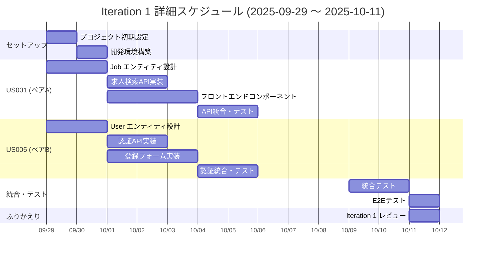

# Iteration 1 詳細計画 - React Job Board Application

## イテレーション概要

### イテレーションゴール
**「求職者が基本的な求人検索を行い、ユーザー登録してサービスを利用開始できる」**

基礎的な求人検索機能とユーザー認証の仕組みを構築し、MVP の土台を確立する。

### 実装対象ユーザーストーリー

| ID | ユーザーストーリー | SP | 優先度 | 担当ペア |
|----|--------------------|----|---------|-----------| 
| US001 | 基本的な求人検索 | 5 | P1 | ペアA |
| US005 | ユーザー登録 | 5 | P1 | ペアB |

**合計ストーリーポイント**: 10SP  
**期間**: 2025-09-29 ～ 2025-10-11 (10営業日)  
**チームベロシティ**: 10SP/イテレーション

---

## XP 実践計画

### 主要プラクティス

1. **ペアプログラミング**: 全コード実装をペアで実施
2. **テスト駆動開発（TDD）**: Red-Green-Refactorサイクル徹底
3. **継続的インテグレーション**: 毎日のコード統合とビルド
4. **リファクタリング**: 継続的なコード品質改善
5. **小さなリリース**: イテレーション終了時にデプロイ可能な状態

### チーム構成

| 役割 | 担当者 | 責任範囲 |
|------|--------|-----------| 
| Coach | 未定 | XP実践指導、阻害要因除去 |
| プロダクトオーナー | 未定 | ビジネス価値定義、受け入れテスト |
| ペアA | 未定 | US001 実装（フロントエンド重点） |
| ペアB | 未定 | US005 実装（認証・API重点） |

---

## 詳細タスク分解

### US001: 基本的な求人検索（5SP）

#### 受け入れ条件
- [ ] 検索ボックスに職種名を入力できる
- [ ] 検索ボタンをクリックして検索を実行できる
- [ ] 検索結果が一覧形式で表示される
- [ ] 各求人項目に職種名、企業名、勤務地が表示される
- [ ] 検索結果が0件の場合、適切なメッセージが表示される

#### タスク詳細 (40理想時間)

| タスク ID | タスク名 | 担当 | 見積り(h) | 依存関係 |
|-----------|----------|------|-----------|----------|
| T001-01 | プロジェクト初期セットアップ | ペアA | 4h | - |
| T001-02 | Job エンティティ設計・実装 | ペアA | 6h | T001-01 |
| T001-03 | 求人検索API設計・実装 | ペアA | 8h | T001-02 |
| T001-04 | JobSearchForm コンポーネント | ペアA | 6h | T001-01 |
| T001-05 | JobsList コンポーネント | ペアA | 6h | T001-04 |
| T001-06 | useJobs カスタムフック | ペアA | 4h | T001-05 |
| T001-07 | API統合テスト | ペアA | 4h | T001-03, T001-06 |
| T001-08 | E2Eテストシナリオ | ペアA | 2h | T001-07 |

#### 技術仕様詳細

```typescript
// API設計
GET /api/jobs?position={keyword}&page={number}&limit={number}

// Response
{
  jobs: Array<{
    id: string;
    title: string;
    company: string;
    location: string;
    employmentType: string;
    postedDate: Date;
    description: string;
  }>;
  pagination: {
    total: number;
    page: number;
    limit: number;
  };
}

// フロントエンド構造
src/
├── components/
│   ├── JobSearchForm.tsx
│   ├── JobsList.tsx
│   └── JobItem.tsx
├── hooks/
│   └── useJobs.ts
├── types/
│   └── job.ts
└── pages/
    └── JobSearchPage.tsx
```

---

### US005: ユーザー登録（5SP）

#### 受け入れ条件
- [ ] メールアドレス、パスワード、確認パスワードを入力できる
- [ ] パスワード強度チェックが機能する
- [ ] メールアドレスの重複チェックが行われる
- [ ] 利用規約とプライバシーポリシーに同意できる
- [ ] 登録完了後、確認メールが送信される

#### タスク詳細 (40理想時間)

| タスク ID | タスク名 | 担当 | 見積り(h) | 依存関係 |
|-----------|----------|------|-----------|----------|
| T005-01 | User エンティティ設計・実装 | ペアB | 6h | - |
| T005-02 | 認証API設計・実装 | ペアB | 8h | T005-01 |
| T005-03 | JWT認証ミドルウェア | ペアB | 6h | T005-02 |
| T005-04 | UserRegisterForm コンポーネント | ペアB | 8h | - |
| T005-05 | バリデーション機能 | ペアB | 4h | T005-04 |
| T005-06 | メール送信機能 | ペアB | 4h | T005-02 |
| T005-07 | 認証統合テスト | ペアB | 2h | T005-03, T005-05 |
| T005-08 | E2Eテストシナリオ | ペアB | 2h | T005-07 |

#### 技術仕様詳細

```typescript
// API設計
POST /api/auth/register
{
  email: string;
  password: string;
  confirmPassword: string;
  agreeToTerms: boolean;
}

// Response
{
  success: boolean;
  message: string;
  user?: {
    id: string;
    email: string;
    role: 'job_seeker' | 'recruiter' | 'admin';
  };
}

// フロントエンド構造
src/
├── components/
│   ├── UserRegisterForm.tsx
│   ├── PasswordStrengthMeter.tsx
│   └── TermsAgreement.tsx
├── hooks/
│   └── useAuth.ts
├── utils/
│   └── validation.ts
└── pages/
    └── RegisterPage.tsx
```

---

## イテレーションスケジュール

### 全体スケジュール



### デイリースタンドアップ

**時間**: 毎日 9:00-9:15 (15分間)  
**参加者**: 全チームメンバー  
**フォーマット**:
- 昨日やったこと
- 今日やること  
- 困っていること・阻害要因

### ペア交代スケジュール

| 期間 | ペアA | ペアB |
|------|-------|-------|
| Day 1-3 | 開発者1 + 開発者2 | 開発者3 + 開発者4 |
| Day 4-6 | 開発者1 + 開発者3 | 開発者2 + 開発者4 |
| Day 7-10 | 開発者1 + 開発者4 | 開発者2 + 開発者3 |

---

## 品質管理

### テスト戦略

#### ユニットテスト (Jest + React Testing Library)
- **対象**: ビジネスロジック、バリデーション、カスタムフック
- **カバレッジ**: 90%以上
- **実行頻度**: コミット毎

#### 統合テスト (Supertest)
- **対象**: API エンドポイント、認証フロー
- **カバレッジ**: 主要API 100%
- **実行頻度**: 1日1回

#### E2Eテスト (Playwright)
- **対象**: ユーザーシナリオ、受け入れ条件
- **カバレッジ**: クリティカルパス 100%
- **実行頻度**: デプロイ前

### Definition of Done

各ユーザーストーリーの完了基準:
- [ ] 全受け入れ条件がテストでパス
- [ ] ユニットテストカバレッジ90%以上
- [ ] 統合テスト実装・パス
- [ ] E2Eテスト実装・パス
- [ ] コードレビュー完了
- [ ] プロダクトオーナー受け入れ完了
- [ ] ドキュメント更新完了

---

## 技術リスク・対策

### 主要リスク

| リスク | 影響度 | 発生確率 | 対策 |
|--------|--------|----------|------|
| JWT認証実装の複雑化 | 高 | 中 | 早期スパイクで検証、サンプル実装 |
| API設計の変更 | 中 | 中 | OpenAPI仕様先行作成、モック活用 |
| UI/UX の要求変更 | 中 | 高 | プロトタイプ先行作成、頻繁な確認 |
| 外部ライブラリの学習コスト | 低 | 高 | ペアプログラミングでの知識共有 |

### 技術的負債管理

1. **継続的リファクタリング**: 毎日最低30分のリファクタリング時間確保
2. **コード品質チェック**: ESLint, Prettier の厳格な適用
3. **アーキテクチャ決定記録**: 重要な技術選択をADRで文書化

---

## コミットメント

### チーム合意事項

- [ ] 各ペアは担当ユーザーストーリーの完了を約束する
- [ ] 毎日のスタンドアップに参加し、進捗を透明に報告する  
- [ ] 困った時は即座にチームに相談し、助け合う
- [ ] TDD を徹底し、品質に妥協しない
- [ ] 10/11 の振り返りで改善点を honest に議論する

### 成功指標

- [ ] **機能性**: US001, US005 の受け入れ条件 100% 達成
- [ ] **品質性**: テストカバレッジ目標達成、バグゼロ
- [ ] **技術性**: 次イテレーションの基盤として再利用可能
- [ ] **チーム**: ペアプログラミングでの知識共有促進

---

## 次イテレーションへの引き継ぎ

### 完了予定成果物

1. **動作するソフトウェア**
   - 求人検索機能（フロントエンド + API）
   - ユーザー登録機能（フロントエンド + API）

2. **技術基盤**
   - プロジェクト構成とビルド設定
   - 認証の仕組みとJWT実装
   - テスト環境とCI/CD設定

3. **ドキュメント**
   - API仕様書 (OpenAPI)
   - コンポーネント設計書
   - セットアップ手順書

### Iteration 2 への提言

- ログイン機能(US006) はUS005の認証基盤を活用して高速実装可能
- 求人詳細表示(US003) はUS001の一覧表示を拡張して実装
- UI/UX の統一性を保つため、デザインシステムの早期構築を推奨

---

## ふりかえり準備

### KPT形式での振り返り項目

#### Keep (良かったこと)
- XP実践で効果的だったプラクティス
- ペアプログラミングでの学び
- チームワークの良い事例

#### Problem (改善すべきこと)
- 技術的な課題・困難
- プロセスの非効率性
- コミュニケーションの課題

#### Try (次に試すこと)
- 新しい技術・ツール
- プロセス改善策
- チーム運営の改善

**ふりかえり日時**: 2025-10-11 15:00-16:00  
**ファシリテーター**: Coach  
**結果記録**: @docs/development/iteration_1_retrospective.md

---

*この計画書は生きた文書として、イテレーション中に必要に応じて更新されます。*

**最終更新**: 2025-09-11  
**承認**: チーム全員の合意済み  
**次回レビュー**: 2025-10-04 (イテレーション中間地点)