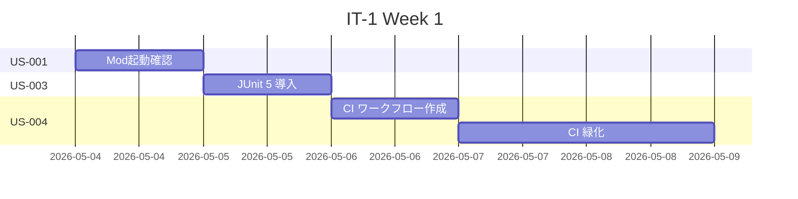
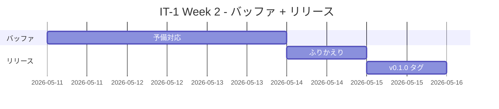
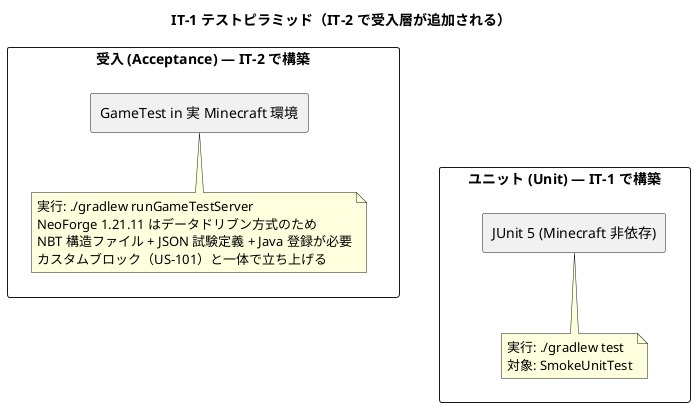
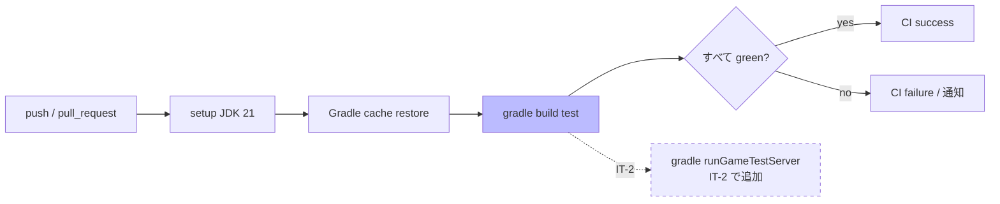

# イテレーション 1 計画 — 起動と JUnit / CI 確立（v0.1.0 MVP）

## 概要

| 項目 | 内容 |
|------|------|
| **イテレーション** | IT-1 |
| **期間** | Week 1-2（2 週間, 2026-05-04 〜 2026-05-17） |
| **ゴール** | Mod が起動し、JUnit ユニットテスト・GitHub Actions CI が緑になっている状態を作る。GameTest 受入テストの実装は IT-2 へ移送（新 API がデータドリブン方式に刷新されており、構造 NBT を伴う実用ストーリー＝カスタムブロックと一緒に確立した方が自然なため） |
| **目標 SP** | 5 SP |

---

## ゴール

### イテレーション終了時の達成状態

1. **起動確認**: `./gradlew runClient` で Minecraft クライアントが起動し、Mod ID `aipe` の登録ログが確認できる。
2. **ユニットテスト基盤**: `./gradlew test` で JUnit 5 サンプルテストが green。
3. **CI 自動化**: GitHub Actions で push / PR 時に `./gradlew build test` が自動実行され、緑バッジが PR に表示される。

### 成功基準

- [ ] US-001 / US-003 / US-004 すべての受入条件を満たす
- [ ] `runClient` 起動ログに Mod ID が確認できる
- [ ] `gradle test` の終了コードが 0
- [ ] `.github/workflows/ci.yml` の最新 run が success
- [ ] `release_plan.md` の進捗欄が更新されている

> US-002（GameTest 受入ハーネス）は IT-2 に移動。NeoForge 1.21.11 では GameTest API がデータドリブン方式に刷新されており、構造 NBT が必須となるため、カスタムブロック（US-101）の実用構造と一体で立ち上げる方が合理的と判断した。

---

## ユーザーストーリー

### 対象ストーリー

| ID | ユーザーストーリー | SP | 優先度 |
|----|-------------------|----|----|
| US-001 | Mod がクライアントで起動することを確認したい | 2 | 必須 |
| US-003 | JUnit 5 によるユニットテスト環境が欲しい | 1 | 必須 |
| US-004 | CI で JUnit テストを自動実行したい（GameTest は IT-2 で追加） | 2 | 必須 |
| **合計** | | **5** | |

> US-002 は IT-2 へ移動。`docs/development/iteration_plan-2.md` 作成時に、IT-2 のスコープに `runGameTestServer` を CI に追加するタスクも含める。

### ストーリー詳細

#### US-001: Mod がクライアントで起動することを確認したい

**ストーリー**:
> Modder として、Mod がクライアントで起動することを確認したい。なぜなら以降のすべてのストーリーの土台になるからだ。

**受入条件**:

1. `./gradlew runClient` を実行すると Minecraft 1.21.11 クライアントが起動する。
2. ログに Mod ID `aipe`（または確定した名称）が "Mod loaded" 系メッセージで出力される。
3. Mod ID 確定（`apps/aipe/src/main/java/com/k2works/aipe/AiProgrammingExercise.java` の MODID 定数 / `META-INF/neoforge.mods.toml`）。
4. Mod 登録の最終的な自動保証は IT-2 で SmokeGameTest が緑になった時点で確立する（IT-1 範囲外）。IT-1 では `runClient` の目視確認が受入手段となる。

#### US-003: JUnit 5 によるユニットテスト環境が欲しい

**ストーリー**:
> Modder として、JUnit 5 によるユニットテストを書ける環境が欲しい。なぜなら Minecraft 非依存のロジック層は速く回したいからだ。

**受入条件**:

1. `apps/aipe/build.gradle` に JUnit 5（`org.junit.jupiter:junit-jupiter`）の `testImplementation` 依存を追加。
2. `apps/aipe/src/test/java/com/k2works/aipe/SmokeUnitTest.java` にサンプルアサーション 1 件。
3. `./gradlew test` で green、終了コード 0。
4. `useJUnitPlatform()` がテストタスクで有効化されている。

#### US-004: CI で JUnit テストを自動実行したい（GameTest は IT-2 で追加）

**ストーリー**:
> CI として、push / PR 時にビルドと JUnit ユニットテストを自動で回したい。なぜなら個人開発でもデグレを早期検知したいからだ。GameTest 受入テストは IT-2 で `runGameTestServer` ステップを追加する。

**受入条件**:

1. `.github/workflows/ci.yml` を新規作成。
2. トリガ: `push`（main、minecraft/* ブランチ）、`pull_request`。
3. ジョブ: `ubuntu-latest` 上で JDK 21 セットアップ → `./gradlew --no-daemon build test`。
4. Gradle キャッシュ・依存ダウンロードを高速化する設定。
5. 初回 run が success になる。
6. IT-2 で `runGameTestServer` ステップを追加する想定で、ワークフローはステップ追加が容易な構造にしておく。

### タスク

#### 1. US-001: Mod 起動確認（2 SP）

| # | タスク | 見積もり | 状態 |
|---|--------|---------|------|
| 1.1 | `apps/aipe` のパッケージ命名・MODID を最終確認（`aipe` で確定） | 0.5h | [ ] |
| 1.2 | `runClient` を実行し起動ログを確認、スクリーンショットを `docs/journal/` に保存 | 1h | [ ] |
| 1.3 | 起動確認手順を `docs/journal/it1-bootstrap.md` に記録 | 0.5h | [ ] |

**小計**: 2h

> US-002（GameTest 最小サンプル）は IT-2 へ移動済み。詳細は `iteration_plan-2.md` で記載予定。

#### 2. US-003: JUnit 5 セットアップ（1 SP）✅ 完了

| # | タスク | 見積もり | 状態 |
|---|--------|---------|------|
| 3.1 | `build.gradle` に JUnit 5 依存追加 + `useJUnitPlatform()` 設定 | 0.5h | [x] |
| 3.2 | `SmokeUnitTest.java` 実装（`assertEquals(2, 1+1)` 程度） | 0.3h | [x] |
| 3.3 | `./gradlew test` を実行し緑化確認 | 0.2h | [x] |

**小計**: 1h
**実績**: BUILD SUCCESSFUL in 24s, 1 test passed (2026-05-02)

#### 3. US-004: GitHub Actions CI（2 SP）

| # | タスク | 見積もり | 状態 |
|---|--------|---------|------|
| 3.1 | ワークフローファイル（`.github/workflows/ci.yml`）作成 | 1h | [ ] |
| 3.2 | JDK 21 セットアップ + Gradle キャッシュ設定 | 0.5h | [ ] |
| 3.3 | テスト実行コマンドの調整（`--no-daemon`, `build test`） | 0.5h | [ ] |
| 3.4 | 初回 run の green 化（必要に応じて trial-and-error） | 1.5h | [ ] |

**小計**: 3.5h

#### タスク合計

| カテゴリ | SP | 理想時間 | 状態 |
|---------|----|----|------|
| US-001 起動確認 | 2 | 2h | [ ] |
| US-003 JUnit 5 セットアップ | 1 | 1h | [x] |
| US-004 CI 自動化 | 2 | 3.5h | [ ] |
| **合計** | **5** | **6.5h** | |

**1 SP あたり**: 約 1.3h
**進捗率**: 20%（1/5 SP）

---

## スケジュール

### Week 1（Day 1-5）



| 日 | タスク |
|----|--------|
| Day 1 | US-001 起動確認、Mod ID 確定 |
| Day 2 | US-003 JUnit 5 セットアップ |
| Day 3 | US-004 CI ワークフロー作成 |
| Day 4 | US-004 CI 緑化（trial-and-error） |
| Day 5 | US-004 CI 緑化 / バッファ |

### Week 2（Day 6-10 / バッファ）



| 日 | タスク |
|----|--------|
| Day 6-8 | バッファ（Week 1 で予期せぬ問題があれば対応） |
| Day 9 | ふりかえり（KPT） |
| Day 10 | 統合確認、v0.1.0 タグ付け、IT-2 計画作成準備 |

> 元計画より 5 SP 縮小したため、Week 2 はバッファ余裕があり。早期完了の場合は IT-2 着手準備（GameTest API 調査・データジェネレーター調査）に充てる。

---

## 設計

> **テンプレート逸脱の注**: 本プロジェクトは Minecraft Mod（NeoForge）であり、Web アプリ前提のテンプレート設計サブセクションのうち「ドメインモデル」「データモデル」「ユーザーインターフェース（ビュー / モデル / インタラクション）」「API 設計」「データベーススキーマ」は N/A のため省略する。Mod 固有の設計関心事として「ディレクトリ構成」「テスト戦略」「CI ワークフロー」「ADR」を記述する。後続 IT で Domain ロジック層が育った段階で、必要に応じて `docs/design/domain-model.md` を起こす。

### ディレクトリ構成（IT-1 完了時点）

```
apps/aipe/
├── build.gradle                 # JUnit 5 依存追加
├── gradle.properties
├── src/
│   ├── main/
│   │   ├── java/com/k2works/aipe/
│   │   │   ├── AiProgrammingExercise.java        # 既存（MODID 確定）
│   │   │   ├── AiProgrammingExerciseClient.java  # 既存
│   │   │   └── Config.java                       # 既存
│   │   └── resources/
│   │       └── (META-INF はテンプレート経由で生成)
│   └── test/
│       └── java/com/k2works/aipe/
│           └── SmokeUnitTest.java                # 新規（JUnit 5）
.github/
└── workflows/
    └── ci.yml                                    # 新規
docs/
├── development/
│   ├── release_plan.md                           # 既存
│   └── iteration_plan-1.md                       # 本ドキュメント
└── journal/
    ├── it1-bootstrap.md                          # 新規（任意）
    └── it1-gametest.md                           # 新規（任意）
```

### テスト戦略（IT-1 で確立 / IT-2 で完成）



### CI ワークフロー概念



### ADR（IT-1 で記録すべき意思決定候補）

| ADR | タイトル | ステータス |
|-----|---------|-----------|
| ADR-001 | 受入テスト基盤として NeoForge GameTest を採用する（API 刷新を踏まえた採用根拠） | 提案 |
| ADR-002 | CI は GitHub Actions を採用、ヘッドレス実行で Gradle build/test を回す | 提案 |
| ADR-003 | GameTest 実装を IT-2 へ移送した経緯（NeoForge 1.21.11 API 刷新の影響） | 提案 |

> ADR は IT-1 終了時にまとめて起票する。

---

## リスクと対策

| リスク | 影響度 | 対策 |
|--------|--------|------|
| Gradle 初回ビルドが CI で長時間化（>30 分） | 中 | Gradle キャッシュ設定、必要なら `actions/cache` で `~/.gradle` を共有 |
| Mod 起動時のログ出力が想定 ID と異なる（既定の `examplemod` のままなど） | 低 | Day 1 で MODID を `aipe` に統一・確認 |
| IT-1 完了後の IT-2 で GameTest API 学習に時間がかかる | 高 | IT-1 のバッファ期間（Week 2）で API 調査を前倒し |

---

## 完了条件

### Definition of Done（IT-1 全体）

- [ ] US-001 / US-003 / US-004 のすべての受入条件を満たす
- [ ] `./gradlew test` 緑
- [ ] `.github/workflows/ci.yml` の最新 run が緑
- [ ] `release_plan.md` の進捗欄を IT-1 実績で更新
- [ ] `docs/development/retrospective-1.md` 作成
- [ ] v0.1.0 タグ付け（`developing-release` スキルで実施）

### デモ項目

1. `./gradlew runClient` で Minecraft 起動、ログに Mod ID `aipe` が表示される
2. `./gradlew test` で JUnit テストが green
3. GitHub Actions の最新 run が緑（PR 上のチェックマーク）

> GameTest 関連デモは IT-2 でカスタムブロックと一体で実施する。

---

## 更新履歴

| 日付 | 更新内容 | 更新者 |
|------|---------|--------|
| 2026-05-02 | 初版作成 | self |
| 2026-05-02 | NeoForge 1.21.11 GameTest API 刷新の発見により US-002 を IT-2 へ移送、SP を 8 → 5 に縮小 | self |

---

## 関連ドキュメント

- [リリース計画](./release_plan.md)
- [ユーザーストーリー](../requirements/user_stories.md)
- [インセプションデッキ](../strategy/inception_deck.md)
- [イテレーション 1 ふりかえり](./retrospective-1.md)（IT-1 終了時に作成）
