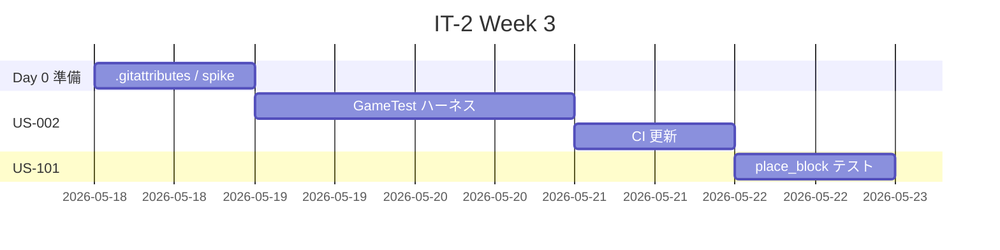
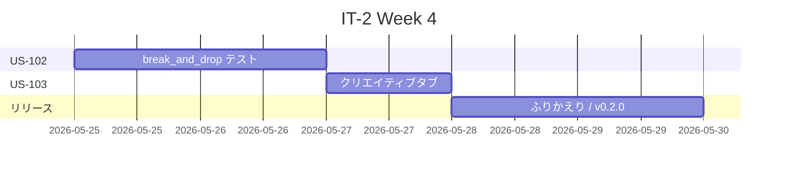
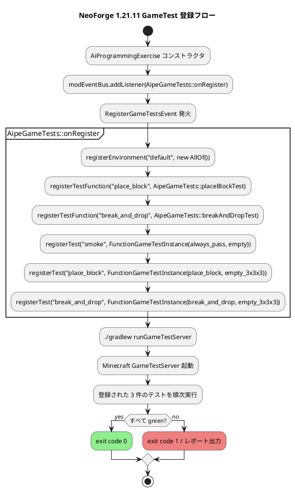
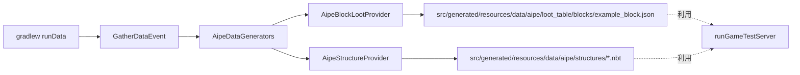

# イテレーション 2 計画 — GameTest ハーネス確立 + カスタムブロック（v0.2.0）

## 概要

| 項目 | 内容 |
|------|------|
| **イテレーション** | IT-2 |
| **期間** | Week 3-4（2 週間, 2026-05-18 〜 2026-05-31） |
| **ゴール** | NeoForge 1.21.11 のデータドリブン GameTest ハーネスを確立し、カスタムブロックの設置・破壊・クリエイティブタブ表示が GameTest で自動保護される状態を作る |
| **目標 SP** | 11 SP |

---

## ゴール

### イテレーション終了時の達成状態

1. **GameTest ハーネス確立**: `./gradlew runGameTestServer` が green。NeoForge 新 API（`RegisterGameTestsEvent` + `FunctionGameTestInstance` + 空 NBT）で最小サンプルが自動実行される。
2. **カスタムブロック導入**: `aipe:example_block` がワールドに設置・破壊・回収できる。GameTest で `setBlock` / `assertBlock` / `breakBlock` の動作が保護されている。
3. **クリエイティブタブ表示**: ブロックが `BUILDING_BLOCKS` タブと独自 `aipe:example_tab` から取得できる。
4. **CI 更新**: `aipe-ci.yml` に `runGameTestServer` ステップが追加され、push / PR 時に受入テストも自動実行される。
5. **`.gitattributes` 整備**: IT-1 ふりかえりの Try アクションを実装。`gradlew text eol=lf` で実行ビット欠落の再発を防ぐ。

### 成功基準

- [ ] `./gradlew runGameTestServer` 緑（最低 4 件の GameTest が green）
- [ ] `./gradlew test` 緑（既存 JUnit + 必要に応じて純ロジックテスト）
- [ ] `aipe-ci.yml` の最新 run が緑（build / test / runGameTestServer 全ステップ）
- [ ] `runClient` でクリエイティブモードに入り、`example_block` を BUILDING_BLOCKS タブと EXAMPLE_TAB から取得できる
- [ ] `release_plan.md` の進捗欄が IT-2 実績で更新される
- [ ] `retrospective-2.md` 作成、ベロシティ実績（IT-1=5 SP / IT-2=実績）を記録

---

## ユーザーストーリー

### 対象ストーリー

| ID | ユーザーストーリー | SP | 優先度 |
|----|-------------------|----|----|
| US-002 | GameTest の最小サンプルが自動実行される（NeoForge データドリブン API） | 3 | 必須 |
| US-101 | カスタムブロックをワールドに設置したい | 3 | 必須 |
| US-102 | 設置したカスタムブロックを破壊して回収したい | 3 | 必須 |
| US-103 | クリエイティブインベントリからカスタムブロックを取得したい | 2 | 中 |
| **合計** | | **11** | |

### ストーリー詳細

#### US-002: GameTest の最小サンプルが自動実行される

**ストーリー**:
> Modder として、GameTest の最小サンプルが自動実行されることを確認したい。なぜなら受入テスト基盤が機能していなければ TDD が回らないからだ。

**受入条件**:

1. `RegisterGameTestsEvent` リスナーを Mod イベントバスに登録する。
2. `TestEnvironmentDefinition`（最小：`AllOf` 空）を 1 件登録する。
3. `FunctionGameTestInstance` を 1 件登録（`minecraft:always_pass` を流用）。
4. `data/aipe/structures/empty.nbt`（1×1×1 / 空気）を NeoForge データジェネレーター（`./gradlew runData`）または手動で用意する。
5. `./gradlew runGameTestServer` で実行され、終了コード 0 で完了する。
6. CI ワークフローに `runGameTestServer` ステップが追加され緑になる。

**設計指針**:

- 登録コードは `com.k2works.aipe.gametest.AipeGameTests` クラスに集約。
- 構造ファイルパスは `Identifier.fromNamespaceAndPath(MODID, "empty")` で参照。
- データジェネレーターのアプローチが煩雑なら、`StructureTemplate` API で空構造を生成し `runData` 経由で書き出す方法を検討。

#### US-101: カスタムブロックをワールドに設置したい

**ストーリー**:
> プレイヤーとして、新しいカスタムブロックをワールドに設置したい。なぜなら Mod の存在を実感できる最初の要素だからだ。

**受入条件**:

1. `aipe:example_block` がレジストリに登録されている（既存テンプレートを活用）。
2. GameTest: 指定座標（`new BlockPos(0, 1, 0)` 等）に `helper.setBlock(...)` でカスタムブロックを設置し、`helper.assertBlock(...)` で配置後のブロックタイプが期待値であることを検証。
3. テスト関数を `Consumer<GameTestHelper>` として登録し、`FunctionGameTestInstance` から参照する。

**設計指針**:

- US-002 で確立した登録パターンに従い、`aipe:place_block` テスト関数を追加。
- 必要なら GameTest 構造を 3×3×3 に拡張（`empty_3x3x3.nbt`）。

#### US-102: 設置したカスタムブロックを破壊して回収したい

**ストーリー**:
> プレイヤーとして、設置したカスタムブロックを破壊して回収したい。なぜならブロックが普通のブロックとして振る舞うことを期待するからだ。

**受入条件**:

1. `data/aipe/loot_table/blocks/example_block.json`（drop self）を作成（データジェネレーターで生成可）。
2. GameTest: ブロック設置 → 破壊 → ドロップエンティティが期待のアイテム（`example_block` BlockItem）であることを `helper.assertEntityNotPresent` の逆 / `helper.assertItemEntityPresent` 系で検証。
3. テスト関数 `aipe:break_and_drop` を登録。

**設計指針**:

- ドロップ検証は `helper.assertItemEntityCountIs(...)` を使用（最新 API では別名の可能性あり、spike で確認）。
- ブロックの `Properties.requiresCorrectToolForDrops()` は付けない（手で壊せる単純ブロック）。

#### US-103: クリエイティブインベントリからカスタムブロックを取得したい

**ストーリー**:
> プレイヤーとして、クリエイティブインベントリからカスタムブロックを取得したい。なぜなら手動確認時に毎回コマンドを打つのは面倒だからだ。

**受入条件**:

1. `BUILDING_BLOCKS` タブにブロックが登録されている（既存 `addCreative` メソッドを活用）。
2. 独自 `aipe:example_tab` に `example_block` も追加する（現状は `EXAMPLE_ITEM` のみ）。
3. `runClient` で目視確認できる手順を `docs/journal/it2-creative-tab.md` に記録。
4. （任意）`CreativeModeTab.getDisplayItems()` に `example_block` が含まれることをユニットテストで検証。

---

### タスク

#### 0. IT-2 開始準備（ふりかえり Try 反映 / 0 SP）

| # | タスク | 見積もり | 状態 |
|---|--------|---------|------|
| 0.1 | `.gitattributes` を追加（`gradlew text eol=lf`、`*.bat eol=crlf`、`*.md text eol=lf` 等） | 0.5h | [ ] |
| 0.2 | GameTest 新 API の 30 分 spike — `RegisterGameTestsEvent` 登録例の最小コードを書いて疎通確認 | 0.5h | [ ] |
| 0.3 | NBT 自動生成方法の確認 — NeoForge `runData` のドキュメント / 既存例調査 | 0.5h | [ ] |

**小計**: 1.5h（IT-2 着手前 Day 0 / SP には含まない）

#### 1. US-002: GameTest 最小サンプル（3 SP）

| # | タスク | 見積もり | 状態 |
|---|--------|---------|------|
| 1.1 | `AipeGameTests` クラスを作成し `RegisterGameTestsEvent` リスナーを Mod 主クラスから登録 | 1h | [ ] |
| 1.2 | `TestEnvironmentDefinition` 最小登録（`AllOf` 空 or 既定環境） | 0.5h | [ ] |
| 1.3 | `FunctionGameTestInstance`（`minecraft:always_pass` 流用）を 1 件登録 | 1h | [ ] |
| 1.4 | NBT 構造（1×1×1 空気）を `runData` で生成 OR `StructureTemplate` API で実装 | 1.5h | [ ] |
| 1.5 | `./gradlew runGameTestServer` 緑化確認 | 0.5h | [ ] |
| 1.6 | `aipe-ci.yml` に `runGameTestServer` ステップ追加、CI 緑化 | 1h | [ ] |
| 1.7 | `docs/journal/it2-gametest.md` に手順記録 | 0.5h | [ ] |

**小計**: 6h

#### 2. US-101: ブロック設置 GameTest（3 SP）

| # | タスク | 見積もり | 状態 |
|---|--------|---------|------|
| 2.1 | `aipe:place_block` テスト関数を `Consumer<GameTestHelper>` で登録 | 1h | [ ] |
| 2.2 | テスト構造を 3×3×3 に拡張（`empty_3x3x3.nbt` 生成） | 1h | [ ] |
| 2.3 | GameTest メソッド: `setBlock` → `assertBlock` → `helper.succeed()` | 1.5h | [ ] |
| 2.4 | `runGameTestServer` 緑化確認 | 0.5h | [ ] |

**小計**: 4h

#### 3. US-102: ブロック破壊・回収 GameTest（3 SP）

| # | タスク | 見積もり | 状態 |
|---|--------|---------|------|
| 3.1 | `data/aipe/loot_table/blocks/example_block.json`（drop self）作成 — データジェネレーター活用 | 1h | [ ] |
| 3.2 | `aipe:break_and_drop` テスト関数登録 | 1h | [ ] |
| 3.3 | GameTest メソッド: 設置 → `breakBlock` → ドロップ確認 | 1.5h | [ ] |
| 3.4 | `runGameTestServer` 緑化確認 | 0.5h | [ ] |

**小計**: 4h

#### 4. US-103: クリエイティブタブ確認（2 SP）

| # | タスク | 見積もり | 状態 |
|---|--------|---------|------|
| 4.1 | 独自 `EXAMPLE_TAB` の `displayItems` に `example_block` を追加 | 0.5h | [ ] |
| 4.2 | `runClient` での目視確認手順を `docs/journal/it2-creative-tab.md` に記録 | 0.5h | [ ] |
| 4.3 | （任意）`CreativeModeTab.getDisplayItems()` のユニットテスト | 1h | [ ] |

**小計**: 2h（任意タスク含めて）

#### タスク合計

| カテゴリ | SP | 理想時間 | 状態 |
|---------|----|----|------|
| Day 0 準備（.gitattributes / spike） | 0 | 1.5h | [ ] |
| US-002 GameTest ハーネス | 3 | 6h | [ ] |
| US-101 ブロック設置 | 3 | 4h | [ ] |
| US-102 ブロック破壊・回収 | 3 | 4h | [ ] |
| US-103 クリエイティブタブ | 2 | 2h | [ ] |
| **合計** | **11** | **17.5h** | |

**1 SP あたり**: 約 1.6h
**進捗率**: 0%（0/11 SP）

---

## スケジュール

### Week 3（Day 1-5）



| 日 | タスク |
|----|--------|
| Day 1 | Day 0 準備（.gitattributes、GameTest spike、NBT 生成方法確認） |
| Day 2-3 | US-002 タスク 1.1〜1.5（GameTest ハーネス確立） |
| Day 4 | US-002 タスク 1.6〜1.7（CI 更新 / journal） |
| Day 5 | US-101 タスク 2.1〜2.4（ブロック設置テスト） |

### Week 4（Day 6-10）



| 日 | タスク |
|----|--------|
| Day 6-7 | US-102 タスク 3.1〜3.4（ブロック破壊・回収テスト） |
| Day 8 | US-103 タスク 4.1〜4.3（クリエイティブタブ） |
| Day 9 | バッファ / 統合確認 / journal 整備 |
| Day 10 | retrospective-2.md / v0.2.0 タグ付け |

---

## 設計

> **テンプレート逸脱の注**: 本プロジェクトは Minecraft Mod（NeoForge）であり、Web アプリ前提のテンプレート設計サブセクションのうち「ドメインモデル（DDD 戦術設計）」「データモデル（DB）」「ユーザーインターフェース（Web ビュー）」「API 設計」「データベーススキーマ」は N/A のため省略する。Mod 固有の設計関心事として「クラス構成」「GameTest 登録フロー」「データ生成構成」「ADR」を記述する。

### クラス構成（IT-2 完了時点）

```
apps/aipe/
├── build.gradle                                  # 既存（runData 設定確認）
├── src/
│   ├── main/
│   │   ├── java/com/k2works/aipe/
│   │   │   ├── AiProgrammingExercise.java        # 既存。RegisterGameTestsEvent 登録呼び出し追加
│   │   │   ├── AiProgrammingExerciseClient.java  # 既存
│   │   │   ├── Config.java                       # 既存
│   │   │   ├── gametest/
│   │   │   │   └── AipeGameTests.java            # 新規（テスト関数登録 + Instance 登録）
│   │   │   └── data/
│   │   │       ├── AipeDataGenerators.java       # 新規（GatherDataEvent エントリ）
│   │   │       ├── AipeBlockLootProvider.java    # 新規（loot table 生成）
│   │   │       └── AipeStructureProvider.java    # 新規（empty.nbt 生成 / 必要なら）
│   │   └── resources/
│   │       └── (META-INF はテンプレート経由で生成)
│   ├── generated/resources/                      # 自動生成（.gitignore 済み）
│   │   └── data/aipe/
│   │       ├── structures/
│   │       │   ├── empty.nbt
│   │       │   └── empty_3x3x3.nbt
│   │       └── loot_table/blocks/
│   │           └── example_block.json
│   └── test/
│       └── java/com/k2works/aipe/
│           └── SmokeUnitTest.java                # 既存
.github/workflows/
└── aipe-ci.yml                                   # 既存。runGameTestServer ステップ追加
.gitattributes                                    # 新規（gradlew 実行ビット保護）
```

### GameTest 登録フロー



### データ生成構成



### ADR（IT-2 で記録すべき意思決定候補）

| ADR | タイトル | ステータス |
|-----|---------|-----------|
| ADR-004 | GameTest 構造ファイルは NeoForge データジェネレーターで生成する | 提案 |
| ADR-005 | カスタムブロックの初期実装は MDK テンプレートの `EXAMPLE_BLOCK` を踏襲する | 提案 |
| ADR-006 | `.gitattributes` で `gradlew` の実行ビット欠落を防止する | 提案 |

---

## リスクと対策

| リスク | 影響度 | 対策 |
|--------|--------|------|
| NeoForge 1.21.11 の `RegisterGameTestsEvent` 公式サンプルが少なく実装に時間がかかる | 高 | Day 0 の 30 分 spike で最小コード実装を確認、ダメなら IT-2 中に「neoforge GitHub の examplemod / 公式 docs / Discord」を巡回 |
| `runData` で NBT 構造を生成する方法が想定より複雑 | 中 | フォールバックとして手動で 1×1×1 NBT バイナリを記述したスクリプトを書く（13 バイト程度の固定データ） |
| GameTest API の `assertItemEntityPresent` 等のメソッド名が刷新後の名称と異なる | 中 | spike で `GameTestHelper.class` の API を `jar tf` + ソースで確認 |
| `runGameTestServer` の CI 実行時間が長く、無料枠を圧迫 | 中 | Gradle キャッシュを利用、初回のみ長時間化を許容 |
| ベロシティ実績（IT-1=5 SP/1 日）が実態と乖離して IT-2 が長引く | 中 | バッファ Day 9 を確保、超過したら US-103 を IT-3 へ後送り |

---

## 完了条件

### Definition of Done（IT-2 全体）

- [ ] US-002 / US-101 / US-102 / US-103 のすべての受入条件を満たす
- [ ] `./gradlew test` 緑
- [ ] `./gradlew runGameTestServer` 緑（4 件以上のテストが green）
- [ ] `aipe-ci.yml` の最新 run が緑（build / test / runGameTestServer 全ステップ）
- [ ] `.gitattributes` がリポジトリに追加されている
- [ ] `release_plan.md` の進捗欄を IT-2 実績で更新
- [ ] `docs/development/retrospective-2.md` 作成
- [ ] v0.2.0 タグ付け（`developing-release` スキルで実施）
- [ ] ベロシティ実績を `release_plan.md` のベロシティ見積もりに反映

### デモ項目

1. `./gradlew runGameTestServer` でヘッドレス受入テストが 4 件 green
2. `./gradlew runClient` でクリエイティブモードに入り、`example_block` を BUILDING_BLOCKS / EXAMPLE_TAB から取得 → ワールドに設置 → 破壊して回収できる
3. `./gradlew test` で JUnit テストが green
4. GitHub Actions の最新 run が緑（build + test + runGameTestServer）

---

## 更新履歴

| 日付 | 更新内容 | 更新者 |
|------|---------|--------|
| 2026-05-02 | 初版作成（11 SP / 4 ストーリー / GameTest 新 API 対応） | self |

---

## 関連ドキュメント

- [リリース計画](./release_plan.md)
- [イテレーション 1 計画](./iteration_plan-1.md)
- [イテレーション 1 ふりかえり](./retrospective-1.md)
- [ユーザーストーリー](../requirements/user_stories.md)
- [起動確認ジャーナル](../journal/it1-bootstrap.md)
- [イテレーション 2 ふりかえり](./retrospective-2.md)（IT-2 終了時に作成）
