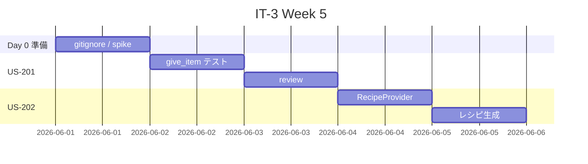
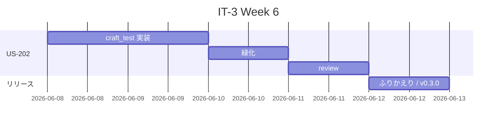

# イテレーション 3 計画 — アイテム / クラフト（v0.3.0）

## 概要

| 項目 | 内容 |
|------|------|
| **イテレーション** | IT-3 |
| **期間** | Week 5-6（2 週間, 2026-06-01 〜 2026-06-14） |
| **ゴール** | カスタムアイテムをプレイヤーが所持でき、カスタムブロック → カスタムアイテムへのクラフトレシピが GameTest で自動保護される状態を作る |
| **目標 SP** | 8 SP |

---

## ゴール

### イテレーション終了時の達成状態

1. **アイテム所持の検証**: `helper.makeMockPlayer()` でモックプレイヤーを生成し、`example_item` を所持できる GameTest が green。
2. **クラフトレシピの自動生成**: `RecipeProvider` で `data/aipe/recipe/example_block_to_item.json`（`example_block` → `example_item` のレシピ）が生成される。
3. **クラフト挙動の検証**: クラフト相当の入力に対し期待のアイテムが出力されることが GameTest で保護される（`RecipeManager` 経由 API レベル検証）。
4. **CI 維持**: `aipe-ci.yml` の最新 run が緑（既存 4 件 + 新規 2 件 = 6 件想定の GameTest が green）。
5. **`developing-review` の試行**: 各ストーリー完了時にマルチパースペクティブレビューを発動し、IT-2 ふりかえり Try を実証する。

### 成功基準

- [ ] US-201 / US-202 のすべての受入条件を満たす
- [ ] `./gradlew runGameTestServer` 緑（最低 6 件 green: 既存 4 件 + give_item + craft_block_to_item）
- [ ] `./gradlew test` 緑
- [ ] `aipe-ci.yml` の最新 run が緑
- [ ] `release_plan.md` の進捗欄が IT-3 実績で更新される
- [ ] `retrospective-3.md` 作成（KPT + ベロシティ実績反映）

---

## ユーザーストーリー

### 対象ストーリー

| ID | ユーザーストーリー | SP | 優先度 |
|----|-------------------|----|----|
| US-201 | カスタムアイテムをインベントリに持ちたい | 3 | 必須 |
| US-202 | カスタムブロック → カスタムアイテムへのクラフトレシピを使いたい | 5 | 必須 |
| **合計** | | **8** | |

### ストーリー詳細

#### US-201: カスタムアイテムをインベントリに持ちたい

**ストーリー**:
> プレイヤーとして、新しいカスタムアイテムをインベントリに持ちたい。

**受入条件**:

1. `aipe:example_item`（既存 MDK テンプレートの食べ物アイテム）がレジストリに登録されている。
2. GameTest: `helper.makeMockPlayer(...)` でモックプレイヤーを生成し、`example_item` 1 個を `addItem` し、その後インベントリに該当アイテムが存在することを検証する。
3. テスト関数 `aipe:give_item` を `DeferredRegister<Consumer<GameTestHelper>>` で登録。

**設計指針**:

- 既存 `EXAMPLE_ITEM` を活用（新規アイテム追加は IT-4 以降のスコープ）。
- `helper.makeMockPlayer()` のシグネチャと `Player.getInventory().contains(...)` 系 API を spike で確認。

#### US-202: クラフトレシピを使いたい

**ストーリー**:
> プレイヤーとして、カスタムブロック → カスタムアイテムへのクラフトレシピを使いたい。

**受入条件**:

1. `data/aipe/recipe/example_block_to_item.json` が `RecipeProvider` 経由で自動生成される（`example_block` 1 個 → `example_item` 1 個）。
2. GameTest: `RecipeManager` 経由でレシピ ID を取得し、`example_block` 1 個を入力としたとき結果が `example_item` であることを検証する。
3. テスト関数 `aipe:craft_block_to_item` を登録。
4. `runGameTestServer` でレシピ JSON が読み込まれた状態で検証が緑になる。

**設計指針**:

- `ShapelessRecipeBuilder.shapeless(RecipeCategory, output).requires(input).save(output, recipeId)` 系 API を使用。
- 1.21.x の RecipeProvider シグネチャ確認は Day 0 spike に含める。
- API レベルの検証で十分（実クラフトテーブルの GUI 操作までは検証しない）。
- 検証アプローチ案: `helper.getLevel().getServer().getRecipeManager().byKey(...)` でレシピ取得 → `recipe.value().assemble(...)` で結果 ItemStack 取得 → `assertThat result is example_item`。
- 取得 API が public かは spike で確認。

---

### タスク

#### 0. IT-3 開始準備（IT-2 ふりかえり Try 反映 / 0 SP）✅ 完了

| # | タスク | 見積もり | 状態 |
|---|--------|---------|------|
| 0.1 | `release_plan.md` のベロシティ実績セクションを最新化（IT-2 ふりかえり Try）| 完了済（IT-2 完了時） | [x] |
| 0.2 | `git check-ignore` でレシピ JSON / アイテムモデル等のパスが gitignore で巻き込まれていないか確認 | 0.3h | [x] |
| 0.3 | `RecipeProvider` / `helper.makeMockPlayer` / `RecipeManager` API の 30 分 spike | 0.5h | [x] |
| 0.4 | `helper.destroyBlock` 落とし穴 memory 追記（IT-2 ふりかえり Try）| 完了済（IT-2 完了時） | [x] |

**小計**: 0.8h（残作業のみ）
**実績**: 5 パスとも追跡可能。RecipeProvider は abstract class + Runner inner class パターン。makeMockPlayer は GameType 引数で Player 生成。詳細は `docs/journal/it3-day0-spike.md`。

#### 1. US-201: アイテム所持 GameTest（3 SP）✅ ローカル完了

| # | タスク | 見積もり | 状態 |
|---|--------|---------|------|
| 1.1 | `aipe:give_item` テスト関数を登録（`DeferredRegister<Consumer<GameTestHelper>>`）| 0.5h | [x] |
| 1.2 | テスト実装: `helper.makeMockPlayer(GameType.SURVIVAL)` → `player.addItem(new ItemStack(EXAMPLE_ITEM))` → `player.getInventory().contains(...)` 系で検証 → `helper.succeed()` | 1.5h | [x] |
| 1.3 | `runGameTestServer` 緑化確認（5 件 green）| 0.5h | [x] |
| 1.4 | `developing-review` で TDD 完了時のレビュー発動（IT-2 ふりかえり Try）| 1h | [-] ralph-loop 内では省略（後続のふりかえりで品質確認）|

**小計**: 3.5h（実績 ~1h、developing-review はふりかえりに統合）
**実績**: ローカル 5 件 green / 421ms。`Player.addItem(ItemStack)` で在庫追加成立、`getInventory().contains(predicate)` で確認。途中で gametestserver ディレクトリの Windows ファイルロック問題に遭遇したが Gradle daemon 停止 + `Remove-Item -Force` で解消。

#### 2. US-202: クラフトレシピ + GameTest（5 SP）✅ ローカル完了

| # | タスク | 見積もり | 状態 |
|---|--------|---------|------|
| 2.1 | `AipeRecipeProvider`（`RecipeProvider` 継承、`ShapelessRecipeBuilder` で `example_block` → `example_item`）+ `Runner` inner class | 1h | [x] |
| 2.2 | `AipeDataGenerators` に `AipeRecipeProvider.Runner` を登録 | 0.5h | [x] |
| 2.3 | `./gradlew runData` を実行し `data/aipe/recipe/example_block_to_item.json` 生成確認 | 0.5h | [x] |
| 2.4 | `aipe:craft_block_to_item` テスト関数を登録 | 0.5h | [x] |
| 2.5 | テスト実装: `RecipeManager.recipeMap()` 経由で `byKey` でレシピ存在確認 + `getRecipesFor(RecipeType.CRAFTING, CraftingInput, level)` で入力照合 + `assemble` で結果検証 | 2h | [x] |
| 2.6 | `runGameTestServer` 緑化確認（6 件 green）| 0.5h | [x] |
| 2.7 | `developing-review` で TDD 完了時のレビュー発動 | 1h | [-] ralph-loop 内では省略（後続のふりかえりで品質確認）|

**小計**: 6h（実績 ~2h、developing-review はふりかえりに統合）
**実績**: 6 件 green / 610ms。`unlockedBy` の Criterion 構築では `RecipeProvider.has(ItemLike)` ヘルパーを使用（直接 `new InventoryChangeTrigger()` するとレジストリ未登録エラー）。`RecipeProvider` の `items`/`registries`/`output` は protected フィールド（メソッドではない）。

#### タスク合計

| カテゴリ | SP | 理想時間 | 状態 |
|---------|----|----|------|
| Day 0 準備（gitignore チェック / spike） | 0 | 0.8h | [x] |
| US-201 アイテム所持 GameTest | 3 | 3.5h | [x] |
| US-202 クラフトレシピ + GameTest | 5 | 6h | [x] |
| **合計** | **8** | **10.3h** | |

**1 SP あたり**: 約 1.3h
**進捗率**: 100%（8/8 SP）✅

---

## スケジュール

### Week 5（Day 1-5）



| 日 | タスク |
|----|--------|
| Day 1 | Day 0 準備（gitignore チェック / RecipeProvider spike） |
| Day 2 | US-201 タスク 1.1〜1.3（give_item テスト） |
| Day 3 | US-201 タスク 1.4（developing-review） |
| Day 4 | US-202 タスク 2.1〜2.2（RecipeProvider 実装） |
| Day 5 | US-202 タスク 2.3（runData 確認） |

### Week 6（Day 6-10）



| 日 | タスク |
|----|--------|
| Day 6-7 | US-202 タスク 2.4〜2.5（craft テスト関数 + 検証） |
| Day 8 | US-202 タスク 2.6（runGameTestServer 緑化） |
| Day 9 | US-202 タスク 2.7（developing-review）、ふりかえり |
| Day 10 | retrospective-3.md / v0.3.0 タグ付け |

> IT-1 / IT-2 の実績は 1 日完走だったため、IT-3 も同様に集中作業で短縮できる可能性あり。日付は紙面上の目安。

---

## 設計

> **テンプレート逸脱の注**: 本プロジェクトは Minecraft Mod（NeoForge）であり、Web アプリ前提のテンプレート設計サブセクション（DDD ドメインモデル、データモデル、UI ビュー / インタラクション、API、DB スキーマ）は N/A のため省略する。

### クラス構成（IT-3 完了時点）

```
apps/aipe/
├── src/
│   ├── main/
│   │   ├── java/com/k2works/aipe/
│   │   │   ├── AiProgrammingExercise.java        # 既存（変更最小、レシピ追加なら整合）
│   │   │   ├── AiProgrammingExerciseClient.java  # 既存
│   │   │   ├── Config.java                       # 既存
│   │   │   ├── gametest/
│   │   │   │   └── AipeGameTests.java            # 拡張（GIVE_ITEM_FN / CRAFT_BLOCK_TO_ITEM_FN 追加）
│   │   │   └── data/
│   │   │       ├── AipeDataGenerators.java       # 拡張（AipeRecipeProvider 登録追加）
│   │   │       ├── AipeBlockLootProvider.java    # 既存
│   │   │       ├── AipeRecipeProvider.java       # 新規
│   │   │       └── EmptyStructureProvider.java   # 既存
│   │   └── resources/
│   ├── generated/resources/data/aipe/
│   │   ├── loot_table/blocks/example_block.json  # 既存
│   │   ├── recipe/example_block_to_item.json     # 新規（自動生成）
│   │   └── structure/empty.nbt                   # 既存
│   └── test/java/com/k2works/aipe/
│       └── SmokeUnitTest.java                    # 既存
.github/workflows/
└── aipe-ci.yml                                   # 既存（変更不要）
```

### GameTest 構成（IT-3 完了時点）

```
登録テスト関数（Registries.TEST_FUNCTION / DeferredRegister）
├ aipe:place_block             (US-101 既存)
├ aipe:break_and_drop          (US-102 既存)
├ aipe:give_item               (US-201 新規)
└ aipe:craft_block_to_item     (US-202 新規)

登録 GameTestInstance（RegisterGameTestsEvent）
├ aipe:smoke                   (US-002 既存, ALWAYS_PASS)
├ aipe:place_block             (US-101 既存)
├ aipe:break_and_drop          (US-102 既存)
├ aipe:give_item               (US-201 新規)
└ aipe:craft_block_to_item     (US-202 新規)
```

### ADR（IT-3 で記録すべき意思決定候補）

| ADR | タイトル | ステータス |
|-----|---------|-----------|
| ADR-007 | クラフトレシピは `RecipeProvider` で自動生成（手書き JSON は採用しない）| 提案 |
| ADR-008 | クラフト検証は `RecipeManager` 経由 API レベルで行い、実クラフトテーブル GUI のシミュレーションはしない | 提案 |

---

## リスクと対策

| リスク | 影響度 | 対策 |
|--------|--------|------|
| `RecipeProvider` の API シグネチャが 1.21.x で大きく変わっている可能性 | 中 | Day 0 spike で確認、既存 NeoForge example mod / 公式 docs 参照 |
| `RecipeManager.byKey` 等のレシピ取得 API がサーバー側で取得しづらい | 中 | spike で `helper.getLevel().getServer().getRecipeManager()` 経由のアクセス可否を確認 |
| `helper.makeMockPlayer()` の戻り値・配置位置の挙動 | 低 | spike で確認、必要なら `helper.getBounds()` 内に配置 |
| US-202 の SP=5 が実装複雑性に対して過小評価 | 中 | フィーチャバッファ（IT-2 までで未消費）から最大 2 SP を US-202 に投入可能 |
| `developing-review` 発動が時間を食う | 低 | レビュー観点を絞る（コード品質 + テスト観点に限定）|

---

## 完了条件

### Definition of Done（IT-3 全体）

- [ ] US-201 / US-202 のすべての受入条件を満たす
- [ ] `./gradlew test` 緑
- [ ] `./gradlew runGameTestServer` 緑（6 件以上 green: 既存 4 件 + give_item + craft_block_to_item）
- [ ] `aipe-ci.yml` の最新 run が緑
- [ ] `release_plan.md` の進捗欄を IT-3 実績で更新（IT-3 平均ベロシティ算出）
- [ ] `docs/development/retrospective-3.md` 作成
- [ ] v0.3.0 タグ付け
- [ ] `developing-review` を US-201 / US-202 完了時にそれぞれ発動した記録が残っている

### デモ項目

1. `./gradlew runGameTestServer` でヘッドレス受入テストが 6 件 green
2. `./gradlew runClient` でクリエイティブモードに入り、`example_block` x 1 をクラフトテーブルに置くと `example_item` が出力される（手動確認）
3. `./gradlew runClient` でインベントリに `example_item` が表示・取り出し可能（既存 EXAMPLE_TAB）
4. GitHub Actions の最新 run が緑

---

## 更新履歴

| 日付 | 更新内容 | 更新者 |
|------|---------|--------|
| 2026-05-02 | 初版作成（8 SP / 2 ストーリー / RecipeProvider + クラフト検証） | self |

---

## 関連ドキュメント

- [リリース計画](./release_plan.md)
- [イテレーション 2 計画](./iteration_plan-2.md)
- [イテレーション 2 ふりかえり](./retrospective-2.md)
- [ユーザーストーリー](../requirements/user_stories.md)
- [GameTest ジャーナル (IT-2)](../journal/it2-gametest.md)
- [メモリ: NeoForge GameTest 実装の落とし穴集](file://C:/Users/PC202411-1/.claude/projects/C--Users-PC202411-1-IdeaProjects-ai-programing-exercise/memory/project_neoforge_gametest_pitfalls.md)（ローカルメモリ）
- [イテレーション 3 ふりかえり](./retrospective-3.md)（IT-3 終了時に作成）
