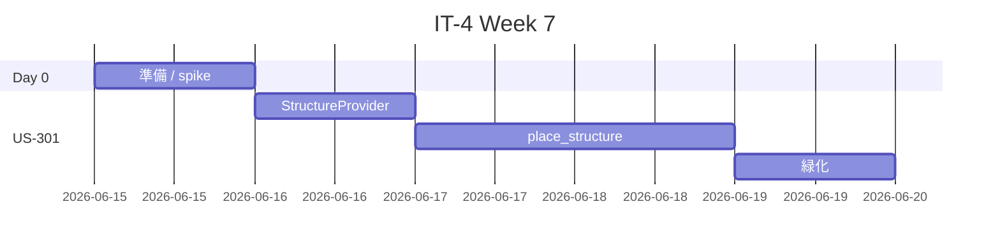
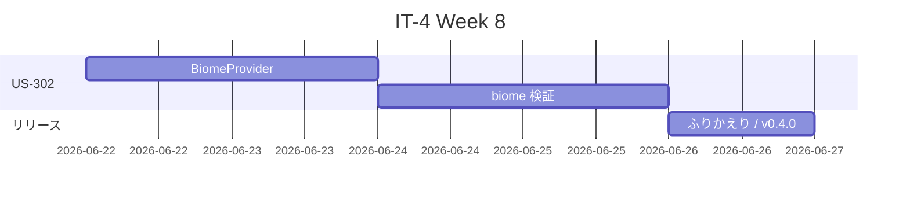

# イテレーション 4 計画 — ワールドジェン（v0.4.0）

## 概要

| 項目 | 内容 |
|------|------|
| **イテレーション** | IT-4 |
| **期間** | Week 7-8（2 週間, 2026-06-15 〜 2026-06-28） |
| **ゴール** | カスタム構造物とカスタムバイオームを Mod に追加し、双方が GameTest で自動保護される状態を作る |
| **目標 SP** | 13 SP |

---

## ゴール

### イテレーション終了時の達成状態

1. **カスタム構造物の登録**: `aipe:tower` 等のカスタム構造物が `Registries.STRUCTURE` に登録され、構造ピース（NBT 経由）を `runGameTestServer` で配置検証できる。
2. **カスタムバイオームの登録**: `aipe:custom_biome` が `Registries.BIOME` に登録され、温度・降水・カラーパレット等の基本属性が GameTest で検証される。
3. **CI 維持**: `aipe-ci.yml` で 8 件以上の GameTest が緑（既存 6 件 + US-301 + US-302）。
4. **`build.gradle` の `runGameTestServer` 前クリーンアップ**: IT-3 ふりかえり Try 反映、Windows 連続実行時のロック問題解消。

### 成功基準

- [ ] US-301 / US-302 のすべての受入条件を満たす
- [ ] `./gradlew runGameTestServer` 緑（最低 8 件 green）
- [ ] `./gradlew test` 緑
- [ ] `aipe-ci.yml` の最新 run が緑
- [ ] `release_plan.md` の進捗欄が IT-4 実績で更新される
- [ ] `retrospective-4.md` 作成

> **Day 0 spike 結果次第でスコープ調整**: NeoForge 1.21.11 のワールドジェン API は刷新されている可能性があり、US-302 が 8 SP に収まらない場合は US-302a（biome 登録のみ / 5 SP）と US-302b（biome source 統合 / 3 SP）に分割し、US-302b を IT-5 へ移送する。

---

## ユーザーストーリー

### 対象ストーリー

| ID | ユーザーストーリー | SP | 優先度 |
|----|-------------------|----|----|
| US-301 | カスタム構造物が生成されているのを発見したい | 5 | 必須 |
| US-302 | 新しいバイオームに足を踏み入れたい | 8 | 中 |
| **合計** | | **13** | |

### ストーリー詳細

#### US-301: カスタム構造物が生成される

**ストーリー**:
> プレイヤーとして、ワールドにカスタム構造物が生成されているのを発見したい。

**受入条件**:

1. カスタム構造物（例: `aipe:tower`）の構造テンプレート NBT が `data/aipe/structure/tower.nbt` に存在する（既存 `EmptyStructureProvider` を拡張するか、別プロバイダを追加）。
2. GameTest: `StructureTemplate` API でテンプレートをロードし、テスト構造に配置 → 期待ブロック（少なくとも 1 ブロック）が指定座標に存在することを `assertBlockPresent` で検証する。
3. テスト関数 `aipe:place_structure` を `DeferredRegister<Consumer<GameTestHelper>>` で登録。

**設計指針**:

- 完全なディメンションでの自然生成（biome 統合）は IT-4 では対象外（US-301 は構造ピース配置の検証に絞る）。
- 自然生成統合は IT-5 以降の追加ストーリー候補として残す。
- `tower.nbt` は既存の `EmptyStructureProvider` を拡張して生成（小さな構造、例: 2x3x2 = 高さ 3 の柱）。

#### US-302: 新しいバイオームに足を踏み入れる

**ストーリー**:
> プレイヤーとして、新しいバイオームに足を踏み入れたい。

**受入条件**:

1. カスタムバイオーム（例: `aipe:custom_biome`）が `data/aipe/worldgen/biome/custom_biome.json` に定義され、`runData` 等で生成される。
2. GameTest: `helper.getLevel().registryAccess().lookupOrThrow(Registries.BIOME)` で `aipe:custom_biome` が登録されていることを確認し、温度や降水等の主要属性が期待値であることを検証する。
3. テスト関数 `aipe:custom_biome_registered` を登録。
4. （任意）biome source / world preset への統合は IT-5 以降のスコープとし、IT-4 は registry 登録 + 属性検証に絞る。

**設計指針**:

- DataProvider で生成可能（`BootstrapContext<Biome>` を使った datagen パターン）。
- 1.21.x の `BiomeData` / `BiomeGenerationSettings` API は刷新されている可能性が高く、Day 0 spike が必須。
- 8 SP は楽観値。Day 0 spike で「8 SP 以内」と判断できなければ US-302a / US-302b に分割。

---

### タスク

#### 0. IT-4 開始準備（IT-3 ふりかえり Try 反映 / 0 SP）✅ 完了

| # | タスク | 見積もり | 状態 |
|---|--------|---------|------|
| 0.1 | `gametestserver` クリーンアップを Gradle タスク化（IT-3 Try）| 0.5h | [x] |
| 0.2 | `git check-ignore` でワールドジェン関連パスが gitignore で巻き込まれていないか確認 | 0.3h | [x] |
| 0.3 | 構造物 / バイオーム API の 60 分 spike — `Structure`, `BootstrapContext<Biome>`, `Biome.BiomeBuilder` 系の最小コード | 1h | [x] |
| 0.4 | Spike 結果に基づき US-302 のスコープ判定（維持 or 分割）| 0.2h | [x] |
| 0.5 | `release_plan.md` ベロシティ実績反映（IT-3 完了時） | 完了済 | [x] |

**小計**: 2h（残作業）
**実績**: `cleanGameTestRun` Gradle タスク追加、5 パスとも追跡可能、`Biome.BiomeBuilder` / `BootstrapContext<Biome>` / `StructureTemplate.placeInWorld` の API シグネチャ確認、US-302 は **維持**（registry 登録 + 属性検証に絞る、biome source 統合は IT-5 以降）。詳細は `docs/journal/it4-day0-spike.md`。

#### 1. US-301: カスタム構造物 GameTest（5 SP）

| # | タスク | 見積もり | 状態 |
|---|--------|---------|------|
| 1.1 | `EmptyStructureProvider` を `AipeStructureProvider` に汎用化（複数構造を生成可能に）or 別プロバイダ追加 | 1h | [ ] |
| 1.2 | `tower.nbt`（例: 高さ 3 の石柱）を生成する logic 追加 | 1h | [ ] |
| 1.3 | `runData` で構造 NBT 生成確認 | 0.3h | [ ] |
| 1.4 | `aipe:place_structure` テスト関数を登録 | 0.5h | [ ] |
| 1.5 | テスト実装: `StructureTemplateManager` でテンプレートをロード → `helper.getLevel().getStructureManager().placeStructure(...)` または `template.placeInWorld(...)` → `assertBlockPresent` で検証 | 2h | [ ] |
| 1.6 | `runGameTestServer` 緑化確認（7 件 green）| 0.3h | [ ] |

**小計**: 5.1h

#### 2. US-302: カスタムバイオーム GameTest（8 SP）

| # | タスク | 見積もり | 状態 |
|---|--------|---------|------|
| 2.1 | `AipeBiomeProvider`（`DatapackBuiltinEntriesProvider` ベース）作成 | 1.5h | [ ] |
| 2.2 | カスタムバイオーム定義（`Biome.BiomeBuilder` で温度・降水・色等の基本属性）| 2h | [ ] |
| 2.3 | `AipeDataGenerators` に `BootstrapContext<Biome>` 経由で登録 | 0.5h | [ ] |
| 2.4 | `runData` で `data/aipe/worldgen/biome/custom_biome.json` 生成確認 | 0.5h | [ ] |
| 2.5 | `aipe:custom_biome_registered` テスト関数を登録 | 0.5h | [ ] |
| 2.6 | テスト実装: registry 検索 + 属性検証（温度等）| 2h | [ ] |
| 2.7 | `runGameTestServer` 緑化確認（8 件 green）| 0.5h | [ ] |
| 2.8 | バッファ（API 刷新による試行錯誤）| 0.5h | [ ] |

**小計**: 8h

#### タスク合計

| カテゴリ | SP | 理想時間 | 状態 |
|---------|----|----|------|
| Day 0 準備 | 0 | 2h | [ ] |
| US-301 構造物 GameTest | 5 | 5.1h | [ ] |
| US-302 バイオーム GameTest | 8 | 8h | [ ] |
| **合計** | **13** | **15.1h** | |

**1 SP あたり**: 約 1.2h
**進捗率**: 0%（0/13 SP）

---

## スケジュール

### Week 7（Day 1-5）



### Week 8（Day 6-10）



> 直近 IT-1〜IT-3 では実質 1 日完走（集中作業）。IT-4 はスコープ最大のため複数日分散の可能性あり。

---

## 設計

> **テンプレート逸脱の注**: Mod プロジェクトのため、Web アプリ向け設計サブセクション（DDD / DB / UI / API）は N/A のため省略する。Mod 固有: クラス構成 / DataProvider 構成 / GameTest 構成 / ADR を記述する。

### クラス構成（IT-4 完了時点）

```
apps/aipe/
├── src/
│   └── main/
│       ├── java/com/k2works/aipe/
│       │   ├── AiProgrammingExercise.java        # 既存
│       │   ├── gametest/
│       │   │   └── AipeGameTests.java            # 拡張（PLACE_STRUCTURE_FN / CUSTOM_BIOME_REGISTERED_FN）
│       │   └── data/
│       │       ├── AipeBlockLootProvider.java    # 既存
│       │       ├── AipeBiomeProvider.java        # 新規（DatapackBuiltinEntriesProvider ベース）
│       │       ├── AipeDataGenerators.java       # 拡張（biome / structure 登録）
│       │       ├── AipeRecipeProvider.java       # 既存
│       │       ├── AipeStructureProvider.java    # 新規（EmptyStructureProvider を汎用化）
│       │       └── AipeWorldgenBootstrap.java    # 新規（BootstrapContext で biome 等を登録）
└── build.gradle                                  # 拡張（cleanGameTestRun タスク追加）
```

### GameTest 構成（IT-4 完了時点）

```
登録テスト関数 (Registries.TEST_FUNCTION)
├ aipe:place_block               (US-101)
├ aipe:break_and_drop            (US-102)
├ aipe:give_item                 (US-201)
├ aipe:craft_block_to_item       (US-202)
├ aipe:place_structure           (US-301 新規)
└ aipe:custom_biome_registered   (US-302 新規)

登録 GameTestInstance (RegisterGameTestsEvent)
├ aipe:smoke                     (US-002)
├ aipe:place_block               (US-101)
├ aipe:break_and_drop            (US-102)
├ aipe:give_item                 (US-201)
├ aipe:craft_block_to_item       (US-202)
├ aipe:place_structure           (US-301 新規)
└ aipe:custom_biome_registered   (US-302 新規)
```

### ADR（IT-4 で記録すべき意思決定候補）

| ADR | タイトル | ステータス |
|-----|---------|-----------|
| ADR-009 | 構造物の自然生成（biome 統合）は IT-4 のスコープ外、IT-5 以降で検討 | 提案 |
| ADR-010 | カスタムバイオームの biome source 統合は IT-4 のスコープ外、registry 登録 + 属性検証に絞る | 提案 |

---

## リスクと対策

| リスク | 影響度 | 対策 |
|--------|--------|------|
| `Biome.BiomeBuilder` API が 1.21.x で大きく変わっている | 高 | Day 0 spike で確認、ダメなら US-302 を US-302a / US-302b に分割（IT-5 持ち越し）|
| `BootstrapContext<Biome>` 経由のデータ生成が複雑 | 中 | Day 0 spike で最小例を作る、必要なら手書き JSON でフォールバック |
| 構造物テンプレートの placeInWorld API が直感に反する | 中 | spike で `StructureTemplate.placeInWorld(...)` シグネチャ確認 |
| Windows ローカル `runGameTestServer` 連続実行不安定（IT-3 既知）| 中 | Day 0 タスク 0.1 で `cleanGameTestRun` Gradle タスクを追加 |
| ベロシティ平均（8 SP/IT）に対し IT-4 は 13 SP で 5 SP 上振れ | 中 | フィーチャバッファ（IT-1〜3 で未消費 / 約 7 SP）を IT-4 に充当、超過は予備 IT-5 へ |

---

## 完了条件

### Definition of Done（IT-4 全体）

- [ ] US-301 / US-302 のすべての受入条件を満たす
- [ ] `./gradlew test` 緑
- [ ] `./gradlew runGameTestServer` 緑（8 件以上 green）
- [ ] `aipe-ci.yml` の最新 run が緑
- [ ] `.gitattributes` / `cleanGameTestRun` 等の IT-3 Try 反映済み
- [ ] `release_plan.md` の進捗欄を IT-4 実績で更新
- [ ] `docs/development/retrospective-4.md` 作成
- [ ] v0.4.0 タグ付け
- [ ] スコープ分割（US-302 を分けた場合）した場合は IT-5 計画への移送を `release_plan.md` に明記

### デモ項目

1. `./gradlew runGameTestServer` で 8 件 green
2. `./gradlew runData` で `data/aipe/worldgen/biome/*.json`、`data/aipe/structure/tower.nbt` 等が生成
3. GitHub Actions の最新 run が緑

---

## 更新履歴

| 日付 | 更新内容 | 更新者 |
|------|---------|--------|
| 2026-05-02 | 初版作成（13 SP / 2 ストーリー / Day 0 込み）| self |

---

## 関連ドキュメント

- [リリース計画](./release_plan.md)
- [イテレーション 3 計画](./iteration_plan-3.md)
- [イテレーション 3 ふりかえり](./retrospective-3.md)
- [ユーザーストーリー](../requirements/user_stories.md)
- [メモリ: NeoForge GameTest 落とし穴集](file://C:/Users/PC202411-1/.claude/projects/C--Users-PC202411-1-IdeaProjects-ai-programing-exercise/memory/project_neoforge_gametest_pitfalls.md)
- [イテレーション 4 ふりかえり](./retrospective-4.md)（IT-4 終了時）
