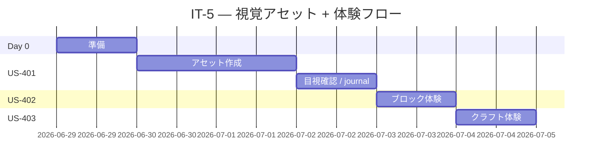

# イテレーション 5 計画 — 視覚アセット + 体験フロー（v0.5.0）

## 概要

| 項目 | 内容 |
|------|------|
| **イテレーション** | IT-5 |
| **期間** | Week 9-10（2 週間, 2026-06-29 〜 2026-07-12） |
| **ゴール** | 既存の `example_block` / `example_item` が `runClient` 上で正しいテクスチャ・モデルで表示され、ブロック設置・破壊・回収・クラフト体験が目視で確認できる状態にする |
| **目標 SP** | 7 SP |

---

## ゴール

### イテレーション終了時の達成状態

1. **アセット整備**: ブロックステート / モデル / テクスチャ / 翻訳 が揃い、`runClient` でクリエイティブインベントリに想定どおりの見た目で表示される。
2. **ブロック体験フロー**: ワールドへの設置 → 破壊 → 回収が目視で完結し、journal に記録される。
3. **クラフト体験フロー**: クラフトテーブルで `example_block` を入力すると `example_item` が出力される目視確認手順が journal に記録される。
4. **既存テスト無傷**: 8 件の既存 GameTest と JUnit テストが retrogression なく緑のまま。

### 成功基準

- [ ] US-401 / US-402 / US-403 のすべての受入条件を満たす
- [ ] `./gradlew runGameTestServer` 緑（既存 8 件、新規追加なし or 任意で +α）
- [ ] `./gradlew test` 緑
- [ ] `aipe-ci.yml` の最新 run が緑
- [ ] `runClient` 体験 journal が IT-5 全タスクで作成される
- [ ] `release_plan.md` の進捗欄が IT-5 実績で更新される
- [ ] `retrospective-5.md` 作成

---

## ユーザーストーリー

### 対象ストーリー

| ID | ユーザーストーリー | SP | 優先度 |
|----|-------------------|----|----|
| US-401 | example_block / example_item が正しいテクスチャ・モデルで表示される | 3 | 必須 |
| US-402 | ゲーム内で example_block を設置・破壊・回収する体験 | 2 | 必須 |
| US-403 | クラフトテーブルで example_item を作る体験 | 2 | 必須 |
| **合計** | | **7** | |

### ストーリー詳細

#### US-401: example_block / example_item が正しいテクスチャ・モデルで表示される

**ストーリー**:
> プレイヤーとして、`example_block` / `example_item` が正しいテクスチャ・モデルで表示されてほしい。なぜなら missing texture では Mod の存在を感じにくいからだ。

**受入条件**:

1. `assets/aipe/blockstates/example_block.json`（単一バリアント）作成。
2. `assets/aipe/models/block/example_block.json`（cube_all テクスチャ参照）作成。
3. `assets/aipe/models/item/example_block.json`（block model 参照）作成。
4. `assets/aipe/models/item/example_item.json`（item/generated レイヤー参照）作成。
5. `assets/aipe/textures/block/example_block.png` および `assets/aipe/textures/item/example_item.png`（最小 16×16, 既存バニラから流用または単純な単色も可）作成。
6. `assets/aipe/lang/en_us.json` に `block.aipe.example_block`、`item.aipe.example_item`、`itemGroup.aipe` の display name を追加。
7. `runClient` クリエイティブインベントリで両者がテクスチャ表示される目視確認。

#### US-402: ゲーム内で example_block を設置・破壊・回収する体験

**ストーリー**:
> プレイヤーとして、ゲーム内で `example_block` を設置・破壊・回収する一連のフローを体験したい。

**受入条件**:

1. `runClient` クリエイティブモードで `example_block` をホットバーに取り、ワールドに設置できる。
2. 設置したブロックを破壊（左クリック長押し）し、ドロップアイテムをピックアップできる。
3. インベントリにアイテムが戻ることを確認。
4. 上記の手順を `docs/journal/it5-block-experience.md` に記録（スクショは任意）。

#### US-403: クラフトテーブルで example_item を作る体験

**ストーリー**:
> プレイヤーとして、ゲーム内のクラフトテーブルで `example_block` から `example_item` を作る体験をしたい。

**受入条件**:

1. `runClient` クリエイティブモードでクラフトテーブルを設置・右クリックで開く。
2. 入力スロットに `example_block` 1 個を配置すると、結果スロットに `example_item` 1 個が表示される。
3. 結果を取り出してインベントリに入る。
4. 手順を `docs/journal/it5-craft-experience.md` に記録。

### タスク

#### 0. IT-5 開始準備（0 SP）

| # | タスク | 見積もり | 状態 |
|---|--------|---------|------|
| 0.1 | `git check-ignore` で `assets/aipe/**` パスを確認 | 0.2h | [ ] |
| 0.2 | `runClient` の事前動作確認（既存 v0.4.0 状態で起動） | 0.3h | [ ] |

**小計**: 0.5h

#### 1. US-401: アセット整備（3 SP）

| # | タスク | 見積もり | 状態 |
|---|--------|---------|------|
| 1.1 | blockstate / block model / item model JSON を 4 ファイル作成 | 1h | [ ] |
| 1.2 | テクスチャ PNG を 2 ファイル作成（最小 16×16）| 0.5h | [ ] |
| 1.3 | `assets/aipe/lang/en_us.json` に display name 追加 | 0.3h | [ ] |
| 1.4 | `runClient` クリエイティブインベントリで目視確認 | 0.5h | [ ] |
| 1.5 | journal `it5-asset.md` に手順記録 | 0.5h | [ ] |

**小計**: 2.8h

#### 2. US-402: ブロック体験（2 SP）

| # | タスク | 見積もり | 状態 |
|---|--------|---------|------|
| 2.1 | `runClient` で設置・破壊・回収のフローを実行 | 0.5h | [ ] |
| 2.2 | journal `it5-block-experience.md` に手順記録 | 0.5h | [ ] |

**小計**: 1h

#### 3. US-403: クラフト体験（2 SP）

| # | タスク | 見積もり | 状態 |
|---|--------|---------|------|
| 3.1 | `runClient` でクラフトテーブル体験を実行 | 0.5h | [ ] |
| 3.2 | journal `it5-craft-experience.md` に手順記録 | 0.5h | [ ] |

**小計**: 1h

#### タスク合計

| カテゴリ | SP | 理想時間 | 状態 |
|---------|----|----|------|
| Day 0 準備 | 0 | 0.5h | [ ] |
| US-401 アセット整備 | 3 | 2.8h | [ ] |
| US-402 ブロック体験 | 2 | 1h | [ ] |
| US-403 クラフト体験 | 2 | 1h | [ ] |
| **合計** | **7** | **5.3h** | |

**進捗率**: 0%（0/7 SP）

---

## スケジュール



---

## 設計

> Mod プロジェクト前提、Web 向けセクション（DDD / DB / UI / API）は N/A。

### アセット構成（IT-5 完了時点）

```
apps/aipe/src/main/resources/assets/aipe/
├── blockstates/
│   └── example_block.json
├── lang/
│   └── en_us.json                      # 拡張（display name 追加）
├── models/
│   ├── block/
│   │   └── example_block.json
│   └── item/
│       ├── example_block.json
│       └── example_item.json
└── textures/
    ├── block/
    │   └── example_block.png            # 16×16
    └── item/
        └── example_item.png             # 16×16
```

### ADR（IT-5 で記録すべき意思決定候補）

| ADR | タイトル | ステータス |
|-----|---------|-----------|
| ADR-011 | テクスチャは最小 16×16 / バニラ流用ベースで作成（オリジナルアートは IT-5 のスコープ外） | 提案 |

---

## リスクと対策

| リスク | 影響度 | 対策 |
|--------|--------|------|
| `runClient` 初回ダウンロードが長時間化 | 中 | Day 0 で事前起動確認、既存 IT-4 までで一度起動済みなら問題なし |
| テクスチャ作成に時間がかかる | 中 | 16×16 単色 PNG または既存バニラテクスチャの流用で OK とする |
| アセット欠落で `runClient` が起動失敗（modelmissing 等の例外） | 中 | 段階的に確認: blockstate → block model → item model → texture の順で `runClient` 再起動 |

---

## 完了条件

### Definition of Done（IT-5 全体）

- [ ] US-401 / US-402 / US-403 のすべての受入条件を満たす
- [ ] `./gradlew test` 緑
- [ ] `./gradlew runGameTestServer` 緑（既存 8 件、retrogression なし）
- [ ] `aipe-ci.yml` の最新 run が緑
- [ ] `docs/journal/it5-{asset,block-experience,craft-experience}.md` 作成
- [ ] `release_plan.md` の進捗欄を IT-5 実績で更新
- [ ] `docs/development/retrospective-5.md` 作成
- [ ] **`developing-review` を v0.5.0 タグ作成前にバッチ実行**（IT-4 ふりかえり Try 反映、5 観点 = コード品質・テスト品質・設計整合性・ドキュメント品質・利用者視点）
- [ ] v0.5.0 タグ付け

### デモ項目

1. `runClient` でクリエイティブインベントリを開き `example_block` / `example_item` のテクスチャ表示を確認
2. ブロックを設置・破壊・回収する一連のフロー
3. クラフトテーブルで `example_block` から `example_item` を作る

---

## 更新履歴

| 日付 | 更新内容 | 更新者 |
|------|---------|--------|
| 2026-05-02 | 初版作成（7 SP / 3 ストーリー / アセット + 体験フロー） | self |

---

## 関連ドキュメント

- [リリース計画](./release_plan.md)
- [イテレーション 4 ふりかえり](./retrospective-4.md)
- [ユーザーストーリー](../requirements/user_stories.md)
- [イテレーション 5 ふりかえり](./retrospective-5.md)（IT-5 終了時）
