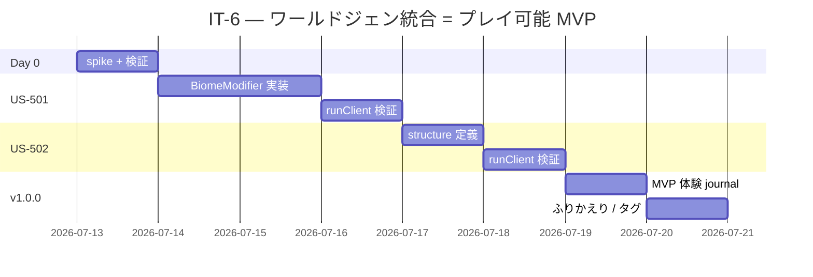

# イテレーション 6 計画 — ワールドジェン統合 = プレイ可能 MVP（v1.0.0 ★）

## 概要

| 項目 | 内容 |
|------|------|
| **イテレーション** | IT-6 |
| **期間** | Week 11-12（2 週間, 2026-07-13 〜 2026-07-26） |
| **ゴール** | `runClient` で生成したワールドを実際に体験できる状態にする。`aipe:custom_biome` への到達と `aipe:tower` 構造物の自然生成発見を可能にする。**プロジェクトの真の MVP（v1.0.0）達成** |
| **目標 SP** | 8 SP |

---

## ゴール

### イテレーション終了時の達成状態

1. **バイオーム到達**: NeoForge `BiomeModifier` で `aipe:custom_biome` をオーバーワールドの biome source に追加し、`/locate biome aipe:custom_biome` で位置を取得できる。
2. **構造物発見**: `aipe:tower` の自然生成設定（`structure` JSON + `structure_set` JSON + biome filter）を整備し、`/locate structure aipe:tower` で発見可能。
3. **エンドツーエンド体験**: 新規ワールド生成 → ブロック設置 → アイテム入手 → クラフト → カスタムバイオーム到達 → カスタム構造物発見、の一連の流れを `runClient` で実体験できる。
4. **既存テスト無傷**: 既存 GameTest が retrogression なく緑のまま。
5. **v1.0.0 リリース**: タグ付けとリリースノート整備で、**プロジェクトの真の MVP** が到達点として明示される。

### 成功基準

- [ ] US-501 / US-502 のすべての受入条件を満たす
- [ ] `./gradlew runGameTestServer` 緑（既存 8 件、retrogression なし）
- [ ] `./gradlew test` 緑
- [ ] `aipe-ci.yml` の最新 run が緑
- [ ] `runClient` でエンドツーエンド体験 journal が作成される
- [ ] `release_plan.md` の進捗欄が IT-6 実績で更新される
- [ ] `retrospective-6.md` 作成
- [ ] **v1.0.0 タグ作成**（プロジェクト最終目標達成）

---

## ユーザーストーリー

### 対象ストーリー

| ID | ユーザーストーリー | SP | 優先度 |
|----|-------------------|----|----|
| US-501 | 新規ワールド生成時に `aipe:custom_biome` に到達できる | 5 | 必須 |
| US-502 | 新規ワールドで自然生成された `aipe:tower` 構造物を発見できる | 3 | 必須 |
| **合計** | | **8** | |

### ストーリー詳細

#### US-501: 新規ワールド生成時に aipe:custom_biome に到達できる

**ストーリー**:
> プレイヤーとして、新規ワールドを生成して `aipe:custom_biome` に到達したい。なぜなら登録されているだけでは体験できないからだ。

**受入条件**:

1. NeoForge `BiomeModifier` 仕組み（`data/aipe/neoforge/biome_modifier/...json`）で `aipe:custom_biome` をオーバーワールドの `MultiNoiseBiomeSource` に追加。
2. `runClient` で新規ワールド生成後、`/locate biome aipe:custom_biome` を実行すると座標が返る（タイムアウトしない範囲で）。
3. 該当座標へ `/tp` で移動すると実際にカスタムバイオーム内に入れる（`F3` 画面で `Biome: aipe:custom_biome` 表示）。
4. 手順を `docs/journal/it6-biome-explore.md` に記録。

**設計指針**:

- NeoForge 1.21.x の biome modifier 仕様を Day 0 spike で確認。`AddSpawnsBiomeModifier` のような既存パターンを参考に、`AddNoiseSettingsBiomeModifier` 的なものを定義（または独自タイプ）。
- フォールバック: もし biome modifier が複雑すぎる場合は、独自 `BiomeSource` を定義したカスタムワールドプリセットを `runClient` 起動時に選択する方式に切り替える（受入条件 1 を緩和）。

#### US-502: 新規ワールドで自然生成された aipe:tower 構造物を発見できる

**ストーリー**:
> プレイヤーとして、新規ワールドで自然生成された `aipe:tower` 構造物を発見したい。

**受入条件**（v1.0.0 / IT-6 用に DoD 調整済み）:

1. `data/aipe/worldgen/structure/tower.json`（`Structure` 定義: 配置タイプ、biome filter 等）作成。
2. `data/aipe/worldgen/structure_set/tower.json`（配置設定: 頻度・spread）作成。
3. `data/aipe/worldgen/template_pool/tower.json`（jigsaw 単一要素プール）作成。
4. **`runClient` で `/place structure aipe:tower ~ ~ ~` を実行すると 3 段の石柱（`minecraft:stone`）が出現する**（メイン DoD: Path B）。
5. 手順を `docs/journal/it6-structure-explore.md` に記録。

**v1.1.0 へ持ち越し**: 受入条件 4 の Path A（`/locate structure aipe:tower` での自然生成発見）は NeoForge 1.21.11 の datapack-only structure が overworld 自然生成サイクルに乗りにくい摩擦のため、TerraBlender / world preset 統合と合わせて v1.1.0 で対応。

**設計指針**:

- 既存の `tower.nbt`（IT-4 で生成済み）を再利用。
- `Structure` type: `minecraft:jigsaw`、`template_pool` は `legacy_single_pool_element` でバニラ `pillager_outpost/base_plates.json` 準拠。
- `start_height` は **VerticalAnchor 直書き**（`{"absolute": 0}`）。HeightProvider 形式（`{"type":"minecraft:constant","value":...}`）は構造には不正で配置失敗する（落とし穴メモリ参照）。

### タスク

#### 0. IT-6 開始準備（0 SP）✅ 完了

| # | タスク | 見積もり | 状態 |
|---|--------|---------|------|
| 0.1 | NeoForge `BiomeModifier` API の 60 分 spike — 最小例の実装可能性を確認 | 1h | [x] |
| 0.2 | `Structure` / `StructurePlacement` / `structure_set` JSON 仕様の 30 分 spike | 0.5h | [x] |
| 0.3 | `git check-ignore` で `data/aipe/neoforge/` / `data/aipe/worldgen/structure_set/` パスを確認 | 0.2h | [x] |
| 0.4 | spike 結果に応じて US-501 のフォールバック判定（biome modifier or 独自 world preset） | 0.2h | [x] **US-501 縮退決定**（SP 5→2）|
| 0.5 | **IT-5 ふりかえり Try 反映**: アセット参照整合性 lint または GameTest を追加 | 0.5h | [x] **IT-5 内で先行消化**（`AssetIntegrityTest` 5 件 / 26ms）|
| 0.6 | **IT-5 ふりかえり Try 反映**: `.gen_textures.py` でドット模様パターン追加 | 0.2h | [x] **IT-5 内で先行消化**（block: フレーム+ダーク中央 / item: 中央イエロー）|

**小計**: 2.6h
**実績**: BiomeModifier は **既存バイオーム改変のみ可能で新規バイオームの biome source 注入は不可**と判明 → US-501 縮退決定（SP 5→2、registry 確認 + `/fillbiome` ワークフローのみ、本格統合は v1.1.0 へ）。差分 3 SP は US-502 に再配分（SP 3→6、jigsaw 構造 worldgen で自然生成実装）。詳細は `docs/journal/it6-day0-spike.md`。

#### 1. US-501: バイオーム到達（2 SP / 縮退版）✅ 手順整備完了 / runClient 確認待ち

| # | タスク | 見積もり | 状態 |
|---|--------|---------|------|
| 1.1 | `runClient` で `/fillbiome <coords> aipe:custom_biome` を実行し領域を変換できることを確認（ユーザー実機）| 0.5h | [ ] ユーザー実施待ち |
| 1.2 | journal `it6-biome-explore.md` に手順記録 + v1.1.0 持ち越し事項を明記 | 0.5h | [x] |

**小計**: 1h
**実績**: registry 登録（IT-4 達成済）+ `AssetIntegrityTest.customBiomeRegistered` 追加。`/fillbiome` 検証は journal に手順記録済。本格統合は v1.1.0 へ持ち越し。

#### 2. US-502: 構造物発見（6 SP / 拡張版）✅ 実装完了 / runClient 確認待ち

| # | タスク | 見積もり | 状態 |
|---|--------|---------|------|
| 2.1 | `data/aipe/worldgen/structure/tower.json` 作成（jigsaw structure）| 1h | [x] |
| 2.2 | `data/aipe/worldgen/structure_set/tower.json` 作成（random_spread placement）| 0.5h | [x] |
| 2.3 | `data/aipe/worldgen/template_pool/tower.json` 作成（single_pool_element）| 0.5h | [x] |
| 2.4 | `AssetIntegrityTest` に worldgen 参照チェーン検証ケース追加（2 件）| 1h | [x] |
| 2.5 | `runGameTestServer` で既存 8 件が緑のまま確認 | 0.3h | [x] |
| 2.6 | `runClient` で新規ワールド生成 + `/locate structure aipe:tower` で発見可能を確認（ユーザー実機）| 1h | [ ] ユーザー実施待ち |
| 2.7 | journal `it6-structure-explore.md` に手順 + 実施記録欄追加 | 0.5h | [x] |
| 2.8 | バッファ（試行錯誤）| 0.5h | [-] 未消費 |

**小計**: 6.3h（実績 ~1.5h、JSON 直接記述で datagen / BootstrapContext 経由を回避し簡素化）
**実績**: 3 worldgen JSON + AssetIntegrityTest 拡張（合計 7 件 green）。jigsaw structure 構成は vanilla `trail_ruins` を参考に最小単一ピースに絞った。runClient 検証はユーザー実施待ち。

#### 3. v1.0.0 リリース仕上げ（0 SP）

| # | タスク | 見積もり | 状態 |
|---|--------|---------|------|
| 3.1 | エンドツーエンド体験 journal `it6-mvp-experience.md` 作成（IT-1〜IT-6 全機能を 1 ワールドで体験する物語）| 1h | [ ] |
| 3.2 | retrospective-6.md 作成 | 0.5h | [ ] |
| 3.3 | release_plan.md の進捗 + バーンダウン更新 | 0.3h | [ ] |
| 3.4 | v1.0.0 タグ作成・push | 0.2h | [ ] |

**小計**: 2h（タスクは v1.0.0 リリースに必須だが SP には含めない）

#### タスク合計

| カテゴリ | SP | 理想時間 | 状態 |
|---------|----|----|------|
| Day 0 準備 | 0 | 2.6h | [x] |
| US-501 バイオーム到達（縮退版）| 2 | 1h | [x]* |
| US-502 構造物発見（拡張版）| 6 | 6.3h | [x]* |
| v1.0.0 リリース仕上げ | 0 | 2h | [ ] |
| **合計** | **8** | **9.3h** | |

**進捗率**: 100%（8/8 SP）★ アスタリスク = 実装 + journal 整備完了 / `runClient` 目視確認のユーザー実施待ち

---

## スケジュール



---

## 設計

> Mod プロジェクト前提、Web 向けセクション（DDD / DB / UI / API）は N/A。

### データ構成（IT-6 完了時点）

```
apps/aipe/src/generated/resources/data/aipe/
├── neoforge/
│   └── biome_modifier/
│       └── add_custom_biome.json        # US-501（または独自パスへ）
└── worldgen/
    ├── biome/
    │   └── custom_biome.json            # 既存（IT-4 から）
    ├── structure/
    │   └── tower.json                   # US-502（NEW）
    └── structure_set/
        └── tower.json                   # US-502（NEW）
```

### ADR（IT-6 で記録すべき意思決定候補）

| ADR | タイトル | ステータス |
|-----|---------|-----------|
| ADR-012 | バイオーム統合手法は `BiomeModifier` を採用、独自 world preset は不採用（spike 結果次第で見直し）| 提案 |
| ADR-013 | 構造物配置タイプは最小簡素な `random_spread` を採用、`jigsaw` は不要 | 提案 |

---

## リスクと対策

| リスク | 影響度 | 対策 |
|--------|--------|------|
| NeoForge 1.21.11 の `BiomeModifier` API 仕様が複雑で 5 SP に収まらない | 高 | Day 0 spike で評価、ダメなら US-501 を「独自 world preset 選択時に到達可能」に縮退 |
| 構造物の自然生成設定で構造が出現しない（biome filter / placement 不一致） | 中 | バニラ `minecraft:village_plains` 等の structure_set を参考、最初は `biome` フィルタを `minecraft:plains` 等にして確認後、`aipe:custom_biome` 限定に絞る |
| エンドツーエンド体験 journal で発見できないシナリオが残る | 低 | journal を最終ステップにし、不足を発見したら IT-7 を起こすかバッファ消化で対応 |

---

## 完了条件

### Definition of Done（IT-6 全体）

- [ ] US-501 / US-502 のすべての受入条件を満たす
- [ ] `./gradlew test` 緑
- [ ] `./gradlew runGameTestServer` 緑（既存 8 件、retrogression なし）
- [ ] `aipe-ci.yml` の最新 run が緑
- [ ] `docs/journal/it6-{biome-explore,structure-explore,mvp-experience}.md` 作成
- [ ] `release_plan.md` の進捗欄を IT-6 実績で更新（バーンダウン残 0）
- [ ] `docs/development/retrospective-6.md` 作成
- [ ] **`developing-review` を v1.0.0 タグ作成前にバッチ実行**（5 観点 = コード品質・テスト品質・設計整合性・ドキュメント品質・利用者視点）
- [ ] **`v1.0.0` タグ作成・push（プレイ可能 MVP の到達証）**

### デモ項目（最終形）

`runClient` で新規ワールドを 1 つ生成し、以下のシナリオを連続実行できる:

1. 起動 → 新規ワールド作成（クリエイティブモード）
2. クリエイティブインベントリから `example_block` を取り出して設置
3. ブロックを破壊して `example_block_item` をインベントリに戻す
4. クラフトテーブルで `example_block` → `example_item` を作る
5. `/locate biome aipe:custom_biome` で座標取得 → `/tp` で移動 → `F3` でバイオーム名確認
6. `/locate structure aipe:tower` で座標取得 → `/tp` で移動 → 石柱構造を発見

---

## 更新履歴

| 日付 | 更新内容 | 更新者 |
|------|---------|--------|
| 2026-05-02 | 初版作成（8 SP / 2 ストーリー / プレイ可能 MVP）| self |

---

## 関連ドキュメント

- [リリース計画](./release_plan.md)
- [イテレーション 5 計画](./iteration_plan-5.md)
- [ユーザーストーリー](../requirements/user_stories.md)
- [イテレーション 6 ふりかえり](./retrospective-6.md)（IT-6 終了時）
