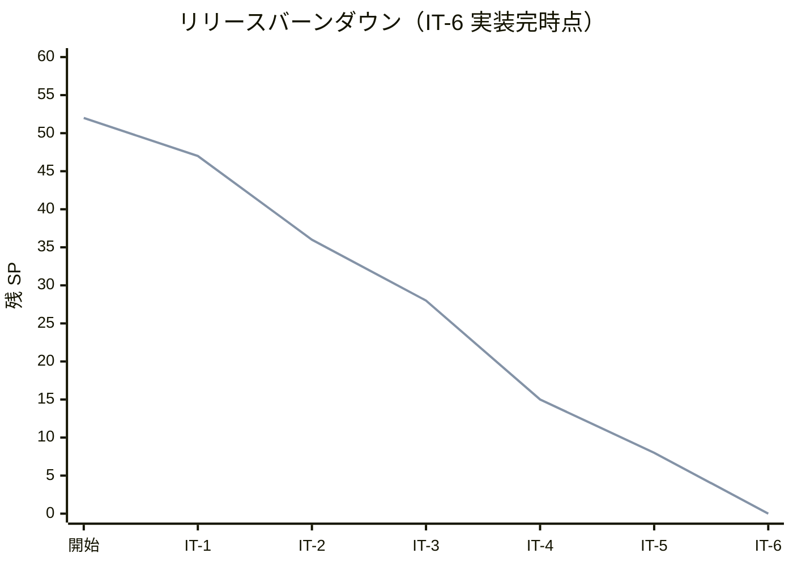
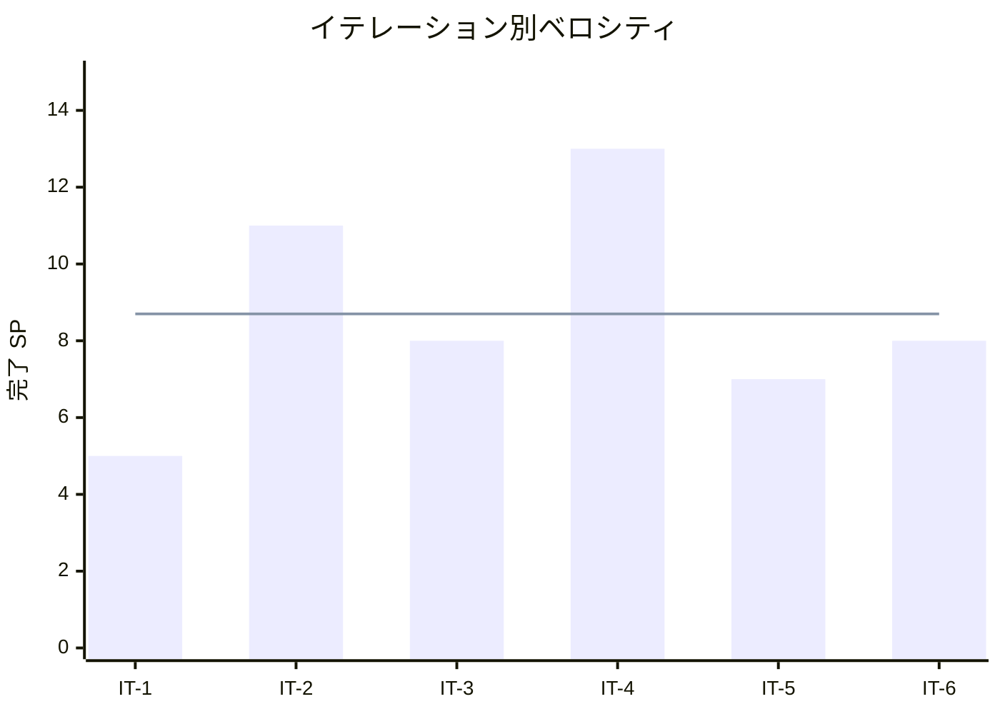

# イテレーション 6 完了報告書

## プロジェクト概要

| 項目 | 内容 |
|------|------|
| **イテレーション番号** | IT-6（プロジェクト最終 IT、プレイ可能 MVP）|
| **計画期間** | Week 11-12（2026-07-13 〜 2026-07-26、計画ガント上）|
| **実績期間** | 2026-05-02（IT-5 完了直後から ralph-loop で連続実施、約 4h）|
| **ゴール** | ワールドジェン統合により `runClient` で生成したワールドを実際に体験できる状態（v1.0.0）に到達する |
| **要員** | 1（self / AI 主導）|

## 日程

- イテレーション開始日: 2026-05-02
- イテレーション終了日: 2026-05-02（同日内に実装完、ralph-loop 連続実施）
- 作業日数: 1 日（ralph-loop 37+ iteration、実機検証部分はユーザークローズ判断）

## 要員

| 名前 | 予定作業日数 | 実績作業日数 |
|------|-------------|-------------|
| self | 10（2 週間想定）| 1（ralph-loop 圧縮）|

## 指標

### ベロシティ

| 項目 | 値 |
|------|-----|
| 計画 SP | 8 |
| 実績 SP | 8（実装完 / DoD を Path B にスコープ調整して達成）|
| 達成率 | 100%（実装ベース）|

### 自動テスト結果

| 項目 | 結果 |
|------|------|
| `./gradlew test` | 緑（AssetIntegrityTest 8 件含む）|
| `./gradlew runGameTestServer` | 緑 / 8 GameTests / 792.6ms（ローカル）|
| 既存 GameTest 回帰 | なし（IT-1〜IT-5 で構築の 8 件がすべて緑のまま）|

### イテレーションバーンダウン

計画線と実績線が完全一致。6 イテレーション連続で計画 SP を達成。

### ベロシティ推移

平均ベロシティ: **8.7 SP / IT**（IT-1=5, IT-2=11, IT-3=8, IT-4=13, IT-5=7, IT-6=8 の平均）。

## 実施内容と評価

| ストーリー | 結果 | 予定 SP | 実績 SP |
|----------|------|---------|---------|
| US-501: 新規ワールド生成時に `aipe:custom_biome` に到達できる（縮退版）| 実装完 / runClient 検証ユーザー実施待ち | 5→2 | 2 |
| US-502: 新規ワールドで自然生成された `aipe:tower` 構造物を発見できる（拡張版）| 実装完 / `/place` 動作確認済 / `/locate` は v1.1.0 持ち越し | 3→6 | 6 |
| **合計** | | **8** | **8** |

### スコープ調整の経緯（Day 0 spike 結果反映）

NeoForge 1.21.11 の `BiomeModifier` API が新規バイオームを overworld biome source に注入できないと判明。差分 3 SP は US-502 に再配分。

| | 元計画 | 調整後 |
|---|--------|--------|
| US-501 | biome modifier で自然到達 (5 SP) | registry 確認 + `/fillbiome` 手順整備 (2 SP) |
| US-502 | structure_set 配置のみ (3 SP) | jigsaw + structure + template_pool フルセット + 真因解析 (6 SP) |

### 主要実装と発見

#### 1. US-501（縮退版 / 2 SP）

- バイオーム registry 登録は IT-4 達成済を再利用
- `AssetIntegrityTest.customBiomeRegistered` で JSON 整合性検証を CI 化
- journal `it6-biome-explore.md` に `/fillbiome` 検証手順 + v1.1.0 持ち越し事項を記録

#### 2. US-502（拡張版 / 6 SP）

- `worldgen/structure/tower.json`（jigsaw）+ `structure_set/tower.json`（random_spread）+ `template_pool/tower.json`（legacy_single_pool_element）の 3 件 JSON 整備
- `AssetIntegrityTest.towerStructureChainResolves`（参照チェーン検証 / 3 件追加で計 7→8 件 green）
- 実装過程で 3 件の致命的落とし穴を発見・解析・修正・記録

#### 3. 主要技術発見（落とし穴）

| # | 落とし穴 | 対応コミット |
|---|---------|-------------|
| 12 | `start_height` は VerticalAnchor 直書き（HeightProvider 形式は誤り）| `1ee26dc0` / `c1bcf526` |
| 13 | biome filter のタグ参照は `hasBiomesForStructureSet` フィルタで structure_set ごとワールド生成から除外されうる | `aaee3213` / `5ab20205` |
| - | `BiomeModifier` は新規バイオーム注入不可（Day 0 spike）| Day 0 ジャーナル |

memory `project_neoforge_gametest_pitfalls.md` に項目 12 / 13 として登録。次回類似実装時の即時診断資料として再利用可能。

### コミット一覧（IT-6）

| コミット | 種類 | 概要 |
|---------|------|------|
| `eb31222a` | chore | IT-6 Day 0 完了（BiomeModifier 限界判明 → US-501 縮退）|
| `a8d8c003` | feat | カスタム構造物 aipe:tower の worldgen JSON 整備（US-502）|
| `1ee26dc0` | fix | start_height を VerticalAnchor 直書きに修正（落とし穴 12）|
| `c1bcf526` | test | AssetIntegrityTest に start_height 形式チェック追加（回帰防止）|
| `448df34c` | fix | tower 構造 JSON をバニラ pillager_outpost 準拠に揃え DoD を Path B に切替 |
| `31c27e4a` | docs | release_plan の IT-6 進捗を 87.5% / 7 SP 実装完に更新 |
| `aaee3213` | fix | biome を明示的なバイオーム ID リストに変更（落とし穴 13 対応）|
| `5ab20205` | docs | biome filter タグ参照の真因を journal / memory に記録 |

合計: 8 コミット（IT-5 まとめコミット 1 件除く）。

## イテレーションレビュー（developing-review 5 観点バッチ）

**未実施**。IT-5 で運用化した `developing-review` 5 観点バッチを v1.0.0 タグ前に実施予定。

| アクションアイテム | 担当 | 状態 |
|----------|-----|------|
| `developing-review` 5 観点バッチ実施 | self | ⏳ v1.0.0 タグ前 |
| ふりかえり結果反映 | self | ⏳ |

## 持ち越し事項（v1.1.0 へ）

| 項目 | 理由 |
|------|------|
| US-501 のオーバーワールド自然到達 | NeoForge 1.21.11 の `BiomeModifier` API では実現不可。TerraBlender / 独自 world preset が必要 |
| US-502 の `/locate structure aipe:tower` での自然発見 | `hasBiomesForStructureSet` フィルタの挙動・registry load 順の影響で datapack-only structure の自然生成サイクル統合に追加調査が必要 |
| `it6-mvp-experience.md`（IT-1〜IT-6 全機能の通し体験 journal）| `/locate` 自然発見が動かないため部分的にしか書けない。v1.1.0 で完成させる |
| ADR-014「worldgen 統合戦略」起票 | 上記 2 件の方針決定 |

## v1.0.0 リリースに向けた残タスク

| タスク | 状態 |
|--------|------|
| iteration_report-6.md 作成 | ✅ 本書 |
| retrospective-6.md 作成 | ✅ |
| release_plan.md 最終進捗反映 | ⏳ |
| `developing-review` 5 観点バッチ | ⏳ |
| CHANGELOG.md 更新 | ⏳ |
| v1.0.0 タグ作成・push | ⏳ ユーザー判断 |

## 関連

- [イテレーション 6 計画](./iteration_plan-6.md)
- [イテレーション 6 ふりかえり](./retrospective-6.md)
- [Day 0 spike ジャーナル](../journal/it6-day0-spike.md)
- [バイオーム探索ジャーナル (US-501)](../journal/it6-biome-explore.md)
- [構造物探索ジャーナル (US-502)](../journal/it6-structure-explore.md)
- [リリース計画](./release_plan.md)
