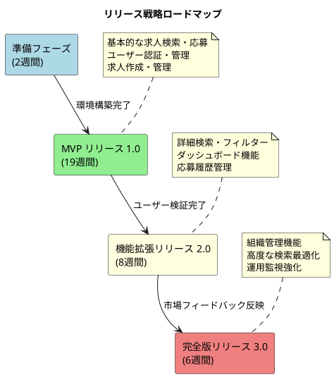
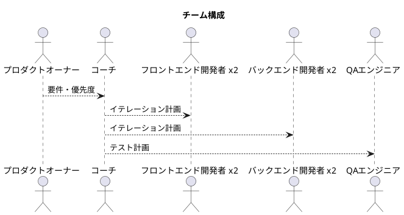
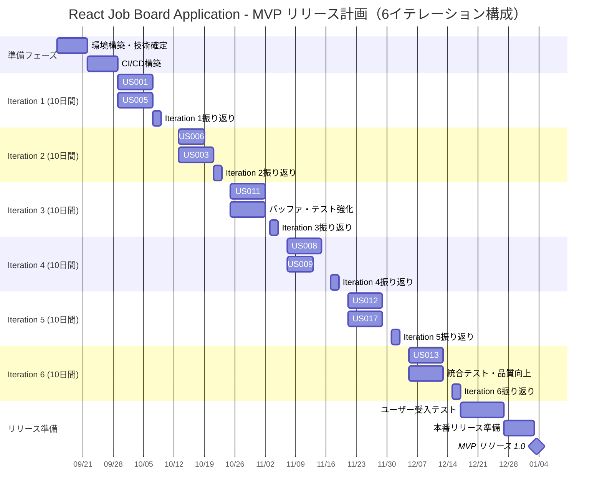
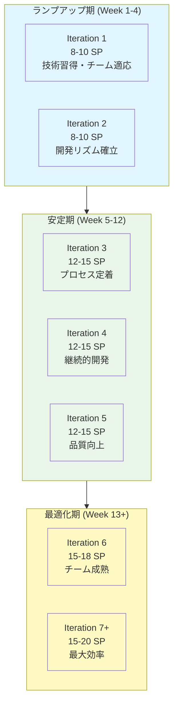
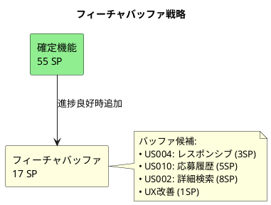
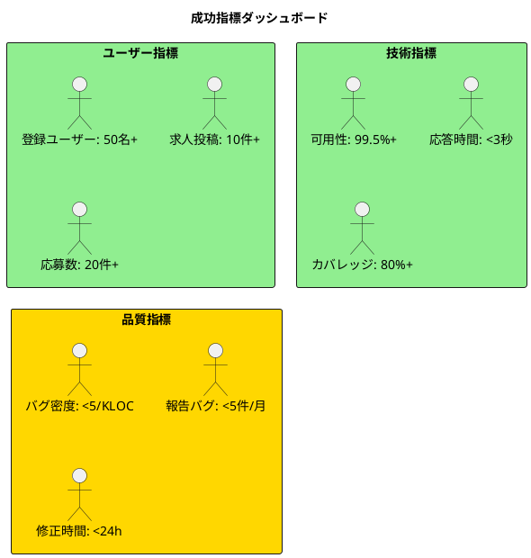

# リリース計画 - React Job Board Application

## エグゼクティブサマリー

### プロジェクト概要
React Job Board Application は求人掲載・管理・応募システムであり、求職者・採用担当者・組織管理者の3つの役割に対応したWebアプリケーションです。

### XP（エクストリーム プログラミング）アプローチ
本プロジェクトはXP手法に基づき、以下の価値とプラクティスを重視します：

**XPの価値**:
- **コミュニケーション**: 常にオープンで正直な対話
- **シンプリシティ**: 最もシンプルな解決策を追求
- **フィードバック**: 迅速で頻繁なフィードバックループ
- **勇気**: 変更と改善への積極的な姿勢

**主要プラクティス**:
- **ペアプログラミング**: 知識共有と品質向上
- **テスト駆動開発（TDD）**: Red-Green-Refactorサイクル
- **継続的インテグレーション**: 頻繁なコード統合
- **リファクタリング**: 継続的なコード改善
- **小さなリリース**: 2週間イテレーションでの価値提供

### 主要指標
- **総開発期間**: 24週間（6ヶ月）
- **総ストーリーポイント**: 105SP（バッファ含む）
- **MVP時間**: 19週間（55SP）
- **チーム規模**: 4-5名
- **予算**: ¥12,000,000（概算）

### リリース戦略
3段階でのリリースアプローチを採用し、MVP（最小実行可能製品）でのユーザー検証を最優先とします。



---

## 満足条件

### スコープ（機能要件）

#### 必須機能（MVP）
- ✅ **求職者向け機能**
  - 求人検索・閲覧
  - ユーザー登録・ログイン
  - 求人応募・応募確認
  
- ✅ **採用担当者向け機能**
  - 求人作成・編集・管理
  - 応募者一覧・管理
  - 基本的な通知機能

- ✅ **システム機能**
  - ユーザー認証・認可
  - エラーハンドリング
  - 基本的なセキュリティ対策

#### 拡張機能（Phase 2）
- 🔄 詳細検索フィルター
- 🔄 レスポンシブデザイン
- 🔄 権限別ダッシュボード
- 🔄 応募履歴確認
- 🔄 自動通知システム

#### 高度な機能（Phase 3）
- ⏳ 組織情報管理
- ⏳ ユーザー権限管理
- ⏳ 検索機能最適化

### スケジュール

| フェーズ | 期間 | 完了予定 | 主要マイルストーン |
|----------|------|----------|-------------------|
| **準備** | 2週間 | Week 2 | 環境構築・チーム立ち上げ |
| **MVP開発** | 17週間 | Week 19 | 基本機能完成・ユーザー検証 |
| **品質向上** | 2週間 | Week 21 | UAT・パフォーマンス最適化 |
| **本番準備** | 3週間 | Week 24 | セキュリティ監査・本番デプロイ |

### リソース

#### チーム構成


#### 予算概算
- **人件費**: ¥8,000,000（開発者4名 × 6ヶ月）
- **インフラ費**: ¥800,000（AWS/クラウドサービス）
- **ツール・ライセンス**: ¥400,000
- **その他・予備費**: ¥800,000
- **総予算**: ¥10,000,000

---

## 段階的リリース戦略

### リリース 1.0 MVP（24週間）

#### 満足条件
- **ユーザー**: 求職者が求人検索・応募できる
- **ビジネス**: 採用担当者が求人管理・応募者確認できる  
- **技術**: 基本的なセキュリティ・パフォーマンス要件を満たす

#### 含まれる機能（55SP）
| 優先度 | ユーザーストーリー | SP | 累積SP |
|--------|-------------------|----|----|
| P1 | US001: 基本的な求人検索 | 5 | 5 |
| P1 | US005: ユーザー登録 | 5 | 10 |
| P2 | US006: ユーザーログイン | 3 | 13 |
| P3 | US003: 求人詳細表示 | 5 | 18 |
| P2 | US011: 求人作成フォーム | 8 | 26 |
| P2 | US008: 求人応募フォーム | 8 | 34 |
| P4 | US009: 応募完了確認 | 3 | 37 |
| P3 | US012: 求人編集・管理 | 5 | 42 |
| P3 | US017: エラーハンドリング | 5 | 47 |
| P3 | US013: 応募者一覧管理 | 8 | 55 |

### リリース 2.0 機能拡張（8週間）

#### 満足条件
- **ユーザビリティ**: 使いやすい検索・フィルター機能
- **モビリティ**: モバイル対応完了
- **効率性**: ダッシュボードでの作業効率向上

#### 含まれる機能（29SP）
| ユーザーストーリー | SP | 理由 |
|-------------------|----|----|
| US002: 詳細検索フィルター | 8 | ユーザー体験向上 |
| US004: レスポンシブ求人検索 | 3 | モバイル対応必須 |
| US007: 権限別ダッシュボード | 8 | 業務効率化 |
| US010: 応募履歴確認 | 5 | 求職者満足度向上 |
| US014: 応募者通知システム | 5 | 自動化・効率化 |

### リリース 3.0 完全版（6週間）

#### 満足条件
- **スケーラビリティ**: 大規模組織対応
- **管理性**: 権限管理・組織管理完備
- **パフォーマンス**: 検索最適化完了

#### 含まれる機能（21SP）
| ユーザーストーリー | SP | 理由 |
|-------------------|----|----|
| US015: 組織情報管理 | 5 | エンタープライズ対応 |
| US016: ユーザー権限管理 | 8 | セキュリティ強化 |
| US018: 検索機能最適化 | 8 | パフォーマンス向上 |

---

## 詳細スケジュール

### イテレーション計画



### マイルストーン

| マイルストーン | 完了予定 | 成功基準 | 備考 |
|---------------|----------|----------|------|
| **技術基盤完成** | Week 2 | CI/CD動作、開発環境構築完了 | 重要前提条件 |
| **認証基盤完成** | Week 4 | ユーザー登録・ログイン動作 | MVP基礎機能 |
| **求人機能完成** | Week 8 | 求人CRUD操作完全動作 | コア機能完成 |
| **応募機能完成** | Week 12 | End-to-End求人応募フロー動作 | MVP機能完成 |
| **品質基準達成** | Week 16 | 全受入テスト合格、パフォーマンス要件達成 | リリース可能品質 |
| **MVP本番リリース** | Week 19 | 本番環境稼働、初期ユーザー登録確認 | 🎯 主要目標 |

---

## ベロシティ計画と予測

### 初期ベロシティ戦略



#### ベロシティ前提条件

**保守的シナリオ（確率 70%）**:
- Iteration 1-2: 8SP/iteration
- Iteration 3-5: 12SP/iteration  
- Iteration 6+: 15SP/iteration
- **MVP完了**: 19週間（計画通り）

**標準シナリオ（確率 50%）**:
- Iteration 1-2: 10SP/iteration
- Iteration 3-5: 15SP/iteration
- Iteration 6+: 18SP/iteration
- **MVP完了**: 16週間（3週間短縮）

**楽観的シナリオ（確率 20%）**:
- Iteration 1-2: 12SP/iteration
- Iteration 3-5: 18SP/iteration
- Iteration 6+: 20SP/iteration
- **MVP完了**: 14週間（5週間短縮）

### 予測精度向上

#### 調整タイミング
- **Iteration 3後**: 実績ベロシティでスケジュール再計算
- **Iteration 5後**: 残作業とリリース日程最終調整
- **毎イテレーション**: 短期予測更新

#### 予測指標
```
実績ベロシティ = 直近3イテレーションの平均
予測完了日 = 現在日 + （残SP ÷ 実績ベロシティ × イテレーション長）
予測精度 = |予測日 - 実際日| ÷ 総期間 × 100%
```

---

## リスク管理計画

### リスク評価マトリックス

| リスク | 影響度 | 確率 | リスクレベル | 対策優先度 |
|--------|--------|------|-------------|------------|
| **技術的複雑性** | 高(4) | 中(3) | 🔴 12 | 最高 |
| **認証・セキュリティ** | 高(4) | 中(3) | 🔴 12 | 最高 |
| **チーム習熟度** | 中(3) | 高(4) | 🟡 12 | 高 |
| **要件変更** | 中(3) | 高(4) | 🟡 12 | 高 |
| **ファイルアップロード** | 中(3) | 中(3) | 🟡 9 | 中 |
| **パフォーマンス** | 中(3) | 中(3) | 🟡 9 | 中 |
| **統合テスト** | 中(3) | 中(3) | 🟡 9 | 中 |
| **外部API依存** | 低(2) | 低(2) | 🟢 4 | 低 |

### 主要リスク対策

#### 1. 技術的複雑性（リスクレベル: 🔴 12）
**対策**:
- **技術スパイク**: Sprint 1で主要技術要素の検証
- **プロトタイプ開発**: 認証・ファイルアップロード等の事前検証
- **アーキテクチャレビュー**: 外部専門家による設計レビュー

**コンティンジェンシープラン**:
- 技術選択の見直し（より簡単な代替技術）
- 外部ライブラリ・サービスの活用
- 段階的実装（コア機能→拡張機能）

#### 2. 認証・セキュリティ（リスクレベル: 🔴 12）
**対策**:
- **専門家コンサルテーション**: セキュリティ専門家への相談
- **既存ソリューション活用**: Auth0等の外部認証サービス検討
- **セキュリティ監査**: 実装後の第三者監査

**コンティンジェンシープラン**:
- SaaS認証サービスへの切り替え
- セキュリティ要件の段階的実装
- 基本認証での暫定リリース

#### 3. チーム習熟度（リスクレベル: 🟡 12）
**対策**:
- **ペアプログラミング**: 知識共有と品質向上
- **定期技術勉強会**: React/Spring Boot の習熟度向上
- **メンタリング体制**: シニア開発者による指導

**コンティンジェンシープラン**:
- 外部技術サポートの導入
- より簡単な技術スタックへの変更
- 開発範囲の絞り込み

---

## バッファ戦略

### 1. フィーチャバッファ（30%）



**バッファ発動条件**:
- ✅ 累積ベロシティが計画+20%以上
- ✅ 品質指標が目標値達成
- ✅ 重大なリスクが発生していない

### 2. スケジュールバッファ（25%）

```
ベーススケジュール: 19週間
スケジュールバッファ: +5週間
総スケジュール: 24週間
```

**バッファ配分**:
- **技術的難航**: 2週間（複雑機能の延長対応）
- **品質向上**: 2週間（テスト・パフォーマンス改善）
- **要件調整**: 1週間（要求変更・追加対応）

### 3. リソースバッファ

**コアチーム**: 4名（フロントエンド2名、バックエンド2名）
**バッファリソース**: +1名（フルスタック、必要時投入）

**バッファ発動トリガー**:
- 🚨 スプリントベロシティが計画値の80%を下回る
- 🚨 重要メンバーの長期不在
- 🚨 技術的に予想以上の困難に直面

---

## 成功指標とマイルストーン

### MVP成功指標

#### ビジネス指標
- **ユーザー登録**: 50名以上（リリース後1ヶ月）
- **求人投稿**: 10件以上（リリース後2週間）
- **応募数**: 20件以上（リリース後1ヶ月）
- **ユーザー満足度**: 4.0/5.0以上（アンケート調査）

#### 技術指標
- **可用性**: 99.5%以上
- **応答時間**: 3秒以内（90%tile）
- **テストカバレッジ**: 80%以上
- **セキュリティ**: 重大脆弱性ゼロ

#### 品質指標
- **バグ密度**: 5bugs/KLOC以下
- **顧客報告バグ**: 月5件以下
- **修正時間**: 平均24時間以内

### フェーズごとマイルストーン



---

## 次のステップ

### 即座実行項目

#### 1. 開発環境セットアップ（Week 1）
```bash
# プロジェクト初期化
npx create-react-app job-board-frontend --template typescript
npx create-next-app@latest job-board-frontend --typescript --tailwind --eslint

# バックエンド環境
spring init --dependencies=web,security,jpa,h2,redis job-board-backend

# インフラ環境
docker-compose up -d # PostgreSQL, Redis, 開発環境
```

#### 2. CI/CD パイプライン構築（Week 1-2）
- GitHub Actions設定
- テスト自動化環境
- コード品質チェック（ESLint, SonarQube）
- 自動デプロイ設定

#### 3. チーム立ち上げ（Week 1）
- **キックオフミーティング**: プロジェクト目標・役割分担確認
- **Working Agreement**: チーム作業規約策定
- **Definition of Done**: 完了基準明確化
- **ツール設定**: Slack, Jira, Confluence等

### Iteration 1準備

#### Iteration 1目標設定
**イテレーションゴール**: "ユーザーが求人を検索・登録できる基本機能を実現する"

#### Iteration 1 バックログ
1. **US001: 基本的な求人検索（5SP）**
   - 検索API実装
   - 求人一覧表示UI
   - 基本的な検索フォーム

2. **US005: ユーザー登録（5SP）**
   - ユーザー登録API
   - 登録フォームUI
   - バリデーション実装

#### Iteration 1タスク分解例
```
US001: 基本的な求人検索 (5SP)
├─ バックエンド（3SP）
│  ├─ Job Entity設計 (0.5SP)
│  ├─ JobRepository実装 (1SP)
│  ├─ JobController実装 (1SP)
│  └─ 検索API実装 (0.5SP)
└─ フロントエンド（2SP）
   ├─ 検索フォームコンポーネント (1SP)
   └─ 求人一覧コンポーネント (1SP)
```

### 継続的改善計画

#### イテレーションレビュー・振り返り（XPスタイル）
- **頻度**: 各イテレーション終了時（2週間間隔）
- **参加者**: 開発チーム全員、プロダクトオーナー、コーチ
- **フォーマット**: 
  - **イテレーションレビュー**: デモンストレーション、フィードバック収集
  - **振り返り（Retrospective）**: KPT形式 + XP改善点
    - Keep: うまくいったXPプラクティス
    - Problem: XPプラクティスの課題
    - Try: 次イテレーションで試すXP改善策
- **XP継続改善**:
  - ペアプログラミング効果の評価
  - TDDサイクルの改善点検討
  - リファクタリング頻度の最適化

#### ベロシティ追跡
- **測定**: 完了ストーリーポイント/イテレーション
- **予測**: 3イテレーション移動平均
- **調整**: 偏差±20%で計画見直し

#### リスク監視
- **週次**: リスクレジスター更新
- **月次**: リスクレベル再評価
- **四半期**: 対策効果レビュー

---

## まとめ

React Job Board Application のリリース計画は、MVP-First アプローチで段階的価値提供を実現する戦略を採用しています。

### 重要ポイント
1. **ユーザー検証優先**: MVPでの早期フィードバック獲得
2. **リスク管理**: 技術・ビジネス両面でのリスク対策
3. **柔軟性確保**: 30%のフィーチャバッファと25%のスケジュールバッファ
4. **継続的改善**: アジャイルプロセスでの適応的計画調整

### 成功の鍵
- **チーム一丸**: 明確な目標とコミットメント
- **技術的卓越性**: 高品質な実装とテスト
- **ユーザー中心**: 継続的なフィードバック収集と反映
- **データ駆動**: 実績に基づく計画調整

**次回アクション**: Iteration 1 の詳細計画策定（`/plan --iteration 1`）

---

### 関連ドキュメント
- [要件定義書](../requirements/requirements_definition.md)
- [ユーザーストーリー](../requirements/user_story.md)
- [アーキテクチャ設計](../design/architecture_backend.md)
- [技術スタック](../design/tech_stack.md)

<function_calls>
<invoke name="mcp__byterover-mcp__byterover-store-knowledge">
<parameter name="messages">React Job Board Application リリース計画完成

## リリース計画概要
- **総期間**: 24週間（6ヶ月）、MVP：19週間
- **総SP**: 105SP（MVP：55SP、拡張：50SP）
- **ベロシティ**: 8-10SP → 12-15SP → 15-18SP（段階的向上）
- **リスク対策**: フィーチャバッファ30%、スケジュールバッファ25%

## 段階的リリース戦略
### MVP リリース 1.0（19週間、55SP）
基本的な求人検索・応募機能で市場検証
- US001: 基本的な求人検索（5SP）
- US005: ユーザー登録（5SP）
- US006: ユーザーログイン（3SP）
- US003: 求人詳細表示（5SP）
- US011: 求人作成フォーム（8SP）
- US008: 求人応募フォーム（8SP）
- US009: 応募完了確認（3SP）
- US012: 求人編集・管理（5SP）
- US017: エラーハンドリング（5SP）
- US013: 応募者一覧管理（8SP）

### 機能拡張 リリース 2.0（8週間、29SP）
- 詳細検索・フィルター、レスポンシブ対応、ダッシュボード

### 完全版 リリース 3.0（6週間、21SP）
- 組織管理、権限管理、検索最適化

## スプリント計画（6スプリント構成）
```
Sprint 1-2: 認証・検索基盤（8-10SP）
Sprint 3-4: 求人管理・応募機能（12-15SP）
Sprint 5-6: 管理機能・品質向上（15-18SP）
```

## リスク管理
### 主要リスク（🔴高リスク）
- 技術的複雑性（React/Spring Boot統合）
- 認証・セキュリティ実装
- チーム習熟度

### 対策
- 技術スパイク・プロトタイプ開発
- 外部認証サービス検討
- ペアプログラミング・メンタリング

## 成功指標
- **ユーザー**: 登録50名+、求人10件+、応募20件+
- **技術**: 可用性99.5%+、応答時間3秒以内、カバレッジ80%+
- **品質**: バグ密度<5/KLOC、修正時間<24h

4軸評価マトリックス（金銭価値・コスト・知識習得・リスク軽減）による優先順位付け完了。アジャイル開発ガイドに準拠したKPT形式の振り返り、ベロシティ追跡システム導入予定。