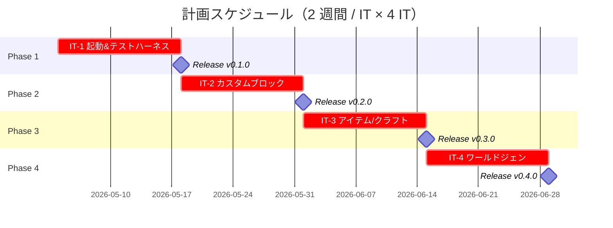
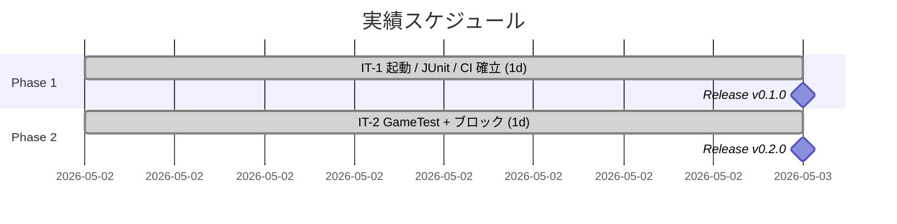
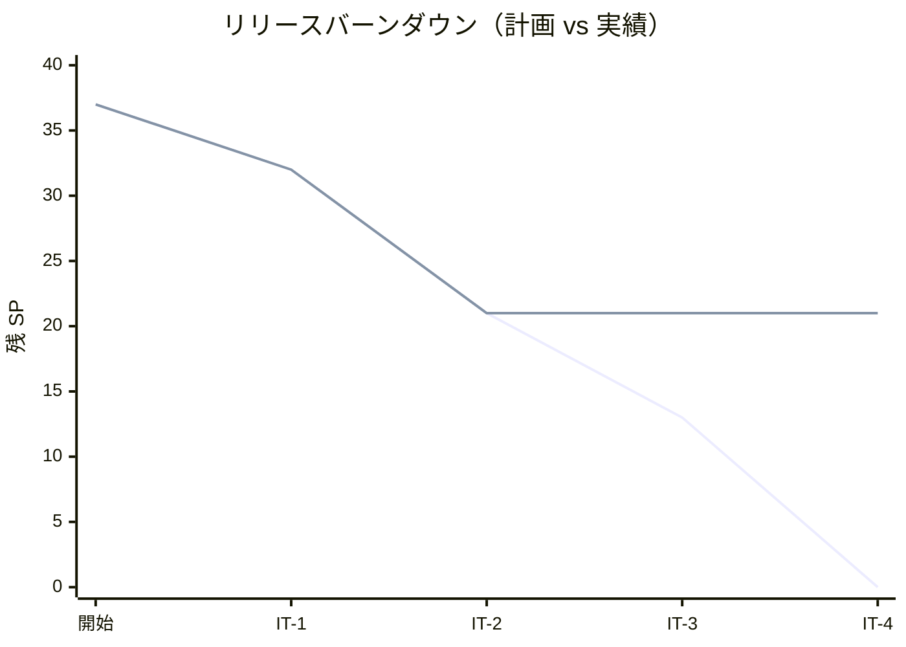

# リリース計画 — マイクラ Mod プロジェクト（ai-programing-exercise）

## 概要

本ドキュメントは、TDD で進める Minecraft Mod 開発プロジェクトのリリース計画を定義する。インセプションデッキ（@docs/strategy/inception_deck.md）とユーザーストーリー一覧（@docs/requirements/user_stories.md）を入力としている。

### プロジェクト情報

| 項目 | 内容 |
|------|------|
| **プロジェクト名** | ai-programing-exercise mod |
| **目的** | TDD・XP プラクティスを Minecraft Mod 開発を題材に体得する。受入テストを実環境（GameTest）で自動実行する経験を積む |
| **対象ユーザー** | Modder（自分）／プレイヤー／CI |
| **開発チーム** | 1 名（個人 + Claude Code エージェント） |
| **Mod ターゲット** | NeoForge 1.21.11（Java） |

---

## 満足条件

### スコープ

「最小起動 → GameTest 確立とカスタムブロック → アイテム / クラフト → ワールドジェン」と段階的にワールド要素を増やす 4 リリース構成。Phase 1 では JUnit 中心の CI を確立し、Phase 2 で GameTest ハーネスとカスタムブロックを一体で立ち上げる。各リリース完了時点で `gradle test`（Phase 1 以降）と `runGameTestServer`（Phase 2 以降）が green であることを必須とする。

| フェーズ | 内容 | ストーリー数 |
|---------|------|--------------|
| Phase 1（v0.1.0 MVP） | 起動 / JUnit / CI | 3 |
| Phase 2（v0.2.0） | GameTest ハーネス + カスタムブロック | 4 |
| Phase 3（v0.3.0） | アイテム / クラフト | 2 |
| Phase 4（v0.4.0） | ワールドジェン（構造物 / バイオーム） | 2 |
| **合計** | | **11 ストーリー** |

### スケジュール

- **開発期間**: 8 週間（個人プロジェクトのため週次稼働は変動可、目安）
- **イテレーション**: 2 週間 × 4 イテレーション
- **リリース**: 各イテレーション末にマイナーバージョンを切る段階的リリース

### リソース

- **開発者**: 1 名（自分）
- **AI エージェント**: Claude Code（ペアプロ的協働）
- **想定稼働時間**: 5〜10 時間 / 週（学習目的のため可変）

---

## ユーザーストーリー一覧とストーリーポイント

### 優先順位マトリックス

4 軸評価で優先順位を決定する。

1. **金銭価値（BV）**: ここでは「学習価値」と読み替える
2. **コスト（C）**: 開発コスト
3. **知識習得（KA）**: 技術的学習価値
4. **リスク軽減（RR）**: ハーネス未確立リスク等の軽減効果

### Phase 1: 起動と JUnit / CI 確立（IT-1） — v0.1.0 MVP

| ID | ユーザーストーリー | SP | BV | C | KA | RR | 優先度 |
|----|-------------------|----|----|---|----|----|--------|
| US-001 | Mod がクライアントで起動することを確認したい | 2 | 高 | 低 | 中 | 高 | 必須 |
| US-003 | JUnit 5 によるユニットテスト環境が欲しい | 1 | 中 | 低 | 中 | 中 | 必須 |
| US-004 | CI で JUnit テストを自動実行したい | 2 | 高 | 中 | 高 | 高 | 必須 |
| **合計** | | **5** | | | | | |

> US-002（GameTest 最小サンプル）は API 刷新（NeoForge 1.21.11 のデータドリブン GameTest）の発見により Phase 2 へ移送した。

### Phase 2: GameTest ハーネス + カスタムブロック（IT-2） — v0.2.0

| ID | ユーザーストーリー | SP | BV | C | KA | RR | 優先度 |
|----|-------------------|----|----|---|----|----|--------|
| US-002 | GameTest の最小サンプルが自動実行される（NeoForge データドリブン API） | 3 | 高 | 高 | 高 | 高 | 必須 |
| US-101 | カスタムブロックをワールドに設置したい | 3 | 高 | 中 | 高 | 中 | 必須 |
| US-102 | 設置したカスタムブロックを破壊して回収したい | 3 | 中 | 中 | 中 | 中 | 必須 |
| US-103 | クリエイティブインベントリからカスタムブロックを取得したい | 2 | 中 | 低 | 中 | 低 | 中 |
| **合計** | | **11** | | | | | |

### Phase 3: アイテム / クラフト（IT-3） — v0.3.0

| ID | ユーザーストーリー | SP | BV | C | KA | RR | 優先度 |
|----|-------------------|----|----|---|----|----|--------|
| US-201 | カスタムアイテムをインベントリに持ちたい | 3 | 中 | 中 | 中 | 中 | 必須 |
| US-202 | カスタムクラフトレシピを使いたい | 5 | 高 | 中 | 高 | 中 | 必須 |
| **合計** | | **8** | | | | | |

### Phase 4: ワールドジェン（IT-4） — v0.4.0

| ID | ユーザーストーリー | SP | BV | C | KA | RR | 優先度 |
|----|-------------------|----|----|---|----|----|--------|
| US-301 | カスタム構造物が生成される | 5 | 高 | 高 | 高 | 中 | 必須 |
| US-302 | 新しいバイオームに足を踏み入れる | 8 | 高 | 高 | 高 | 中 | 中 |
| **合計** | | **13** | | | | | |

### 全体サマリー

| フェーズ | ストーリーポイント | イテレーション |
|---------|-------------------|---------------|
| Phase 1（IT-1）| 5 SP | IT-1 |
| Phase 2（IT-2）| 11 SP | IT-2 |
| Phase 3（IT-3）| 8 SP | IT-3 |
| Phase 4（IT-4）| 13 SP | IT-4 |
| **合計** | **37 SP** | 4 イテレーション |

---

## ベロシティ見積もり

### 初期ベロシティ推定

| 項目 | 値 |
|------|-----|
| **イテレーション期間** | 2 週間 |
| **チーム規模** | 1 名（+ AI エージェント） |
| **想定ベロシティ** | 8〜12 SP / イテレーション |
| **バッファ係数** | 0.8（20%バッファ） |
| **実効ベロシティ** | 約 6〜10 SP / イテレーション |

### ベロシティ検証計画

- IT-1〜3 の実績を計測し、IT-4 開始前にベロシティを再校正する。
- 個人プロジェクトのため週次稼働の変動を吸収するスケジュールバッファを確保する（後述）。
- ストーリーポイントは「最小実装＋ GameTest 作成＋ JUnit 化＋ CI 通過」までを含む。

### ベロシティ実績（IT-1 / IT-2 完了時点）

| イテレーション | 計画 SP | 実績 SP | 注釈 |
|---------------|---------|---------|------|
| IT-1 | 5 | 5 | 元計画 8 SP → API 刷新発見で US-002 を IT-2 へ移送、5 SP に縮小 |
| IT-2 | 11 | 11 | GameTest ハーネス確立 + カスタムブロック / 6 件の問題を解決しつつ完走 |
| **平均** | **8** | **8** | サンプルが 2 IT のためまだ仮値。3 IT 後に再校正 |

実測ベロシティが想定範囲（8〜12 SP/IT）の下限近くに収束。IT-4 (13 SP) は最大値に近く、リスクとしては予備イテレーション IT-5 を発動する可能性が中程度。

---

## 段階的リリース戦略

### リリーススケジュール

#### 計画スケジュール

```mermaid
gantt
    title 計画スケジュール（2 週間 / IT × 4 IT）
    dateFormat  YYYY-MM-DD
    section Phase 1
    IT-1 起動&テストハーネス        :crit, p1-1, 2026-05-04, 14d
    Release v0.1.0                  :milestone, m1, after p1-1, 0d
    section Phase 2
    IT-2 カスタムブロック           :crit, p2-1, after p1-1, 14d
    Release v0.2.0                  :milestone, m2, after p2-1, 0d
    section Phase 3
    IT-3 アイテム/クラフト          :crit, p3-1, after p2-1, 14d
    Release v0.3.0                  :milestone, m3, after p3-1, 0d
    section Phase 4
    IT-4 ワールドジェン             :crit, p4-1, after p3-1, 14d
    Release v0.4.0                  :milestone, m4, after p4-1, 0d
```

#### 実績スケジュール

```mermaid
gantt
    title 実績スケジュール
    dateFormat  YYYY-MM-DD
    section Phase 1
    IT-1 起動 / JUnit / CI 確立 (1d) :done, p1, 2026-05-02, 1d
    Release v0.1.0                  :milestone, m1, after p1, 0d
    section Phase 2
    IT-2 GameTest + ブロック (1d)    :done, p2, 2026-05-02, 1d
    Release v0.2.0                  :milestone, m2, after p2, 0d
```

> 実績は各イテレーション完了時に更新する。IT-1 / IT-2 ともに計画 14 日に対し実質 1 日で完了（学習プロジェクトのため集中作業時間を確保）。

### リリース内容

#### Release v0.1.0（Phase 1 完了）: MVP — 起動と JUnit / CI 確立

**目標**: ユニットテストと CI で保護された土台を確立する。

**含まれる機能**:

- Mod がクライアントで起動する
- JUnit 5 でロジック層を単体テストできる
- CI（GitHub Actions）で push / PR ごとにビルド + JUnit テストを自動実行

**リリース条件**:

- [ ] 全 JUnit テストが green
- [ ] CI が green（`gradle build test`）
- [ ] `runClient` でログに Mod ID が表示される

#### Release v0.2.0（Phase 2 完了）: GameTest ハーネス + カスタムブロック

**目標**: 受入テストハーネスを確立し、ワールドにカスタムブロックを 1 つ追加して配置・破壊・取得が GameTest で保護される。

**含まれる機能**: US-002, US-101〜103

**リリース条件**:

- [ ] `runGameTestServer` が green（最小サンプル + ブロック関連テスト）
- [ ] CI に `runGameTestServer` ステップが追加され green
- [ ] CI が green

#### Release v0.3.0（Phase 3 完了）: アイテム / クラフト

**目標**: カスタムアイテムとクラフトレシピを導入する。

**含まれる機能**: US-201〜202

**リリース条件**:

- [ ] 全 GameTest が green（インベントリ / クラフト）
- [ ] CI が green

#### Release v0.4.0（Phase 4 完了）: ワールドジェン

**目標**: カスタム構造物 / バイオームをワールドに追加する。

**含まれる機能**: US-301〜302

**リリース条件**:

- [ ] 全 GameTest が green（構造物配置 / バイオーム判定）
- [ ] CI が green

---

## バッファ戦略

### フィーチャバッファ

| フェーズ | 計画 SP | バッファ（30%） | 実効 SP |
|---------|---------|-----------------|---------|
| Phase 1 | 5 | 2 | 7 |
| Phase 2 | 11 | 3 | 14 |
| Phase 3 | 8 | 2 | 10 |
| Phase 4 | 13 | 4 | 17 |
| **合計** | **37** | **11** | **48** |

### スケジュールバッファ

- **予備イテレーション**: IT-5（任意）— 4 IT で完了しなかったストーリーや、ベロシティ不足分を吸収。
- **全体バッファ**: 約 25%（個人プロジェクト変動吸収用）。

### バッファ消費ルール

1. フィーチャバッファを先に消費（低優先ストーリー US-103, US-302 から後回し）
2. それでも収まらない場合は IT-5 を発動
3. ベロシティが想定下振れの場合は Phase 4 のスコープを優先的に削る

---

## イテレーション計画概要

### イテレーション 1（Week 1-2）

**ゴール**: Mod が起動し、JUnit ユニットテスト・GitHub Actions CI が緑になっている状態を作る。

**主なタスク**:

- [ ] Mod ID を `aipe`（仮）として確定し、起動ログを確認
- [ ] JUnit 5 依存追加 + サンプルテスト
- [ ] GitHub Actions ワークフロー作成（`./gradlew build test`）

**目標 SP**: 5

詳細は [iteration_plan-1.md](./iteration_plan-1.md) を参照。

### イテレーション 2（Week 3-4）

**ゴール**: GameTest 受入ハーネスを確立し、カスタムブロックを 1 つ実装してワールドへ設置・破壊・取得が GameTest で保護されている。

**主なタスク**:

- [ ] `.gitattributes` 追加（IT-1 ふりかえり Try）
- [ ] `RegisterGameTestsEvent` 経由で `FunctionGameTestInstance` 登録（US-002）
- [ ] NeoForge データジェネレーターで NBT 構造 + loot table を生成
- [ ] `aipe:example_block` の設置・破壊・回収 GameTest（US-101 / US-102）
- [ ] `EXAMPLE_TAB` に `example_block` を追加（US-103）
- [ ] `aipe-ci.yml` に `runGameTestServer` ステップ追加

**目標 SP**: 11

詳細は [iteration_plan-2.md](./iteration_plan-2.md) を参照。

詳細は IT-1 完了後に [iteration_plan-2.md](./iteration_plan-2.md) として作成する。

### イテレーション 3（Week 5-6）

**ゴール**: カスタムアイテム + クラフトレシピが動作する。

**目標 SP**: 8

### イテレーション 4（Week 7-8）

**ゴール**: カスタム構造物 / バイオームがワールドに生成される。

**目標 SP**: 13

---

## リスク管理

### 技術リスク

| リスク | 影響度 | 発生確率 | 対策 |
|--------|--------|----------|------|
| GameTest が CI（ヘッドレス）で動作しない | 高 | 中 | IT-1 の最初に最小サンプルで CI 動作確認を実施 |
| NeoForge / Minecraft の API 仕様が想定と異なる | 中 | 中 | 公式ドキュメント / community example を参照、最小実装で動作確認後にスコープ拡大 |
| GameTest 用構造ブロック（NBT）作成のハードルが高い | 中 | 中 | IT-1 では「空構造 1×1×1」で開始、必要に応じて拡張 |
| 1.21.11 のマイナーバージョン更新で API が壊れる | 中 | 低 | バージョン固定（gradle.properties）、更新は明示判断 |

### スケジュールリスク

| リスク | 影響度 | 発生確率 | 対策 |
|--------|--------|----------|------|
| 個人プロジェクトゆえ週次稼働が下振れる | 中 | 高 | フィーチャバッファ 30% + 予備 IT-5 |
| 学習目的で寄り道が発生し計画から逸脱する | 中 | 中 | 寄り道は「学習ジャーナル」に分離し、リリーススコープは堅持 |

---

## 進捗管理

### メトリクス

| メトリクス | 目標 |
|-----------|------|
| ベロシティ | 8〜12 SP / イテレーション（IT-1〜3 で実績更新） |
| GameTest 緑化率 | 100%（リリース時点） |
| JUnit カバレッジ（Minecraft 非依存ロジック層） | 80% 以上 |
| CI 緑化率 | main ブランチで 95% 以上 |
| 予定達成率 | 80% 以上 |

### 進捗状況

| イテレーション | 計画 SP | 実績 SP | 達成率 | 状態 |
|---------------|---------|---------|--------|------|
| IT-1 | 5 | 5 | 100% | 完了（2026-05-02） |
| IT-2 | 11 | 11 | 100% | 完了（2026-05-02） |
| IT-3 | 8 | - | - | 未着手 |
| IT-4 | 13 | - | - | 未着手 |

### バーンダウンチャート

```mermaid
xychart-beta
    title "リリースバーンダウン（計画 vs 実績）"
    x-axis ["開始", "IT-1", "IT-2", "IT-3", "IT-4"]
    y-axis "残 SP" 0 --> 40
    line "計画" [37, 32, 21, 13, 0]
    line "実績(IT-2まで)" [37, 32, 21, 21, 21]
```

> 「実績(IT-2まで)」は IT-2 完了時点までの実残 SP。IT-3 以降は未着手のため flat（21 SP の残）で固定表示している。

---

## 次のステップ

1. IT-1 詳細計画（`iteration_plan-1.md`）の作成
2. `apps/aipe` のモジュール ID / パッケージ命名の確定
3. CI ワークフロー雛形（`.github/workflows/ci.yml`）の作成方針合意

---

## 更新履歴

| 日付 | 更新内容 | 更新者 |
|------|---------|--------|
| 2026-05-02 | 初版作成（4 IT / 37 SP / GameTest 中心のテスト戦略） | self |
| 2026-05-02 | NeoForge 1.21.11 GameTest API 刷新の発見により US-002 を IT-1 → IT-2 へ移送（Phase 1: 8→5 SP / Phase 2: 8→11 SP） | self |
| 2026-05-02 | IT-1 / IT-2 完了。ベロシティ実績（5 / 11 SP）を反映、バーンダウンに実績ラインを追加 | self |
