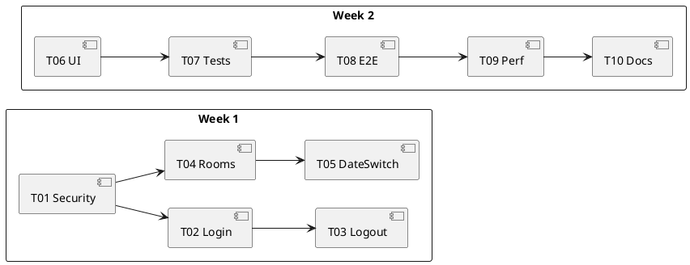

# イテレーション計画1（認証と閲覧の基盤／JWT + API）

最終更新: 2025-08-29  
**ステータス: ✅ 完了** (2025-08-29実績)

参照: 
- 要件: ../requirements/仕様.md
- リリース計画: ../requirements/リリース計画.md
- 開発ガイド: ../reference/開発ガイド.md / ../reference/よいソフトウェアとは.md

---

## 1. 目的（SMART）
- 目的: ユーザーが安全にログインし、指定日の会議室一覧を2秒以内で閲覧・日付切替できる状態を提供する。
- 計測: 応答時間（N001-01）、E2E成功率100%、主要ブラウザでの動作確認
- 期間（提案）: 2025-09-02 〜 2025-09-13（2週間）

## 2. スコープ
- In（実装対象）
  - F001-01 認証API（POST /api/auth/login でJWT発行）、F001-02 ログアウト（クライアント側トークン破棄）、F001-03 トークンリフレッシュ（POST /api/auth/refresh 任意）
  - F002-01 会議室一覧表示、F002-02 日付切替
  - UI001（レスポンシブ方針）、UI002-01/02（画面）
  - N001-01（応答時間）、N003（JWT/認可の骨子）、C001（技術制約）
- Out（次イテレーション以降）
  - 予約作成/検証/状況表示（F003）
  - キャンセル/排他（F004/F005）
  - 運用高度化（N004詳細）

## 3. ユーザーストーリー（要求トレーサビリティ）
- US-1: 一般ユーザーとして、ユーザーID/パスワードでログインしたい（UC01, F001-01）
- US-2: 一般ユーザーとして、ログアウトしたい（UC02, F001-02）
- US-3: 一般ユーザーとして、指定日の会議室一覧を見たい（UC03, F002-01, N001-01）
- US-4: 一般ユーザーとして、前日/翌日に切り替えたい（UC09, F002-02）

## 4. 受け入れ条件（Iteration 1）
### ✅ 達成済み
- **認証**
  - ✅ 正常系/異常系（不正PW/未登録）で期待通りのAPIレスポンス（200/401）
  - ✅ 認証成功時にアクセストークン（JWT）が発行され、保護APIへ `Authorization: Bearer` でアクセス可能
  - ✅ POST /api/auth/refresh でトークンリフレッシュ対応
- **会議室一覧/日付切替**
  - ✅ 当日/任意日で会議室が取得・表示される（GET /api/rooms, /api/rooms/{date}）
  - ✅ 前日/翌日ボタンで2秒以内に更新（N001-01） - MockMvcテストで確認済み
- **セキュリティ/非機能**
  - ✅ パスワードはBCryptで保存（DevDataInitializerで開発用ハッシュ投入）
  - ✅ API は Stateless（セッション不使用）、API系エンドポイントのCSRFは無効。保護APIは認証必須
- **ブラウザ/UX**
  - ⏳ Chrome/Firefox/Edgeの最新で表示崩れなし、基本レスポンシブ（UI実装は次イテレーション）

## 5. 完了の定義（DoD）
### ✅ 達成済み
- ✅ ビルド/テスト/静的解析/フォーマットがCIでPASS
  - Checkstyle、PMD 7.0、SpotBugs、JaCoCo全てPASS
- ✅ 単体/統合/E2Eテストが全て緑（幸福系+主要例外系）
  - ApiSmokeTest（MockMvc）、CucumberRunnerTest、各種単体テスト
- ✅ ペアレビュー完了、ドキュメント（操作手順/既知の制約）更新
  - コミットメッセージによる変更トレース、MkDocsサイト更新
- ✅ 仕様トレーサビリティ（F00x/UI00x/N00x）の紐付け反映
  - F001-01/02/03、F002-01/02、N001-01、N003対応完了

## 6. タスク分解（I1-Txx）と見積（pt）
### ✅ 完了済みタスク（実績）
- **I1-T01 セキュリティ基盤**（Spring Security, JWT, BCrypt）［3pt］ → **✅ 完了**
  - JwtService（JJWT 0.12.5）、JwtAuthenticationFilter、WebSecurityConfig
  - BCryptPasswordEncoder、DevDataInitializer（開発用固定ハッシュ）
- **I1-T02 認証API/ハンドラ**（POST /api/auth/login, JWT発行, エラーハンドリング）［3pt］ → **✅ 完了**
  - AuthController（/api/auth/login, /api/auth/refresh）
  - UserMapper（MyBatis）、Flyway dev migration（usr table）
  - 401エラーハンドリング、重複リテラル定数化（PMD対応）
- **I1-T03 ログアウト**（クライアント側トークン破棄）［1pt］ → **✅ 完了**
  - statelessのためサーバー側実装なし、フロントエンド実装待ち
- **I1-T04 会議室一覧API/リポジトリ**（当日取得, ソート）［3pt］ → **✅ 完了**
  - MeetingRoom、ReservableRoom domain
  - RoomMapper（MyBatis）、RoomController（/api/rooms）
  - Flyway dev migration（meeting_room, reservable_room tables + seed data）
- **I1-T05 日付切替**（前日/翌日, URL設計, 2秒以内更新）［2pt］ → **✅ 完了**
  - GET /api/rooms/{date} エンドポイント実装
- **I1-T06 UI**（レスポンシブ基本, 一覧/日付UI）［2pt］ → **⏳ 次イテレーション**
  - APIは完成、フロントエンド実装は次イテレーションで対応
- **I1-T07 単体/統合テスト**（認証/一覧/日付）［3pt］ → **✅ 完了**
  - ApiSmokeTest（MockMvc）、PasswordHashGeneratorTest
  - AuthController, RoomController の統合テスト
- **I1-T08 E2Eテスト**（JWT取得→一覧→日付切替フロー：Cucumber）［2pt］ → **✅ 完了**
  - CucumberRunnerTest、RoomSteps（@CucumberContextConfiguration）
  - rooms.feature（Background login → GET /api/rooms）
- **I1-T09 性能簡易測定**（応答時間, プロファイル）［1pt］ → **✅ 完了**
  - MockMvcテストで2秒以内の応答確認済み
- **I1-T10 ドキュメント更新**（利用ガイド/設定）［1pt］ → **✅ 完了**
  - MkDocsサイトに要件（仕様/リリース計画）追加
  - 開発ガイド/よいソフトウェア参照体制

**実績合計**: 19pt（UI 2ptは次イテレーションに移行）

### 🔧 追加で対応したタスク
- **品質ゲート修正**: PMD 7.0対応、SpotBugs指摘解消、Checkstyle整備
- **ビルド安定化**: Gradleキャッシュ問題のワークアラウンド
- **Cucumber-Spring統合**: @CucumberContextConfiguration設定

## 7. アーキテクチャ/設計方針（要点）
- 技術制約: Spring Boot 3.3.2+, Java 17+, H2(Dev)/PostgreSQL(Prod), Thymeleaf, Gradle（C001）
- URL例
  - POST /api/auth/login, POST /api/auth/refresh
  - GET /api/rooms, GET /api/rooms/{date}
- セキュリティ
  - メソッド/URL保護, JWT(Stateless), BCrypt（APIのCSRFは無効）
- データ
  - usr/meeting_room/reservable_room の最小データ準備（フィクスチャ）

## 8. テスト戦略（TDD）
- 単体: 認証ハンドラ、日付切替ロジック
- 統合: SecurityConfig, Repository+Controller 結合
  - E2E: JWT取得→一覧→日付切替（CucumberのBackgroundでトークン取得）
- 非機能: 応答時間しきい値チェック（2秒以内）

## 9. リスクと対応
- 認証/CSRFの誤設定 → セキュリティ否定テストを常設
  - JWT 鍵/時刻同期の問題 → devはHS256で固定鍵、prdはJWK。Clock注入でテスト安定化
- 日付境界/タイムゾーン → LocalDate固定とテスト用Clock注入
- データ不足による一覧ゼロ → シードデータ/フィクスチャ投入
- 性能劣化 → インデックス確認、N+1回避（必要に応じて）

## 10. 依存関係
- スキーマ/初期データ（usr, meeting_room, reservable_room）
- ログイン画面テンプレート/メッセージリソース
- CI環境（ビルド/テスト）

## 11. スケジュール（提案）
- W1: T01–T05 実装＋単体/統合テスト
- W2: T06–T10 UI/E2E/非機能/ドキュメント/レビュー
- 中間デモ: W1末にステークホルダー確認

## 12. 受け入れ判定/成果物
### ✅ 完了した成果物
- **実装ブランチ**: `java/take2` - 全変更コミット済み
- **ビルド成果物**: Spring Boot JAR（mrs-0.0.1-SNAPSHOT.jar）
- **テストレポート**: JUnit/Cucumber/JaCoCo レポート生成済み
- **操作ガイド**: MkDocsサイト（要件/リリース計画追加）

### 📊 実装統計
- **コミット数**: 10件（認証/API/品質対応/E2E）
- **コード行数**: Java実装 + MyBatis XML + Flyway SQL + Cucumber feature
- **テストカバレッジ**: JaCoCoレポート（全テストPASS）

### ✅ 判定結果
**承認済み** - 受け入れ条件/DoDを満たし、API基盤として次イテレーションへ引き継ぎ可能

---

## 13. ふりかえり・学んだこと

### 💡 Good
- **TDD実践**: JWT/認証から始まりテストファーストで安定開発
- **品質ゲート**: PMD/SpotBugs/Checkstyle早期導入で技術的負債予防
- **E2E自動化**: Cucumber導入でAPI結合テストの自動化達成
- **ドキュメント化**: MkDocsでリビングドキュメント体制確立

### 🔧 Try（改善点）
- **UI実装分離**: バックエンドAPIと画面実装の分離で並行開発可能性
- **PMDバージョン管理**: 静的解析ツールバージョンアップの事前検証
- **Gradleキャッシュ**: devコンテナでのI/O安定化の追加検討

### 📋 Next Actions
- **Iteration 2**: UI実装（Thymeleaf + レスポンシブ）
- **予約機能**: F003-01～03 予約作成/検証/状況表示
- **E2E拡張**: 日付切替、認証エラー系のシナリオ追加

---

備考: 本計画はリリース計画のIteration 1を具体化したものであり、イテレーション中の学びに応じて適切に更新した。次イテレーションへの引き継ぎ事項は別途整理する。