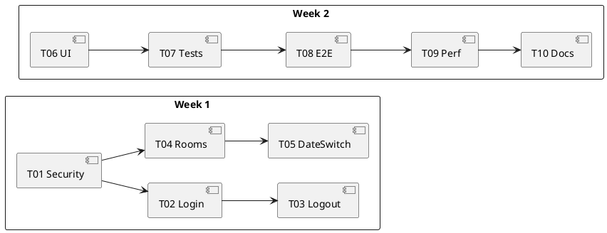

# イテレーション計画1（認証と閲覧の基盤／JWT + API）

最終更新: 2025-08-29

参照: 
- 要件: ../requirements/仕様.md
- リリース計画: ../requirements/リリース計画.md
- 開発ガイド: ../reference/開発ガイド.md / ../reference/よいソフトウェアとは.md

---

## 1. 目的（SMART）
- 目的: ユーザーが安全にログインし、指定日の会議室一覧を2秒以内で閲覧・日付切替できる状態を提供する。
- 計測: 応答時間（N001-01）、E2E成功率100%、主要ブラウザでの動作確認
- 期間（提案）: 2025-09-02 〜 2025-09-13（2週間）

## 2. スコープ
- In（実装対象）
  - F001-01 認証API（POST /api/auth/login でJWT発行）、F001-02 ログアウト（クライアント側トークン破棄）、F001-03 トークンリフレッシュ（POST /api/auth/refresh 任意）
  - F002-01 会議室一覧表示、F002-02 日付切替
  - UI001（レスポンシブ方針）、UI002-01/02（画面）
  - N001-01（応答時間）、N003（JWT/認可の骨子）、C001（技術制約）
- Out（次イテレーション以降）
  - 予約作成/検証/状況表示（F003）
  - キャンセル/排他（F004/F005）
  - 運用高度化（N004詳細）

## 3. ユーザーストーリー（要求トレーサビリティ）
- US-1: 一般ユーザーとして、ユーザーID/パスワードでログインしたい（UC01, F001-01）
- US-2: 一般ユーザーとして、ログアウトしたい（UC02, F001-02）
- US-3: 一般ユーザーとして、指定日の会議室一覧を見たい（UC03, F002-01, N001-01）
- US-4: 一般ユーザーとして、前日/翌日に切り替えたい（UC09, F002-02）

## 4. 受け入れ条件（Iteration 1）
- 認証
  - 正常系/異常系（不正PW/未登録）で期待通りのAPIレスポンス（200/401）
  - 認証成功時にアクセストークン（JWT）が発行され、保護APIへ `Authorization: Bearer` でアクセス可能
- 会議室一覧/日付切替
  - 当日/任意日で会議室が取得・表示される
  - 前日/翌日ボタンで2秒以内に更新（N001-01）
- セキュリティ/非機能
  - パスワードはBCryptで保存
  - API は Stateless（セッション不使用）、API系エンドポイントのCSRFは無効。保護APIは認証必須
- ブラウザ/UX
  - Chrome/Firefox/Edgeの最新で表示崩れなし、基本レスポンシブ

## 5. 完了の定義（DoD）
- ビルド/テスト/静的解析/フォーマットがCIでPASS
- 単体/統合/E2Eテストが全て緑（幸福系+主要例外系）
- ペアレビュー完了、ドキュメント（操作手順/既知の制約）更新
- 仕様トレーサビリティ（F00x/UI00x/N00x）の紐付け反映

## 6. タスク分解（I1-Txx）と見積（pt）
- I1-T01 セキュリティ基盤（Spring Security, JWT, BCrypt）［3pt］
  - I1-T02 認証API/ハンドラ（POST /api/auth/login, JWT発行, エラーハンドリング）［3pt］
  - I1-T03 ログアウト（クライアント側トークン破棄）［1pt］
- I1-T04 会議室一覧API/リポジトリ（当日取得, ソート）［3pt］
- I1-T05 日付切替（前日/翌日, URL設計, 2秒以内更新）［2pt］
- I1-T06 UI（レスポンシブ基本, 一覧/日付UI）［2pt］
- I1-T07 単体/統合テスト（認証/一覧/日付）［3pt］
  - I1-T08 E2Eテスト（JWT取得→一覧→日付切替フロー：Cucumber）［2pt］
- I1-T09 性能簡易測定（応答時間, プロファイル）［1pt］
- I1-T10 ドキュメント更新（利用ガイド/設定）［1pt］

合計: 21pt（2週間相当）

## 7. アーキテクチャ/設計方針（要点）
- 技術制約: Spring Boot 3.3.2+, Java 17+, H2(Dev)/PostgreSQL(Prod), Thymeleaf, Gradle（C001）
- URL例
  - POST /api/auth/login, POST /api/auth/refresh
  - GET /api/rooms, GET /api/rooms/{date}
- セキュリティ
  - メソッド/URL保護, JWT(Stateless), BCrypt（APIのCSRFは無効）
- データ
  - usr/meeting_room/reservable_room の最小データ準備（フィクスチャ）

## 8. テスト戦略（TDD）
- 単体: 認証ハンドラ、日付切替ロジック
- 統合: SecurityConfig, Repository+Controller 結合
  - E2E: JWT取得→一覧→日付切替（CucumberのBackgroundでトークン取得）
- 非機能: 応答時間しきい値チェック（2秒以内）

## 9. リスクと対応
- 認証/CSRFの誤設定 → セキュリティ否定テストを常設
  - JWT 鍵/時刻同期の問題 → devはHS256で固定鍵、prdはJWK。Clock注入でテスト安定化
- 日付境界/タイムゾーン → LocalDate固定とテスト用Clock注入
- データ不足による一覧ゼロ → シードデータ/フィクスチャ投入
- 性能劣化 → インデックス確認、N+1回避（必要に応じて）

## 10. 依存関係
- スキーマ/初期データ（usr, meeting_room, reservable_room）
- ログイン画面テンプレート/メッセージリソース
- CI環境（ビルド/テスト）

## 11. スケジュール（提案）
- W1: T01–T05 実装＋単体/統合テスト
- W2: T06–T10 UI/E2E/非機能/ドキュメント/レビュー
- 中間デモ: W1末にステークホルダー確認

## 12. 受け入れ判定/成果物
- 成果物: 実装ブランチ, ビルド成果物, テストレポート, 操作ガイド
- 判定: 受け入れ条件/DoDを満たし、デモ実施で承認

---

備考: 本計画はリリース計画のIteration 1を具体化したものであり、イテレーション中の学びに応じて適切に更新する。