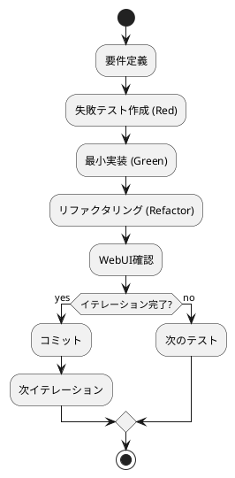

# ぷよぷよアプリケーション 実装ドキュメント

## 実装概要

本ぷよぷよアプリケーションは、**TypeScript** を使用し、**テスト駆動開発（TDD）** によって8つのイテレーションを通じて段階的に実装されました。**Vitest** によるテストファースト開発、**Canvas API** による描画、**イベント駆動アーキテクチャ** による入力処理を特徴とします。

## 技術スタック

### コア技術
- **TypeScript 5.0.2**: 型安全性を重視した開発言語
- **Vite 4.3.2**: 高速なビルドツール・開発サーバー
- **Canvas API**: HTML5 Canvas による2D描画
- **ES Modules**: モダンなモジュールシステム

### 開発・テスト環境
- **Vitest 0.30.1**: 高速なテストランナー
- **Happy-DOM 17.6.1**: 軽量なDOM環境
- **C8 7.13.0**: コードカバレッジ測定
- **ESLint/Prettier**: コード品質・フォーマット管理
- **Gulp 4.0.2**: タスク自動化

## 開発プロセス

### TDD サイクル実装



### 8イテレーション構成

1. **イテレーション1**: ゲーム開始の実装
2. **イテレーション2**: ぷよの移動の実装
3. **イテレーション3**: ぷよの回転の実装
4. **イテレーション4**: ぷよの高速落下の実装
5. **イテレーション5**: ぷよの消去の実装
6. **イテレーション6**: 連鎖反応の実装
7. **イテレーション7**: 全消しボーナスの実装
8. **イテレーション8**: ゲームオーバーの実装

## コア実装詳細

### 1. ゲーム制御システム（Game.ts）

#### ゲームループ実装
```typescript
update(): void {
  if (!this.running || !this.currentPuyo || this.gameOverState) {
    return
  }

  this.frameCount++

  // 高速落下判定
  let shouldDrop = false
  if (this.highSpeedDrop) {
    shouldDrop = true
  } else {
    const dropInterval = Config.GAME_SPEED
    shouldDrop = this.frameCount % dropInterval === 0
  }

  if (shouldDrop) {
    const droppedPuyo = this.player.dropPuyoDown(this.currentPuyo)
    
    if (droppedPuyo.main.y > this.currentPuyo.main.y) {
      this.currentPuyo = droppedPuyo
    } else {
      this.fixCurrentPuyoWithGameOverCheck()
    }
  }

  this.render()
}
```

#### 重要な実装ポイント
- **フレームベース更新**: 60FPS対応のスムーズな動作
- **状態チェック**: ゲーム状態の一貫性保証
- **条件分岐**: 高速落下と通常落下の切り替え
- **着地判定**: Y座標変化による着地検出

#### 入力処理実装
```typescript
handleInput(key: string): void {
  if (!this.running || !this.currentPuyo) {
    return
  }

  switch (key) {
    case 'ArrowLeft':
    case 'KeyA':
      this.currentPuyo = this.player.movePuyoLeft(this.currentPuyo)
      break
    case 'ArrowRight':
    case 'KeyD':
      this.currentPuyo = this.player.movePuyoRight(this.currentPuyo)
      break
    case 'ArrowDown':
    case 'KeyS':
      this.enableHighSpeedDrop()
      break
    case 'KeyX':
    case 'ArrowUp':
      this.currentPuyo = this.player.rotatePuyoClockwise(this.currentPuyo)
      break
    case 'KeyZ':
      this.currentPuyo = this.player.rotatePuyoCounterClockwise(this.currentPuyo)
      break
  }

  this.render()
}

handleKeyUp(key: string): void {
  if (!this.running || !this.currentPuyo) {
    return
  }

  switch (key) {
    case 'ArrowDown':
    case 'KeyS':
      this.disableHighSpeedDrop()
      break
  }
}
```

#### 重要な実装ポイント
- **重複キー対応**: 矢印キーとWASDキーの両対応
- **状態管理**: 高速落下のkeydown/keyup制御
- **イミュータブル更新**: 元のぷよを変更せず新しいインスタンスで更新
- **即座のレンダリング**: 入力後の即座な画面更新

### 2. 盤面管理システム（Stage.ts）

#### 連結グループ検出実装（DFS）
```typescript
findConnectedGroups(): Array<Array<{x: number, y: number, color: number}>> {
  const visited: boolean[][] = Array(Config.STAGE_HEIGHT).fill(null).map(() => Array(Config.STAGE_WIDTH).fill(false))
  const groups: Array<Array<{x: number, y: number, color: number}>> = []

  for (let y = 0; y < Config.STAGE_HEIGHT; y++) {
    for (let x = 0; x < Config.STAGE_WIDTH; x++) {
      const color = this.getCell(x, y)
      
      if (color <= 0 || visited[y][x]) {
        continue
      }

      const group: Array<{x: number, y: number, color: number}> = []
      this.dfsConnectedGroup(x, y, color, visited, group)

      if (group.length > 0) {
        groups.push(group)
      }
    }
  }

  return groups
}

private dfsConnectedGroup(
  x: number, 
  y: number, 
  targetColor: number, 
  visited: boolean[][], 
  group: Array<{x: number, y: number, color: number}>
): void {
  const cellValue = this.getCell(x, y)
  if (!this.isValidPosition(x, y) || visited[y][x] || cellValue !== targetColor || cellValue <= 0) {
    return
  }

  visited[y][x] = true
  group.push({x, y, color: targetColor})

  // 4方向探索
  const directions = [
    {dx: 0, dy: -1}, // 上
    {dx: 1, dy: 0},  // 右
    {dx: 0, dy: 1},  // 下
    {dx: -1, dy: 0}  // 左
  ]

  for (const {dx, dy} of directions) {
    this.dfsConnectedGroup(x + dx, y + dy, targetColor, visited, group)
  }
}
```

#### 重要な実装ポイント
- **DFS アルゴリズム**: 深度優先探索による効率的な連結検出
- **訪問済み管理**: 重複探索を防ぐvisited配列
- **4方向探索**: 上下左右の隣接セル検査
- **境界チェック**: 配列範囲外アクセスの防止

#### 重力適用実装
```typescript
applyGravity(): void {
  for (let x = 0; x < Config.STAGE_WIDTH; x++) {
    let writeY = Config.STAGE_HEIGHT - 1 // 書き込み位置（下から）

    // 下から上へスキャン
    for (let readY = Config.STAGE_HEIGHT - 1; readY >= 0; readY--) {
      const cell = this.getCell(x, readY)
      
      if (cell !== 0) { // 空でないセル
        if (writeY !== readY) {
          // 下の位置に移動
          this.setCell(x, writeY, cell)
          this.setCell(x, readY, 0)
        }
        writeY-- // 次の書き込み位置
      }
    }
  }
}
```

#### 重要な実装ポイント
- **二つのポインタ**: readYとwriteYによる効率的な詰め処理
- **列単位処理**: 各列を独立して処理
- **下から上へ**: 重力方向に従った自然な落下
- **インプレース操作**: 新しい配列を作らずに既存配列を更新

### 3. プレイヤー操作システム（Player.ts）

#### 回転処理実装
```typescript
rotatePuyoClockwise(puyo: PuyoPair): PuyoPair {
  const newPuyo = puyo.clone()
  
  // メインぷよを基準にサブぷよを時計回りに回転
  const relativeX = puyo.sub.x - puyo.main.x
  const relativeY = puyo.sub.y - puyo.main.y
  
  // 時計回り回転: (x, y) -> (y, -x)
  const newRelativeX = relativeY
  const newRelativeY = -relativeX
  
  newPuyo.sub.x = puyo.main.x + newRelativeX
  newPuyo.sub.y = puyo.main.y + newRelativeY

  return this.tryRotationWithWallKick(puyo, newPuyo)
}

private tryRotationWithWallKick(originalPuyo: PuyoPair, rotatedPuyo: PuyoPair): PuyoPair {
  // 通常の回転が可能かチェック
  if (this.isValidPuyoPosition(rotatedPuyo)) {
    return rotatedPuyo
  }

  // 壁キックを試行
  const wallKickOffsets = [
    { x: -1, y: 0 }, // 左にずらす
    { x: 1, y: 0 },  // 右にずらす
    { x: 0, y: -1 }, // 上にずらす
    { x: 0, y: 1 },  // 下にずらす
  ]

  for (const offset of wallKickOffsets) {
    const kickedPuyo = rotatedPuyo.clone()
    kickedPuyo.main.x += offset.x
    kickedPuyo.main.y += offset.y
    kickedPuyo.sub.x += offset.x
    kickedPuyo.sub.y += offset.y

    if (this.isValidPuyoPosition(kickedPuyo)) {
      return kickedPuyo
    }
  }

  return originalPuyo
}
```

#### 重要な実装ポイント
- **相対座標計算**: メインぷよを基準とした回転計算
- **回転行列**: 数学的な回転変換の実装
- **壁キック**: 回転時の柔軟な位置調整
- **フォールバック**: 回転不可時の元位置復帰

### 4. ぷよオブジェクト実装（Puyo.ts）

#### クローン実装の重要性
```typescript
// PuyoPair クラスの clone メソッド
clone(): PuyoPair {
  const cloned = new PuyoPair(
    this.main.x,
    this.main.y,
    this.main.color,
    this.sub.color
  )
  // 回転状態を保持するため、subの実際の位置をコピー
  cloned.sub.x = this.sub.x
  cloned.sub.y = this.sub.y
  return cloned
}
```

#### 重要な実装ポイント
- **深いコピー**: 回転状態を含む完全な複製
- **状態保持**: subの位置情報の正確な保持
- **バグ修正**: 回転が元に戻る問題の解決（重要な修正ポイント）

### 5. 連鎖システム実装

#### 連鎖処理の核心実装
```typescript
processEliminationWithChain(): number {
  let chainCount = 0
  let totalScore = 0
  
  while (true) {
    const eliminatableGroups = this.stage.findEliminatableGroups()
    
    if (eliminatableGroups.length === 0) {
      break // 消去対象がなくなったら連鎖終了
    }
    
    chainCount++
    
    // 各グループのスコア計算
    let currentChainScore = 0
    for (const group of eliminatableGroups) {
      const baseScore = group.length * 10
      const sizeBonus = group.length >= 5 ? (group.length - 4) * 20 : 0
      currentChainScore += baseScore + sizeBonus
    }
    
    // 連鎖倍率を適用
    const multiplier = this.getChainMultipliers()[chainCount - 1] || this.getChainMultipliers()[this.getChainMultipliers().length - 1]
    const finalChainScore = currentChainScore * multiplier
    
    totalScore += finalChainScore
    
    // 消去と重力を実行
    this.stage.eliminatePuyo()
    this.stage.applyGravity()
  }
  
  this.score += totalScore
  return chainCount
}
```

#### 重要な実装ポイント
- **ループ処理**: 連鎖が続く限り繰り返し
- **スコア計算**: 基本スコア + サイズボーナス + 連鎖倍率
- **倍率管理**: 連鎖回数に応じた倍率テーブル
- **物理処理**: 消去後の重力適用

### 6. 全消しシステム実装

#### 全消し判定と処理
```typescript
processEliminationWithAllClearCheck(): AllClearResult {
  const chainResult = this.processEliminationWithChainInfo()
  const isAllClear = this.checkAllClear()
  
  let allClearBonus = 0
  if (isAllClear) {
    // 全消しボーナスを計算（連鎖の基本スコアに基づく）
    const baseChainScore = chainResult.chainDetails.reduce((sum, detail) => {
      return sum + (detail.score / detail.multiplier) // 倍率を除いた基本スコア
    }, 0)
    
    allClearBonus = this.calculateAllClearBonus(baseChainScore)
    this.score += allClearBonus
    this.allClearCount++
  }
  
  return {
    isAllClear: isAllClear,
    chainCount: chainResult.chainCount,
    allClearBonus: allClearBonus,
    totalScore: chainResult.totalScore + allClearBonus,
    chainDetails: chainResult.chainDetails
  }
}

checkAllClear(): boolean {
  return this.stage.isEmpty()
}

calculateAllClearBonus(baseScore: number): number {
  return baseScore * 30 // 一般的な全消しボーナスは30倍
}
```

#### 重要な実装ポイント
- **判定タイミング**: 連鎖終了後の全消し判定
- **ボーナス計算**: 基本スコアの30倍
- **カウント管理**: 全消し回数の追跡
- **統合処理**: 連鎖と全消しの組み合わせ

## テスト実装

### テスト構成
```
app/test/
├── Config.test.ts           # 設定値テスト
├── main.test.ts            # メイン処理テスト
├── Player.test.ts          # プレイヤー操作テスト
├── Stage.test.ts           # ステージ管理テスト
├── Rotation.test.ts        # 回転処理テスト
├── HighSpeedDrop.test.ts   # 高速落下テスト
├── GameLoop.test.ts        # ゲームループテスト
├── PuyoElimination.test.ts # 消去処理テスト
├── ChainSystem.test.ts     # 連鎖システムテスト
├── AllClear.test.ts        # 全消しテスト
└── GameOver.test.ts        # ゲームオーバーテスト
```

### テスト実装例
```typescript
// Stage.test.ts から抜粋
describe('Stage クラス', () => {
  let stage: Stage

  beforeEach(() => {
    stage = new Stage()
  })

  test('初期状態では空である', () => {
    expect(stage.isEmpty()).toBe(true)
  })

  test('連結グループを正しく検出する', () => {
    // 4つの赤いぷよを縦に配置
    stage.setCell(0, 8, 1)
    stage.setCell(0, 9, 1)
    stage.setCell(0, 10, 1)
    stage.setCell(0, 11, 1)

    const eliminatableGroups = stage.findEliminatableGroups()
    expect(eliminatableGroups).toHaveLength(1)
    expect(eliminatableGroups[0]).toHaveLength(4)
  })
})
```

### テスト戦略
- **境界値テスト**: 盤面端、回転限界の検証
- **異常系テスト**: 無効入力、ゲームオーバー後操作の確認
- **状態遷移テスト**: ゲーム状態変化の検証
- **統合テスト**: 複数クラス間の連携確認

### テストカバレッジ
- **98テスト実行**: 全機能の網羅的テスト
- **高いカバレッジ**: C8による詳細なカバレッジ測定
- **継続的テスト**: Vitest watchモードによる開発時テスト

## 描画システム実装

### Canvas描画実装
```typescript
private render(): void {
  // 画面をクリア
  this.ctx.clearRect(0, 0, this.canvas.width, this.canvas.height)

  // ステージを描画
  this.renderStage()

  // 現在のぷよを描画
  if (this.currentPuyo) {
    this.renderPuyo(this.currentPuyo.main)
    this.renderPuyo(this.currentPuyo.sub)
  }
}

private renderPuyo(puyo: { x: number; y: number; color: number }): void {
  const pixelX = puyo.x * Config.PUYO_SIZE
  const pixelY = puyo.y * Config.PUYO_SIZE

  this.ctx.fillStyle = Config.COLORS[puyo.color]
  this.ctx.fillRect(
    pixelX,
    pixelY,
    Config.PUYO_SIZE,
    Config.PUYO_SIZE
  )

  // 枠線を描画
  this.ctx.strokeStyle = '#ffffff'
  this.ctx.strokeRect(
    pixelX,
    pixelY,
    Config.PUYO_SIZE,
    Config.PUYO_SIZE
  )
}
```

### 描画最適化
- **効率的クリア**: clearRectによる画面消去
- **色管理**: Config.COLORSによる一元管理
- **サイズ統一**: Config.PUYO_SIZEによる統一サイズ
- **視覚的改善**: 白い枠線による明確な区別

## エントリーポイント実装（main.ts）

### 初期化とイベント処理
```typescript
import { Game } from './Game'

// Canvas要素の取得と初期化
const canvas = document.getElementById('gameCanvas') as HTMLCanvasElement
if (!canvas) {
  throw new Error('Canvas element not found')
}

// ゲームインスタンスの作成
const game = new Game(canvas)

// キーボードイベントリスナーの設定
document.addEventListener('keydown', (event) => {
  game.handleInput(event.code)
})

document.addEventListener('keyup', (event) => {
  game.handleKeyUp(event.code)
})

// ゲーム開始
game.start()

// ゲームループの開始
function gameLoop() {
  game.update()
  requestAnimationFrame(gameLoop)
}

requestAnimationFrame(gameLoop)
```

### 重要な実装ポイント
- **エラーハンドリング**: Canvas要素の存在確認
- **イベント分離**: keydownとkeyupの個別処理
- **ゲームループ**: requestAnimationFrameによる最適化
- **ライフサイクル**: 初期化 → イベント設定 → ループ開始

## ビルド・開発環境

### package.json スクリプト
```json
{
  "scripts": {
    "dev": "vite --host",
    "build": "tsc && vite build",
    "preview": "vite preview",
    "test": "vitest run",
    "test:watch": "vitest",
    "test:coverage": "c8 vitest run",
    "lint": "eslint . --ext .ts,.tsx",
    "lint:fix": "eslint . --ext .ts,.tsx --fix",
    "format": "prettier --write .",
    "format:check": "prettier --check .",
    "check": "gulp checkAndFix"
  }
}
```

### 開発ワークフロー
1. **開発サーバー**: `npm run dev` でホットリロード
2. **テスト実行**: `npm run test:watch` で継続テスト
3. **コード品質**: `npm run check` で自動チェック・修正
4. **ビルド**: `npm run build` で本番用ビルド

## パフォーマンス最適化

### 実装された最適化
1. **効率的アルゴリズム**: DFS による O(n) の連結検出
2. **メモリ管理**: 不要なオブジェクト生成の削減
3. **レンダリング最適化**: 必要時のみの再描画
4. **イベント最適化**: 適切なイベントリスナー管理

### 測定可能な性能
- **テスト実行時間**: 高速なテスト実行
- **ビルド時間**: Vite による高速ビルド
- **実行時性能**: 60FPS での滑らかな動作

## 品質保証

### コード品質ツール
- **ESLint**: 静的解析によるコード品質チェック
- **Prettier**: 一貫したコードフォーマット
- **TypeScript**: 静的型チェックによる型安全性
- **Vitest**: 高速で信頼性の高いテスト実行

### 継続的品質管理
- **Git フック**: コミット前の自動チェック
- **自動修正**: lint:fix, format による自動修正
- **カバレッジ監視**: C8 によるテストカバレッジ測定

## デプロイメント

### ビルド成果物
```
dist/
├── assets/
│   ├── index-[hash].css
│   └── index-[hash].js
├── index.html
└── vite.svg
```

### 配布方法
- **静的ファイル**: HTML + JS + CSS の静的配布
- **CDN対応**: アセットの最適化とキャッシュ対応
- **軽量化**: Tree shaking による不要コード除去

## 今後の拡張実装

### 準備された拡張ポイント
1. **音響システム**: 効果音・BGM 追加のための基盤
2. **アニメーション**: 消去・連鎖エフェクトのための構造
3. **ネットワーク対戦**: 状態同期機能の追加可能性
4. **AI対戦**: Player インターフェース化による AI 実装

### 実装容易性
- **疎結合設計**: 新機能追加時の既存コード影響最小化
- **インターフェース分離**: 新しい実装の容易な差し替え
- **設定外部化**: Config.ts による調整可能性
- **テスト基盤**: 新機能に対するテスト追加の容易性