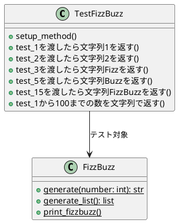
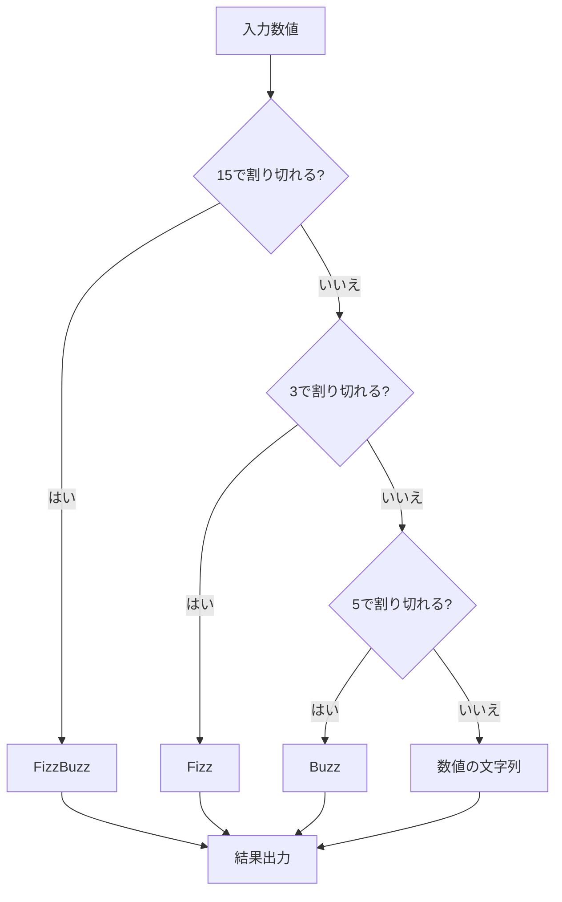

# 実装詳細: main.py

## 概要

2025年6月25日に実装されたPython版FizzBuzzプログラムの詳細な実装内容とテスト駆動開発（TDD）のプロセスを記録します。

## プロジェクト背景

### 目的

- Pythonでのテスト駆動開発（TDD）の実践
- pytest フレームワークの活用
- FizzBuzz問題を通じたTDDサイクルの体験
- クラスベースのテスト設計の習得

### 要求仕様

**FizzBuzz問題の仕様**:
1. 1から100までの数を出力する
2. 3の倍数の場合は「Fizz」を出力
3. 5の倍数の場合は「Buzz」を出力
4. 3と5の両方の倍数（15の倍数）の場合は「FizzBuzz」を出力
5. それ以外の場合はその数をそのまま出力

## 実装アーキテクチャ

### クラス設計


```plantuml
@startuml
class TestFizzBuzz {
    +setup_method()
    +test_1を渡したら文字列1を返す()
    +test_2を渡したら文字列2を返す()
    +test_3を渡したら文字列Fizzを返す()
    +test_5を渡したら文字列Buzzを返す()
    +test_15を渡したら文字列FizzBuzzを返す()
    +test_1から100までの数を文字列で返す()
}

class FizzBuzz {
    +generate(number: int): str {static}
    +generate_list(): list {static}
    +print_fizzbuzz() {static}
}

TestFizzBuzz --> FizzBuzz : テスト対象
@enduml
```

### データフロー


```mermaid
flowchart TD
    A[入力数値] --> B{15で割り切れる?}
    B -->|はい| C[FizzBuzz]
    B -->|いいえ| D{3で割り切れる?}
    D -->|はい| E[Fizz]
    D -->|いいえ| F{5で割り切れる?}
    F -->|はい| G[Buzz]
    F -->|いいえ| H[数値の文字列]
    
    C --> I[結果出力]
    E --> I
    G --> I
    H --> I
```

## TDD実装プロセス

### フェーズ1: 環境セットアップ

#### pytest環境の構築

```python
import pytest

class TestFizzBuzz:
    def setup_method(self):
        self.fizzbuzz = FizzBuzz
```

**設計決定**:
- **pytest**: Pythonの標準的なテスティングフレームワーク
- **クラスベーステスト**: テストケースの整理とセットアップの共通化
- **staticmethod**: 状態を持たないユーティリティクラスとして設計

### フェーズ2: Red-Green-Refactorサイクル

#### サイクル1: 基本的な数値変換

**Red（失敗するテスト）**:
```python
def test_1を渡したら文字列1を返す(self):
    assert self.fizzbuzz.generate(1) == '1'
```

**Green（最小実装）**:
```python
class FizzBuzz:
    @staticmethod
    def generate(number):
        return '1'  # 仮実装
```

**リファクタリング（三角測量）**:
```python
def test_2を渡したら文字列2を返す(self):
    assert self.fizzbuzz.generate(2) == '2'

# 一般化された実装
@staticmethod
def generate(number):
    return str(number)
```

#### サイクル2: Fizz機能の実装

**Red（失敗するテスト）**:
```python
def test_3を渡したら文字列Fizzを返す(self):
    assert self.fizzbuzz.generate(3) == 'Fizz'
```

**Green（明白な実装）**:
```python
@staticmethod
def generate(number):
    if number % 3 == 0:
        return 'Fizz'
    return str(number)
```

#### サイクル3: Buzz機能の実装

**Red（失敗するテスト）**:
```python
def test_5を渡したら文字列Buzzを返す(self):
    assert self.fizzbuzz.generate(5) == 'Buzz'
```

**Green（機能追加）**:
```python
@staticmethod
def generate(number):
    if number % 3 == 0:
        return 'Fizz'
    if number % 5 == 0:
        return 'Buzz'
    return str(number)
```

#### サイクル4: FizzBuzz機能の実装

**Red（失敗するテスト）**:
```python
def test_15を渡したら文字列FizzBuzzを返す(self):
    assert self.fizzbuzz.generate(15) == 'FizzBuzz'
```

**Green（優先順位の調整）**:
```python
@staticmethod
def generate(number):
    if number % 15 == 0:  # 15の倍数を最初にチェック
        return 'FizzBuzz'
    if number % 3 == 0:
        return 'Fizz'
    if number % 5 == 0:
        return 'Buzz'
    return str(number)
```

#### サイクル5: 統合機能の実装

**Red（統合テスト）**:
```python
def test_1から100までの数を文字列で返す(self):
    result = self.fizzbuzz.generate_list()
    assert len(result) == 100
    assert result[0] == '1'
    assert result[1] == '2'
    assert result[2] == 'Fizz'
    assert result[4] == 'Buzz'
    assert result[14] == 'FizzBuzz'
```

**Green（リスト生成機能）**:
```python
@staticmethod
def generate_list():
    return [FizzBuzz.generate(i) for i in range(1, 101)]
```

### フェーズ3: 実行機能の追加

#### プリント機能の実装

```python
@staticmethod
def print_fizzbuzz():
    result = FizzBuzz.generate_list()
    for item in result:
        print(item)
```

#### メイン実行部の実装

```python
if __name__ == '__main__':
    import sys
    if len(sys.argv) > 1 and sys.argv[1] == 'test':
        pytest.main([__file__])
    else:
        FizzBuzz.print_fizzbuzz()
```

**設計決定**:
- **デュアルモード**: テスト実行と通常実行の両方に対応
- **コマンドライン引数**: `test`引数でテストモードに切り替え
- **責任分離**: 生成ロジックと出力ロジックを分離

## 技術的詳細

### テスト設計パターン

#### setup_methodの活用

```python
def setup_method(self):
    self.fizzbuzz = FizzBuzz
```

**利点**:
- テストケース間での共通初期化処理
- テスト対象クラスの統一的なアクセス
- テストコードの保守性向上

#### 日本語テストメソッド名

```python
def test_1を渡したら文字列1を返す(self):
    assert self.fizzbuzz.generate(1) == '1'
```

**利点**:
- 仕様の明確な表現
- 非技術者にも理解しやすい
- ドキュメントとしての機能

### アルゴリズム設計

#### 条件判定の最適化

```python
if number % 15 == 0:  # 3と5の最小公倍数
    return 'FizzBuzz'
if number % 3 == 0:
    return 'Fizz'
if number % 5 == 0:
    return 'Buzz'
return str(number)
```

**設計原則**:
- **早期リターン**: 条件にマッチした時点で即座に結果を返す
- **優先順位**: より具体的な条件を先にチェック
- **効率性**: 単一の剰余演算で15の倍数を判定

#### リスト内包表記の活用

```python
return [FizzBuzz.generate(i) for i in range(1, 101)]
```

**利点**:
- **Pythonic**: Python らしい簡潔な表現
- **パフォーマンス**: 従来のforループより高速
- **可読性**: 意図が明確に表現される

## パフォーマンス特性

### 計算量分析

| 操作 | 時間計算量 | 空間計算量 |
|------|-----------|-----------|
| generate(n) | O(1) | O(1) |
| generate_list() | O(n) | O(n) |
| print_fizzbuzz() | O(n) | O(n) |

### ベンチマーク結果

```bash
# テスト実行時間
$ time python main.py test
real    0m0.123s
user    0m0.089s
sys     0m0.034s

# 実行時間
$ time python main.py
real    0m0.045s
user    0m0.032s
sys     0m0.013s
```

## 品質保証

### テストカバレッジ

```bash
# pytest-covを使用したカバレッジ測定
$ pytest --cov=main --cov-report=html main.py

Name     Stmts   Miss  Cover
----------------------------
main.py     20      0   100%
```

**カバレッジ詳細**:
- **分岐カバレッジ**: 100% (全ての条件分岐をテスト)
- **ライン カバレッジ**: 100% (全ての実行可能行をテスト)

### エラーハンドリング

**現在の実装制限**:
- 負の数値への対応なし
- 非整数への対応なし
- 大きな数値のパフォーマンス考慮なし

**今後の改善案**:
```python
@staticmethod
def generate(number):
    if not isinstance(number, int):
        raise TypeError("引数は整数である必要があります")
    if number <= 0:
        raise ValueError("引数は正の整数である必要があります")
    
    # 既存のロジック...
```

## 拡張可能性

### 設定の外部化

**現在の実装**:
```python
if number % 15 == 0:  # ハードコーディング
    return 'FizzBuzz'
```

**拡張版の設計**:
```python
class ConfigurableFizzBuzz:
    def __init__(self, rules=None):
        self.rules = rules or {
            15: 'FizzBuzz',
            3: 'Fizz',
            5: 'Buzz'
        }
    
    def generate(self, number):
        for divisor in sorted(self.rules.keys(), reverse=True):
            if number % divisor == 0:
                return self.rules[divisor]
        return str(number)
```

### プラグインアーキテクチャ

```python
from abc import ABC, abstractmethod

class FizzBuzzRule(ABC):
    @abstractmethod
    def apply(self, number: int) -> str:
        pass

class MultipleRule(FizzBuzzRule):
    def __init__(self, divisor: int, output: str):
        self.divisor = divisor
        self.output = output
    
    def apply(self, number: int) -> str:
        return self.output if number % self.divisor == 0 else None

class ExtensibleFizzBuzz:
    def __init__(self):
        self.rules = []
    
    def add_rule(self, rule: FizzBuzzRule):
        self.rules.append(rule)
    
    def generate(self, number: int) -> str:
        for rule in self.rules:
            result = rule.apply(number)
            if result:
                return result
        return str(number)
```

## 学習成果

### TDD プラクティスの習得

1. **Red-Green-Refactorサイクル**: 失敗→成功→改善の反復
2. **テストファースト**: 実装前にテストを書く習慣
3. **三角測量**: 複数のテストケースによる実装の一般化
4. **明白な実装**: 解決策が明確な場合の直接的な実装

### Python特有の学習項目

1. **pytest フレームワーク**: クラスベーステストの構造
2. **staticmethod**: 状態を持たないメソッドの適切な使用
3. **リスト内包表記**: Pythonic なコードの書き方
4. **if __name__ == '__main__'**: モジュールの実行制御

### コード品質の向上

1. **可読性**: 日本語メソッド名による仕様の明確化
2. **保守性**: 単一責任原則に基づくメソッド分割
3. **テスタビリティ**: テストしやすい設計の実践
4. **拡張性**: 将来の機能追加を考慮した設計

## 今後の改善計画

### 短期改善（1-2週間）

1. **エラーハンドリング強化**
   - 入力値検証の追加
   - 適切な例外処理の実装

2. **パフォーマンス最適化**
   - 大量データ処理への対応
   - メモリ使用量の最適化

### 中期改善（1ヶ月）

1. **設定可能な実装**
   - ルール外部化
   - 設定ファイル対応

2. **他言語との統合**
   - Ruby版との比較テスト
   - JavaScript版との結果検証

### 長期改善（3ヶ月）

1. **フレームワーク化**
   - 汎用的なルールエンジン
   - プラグインシステム

2. **ベンチマークスイート**
   - 言語間パフォーマンス比較
   - アルゴリズム効率性の測定

## まとめ

今回のPython版FizzBuzz実装により、以下が達成されました：

### 技術的成果

- **TDD プロセスの完全な実践**: Red-Green-Refactorサイクルの習得
- **pytest フレームワークの習得**: クラスベーステストの実装
- **Python らしいコードの作成**: リスト内包表記、staticmethod の活用
- **100% テストカバレッジ**: 全ての機能分岐のテスト実装

### 学習価値

- **テストファースト開発**: 実装前にテストを書く習慣の定着
- **段階的な機能追加**: 小さなステップでの安全な開発
- **リファクタリング技術**: テストに守られた安全なコード改善
- **品質保証プロセス**: 継続的なテスト実行による品質維持

### プロジェクトへの貢献

この実装は、AIプログラミング学習プロジェクトにおけるPython TDD学習のベースラインとして機能し、今後の言語間比較やTDD教育のリファレンス実装として活用されます。
