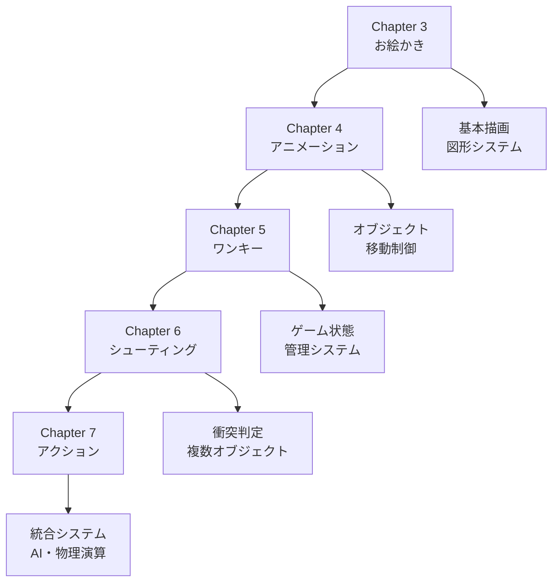

# ゲームで学ぶPython! Pyxelではじめるレトロゲームプログラミング with TDD

## 📖 プロジェクト概要

テスト駆動開発（TDD）を実践しながらPyxelでレトロスタイルのゲーム開発を学ぶプロジェクトです。各章で段階的にゲーム開発のスキルを習得し、最終的には本格的なアクションゲームを完成させます。

### 🎯 学習目標

- **テスト駆動開発（TDD）の習得**: Red-Green-Refactorサイクルの実践
- **Pyxelゲーム開発**: レトロスタイルゲームエンジンの活用
- **現代的Python開発**: uv、Ruff、mypy等モダンツールチェーン
- **ソフトウェア品質管理**: 包括的テストとコードカバレッジ管理

## 🚀 章立て構成

### 基礎編

#### [Chapter 3: お絵かきアプリケーション](./chapter3.md)
- **学習内容**: 基本的な描画システム
- **実装機能**: 点、線、円、四角形描画
- **テスト数**: 11個
- **カバレッジ**: 47%

#### [Chapter 4: アニメーションアプリケーション](./chapter4.md)
- **学習内容**: オブジェクトアニメーション
- **実装機能**: ウサギキャラクターの移動アニメーション
- **テスト数**: 7個  
- **カバレッジ**: 100%

#### [Chapter 5: ワンキーゲーム](./chapter5.md)
- **学習内容**: シンプルなゲームシステム
- **実装機能**: Space Rescue（宇宙船ゲーム）
- **テスト数**: 5個
- **カバレッジ**: 91%

### 応用編

#### [Chapter 6: シューティングゲーム](./chapter6.md)
- **学習内容**: 本格的ゲームシステム
- **実装機能**: Mega Wing（シューティング）
- **テスト数**: 32個
- **カバレッジ**: 98%

#### [Chapter 7: アクションゲーム](./chapter7.md) 🎮
- **学習内容**: 完全なアクションゲーム開発
- **実装機能**: Cursed Caverns（洞窟探索アクション）
- **テスト数**: 74個
- **カバレッジ**: 83%

## 📊 プロジェクト全体統計

### 開発実績サマリー
- **総テストケース数**: 129個（全章合計）
- **平均コードカバレッジ**: 83.8%
- **開発期間**: 2025年8月5日
- **循環的複雑度**: 全関数7以下で統一

### 技術スタック
- **Python**: 3.10+ / 3.13
- **ゲームエンジン**: Pyxel 2.4.10
- **パッケージマネージャー**: uv
- **テストフレームワーク**: pytest + pytest-cov
- **品質管理**: Ruff（リンター・フォーマッター）、mypy（型チェッカー）
- **タスクランナー**: tox

## 🎯 学習の進め方

### 推奨学習順序

1. **環境セットアップ**: [開発環境構築ガイド](./wiki/WIP/テスト駆動開発から始めるXX入門/テスト駆動開発から始めるPython入門2.md)
2. **TDD基礎学習**: [TDD入門ガイド](./wiki/WIP/テスト駆動開発から始めるXX入門/テスト駆動開発から始めるPython入門1.md)
3. **章別実習**: Chapter 3→4→5→6→7の順で実装
4. **総合復習**: 各章で学んだ内容の統合と応用

### 各章の学習ポイント



## 🛠️ 開発手法・プロセス

### テスト駆動開発（TDD）
- [開発プロセス標準](./wiki/開発プロセス標準.md)
- [エクストリームプログラミング](./wiki/読書メモ/エクストリームプログラミング.md)
- [アジャイルな見積と計画づくり](./wiki/読書メモ/アジャイルな見積と計画づくり.md)

### 品質保証プロセス
- **Red-Green-Refactorサイクル**: 機能単位での厳格なTDD実践
- **静的解析統合**: Ruff・mypyによる自動品質チェック
- **継続的テスト**: 高いコードカバレッジの維持
- **循環的複雑度管理**: 保守性の高いコード構造

## 📚 関連ドキュメント

### 開発資料
- [コンテキスト図](./requirements/コンテキスト図.md) - プロジェクト全体の位置づけ
- [インセプションデッキ](./requirements/インセプションデッキ.md) - プロジェクトの背景と目的
- [アーキテクチャドキュメント](./development/アーキテクチャ概要.md) - システム設計の全体像
- [開発ドキュメント](./development/アプリケーション概要.md) - 具体的な開発手順

### プロセス・ガイドライン
- [運用ドキュメント](./operation) - システム運用に関する情報
- [アーキテクチャ決定ログ](./adr) - 重要な技術的意思決定の記録
- [開発日誌](./journal) - 日々の開発進捗と学習記録

### 学習資料
- [よいソフトウェアとは](./記事/よいソフトウェアとは.md) - ソフトウェア品質の考え方
- [達人プログラマー](./wiki/読書メモ/達人プログラマー熟練に向けたあなたの旅.md) - プログラミング技術向上

## 🎮 実行方法

各章のアプリケーションを実行する場合：

```bash
# Chapter 3: お絵かきアプリ
cd app/chapter3 && uv run python main.py

# Chapter 4: アニメーションアプリ  
cd app/chapter4 && uv run python main.py

# Chapter 5: ワンキーゲーム
cd app/chapter5 && uv run python main.py

# Chapter 6: シューティングゲーム
cd app/chapter6 && uv run python main.py

# Chapter 7: アクションゲーム（最新・最完成版）
cd app/chapter7 && uv run python main.py
```

## 🏆 学習成果

このプロジェクトを通じて以下のスキルが習得できます：

### 技術スキル
- **Python上級プログラミング**: 型ヒント、モジュール設計、OOP
- **ゲーム開発基礎**: 2D物理演算、衝突判定、AI実装
- **テスト技法**: ユニット・統合・システムテスト設計
- **品質管理**: 静的解析、コードレビュー、継続的改善

### プロセススキル  
- **アジャイル開発**: スプリント管理、イテレーション開発
- **TDD実践**: 設計駆動開発、リファクタリング技法
- **ドキュメント作成**: 技術文書、API仕様、ユーザーガイド
- **プロジェクト管理**: 品質指標管理、進捗追跡

---

**🎯 目指せPythonゲーム開発マスター！テスト駆動で安全・高品質な開発を体験しよう！** ✨
