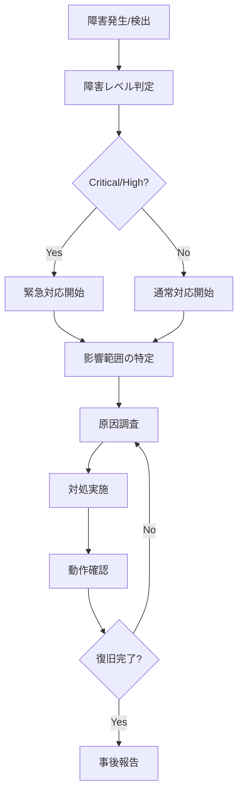

# MRS 運用手順書

バージョン: v1.0  
最終更新: 2025-09-03  
対象: イテレーション3完了版（キャンセル・排他制御対応）

## 概要

会議室予約システム（MRS）の運用手順を記載します。本書は運用担当者向けの手順書で、日常運用、障害対応、メンテナンス手順を含みます。

## 1. システム構成

### アーキテクチャ
- **フロントエンド**: Next.js 15.5, React 19, TypeScript
- **バックエンド**: Spring Boot 3, Java 17
- **データベース**: H2 Database (開発・テスト), PostgreSQL (本番予定)
- **認証**: JWT (JSON Web Token)
- **ビルドツール**: Gradle 8.5

### デプロイメント構成
```
[ロードバランサー] -> [Webアプリ] -> [API Server] -> [Database]
                                        ↓
                                   [ログ・監視]
```

## 2. 日常運用手順

### 2.1 システム起動・停止手順

#### 起動手順
```bash
# 1. プロジェクトディレクトリに移動
cd /path/to/ai-programing-exercise

# 2. バックエンドAPI起動
cd app/backend/mrs
./gradlew bootRun

# 3. フロントエンド起動（別ターミナル）
cd ../../frontend
npm run dev

# 4. ヘルスチェック
curl -f http://localhost:8080/actuator/health
curl -f http://localhost:3000/api/health
```

#### 停止手順
```bash
# 1. フロントエンド停止 (Ctrl+C)
# 2. バックエンド停止 (Ctrl+C)
# 3. プロセス確認
ps aux | grep java | grep mrs
ps aux | grep node | grep next
```

### 2.2 ヘルスチェック手順

#### 自動ヘルスチェック
```bash
# APIサーバー
curl -f http://localhost:8080/actuator/health
# 期待レスポンス: {"status":"UP"}

# フロントエンド
curl -f http://localhost:3000
# 期待レスポンス: HTTP 200 OK

# データベース接続
curl -f http://localhost:8080/actuator/health/db
# 期待レスポンス: {"status":"UP","components":{"db":{"status":"UP"}}}
```

#### 手動ヘルスチェック
1. ログイン機能確認
2. 会議室一覧表示確認
3. 予約作成確認
4. 予約キャンセル確認

### 2.3 ログ監視手順

#### ログファイル場所
- **アプリケーションログ**: `logs/application.log`
- **エラーログ**: `logs/error.log`
- **アクセスログ**: `logs/access.log`

#### 監視対象ログレベル
- **ERROR**: 即座に対応が必要
- **WARN**: 定期的な確認が必要
- **INFO**: 運用状況の把握

#### ログ監視コマンド
```bash
# エラーログのリアルタイム監視
tail -f logs/error.log

# 過去1時間のエラー件数
grep "ERROR" logs/application.log | grep "$(date -d '1 hour ago' '+%Y-%m-%d %H')" | wc -l

# アクセス数の確認
grep "$(date '+%Y-%m-%d')" logs/access.log | wc -l
```

### 2.4 データベースメンテナンス

#### バックアップ手順
```bash
# H2データベースバックアップ（開発環境）
cp data/mrs.mv.db backup/mrs_$(date +%Y%m%d_%H%M%S).mv.db

# PostgreSQLバックアップ（本番環境）
pg_dump -h localhost -U mrs_user mrs_db > backup/mrs_$(date +%Y%m%d_%H%M%S).sql
```

#### データ整合性チェック
```sql
-- 予約データの整合性確認
SELECT COUNT(*) FROM reservation 
WHERE start_time >= end_time;
-- 期待値: 0

-- 重複予約の確認
SELECT room_id, reservable_date, start_time, end_time, COUNT(*)
FROM reservation r
JOIN reservable_room rr ON r.reservable_room_id = rr.room_id
GROUP BY room_id, reservable_date, start_time, end_time
HAVING COUNT(*) > 1;
-- 期待値: 0行
```

## 3. 障害対応手順

### 3.1 障害レベル定義

| レベル | 影響範囲 | 対応時間 | 対応者 |
|--------|----------|----------|--------|
| Critical | サービス全停止 | 1時間以内 | 運用チーム全員 |
| High | 主要機能停止 | 4時間以内 | 主担当者 |
| Medium | 一部機能停止 | 1営業日以内 | 担当者 |
| Low | 軽微な不具合 | 次回メンテナンス時 | 担当者 |

### 3.2 障害対応フロー



### 3.3 よくある障害と対処法

#### APIサーバーが応答しない
**症状**: `curl http://localhost:8080/actuator/health` がタイムアウト

**対処手順**:
1. プロセス確認: `ps aux | grep java | grep mrs`
2. ポート確認: `netstat -an | grep 8080`
3. ログ確認: `tail -n 100 logs/error.log`
4. 再起動: `./gradlew bootRun`

#### データベース接続エラー
**症状**: `Connection refused` エラー

**対処手順**:
1. DB プロセス確認
2. 接続設定確認: `application.yml`
3. ディスク容量確認: `df -h`
4. DBサービス再起動

#### メモリ不足エラー
**症状**: `OutOfMemoryError` がログに出力

**対処手順**:
1. メモリ使用量確認: `free -h`
2. Java ヒープ使用量確認: JVM監視ツール
3. 不要プロセス停止
4. JVM ヒープサイズ調整: `-Xmx2048m`

#### 予約の重複作成
**症状**: 同じ時間帯に複数予約が作成される

**対処手順**:
1. 重複データ確認: SQL実行
2. 悲観ロック設定確認
3. データ修正（管理者権限必要）
4. アプリケーション再起動

## 4. メンテナンス手順

### 4.1 定期メンテナンス（月次）

#### チェック項目
- [ ] ログファイルのローテーション
- [ ] データベースバックアップの確認
- [ ] ディスク使用量の確認
- [ ] セキュリティアップデートの確認
- [ ] パフォーマンス監視データの確認

#### 実行手順
```bash
# 1. ログローテーション
logrotate /etc/logrotate.d/mrs

# 2. 古いログファイル削除（30日以前）
find logs/ -name "*.log.*" -mtime +30 -delete

# 3. バックアップ確認
ls -la backup/ | head -10

# 4. ディスク使用量確認
df -h
du -sh logs/ data/ backup/

# 5. システムリソース確認
free -h
top -b -n1 | head -10
```

### 4.2 アプリケーション更新手順

#### 更新前準備
1. **バックアップ取得**
   ```bash
   # データベースバックアップ
   cp data/mrs.mv.db backup/pre_update_$(date +%Y%m%d).mv.db
   
   # アプリケーションバックアップ
   tar -czf backup/app_backup_$(date +%Y%m%d).tar.gz app/
   ```

2. **メンテナンス通知**
   - ユーザーへの事前通知（24時間前）
   - メンテナンス画面の準備

#### 更新実行
```bash
# 1. アプリケーション停止
kill -TERM $(pgrep -f 'mrs.*bootRun')

# 2. ソースコード更新
git pull origin main

# 3. ビルド実行
cd app/backend/mrs
./gradlew clean build

# 4. テスト実行
./gradlew test

# 5. アプリケーション起動
./gradlew bootRun

# 6. 動作確認
curl -f http://localhost:8080/actuator/health
```

#### 更新後確認
- [ ] 全機能の動作確認
- [ ] エラーログの確認
- [ ] パフォーマンステストの実行
- [ ] ユーザーテストの実施

### 4.3 ロールバック手順

更新に問題が発生した場合の緊急ロールバック手順:

```bash
# 1. アプリケーション停止
kill -TERM $(pgrep -f 'mrs.*bootRun')

# 2. 前バージョンに戻す
git reset --hard HEAD~1

# 3. データベース復元（必要な場合のみ）
cp backup/pre_update_$(date +%Y%m%d).mv.db data/mrs.mv.db

# 4. アプリケーション起動
cd app/backend/mrs
./gradlew bootRun

# 5. 動作確認
curl -f http://localhost:8080/actuator/health
```

## 5. 監視・アラート設定

### 5.1 監視項目

| 項目 | しきい値 | アラートレベル |
|------|----------|---------------|
| CPU使用率 | 80%以上 | WARNING |
| メモリ使用率 | 85%以上 | WARNING |
| ディスク使用率 | 90%以上 | CRITICAL |
| 応答時間 | 3秒以上 | WARNING |
| エラー率 | 5%以上 | CRITICAL |
| 同時接続数 | 90以上 | WARNING |

### 5.2 アラート通知設定

- **通知方法**: メール、Slack
- **通知先**: 運用担当者、開発チームリーダー
- **通知頻度**: 同一アラート30分間隔

## 6. セキュリティ運用

### 6.1 アクセス権限管理

#### 管理者アカウント
- 定期的なパスワード変更（3ヶ月毎）
- アクセスログの監査
- 不要アカウントの削除

#### 一般ユーザーアカウント
- アカウント登録申請の承認プロセス
- 退職者アカウントの無効化
- 権限変更の申請・承認フロー

### 6.2 セキュリティ監視

```bash
# 不正アクセスの検出
grep "401\|403" logs/access.log | tail -20

# 異常なアクセスパターンの検出
awk '{print $1}' logs/access.log | sort | uniq -c | sort -nr | head -10

# JWT トークンの有効性確認
grep "JWT" logs/application.log | grep "expired\|invalid"
```

## 7. 災害対策・BCP

### 7.1 災害レベル定義

| レベル | 状況 | RTO | RPO | 対応 |
|--------|------|-----|-----|------|
| レベル1 | サーバー故障 | 4時間 | 1時間 | 別サーバーへの切替 |
| レベル2 | データセンター障害 | 24時間 | 4時間 | DR サイトでの復旧 |
| レベル3 | 地域災害 | 72時間 | 24時間 | 遠隔地での業務継続 |

### 7.2 バックアップ・復旧手順

#### 日次バックアップ
```bash
#!/bin/bash
# daily_backup.sh

DATE=$(date +%Y%m%d)
BACKUP_DIR="/backup/daily"

# データベースバックアップ
cp data/mrs.mv.db $BACKUP_DIR/mrs_$DATE.mv.db

# ログバックアップ
tar -czf $BACKUP_DIR/logs_$DATE.tar.gz logs/

# 古いバックアップ削除（30日以前）
find $BACKUP_DIR -mtime +30 -delete
```

#### 復旧手順
```bash
# 1. 最新バックアップの確認
ls -la /backup/daily/ | tail -5

# 2. データベース復旧
cp /backup/daily/mrs_20250903.mv.db data/mrs.mv.db

# 3. アプリケーション起動
cd app/backend/mrs
./gradlew bootRun

# 4. 整合性確認
curl -f http://localhost:8080/actuator/health
```

## 8. 運用ツール・コマンド集

### 8.1 よく使用するコマンド

```bash
# システム状態確認
./scripts/health_check.sh

# ログ監視
tail -f logs/application.log | grep ERROR

# プロセス確認
ps aux | grep mrs

# ポート確認
netstat -tlnp | grep :8080

# ディスク使用量
du -sh data/ logs/ backup/

# 負荷テスト実行
./scripts/run-load-test.sh
```

### 8.2 トラブルシューティング用SQL

```sql
-- アクティブな予約数
SELECT COUNT(*) FROM reservation WHERE reservable_date >= CURRENT_DATE;

-- ユーザー別予約数
SELECT user_id, COUNT(*) as reservation_count 
FROM reservation 
GROUP BY user_id 
ORDER BY reservation_count DESC;

-- 会議室稼働率
SELECT r.room_name, COUNT(res.reservation_id) as usage_count
FROM meeting_room r 
LEFT JOIN reservable_room rr ON r.room_id = rr.room_id
LEFT JOIN reservation res ON rr.room_id = res.reservable_room_id
GROUP BY r.room_name;
```

## 9. 連絡先・エスカレーション

### 9.1 連絡先一覧

| 役割 | 担当者 | 連絡先 | 対応時間 |
|------|--------|--------|----------|
| 運用責任者 | [担当者名] | [連絡先] | 24時間 |
| 開発責任者 | [担当者名] | [連絡先] | 平日9-18時 |
| インフラ責任者 | [担当者名] | [連絡先] | 24時間 |

### 9.2 エスカレーション手順

1. **レベル1**: 運用担当者による初期対応（30分）
2. **レベル2**: 運用責任者への報告・指示仰ぎ（1時間）
3. **レベル3**: 開発責任者・インフラ責任者への連絡（2時間）
4. **レベル4**: 経営層への報告（4時間）

---

**備考**: 本手順書は定期的に見直し、システム変更に応じて更新してください。