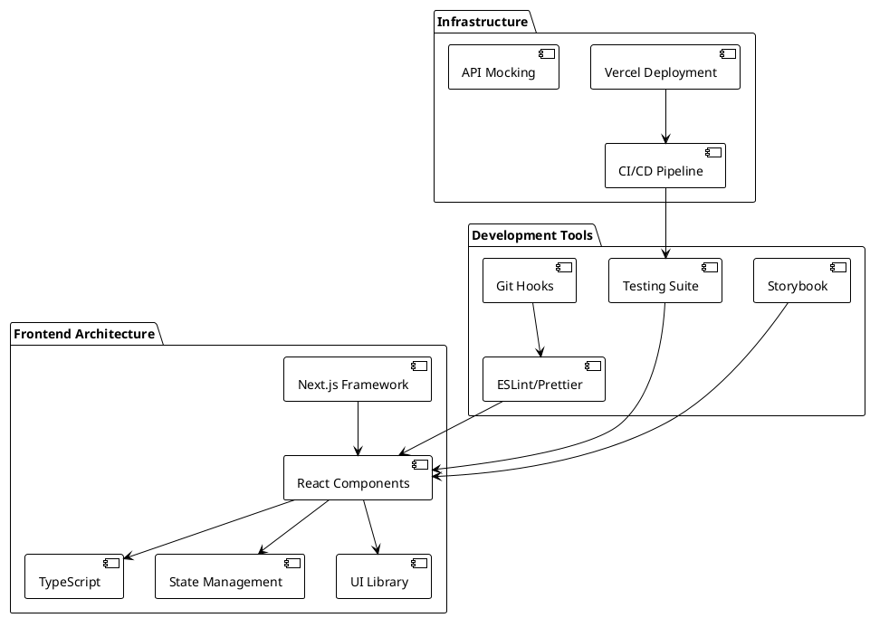
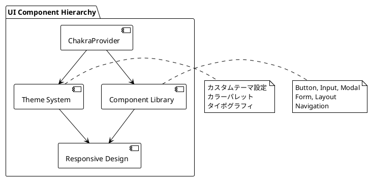
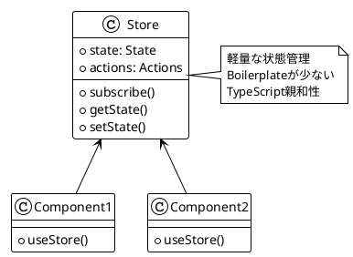
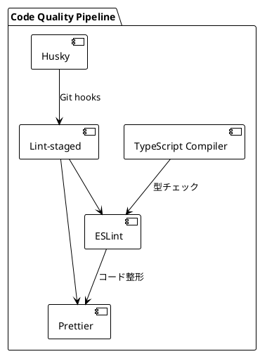
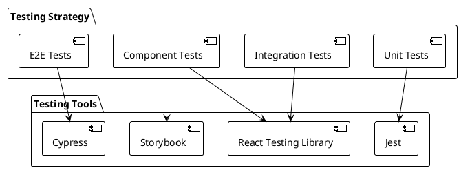
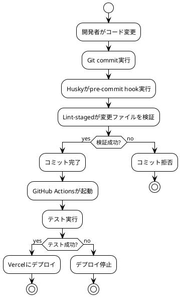

# 第1章: プロダクション対応Reactアプリケーションの技術要件

## 概要

本章では、プロダクション環境で使用される企業レベルのReactアプリケーションを構築するための技術要件について説明します。大規模なReactアプリケーションの開発では、単なる機能実装だけでなく、保守性、拡張性、パフォーマンス、品質保証など多角的な観点から技術選択を行う必要があります。

## アーキテクチャ概要



## 技術スタック要件

### 1. コアテクノロジー

#### 1.1 React 18.2.0
- **関数コンポーネント**: クラスコンポーネントではなく関数コンポーネントを標準とする
- **React Hooks**: useState, useEffect, useContext等の標準Hooksの活用
- **Concurrent Features**: React 18の新機能（Suspense、Concurrent Rendering）の活用

#### 1.2 TypeScript 4.8.2
- **型安全性**: 厳格な型チェックによるランタイムエラーの削減
- **開発効率**: IntelliSenseとリファクタリング支援
- **ドキュメント性**: コードの自己文書化

#### 1.3 Next.js 12.2.5
- **サーバーサイドレンダリング**: SEOとパフォーマンス最適化
- **静的サイト生成**: ビルド時の事前レンダリング
- **ルーティング**: ファイルベースルーティングシステム
- **APIルート**: バックエンドAPI統合

### 2. UI/UXライブラリ

#### 2.1 Chakra UI 2.3.1


- **デザインシステム**: 一貫したUI/UXの提供
- **アクセシビリティ**: WCAG準拠のコンポーネント
- **レスポンシブデザイン**: モバイルファーストアプローチ
- **テーマ管理**: ブランドカラーとタイポグラフィの統一

#### 2.2 Emotion 11.10.4
- **CSS-in-JS**: スタイルのコンポーネント化
- **動的スタイリング**: propsベースの条件付きスタイル
- **パフォーマンス**: ランタイム最適化

### 3. 状態管理

#### 3.1 Zustand 4.1.1


#### 3.2 TanStack Query 4.2.3
- **サーバー状態管理**: API呼び出しとキャッシュ管理
- **データフェッチング**: 自動的な再フェッチと同期
- **楽観的更新**: UX向上のための先行更新

### 4. 開発ツールと品質保証

#### 4.1 静的解析ツール


- **ESLint**: コード品質とベストプラクティスの強制
- **Prettier**: 一貫したコードフォーマット
- **Husky**: Git hooks による自動化
- **Lint-staged**: 変更ファイルのみの検証

#### 4.2 テスト戦略


- **Jest**: ユニットテストとスナップショットテスト
- **React Testing Library**: コンポーネントテスト
- **Cypress**: エンドツーエンドテスト
- **Storybook**: コンポーネント開発と視覚的テスト

### 5. パフォーマンス要件

#### 5.1 レンダリング戦略
- **SSG (Static Site Generation)**: 静的コンテンツ
- **SSR (Server-Side Rendering)**: 動的コンテンツ
- **CSR (Client-Side Rendering)**: インタラクティブコンテンツ
- **ISR (Incremental Static Regeneration)**: ハイブリッドアプローチ

#### 5.2 パフォーマンス指標
- **Core Web Vitals**: LCP, FID, CLS の最適化
- **Bundle Size**: 適切なコード分割
- **Network Optimization**: 画像最適化とCDN活用

### 6. セキュリティ要件

#### 6.1 フロントエンドセキュリティ
- **XSS対策**: サニタイゼーションとCSP
- **CSRF対策**: トークンベース認証
- **セキュアな認証**: OAuth 2.0 / OpenID Connect

#### 6.2 データ保護
- **機密情報の管理**: 環境変数の適切な使用
- **HTTPS強制**: 通信の暗号化
- **セキュリティヘッダー**: セキュリティ関連HTTPヘッダーの設定

### 7. 開発環境要件

#### 7.1 必要なソフトウェア
- **Node.js**: バージョン16以上
- **npm**: バージョン8以上
- **Git**: バージョン管理
- **VSCode**: 推奨エディタ（TypeScript拡張機能）

#### 7.2 開発ワークフロー


### 8. プロジェクト構造要件

```
src/
├── components/          # 共通UIコンポーネント
├── features/           # 機能別モジュール
│   ├── auth/           # 認証機能
│   ├── jobs/           # 求人機能
│   └── organizations/  # 組織機能
├── layouts/            # レイアウトコンポーネント
├── lib/                # 外部ライブラリ統合
├── pages/              # Next.jsページ
├── providers/          # Contextプロバイダー
├── stores/             # 状態管理
├── testing/            # テストユーティリティ
├── types/              # TypeScript型定義
└── utils/              # ユーティリティ関数
```

### 9. CI/CD要件

#### 9.1 GitHub Actions
- **自動テスト実行**: プルリクエスト時
- **ビルド検証**: 本番環境互換性チェック
- **デプロイメント**: Vercelへの自動デプロイ

#### 9.2 品質ゲート
- **コードカバレッジ**: 最低80%
- **型チェック**: TypeScriptエラーゼロ
- **Lint**: ESLintエラーゼロ
- **E2Eテスト**: 主要フロー100%カバー

## まとめ

プロダクション対応のReactアプリケーションでは、機能実装だけでなく、開発効率、保守性、パフォーマンス、セキュリティのバランスを取った技術選択が重要です。本書で扱う技術スタックは、これらの要件を満たしながら、チーム開発における生産性を最大化するように設計されています。

次章からは、これらの技術要件を満たすための具体的な実装方法について、段階的に解説していきます。
