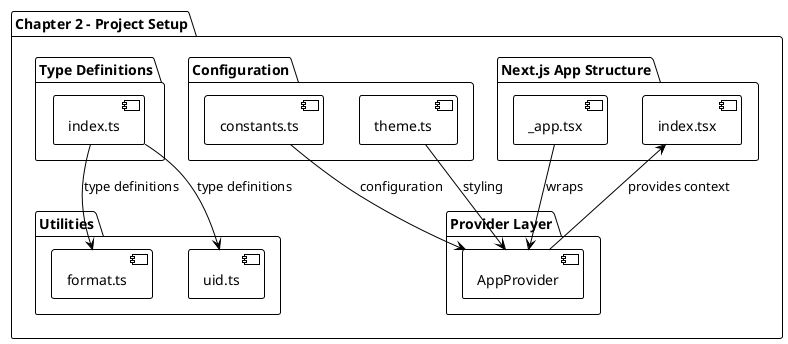
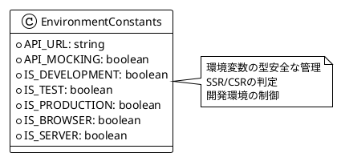
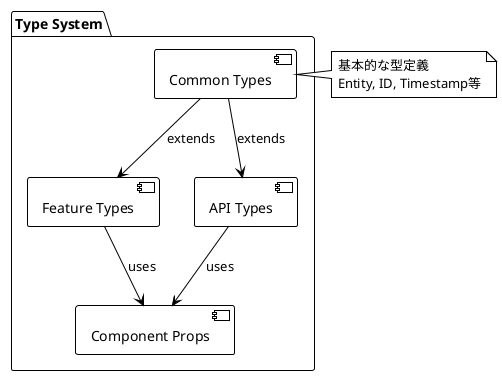
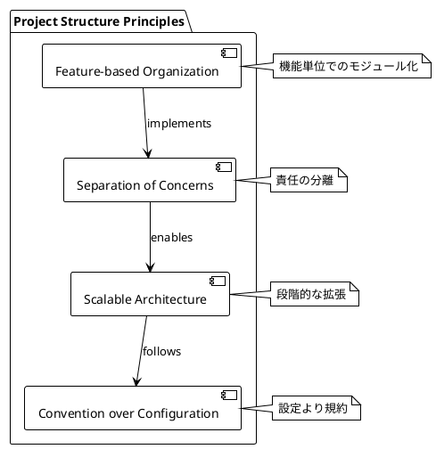
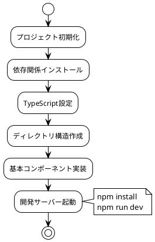

# 第2章: プロジェクトセットアップとベースラインアーキテクチャ

## 概要

第2章では、Reactアプリケーションの基本的なプロジェクト構造の設定とベースラインアーキテクチャの実装について解説します。この章では、Next.jsベースのReactプロジェクトの初期セットアップ、TypeScript設定、基本的な開発環境の構築を行います。

## アーキテクチャ図



## 実装詳細

### 1. プロジェクト構造

Chapter-02で構築される基本的なプロジェクト構造：

```
src/
├── components/         # 共通UIコンポーネント（空）
├── config/            # 設定ファイル
│   ├── constants.ts   # アプリケーション定数
│   └── theme.ts       # テーマ設定（空）
├── features/          # 機能別モジュール（空）
├── layouts/           # レイアウトコンポーネント（空）
├── lib/               # 外部ライブラリ統合（空）
├── pages/             # Next.jsページ
│   ├── _app.tsx       # アプリケーションエントリーポイント
│   └── index.tsx      # ホームページ
├── providers/         # Contextプロバイダー
│   └── app.tsx        # メインアプリプロバイダー
├── stores/            # 状態管理（空）
├── testing/           # テストユーティリティ（空）
├── types/             # TypeScript型定義
│   └── index.ts       # 共通型定義
└── utils/             # ユーティリティ関数
    ├── format.ts      # フォーマット関数
    └── uid.ts         # UID生成関数
```

### 2. アプリケーションエントリーポイント

#### 2.1 _app.tsx
```typescript
import type { AppProps } from 'next/app';

import { AppProvider } from '@/providers/app';

const App = ({ Component, pageProps }: AppProps) => {
  return (
    <AppProvider>
      <Component {...pageProps} />
    </AppProvider>
  );
};

export default App;
```

**設計思想**:
- Next.jsの`_app.tsx`はアプリケーション全体のエントリーポイント
- すべてのページが`AppProvider`でラップされる
- グローバルな設定や状態管理の初期化ポイント

#### 2.2 AppProvider
```typescript
import { ReactNode } from 'react';

type AppProviderProps = {
  children: ReactNode;
};

export const AppProvider = ({
  children,
}: AppProviderProps) => {
  return <>{children}</>;
};
```

**現在の状態**:
- Chapter-02では基本的なプロバイダー構造のみ実装
- 将来的にテーマ、認証、状態管理などのプロバイダーが追加される
- 段階的な実装アプローチの基盤

### 3. 設定管理

#### 3.1 constants.ts
```typescript
export const API_URL = process.env
  .NEXT_PUBLIC_API_URL as string;

export const API_MOCKING =
  process.env.NEXT_PUBLIC_API_MOCKING === 'true';

export const IS_DEVELOPMENT =
  process.env.NODE_ENV === 'development';
export const IS_TEST = process.env.NODE_ENV === 'test';
export const IS_PRODUCTION =
  process.env.NODE_ENV === 'production';

export const IS_BROWSER = typeof window !== 'undefined';
export const IS_SERVER = typeof window === 'undefined';
```

**設計パターン**:



**実装のポイント**:
- 環境変数の型安全な管理
- 開発、テスト、本番環境の判定
- SSR/CSR（サーバー/クライアント）の判定
- APIモッキングの制御フラグ

#### 3.2 theme.ts
```typescript
export const theme = {};
```

**段階的実装**:
- Chapter-02では空のテーマオブジェクト
- Chapter-03でChakra UIテーマが実装される
- 拡張可能な設計パターンの採用

### 4. ユーティリティ関数

#### 4.1 format.ts
```typescript
// フォーマット関連のユーティリティ関数
// 日付、通貨、テキストのフォーマット等
```

#### 4.2 uid.ts
```typescript
// ユニークID生成関数
// テスト用ID、一時的なキー生成等
```

### 5. 型定義システム

#### 5.1 types/index.ts
```typescript
// 共通の型定義
// アプリケーション全体で使用される基本型
```

**型定義戦略**:



### 6. 開発環境設定

#### 6.1 TypeScript設定
```json
{
  "compilerOptions": {
    "target": "es5",
    "lib": ["dom", "dom.iterable", "es6"],
    "allowJs": true,
    "skipLibCheck": true,
    "strict": true,
    "forceConsistentCasingInFileNames": true,
    "noEmit": true,
    "esModuleInterop": true,
    "module": "esnext",
    "moduleResolution": "node",
    "resolveJsonModule": true,
    "isolatedModules": true,
    "jsx": "preserve",
    "incremental": true,
    "paths": {
      "@/*": ["./src/*"]
    }
  }
}
```

**設定のポイント**:
- 厳格な型チェック（`strict: true`）
- パスエイリアス（`@/*`）の設定
- Next.js最適化設定

#### 6.2 Next.js設定
```javascript
/** @type {import('next').NextConfig} */
const nextConfig = {
  reactStrictMode: true,
  swcMinify: true,
}

module.exports = nextConfig
```

**React Strict Mode**:
- 開発時の追加チェック
- 潜在的な問題の早期発見
- 将来のReactバージョンへの互換性

### 7. パッケージ管理戦略

#### 7.1 主要依存関係
```json
{
  "dependencies": {
    "next": "^12.2.5",
    "react": "18.2.0",
    "react-dom": "18.2.0"
  },
  "devDependencies": {
    "@types/node": "18.7.14",
    "@types/react": "18.0.18",
    "typescript": "4.8.2"
  }
}
```

#### 7.2 スクリプト設定
```json
{
  "scripts": {
    "dev": "next dev",
    "build": "next build",
    "start": "next start",
    "lint": "eslint --ext .ts,.tsx ./src",
    "type-check": "tsc --noEmit --pretty"
  }
}
```

### 8. ファイル構成の設計原則



**設計原則**:
1. **機能ベース組織化**: featuresディレクトリによる機能分離
2. **責任の分離**: config, utils, types等の明確な役割分担
3. **段階的拡張**: 空のディレクトリによる将来の拡張準備
4. **規約重視**: Next.jsの規約に従った構造

### 9. 開発ワークフロー



### 10. 品質保証の基盤

#### 10.1 型安全性
- TypeScriptによる静的型チェック
- 厳格なコンパイラオプション
- 型定義の一元管理

#### 10.2 コード品質
- ESLintによる静的解析（後の章で実装）
- Prettierによるフォーマット（後の章で実装）
- Git hooksによる自動化（後の章で実装）

## 次章への準備

Chapter-02で構築された基盤は、以降の章での機能実装の土台となります：

- **Chapter-03**: UI/UXライブラリ（Chakra UI）の統合
- **Chapter-04**: レイアウトとナビゲーション
- **Chapter-05**: 機能モジュール（Features）の実装
- **Chapter-06**: 状態管理の実装
- **Chapter-07**: APIインテグレーション
- **Chapter-08**: テスト実装
- **Chapter-09**: デプロイメントとCI/CD

## まとめ

Chapter-02では、プロダクション対応Reactアプリケーションの基盤となるプロジェクト構造とベースラインアーキテクチャを実装しました。

**重要なポイント**:
1. **段階的実装**: 必要な構造を先に定義し、段階的に実装
2. **型安全性**: TypeScriptによる厳格な型管理
3. **設定の一元化**: 環境変数と設定の適切な管理
4. **拡張性**: 将来の機能追加を考慮した構造設計
5. **Next.js最適化**: フレームワークの機能を最大限活用

この基盤の上に、次章以降でUI/UX、状態管理、テストなどの実装を段階的に追加していきます。
