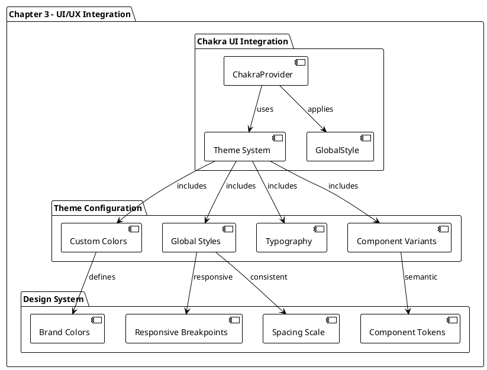
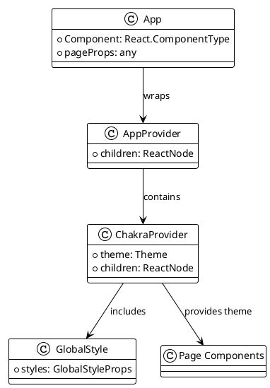
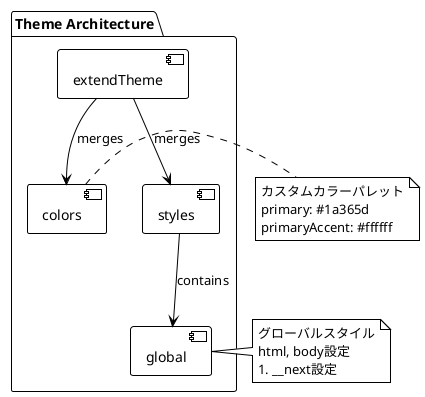
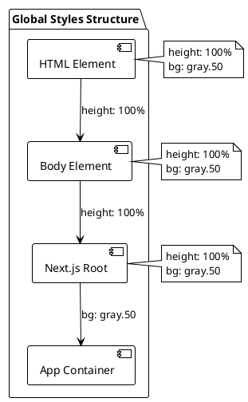
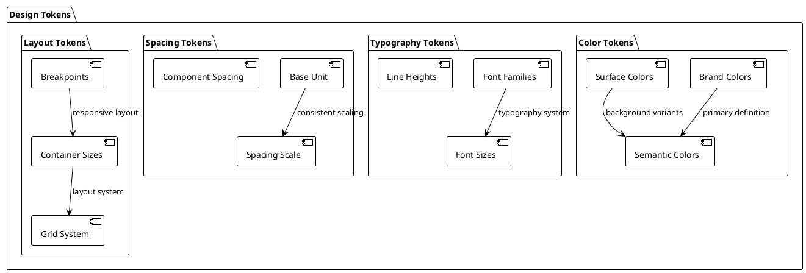
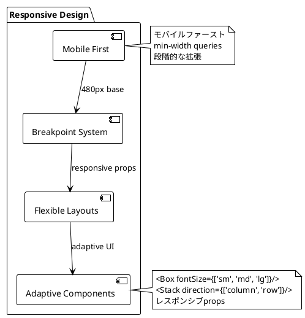
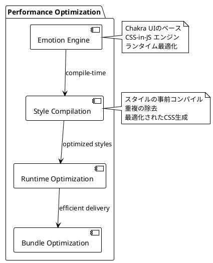
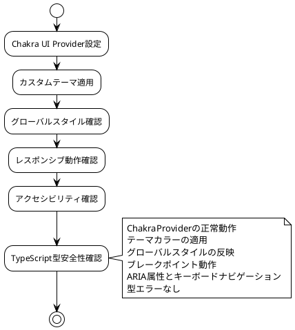

# 第3章: UI/UXライブラリの統合 - Chakra UI実装

## 概要

第3章では、Chakra UIライブラリの統合とカスタムテーマシステムの実装について解説します。この章では、一貫したデザインシステムの構築、レスポンシブデザインの実装、アクセシビリティ対応のUIコンポーネントライブラリの統合を行います。

## アーキテクチャ図



## 実装詳細

### 1. Chakra UI プロバイダー統合

#### 1.1 AppProvider の更新
```typescript
import {
  ChakraProvider,
  GlobalStyle,
} from '@chakra-ui/react';
import { ReactNode } from 'react';

import { theme } from '@/config/theme';

type AppProviderProps = {
  children: ReactNode;
};

export const AppProvider = ({
  children,
}: AppProviderProps) => {
  return (
    <ChakraProvider theme={theme}>
      <GlobalStyle />
      {children}
    </ChakraProvider>
  );
};
```

**実装のポイント**:
- **ChakraProvider**: アプリケーション全体にテーマを提供
- **GlobalStyle**: グローバルスタイルの適用
- **Custom Theme**: カスタムテーマオブジェクトの注入

#### 1.2 Provider階層図



### 2. カスタムテーマシステム

#### 2.1 テーマ設定
```typescript
import { extendTheme } from '@chakra-ui/react';

const colors = {
  primary: '#1a365d',
  primaryAccent: '#ffffff',
};

const styles = {
  global: {
    'html, body': {
      height: '100%',
      bg: 'gray.50',
    },

    '#__next': {
      height: '100%',
      bg: 'gray.50',
    },
  },
};

export const theme = extendTheme({ colors, styles });
```

**テーマ構造解析**:



#### 2.2 カラーシステム設計

```plantuml
@startuml
!theme plain

package "Color System" {
  [Primary Colors] as primary
  [Semantic Colors] as semantic
  [Gray Scale] as gray
  [Status Colors] as status
}

primary : primary: #1a365d
primary : primaryAccent: #ffffff

semantic : success, warning, error
semantic : info, brand

gray : gray.50, gray.100, ...
gray : gray.900 (text)

status : green (success)
status : red (error)
status : yellow (warning)
status : blue (info)

primary --> semantic : extends
gray --> semantic : supports
semantic --> status : implements

@enduml
```

#### 2.3 グローバルスタイル設計

**レイアウト基盤**:
- **Full Height Layout**: `html, body, #__next` の高さを100%に設定
- **Background Color**: 統一的な背景色（`gray.50`）
- **Next.js Integration**: Next.jsのルートコンテナ（`#__next`）への対応



### 3. デザインシステムの基盤

#### 3.1 Design Tokens



#### 3.2 コンポーネント設計パターン

**Chakra UI コンポーネント活用**:

```plantuml
@startuml
!theme plain

package "Component Patterns" {
  [Layout Components] as layout
  [Form Components] as form
  [Feedback Components] as feedback
  [Navigation Components] as navigation
}

layout : Box, Container, Stack
layout : Grid, SimpleGrid, Flex

form : Input, Button, Select
form : Checkbox, Radio, Switch

feedback : Alert, Toast, Modal
feedback : Spinner, Progress

navigation : Breadcrumb, Tabs
navigation : Menu, Drawer

note right of layout : レイアウト基盤\nFlexbox/Grid対応\nレスポンシブ対応

@enduml
```

### 4. レスポンシブデザイン実装

#### 4.1 ブレークポイント戦略

```typescript
// Chakra UI デフォルトブレークポイント
const breakpoints = {
  sm: '30em',    // 480px
  md: '48em',    // 768px
  lg: '62em',    // 992px
  xl: '80em',    // 1280px
  '2xl': '96em', // 1536px
}
```

#### 4.2 レスポンシブスタイリング



### 5. アクセシビリティ対応

#### 5.1 Chakra UIアクセシビリティ機能

```plantuml
@startuml
!theme plain

package "Accessibility Features" {
  [ARIA Support] as aria
  [Keyboard Navigation] as keyboard
  [Focus Management] as focus
  [Screen Reader Support] as screenreader
}

aria : ARIA attributes
aria : role definitions
aria : accessible names

keyboard : Tab navigation
keyboard : Arrow key support
keyboard : Enter/Space activation

focus : Focus indicators
focus : Focus trapping
focus : Focus restoration

screenreader : Semantic markup
screenreader : Live regions
screenreader : Descriptive text

aria --> keyboard : complements
keyboard --> focus : manages
focus --> screenreader : supports

@enduml
```

#### 5.2 アクセシビリティベストプラクティス

**実装例**:
```tsx
// フォーカス管理の例
<Button 
  aria-label="ジョブ情報を表示"
  colorScheme="primary"
  size="sm"
>
  詳細を見る
</Button>

// セマンティックマークアップの例
<Box as="main" role="main">
  <Box as="section" aria-labelledby="jobs-heading">
    <Heading id="jobs-heading" as="h2">
      求人一覧
    </Heading>
    {/* コンテンツ */}
  </Box>
</Box>
```

### 6. パフォーマンス最適化

#### 6.1 CSS-in-JS 最適化



#### 6.2 テーマ最適化戦略

**最適化ポイント**:
1. **テーマオブジェクト**: 必要な部分のみをextendThemeで拡張
2. **カラーパレット**: 使用するカラーのみを定義
3. **グローバルスタイル**: 最小限のグローバルスタイル
4. **コンポーネントバリアント**: 実際に使用するバリアントのみ定義

### 7. 開発者体験の向上

#### 7.1 TypeScript統合

```typescript
// Chakra UI の型安全性
import { BoxProps, ButtonProps } from '@chakra-ui/react';

interface CustomButtonProps extends ButtonProps {
  variant?: 'primary' | 'secondary' | 'outline';
  size?: 'sm' | 'md' | 'lg';
}

// テーマの型安全性
declare module '@chakra-ui/react' {
  interface Theme {
    colors: {
      primary: string;
      primaryAccent: string;
    }
  }
}
```

#### 7.2 開発ツール統合

```plantuml
@startuml
!theme plain

package "Developer Experience" {
  [TypeScript Support] as typescript
  [Hot Reload] as hotreload
  [DevTools] as devtools
  [Storybook Integration] as storybook
}

typescript : 型安全なprops
typescript : 自動補完
typescript : エラー検出

hotreload : スタイル変更の即座反映
hotreload : テーマ変更の自動更新

devtools : Chakra UI DevTools
devtools : テーマ検査
devtools : アクセシビリティチェック

storybook : コンポーネント開発
storybook : テーマ動作確認
storybook : レスポンシブテスト

@enduml
```

### 8. テスト戦略

#### 8.1 テーマテスト

```typescript
// テーマのテスト例
import { renderWithChakra } from '@/testing/utils';
import { theme } from '@/config/theme';

describe('Theme Configuration', () => {
  it('should have correct primary color', () => {
    expect(theme.colors.primary).toBe('#1a365d');
  });

  it('should apply global styles', () => {
    const { container } = renderWithChakra(<div />);
    expect(container.firstChild).toHaveStyle({
      backgroundColor: 'gray.50'
    });
  });
});
```

#### 8.2 アクセシビリティテスト

```plantuml
@startuml
!theme plain

package "Testing Strategy" {
  [Unit Tests] as unit
  [Accessibility Tests] as a11y
  [Visual Regression] as visual
  [Theme Tests] as theme
}

unit : コンポーネント動作
unit : Props validation
unit : レンダリング確認

a11y : ARIA attributes
a11y : Keyboard navigation
a11y : Screen reader compatibility

visual : スクリーンショット比較
visual : レスポンシブ表示
visual : テーマ適用確認

theme : カラー定義
theme : スタイル適用
theme : ブレークポイント

@enduml
```

### 9. 将来への拡張性

#### 9.1 ダークモード対応準備

```typescript
// 将来のダークモード対応
const theme = extendTheme({
  config: {
    initialColorMode: 'light',
    useSystemColorMode: false,
  },
  colors: {
    primary: {
      light: '#1a365d',
      dark: '#3182ce',
    },
    // 他のカラー定義
  },
});
```

#### 9.2 国際化対応準備

```plantuml
@startuml
!theme plain

package "Future Extensions" {
  [Dark Mode] as darkmode
  [Internationalization] as i18n
  [Custom Components] as custom
  [Advanced Theming] as advanced
}

darkmode : Color mode switching
darkmode : Automatic detection
darkmode : User preference

i18n : RTL support
i18n : Font family switching
i18n : Layout adjustments

custom : Brand-specific components
custom : Extended design tokens
custom : Component library

advanced : Dynamic theming
advanced : Theme variants
advanced : Runtime customization

@enduml
```

## 実装検証

### 1. 機能確認項目



### 2. パフォーマンス検証
- **バンドルサイズ**: Chakra UIの追加によるサイズ増加の確認
- **レンダリング性能**: CSS-in-JSのパフォーマンス影響
- **ファーストペイント**: 初期レンダリング時間

## まとめ

Chapter-03では、Chakra UIライブラリの統合により、以下の基盤を構築しました：

**主要な実装成果**:
1. **デザインシステム基盤**: 一貫したUI/UXの基礎
2. **レスポンシブデザイン**: モバイルファーストアプローチ
3. **アクセシビリティ対応**: WCAG準拠のコンポーネント
4. **開発者体験**: TypeScript統合と型安全性
5. **パフォーマンス最適化**: 効率的なCSS-in-JS実装

**設計の特徴**:
- **段階的拡張**: 最小限の設定から開始し、必要に応じて拡張
- **型安全性**: TypeScriptとの完全な統合
- **保守性**: 明確な設定構造と責任分離
- **拡張性**: 将来の機能追加（ダークモード、i18n等）への対応

次章では、このUI基盤の上にレイアウトシステムとナビゲーションコンポーネントを実装していきます。
