# 第4章: レイアウトシステムとコンポーネントアーキテクチャ

## 概要

第4章では、レイアウトシステムの実装と再利用可能なUIコンポーネントライブラリの構築について解説します。この章では、ダッシュボードとパブリックページ用の異なるレイアウト、共通コンポーネントの設計パターン、そしてコンポーネント駆動開発のアプローチを実装します。

## アーキテクチャ図

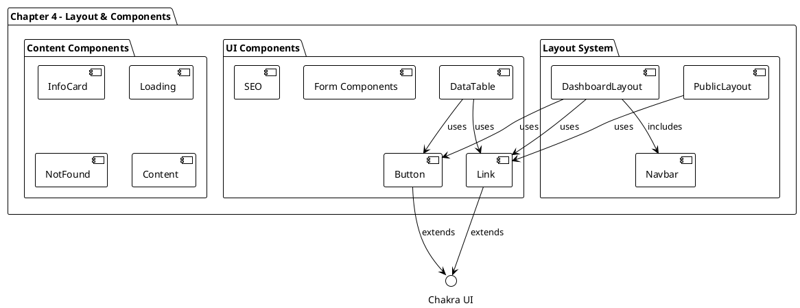

## 実装詳細

### 1. レイアウトシステム設計

#### 1.1 レイアウトアーキテクチャ

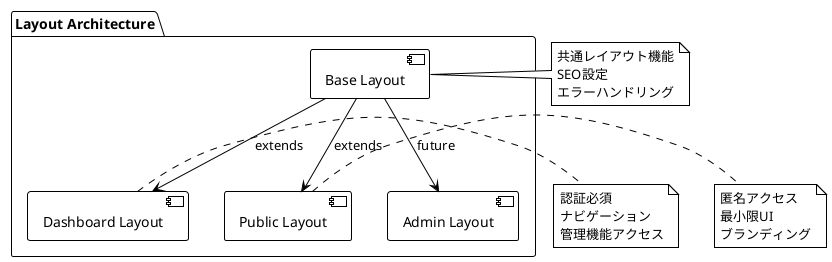

#### 1.2 DashboardLayout実装

```typescript
import { InfoOutlineIcon } from '@chakra-ui/icons';
import {
  Box,
  Container,
  Flex,
  HStack,
} from '@chakra-ui/react';
import { ReactNode } from 'react';

import { Button } from '@/components/button';
import { Link } from '@/components/link';
import { useUser } from '@/testing/test-data';

type DashboardLayoutProps = {
  children: ReactNode;
};

export const DashboardLayout = ({
  children,
}: DashboardLayoutProps) => {
  const user = useUser();

  return (
    <Box as="section" h="100vh" overflowY="auto">
      <Navbar />
      <Container as="main" maxW="container.lg" py="12">
        {children}
      </Container>
      <Box py="8" textAlign="center">
        <Link
          href={`/organizations/${user.data?.organizationId}`}
        >
          View Public Organization Page
        </Link>
      </Box>
    </Box>
  );
};
```

**設計のポイント**:
- **セマンティックHTML**: `as` propsによる適切なHTML要素の使用
- **フルハイト設計**: `h="100vh"` + `overflowY="auto"` による画面全体活用
- **レスポンシブコンテナ**: `maxW="container.lg"` による一貫した幅制御
- **コンポーネント合成**: Navbar, Container, Footerリンクの組み合わせ

#### 1.3 PublicLayout実装

```typescript
import { Box } from '@chakra-ui/react';
import { ReactNode } from 'react';

import { Link } from '@/components/link';

type PublicLayoutProps = {
  children: ReactNode;
};

export const PublicLayout = ({
  children,
}: PublicLayoutProps) => {
  return (
    <Box maxW="container.lg" mx="auto" h="full">
      <Box minH="80%" mx="4">
        {children}
      </Box>
      <Box py="8" textAlign="center">
        Powered by <Link href="/">Jobs App</Link>
      </Box>
    </Box>
  );
};
```

**設計の特徴**:
- **シンプル構造**: 最小限のUI要素
- **中央配置**: `mx="auto"` による中央配置
- **フレキシブルコンテンツエリア**: `minH="80%"` による柔軟な高さ
- **ブランディング**: フッターでのアプリケーション識別

### 2. ナビゲーションシステム

#### 2.1 Navbar実装

```typescript
const Navbar = () => {
  return (
    <Box as="nav" bg="primary" color="primaryAccent">
      <Container maxW="container.lg" size="3xl" py="3">
        <Flex justify="space-between">
          <HStack>
            <Link variant="solid" href="/">
              Jobs App
            </Link>
            <HStack spacing="1">
              <Link
                icon={<InfoOutlineIcon />}
                variant="solid"
                href="/dashboard/jobs"
              >
                Jobs
              </Link>
            </HStack>
          </HStack>
          <HStack>
            <Button
              variant="outline"
              onClick={() =>
                console.log('Logging Out...')
              }
            >
              Log Out
            </Button>
          </HStack>
        </Flex>
      </Container>
    </Box>
  );
};
```

**ナビゲーション構造**:

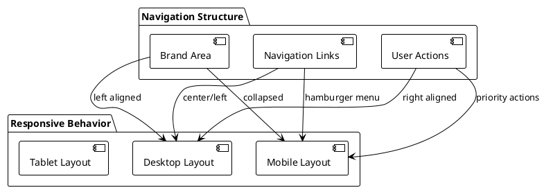

### 3. コンポーネントライブラリ

#### 3.1 Button コンポーネント

```typescript
import { Button as ChakraButton } from '@chakra-ui/react';
import { MouseEventHandler, ReactNode } from 'react';

const variants = {
  solid: {
    variant: 'solid',
    bg: 'primary',
    color: 'primaryAccent',
    _hover: {
      opacity: '0.9',
    },
  },
  outline: {
    variant: 'outline',
    bg: 'white',
    color: 'primary',
  },
};

export type ButtonProps = {
  children: ReactNode;
  type?: 'button' | 'submit' | 'reset';
  variant?: keyof typeof variants;
  isLoading?: boolean;
  isDisabled?: boolean;
  onClick?: MouseEventHandler<HTMLButtonElement>;
  icon?: JSX.Element;
};

export const Button = ({
  variant = 'solid',
  type = 'button',
  children,
  icon,
  ...props
}: ButtonProps) => {
  return (
    <ChakraButton
      {...props}
      {...variants[variant]}
      type={type}
      leftIcon={icon}
    >
      {children}
    </ChakraButton>
  );
};
```

**コンポーネント設計パターン**:

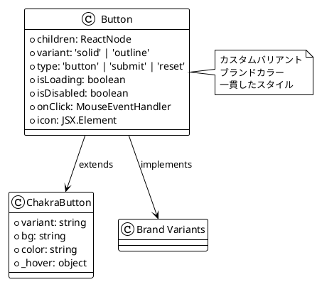

#### 3.2 Linkコンポーネント（推定実装）

```typescript
// 想定されるLink実装
import { Link as ChakraLink } from '@chakra-ui/react';
import NextLink from 'next/link';

export type LinkProps = {
  href: string;
  children: ReactNode;
  variant?: 'solid' | 'outline';
  icon?: JSX.Element;
};

export const Link = ({ href, children, variant, icon, ...props }: LinkProps) => {
  return (
    <NextLink href={href} passHref>
      <ChakraLink {...props} leftIcon={icon}>
        {children}
      </ChakraLink>
    </NextLink>
  );
};
```

### 4. データ表示コンポーネント

#### 4.1 DataTableアーキテクチャ

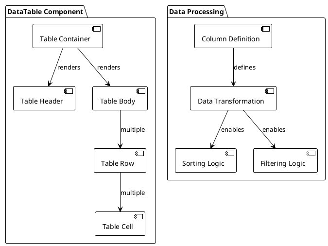

#### 4.2 フォームコンポーネント

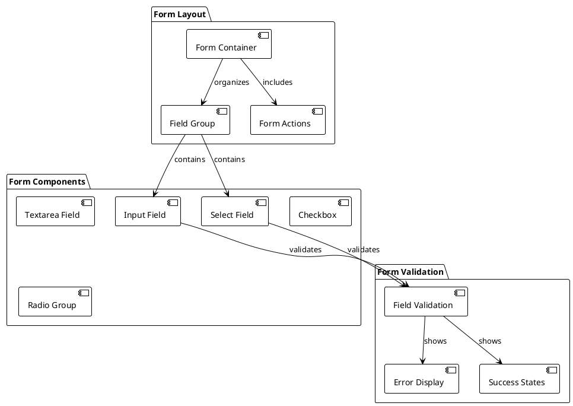

### 5. ユーティリティコンポーネント

#### 5.1 Loading コンポーネント

```typescript
// 想定されるLoading実装
import { Spinner, Center, Text, VStack } from '@chakra-ui/react';

export type LoadingProps = {
  text?: string;
  size?: 'sm' | 'md' | 'lg' | 'xl';
};

export const Loading = ({ text = 'Loading...', size = 'md' }: LoadingProps) => {
  return (
    <Center h="200px">
      <VStack spacing={4}>
        <Spinner size={size} color="primary" />
        <Text color="gray.600">{text}</Text>
      </VStack>
    </Center>
  );
};
```

#### 5.2 NotFound コンポーネント

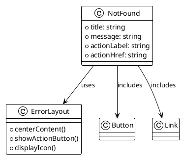

### 6. SEO コンポーネント

#### 6.1 SEO実装戦略

```typescript
// 想定されるSEO実装
import Head from 'next/head';

export type SEOProps = {
  title?: string;
  description?: string;
  image?: string;
  url?: string;
};

export const SEO = ({
  title = 'Jobs App',
  description = 'Find your next opportunity',
  image = '/default-og.jpg',
  url = 'https://jobs-app.vercel.app',
}: SEOProps) => {
  return (
    <Head>
      <title>{title}</title>
      <meta name="description" content={description} />
      <meta property="og:title" content={title} />
      <meta property="og:description" content={description} />
      <meta property="og:image" content={image} />
      <meta property="og:url" content={url} />
      <meta name="twitter:card" content="summary_large_image" />
    </Head>
  );
};
```

**SEO構造**:

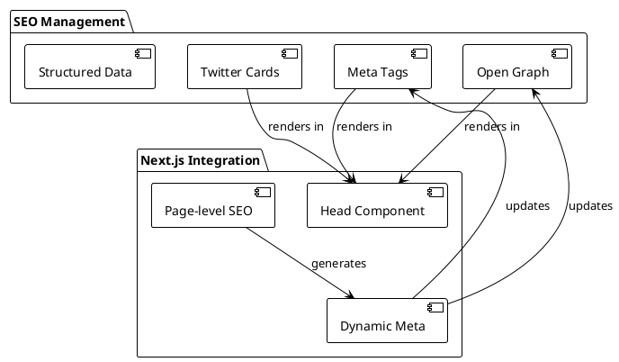

### 7. レスポンシブデザイン戦略

#### 7.1 ブレークポイント活用

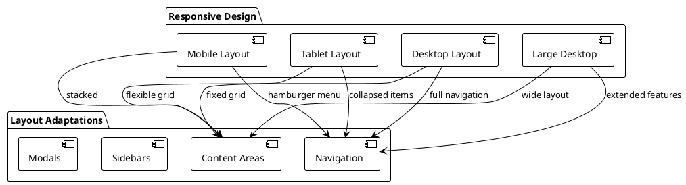

#### 7.2 コンポーネントレスポンシブ対応

```typescript
// レスポンシブButton例
<Button
  size={['sm', 'md', 'lg']}  // mobile, tablet, desktop
  w={['full', 'auto', 'auto']}  // mobile full width
>
  Action
</Button>

// レスポンシブレイアウト例
<Container 
  maxW={['full', 'container.sm', 'container.lg']}
  px={[4, 6, 8]}
>
  {children}
</Container>
```

### 8. アクセシビリティ実装

#### 8.1 セマンティックHTML

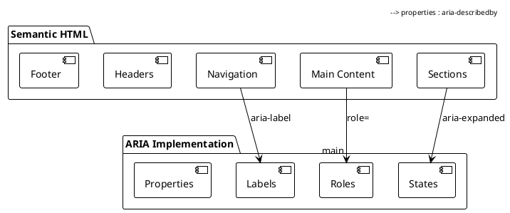

#### 8.2 キーボードナビゲーション

```typescript
// キーボードアクセシブルButton
<Button
  onKeyDown={(e) => {
    if (e.key === 'Enter' || e.key === ' ') {
      handleClick();
    }
  }}
  tabIndex={0}
  aria-label="詳細を表示"
>
  View Details
</Button>
```

### 9. パフォーマンス最適化

#### 9.1 コンポーネント最適化

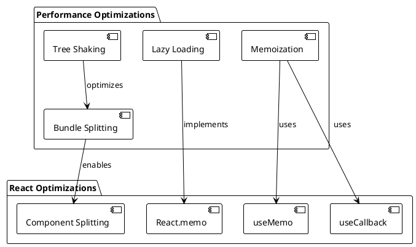

#### 9.2 バンドル最適化

```typescript
// Dynamic import for large components
const DataTable = dynamic(
  () => import('@/components/data-table'),
  { 
    loading: () => <Loading />,
    ssr: false 
  }
);

// Tree-shakable exports
export { Button } from './button';
export { Link } from './link';
export { DataTable } from './data-table';
```

### 10. テスト戦略

#### 10.1 コンポーネントテスト

```typescript
// Button コンポーネントテスト例
import { render, screen } from '@testing-library/react';
import userEvent from '@testing-library/user-event';
import { Button } from './button';

describe('Button', () => {
  it('renders children correctly', () => {
    render(<Button>Click me</Button>);
    expect(screen.getByText('Click me')).toBeInTheDocument();
  });

  it('calls onClick when clicked', async () => {
    const handleClick = jest.fn();
    render(<Button onClick={handleClick}>Click me</Button>);
    
    await userEvent.click(screen.getByText('Click me'));
    expect(handleClick).toHaveBeenCalledTimes(1);
  });

  it('applies correct variant styles', () => {
    render(<Button variant="outline">Outline Button</Button>);
    const button = screen.getByText('Outline Button');
    expect(button).toHaveStyle({ background: 'white' });
  });
});
```

#### 10.2 レイアウトテスト

```plantuml
@startuml
!theme plain

package "Testing Strategy" {
  [Unit Tests] as unit
  [Integration Tests] as integration
  [Visual Tests] as visual
  [Accessibility Tests] as a11y
}

unit : コンポーネント単体
unit : Props validation
unit : イベントハンドリング

integration : レイアウト統合
integration : ナビゲーション
integration : データフロー

visual : スクリーンショット
visual : レスポンシブ
visual : クロスブラウザ

a11y : ARIA属性
a11y : キーボードナビ
a11y : スクリーンリーダー

@enduml
```

## 設計原則とベストプラクティス

### 1. コンポーネント設計原則

```plantuml
@startuml
!theme plain

package "Design Principles" {
  [Single Responsibility] as single
  [Composition over Inheritance] as composition
  [Props Interface Design] as props
  [Accessibility First] as a11y
}

single : 一つの責任
single : 明確な目的
single : 限定的な機能

composition : コンポーネント合成
composition : 再利用性
composition : 柔軟性

props : 型安全性
props : 直感的なAPI
props : バリデーション

a11y : セマンティック
a11y : キーボード対応
a11y : スクリーンリーダー

@enduml
```

### 2. ファイル構成戦略

```
components/
├── button/
│   ├── button.tsx
│   ├── button.test.tsx
│   ├── button.stories.tsx
│   └── index.ts
├── link/
│   ├── link.tsx
│   ├── link.test.tsx
│   └── index.ts
└── data-table/
    ├── data-table.tsx
    ├── data-table.test.tsx
    ├── table-header.tsx
    ├── table-body.tsx
    └── index.ts
```

## まとめ

Chapter-04では、スケーラブルなレイアウトシステムと再利用可能なコンポーネントライブラリを構築しました：

**主要な実装成果**:
1. **レイアウトシステム**: ダッシュボードとパブリック用の異なるレイアウト
2. **コンポーネントライブラリ**: 一貫したUIコンポーネント群
3. **ナビゲーションシステム**: 直感的で使いやすいナビゲーション
4. **レスポンシブデザイン**: すべてのデバイスサイズに対応
5. **アクセシビリティ**: WCAG準拠の実装

**設計の特徴**:
- **合成パターン**: 小さなコンポーネントの組み合わせによる複雑なUI
- **一貫性**: ブランドカラーとデザインシステムの統一
- **拡張性**: 新しいレイアウトやコンポーネントの追加が容易
- **保守性**: 明確な責任分離と型安全性

次章では、この基盤の上に具体的な機能モジュール（Features）を実装し、ビジネスロジックとUIを統合していきます。
