# 第5章: 機能モジュール設計とFeaturesアーキテクチャ

## 概要

第5章では、機能ベースのモジュール設計（Features Architecture）の実装について解説します。この章では、ビジネスロジックを機能単位で分離し、スケーラブルで保守性の高いアプリケーション構造を構築する方法を学びます。Jobs Appの求人機能を例に、型定義からコンポーネントまでの一貫した実装アプローチを実装します。

## アーキテクチャ図

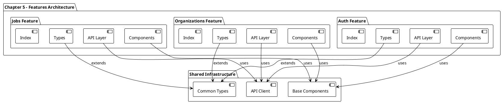

## 実装詳細

### 1. Features アーキテクチャ設計原則

#### 1.1 機能ベース分離

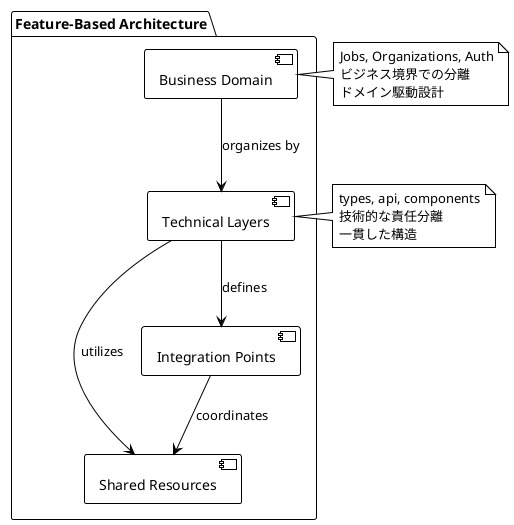

#### 1.2 Feature構造設計

```
features/
├── jobs/
│   ├── api/           # データアクセス層
│   ├── components/    # UI コンポーネント
│   ├── types/         # 型定義
│   └── index.ts       # パブリックAPI
├── organizations/
│   ├── api/
│   ├── components/
│   ├── types/
│   └── index.ts
└── auth/
    ├── api/
    ├── components/
    ├── types/
    └── index.ts
```

### 2. Jobs Feature実装

#### 2.1 型定義システム

```typescript
import { Entity } from '@/types';

export type Job = Entity & {
  organizationId: string;
  position: string;
  info: string;
  location: string;
  department: string;
};

export type CreateJobData = Pick<
  Job,
  'position' | 'department' | 'location' | 'info'
>;
```

**型設計の特徴**:

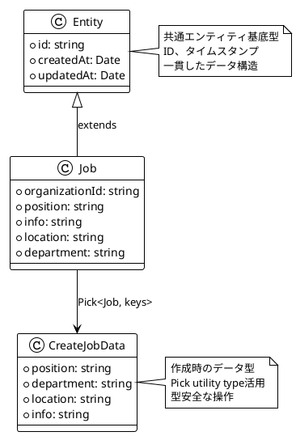

#### 2.2 データモデル設計

**ドメインモデル**:
- **Job Entity**: 求人情報の完全な表現
- **CreateJobData**: 新規求人作成時の入力データ
- **組織関連**: organizationId による関連性
- **必須フィールド**: position, department, location, info

#### 2.3 型階層とユーティリティ型

```typescript
// 基底型の拡張パターン
export type UpdateJobData = Partial<CreateJobData>;

export type JobFilters = {
  department?: string;
  location?: string;
  organizationId: string;
};

export type JobSortOptions = {
  field: keyof Job;
  direction: 'asc' | 'desc';
};
```

**型の関係性**:

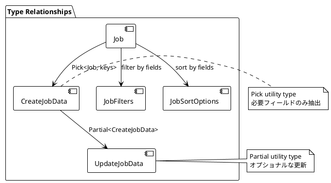

### 3. Component Architecture

#### 3.1 Jobs List Component

```typescript
import { Box } from '@chakra-ui/react';

import {
  DataTable,
  DataTableProps,
} from '@/components/data-table';
import { Link } from '@/components/link';

import { Job } from '../../types';

type JobListType = 'dashboard' | 'public';

export type JobsListProps = {
  type: JobListType;
  jobs: Job[];
  isLoading?: boolean;
  organizationId: string;
};

const getTableColumns = (
  organizationId: string,
  type: JobListType
) => {
  const tableColumns: DataTableProps<Job>['columns'] = [
    {
      title: 'Position',
      field: 'position',
    },
    {
      title: 'Department',
      field: 'department',
    },
    {
      title: 'Location',
      field: 'location',
    },
    {
      title: '',
      field: 'id',
      render: ({ entry: { id } }) => {
        return (
          <Link
            href={
              type === 'public'
                ? `/organizations/${organizationId}/jobs/${id}`
                : `/dashboard/jobs/${id}`
            }
          >
            View
          </Link>
        );
      },
    },
  ];

  return tableColumns;
};

export const JobsList = ({
  jobs,
  isLoading,
  organizationId,
  type,
}: JobsListProps) => {
  const tableColumns = getTableColumns(
    organizationId,
    type
  );

  return (
    <Box data-testid="jobs-list">
      <DataTable
        isLoading={isLoading || false}
        data={jobs}
        columns={tableColumns}
      />
    </Box>
  );
};
```

**コンポーネント設計パターン**:

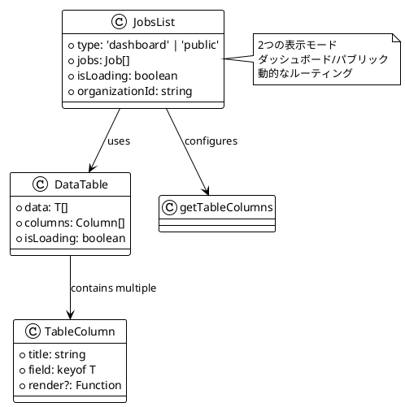

#### 3.2 Create Job Form Component

```typescript
// 想定されるCreate Job Form実装
import { useForm } from 'react-hook-form';
import { Box, VStack } from '@chakra-ui/react';

import { Button } from '@/components/button';
import { FormField } from '@/components/form';

import { CreateJobData } from '../../types';

export type CreateJobFormProps = {
  onSubmit: (data: CreateJobData) => void;
  isLoading?: boolean;
};

export const CreateJobForm = ({
  onSubmit,
  isLoading,
}: CreateJobFormProps) => {
  const {
    register,
    handleSubmit,
    formState: { errors },
  } = useForm<CreateJobData>();

  return (
    <Box>
      <form onSubmit={handleSubmit(onSubmit)}>
        <VStack spacing={4}>
          <FormField
            label="Position"
            error={errors.position}
            {...register('position', { required: 'Position is required' })}
          />
          <FormField
            label="Department"
            error={errors.department}
            {...register('department', { required: 'Department is required' })}
          />
          <FormField
            label="Location"
            error={errors.location}
            {...register('location', { required: 'Location is required' })}
          />
          <FormField
            as="textarea"
            label="Job Information"
            error={errors.info}
            {...register('info', { required: 'Job info is required' })}
          />
          <Button
            type="submit"
            isLoading={isLoading}
            w="full"
          >
            Create Job
          </Button>
        </VStack>
      </form>
    </Box>
  );
};
```

#### 3.3 Job Info Display Components

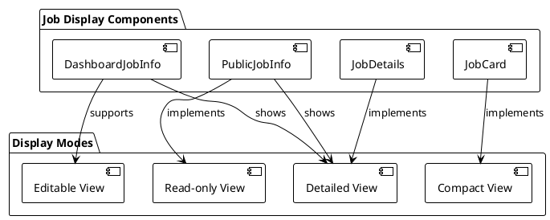

### 4. Feature API Layer（Chapter-06で実装）

#### 4.1 API設計パターン

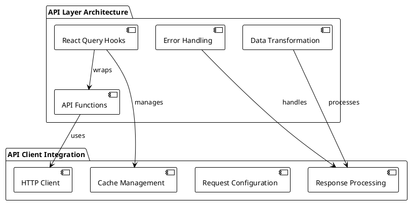

#### 4.2 想定されるAPI実装

```typescript
// Chapter-06で実装される予定のAPI層
import { useQuery, useMutation } from '@tanstack/react-query';
import { apiClient } from '@/lib/api-client';

// GET Jobs
export const getJobs = (organizationId: string): Promise<Job[]> => {
  return apiClient.get('/jobs', {
    params: { organizationId }
  });
};

export const useJobs = (organizationId: string) => {
  return useQuery({
    queryKey: ['jobs', organizationId],
    queryFn: () => getJobs(organizationId),
    enabled: !!organizationId,
  });
};

// CREATE Job
export const createJob = (data: CreateJobData): Promise<Job> => {
  return apiClient.post('/jobs', data);
};

export const useCreateJob = () => {
  return useMutation({
    mutationFn: createJob,
    onSuccess: () => {
      // Cache invalidation logic
    },
  });
};
```

### 5. Feature Index (Public API)

#### 5.1 Feature Export Strategy

```typescript
// features/jobs/index.ts - Public API
// API Layer
export * from './api/get-job';
export * from './api/get-jobs';
export * from './api/create-job';

// Components
export * from './components/jobs-list';
export * from './components/create-job-form';
export * from './components/dashboard-job-info';
export * from './components/public-job-info';

// Types
export * from './types';
```

**Export設計原則**:

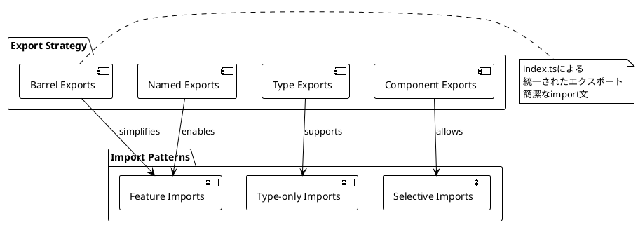

#### 5.2 Feature間の依存関係

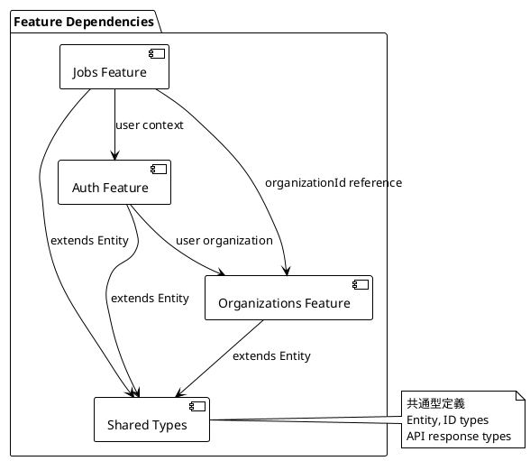

### 6. 状態管理パターン（Chapter-06で拡張）

#### 6.1 Local State vs Global State

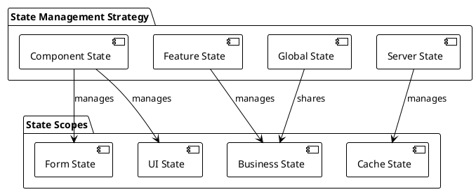

#### 6.2 想定される状態管理

```typescript
// Feature-level state (Chapter-06)
export const useJobsState = () => {
  const [filters, setFilters] = useState<JobFilters>({});
  const [sortOptions, setSortOptions] = useState<JobSortOptions>();
  
  return {
    filters,
    setFilters,
    sortOptions,
    setSortOptions,
  };
};

// Global state integration
export const useJobsWithGlobalState = () => {
  const { user } = useAuth();
  const localState = useJobsState();
  const jobsQuery = useJobs(user?.organizationId);
  
  return {
    ...localState,
    ...jobsQuery,
  };
};
```

### 7. Testing Strategy

#### 7.1 Feature Testing Architecture

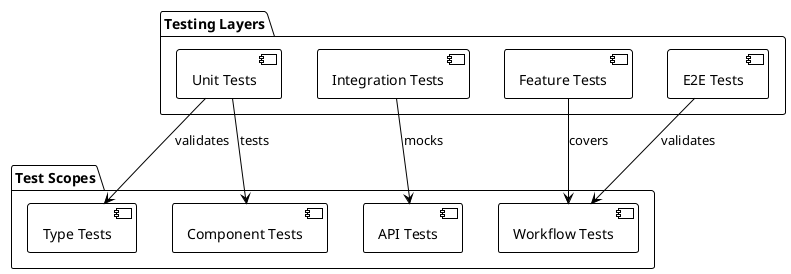

#### 7.2 Feature Testing Examples

```typescript
// Type testing
describe('Job Types', () => {
  it('should create valid Job type', () => {
    const job: Job = {
      id: '1',
      organizationId: 'org-1',
      position: 'Developer',
      department: 'Engineering',
      location: 'Remote',
      info: 'Job description',
      createdAt: new Date(),
      updatedAt: new Date(),
    };
    
    expect(job.position).toBe('Developer');
  });
});

// Component testing
describe('JobsList', () => {
  it('renders job list correctly', () => {
    const jobs = [mockJob1, mockJob2];
    render(
      <JobsList 
        jobs={jobs} 
        type="dashboard" 
        organizationId="org-1" 
      />
    );
    
    expect(screen.getByTestId('jobs-list')).toBeInTheDocument();
  });
});
```

### 8. Performance Considerations

#### 8.1 Feature Loading Strategy

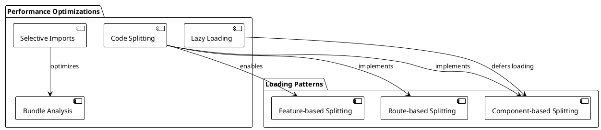

#### 8.2 Feature Optimization

```typescript
// Lazy loading features
const JobsFeature = lazy(() => import('@/features/jobs'));
const OrganizationsFeature = lazy(() => import('@/features/organizations'));

// Route-based code splitting
export const AppRoutes = () => (
  <Routes>
    <Route 
      path="/jobs/*" 
      element={
        <Suspense fallback={<Loading />}>
          <JobsFeature />
        </Suspense>
      } 
    />
  </Routes>
);
```

### 9. Documentation Strategy

#### 9.1 Feature Documentation

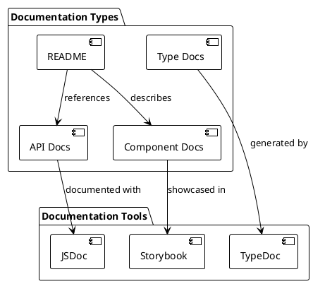

#### 9.2 Feature README Template

```markdown
# Jobs Feature

## Overview
Handles all job-related functionality including listing, creation, and management.

## Structure
- `/api` - Data access layer
- `/components` - UI components  
- `/types` - TypeScript definitions
- `/index.ts` - Public API

## Usage
```typescript
import { JobsList, useJobs, Job } from '@/features/jobs';
```

## Components
- `JobsList` - Display jobs in table format
- `CreateJobForm` - Form for creating new jobs
- `JobInfo` - Display job details

## API
- `useJobs(organizationId)` - Fetch jobs for organization
- `useCreateJob()` - Create new job mutation
```

## 設計原則とベストプラクティス

### 1. Feature Design Principles

```plantuml
@startuml
!theme plain

package "Design Principles" {
  [Domain Separation] as domain
  [Loose Coupling] as coupling
  [High Cohesion] as cohesion
  [Clear Interfaces] as interfaces
}

domain : ビジネス境界での分離
domain : 機能の独立性
domain : ドメインエキスパートとの対話

coupling : Feature間の依存最小化
coupling : 共通インフラの活用
coupling : インターフェースベース設計

cohesion : 関連機能のグループ化
cohesion : 単一責任原則
cohesion : 内部結合度の最大化

interfaces : 明確なパブリックAPI
interfaces : 型安全な契約
interfaces : バージョニング対応

@enduml
```

### 2. Scalability Considerations

```plantuml
@startuml
!theme plain

package "Scalability Factors" {
  [Team Scaling] as team
  [Code Scaling] as code
  [Performance Scaling] as performance
  [Maintenance Scaling] as maintenance
}

team : 独立したチーム開発
team : Feature ownership
team : 並行開発

code : 新機能の追加容易性
code : 既存機能の拡張
code : コードの再利用

performance : バンドルサイズ管理
performance : レンダリング最適化
performance : メモリ使用量

maintenance : テストの維持
maintenance : リファクタリング
maintenance : 技術的負債の管理

@enduml
```

## まとめ

Chapter-05では、機能ベースのモジュール設計（Features Architecture）の基盤を構築しました：

**主要な実装成果**:
1. **Feature構造**: jobs, organizations, auth の機能分離
2. **型定義システム**: TypeScript による厳密な型管理
3. **コンポーネント設計**: 機能特化したUIコンポーネント
4. **パブリックAPI**: 明確なFeature間インターフェース
5. **スケーラビリティ**: 新機能追加の容易性

**設計の特徴**:
- **ドメイン駆動**: ビジネス機能による分離
- **一貫性**: 各Featureの統一された構造
- **独立性**: Feature間の疎結合
- **拡張性**: 新しいFeatureの追加が容易

次章では、この基盤の上にAPIレイヤーと状態管理を実装し、データフローとビジネスロジックを完成させていきます。
