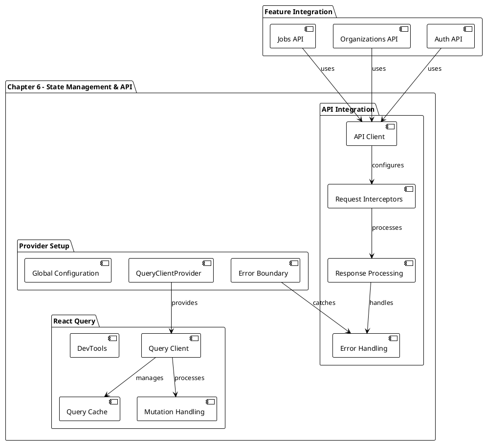
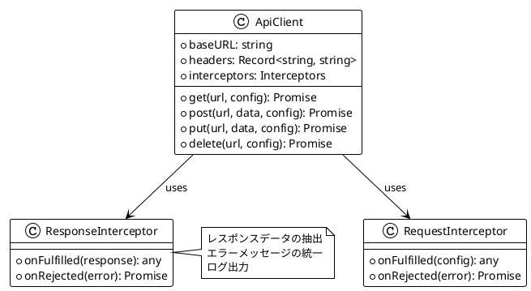
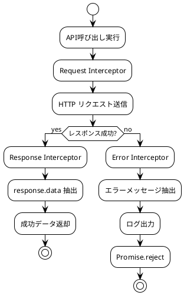
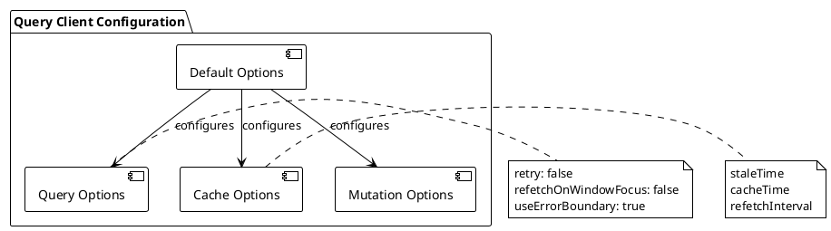
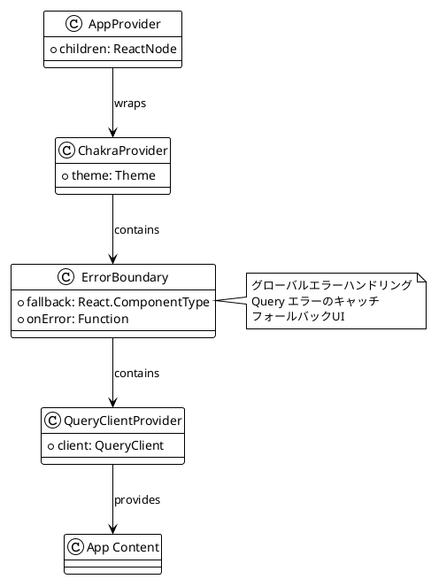
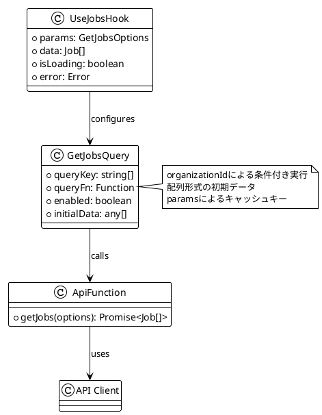
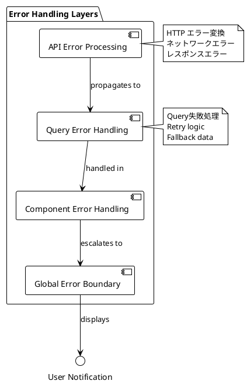
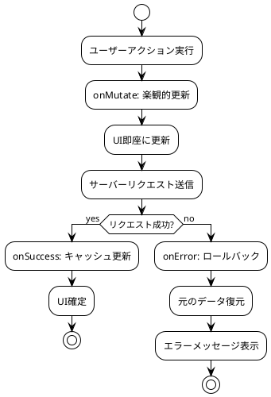

# 第6章: 状態管理とAPIインテグレーション

## 概要

第6章では、React QueryによるサーバーサイドState管理とAPIインテグレーションの実装について解説します。この章では、非同期データフェッチング、キャッシュ管理、エラーハンドリング、そして楽観的更新などの高度な状態管理パターンを実装します。

## アーキテクチャ図



## 実装詳細

### 1. API Client設計

#### 1.1 Axios設定

```typescript
import Axios from 'axios';

import { API_URL } from '@/config/constants';

export const apiClient = Axios.create({
  baseURL: API_URL,
  headers: {
    'Content-Type': 'application/json',
  },
});

apiClient.interceptors.response.use(
  (response) => {
    return response.data;
  },
  (error) => {
    const message =
      error.response?.data?.message || error.message;

    console.error(message);

    return Promise.reject(error);
  }
);
```

**API Client 設計パターン**:



#### 1.2 Request/Response フロー



#### 1.3 環境別設定

```typescript
// 環境設定の拡張
export const createApiClient = (config: ApiClientConfig) => {
  const client = Axios.create({
    baseURL: config.baseURL,
    timeout: config.timeout || 10000,
    headers: {
      'Content-Type': 'application/json',
      ...config.headers,
    },
  });

  // 認証トークンの自動付与
  client.interceptors.request.use((config) => {
    const token = getAuthToken();
    if (token) {
      config.headers.Authorization = `Bearer ${token}`;
    }
    return config;
  });

  return client;
};
```

### 2. React Query 設定

#### 2.1 Query Client設定

```typescript
import { QueryClient } from '@tanstack/react-query';

export const queryClient = new QueryClient({
  defaultOptions: {
    queries: {
      retry: false,
      refetchOnWindowFocus: false,
      useErrorBoundary: true,
    },
  },
});
```

**Query Client 設定詳細**:



#### 2.2 Provider 統合

```typescript
import {
  ChakraProvider,
  GlobalStyle,
} from '@chakra-ui/react';
import { QueryClientProvider } from '@tanstack/react-query';
import { ReactQueryDevtools } from '@tanstack/react-query-devtools';
import { ReactNode } from 'react';
import { ErrorBoundary } from 'react-error-boundary';

import { theme } from '@/config/theme';
import { queryClient } from '@/lib/react-query';

type AppProviderProps = {
  children: ReactNode;
};

export const AppProvider = ({
  children,
}: AppProviderProps) => {
  return (
    <ChakraProvider theme={theme}>
      <ErrorBoundary
        fallback={<div>Something went wrong!</div>}
        onError={console.error}
      >
        <GlobalStyle />
        <QueryClientProvider client={queryClient}>
          <ReactQueryDevtools initialIsOpen={false} />
          {children}
        </QueryClientProvider>
      </ErrorBoundary>
    </ChakraProvider>
  );
};
```

**Provider 階層図**:



### 3. Jobs API実装

#### 3.1 Get Jobs API

```typescript
import { useQuery } from '@tanstack/react-query';

import { apiClient } from '@/lib/api-client';

import { Job } from '../types';

type GetJobsOptions = {
  params: {
    organizationId: string | undefined;
  };
};

export const getJobs = ({
  params,
}: GetJobsOptions): Promise<Job[]> => {
  return apiClient.get('/jobs', {
    params,
  });
};

export const useJobs = ({ params }: GetJobsOptions) => {
  const { data, isFetching, isFetched } = useQuery({
    queryKey: ['jobs', params],
    queryFn: () => getJobs({ params }),
    enabled: !!params.organizationId,
    initialData: [],
  });

  return {
    data,
    isLoading: isFetching && !isFetched,
  };
};
```

**Query設計パターン**:



#### 3.2 Create Job API

```typescript
// 想定されるCreate Job実装
import { useMutation, useQueryClient } from '@tanstack/react-query';

import { apiClient } from '@/lib/api-client';

import { Job, CreateJobData } from '../types';

export const createJob = (data: CreateJobData): Promise<Job> => {
  return apiClient.post('/jobs', data);
};

export const useCreateJob = () => {
  const queryClient = useQueryClient();

  return useMutation({
    mutationFn: createJob,
    onSuccess: (newJob) => {
      // キャッシュの無効化
      queryClient.invalidateQueries({
        queryKey: ['jobs']
      });
      
      // 楽観的更新
      queryClient.setQueryData<Job[]>(
        ['jobs', { organizationId: newJob.organizationId }],
        (oldJobs = []) => [...oldJobs, newJob]
      );
    },
  });
};
```

#### 3.3 Get Single Job API

```typescript
export const getJob = (jobId: string): Promise<Job> => {
  return apiClient.get(`/jobs/${jobId}`);
};

export const useJob = (jobId: string) => {
  return useQuery({
    queryKey: ['job', jobId],
    queryFn: () => getJob(jobId),
    enabled: !!jobId,
  });
};
```

### 4. キャッシュ戦略

#### 4.1 Query Key 設計

```plantuml
@startuml
!theme plain

package "Query Key Strategy" {
  [Hierarchical Keys] as hierarchical
  [Parameter-based Keys] as params
  [Invalidation Patterns] as invalidation
}

hierarchical : ['jobs'] - すべての求人
hierarchical : ['jobs', organizationId] - 組織別求人
hierarchical : ['job', jobId] - 個別求人

params : organizationId による分離
params : フィルター条件による分離
params : ソート条件による分離

invalidation : 階層的な無効化
invalidation : 部分的な更新
invalidation : 関連データの同期

@enduml
```

#### 4.2 キャッシュ無効化戦略

```typescript
// キャッシュ管理のユーティリティ
export const jobsQueryKeys = {
  all: ['jobs'] as const,
  lists: () => [...jobsQueryKeys.all, 'list'] as const,
  list: (filters: JobFilters) => 
    [...jobsQueryKeys.lists(), filters] as const,
  details: () => [...jobsQueryKeys.all, 'detail'] as const,
  detail: (id: string) => 
    [...jobsQueryKeys.details(), id] as const,
};

// 無効化パターン
export const invalidateJobQueries = (queryClient: QueryClient) => {
  // すべての求人クエリを無効化
  queryClient.invalidateQueries({ 
    queryKey: jobsQueryKeys.all 
  });
};

export const updateJobInCache = (
  queryClient: QueryClient,
  updatedJob: Job
) => {
  // 個別求人データの更新
  queryClient.setQueryData(
    jobsQueryKeys.detail(updatedJob.id),
    updatedJob
  );
  
  // 求人リストの部分更新
  queryClient.setQueriesData(
    { queryKey: jobsQueryKeys.lists() },
    (oldData: Job[] | undefined) => 
      oldData?.map(job => 
        job.id === updatedJob.id ? updatedJob : job
      )
  );
};
```

### 5. エラーハンドリング

#### 5.1 階層的エラーハンドリング



#### 5.2 Error Boundary実装

```typescript
// Enhanced Error Boundary
import { ErrorBoundary } from 'react-error-boundary';
import { Button, VStack, Heading, Text } from '@chakra-ui/react';

const ErrorFallback = ({ error, resetErrorBoundary }: any) => {
  return (
    <VStack spacing={4} p={8}>
      <Heading as="h2" size="lg" color="red.500">
        Something went wrong
      </Heading>
      <Text color="gray.600">
        {error.message}
      </Text>
      <Button onClick={resetErrorBoundary} colorScheme="blue">
        Try again
      </Button>
    </VStack>
  );
};

export const AppProvider = ({ children }: AppProviderProps) => {
  return (
    <ChakraProvider theme={theme}>
      <ErrorBoundary
        FallbackComponent={ErrorFallback}
        onError={(error, errorInfo) => {
          console.error('Application Error:', error, errorInfo);
          // エラー報告サービスへの送信
        }}
        onReset={() => {
          // アプリケーション状態のリセット
          window.location.reload();
        }}
      >
        <QueryClientProvider client={queryClient}>
          {children}
        </QueryClientProvider>
      </ErrorBoundary>
    </ChakraProvider>
  );
};
```

### 6. 楽観的更新

#### 6.1 楽観的更新パターン

```typescript
export const useUpdateJob = () => {
  const queryClient = useQueryClient();

  return useMutation({
    mutationFn: updateJob,
    onMutate: async (variables) => {
      // 進行中のクエリをキャンセル
      await queryClient.cancelQueries({
        queryKey: jobsQueryKeys.detail(variables.id)
      });

      // 現在のデータを保存（ロールバック用）
      const previousJob = queryClient.getQueryData(
        jobsQueryKeys.detail(variables.id)
      );

      // 楽観的更新
      queryClient.setQueryData(
        jobsQueryKeys.detail(variables.id),
        (old: Job) => ({ ...old, ...variables.data })
      );

      return { previousJob };
    },
    onError: (err, variables, context) => {
      // エラー時のロールバック
      if (context?.previousJob) {
        queryClient.setQueryData(
          jobsQueryKeys.detail(variables.id),
          context.previousJob
        );
      }
    },
    onSettled: (data, error, variables) => {
      // 最終的にサーバーからデータを再取得
      queryClient.invalidateQueries({
        queryKey: jobsQueryKeys.detail(variables.id)
      });
    },
  });
};
```

**楽観的更新フロー**:



### 7. パフォーマンス最適化

#### 7.1 Prefetching戦略

```typescript
// データのプリフェッチング
export const usePrefetchJobs = () => {
  const queryClient = useQueryClient();

  const prefetchJobs = useCallback(
    (organizationId: string) => {
      queryClient.prefetchQuery({
        queryKey: jobsQueryKeys.list({ organizationId }),
        queryFn: () => getJobs({ params: { organizationId } }),
        staleTime: 5 * 60 * 1000, // 5分間
      });
    },
    [queryClient]
  );

  return prefetchJobs;
};

// Link コンポーネントでのプリフェッチ
export const JobLink = ({ jobId, children }: JobLinkProps) => {
  const queryClient = useQueryClient();

  const handleMouseEnter = () => {
    queryClient.prefetchQuery({
      queryKey: jobsQueryKeys.detail(jobId),
      queryFn: () => getJob(jobId),
    });
  };

  return (
    <Link 
      href={`/jobs/${jobId}`} 
      onMouseEnter={handleMouseEnter}
    >
      {children}
    </Link>
  );
};
```

#### 7.2 Background更新

```plantuml
@startuml
!theme plain

package "Background Updates" {
  [Stale While Revalidate] as swr
  [Background Refetch] as refetch
  [Interval Polling] as polling
  [Focus Refetch] as focus
}

swr : stale data を即座表示
swr : background で最新データ取得
swr : 完了時にUI更新

refetch : 一定条件での自動更新
refetch : ユーザーアクション後
refetch : 重要データの同期

polling : リアルタイム性が必要
polling : 定期的なデータ更新
polling : ダッシュボード等

focus : ウィンドウフォーカス時
focus : タブ切り替え時
focus : アプリ復帰時

@enduml
```

### 8. DevTools統合

#### 8.1 React Query DevTools

```typescript
import { ReactQueryDevtools } from '@tanstack/react-query-devtools';

export const AppProvider = ({ children }: AppProviderProps) => {
  return (
    <QueryClientProvider client={queryClient}>
      {children}
      <ReactQueryDevtools 
        initialIsOpen={false}
        position="bottom-right"
      />
    </QueryClientProvider>
  );
};
```

#### 8.2 開発環境での最適化

```typescript
// 開発環境用の Query Client設定
export const createQueryClient = () => {
  return new QueryClient({
    defaultOptions: {
      queries: {
        retry: process.env.NODE_ENV === 'production' ? 3 : false,
        refetchOnWindowFocus: process.env.NODE_ENV === 'production',
        staleTime: process.env.NODE_ENV === 'development' ? Infinity : 0,
      },
    },
    queryCache: new QueryCache({
      onError: (error) => {
        if (process.env.NODE_ENV === 'development') {
          console.error('Query Error:', error);
        }
      },
    }),
  });
};
```

### 9. API Mocking統合

#### 9.1 MSW統合

```typescript
// lib/msw.ts - Mock Service Worker設定
import { setupWorker } from 'msw';
import { jobsHandlers } from '@/testing/mocks/jobs';

export const worker = setupWorker(...jobsHandlers);

// 開発環境でのMSW起動
if (process.env.NODE_ENV === 'development' && 
    process.env.NEXT_PUBLIC_API_MOCKING === 'true') {
  worker.start();
}
```

#### 9.2 環境別API設定

```plantuml
@startuml
!theme plain

package "Environment Configuration" {
  [Development] as dev
  [Production] as prod
  [Testing] as test
  [Staging] as staging
}

dev : MSW mocking
dev : Local API server
dev : DevTools enabled

prod : Real API endpoints
prod : Error tracking
prod : Performance monitoring

test : MSW handlers
test : Test fixtures
test : Isolated tests

staging : Production-like
staging : Real backend
staging : Debug enabled

@enduml
```

### 10. Testing戦略

#### 10.1 Query Testing

```typescript
// API Hook のテスト
import { renderHook, waitFor } from '@testing-library/react';
import { QueryClient, QueryClientProvider } from '@tanstack/react-query';
import { useJobs } from './get-jobs';

const createWrapper = () => {
  const queryClient = new QueryClient({
    defaultOptions: {
      queries: { retry: false },
    },
  });
  
  return ({ children }: { children: React.ReactNode }) => (
    <QueryClientProvider client={queryClient}>
      {children}
    </QueryClientProvider>
  );
};

describe('useJobs', () => {
  it('should fetch jobs for organization', async () => {
    const { result } = renderHook(
      () => useJobs({ params: { organizationId: 'org-1' } }),
      { wrapper: createWrapper() }
    );

    await waitFor(() => {
      expect(result.current.isLoading).toBe(false);
    });

    expect(result.current.data).toHaveLength(2);
  });
});
```

#### 10.2 Integration Testing

```plantuml
@startuml
!theme plain

package "Testing Layers" {
  [Unit Tests] as unit
  [Hook Tests] as hooks
  [Component Integration] as integration
  [E2E Tests] as e2e
}

unit : API functions
unit : Query key utilities
unit : Error handlers

hooks : useJobs
hooks : useCreateJob
hooks : Custom hooks

integration : Component + API
integration : Error boundaries
integration : Cache behavior

e2e : Full user workflows
e2e : Network scenarios
e2e : Error recovery

@enduml
```

## まとめ

Chapter-06では、React Queryによる状態管理とAPIインテグレーションの実装により、以下を達成しました：

**主要な実装成果**:
1. **API Client**: 統一されたHTTPクライアントとエラーハンドリング
2. **React Query統合**: 強力なサーバーサイド状態管理
3. **キャッシュ戦略**: 効率的なデータキャッシュと同期
4. **エラーハンドリング**: 階層的なエラー処理システム
5. **楽観的更新**: UX向上のための先行更新
6. **パフォーマンス最適化**: プリフェッチングとバックグラウンド更新

**設計の特徴**:
- **宣言的API**: useQueryとuseMutationによる直感的なデータ管理
- **自動キャッシュ**: インテリジェントなキャッシュ戦略
- **エラー回復**: 堅牢なエラーハンドリングとフォールバック
- **開発体験**: DevToolsと開発環境最適化

次章では、この基盤の上にZustandによるクライアントサイド状態管理を実装し、複雑なアプリケーション状態を効率的に管理していきます。
