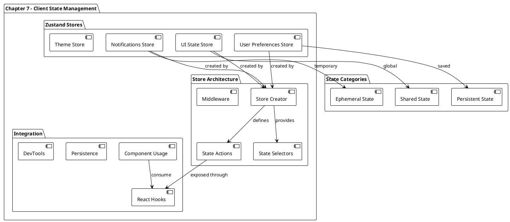
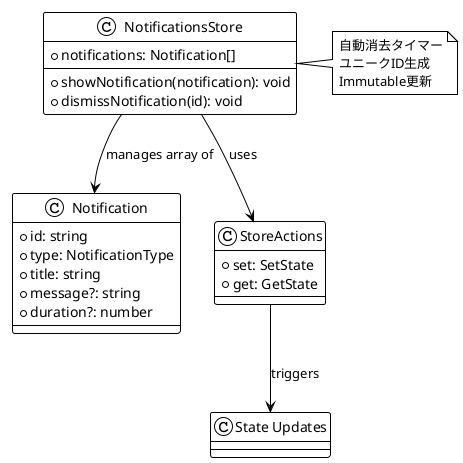

# 第7章: クライアントサイド状態管理 - Zustand実装

## 概要

第7章では、Zustandライブラリを使用したクライアントサイド状態管理の実装について解説します。この章では、アプリケーション固有のUI状態、ユーザー設定、通知システムなどのローカル状態を効率的に管理する方法を学びます。React Queryによるサーバーサイド状態とは別に、クライアント専用の状態管理パターンを構築します。

## アーキテクチャ図



## 実装詳細

### 1. Zustand Store設計

#### 1.1 Notifications Store実装

```typescript
import { createStore, useStore } from 'zustand';

import { uid } from '@/utils/uid';

export type NotificationType =
  | 'info'
  | 'warning'
  | 'success'
  | 'error';

export type Notification = {
  id: string;
  type: NotificationType;
  title: string;
  duration?: number;
  message?: string;
};

export type NotificationsStore = {
  notifications: Notification[];
  showNotification: (
    notification: Omit<Notification, 'id'>
  ) => void;
  dismissNotification: (id: string) => void;
};

export const notificationsStore =
  createStore<NotificationsStore>((set, get) => ({
    notifications: [],
    showNotification: (notification) => {
      const id = uid();
      set((state) => ({
        notifications: [
          ...state.notifications,
          { id, ...notification },
        ],
      }));
      if (notification.duration) {
        setTimeout(() => {
          get().dismissNotification(id);
        }, notification.duration);
      }
    },
    dismissNotification: (id) => {
      set((state) => ({
        notifications: state.notifications.filter(
          (notification) => notification.id !== id
        ),
      }));
    },
  }));

export const useNotifications = () =>
  useStore(notificationsStore);
```

**Store設計パターン**:



#### 1.2 通知システムの特徴

**自動消去機能**:
- `duration` プロパティによる自動消去
- `setTimeout` を使用したタイマー管理
- メモリリークを防ぐためのクリーンアップ

**Immutable更新**:
- スプレッド演算子による配列更新
- filterメソッドによる要素削除
- 状態の不変性維持

### 2. Store Architecture Patterns

#### 2.1 Store Factory Pattern

```typescript
// 汎用的なStore作成パターン
export const createBaseStore = <T extends Record<string, any>>(
  initialState: T,
  actions: (set: SetState<T>, get: GetState<T>) => Partial<T>
) => {
  return createStore<T>((set, get) => ({
    ...initialState,
    ...actions(set, get),
  }));
};

// UI State Store
export type UIStore = {
  sidebarOpen: boolean;
  theme: 'light' | 'dark' | 'system';
  toggleSidebar: () => void;
  setTheme: (theme: 'light' | 'dark' | 'system') => void;
};

export const uiStore = createStore<UIStore>((set) => ({
  sidebarOpen: false,
  theme: 'system',
  toggleSidebar: () => set((state) => ({ 
    sidebarOpen: !state.sidebarOpen 
  })),
  setTheme: (theme) => set({ theme }),
}));
```

#### 2.2 Selector Pattern

```plantuml
@startuml
!theme plain

package "Selector Patterns" {
  [Basic Selector] as basic
  [Computed Selector] as computed
  [Filtered Selector] as filtered
  [Shallow Selector] as shallow
}

basic : 単一プロパティ選択
basic : useStore(store, s => s.property)

computed : 計算済み値
computed : 複数プロパティの組み合わせ
computed : メモ化された結果

filtered : 条件付き選択
filtered : 配列フィルタリング
filtered : 動的な絞り込み

shallow : 浅い等価性チェック
shallow : オブジェクト比較最適化
shallow : 不要な再レンダリング防止

@enduml
```

```typescript
// Selector Hook Examples
export const useActiveNotifications = () =>
  useStore(notificationsStore, (state) => 
    state.notifications.filter(n => n.type === 'error')
  );

export const useNotificationCount = () =>
  useStore(notificationsStore, (state) => 
    state.notifications.length
  );

export const useHasNotifications = () =>
  useStore(notificationsStore, (state) => 
    state.notifications.length > 0
  );

// Shallow comparison for objects
export const useUIState = () =>
  useStore(uiStore, (state) => ({
    sidebarOpen: state.sidebarOpen,
    theme: state.theme,
  }), shallow);
```

### 3. 高度なStore機能

#### 3.1 Middleware実装

```typescript
// Persistence Middleware
export const persist = <T>(
  config: StateCreator<T>,
  options: {
    name: string;
    storage?: 'localStorage' | 'sessionStorage';
  }
) => {
  const storage = options.storage === 'sessionStorage' 
    ? sessionStorage 
    : localStorage;

  return (set: SetState<T>, get: GetState<T>) => {
    const store = config(set, get);
    
    // 初期化時にストレージから復元
    const stored = storage.getItem(options.name);
    if (stored) {
      try {
        const parsedState = JSON.parse(stored);
        Object.assign(store, parsedState);
      } catch (error) {
        console.warn('Failed to parse stored state:', error);
      }
    }

    // 状態変更時にストレージに保存
    const persistedSet: SetState<T> = (partial, replace) => {
      set(partial, replace);
      const state = get();
      storage.setItem(options.name, JSON.stringify(state));
    };

    return config(persistedSet, get);
  };
};

// 使用例
export const userPreferencesStore = createStore(
  persist<UserPreferencesStore>(
    (set) => ({
      language: 'en',
      timezone: 'UTC',
      setLanguage: (language) => set({ language }),
      setTimezone: (timezone) => set({ timezone }),
    }),
    { name: 'user-preferences' }
  )
);
```

#### 3.2 DevTools統合

```typescript
// DevTools Middleware
import { devtools } from 'zustand/middleware';

export const notificationsStore = createStore(
  devtools<NotificationsStore>(
    (set, get) => ({
      notifications: [],
      showNotification: (notification) => {
        const id = uid();
        set((state) => ({
          notifications: [
            ...state.notifications,
            { id, ...notification },
          ],
        }), false, 'showNotification');
      },
      dismissNotification: (id) => {
        set((state) => ({
          notifications: state.notifications.filter(
            (notification) => notification.id !== id
          ),
        }), false, 'dismissNotification');
      },
    }),
    { name: 'notifications' }
  )
);
```

### 4. Notifications UI Integration

#### 4.1 通知表示コンポーネント

```typescript
// 想定される通知表示コンポーネント
import { 
  Alert, 
  AlertIcon, 
  AlertTitle, 
  AlertDescription,
  CloseButton,
  VStack,
  Box
} from '@chakra-ui/react';

import { useNotifications } from '@/stores/notifications';

export const NotificationCenter = () => {
  const { notifications, dismissNotification } = useNotifications();

  return (
    <Box position="fixed" top={4} right={4} zIndex="toast">
      <VStack spacing={2} align="flex-end">
        {notifications.map((notification) => (
          <Alert
            key={notification.id}
            status={notification.type}
            variant="solid"
            borderRadius="md"
            boxShadow="lg"
            maxWidth="400px"
          >
            <AlertIcon />
            <Box flex="1">
              <AlertTitle>{notification.title}</AlertTitle>
              {notification.message && (
                <AlertDescription>
                  {notification.message}
                </AlertDescription>
              )}
            </Box>
            <CloseButton
              position="absolute"
              right="8px"
              top="8px"
              onClick={() => dismissNotification(notification.id)}
            />
          </Alert>
        ))}
      </VStack>
    </Box>
  );
};
```

#### 4.2 通知システムの使用例

```typescript
// Jobs API との統合例
export const useCreateJobWithNotification = () => {
  const { showNotification } = useNotifications();
  
  return useMutation({
    mutationFn: createJob,
    onSuccess: (job) => {
      showNotification({
        type: 'success',
        title: 'Job Created',
        message: `${job.position} has been successfully created.`,
        duration: 5000,
      });
    },
    onError: (error) => {
      showNotification({
        type: 'error',
        title: 'Failed to Create Job',
        message: error.message,
        duration: 7000,
      });
    },
  });
};
```

### 5. UI State Management

#### 5.1 レイアウト状態管理

```plantuml
@startuml
!theme plain

package "UI State Categories" {
  [Layout State] as layout
  [Form State] as form
  [Modal State] as modal
  [Navigation State] as navigation
}

layout : sidebar open/closed
layout : mobile menu state
layout : panel visibility

form : field validation
form : form dirty state
form : submission state

modal : open/closed state
modal : modal content
modal : confirmation dialogs

navigation : active route
navigation : breadcrumb state
navigation : menu selection

@enduml
```

```typescript
// UI Store の拡張実装
export type UIStore = {
  // Layout
  sidebarOpen: boolean;
  mobileMenuOpen: boolean;
  
  // Theme
  colorMode: 'light' | 'dark' | 'system';
  
  // Modals
  modals: {
    [key: string]: {
      isOpen: boolean;
      data?: any;
    };
  };
  
  // Actions
  toggleSidebar: () => void;
  setMobileMenu: (open: boolean) => void;
  setColorMode: (mode: 'light' | 'dark' | 'system') => void;
  openModal: (id: string, data?: any) => void;
  closeModal: (id: string) => void;
};

export const uiStore = createStore<UIStore>((set, get) => ({
  sidebarOpen: true,
  mobileMenuOpen: false,
  colorMode: 'system',
  modals: {},
  
  toggleSidebar: () => 
    set((state) => ({ sidebarOpen: !state.sidebarOpen })),
    
  setMobileMenu: (open) => 
    set({ mobileMenuOpen: open }),
    
  setColorMode: (mode) => 
    set({ colorMode: mode }),
    
  openModal: (id, data) =>
    set((state) => ({
      modals: {
        ...state.modals,
        [id]: { isOpen: true, data },
      },
    })),
    
  closeModal: (id) =>
    set((state) => ({
      modals: {
        ...state.modals,
        [id]: { isOpen: false, data: undefined },
      },
    })),
}));
```

### 6. Performance Optimization

#### 6.1 Subscription最適化

```typescript
// 細粒度のsubscription
export const useSidebarState = () => 
  useStore(uiStore, (state) => state.sidebarOpen);

export const useThemeMode = () => 
  useStore(uiStore, (state) => state.colorMode);

// 複数値のまとめて取得（shallow comparison）
import { shallow } from 'zustand/shallow';

export const useLayoutState = () =>
  useStore(uiStore, (state) => ({
    sidebarOpen: state.sidebarOpen,
    mobileMenuOpen: state.mobileMenuOpen,
  }), shallow);
```

#### 6.2 Store分割戦略

```plantuml
@startuml
!theme plain

package "Store Splitting Strategy" {
  [Feature-based Stores] as feature
  [Concern-based Stores] as concern
  [Lifecycle-based Stores] as lifecycle
}

feature : jobs store
feature : users store
feature : organizations store

concern : ui store
concern : notifications store
concern : preferences store

lifecycle : session store
lifecycle : cache store
lifecycle : temporary store

note right of feature : ビジネスロジック別\nドメイン境界\n独立した開発

note right of concern : 技術的関心事\n横断的機能\n共通インフラ

@enduml
```

### 7. Testing Strategy

#### 7.1 Store Testing

```typescript
// Store のテスト例
import { act, renderHook } from '@testing-library/react';
import { notificationsStore, useNotifications } from './notifications';

describe('Notifications Store', () => {
  beforeEach(() => {
    // ストアをリセット
    notificationsStore.setState({ notifications: [] });
  });

  it('should add notification', () => {
    const { result } = renderHook(() => useNotifications());

    act(() => {
      result.current.showNotification({
        type: 'success',
        title: 'Test notification',
      });
    });

    expect(result.current.notifications).toHaveLength(1);
    expect(result.current.notifications[0].title).toBe('Test notification');
  });

  it('should dismiss notification', () => {
    const { result } = renderHook(() => useNotifications());

    act(() => {
      result.current.showNotification({
        type: 'info',
        title: 'Test',
      });
    });

    const notificationId = result.current.notifications[0].id;

    act(() => {
      result.current.dismissNotification(notificationId);
    });

    expect(result.current.notifications).toHaveLength(0);
  });

  it('should auto-dismiss notification with duration', (done) => {
    const { result } = renderHook(() => useNotifications());

    act(() => {
      result.current.showNotification({
        type: 'info',
        title: 'Auto dismiss',
        duration: 100,
      });
    });

    expect(result.current.notifications).toHaveLength(1);

    setTimeout(() => {
      expect(result.current.notifications).toHaveLength(0);
      done();
    }, 150);
  });
});
```

#### 7.2 Integration Testing

```typescript
// Component + Store の統合テスト
import { render, screen, fireEvent } from '@testing-library/react';
import { NotificationCenter } from '@/components/notification-center';
import { useNotifications } from '@/stores/notifications';

const TestComponent = () => {
  const { showNotification } = useNotifications();
  
  return (
    <div>
      <button
        onClick={() => 
          showNotification({
            type: 'success',
            title: 'Test Notification',
            message: 'This is a test',
          })
        }
      >
        Show Notification
      </button>
      <NotificationCenter />
    </div>
  );
};

describe('Notification Integration', () => {
  it('should show and dismiss notification', () => {
    render(<TestComponent />);

    fireEvent.click(screen.getByText('Show Notification'));
    
    expect(screen.getByText('Test Notification')).toBeInTheDocument();
    expect(screen.getByText('This is a test')).toBeInTheDocument();

    fireEvent.click(screen.getByRole('button', { name: /close/i }));
    
    expect(screen.queryByText('Test Notification')).not.toBeInTheDocument();
  });
});
```

### 8. Store Composition Patterns

#### 8.1 Store間の連携

```typescript
// Store間のやり取り
export const useJobNotifications = () => {
  const { showNotification } = useNotifications();
  
  const createJobMutation = useMutation({
    mutationFn: createJob,
    onSuccess: (job) => {
      showNotification({
        type: 'success',
        title: 'Success',
        message: `Job "${job.position}" created successfully`,
      });
    },
    onError: (error) => {
      showNotification({
        type: 'error',
        title: 'Error',
        message: error.message,
      });
    },
  });

  return createJobMutation;
};

// Combined Hook Pattern
export const useAppState = () => {
  const notifications = useNotifications();
  const ui = useStore(uiStore);
  const preferences = useStore(userPreferencesStore);

  return {
    notifications,
    ui,
    preferences,
  };
};
```

#### 8.2 Action Composition

```plantuml
@startuml
!theme plain

package "Action Composition" {
  [Atomic Actions] as atomic
  [Composed Actions] as composed
  [Side Effects] as effects
  [Cross-Store Actions] as cross
}

atomic : 単一操作
atomic : 基本的な状態変更
atomic : プリミティブな機能

composed : 複数操作の組み合わせ
composed : ビジネスロジック
composed : 複雑なワークフロー

effects : API呼び出し
effects : ローカルストレージ
effects : 外部サービス

cross : 複数ストア間の調整
cross : 状態の同期
cross : 依存関係の管理

@enduml
```

### 9. Best Practices

#### 9.1 Store設計原則

1. **Single Responsibility**: 各Storeは単一の責任を持つ
2. **Immutable Updates**: 常にimmutableな更新を行う
3. **Minimal State**: 必要最小限の状態のみを保持
4. **Computed Values**: 派生値は計算で求める
5. **Clear Actions**: アクション名は明確で理解しやすく

#### 9.2 Performance Guidelines

```typescript
// Good: 必要な部分のみを選択
const sidebarOpen = useStore(uiStore, state => state.sidebarOpen);

// Good: shallow comparison for objects
const layoutState = useStore(uiStore, state => ({
  sidebarOpen: state.sidebarOpen,
  mobileMenuOpen: state.mobileMenuOpen,
}), shallow);

// Avoid: 全体のstoreを取得
const allUIState = useStore(uiStore); // 避ける

// Good: メモ化されたselector
const selectActiveNotifications = useMemo(
  () => (state: NotificationsStore) => 
    state.notifications.filter(n => n.type === 'error'),
  []
);
```

## まとめ

Chapter-07では、Zustandによるクライアントサイド状態管理の実装により、以下を達成しました：

**主要な実装成果**:
1. **通知システム**: 自動消去機能付きの通知管理
2. **UI状態管理**: レイアウト、テーマ、モーダル状態
3. **パフォーマンス最適化**: 細粒度subscription と shallow comparison
4. **Middleware**: 永続化とDevTools統合
5. **Testing**: Store単体とコンポーネント統合テスト

**設計の特徴**:
- **軽量**: 最小限のボイラープレートコード
- **型安全**: TypeScriptとの完全な統合
- **柔軟性**: 異なるパターンでの状態管理が可能
- **パフォーマンス**: 効率的な再レンダリング制御

**React Query との使い分け**:
- **React Query**: サーバーサイド状態、キャッシュ、非同期処理
- **Zustand**: クライアントサイド状態、UI状態、アプリケーション設定

次章では、包括的なテスト戦略の実装により、アプリケーションの品質保証とリグレッション防止を実現していきます。
