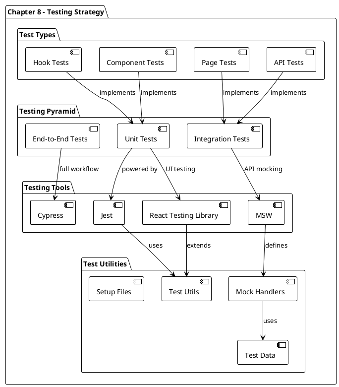
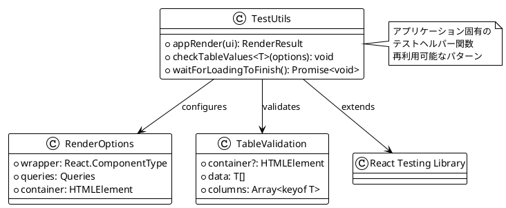
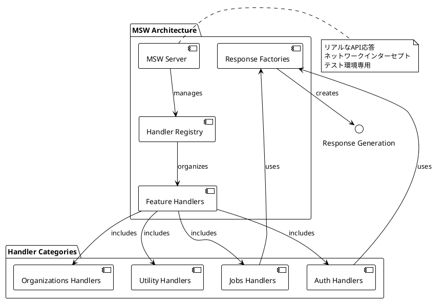
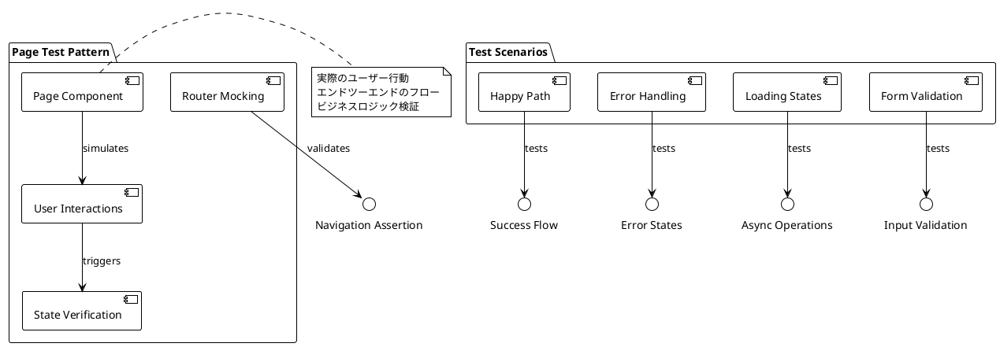
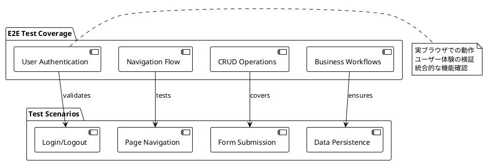
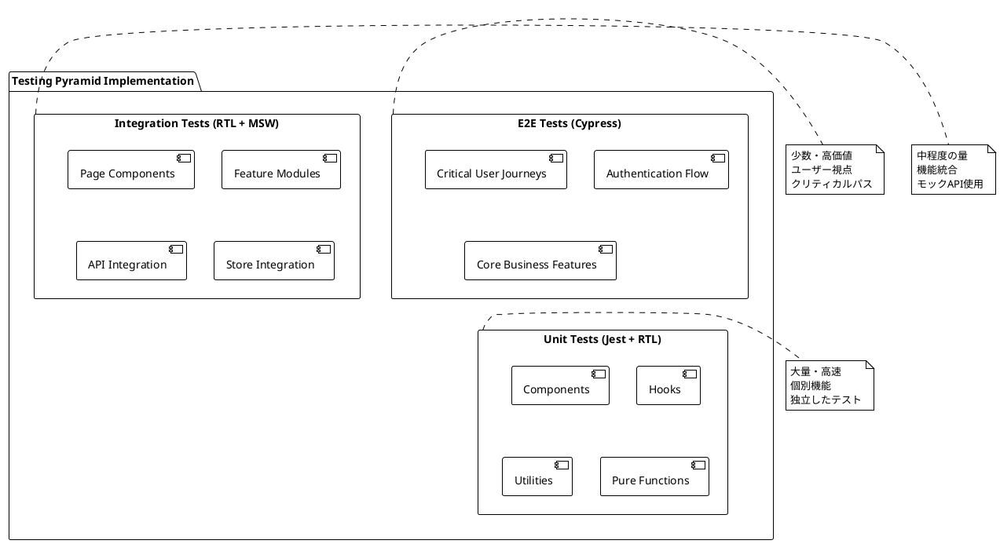
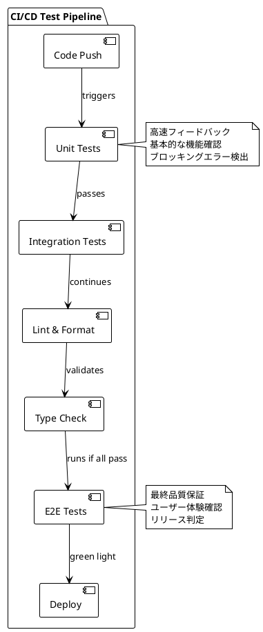

# 第8章: 包括的テスト戦略 - Jest・React Testing Library・Cypress

## 概要

第8章では、Reactアプリケーションにおける包括的なテスト戦略の実装について解説します。この章では、単体テスト（Jest + React Testing Library）、統合テスト、エンドツーエンドテスト（Cypress）を組み合わせた多層テスト戦略により、アプリケーションの品質保証とリグレッション防止を実現します。

## アーキテクチャ図



## 実装詳細

### 1. Jest設定と基盤構築

#### 1.1 Jest設定ファイル

```javascript
const nextJest = require('next/jest');

const createJestConfig = nextJest({
  dir: './',
});

const customJestConfig = {
  setupFilesAfterEnv: [
    '<rootDir>/src/testing/setup-tests.ts',
  ],
  moduleDirectories: ['node_modules', '<rootDir>/'],
  testEnvironment: 'jest-environment-jsdom',
  moduleNameMapping: {
    '@/(.*)': '<rootDir>/src/$1',
  },
  testPathIgnorePatterns: [
    '<rootDir>/cypress/',
    '<rootDir>/code-stages/',
  ],
};

module.exports = createJestConfig(customJestConfig);
```

**設定の特徴**:
- **Next.js統合**: `next/jest`による最適化された設定
- **Path Alias**: TypeScriptと同じパスマッピング
- **JSDOM環境**: ブラウザ環境のシミュレーション
- **セットアップファイル**: テスト実行前の共通処理

#### 1.2 テストセットアップ

```typescript
import '@testing-library/jest-dom/extend-expect';

import { queryClient } from '@/lib/react-query';
import { seedDb } from '@/testing/mocks/seed-db';
import { server } from '@/testing/mocks/server';

beforeAll(() => {
  server.listen({ onUnhandledRequest: 'error' });
  seedDb();
});

afterAll(() => server.close());

afterEach(async () => {
  queryClient.clear();
  server.resetHandlers();
});
```

**セットアップの役割**:
- **Jest DOM拡張**: カスタムマッチャーの追加
- **MSWサーバー**: APIモックの起動・停止
- **データベース初期化**: テストデータの準備
- **クリーンアップ**: テスト間の状態リセット

### 2. テストユーティリティ

#### 2.1 カスタムレンダー関数

```typescript
import {
  render,
  screen,
  waitFor,
  within,
} from '@testing-library/react';
import userEvent from '@testing-library/user-event';
import { ReactElement } from 'react';

import { AppProvider } from '@/providers/app';
import { Entity } from '@/types';

// App Provider内でのレンダリング
export const appRender = (ui: ReactElement) => {
  return render(ui, {
    wrapper: AppProvider,
  });
};

// テーブル値検証ユーティリティ
export const checkTableValues = <T extends Entity>({
  container,
  data,
  columns,
}: {
  container?: HTMLElement;
  data: T[];
  columns: Array<keyof T>;
}) => {
  data.forEach((entry, index) => {
    const selector = container
      ? within(container)
      : screen;
    const row = selector.getByTestId(
      `table-row-${index}`
    );

    columns.forEach((column) => {
      const cell = within(row).getByRole('cell', {
        name: String(entry[column]),
      });

      expect(cell).toBeInTheDocument();
    });
  });
};

// ローディング完了待機
export const waitForLoadingToFinish = () => {
  return waitFor(
    () => {
      const loaders = [
        ...screen.queryAllByTestId(/loading/i),
        ...screen.queryAllByText(/loading/i),
      ];

      loaders.forEach((loader) =>
        expect(loader).not.toBeInTheDocument()
      );
    },
    {
      timeout: 4000,
    }
  );
};

export * from '@testing-library/react';
export { userEvent };
```

**ユーティリティ設計パターン**:



### 3. MSWによるAPIモック

#### 3.1 MSWサーバー設定

```typescript
import { setupServer } from 'msw/node';
import { handlers } from './handlers';

export const server = setupServer(...handlers);
```

#### 3.2 ハンドラー構造

```typescript
import { rest } from 'msw';
import { API_URL } from '@/config/constants';
import { authHandlers } from './auth';
import { jobsHandlers } from './jobs';
import { organizationsHandlers } from './organizations';

export const handlers = [
  ...authHandlers,
  ...jobsHandlers,
  ...organizationsHandlers,
  rest.get(`${API_URL}/healthcheck`, (req, res, ctx) => {
    return res(
      ctx.status(200),
      ctx.json({ healthy: true })
    );
  }),
];
```

**MSW設計パターン**:



### 4. ページレベルテスト

#### 4.1 ログインページテスト

```typescript
import LoginPage from '@/pages/auth/login';
import {
  appRender,
  screen,
  userEvent,
  waitFor,
} from '@/testing/test-utils';

const router = {
  replace: jest.fn(),
  query: {},
};

jest.mock('next/router', () => ({
  useRouter: () => router,
}));

describe('Login Page', () => {
  it('should login the user into the dashboard', async () => {
    await appRender(<LoginPage />);

    const emailInput = screen.getByRole('textbox', {
      name: /email/i,
    });

    const passwordInput =
      screen.getByLabelText(/password/i);

    const submitButton = screen.getByRole('button', {
      name: /log in/i,
    });

    const credentials = {
      email: 'user1@test.com',
      password: 'password',
    };

    userEvent.type(emailInput, credentials.email);
    userEvent.type(passwordInput, credentials.password);

    userEvent.click(submitButton);

    await waitFor(() =>
      expect(router.replace).toHaveBeenCalledWith(
        '/dashboard/jobs'
      )
    );
  });
});
```

#### 4.2 ジョブ作成ページテスト

```typescript
import DashboardCreateJobPage from '@/pages/dashboard/jobs/create';
import {
  appRender,
  screen,
  userEvent,
  waitFor,
} from '@/testing/test-utils';

const router = {
  push: jest.fn(),
};

jest.mock('next/router', () => ({
  useRouter: () => router,
}));

const jobData = {
  position: 'Software Engineer',
  location: 'London',
  department: 'Engineering',
  info: 'Lorem Ipsum',
};

describe('Dashboard Create Job Page', () => {
  it('should create a new job', async () => {
    appRender(<DashboardCreateJobPage />);

    const positionInput = screen.getByRole('textbox', {
      name: /position/i,
    });

    const locationInput = screen.getByRole('textbox', {
      name: /location/i,
    });

    const departmentInput = screen.getByRole('textbox', {
      name: /department/i,
    });

    const infoInput = screen.getByRole('textbox', {
      name: /info/i,
    });

    const submitButton = screen.getByRole('button', {
      name: /create/i,
    });

    userEvent.type(positionInput, jobData.position);
    userEvent.type(locationInput, jobData.location);
    userEvent.type(departmentInput, jobData.department);
    userEvent.type(infoInput, jobData.info);

    userEvent.click(submitButton);

    await waitFor(() =>
      expect(
        screen.getByText(/job created!/i)
      ).toBeInTheDocument()
    );
  });
});
```

**ページテストの特徴**:



### 5. Cypressエンドツーエンドテスト

#### 5.1 Cypress設定

```typescript
import { defineConfig } from 'cypress';

export default defineConfig({
  video: false,
  videoUploadOnPasses: false,
  e2e: {
    setupNodeEvents(on, config) {
      return require('./cypress/plugins/index.ts')(
        on,
        config
      );
    },
  },
});
```

#### 5.2 ダッシュボードE2Eテスト

```typescript
import { testData } from '../../src/testing/test-data';

const user = testData.users[0];
const job = testData.jobs[0];

describe('dashboard', () => {
  it('should authenticate into the dashboard', () => {
    cy.clearCookies();
    cy.clearLocalStorage();

    cy.visit('http://localhost:3000/dashboard/jobs');

    cy.wait(500);

    cy.url().should(
      'equal',
      'http://localhost:3000/auth/login?redirect=/dashboard/jobs'
    );

    cy.findByRole('textbox', {
      name: /email/i,
    }).type(user.email);

    cy.findByLabelText(/password/i).type(
      user.password.toLowerCase()
    );

    cy.findByRole('button', {
      name: /log in/i,
    }).click();

    cy.findByRole('heading', {
      name: /jobs/i,
    }).should('exist');
  });

  it('should navigate to and visit the job details page', () => {
    cy.findByRole('row', {
      name: new RegExp(
        `${job.position} ${job.department} ${job.location} View`,
        'i'
      ),
    }).within(() => {
      cy.findByRole('link', {
        name: /view/i,
      }).click();
    });

    cy.findByRole('heading', {
      name: job.position,
    }).should('exist');
  });
});
```

**E2Eテストの範囲**:



### 6. テスト戦略とピラミッド

#### 6.1 テストピラミッド実装



#### 6.2 テスト分類と責任

| テストレベル | ツール | 責任範囲 | 実行頻度 |
|-------------|--------|----------|----------|
| **Unit** | Jest + RTL | 個別コンポーネント、関数、Hook | 毎回のコミット |
| **Integration** | RTL + MSW | ページレベル、Feature統合 | 毎回のPR |
| **E2E** | Cypress | エンドツーエンドワークフロー | リリース前 |

### 7. 高度なテスティングパターン

#### 7.1 カスタムHookテスト

```typescript
import { renderHook, act } from '@testing-library/react';
import { useJobs } from '@/features/jobs/api/get-jobs';
import { AppProvider } from '@/providers/app';

const wrapper = ({ children }: { children: React.ReactNode }) => (
  <AppProvider>{children}</AppProvider>
);

describe('useJobs Hook', () => {
  it('should fetch jobs successfully', async () => {
    const { result, waitForNextUpdate } = renderHook(
      () => useJobs(),
      { wrapper }
    );

    expect(result.current.isLoading).toBe(true);

    await waitForNextUpdate();

    expect(result.current.isLoading).toBe(false);
    expect(result.current.data).toBeDefined();
    expect(result.current.data?.length).toBeGreaterThan(0);
  });
});
```

#### 7.2 エラーハンドリングテスト

```typescript
import { rest } from 'msw';
import { server } from '@/testing/mocks/server';
import { API_URL } from '@/config/constants';

describe('Error Handling', () => {
  it('should handle API errors gracefully', async () => {
    // MSWでエラーレスポンスを設定
    server.use(
      rest.get(`${API_URL}/jobs`, (req, res, ctx) => {
        return res(
          ctx.status(500),
          ctx.json({ message: 'Internal Server Error' })
        );
      })
    );

    appRender(<JobsPage />);

    await waitFor(() => {
      expect(
        screen.getByText(/something went wrong/i)
      ).toBeInTheDocument();
    });
  });
});
```

#### 7.3 非同期処理テスト

```typescript
describe('Async Operations', () => {
  it('should show loading state during async operation', async () => {
    appRender(<JobsPage />);

    // ローディング状態の確認
    expect(screen.getByTestId('loading')).toBeInTheDocument();

    // ローディング完了まで待機
    await waitForLoadingToFinish();

    // データ表示の確認
    expect(screen.getByRole('table')).toBeInTheDocument();
  });

  it('should handle optimistic updates', async () => {
    appRender(<CreateJobPage />);

    const positionInput = screen.getByRole('textbox', {
      name: /position/i,
    });

    userEvent.type(positionInput, 'New Position');
    userEvent.click(screen.getByRole('button', { name: /create/i }));

    // 楽観的更新の確認
    expect(screen.getByText('New Position')).toBeInTheDocument();

    // API完了後の確認
    await waitFor(() => {
      expect(screen.getByText(/created successfully/i)).toBeInTheDocument();
    });
  });
});
```

### 8. テストデータ管理

#### 8.1 Test Data Factory

```typescript
// test-data.ts
export const testData = {
  users: [
    {
      id: '1',
      email: 'user1@test.com',
      password: 'password',
      firstName: 'Test',
      lastName: 'User',
      role: 'USER',
      organizationId: '1',
    },
  ],
  jobs: [
    {
      id: '1',
      position: 'Software Engineer',
      department: 'Engineering',
      location: 'London',
      info: 'Great opportunity',
      organizationId: '1',
    },
  ],
  organizations: [
    {
      id: '1',
      name: 'Test Organization',
      email: 'org@test.com',
      phone: '123-456-7890',
      info: 'Test organization',
    },
  ],
};

// Factory Functions
export const createJob = (overrides: Partial<Job> = {}): Job => ({
  id: uid(),
  position: 'Default Position',
  department: 'Default Department',
  location: 'Default Location',
  info: 'Default info',
  organizationId: '1',
  ...overrides,
});

export const createUser = (overrides: Partial<User> = {}): User => ({
  id: uid(),
  email: 'default@test.com',
  firstName: 'Default',
  lastName: 'User',
  role: 'USER',
  organizationId: '1',
  ...overrides,
});
```

#### 8.2 Mock Database

```typescript
// seed-db.ts
import { factory, primaryKey } from '@mswjs/data';
import { testData } from './test-data';

export const db = factory({
  user: {
    id: primaryKey(() => uid()),
    email: String,
    firstName: String,
    lastName: String,
    password: String,
    role: String,
    organizationId: String,
  },
  job: {
    id: primaryKey(() => uid()),
    position: String,
    department: String,
    location: String,
    info: String,
    organizationId: String,
  },
  organization: {
    id: primaryKey(() => uid()),
    name: String,
    email: String,
    phone: String,
    info: String,
  },
});

export const seedDb = () => {
  testData.users.forEach(user => db.user.create(user));
  testData.jobs.forEach(job => db.job.create(job));
  testData.organizations.forEach(org => db.organization.create(org));
};
```

### 9. CI/CDパイプライン統合

#### 9.1 テスト実行戦略



#### 9.2 GitHub Actions設定

```yaml
name: CI/CD
on:
  - push
jobs:
  code-checks:
    name: Code Checks
    runs-on: ubuntu-latest
    steps:
      - uses: actions/checkout@v3
      - uses: actions/setup-node@v3
        with:
          node-version: 16
      - run: mv .env.example .env
      - run: npm install
      - run: npm run test
      - run: npm run lint
      - run: npm run format:check
      - run: npm run types:check
  e2e:
    name: E2E Tests
    runs-on: ubuntu-latest
    steps:
      - uses: actions/checkout@v3
      - run: mv .env.example .env
      - uses: cypress-io/github-action@v4
        with:
          build: npm run build
          start: npm run start
```

### 10. テストメトリクスと品質保証

#### 10.1 カバレッジ要件

```typescript
// jest.config.js の カバレッジ設定
module.exports = createJestConfig({
  // ... 他の設定
  collectCoverageFrom: [
    'src/**/*.{js,jsx,ts,tsx}',
    '!src/**/*.d.ts',
    '!src/**/*.stories.{js,jsx,ts,tsx}',
    '!src/testing/**',
    '!src/pages/_app.tsx',
    '!src/pages/_document.tsx',
  ],
  coverageThreshold: {
    global: {
      branches: 80,
      functions: 80,
      lines: 80,
      statements: 80,
    },
  },
});
```

#### 10.2 品質ゲートとメトリクス

| メトリクス | 目標値 | 測定方法 |
|-----------|--------|----------|
| **コードカバレッジ** | 80%以上 | Jest Coverage |
| **E2Eテスト成功率** | 95%以上 | Cypress Dashboard |
| **テスト実行時間** | Unit: <30s, E2E: <5min | CI Pipeline |
| **Flaky Test率** | <5% | 継続監視 |

### 11. Best Practices

#### 11.1 テスト設計原則

1. **AAA Pattern**: Arrange, Act, Assert の明確な分離
2. **独立性**: テスト間での状態共有を避ける
3. **決定論的**: 毎回同じ結果が得られる
4. **読みやすさ**: テストがドキュメントとして機能
5. **高速実行**: 迅速なフィードバックサイクル

#### 11.2 アンチパターン回避

```typescript
// Good: 明確なアサーション
expect(screen.getByRole('button', { name: /submit/i }))
  .toBeInTheDocument();

// Avoid: 曖昧なセレクター
expect(document.querySelector('.btn')).toBeTruthy();

// Good: ユーザー中心のテスト
userEvent.click(screen.getByRole('button', { name: /create job/i }));

// Avoid: 実装詳細のテスト
fireEvent.click(container.firstChild.querySelector('button'));

// Good: 非同期処理の適切な待機
await waitFor(() => 
  expect(screen.getByText('Success')).toBeInTheDocument()
);

// Avoid: 任意のタイマー
await new Promise(resolve => setTimeout(resolve, 1000));
```

## まとめ

Chapter-08では、包括的なテスト戦略の実装により、以下を達成しました：

**主要な実装成果**:
1. **多層テスト戦略**: Unit、Integration、E2Eテストの組み合わせ
2. **MSWによるAPIモック**: リアルなAPI応答をシミュレート
3. **カスタムテストユーティリティ**: 再利用可能なテストヘルパー
4. **CI/CD統合**: 自動化されたテストパイプライン
5. **品質メトリクス**: カバレッジとパフォーマンス指標

**テスト戦略の特徴**:
- **実用的**: 実際のユーザー行動に基づくテスト
- **効率的**: 適切なテストレベルでの検証
- **保守可能**: 変更に強いテスト設計
- **包括的**: 機能・品質・パフォーマンスの全面カバー

**品質保証の成果**:
- **リグレッション防止**: 既存機能の破綻検出
- **継続的品質**: CI/CDパイプラインでの自動検証
- **開発者信頼性**: 安心してリファクタリングできる環境
- **ユーザー体験保証**: E2Eテストによる実体験検証

次章では、本格的な本番環境デプロイメントとCI/CDパイプラインにより、継続的インテグレーション・デリバリーを実現していきます。
