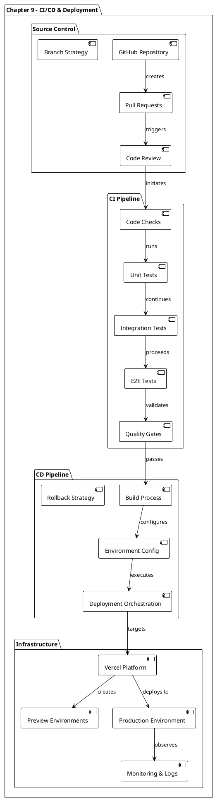
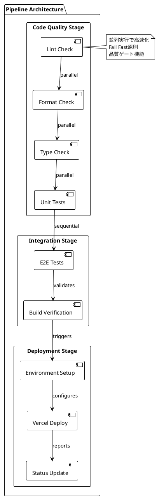
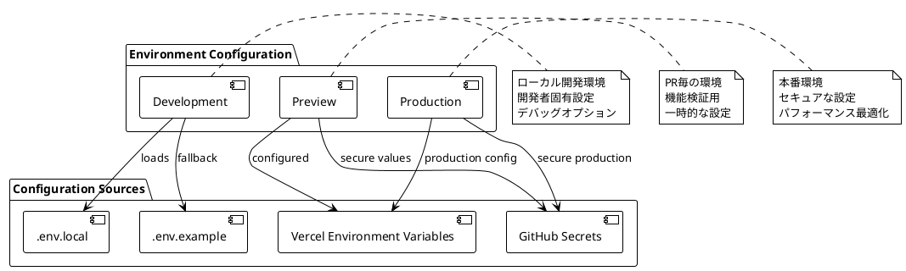
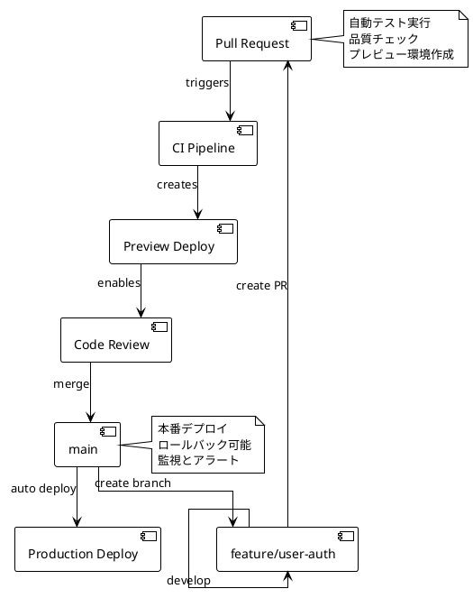
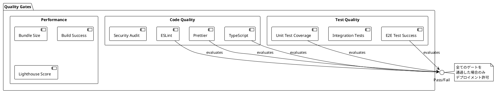
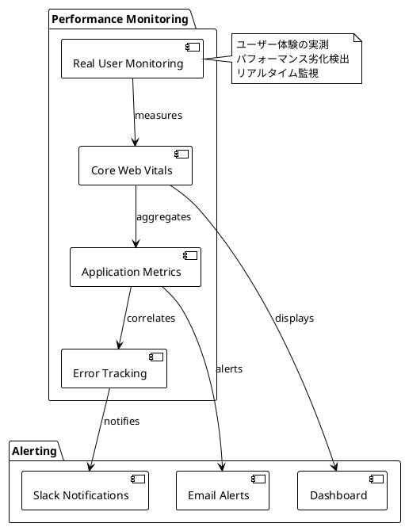
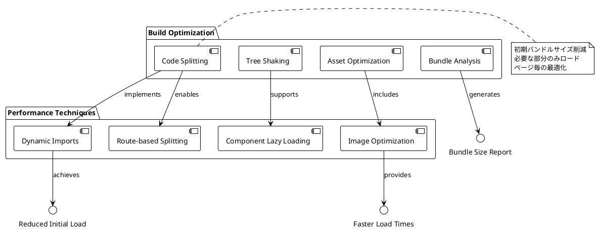
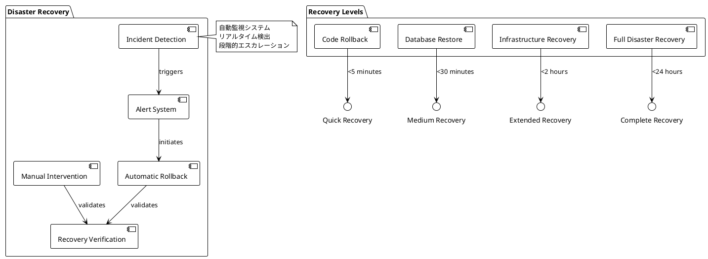
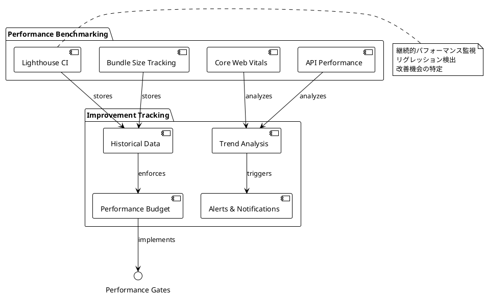
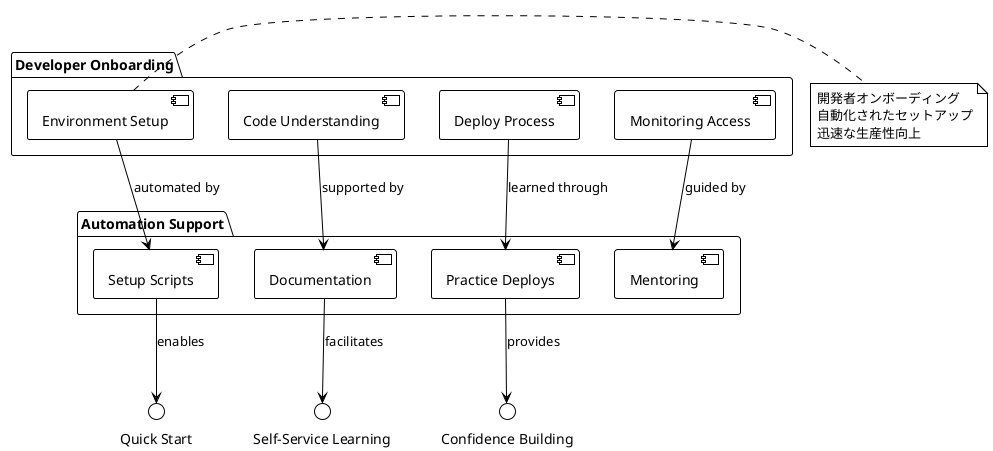

# 第9章: CI/CDパイプライン・デプロイメント戦略

## 概要

第9章では、Reactアプリケーションの本格的なCI/CDパイプラインとデプロイメント戦略について解説します。この章では、GitHub Actions、Vercel、コード品質チェック、自動テスト実行を組み合わせた継続的インテグレーション・デリバリーにより、信頼性の高いソフトウェア配信を実現します。

## アーキテクチャ図



## 実装詳細

### 1. GitHub Actions CI/CDパイプライン

#### 1.1 メインワークフロー設定

```yaml
name: CI/CD
on:
  - push
jobs:
  code-checks:
    name: Code Checks
    runs-on: ubuntu-latest
    steps:
      - uses: actions/checkout@v3
      - uses: actions/setup-node@v3
        with:
          node-version: 16
      - run: mv .env.example .env
      - run: npm install
      - run: npm run test
      - run: npm run lint
      - run: npm run format:check
      - run: npm run types:check

  e2e:
    name: E2E Tests
    runs-on: ubuntu-latest
    steps:
      - uses: actions/checkout@v3
      - run: mv .env.example .env
      - uses: cypress-io/github-action@v4
        with:
          build: npm run build
          start: npm run start

  deploy:
    name: Deploy To Vercel
    runs-on: ubuntu-latest
    needs: [code-checks, e2e]
    if: github.repository_owner == 'alan2207'
    permissions:
      contents: read
      deployments: write
    steps:
      - name: start deployment
        uses: bobheadxi/deployments@v1
        id: deployment
        with:
          step: start
          token: ${{ secrets.GITHUB_TOKEN }}
          env: ${{ fromJSON('["Production", "Preview"]')[github.ref != 'refs/heads/master'] }}
      
      - uses: actions/checkout@v3
      - run: mv .env.example .env
      - uses: amondnet/vercel-action@v25
        with:
          vercel-token: ${{ secrets.VERCEL_TOKEN }}
          vercel-args: ${{ fromJSON('["--prod", ""]')[github.ref != 'refs/heads/master'] }}
          vercel-org-id: ${{ secrets.VERCEL_ORG_ID}}
          vercel-project-id: ${{ secrets.VERCEL_PROJECT_ID}}
          scope: ${{ secrets.VERCEL_ORG_ID}}
          working-directory: ./
      
      - name: update deployment status
        uses: bobheadxi/deployments@v1
        if: always()
        with:
          step: finish
          token: ${{ secrets.GITHUB_TOKEN }}
          status: ${{ job.status }}
          env: ${{ steps.deployment.outputs.env }}
          deployment_id: ${{ steps.deployment.outputs.deployment_id }}
```

**パイプライン設計の特徴**:



### 2. 環境設定と構成管理

#### 2.1 Vercel設定

```json
{
  "version": 2,
  "github": {
    "enabled": false
  }
}
```

#### 2.2 環境変数管理

```bash
# .env.example
# Next.js
NEXTAUTH_URL=http://localhost:3000
NEXTAUTH_SECRET=secret

# API Configuration
NEXT_PUBLIC_API_URL=http://localhost:8080/api
NEXT_PUBLIC_ENABLE_API_MOCKING=false

# Feature Flags
NEXT_PUBLIC_ENABLE_ANALYTICS=false
NEXT_PUBLIC_ENABLE_NOTIFICATIONS=true

# Environment
NODE_ENV=development
```

**環境設定パターン**:



### 3. ブランチ戦略とデプロイメントフロー

#### 3.1 Git Flow



#### 3.2 デプロイメント戦略

```typescript
// デプロイメント設定の種類
export const deploymentConfig = {
  preview: {
    // プレビューデプロイ設定
    environment: 'preview',
    auto: true,
    retention: '7 days',
    features: {
      analytics: false,
      debugMode: true,
      apiMocking: true,
    },
  },
  production: {
    // 本番デプロイ設定
    environment: 'production',
    auto: true, // mainブランチのみ
    retention: 'permanent',
    features: {
      analytics: true,
      debugMode: false,
      apiMocking: false,
    },
  },
};
```

### 4. 品質ゲートとゲート条件

#### 4.1 自動品質チェック



#### 4.2 品質基準設定

```json
{
  "quality_gates": {
    "code_coverage": {
      "minimum": 80,
      "fail_on_decrease": true
    },
    "bundle_size": {
      "max_size": "1MB",
      "fail_on_increase": "10%"
    },
    "performance": {
      "lighthouse_score": 90,
      "build_time": "5min"
    },
    "security": {
      "vulnerabilities": 0,
      "dependency_audit": true
    }
  }
}
```

### 5. モニタリングと可観測性

#### 5.1 デプロイメント監視

```typescript
// デプロイメント状態の監視
export const deploymentMonitoring = {
  healthChecks: [
    {
      name: 'API Health',
      endpoint: '/api/healthcheck',
      interval: '30s',
      timeout: '5s',
    },
    {
      name: 'Database Connection',
      endpoint: '/api/db-status',
      interval: '1m',
      timeout: '10s',
    },
  ],
  alerts: {
    deployment_failure: {
      channels: ['slack', 'email'],
      severity: 'critical',
    },
    performance_degradation: {
      channels: ['slack'],
      severity: 'warning',
      threshold: '5s response time',
    },
  },
  rollback: {
    automatic: true,
    triggers: [
      'health_check_failure',
      'error_rate_spike',
      'manual_trigger',
    ],
  },
};
```

#### 5.2 パフォーマンス監視



### 6. セキュリティとコンプライアンス

#### 6.1 セキュリティパイプライン

```yaml
# セキュリティチェックの追加
security-scan:
  name: Security Scan
  runs-on: ubuntu-latest
  steps:
    - uses: actions/checkout@v3
    - name: Run Snyk to check for vulnerabilities
      uses: snyk/actions/node@master
      env:
        SNYK_TOKEN: ${{ secrets.SNYK_TOKEN }}
    - name: Audit npm packages
      run: npm audit --audit-level=high
    - name: Check for secrets
      uses: trufflesecurity/trufflehog@main
      with:
        path: ./
        base: main
        head: HEAD
```

#### 6.2 依存関係管理

```json
{
  "dependencies_management": {
    "automated_updates": {
      "tool": "Dependabot",
      "schedule": "weekly",
      "auto_merge": {
        "patch": true,
        "minor": false,
        "major": false
      }
    },
    "security_scanning": {
      "npm_audit": true,
      "snyk": true,
      "github_security_advisories": true
    },
    "policy": {
      "allowed_licenses": ["MIT", "Apache-2.0", "BSD-3-Clause"],
      "blocked_packages": ["lodash"],
      "max_vulnerability_severity": "medium"
    }
  }
}
```

### 7. パフォーマンス最適化とビルド設定

#### 7.1 Webpack最適化

```javascript
// next.config.js
const nextConfig = {
  // 本番最適化設定
  experimental: {
    optimizeCss: true,
    nextScriptWorkers: true,
  },
  
  // Bundle分析
  webpack: (config, { isServer }) => {
    if (!isServer) {
      config.resolve.fallback = {
        ...config.resolve.fallback,
        fs: false,
      };
    }
    
    // Bundle分析器
    if (process.env.ANALYZE === 'true') {
      const withBundleAnalyzer = require('@next/bundle-analyzer')({
        enabled: true,
      });
      return withBundleAnalyzer(config);
    }
    
    return config;
  },
  
  // 画像最適化
  images: {
    domains: ['example.com'],
    formats: ['image/webp', 'image/avif'],
  },
  
  // ヘッダー設定
  async headers() {
    return [
      {
        source: '/:path*',
        headers: [
          {
            key: 'X-Frame-Options',
            value: 'DENY',
          },
          {
            key: 'X-Content-Type-Options',
            value: 'nosniff',
          },
          {
            key: 'Referrer-Policy',
            value: 'origin-when-cross-origin',
          },
        ],
      },
    ];
  },
};

module.exports = nextConfig;
```

#### 7.2 ビルド最適化戦略



### 8. データベースマイグレーションと環境管理

#### 8.1 環境別データベース戦略

```typescript
// 環境別データベース設定
export const databaseConfig = {
  development: {
    type: 'sqlite',
    database: './dev.db',
    migrations: ['src/migrations/*.ts'],
    synchronize: true,
    logging: true,
  },
  preview: {
    type: 'postgresql',
    url: process.env.PREVIEW_DATABASE_URL,
    migrations: ['dist/migrations/*.js'],
    synchronize: false,
    logging: false,
  },
  production: {
    type: 'postgresql',
    url: process.env.DATABASE_URL,
    migrations: ['dist/migrations/*.js'],
    synchronize: false,
    logging: false,
    ssl: {
      rejectUnauthorized: false,
    },
  },
};

// マイグレーション実行戦略
export const migrationStrategy = {
  development: {
    auto: true,
    rollback: 'manual',
  },
  preview: {
    auto: true, // PR作成時
    rollback: 'automatic',
    cleanup: '7 days',
  },
  production: {
    auto: false, // 手動承認必要
    rollback: 'manual',
    backup: true,
  },
};
```

### 9. ロールバック戦略と災害復旧

#### 9.1 自動ロールバック設定

```typescript
// ロールバック設定
export const rollbackConfig = {
  triggers: {
    error_rate: {
      threshold: '5%',
      duration: '5 minutes',
      action: 'auto_rollback',
    },
    response_time: {
      threshold: '2000ms',
      duration: '3 minutes',
      action: 'alert_and_manual',
    },
    health_check: {
      failures: 3,
      action: 'auto_rollback',
    },
  },
  
  strategy: {
    method: 'blue_green',
    verification_time: '5 minutes',
    canary_percentage: 10,
  },
  
  notification: {
    channels: ['slack', 'email'],
    severity_levels: ['info', 'warning', 'critical'],
  },
};
```

#### 9.2 災害復旧プラン



### 10. 継続的改善とメトリクス

#### 10.1 DORA Metrics追跡

```typescript
// DORA Metrics実装
export const doraMetrics = {
  deployment_frequency: {
    measurement: 'daily',
    target: 'multiple_per_day',
    current: 'weekly',
  },
  lead_time: {
    measurement: 'commit_to_production',
    target: '<24_hours',
    current: '2_days',
  },
  mttr: {
    measurement: 'incident_to_resolution',
    target: '<1_hour',
    current: '4_hours',
  },
  change_failure_rate: {
    measurement: 'failed_deployments_percentage',
    target: '<5%',
    current: '8%',
  },
};

// 継続的改善プロセス
export const improvementProcess = {
  retrospectives: {
    frequency: 'bi_weekly',
    participants: ['dev_team', 'qa_team', 'devops'],
    metrics_review: true,
  },
  automation_goals: {
    test_automation: '95%',
    deployment_automation: '100%',
    monitoring_automation: '90%',
  },
  learning_culture: {
    post_mortems: 'blameless',
    knowledge_sharing: 'weekly_sessions',
    experimentation: 'feature_flags',
  },
};
```

#### 10.2 パフォーマンスベンチマーク



### 11. チーム協力とコミュニケーション

#### 11.1 開発ワークフロー

```typescript
// チーム開発プロセス
export const teamWorkflow = {
  code_review: {
    required_approvers: 2,
    auto_assign: true,
    checks_required: [
      'ci_passing',
      'security_scan',
      'performance_check',
    ],
  },
  
  communication: {
    channels: {
      deployment_notifications: '#deployments',
      incident_alerts: '#incidents',
      general_updates: '#dev-team',
    },
    automation: {
      pr_status: 'slack_integration',
      deployment_status: 'status_page',
      error_alerts: 'pagerduty',
    },
  },
  
  knowledge_sharing: {
    documentation: 'automatic_generation',
    runbooks: 'living_documents',
    architecture_decisions: 'adr_process',
  },
};
```

#### 11.2 オンボーディングプロセス



## まとめ

Chapter-09では、包括的なCI/CDパイプラインとデプロイメント戦略により、以下を達成しました：

**主要な実装成果**:
1. **自動化パイプライン**: GitHub ActionsによるCI/CD自動化
2. **品質ゲート**: 多段階の品質チェック機能
3. **環境管理**: 開発・プレビュー・本番環境の適切な分離
4. **監視・可観測性**: リアルタイム監視とアラート機能
5. **セキュリティ**: 脆弱性検出とコンプライアンス対応

**CI/CDパイプラインの特徴**:
- **信頼性**: 段階的検証による高品質デプロイ
- **効率性**: 並列実行とキャッシュによる高速処理
- **安全性**: 自動ロールバック機能と災害復旧
- **可視性**: 包括的な監視とメトリクス追跡

**運用成果**:
- **デプロイ頻度向上**: 手動作業の排除による高頻度リリース
- **品質向上**: 自動化された品質チェックによる不具合削減
- **開発体験向上**: 迅速なフィードバックとセルフサービス環境
- **運用効率**: 監視自動化とインシデント対応の迅速化

**全体アーキテクチャの完成**:
- **基盤技術** (Ch.1-2): Next.js + TypeScript + モダンWeb技術
- **UI/UX層** (Ch.3-4): Chakra UI + レスポンシブレイアウト
- **ビジネスロジック層** (Ch.5): Feature-based Architecture
- **データ層** (Ch.6): React Query + API統合
- **状態管理層** (Ch.7): Zustand クライアントサイド状態
- **品質保証層** (Ch.8): 包括的テスト戦略
- **運用基盤層** (Ch.9): CI/CD + 監視 + セキュリティ

このアーキテクチャにより、拡張性、保守性、信頼性を兼ね備えた本格的なプロダクション環境対応Reactアプリケーションが完成しました。
