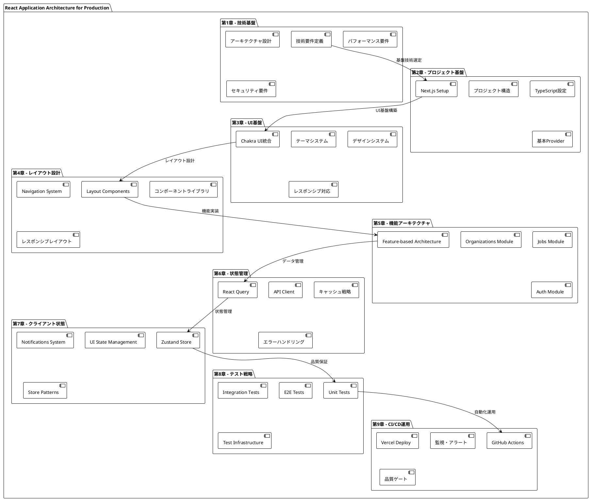

# React Application Architecture for Production - 完全ガイド

## 概要

本ドキュメントは、**React Application Architecture for Production** プロジェクトの包括的なアーキテクチャガイドです。モダンなReactアプリケーションを本格的なプロダクション環境で運用するために必要な、全ての技術的要素と設計パターンを段階的に解説しています。

## アーキテクチャ全体像

## 章別ガイド

### [第1章: 技術要件とアーキテクチャ概要](./chapter-01-technical-requirements.md)

**学習目標**: プロジェクト全体の技術スタック選定とアーキテクチャ設計理念を理解する

**主要トピック**:
- モダンReact技術スタックの選定理由
- スケーラブルなアーキテクチャパターン
- パフォーマンス・セキュリティ要件の定義
- 開発体験とプロダクション運用の両立

**習得スキル**: 
- 技術選定の意思決定プロセス
- アーキテクチャ設計の基本原則
- 非機能要件の定義と実装

---

### [第2章: プロジェクト基盤セットアップ](./chapter-02-project-setup.md)

**学習目標**: Next.js + TypeScriptによる堅牢なプロジェクト基盤を構築する

**主要トピック**:
- Next.js 12.2.5のセットアップと最適化
- TypeScript 4.8.2による型安全性の確保
- プロジェクト構造とPath Aliasの設計
- AppProviderによる基盤コンポーネント

**習得スキル**:
- モダンReactプロジェクトの初期化
- TypeScript設定の最適化
- 拡張性を考慮したディレクトリ構造設計

---

### [第3章: UIライブラリ統合](./chapter-03-ui-integration.md)

**学習目標**: Chakra UIを活用したデザインシステムとテーマ管理を実装する

**主要トピック**:
- Chakra UI 2.3.1の統合とカスタマイズ
- 一貫性のあるテーマシステム設計
- レスポンシブデザインパターン
- アクセシビリティ対応

**習得スキル**:
- UIライブラリの効果的な活用方法
- デザインシステムの構築と管理
- レスポンシブWebデザインの実装

---

### [第4章: レイアウト・コンポーネント設計](./chapter-04-layout-components.md)

**学習目標**: 再利用可能なレイアウトシステムとコンポーネントライブラリを構築する

**主要トピック**:
- DashboardLayoutとPublicLayoutの実装
- ナビゲーションシステムの設計
- 再利用可能コンポーネントパターン
- レスポンシブレイアウト戦略

**習得スキル**:
- レイアウトコンポーネントの設計パターン
- コンポーネント再利用戦略
- ナビゲーション設計の最適化

---

### [第5章: Feature-based Architecture](./chapter-05-features-architecture.md)

**学習目標**: 機能単位でモジュール化されたスケーラブルなアーキテクチャを実装する

**主要トピック**:
- Feature-basedディレクトリ構造
- Jobs機能モジュールの完全実装
- Organizations・Auth機能の設計
- 型定義とコンポーネントパターン

**習得スキル**:
- 大規模アプリケーションの構造設計
- 機能モジュールの独立性確保
- TypeScript型設計のベストプラクティス

---

### [第6章: 状態管理・API統合](./chapter-06-state-management-api.md)

**学習目標**: React Queryによるサーバーサイド状態管理とAPI統合を実装する

**主要トピック**:
- TanStack Query 4.2.3の統合と設定
- APIクライアント設計とHTTPリクエスト管理
- キャッシュ戦略と無効化パターン
- 楽観的更新とエラーハンドリング

**習得スキル**:
- モダンな状態管理パターン
- APIとの効率的な統合方法
- キャッシュ最適化とパフォーマンス向上

---

### [第7章: クライアントサイド状態管理](./chapter-07-client-state-management.md)

**学習目標**: Zustandによるクライアント専用状態管理システムを実装する

**主要トピック**:
- Zustand 4.1.1による軽量状態管理
- 通知システム（Notifications）の実装
- UI状態（サイドバー、テーマ、モーダル）管理
- Store設計パターンとパフォーマンス最適化

**習得スキル**:
- クライアントサイド状態管理の設計
- リアクティブなUI状態の実装
- 状態管理ライブラリの使い分け

---

### [第8章: 包括的テスト戦略](./chapter-08-testing-strategy.md)

**学習目標**: Jest・React Testing Library・Cypressによる多層テスト戦略を実装する

**主要トピック**:
- テストピラミッド（Unit・Integration・E2E）の実装
- MSW（Mock Service Worker）によるAPIモック
- カスタムテストユーティリティの構築
- CI/CDパイプラインでのテスト自動化

**習得スキル**:
- 包括的なテスト設計と実装
- モックとスタブの効果的な活用
- テスト自動化とCI統合

---

### [第9章: CI/CDパイプライン・デプロイメント戦略](./chapter-09-ci-cd-deployment.md)

**学習目標**: GitHub ActionsとVercelによる完全自動化されたCI/CDパイプラインを構築する

**主要トピック**:
- GitHub Actionsによるワークフロー自動化
- 品質ゲート（コード品質・テスト・セキュリティ）
- Vercelデプロイメントと環境管理
- 監視・アラート・ロールバック戦略

**習得スキル**:
- CI/CDパイプラインの設計と実装
- 本番環境運用のベストプラクティス
- DevOpsプロセスと品質保証

---

## 技術スタック一覧

### コア技術
| 技術 | バージョン | 役割 | 章 |
|------|-----------|------|-----|
| **React** | 18.2.0 | UIライブラリ | 全章 |
| **Next.js** | 12.2.5 | フルスタックフレームワーク | 2章〜 |
| **TypeScript** | 4.8.2 | 型安全性 | 全章 |

### UI・デザイン
| 技術 | バージョン | 役割 | 章 |
|------|-----------|------|-----|
| **Chakra UI** | 2.3.1 | UIコンポーネントライブラリ | 3-4章 |
| **Emotion** | 11.10.4 | CSS-in-JS | 3章 |
| **React Icons** | 4.4.0 | アイコンライブラリ | 4章 |

### 状態管理・API
| 技術 | バージョン | 役割 | 章 |
|------|-----------|------|-----|
| **TanStack Query** | 4.2.3 | サーバーサイド状態管理 | 6章 |
| **Zustand** | 4.1.1 | クライアントサイド状態管理 | 7章 |
| **Axios** | 0.27.2 | HTTPクライアント | 6章 |

### 開発・品質保証
| 技術 | バージョン | 役割 | 章 |
|------|-----------|------|-----|
| **Jest** | 28.1.3 | テストランナー | 8章 |
| **React Testing Library** | 13.3.0 | コンポーネントテスト | 8章 |
| **Cypress** | 10.6.0 | E2Eテスト | 8章 |
| **MSW** | 0.47.4 | APIモック | 8章 |
| **ESLint** | 8.22.0 | 静的解析 | 全章 |
| **Prettier** | 2.7.1 | コードフォーマット | 全章 |

### インフラ・デプロイ
| 技術 | バージョン | 役割 | 章 |
|------|-----------|------|-----|
| **Vercel** | - | ホスティングプラットフォーム | 9章 |
| **GitHub Actions** | - | CI/CDパイプライン | 9章 |

## アーキテクチャの特徴

### 🏗️ **Feature-based Architecture**
機能単位でコードを組織化し、大規模アプリケーションでの保守性とスケーラビリティを確保

### 🔄 **状態管理の使い分け**
- **React Query**: サーバーサイド状態（API、キャッシュ）
- **Zustand**: クライアントサイド状態（UI、通知、設定）

### 🧪 **多層テスト戦略**
- **Unit Tests**: 個別コンポーネント・関数
- **Integration Tests**: 機能単位・APIモック
- **E2E Tests**: ユーザーワークフロー

### 🚀 **CI/CD自動化**
- コード品質チェック
- 自動テスト実行
- セキュリティスキャン
- 自動デプロイメント

### 📱 **レスポンシブ・アクセシブル**
- モバイルファーストデザイン
- アクセシビリティ標準準拠
- パフォーマンス最適化

## 学習パス

### 🌟 **初級者向け** (第1-4章)
React・Next.js・TypeScriptの基本的な使い方と、UIライブラリ統合を学習

### 🚀 **中級者向け** (第5-7章)
アーキテクチャ設計、状態管理パターン、複雑な機能実装を学習

### ⚡ **上級者向け** (第8-9章)
テスト戦略、CI/CD、プロダクション運用の高度なトピックを学習

## プロジェクト成果物

### 📋 **実装されている機能**
- **認証システム**: ログイン・ログアウト・セッション管理
- **ジョブ管理**: CRUD操作・検索・フィルタリング
- **組織管理**: 組織情報・所属管理
- **通知システム**: リアルタイム通知・自動消去
- **レスポンシブUI**: デスクトップ・タブレット・モバイル対応

### 🔧 **開発・運用ツール**
- **自動フォーマット**: Prettier + ESLint
- **型チェック**: TypeScript strict mode
- **テスト自動化**: Jest + RTL + Cypress
- **CI/CD**: GitHub Actions + Vercel
- **監視**: パフォーマンス・エラー追跡

### 📚 **ドキュメンテーション**
- アーキテクチャ設計書（本ドキュメント）
- API仕様書
- コンポーネントライブラリ
- デプロイメント手順書

## 次のステップ

このガイドを完了した後、以下の発展的なトピックに進むことができます：

### 🔮 **発展トピック**
- **マイクロフロントエンド**: Module Federation
- **サーバーサイドレンダリング**: ISR・SSG最適化
- **Web APIs**: Service Worker・Web Workers
- **パフォーマンス**: Core Web Vitals最適化
- **セキュリティ**: OWASP対応・セキュリティヘッダー

### 🌐 **エコシステム拡張**
- **ステートマシン**: XState統合
- **フォーム管理**: React Hook Form詳細活用
- **アニメーション**: Framer Motion統合
- **データ可視化**: Chart.js・D3.js統合
- **国際化**: next-i18next実装

### 📈 **スケーリング**
- **モノレポ**: Nx・Lerna導入
- **コンポーネントライブラリ**: Storybook・デザインシステム
- **バックエンド統合**: GraphQL・tRPC
- **リアルタイム機能**: WebSocket・Server-Sent Events

---

## 貢献とフィードバック

このドキュメントは継続的に改善されています。質問、提案、改善点がありましたら、GitHubのIssuesまたはPull Requestでお知らせください。

**Happy Coding! 🚀**
