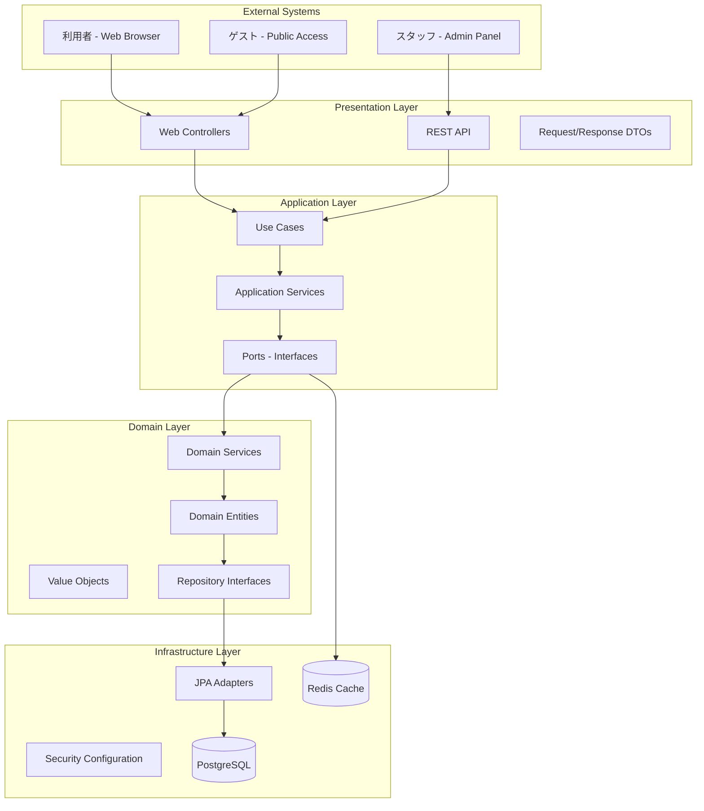
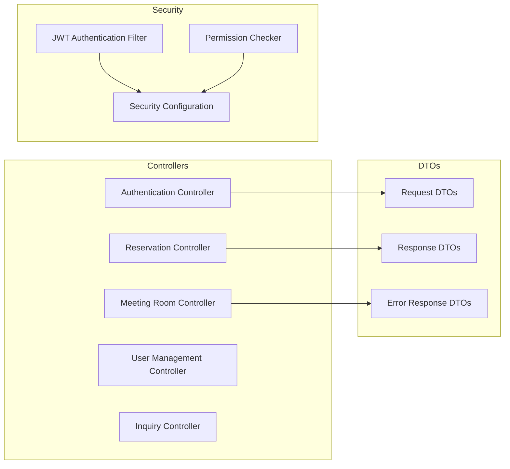
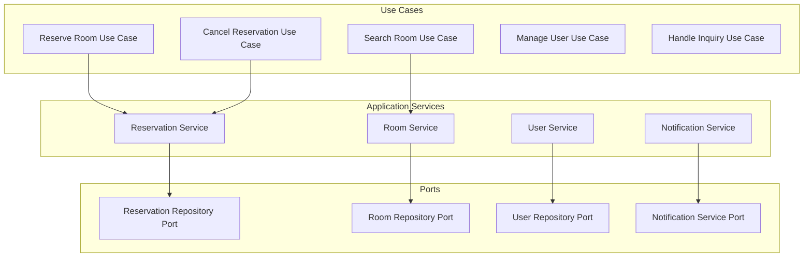
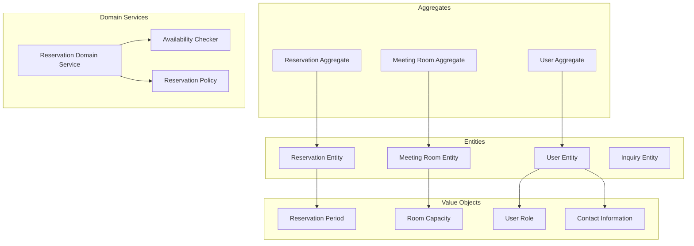
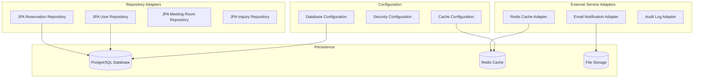
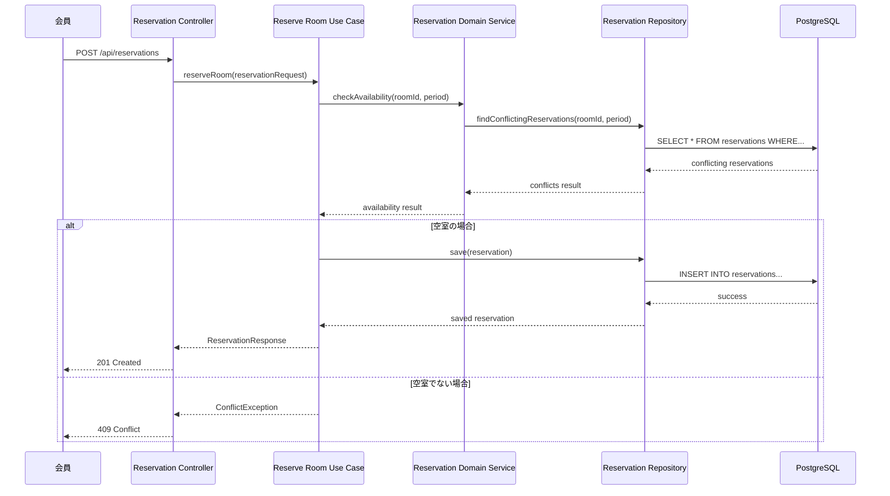
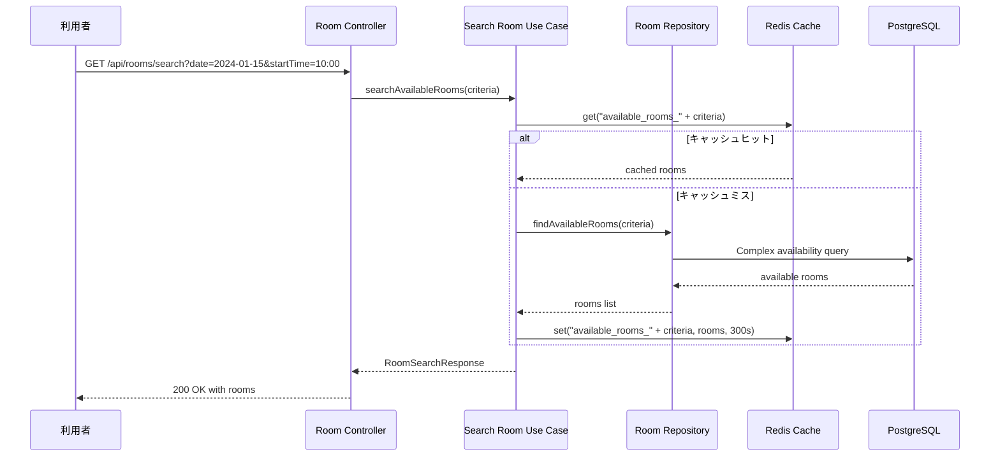
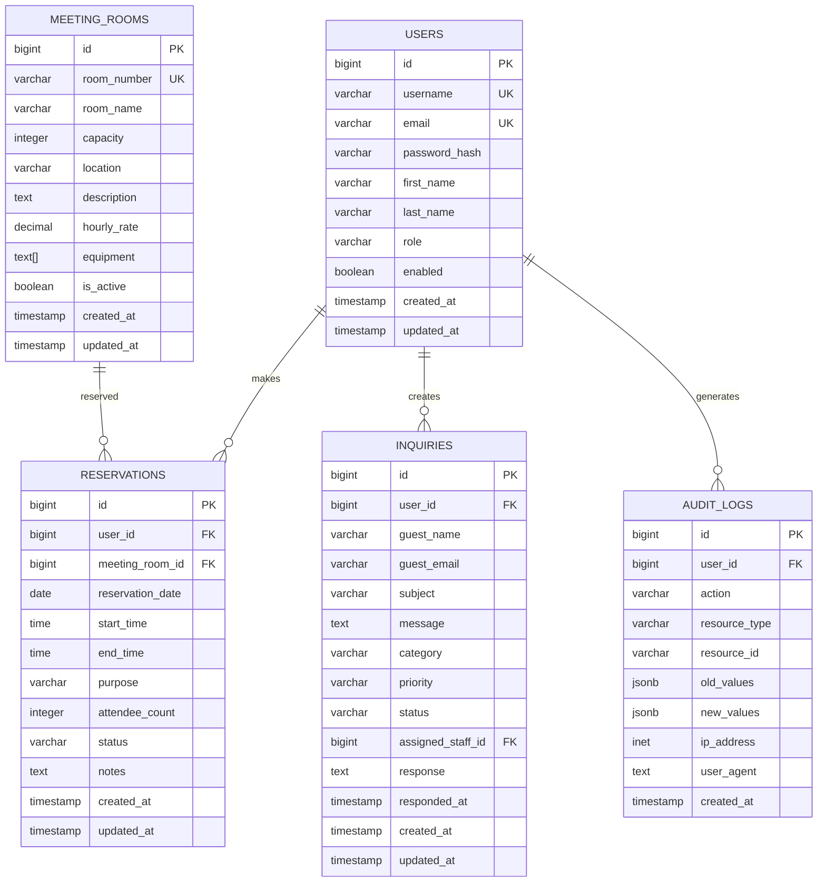
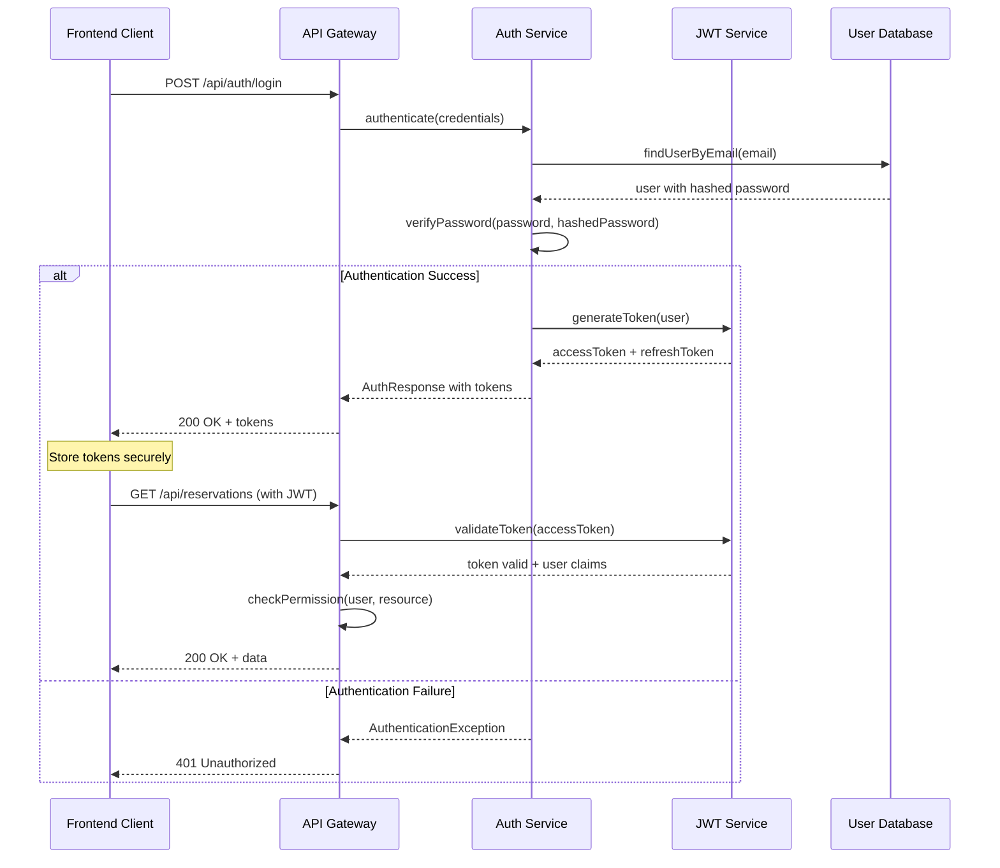
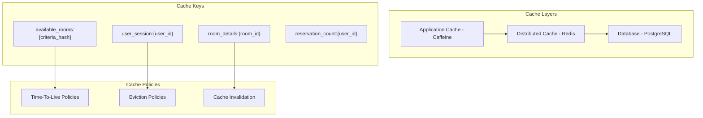

# Meeting Room Reservation System - 設計仕様書

## システム設計概要

本設計仕様書は、会議室予約システムの詳細設計を定義します。ヘキサゴナルアーキテクチャ（ポートとアダプター）を採用し、Clean Architecture の原則に従って設計されています。

### 設計原則
- **単一責任の原則**: 各クラスは一つの責任のみを持つ
- **開放閉鎖の原則**: 拡張に開放、修正に閉鎖
- **依存関係逆転の原則**: 抽象に依存し、実装に依存しない
- **関心の分離**: ビジネスロジックと技術的詳細を分離

## アーキテクチャ設計

### 1. システム全体アーキテクチャ



### 2. レイヤー別詳細設計

#### 2.1 Presentation Layer（プレゼンテーション層）



#### 2.2 Application Layer（アプリケーション層）



#### 2.3 Domain Layer（ドメイン層）



#### 2.4 Infrastructure Layer（インフラストラクチャ層）



### 3. データフロー設計

#### 3.1 予約作成フロー



#### 3.2 会議室検索フロー



## 詳細設計

### 1. Java インターフェース設計

#### 1.1 Domain Entities

```java
// 予約集約ルート
@Entity
@Table(name = "reservations")
public class Reservation {
    @Id
    @GeneratedValue(strategy = GenerationType.IDENTITY)
    private Long id;
    
    @ManyToOne(fetch = FetchType.LAZY)
    @JoinColumn(name = "user_id", nullable = false)
    private User user;
    
    @ManyToOne(fetch = FetchType.LAZY)
    @JoinColumn(name = "meeting_room_id", nullable = false)
    private MeetingRoom meetingRoom;
    
    @Embedded
    private ReservationPeriod period;
    
    @Enumerated(EnumType.STRING)
    private ReservationStatus status;
    
    private String purpose;
    private Integer attendeeCount;
    private String notes;
    
    // ドメインメソッド
    public void cancel(LocalDateTime cancelTime) {
        if (!canBeCancelled(cancelTime)) {
            throw new ReservationCannotBeCancelledException(
                "予約開始2時間前以降はキャンセルできません"
            );
        }
        this.status = ReservationStatus.CANCELLED;
    }
    
    public boolean canBeCancelled(LocalDateTime currentTime) {
        return currentTime.isBefore(
            period.getStartDateTime().minusHours(2)
        );
    }
    
    public boolean isConflictingWith(ReservationPeriod otherPeriod) {
        return period.isOverlapping(otherPeriod);
    }
}

// 値オブジェクト
@Embeddable
public class ReservationPeriod {
    @Column(name = "reservation_date")
    private LocalDate reservationDate;
    
    @Column(name = "start_time")
    private LocalTime startTime;
    
    @Column(name = "end_time")
    private LocalTime endTime;
    
    public ReservationPeriod(LocalDate date, LocalTime startTime, LocalTime endTime) {
        validateBusinessHours(startTime, endTime);
        validateMaxDuration(startTime, endTime);
        this.reservationDate = date;
        this.startTime = startTime;
        this.endTime = endTime;
    }
    
    public boolean isOverlapping(ReservationPeriod other) {
        if (!this.reservationDate.equals(other.reservationDate)) {
            return false;
        }
        return startTime.isBefore(other.endTime) && endTime.isAfter(other.startTime);
    }
    
    public LocalDateTime getStartDateTime() {
        return LocalDateTime.of(reservationDate, startTime);
    }
    
    public LocalDateTime getEndDateTime() {
        return LocalDateTime.of(reservationDate, endTime);
    }
    
    private void validateBusinessHours(LocalTime start, LocalTime end) {
        LocalTime businessStart = LocalTime.of(9, 0);
        LocalTime businessEnd = LocalTime.of(22, 0);
        
        if (start.isBefore(businessStart) || end.isAfter(businessEnd)) {
            throw new IllegalArgumentException("営業時間外の予約はできません（9:00-22:00）");
        }
    }
    
    private void validateMaxDuration(LocalTime start, LocalTime end) {
        Duration duration = Duration.between(start, end);
        if (duration.toHours() > 6) {
            throw new IllegalArgumentException("連続予約時間は6時間までです");
        }
    }
}
```

#### 1.2 Repository Interfaces (Ports)

```java
// ドメイン層のリポジトリインターフェース
@Repository
public interface ReservationRepository {
    
    Optional<Reservation> findById(Long id);
    
    List<Reservation> findConflictingReservations(
        Long roomId, 
        ReservationPeriod period
    );
    
    List<Reservation> findByUserAndStatus(
        Long userId, 
        ReservationStatus status
    );
    
    List<Reservation> findByRoomAndDateRange(
        Long roomId,
        LocalDate startDate,
        LocalDate endDate
    );
    
    Reservation save(Reservation reservation);
    
    void delete(Reservation reservation);
    
    // 集計クエリ
    Long countActiveReservationsByUser(Long userId);
    
    List<ReservationStatistics> getRoomUtilizationStats(
        LocalDate startDate, 
        LocalDate endDate
    );
}

@Repository
public interface MeetingRoomRepository {
    
    Optional<MeetingRoom> findById(Long id);
    
    List<MeetingRoom> findAll();
    
    List<MeetingRoom> findAvailableRooms(RoomSearchCriteria criteria);
    
    List<MeetingRoom> findByCapacityGreaterThanEqual(Integer minCapacity);
    
    List<MeetingRoom> findByEquipmentContaining(String equipment);
    
    MeetingRoom save(MeetingRoom meetingRoom);
    
    void delete(MeetingRoom meetingRoom);
}
```

#### 1.3 Use Cases (Application Services)

```java
@Service
@Transactional
public class ReserveRoomUseCase {
    
    private final ReservationRepository reservationRepository;
    private final MeetingRoomRepository meetingRoomRepository;
    private final UserRepository userRepository;
    private final ReservationDomainService reservationDomainService;
    private final NotificationPort notificationPort;
    
    public ReserveRoomUseCase(
            ReservationRepository reservationRepository,
            MeetingRoomRepository meetingRoomRepository,
            UserRepository userRepository,
            ReservationDomainService reservationDomainService,
            NotificationPort notificationPort) {
        this.reservationRepository = reservationRepository;
        this.meetingRoomRepository = meetingRoomRepository;
        this.userRepository = userRepository;
        this.reservationDomainService = reservationDomainService;
        this.notificationPort = notificationPort;
    }
    
    public ReservationResponse reserveRoom(ReservationRequest request) {
        // 1. エンティティの取得と検証
        User user = userRepository.findById(request.getUserId())
            .orElseThrow(() -> new UserNotFoundException("ユーザーが見つかりません"));
            
        MeetingRoom room = meetingRoomRepository.findById(request.getRoomId())
            .orElseThrow(() -> new MeetingRoomNotFoundException("会議室が見つかりません"));
            
        // 2. 予約期間の作成と検証
        ReservationPeriod period = new ReservationPeriod(
            request.getReservationDate(),
            request.getStartTime(),
            request.getEndTime()
        );
        
        // 3. ドメインサービスによる可用性チェック
        if (!reservationDomainService.isRoomAvailable(room.getId(), period)) {
            throw new RoomNotAvailableException("指定された時間帯は予約済みです");
        }
        
        // 4. ビジネスルールのチェック
        reservationDomainService.validateReservationConstraints(user, room, request);
        
        // 5. 予約エンティティの作成
        Reservation reservation = new Reservation(
            user,
            room,
            period,
            request.getPurpose(),
            request.getAttendeeCount(),
            request.getNotes()
        );
        
        // 6. 予約の保存
        Reservation savedReservation = reservationRepository.save(reservation);
        
        // 7. 通知の送信
        notificationPort.sendReservationConfirmation(savedReservation);
        
        return ReservationResponse.from(savedReservation);
    }
}

@Service
public class SearchAvailableRoomsUseCase {
    
    private final MeetingRoomRepository meetingRoomRepository;
    private final CachePort cachePort;
    
    public SearchAvailableRoomsUseCase(
            MeetingRoomRepository meetingRoomRepository,
            CachePort cachePort) {
        this.meetingRoomRepository = meetingRoomRepository;
        this.cachePort = cachePort;
    }
    
    @Cacheable(value = "available-rooms", key = "#criteria")
    public RoomSearchResponse searchAvailableRooms(RoomSearchCriteria criteria) {
        // 1. キャッシュチェック（Springアノテーションで自動処理）
        
        // 2. 検索条件の検証
        criteria.validate();
        
        // 3. 利用可能な会議室の検索
        List<MeetingRoom> availableRooms = 
            meetingRoomRepository.findAvailableRooms(criteria);
        
        // 4. 料金計算
        List<RoomWithPrice> roomsWithPrice = availableRooms.stream()
            .map(room -> calculatePriceForRoom(room, criteria))
            .collect(Collectors.toList());
        
        return new RoomSearchResponse(roomsWithPrice, criteria);
    }
    
    private RoomWithPrice calculatePriceForRoom(MeetingRoom room, RoomSearchCriteria criteria) {
        Duration duration = Duration.between(
            criteria.getStartTime(), 
            criteria.getEndTime()
        );
        BigDecimal totalPrice = room.getHourlyRate()
            .multiply(BigDecimal.valueOf(duration.toHours()));
            
        return new RoomWithPrice(room, totalPrice);
    }
}
```

#### 1.4 Domain Services

```java
@Service
public class ReservationDomainService {
    
    private final ReservationRepository reservationRepository;
    
    public ReservationDomainService(ReservationRepository reservationRepository) {
        this.reservationRepository = reservationRepository;
    }
    
    public boolean isRoomAvailable(Long roomId, ReservationPeriod period) {
        List<Reservation> conflictingReservations = 
            reservationRepository.findConflictingReservations(roomId, period);
            
        return conflictingReservations.isEmpty();
    }
    
    public void validateReservationConstraints(
            User user, 
            MeetingRoom room, 
            ReservationRequest request) {
        
        // 定員チェック
        if (request.getAttendeeCount() > room.getCapacity()) {
            throw new ExceedsRoomCapacityException(
                String.format("参加者数(%d)が会議室の定員(%d)を超えています", 
                    request.getAttendeeCount(), room.getCapacity())
            );
        }
        
        // ユーザーの同時予約数チェック
        Long activeReservations = 
            reservationRepository.countActiveReservationsByUser(user.getId());
        if (activeReservations >= 3) {
            throw new ExceedsMaxReservationsException(
                "同時に予約可能な件数は3件までです"
            );
        }
        
        // 予約期限チェック（当日2時間前まで）
        LocalDateTime reservationDeadline = LocalDateTime.of(
            request.getReservationDate(),
            request.getStartTime()
        ).minusHours(2);
        
        if (LocalDateTime.now().isAfter(reservationDeadline)) {
            throw new ReservationDeadlineExceededException(
                "予約は利用開始2時間前まで可能です"
            );
        }
    }
    
    public ReservationStatistics calculateReservationStatistics(
            LocalDate startDate, 
            LocalDate endDate) {
        
        List<ReservationStatistics> stats = 
            reservationRepository.getRoomUtilizationStats(startDate, endDate);
            
        return ReservationStatistics.aggregate(stats);
    }
}
```

### 2. TypeScript インターフェース設計（フロントエンド）

#### 2.1 Domain Models

```typescript
// ドメインエンティティ
export interface Reservation {
  readonly id: number;
  readonly userId: number;
  readonly meetingRoomId: number;
  readonly reservationDate: string; // ISO date format
  readonly startTime: string; // HH:mm format
  readonly endTime: string; // HH:mm format
  readonly purpose: string;
  readonly attendeeCount: number;
  readonly status: ReservationStatus;
  readonly notes?: string;
  readonly createdAt: string;
  readonly updatedAt: string;
}

export type ReservationStatus = 'CONFIRMED' | 'CANCELLED';

export interface MeetingRoom {
  readonly id: number;
  readonly roomNumber: string;
  readonly roomName: string;
  readonly capacity: number;
  readonly location: string;
  readonly description?: string;
  readonly hourlyRate: number;
  readonly equipment: string[];
  readonly isActive: boolean;
}

export interface User {
  readonly id: number;
  readonly username: string;
  readonly email: string;
  readonly firstName: string;
  readonly lastName: string;
  readonly role: UserRole;
  readonly enabled: boolean;
}

export type UserRole = 'ADMIN' | 'STAFF' | 'MEMBER';

// 値オブジェクト
export interface ReservationPeriod {
  readonly reservationDate: string;
  readonly startTime: string;
  readonly endTime: string;
}

export interface RoomSearchCriteria {
  readonly reservationDate: string;
  readonly startTime: string;
  readonly endTime: string;
  readonly minCapacity?: number;
  readonly equipment?: string[];
  readonly location?: string;
}
```

#### 2.2 API Request/Response Types

```typescript
// リクエストタイプ
export interface CreateReservationRequest {
  readonly roomId: number;
  readonly reservationDate: string;
  readonly startTime: string;
  readonly endTime: string;
  readonly purpose: string;
  readonly attendeeCount: number;
  readonly notes?: string;
}

export interface UpdateReservationRequest {
  readonly endTime: string; // 短縮のみ可能
  readonly purpose?: string;
  readonly notes?: string;
}

export interface RoomSearchRequest {
  readonly reservationDate: string;
  readonly startTime: string;
  readonly endTime: string;
  readonly minCapacity?: number;
  readonly equipment?: string[];
}

// レスポンスタイプ
export interface ReservationResponse {
  readonly reservation: Reservation;
  readonly meetingRoom: MeetingRoom;
  readonly totalPrice: number;
}

export interface RoomSearchResponse {
  readonly rooms: RoomWithAvailability[];
  readonly searchCriteria: RoomSearchCriteria;
}

export interface RoomWithAvailability {
  readonly room: MeetingRoom;
  readonly isAvailable: boolean;
  readonly totalPrice: number;
  readonly conflictingReservations: Reservation[];
}

// エラーレスポンス
export interface ApiError {
  readonly code: string;
  readonly message: string;
  readonly details?: Record<string, unknown>;
  readonly timestamp: string;
}
```

#### 2.3 React Component Props

```typescript
// コンポーネントプロップス
export interface ReservationFormProps {
  readonly initialValues?: Partial<CreateReservationRequest>;
  readonly availableRooms: MeetingRoom[];
  readonly onSubmit: (request: CreateReservationRequest) => Promise<void>;
  readonly onCancel: () => void;
  readonly loading?: boolean;
}

export interface RoomSearchFormProps {
  readonly onSearch: (criteria: RoomSearchCriteria) => Promise<void>;
  readonly loading?: boolean;
}

export interface ReservationListProps {
  readonly reservations: Reservation[];
  readonly rooms: MeetingRoom[];
  readonly onCancelReservation: (reservationId: number) => Promise<void>;
  readonly onEditReservation: (reservationId: number) => void;
}

export interface RoomCardProps {
  readonly room: MeetingRoom;
  readonly availability: boolean;
  readonly totalPrice: number;
  readonly onSelect: (roomId: number) => void;
  readonly selected?: boolean;
}
```

#### 2.4 State Management (Redux)

```typescript
// Redux State
export interface AppState {
  readonly auth: AuthState;
  readonly reservations: ReservationState;
  readonly rooms: RoomState;
  readonly ui: UiState;
}

export interface AuthState {
  readonly user: User | null;
  readonly token: string | null;
  readonly isAuthenticated: boolean;
  readonly loading: boolean;
  readonly error: string | null;
}

export interface ReservationState {
  readonly reservations: Reservation[];
  readonly currentReservation: Reservation | null;
  readonly searchResults: RoomSearchResponse | null;
  readonly loading: boolean;
  readonly error: string | null;
}

export interface RoomState {
  readonly rooms: MeetingRoom[];
  readonly selectedRoom: MeetingRoom | null;
  readonly searchCriteria: RoomSearchCriteria | null;
  readonly loading: boolean;
  readonly error: string | null;
}

// Redux Actions
export type ReservationAction =
  | { type: 'RESERVATION_CREATE_START' }
  | { type: 'RESERVATION_CREATE_SUCCESS'; payload: Reservation }
  | { type: 'RESERVATION_CREATE_FAILURE'; payload: string }
  | { type: 'RESERVATION_CANCEL_START' }
  | { type: 'RESERVATION_CANCEL_SUCCESS'; payload: number }
  | { type: 'RESERVATION_CANCEL_FAILURE'; payload: string }
  | { type: 'ROOM_SEARCH_START' }
  | { type: 'ROOM_SEARCH_SUCCESS'; payload: RoomSearchResponse }
  | { type: 'ROOM_SEARCH_FAILURE'; payload: string };
```

### 3. データベース設計

#### 3.1 物理データモデル



#### 3.2 インデックス戦略

```sql
-- パフォーマンス重要クエリのインデックス
CREATE INDEX idx_reservations_room_date_time 
    ON reservations(meeting_room_id, reservation_date, start_time, end_time);

CREATE INDEX idx_reservations_user_status 
    ON reservations(user_id, status);

CREATE INDEX idx_reservations_date_range 
    ON reservations(reservation_date);

-- 複合ユニークインデックス（重複予約防止）
CREATE UNIQUE INDEX idx_reservations_room_time_unique 
    ON reservations(meeting_room_id, reservation_date, start_time, end_time)
    WHERE status IN ('CONFIRMED', 'PENDING');

-- 検索用インデックス
CREATE INDEX idx_meeting_rooms_capacity 
    ON meeting_rooms(capacity) WHERE is_active = true;

CREATE INDEX idx_meeting_rooms_equipment_gin 
    ON meeting_rooms USING GIN(equipment);

-- 監査ログ用パーティションインデックス
CREATE INDEX idx_audit_logs_created_at_monthly 
    ON audit_logs USING BTREE (date_trunc('month', created_at));
```

### 4. セキュリティ設計

#### 4.1 認証・認可設計



#### 4.2 Spring Security 設定

```java
@Configuration
@EnableWebSecurity
@EnableGlobalMethodSecurity(prePostEnabled = true)
public class SecurityConfiguration {

    @Bean
    public SecurityFilterChain filterChain(HttpSecurity http) throws Exception {
        http
            .csrf(csrf -> csrf.disable())
            .sessionManagement(session -> 
                session.sessionCreationPolicy(SessionCreationPolicy.STATELESS))
            .authorizeHttpRequests(authz -> authz
                .requestMatchers("/api/auth/**").permitAll()
                .requestMatchers("/api/public/**").permitAll()
                .requestMatchers(HttpMethod.GET, "/api/rooms/search").hasAnyRole("MEMBER", "STAFF", "ADMIN")
                .requestMatchers(HttpMethod.POST, "/api/reservations").hasAnyRole("MEMBER", "STAFF")
                .requestMatchers("/api/admin/**").hasRole("ADMIN")
                .requestMatchers("/api/staff/**").hasAnyRole("STAFF", "ADMIN")
                .anyRequest().authenticated()
            )
            .addFilterBefore(jwtAuthenticationFilter(), 
                UsernamePasswordAuthenticationFilter.class)
            .exceptionHandling(exceptions -> exceptions
                .authenticationEntryPoint(customAuthenticationEntryPoint())
                .accessDeniedHandler(customAccessDeniedHandler())
            );

        return http.build();
    }

    @Bean
    public JwtAuthenticationFilter jwtAuthenticationFilter() {
        return new JwtAuthenticationFilter();
    }

    @Bean
    public PasswordEncoder passwordEncoder() {
        return new BCryptPasswordEncoder(12);
    }
}
```

### 5. キャッシュ戦略

#### 5.1 Redis キャッシュ設計



#### 5.2 キャッシュ設定

```java
@Configuration
@EnableCaching
public class CacheConfiguration {

    @Bean
    public CacheManager cacheManager(RedisConnectionFactory connectionFactory) {
        RedisCacheConfiguration config = RedisCacheConfiguration.defaultCacheConfig()
            .entryTtl(Duration.ofMinutes(10))
            .serializeKeysWith(RedisSerializationContext.SerializationPair
                .fromSerializer(new StringRedisSerializer()))
            .serializeValuesWith(RedisSerializationContext.SerializationPair
                .fromSerializer(new GenericJackson2JsonRedisSerializer()));

        return RedisCacheManager.builder(connectionFactory)
            .cacheDefaults(config)
            .withCacheConfiguration("available-rooms", config.entryTtl(Duration.ofMinutes(5)))
            .withCacheConfiguration("room-details", config.entryTtl(Duration.ofHours(1)))
            .withCacheConfiguration("user-sessions", config.entryTtl(Duration.ofHours(2)))
            .build();
    }
}
```

### 6. 監視・メトリクス設計

#### 6.1 Application Metrics

```java
@Component
public class ReservationMetrics {

    private final Counter reservationCounter;
    private final Timer reservationProcessingTime;
    private final Gauge activeReservations;

    public ReservationMetrics(MeterRegistry meterRegistry) {
        this.reservationCounter = Counter.builder("reservations.created")
            .tag("status", "success")
            .register(meterRegistry);

        this.reservationProcessingTime = Timer.builder("reservations.processing.time")
            .register(meterRegistry);

        this.activeReservations = Gauge.builder("reservations.active")
            .register(meterRegistry, this, ReservationMetrics::getActiveReservationCount);
    }

    public void recordReservationCreated() {
        reservationCounter.increment();
    }

    public Timer.Sample startReservationTimer() {
        return Timer.start(reservationProcessingTime);
    }

    private double getActiveReservationCount() {
        // 実際の実装では Repository から取得
        return 0.0;
    }
}
```

### 7. エラーハンドリング設計

#### 7.1 例外階層

```java
// ベース例外
public abstract class BusinessException extends RuntimeException {
    private final String errorCode;
    
    protected BusinessException(String errorCode, String message) {
        super(message);
        this.errorCode = errorCode;
    }
    
    public String getErrorCode() {
        return errorCode;
    }
}

// ドメイン固有例外
public class ReservationException extends BusinessException {
    public ReservationException(String errorCode, String message) {
        super(errorCode, message);
    }
}

public class RoomNotAvailableException extends ReservationException {
    public RoomNotAvailableException(String message) {
        super("ROOM_NOT_AVAILABLE", message);
    }
}

public class ReservationCannotBeCancelledException extends ReservationException {
    public ReservationCannotBeCancelledException(String message) {
        super("RESERVATION_CANNOT_BE_CANCELLED", message);
    }
}

// グローバル例外ハンドラー
@RestControllerAdvice
public class GlobalExceptionHandler {

    @ExceptionHandler(BusinessException.class)
    public ResponseEntity<ErrorResponse> handleBusinessException(BusinessException e) {
        ErrorResponse error = new ErrorResponse(
            e.getErrorCode(),
            e.getMessage(),
            LocalDateTime.now()
        );
        return ResponseEntity.badRequest().body(error);
    }

    @ExceptionHandler(ValidationException.class)
    public ResponseEntity<ErrorResponse> handleValidationException(ValidationException e) {
        ErrorResponse error = new ErrorResponse(
            "VALIDATION_ERROR",
            e.getMessage(),
            LocalDateTime.now()
        );
        return ResponseEntity.badRequest().body(error);
    }
}
```

## 性能設計

### 1. データベース最適化

- **接続プール**: HikariCP（最大20接続）
- **クエリ最適化**: インデックス活用、N+1問題回避
- **読み取り専用レプリカ**: 検索クエリの負荷分散
- **パーティショニング**: 監査ログの月次パーティション

### 2. アプリケーション最適化

- **非同期処理**: 通知送信、ログ記録
- **バッチ処理**: 期限切れ予約の自動削除
- **コネクションプール**: データベース、Redis接続の最適化
- **JVM調整**: G1GC、ヒープサイズ最適化

### 3. フロントエンド最適化

- **コード分割**: React.lazy による動的インポート
- **バンドル最適化**: Tree shaking、圧縮
- **キャッシュ戦略**: Service Worker、CDN活用
- **レンダリング最適化**: Virtual scrolling、memoization

この設計仕様書により、会議室予約システムの詳細な実装指針が確立されました。各層の責務分離、型安全性、性能最適化、セキュリティ考慮が組み込まれた設計となっています。