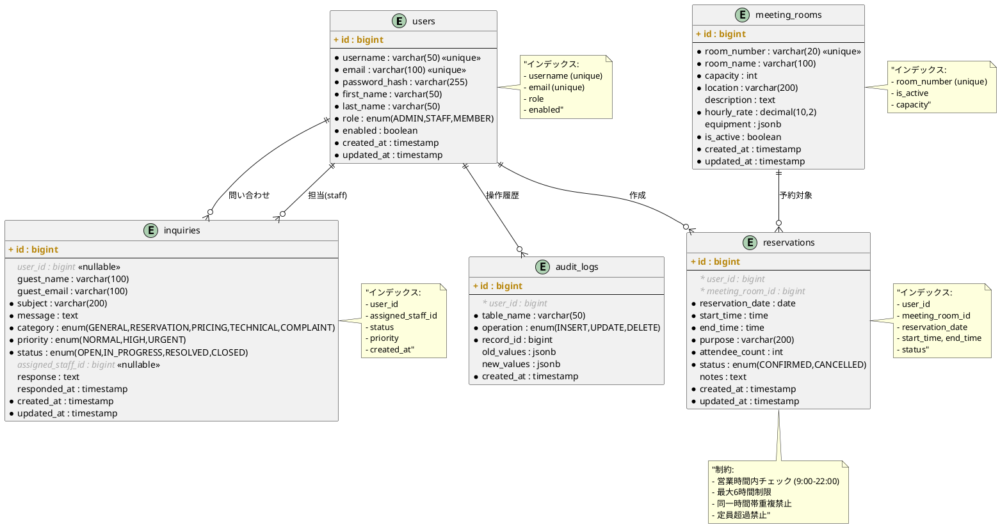
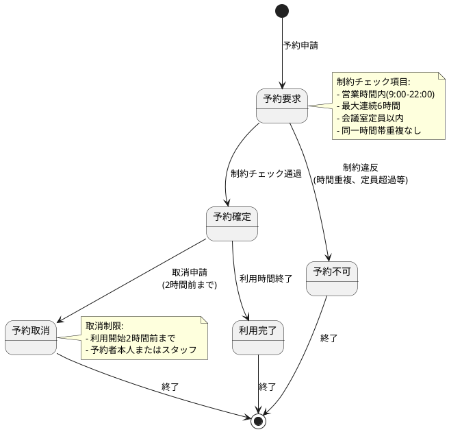
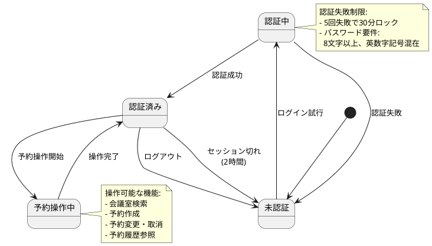
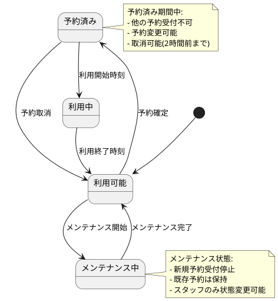
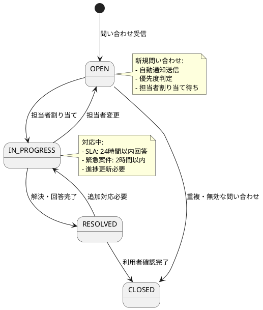

# Meeting Room Reservation System - 要件定義

## システム概要

会議室予約システムは、Web ベースの会議室予約管理システムです。有料会員が会議室を検索・予約し、窓口スタッフが予約・利用者・会議室を管理できるシステムを提供します。

### システムの目的

- 会員による会議室のセルフ予約・管理
- 窓口スタッフによる効率的な予約・利用者管理
- 会議室の稼働率向上と運営効率化
- ゲストからの問い合わせ対応の効率化

### ユースケース図

```plantuml
@startuml Meeting Room Reservation System - ユースケース図
left to right direction

' アクター定義
actor "ゲスト" as Guest
actor "会員" as Member
actor "スタッフ" as Staff
actor "管理者" as Admin

' システム境界
rectangle "会議室予約システム" {
  
  ' 認証関連
  package "認証・ユーザー管理" {
    usecase "ログイン" as UC01
    usecase "ログアウト" as UC02
    usecase "パスワード変更" as UC03
  }
  
  ' 会議室管理
  package "会議室管理" {
    usecase "会議室検索" as UC11
    usecase "会議室詳細確認" as UC12
    usecase "会議室登録" as UC13
    usecase "会議室情報更新" as UC14
    usecase "会議室削除" as UC15
  }
  
  ' 予約管理
  package "予約管理" {
    usecase "予約作成" as UC21
    usecase "予約変更" as UC22
    usecase "予約取消" as UC23
    usecase "予約一覧確認" as UC24
    usecase "予約履歴確認" as UC25
    usecase "予約ステータス管理" as UC26
  }
  
  ' 会員管理
  package "会員管理" {
    usecase "会員登録" as UC31
    usecase "会員情報更新" as UC32
    usecase "会員削除" as UC33
    usecase "会員一覧確認" as UC34
  }
  
  ' 問い合わせ管理
  package "問い合わせ管理" {
    usecase "問い合わせ送信" as UC41
    usecase "問い合わせ受付" as UC42
    usecase "問い合わせ対応" as UC43
    usecase "問い合わせ履歴確認" as UC44
  }
  
  ' レポート・分析
  package "レポート・分析" {
    usecase "予約統計確認" as UC51
    usecase "稼働率分析" as UC52
    usecase "収益レポート" as UC53
  }
  
  ' システム管理
  package "システム管理" {
    usecase "ユーザー権限管理" as UC61
    usecase "システム設定" as UC62
    usecase "監査ログ確認" as UC63
  }
}

' アクターとユースケースの関連
' ゲスト
Guest --> UC41 : 問い合わせ

' 会員
Member --> UC01 : ログイン
Member --> UC02 : ログアウト
Member --> UC03 : パスワード変更
Member --> UC11 : 会議室検索
Member --> UC12 : 会議室詳細確認
Member --> UC21 : 予約作成
Member --> UC22 : 予約変更
Member --> UC23 : 予約取消
Member --> UC24 : 予約一覧確認
Member --> UC25 : 予約履歴確認
Member --> UC41 : 問い合わせ送信

' スタッフ
Staff --> UC01 : ログイン
Staff --> UC02 : ログアウト
Staff --> UC03 : パスワード変更
Staff --> UC11 : 会議室検索
Staff --> UC12 : 会議室詳細確認
Staff --> UC13 : 会議室登録
Staff --> UC14 : 会議室情報更新
Staff --> UC21 : 予約作成
Staff --> UC22 : 予約変更
Staff --> UC23 : 予約取消
Staff --> UC24 : 予約一覧確認
Staff --> UC25 : 予約履歴確認
Staff --> UC26 : 予約ステータス管理
Staff --> UC31 : 会員登録
Staff --> UC32 : 会員情報更新
Staff --> UC34 : 会員一覧確認
Staff --> UC42 : 問い合わせ受付
Staff --> UC43 : 問い合わせ対応
Staff --> UC44 : 問い合わせ履歴確認
Staff --> UC51 : 予約統計確認
Staff --> UC52 : 稼働率分析

' 管理者
Admin --> UC01 : ログイン
Admin --> UC02 : ログアウト
Admin --> UC03 : パスワード変更
Admin --> UC11 : 会議室検索
Admin --> UC12 : 会議室詳細確認
Admin --> UC13 : 会議室登録
Admin --> UC14 : 会議室情報更新
Admin --> UC15 : 会議室削除
Admin --> UC21 : 予約作成
Admin --> UC22 : 予約変更
Admin --> UC23 : 予約取消
Admin --> UC24 : 予約一覧確認
Admin --> UC25 : 予約履歴確認
Admin --> UC26 : 予約ステータス管理
Admin --> UC31 : 会員登録
Admin --> UC32 : 会員情報更新
Admin --> UC33 : 会員削除
Admin --> UC34 : 会員一覧確認
Admin --> UC42 : 問い合わせ受付
Admin --> UC43 : 問い合わせ対応
Admin --> UC44 : 問い合わせ履歴確認
Admin --> UC51 : 予約統計確認
Admin --> UC52 : 稼働率分析
Admin --> UC53 : 収益レポート
Admin --> UC61 : ユーザー権限管理
Admin --> UC62 : システム設定
Admin --> UC63 : 監査ログ確認

' 拡張関係
UC21 ..> UC11 : <<extend>> "会議室検索後"
UC22 ..> UC24 : <<extend>> "予約確認後"
UC23 ..> UC24 : <<extend>> "予約確認後"
UC43 ..> UC42 : <<extend>> "問い合わせ受付後"

' 包含関係
UC21 ..> UC01 : <<include>> "認証必須"
UC22 ..> UC01 : <<include>> "認証必須"
UC23 ..> UC01 : <<include>> "認証必須"
UC24 ..> UC01 : <<include>> "認証必須"
UC25 ..> UC01 : <<include>> "認証必須"

note right of Guest : "認証不要\n問い合わせのみ可能"
note right of Member : "有料会員\n予約機能利用可能"
note right of Staff : "窓口スタッフ\n会員・予約管理可能"
note right of Admin : "システム管理者\nすべての機能利用可能"
@enduml
```

### 主要ユースケース概要

#### 会員向け機能
- **会議室検索・予約**: 日時、定員、設備による検索と予約作成
- **予約管理**: 自分の予約の確認、変更、取消
- **問い合わせ**: システム利用に関する問い合わせ送信

#### スタッフ向け機能
- **会議室管理**: 会議室の登録、更新、稼働状況管理
- **会員管理**: 会員の登録、情報更新、利用状況確認
- **予約管理**: 全予約の確認、代理予約、ステータス管理
- **問い合わせ対応**: 問い合わせの受付、回答、進捗管理

#### 管理者向け機能
- **システム管理**: ユーザー権限、システム設定の管理
- **レポート機能**: 予約統計、稼働率分析、収益レポート
- **監査機能**: 操作ログの確認、セキュリティ監視

## 機能要件

### 1. 利用者管理

#### 1.1 利用者認証
- **機能**: 会員・スタッフの認証とセッション管理
- **認証方式**: JWT + セッション管理
- **対象ユーザー**: 会員、スタッフ

**詳細仕様**:
- ログイン：メールアドレス + パスワード
- セッション時間：2時間（自動延長あり）
- パスワード要件：8文字以上、英数字記号混在
- ログイン失敗時：5回で30分アカウントロック
- セキュリティ：CSRF対策、XSS対策実装

#### 1.2 会員管理
- **機能**: スタッフによる会員情報の CRUD 操作
- **対象**: 会員アカウントの登録・更新・削除・確認

**詳細仕様**:
- 会員登録：窓口での手動登録（スタッフ操作）
- 会員情報：氏名、メール、電話番号、所属組織
- 権限管理：会員・スタッフ・管理者の3段階
- 状態管理：有効・無効・停止

### 2. 会議室管理

#### 2.1 会議室登録
- **機能**: スタッフによる会議室情報の管理
- **対象**: 会議室の基本情報・設備情報・利用料金

**詳細仕様**:
- 会議室情報：会議室番号、名称、定員、場所、説明
- 設備情報：プロジェクター、ホワイトボード、音響設備等
- 料金設定：時間単価の設定（円/時間）
- 利用状態：利用可能・メンテナンス中・利用不可

#### 2.2 会議室検索
- **機能**: 利用可能な会議室の検索・一覧表示
- **対象ユーザー**: 会員、スタッフ

**検索条件**:
- 日時：予約希望日・開始時間・終了時間
- 定員：最低収容人数
- 設備：必要設備での絞り込み
- 場所：フロア・エリアでの絞り込み

### 3. 予約管理

#### 3.1 会議室予約
- **機能**: 会議室の予約作成・確定
- **対象ユーザー**: 会員、スタッフ

**予約制限**:
- 予約可能時間：平日 9:00-22:00
- 最大連続予約：6時間
- 予約期限：利用日の3ヶ月前から当日2時間前まで
- 同時予約制限：1会員あたり最大3件

**予約情報**:
- 基本情報：利用者、会議室、日時、参加人数
- 利用目的：会議内容の簡単な説明
- 連絡先：緊急時の連絡先
- 備考：特別な要望・注意事項

#### 3.2 予約変更・取消
- **機能**: 既存予約の変更・取消処理
- **対象ユーザー**: 予約者本人、スタッフ

**変更・取消制限**:
- 取消期限：利用開始2時間前まで
- 変更期限：利用開始4時間前まで
- 短縮のみ変更：時間短縮のみ可能（延長は新規予約扱い）

#### 3.3 予約一覧・履歴
- **機能**: 予約の一覧表示・履歴管理
- **表示形式**: 
  - 会員：自分の予約のみ
  - スタッフ：全予約の管理画面

### 4. 問い合わせ管理

#### 4.1 問い合わせ受付
- **機能**: ゲスト・会員からの問い合わせ受付
- **対象ユーザー**: ゲスト、会員

**問い合わせ項目**:
- 基本情報：氏名、メールアドレス、電話番号（任意）
- 問い合わせ内容：件名、詳細内容
- カテゴリ：一般・予約・料金・技術的問題・苦情
- 優先度：通常・高・緊急

#### 4.2 問い合わせ対応
- **機能**: スタッフによる問い合わせ対応管理
- **対象ユーザー**: スタッフ

**対応フロー**:
1. 問い合わせ受信通知
2. 担当者割り当て
3. 対応状況更新（対応中・解決済み・クローズ）
4. 回答・解決内容の記録

## 非機能要件

### 1. 性能要件

#### 1.1 レスポンス性能
- **Web画面応答時間**: 3秒以内（95パーセンタイル）
- **API応答時間**: 500ms以内（95パーセンタイル）
- **検索処理時間**: 2秒以内

#### 1.2 スループット
- **同時接続ユーザー数**: 100ユーザー
- **同時予約処理**: 50件/分
- **ピーク時負荷**: 平常時の3倍まで対応

### 2. 可用性要件
- **稼働率**: 99.5%以上（年間ダウンタイム43.8時間以内）
- **メンテナンス時間**: 月次メンテナンス4時間以内
- **復旧時間**: 障害発生から1時間以内の復旧

### 3. セキュリティ要件

#### 3.1 認証・認可
- **認証強度**: パスワード + セッション管理
- **権限制御**: ロールベースアクセス制御（RBAC）
- **セッション管理**: 自動タイムアウト・強制ログアウト機能

#### 3.2 データ保護
- **暗号化**: パスワードはBCryptでハッシュ化
- **通信暗号化**: HTTPS必須（TLS 1.2以上）
- **個人情報保護**: 個人データの暗号化保存

#### 3.3 監査・ログ
- **アクセスログ**: 全API呼び出しの記録
- **操作ログ**: 予約・変更・削除操作の記録
- **セキュリティログ**: 認証失敗・不正アクセス試行の記録
- **ログ保管期間**: 6ヶ月

### 4. 運用性要件

#### 4.1 監視
- **ヘルスチェック**: アプリケーション・データベースの死活監視
- **性能監視**: レスポンス時間・エラー率の監視
- **リソース監視**: CPU・メモリ・ディスク使用率

#### 4.2 バックアップ
- **データベース**: 日次フルバックアップ + 連続差分バックアップ
- **バックアップ保持期間**: 3ヶ月
- **復旧テスト**: 月次で復旧テスト実施

## 技術要件

### 1. システムアーキテクチャ

| 項目 | 仕様 | バージョン | 理由・備考 |
|------|------|------------|------------|
| **アーキテクチャパターン** | ヘキサゴナルアーキテクチャ | - | ポートとアダプターによる疎結合設計 |
| **設計原則** | Clean Architecture + DDD | - | ドメイン駆動設計、関心事の分離 |
| **API設計** | RESTful API | OpenAPI 3.0 | 標準準拠、自動ドキュメント生成 |
| **レイヤー構成** | 4層（Presentation, Application, Domain, Infrastructure） | - | 依存関係逆転の原則 |

### 2. バックエンド技術スタック

| カテゴリ | 技術・ツール | バージョン | 用途・理由 |
|----------|--------------|------------|------------|
| **言語** | Java | 21 LTS | 長期サポート、最新機能活用 |
| **フレームワーク** | Spring Boot | 3.3.2 | エンタープライズ標準、豊富な機能 |
| **Web** | Spring Web MVC | 6.1+ | REST API、MVC パターン |
| **セキュリティ** | Spring Security | 6.1+ | 認証・認可、セキュリティフレームワーク |
| **データアクセス** | Spring Data JPA | 3.1+ | ORM、リポジトリパターン |
| **ORM** | Hibernate | 6.2+ | JPA 実装、オブジェクトリレーショナルマッピング |
| **認証** | JWT (jjwt) | 0.12.5 | ステートレス認証、トークンベース |
| **バリデーション** | Bean Validation | 3.0 | リクエストデータ検証 |
| **キャッシュ** | Spring Cache + Redis | - | パフォーマンス向上、セッション管理 |
| **監視** | Spring Boot Actuator | 3.1+ | アプリケーション監視、メトリクス |
| **ビルドツール** | Gradle | 8.3+ | 依存関係管理、ビルド自動化、マルチプロジェクト対応 |

### 3. データベース・永続化

| 項目 | 技術・仕様 | バージョン | 用途・設定 |
|------|------------|------------|------------|
| **本番データベース** | PostgreSQL | 16+ | 主データストア、ACID準拠 |
| **テストデータベース** | H2 Database | 2.2+ | インメモリ、高速テスト |
| **マイグレーション** | Flyway | 9.22+ | スキーマバージョン管理 |
| **接続プール** | HikariCP | 5.0+ | 高性能コネクションプール |
| **キャッシュDB** | Redis | 7+ | セッション、頻繁アクセスデータ |
| **最大接続数** | HikariCP | 20 (本番), 10 (開発) | 同時接続制御 |
| **接続タイムアウト** | HikariCP | 20秒 | 接続待機時間上限 |

### 4. フロントエンド技術スタック

| カテゴリ | 技術・ツール | バージョン | 用途・理由 |
|----------|--------------|------------|------------|
| **言語** | TypeScript | 5.0+ | 型安全性、開発効率向上 |
| **フレームワーク** | React | 18.2+ | コンポーネントベース UI |
| **ビルドツール** | Vite | 4.4+ | 高速ビルド、HMR |
| **状態管理** | Redux Toolkit | 1.9+ | 予測可能な状態管理 |
| **API通信** | Axios | 1.5+ | HTTP クライアント |
| **データフェッチング** | React Query (TanStack Query) | 4.32+ | サーバー状態管理、キャッシング |
| **ルーティング** | React Router | 6.15+ | SPA ルーティング |
| **UIライブラリ** | Material-UI (MUI) | 5.14+ | デザインシステム、コンポーネント |
| **フォーム** | React Hook Form | 7.45+ | フォームバリデーション |
| **日付処理** | date-fns | 2.30+ | 日付操作ユーティリティ |

### 5. テスト技術スタック

| テストレベル | 技術・ツール | バージョン | 用途・カバレッジ |
|--------------|--------------|------------|------------------|
| **ユニットテスト** | JUnit 5 | 5.10+ | 単体テスト (70%) |
| **モック** | Mockito | 5.5+ | オブジェクトモック |
| **アサーション** | AssertJ | 3.24+ | 流暢なアサーション |
| **統合テスト** | TestContainers | 1.19+ | 実データベーステスト (25%) |
| **BDD テスト** | Cucumber | 7.18+ | 受け入れ基準テスト |
| **アーキテクチャテスト** | ArchUnit | 1.3.0 | アーキテクチャ制約検証 |
| **E2E テスト** | Cypress | 12.17+ | エンドツーエンドテスト (5%) |
| **フロントエンドテスト** | Jest + React Testing Library | 29.6+ / 13.4+ | UI コンポーネントテスト |
| **カバレッジ** | JaCoCo | 0.8.10 | コードカバレッジ測定 |

### 6. 開発・運用環境

| 環境種別 | 技術・ツール | バージョン | 用途・設定 |
|----------|--------------|------------|------------|
| **コンテナ** | Docker | 24+ | アプリケーションコンテナ化 |
| **オーケストレーション** | Docker Compose | 2.20+ | 開発環境構築 |
| **本番コンテナ** | Kubernetes | 1.28+ | 本番環境オーケストレーション |
| **ローカル開発** | Spring Boot DevTools | - | ホットリロード、自動再起動 |
| **API ドキュメント** | Swagger UI + OpenAPI | 3.0 | 自動API仕様生成 |
| **開発サーバー** | Embedded Tomcat | 10.1+ | 組み込みWebサーバー |

### 7. CI/CD・品質管理

| カテゴリ | 技術・ツール | バージョン | 用途・設定 |
|----------|--------------|------------|------------|
| **CI/CD** | GitHub Actions | - | 継続的インテグレーション |
| **静的解析** | PMD | 7.0+ | コード品質チェック |
| **コードスタイル** | Checkstyle | 10.12+ | コーディング規約チェック |
| **バグ検出** | SpotBugs | 4.8+ | 潜在的バグ検出 |
| **品質管理** | SonarQube | 10.1+ | 包括的品質分析 |
| **セキュリティ** | OWASP Dependency Check | 8.4+ | 脆弱性スキャン |
| **コンテナスキャン** | Trivy | 0.45+ | コンテナイメージ脆弱性検出 |
| **デプロイ** | Blue-Green Deployment | - | 無停止デプロイメント |

### 8. 本番環境・インフラ

| カテゴリ | 技術・サービス | バージョン/スペック | 用途・設定 |
|----------|----------------|---------------------|------------|
| **クラウドプラットフォーム** | AWS / Azure / GCP | - | マネージドサービス活用 |
| **データベース** | PostgreSQL (RDS/Cloud SQL) | 16+ | マネージドデータベース |
| **キャッシュ** | Redis (ElastiCache/Cloud Memorystore) | 7+ | セッション、クエリキャッシュ |
| **ロードバランサー** | ALB / Azure Load Balancer / Cloud Load Balancing | - | 負荷分散、SSL終端 |
| **CDN** | CloudFront / Azure CDN / Cloud CDN | - | 静的コンテンツ配信 |
| **オブジェクトストレージ** | S3 / Azure Blob / Cloud Storage | - | ファイル保存 |
| **監視** | Prometheus + Grafana | 2.46+ / 10.0+ | メトリクス監視 |
| **ログ集約** | ELK Stack | Elastic 8.9+ | ログ分析 |
| **アラート** | AlertManager | 0.26+ | 監視アラート |
| **トレーシング** | Jaeger | 1.49+ | 分散トレーシング |

### 9. セキュリティ技術

| カテゴリ | 技術・設定 | 詳細 |
|----------|------------|------|
| **認証方式** | JWT + Spring Security | Bearer Token、RS256署名 |
| **パスワード暗号化** | BCrypt | コスト係数 12 |
| **HTTPS** | TLS 1.3 | 通信暗号化必須 |
| **CORS** | Spring Security CORS | オリジン制限設定 |
| **セキュリティヘッダー** | HSTS, CSP, X-Frame-Options | ブラウザセキュリティ強化 |
| **レート制限** | Spring Cloud Gateway | API レート制限 |
| **セッション管理** | Redis Session | 分散セッション管理 |
| **監査ログ** | Spring AOP + Database | 全操作記録 |

### 10. パフォーマンス設定

| 項目 | 設定値 | 用途・理由 |
|------|--------|------------|
| **JVM ヒープサイズ** | 512MB (開発), 1GB (本番) | メモリ使用量最適化 |
| **ガベージコレクタ** | G1GC | 低レイテンシ GC |
| **データベース接続プール** | 最大20、最小5 | 接続リソース管理 |
| **Redis 接続プール** | 最大8、最小2 | キャッシュ接続管理 |
| **HTTP/2** | 有効 | 通信効率向上 |
| **Gzip圧縮** | 有効 | レスポンスサイズ削減 |
| **静的リソースキャッシュ** | 1年 | ブラウザキャッシュ活用 |

### 11. 運用・監視設定

| 監視項目 | ツール | 閾値・設定 |
|----------|--------|------------|
| **APM** | Spring Boot Actuator + Micrometer | メトリクス収集 |
| **ヘルスチェック** | /actuator/health | 30秒間隔 |
| **CPU 使用率** | Prometheus | 80% でアラート |
| **メモリ使用率** | Prometheus | 85% でアラート |
| **レスポンス時間** | Prometheus | 95%ile > 500ms でアラート |
| **エラー率** | Prometheus | 5% でアラート |
| **データベース接続** | PostgreSQL Exporter | 接続数監視 |
| **ログレベル** | Logback | INFO (本番), DEBUG (開発) |

## データモデル

### 1. エンティティ関係図（ER図）

### 2. 主要エンティティ詳細

#### 2.1 ユーザー（users）
| 列名 | データ型 | 制約 | 説明 |
|------|----------|------|------|
| id | bigint | PRIMARY KEY, AUTO_INCREMENT | ユーザーID |
| username | varchar(50) | NOT NULL, UNIQUE | ユーザー名 |
| email | varchar(100) | NOT NULL, UNIQUE | メールアドレス |
| password_hash | varchar(255) | NOT NULL | BCryptハッシュ化パスワード |
| first_name | varchar(50) | NOT NULL | 姓 |
| last_name | varchar(50) | NOT NULL | 名 |
| role | enum | NOT NULL | 権限（ADMIN/STAFF/MEMBER）|
| enabled | boolean | NOT NULL, DEFAULT TRUE | 有効フラグ |
| created_at | timestamp | NOT NULL, DEFAULT CURRENT_TIMESTAMP | 作成日時 |
| updated_at | timestamp | NOT NULL, DEFAULT CURRENT_TIMESTAMP ON UPDATE | 更新日時 |

#### 2.2 会議室（meeting_rooms）
| 列名 | データ型 | 制約 | 説明 |
|------|----------|------|------|
| id | bigint | PRIMARY KEY, AUTO_INCREMENT | 会議室ID |
| room_number | varchar(20) | NOT NULL, UNIQUE | 会議室番号 |
| room_name | varchar(100) | NOT NULL | 会議室名 |
| capacity | int | NOT NULL, CHECK (capacity > 0) | 定員 |
| location | varchar(200) | NOT NULL | 場所 |
| description | text | NULL | 説明 |
| hourly_rate | decimal(10,2) | NOT NULL, CHECK (hourly_rate >= 0) | 時間単価 |
| equipment | jsonb | NULL | 設備情報（JSON配列）|
| is_active | boolean | NOT NULL, DEFAULT TRUE | 有効フラグ |
| created_at | timestamp | NOT NULL, DEFAULT CURRENT_TIMESTAMP | 作成日時 |
| updated_at | timestamp | NOT NULL, DEFAULT CURRENT_TIMESTAMP ON UPDATE | 更新日時 |

#### 2.3 予約（reservations）
| 列名 | データ型 | 制約 | 説明 |
|------|----------|------|------|
| id | bigint | PRIMARY KEY, AUTO_INCREMENT | 予約ID |
| user_id | bigint | NOT NULL, FOREIGN KEY | ユーザーID |
| meeting_room_id | bigint | NOT NULL, FOREIGN KEY | 会議室ID |
| reservation_date | date | NOT NULL | 予約日 |
| start_time | time | NOT NULL | 開始時刻 |
| end_time | time | NOT NULL | 終了時刻 |
| purpose | varchar(200) | NOT NULL | 利用目的 |
| attendee_count | int | NOT NULL, CHECK (attendee_count > 0) | 参加者数 |
| status | enum | NOT NULL, DEFAULT 'CONFIRMED' | ステータス |
| notes | text | NULL | 備考 |
| created_at | timestamp | NOT NULL, DEFAULT CURRENT_TIMESTAMP | 作成日時 |
| updated_at | timestamp | NOT NULL, DEFAULT CURRENT_TIMESTAMP ON UPDATE | 更新日時 |

#### 2.4 問い合わせ（inquiries）
| 列名 | データ型 | 制約 | 説明 |
|------|----------|------|------|
| id | bigint | PRIMARY KEY, AUTO_INCREMENT | 問い合わせID |
| user_id | bigint | NULL, FOREIGN KEY | ユーザーID（会員の場合）|
| guest_name | varchar(100) | NULL | ゲスト名 |
| guest_email | varchar(100) | NULL | ゲストメール |
| subject | varchar(200) | NOT NULL | 件名 |
| message | text | NOT NULL | 問い合わせ内容 |
| category | enum | NOT NULL | カテゴリ |
| priority | enum | NOT NULL, DEFAULT 'NORMAL' | 優先度 |
| status | enum | NOT NULL, DEFAULT 'OPEN' | ステータス |
| assigned_staff_id | bigint | NULL, FOREIGN KEY | 担当スタッフID |
| response | text | NULL | 回答内容 |
| responded_at | timestamp | NULL | 回答日時 |
| created_at | timestamp | NOT NULL, DEFAULT CURRENT_TIMESTAMP | 作成日時 |
| updated_at | timestamp | NOT NULL, DEFAULT CURRENT_TIMESTAMP ON UPDATE | 更新日時 |

#### 2.5 監査ログ（audit_logs）
| 列名 | データ型 | 制約 | 説明 |
|------|----------|------|------|
| id | bigint | PRIMARY KEY, AUTO_INCREMENT | ログID |
| user_id | bigint | NOT NULL, FOREIGN KEY | 操作ユーザーID |
| table_name | varchar(50) | NOT NULL | 対象テーブル名 |
| operation | enum | NOT NULL | 操作種別 |
| record_id | bigint | NOT NULL | 対象レコードID |
| old_values | jsonb | NULL | 変更前データ |
| new_values | jsonb | NULL | 変更後データ |
| created_at | timestamp | NOT NULL, DEFAULT CURRENT_TIMESTAMP | 作成日時 |

### 2. 制約条件

#### 2.1 ビジネスルール制約
- 会議室の同一時間帯重複予約禁止
- 営業時間外予約禁止（9:00-22:00）
- 最大連続予約時間制限（6時間）
- 会議室定員超過予約禁止

#### 2.2 データ整合性制約
- 外部キー制約によるリレーションシップ保証
- 一意制約による重複データ防止
- チェック制約によるデータ妥当性確保
- 悲観的ロックによる同時更新制御

## 状態遷移

### 1. 予約ステータス遷移

### 2. ユーザー認証状態遷移

### 3. 会議室状態遷移

### 4. 問い合わせステータス遷移

## テスト要件

### 1. テスト戦略
- **ピラミッド形テスト**: ユニットテスト70%、統合テスト25%、E2Eテスト5%
- **BDD**: Cucumber による受け入れテスト
- **アーキテクチャテスト**: ArchUnit による制約検証

### 2. テスト範囲

#### 2.1 ユニットテスト
- **ドメインロジック**: 予約制約チェック、料金計算
- **ビジネスルール**: 営業時間チェック、定員チェック
- **バリデーション**: 入力値検証、権限チェック

#### 2.2 統合テスト
- **API テスト**: REST エンドポイント動作確認
- **データベーステスト**: CRUD操作、トランザクション確認
- **セキュリティテスト**: 認証・認可動作確認

#### 2.3 E2Eテスト
- **主要ユーザージャーニー**: 予約作成から取消までのフル機能
- **ブラウザテスト**: クロスブラウザ対応確認
- **性能テスト**: 負荷テスト、ストレステスト

### 3. 品質基準
- **コードカバレッジ**: 90%以上
- **静的解析**: PMD、Checkstyle、SpotBugs 全てクリア
- **脆弱性スキャン**: OWASP依存関係チェック パス
- **性能基準**: 前述の性能要件を満たすこと

## 運用要件

### 1. 監視・ログ
- **アプリケーション監視**: ヘルスチェック、エラー率監視
- **インフラ監視**: CPU、メモリ、ディスク使用率
- **ビジネスメトリクス**: 予約数、稼働率、収益指標

### 2. 障害対応
- **検知**: 自動アラート通知（Slack/メール）
- **対応手順**: 障害対応マニュアル整備
- **復旧目標**: RTO 1時間、RPO 15分

### 3. メンテナンス
- **定期メンテナンス**: 月次、深夜時間帯（2:00-6:00）
- **緊急メンテナンス**: セキュリティアップデート等
- **データ保守**: ログローテーション、古いデータの削除

## 制約事項・前提条件

### 1. 技術制約
- Java 21 以降必須
- PostgreSQL 14 以降
- HTTPS通信必須
- モダンブラウザ対応（Chrome、Firefox、Safari、Edge）

### 2. 運用制約
- 営業時間：平日 9:00-22:00（土日祝日は休業）
- 利用者サポート：平日 9:00-18:00
- システムメンテナンス：月次、事前告知必須

### 3. データ制約
- 個人情報保護法準拠
- データ保管期間：3年（法的要件）
- 海外データ転送禁止

## リスク・課題

### 1. 技術リスク
- **同時アクセス**: 予約集中時の排他制御
- **性能劣化**: データ蓄積による検索性能低下
- **セキュリティ**: 個人情報漏洩リスク

### 2. 運用リスク
- **障害影響**: 予約システム停止による業務影響
- **データ損失**: バックアップ・復旧手順の確立
- **利用者サポート**: 操作方法の問い合わせ増加

### 3. 対策
- **負荷分散**: キャッシュ、データベース最適化
- **冗長化**: サーバー、データベースの冗長構成
- **教育**: 利用者向けマニュアル、研修実施