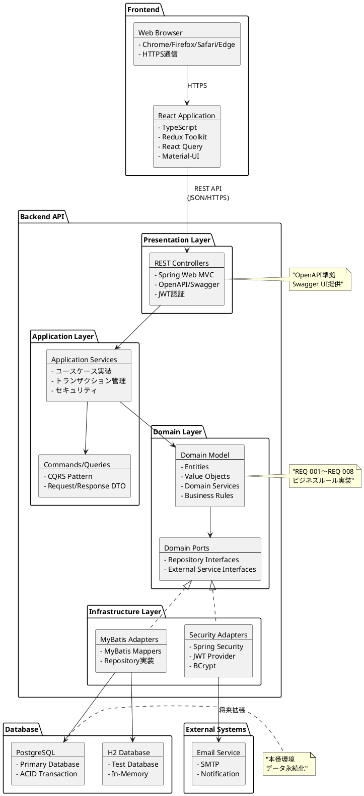

# 会議室予約システム - アーキテクチャ設計書

## アーキテクチャ概要

### アーキテクチャパターン
**ヘキサゴナルアーキテクチャ（ポート&アダプター）** + **Clean Architecture** を採用

### 設計原則
- **関心事の分離**: ビジネスロジックとインフラストラクチャの完全な分離
- **依存性逆転**: ドメイン層が他の層に依存しない
- **テスタビリティ**: ユニットテストが容易な構造
- **拡張性**: 新機能追加時の影響範囲を最小化

## システム全体アーキテクチャ

### アーキテクチャ図



## レイヤー詳細設計

### 1. Presentation Layer（プレゼンテーション層）

**責務**: HTTP リクエスト/レスポンス処理、認証・認可、入力値検証

#### REST Controller 設計

| Controller | 対応要件 | エンドポイント例 |
|------------|----------|------------------|
| **AuthController** | REQ-001 | POST /api/auth/login<br>POST /api/auth/logout |
| **UserController** | REQ-002 | GET/POST/PUT/DELETE /api/users |
| **MeetingRoomController** | REQ-004,008 | GET/POST/PUT/DELETE /api/meeting-rooms<br>GET /api/meeting-rooms/search |
| **ReservationController** | REQ-005,006,007 | GET/POST/PUT/DELETE /api/reservations |
| **InquiryController** | REQ-003 | GET/POST/PUT /api/inquiries |

#### セキュリティ設定
```java
// 認証が必要なエンドポイント
- /api/reservations/** (MEMBER, STAFF)
- /api/users/** (STAFF)  
- /api/meeting-rooms/manage/** (STAFF)
- /api/inquiries/manage/** (STAFF)

// 認証不要なエンドポイント
- /api/auth/login
- /api/meeting-rooms/search (検索のみ)
- /api/inquiries (送信のみ)
```

### 2. Application Layer（アプリケーション層）

**責務**: ユースケースの調整、トランザクション管理、ドメインサービスの呼び出し

#### Application Services 設計

```java
// REQ-001: 利用者認証
@Service
public class AuthenticationApplicationService {
    public AuthResponse authenticate(LoginCommand command);
    public void logout(LogoutCommand command);
}

// REQ-004,005,006,007: 予約管理
@Service  
public class ReservationApplicationService {
    public List<MeetingRoomResponse> searchAvailableRooms(SearchRoomsQuery query); // REQ-004
    public ReservationResponse createReservation(CreateReservationCommand command); // REQ-005
    public List<ReservationResponse> getUserReservations(Long userId); // REQ-006
    public void cancelReservation(CancelReservationCommand command); // REQ-007
}

// REQ-002: 利用者管理
@Service
public class UserManagementApplicationService {
    public UserResponse createUser(CreateUserCommand command);
    public UserResponse updateUser(UpdateUserCommand command);
    public void deleteUser(Long userId);
    public List<UserResponse> getAllUsers();
}

// REQ-008: 会議室管理
@Service
public class MeetingRoomManagementApplicationService {
    public MeetingRoomResponse createMeetingRoom(CreateMeetingRoomCommand command);
    public MeetingRoomResponse updateMeetingRoom(UpdateMeetingRoomCommand command);
    public void deleteMeetingRoom(Long meetingRoomId);
}

// REQ-003: 問い合わせ管理
@Service
public class InquiryApplicationService {
    public InquiryResponse submitInquiry(SubmitInquiryCommand command);
    public List<InquiryResponse> getInquiries(InquirySearchQuery query);
    public InquiryResponse respondToInquiry(RespondInquiryCommand command);
}
```

### 3. Domain Layer（ドメイン層）

**責務**: ビジネスルール、ドメインロジック、不変条件の維持

#### Domain Model 設計

```java
// REQ-001,002: User Entity
@Entity
public class User {
    private UserId id;
    private Username username;
    private Email email;
    private PasswordHash passwordHash;
    private UserRole role;
    private boolean enabled;
    
    // ビジネスルール
    public void validatePassword(String password) {
        // パスワード強度チェック
    }
    
    public boolean canMakeReservation() {
        return enabled && role.canReserve();
    }
}

// REQ-004,008: MeetingRoom Entity  
@Entity
public class MeetingRoom {
    private MeetingRoomId id;
    private RoomName roomName;
    private Capacity capacity;
    private HourlyRate hourlyRate;
    private boolean isActive;
    
    // ビジネスルール
    public void validateCapacity(int attendeeCount) {
        if (attendeeCount > capacity.getValue()) {
            throw new CapacityExceededException();
        }
    }
}

// REQ-005,006,007: Reservation Entity
@Entity  
public class Reservation {
    private ReservationId id;
    private UserId userId;
    private MeetingRoomId meetingRoomId;
    private ReservationDate reservationDate;
    private TimeSlot timeSlot;
    private Purpose purpose;
    private AttendeeCount attendeeCount;
    private ReservationStatus status;
    
    // ビジネスルール
    public void validateBusinessHours() {
        if (!timeSlot.isWithinBusinessHours()) {
            throw new InvalidBusinessHoursException();
        }
    }
    
    public void validateCancellationDeadline() {
        if (reservationDate.isWithinCancellationDeadline()) {
            throw new CancellationDeadlineExceededException();
        }
    }
    
    public void cancel() {
        validateCancellationDeadline();
        this.status = ReservationStatus.CANCELLED;
    }
}

// REQ-003: Inquiry Entity
@Entity
public class Inquiry {
    private InquiryId id;
    private UserId userId; // nullable for guests
    private GuestInfo guestInfo; // for non-member inquiries
    private Subject subject;
    private Message message;
    private InquiryCategory category;
    private InquiryStatus status;
}
```

#### Domain Services

```java
// 重複予約チェックサービス
@DomainService
public class ReservationConflictService {
    public void checkForConflicts(MeetingRoomId roomId, ReservationDate date, TimeSlot timeSlot) {
        // REQ-005: 重複予約防止ロジック
    }
}

// 利用者制限チェックサービス  
@DomainService
public class UserLimitService {
    public void validateReservationLimit(UserId userId) {
        // REQ-005: 1会員あたり最大3件制限
    }
}
```

### 4. Infrastructure Layer（インフラストラクチャ層）

**責務**: 外部システムとの連携、データ永続化、技術的詳細

#### Repository 実装

```java
@Repository
public class MyBatisUserRepository implements UserRepository {
    // MyBatis を使用した実装
    @Autowired
    private UserMapper userMapper;
}

@Repository  
public class MyBatisReservationRepository implements ReservationRepository {
    @Autowired
    private ReservationMapper reservationMapper;
    
    // 複雑なクエリは XML マッパーで実装
    public List<Reservation> findConflictingReservations(
        MeetingRoomId roomId, ReservationDate date, 
        LocalTime startTime, LocalTime endTime) {
        return reservationMapper.findConflictingReservations(
            roomId.getValue(), date.getValue(), startTime, endTime);
    }
}
```

#### MyBatis マッパー例

**XML マッパー** (`src/main/resources/mappers/ReservationMapper.xml`):
```xml
<mapper namespace="com.meetingroom.infrastructure.mapper.ReservationMapper">
    <select id="findConflictingReservations" resultMap="reservationResultMap">
        SELECT r.* FROM reservations r 
        WHERE r.meeting_room_id = #{roomId}
          AND r.reservation_date = #{date}
          AND r.status = 'CONFIRMED'
          AND ((r.start_time &lt; #{endTime} AND r.end_time &gt; #{startTime}))
    </select>
</mapper>
```

## 非機能要件の実現方法

### パフォーマンス（要件: 3秒以内表示、5秒以内予約処理）
- **データベース最適化**: インデックス設計、クエリ最適化
- **キャッシュ戦略**: Redis使用（将来拡張）
- **コネクションプール**: HikariCP設定最適化

### セキュリティ（要件: JWT認証、HTTPS通信、BCryptハッシュ化）
- **認証**: Spring Security + JWT
- **認可**: ロールベースアクセス制御
- **パスワード**: BCrypt（ストレングス12）
- **通信**: HTTPS強制、セキュリティヘッダー設定

### 可用性（要件: 平日99%稼働）
- **ヘルスチェック**: Spring Boot Actuator
- **ログ管理**: SLF4J + Logback
- **エラーハンドリング**: グローバル例外ハンドラー

## 技術スタック詳細

### Backend
```yaml
言語: Java 21 LTS
フレームワーク: Spring Boot 3.3.2
  - Spring Web MVC 6.1+
  - Spring Security 6.1+  
  - MyBatis 3.5.13+
認証: JWT (jjwt 0.12.5)
データベース:
  - PostgreSQL 16+ (本番)
  - H2 2.2+ (テスト)
ビルド: Gradle 8.3+
```

### Frontend  
```yaml
言語: TypeScript 5.0+
フレームワーク: React 18.2+
ビルド: Vite 4.4+
状態管理: Redux Toolkit 1.9+
API通信: Axios 1.5+ + React Query 4.32+
UI: Material-UI 5.14+
ルーティング: React Router 6.15+
```

## プロジェクト構造・配置

### ディレクトリ構造
```
ai-programing-exercise/
├── app/
│   ├── backend/                    # Spring Boot アプリケーション
│   │   ├── src/main/java/com/meetingroom/
│   │   │   ├── presentation/       # REST Controllers
│   │   │   ├── application/        # Application Services
│   │   │   ├── domain/             # Domain Models
│   │   │   └── infrastructure/     # MyBatis Mappers, Security
│   │   ├── src/main/resources/
│   │   │   ├── db/migration/       # Flyway マイグレーション
│   │   │   └── mappers/            # MyBatis XML マッパー
│   │   └── build.gradle
│   └── frontend/                   # React アプリケーション
│       ├── src/
│       │   ├── components/         # 再利用可能コンポーネント
│       │   ├── pages/              # 画面コンポーネント
│       │   ├── hooks/              # カスタムhook
│       │   ├── services/           # API通信
│       │   ├── store/              # Redux store
│       │   └── types/              # TypeScript型定義
│       ├── package.json
│       └── vite.config.ts
├── docs/                          # 設計書・仕様書
└── docker-compose.yml            # 開発環境コンテナ構成
```

### アプリケーション配置ポリシー
- **バックエンド**: `app/backend/` 以下に Spring Boot プロジェクトを配置
- **フロントエンド**: `app/frontend/` 以下に React プロジェクトを配置
- **共通設定**: プロジェクトルートに Docker Compose、CI/CD設定を配置
- **ドキュメント**: `docs/` 以下に設計書・仕様書を配置

## デプロイメント戦略

### 開発環境
- **フロントエンド**: Vite dev server (localhost:5173) - `app/frontend/`
- **バックエンド**: Spring Boot dev server (localhost:8080) - `app/backend/`
- **データベース**: H2 in-memory

### 本番環境（将来）
- **フロントエンド**: Nginx + 静的ファイル配信
- **バックエンド**: Docker + Kubernetes
- **データベース**: PostgreSQL (managed service)
- **ロードバランサー**: AWS ALB / Azure Load Balancer

## 次のステップ

1. **API設計**: OpenAPI 3.0 仕様書作成
2. **データベース設計**: マイグレーション sql 作成  
3. **UI/UX設計**: ワイヤーフレーム・画面遷移図
4. **実装計画**: 開発順序・マイルストーン

---

**このアーキテクチャ設計は、要件定義書のREQ-001〜REQ-008を満たし、非機能要件も考慮した実装可能な設計です。**