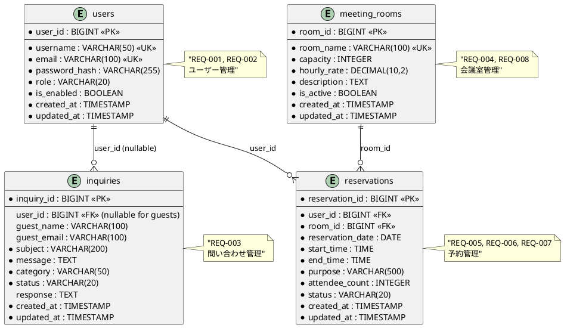

# 会議室予約システム - データベース設計書

## データベース設計概要

### 使用技術
- **本番環境**: PostgreSQL 16+
- **開発/テスト環境**: H2 Database 2.2+
- **ORM**: Spring Data JPA 3.1+
- **マイグレーション**: Flyway

### 設計原則
- **正規化**: 第3正規形まで適用
- **制約**: データ整合性を保証する適切な制約設定
- **インデックス**: パフォーマンスを考慮した戦略的配置
- **命名規則**: スネークケース、複数形テーブル名

## 論理データモデル

### ER図（詳細）



## 物理データモデル

### テーブル詳細定義

#### 1. users テーブル
**責務**: ユーザー（会員・スタッフ）情報管理

| カラム名 | データ型 | 制約 | 説明 |
|----------|----------|------|------|
| user_id | BIGINT | PK, AUTO_INCREMENT | ユーザーID |
| username | VARCHAR(50) | NOT NULL, UNIQUE | ユーザー名 |
| email | VARCHAR(100) | NOT NULL, UNIQUE | メールアドレス |
| password_hash | VARCHAR(255) | NOT NULL | ハッシュ化パスワード |
| role | VARCHAR(20) | NOT NULL | ユーザーロール（MEMBER/STAFF） |
| is_enabled | BOOLEAN | NOT NULL, DEFAULT TRUE | アカウント有効フラグ |
| created_at | TIMESTAMP | NOT NULL, DEFAULT CURRENT_TIMESTAMP | 作成日時 |
| updated_at | TIMESTAMP | NOT NULL, DEFAULT CURRENT_TIMESTAMP | 更新日時 |

**制約**:
```sql
-- Check制約
CONSTRAINT chk_users_role CHECK (role IN ('MEMBER', 'STAFF'))
CONSTRAINT chk_users_email CHECK (email ~ '^[A-Za-z0-9._%-]+@[A-Za-z0-9.-]+\.[A-Za-z]{2,4}$')
CONSTRAINT chk_users_username CHECK (LENGTH(username) >= 3)
```

**インデックス**:
```sql
CREATE UNIQUE INDEX idx_users_username ON users(username);
CREATE UNIQUE INDEX idx_users_email ON users(email);
CREATE INDEX idx_users_role_enabled ON users(role, is_enabled);
```

#### 2. meeting_rooms テーブル
**責務**: 会議室情報管理

| カラム名 | データ型 | 制約 | 説明 |
|----------|----------|------|------|
| room_id | BIGINT | PK, AUTO_INCREMENT | 会議室ID |
| room_name | VARCHAR(100) | NOT NULL, UNIQUE | 会議室名 |
| capacity | INTEGER | NOT NULL | 収容人数 |
| hourly_rate | DECIMAL(10,2) | NOT NULL | 1時間あたり料金 |
| description | TEXT | NULL | 会議室説明 |
| is_active | BOOLEAN | NOT NULL, DEFAULT TRUE | 利用可能フラグ |
| created_at | TIMESTAMP | NOT NULL, DEFAULT CURRENT_TIMESTAMP | 作成日時 |
| updated_at | TIMESTAMP | NOT NULL, DEFAULT CURRENT_TIMESTAMP | 更新日時 |

**制約**:
```sql
-- Check制約
CONSTRAINT chk_meeting_rooms_capacity CHECK (capacity > 0 AND capacity <= 100)
CONSTRAINT chk_meeting_rooms_hourly_rate CHECK (hourly_rate >= 0)
CONSTRAINT chk_meeting_rooms_name CHECK (LENGTH(room_name) >= 1)
```

**インデックス**:
```sql
CREATE UNIQUE INDEX idx_meeting_rooms_name ON meeting_rooms(room_name);
CREATE INDEX idx_meeting_rooms_active ON meeting_rooms(is_active);
CREATE INDEX idx_meeting_rooms_capacity ON meeting_rooms(capacity);
```

#### 3. reservations テーブル
**責務**: 予約情報管理

| カラム名 | データ型 | 制約 | 説明 |
|----------|----------|------|------|
| reservation_id | BIGINT | PK, AUTO_INCREMENT | 予約ID |
| user_id | BIGINT | NOT NULL, FK | ユーザーID |
| room_id | BIGINT | NOT NULL, FK | 会議室ID |
| reservation_date | DATE | NOT NULL | 予約日 |
| start_time | TIME | NOT NULL | 開始時刻 |
| end_time | TIME | NOT NULL | 終了時刻 |
| purpose | VARCHAR(500) | NOT NULL | 利用目的 |
| attendee_count | INTEGER | NOT NULL | 参加人数 |
| status | VARCHAR(20) | NOT NULL | 予約状態 |
| created_at | TIMESTAMP | NOT NULL, DEFAULT CURRENT_TIMESTAMP | 作成日時 |
| updated_at | TIMESTAMP | NOT NULL, DEFAULT CURRENT_TIMESTAMP | 更新日時 |

**制約**:
```sql
-- Check制約
CONSTRAINT chk_reservations_status CHECK (status IN ('CONFIRMED', 'CANCELLED'))
CONSTRAINT chk_reservations_time CHECK (start_time < end_time)
CONSTRAINT chk_reservations_attendee_count CHECK (attendee_count > 0)
CONSTRAINT chk_reservations_business_hours CHECK (
  start_time >= '09:00:00' AND end_time <= '18:00:00'
)
CONSTRAINT chk_reservations_future_date CHECK (reservation_date >= CURRENT_DATE)

-- 外部キー制約
CONSTRAINT fk_reservations_user_id FOREIGN KEY (user_id) REFERENCES users(user_id)
CONSTRAINT fk_reservations_room_id FOREIGN KEY (room_id) REFERENCES meeting_rooms(room_id)

-- 一意制約（同一会議室・日付・時間帯の重複予約防止）
CONSTRAINT uk_reservations_room_datetime UNIQUE (room_id, reservation_date, start_time, end_time)
```

**インデックス**:
```sql
CREATE INDEX idx_reservations_user_id ON reservations(user_id);
CREATE INDEX idx_reservations_room_id ON reservations(room_id);
CREATE INDEX idx_reservations_date_status ON reservations(reservation_date, status);
CREATE INDEX idx_reservations_room_date ON reservations(room_id, reservation_date);
-- 予約重複チェック用複合インデックス
CREATE INDEX idx_reservations_conflict_check ON reservations(room_id, reservation_date, start_time, end_time, status);
```

#### 4. inquiries テーブル
**責務**: 問い合わせ管理

| カラム名 | データ型 | 制約 | 説明 |
|----------|----------|------|------|
| inquiry_id | BIGINT | PK, AUTO_INCREMENT | 問い合わせID |
| user_id | BIGINT | NULL, FK | ユーザーID（ゲストの場合はNULL） |
| guest_name | VARCHAR(100) | NULL | ゲスト名（user_idがNULLの場合必須） |
| guest_email | VARCHAR(100) | NULL | ゲストメール（user_idがNULLの場合必須） |
| subject | VARCHAR(200) | NOT NULL | 件名 |
| message | TEXT | NOT NULL | 問い合わせ内容 |
| category | VARCHAR(50) | NOT NULL | 問い合わせカテゴリ |
| status | VARCHAR(20) | NOT NULL | 対応状況 |
| response | TEXT | NULL | 回答内容 |
| created_at | TIMESTAMP | NOT NULL, DEFAULT CURRENT_TIMESTAMP | 作成日時 |
| updated_at | TIMESTAMP | NOT NULL, DEFAULT CURRENT_TIMESTAMP | 更新日時 |

**制約**:
```sql
-- Check制約
CONSTRAINT chk_inquiries_category CHECK (category IN ('RESERVATION', 'SYSTEM', 'BILLING', 'OTHER'))
CONSTRAINT chk_inquiries_status CHECK (status IN ('OPEN', 'IN_PROGRESS', 'RESOLVED', 'CLOSED'))
CONSTRAINT chk_inquiries_guest_info CHECK (
  (user_id IS NOT NULL) OR 
  (user_id IS NULL AND guest_name IS NOT NULL AND guest_email IS NOT NULL)
)

-- 外部キー制約
CONSTRAINT fk_inquiries_user_id FOREIGN KEY (user_id) REFERENCES users(user_id)
```

**インデックス**:
```sql
CREATE INDEX idx_inquiries_user_id ON inquiries(user_id);
CREATE INDEX idx_inquiries_status ON inquiries(status);
CREATE INDEX idx_inquiries_category ON inquiries(category);
CREATE INDEX idx_inquiries_created_at ON inquiries(created_at);
```

## データベースマイグレーション

### Flyway マイグレーション設計

#### V1__Initial_Schema.sql
```sql
-- 初期スキーマ作成
-- users テーブル作成
CREATE TABLE users (
    user_id BIGINT GENERATED BY DEFAULT AS IDENTITY PRIMARY KEY,
    username VARCHAR(50) NOT NULL,
    email VARCHAR(100) NOT NULL,
    password_hash VARCHAR(255) NOT NULL,
    role VARCHAR(20) NOT NULL,
    is_enabled BOOLEAN NOT NULL DEFAULT TRUE,
    created_at TIMESTAMP NOT NULL DEFAULT CURRENT_TIMESTAMP,
    updated_at TIMESTAMP NOT NULL DEFAULT CURRENT_TIMESTAMP,
    
    CONSTRAINT chk_users_role CHECK (role IN ('MEMBER', 'STAFF')),
    CONSTRAINT chk_users_email CHECK (email ~ '^[A-Za-z0-9._%-]+@[A-Za-z0-9.-]+\.[A-Za-z]{2,4}$'),
    CONSTRAINT chk_users_username CHECK (LENGTH(username) >= 3)
);

-- meeting_rooms テーブル作成
CREATE TABLE meeting_rooms (
    room_id BIGINT GENERATED BY DEFAULT AS IDENTITY PRIMARY KEY,
    room_name VARCHAR(100) NOT NULL,
    capacity INTEGER NOT NULL,
    hourly_rate DECIMAL(10,2) NOT NULL,
    description TEXT,
    is_active BOOLEAN NOT NULL DEFAULT TRUE,
    created_at TIMESTAMP NOT NULL DEFAULT CURRENT_TIMESTAMP,
    updated_at TIMESTAMP NOT NULL DEFAULT CURRENT_TIMESTAMP,
    
    CONSTRAINT chk_meeting_rooms_capacity CHECK (capacity > 0 AND capacity <= 100),
    CONSTRAINT chk_meeting_rooms_hourly_rate CHECK (hourly_rate >= 0),
    CONSTRAINT chk_meeting_rooms_name CHECK (LENGTH(room_name) >= 1)
);

-- reservations テーブル作成
CREATE TABLE reservations (
    reservation_id BIGINT GENERATED BY DEFAULT AS IDENTITY PRIMARY KEY,
    user_id BIGINT NOT NULL,
    room_id BIGINT NOT NULL,
    reservation_date DATE NOT NULL,
    start_time TIME NOT NULL,
    end_time TIME NOT NULL,
    purpose VARCHAR(500) NOT NULL,
    attendee_count INTEGER NOT NULL,
    status VARCHAR(20) NOT NULL DEFAULT 'CONFIRMED',
    created_at TIMESTAMP NOT NULL DEFAULT CURRENT_TIMESTAMP,
    updated_at TIMESTAMP NOT NULL DEFAULT CURRENT_TIMESTAMP,
    
    CONSTRAINT chk_reservations_status CHECK (status IN ('CONFIRMED', 'CANCELLED')),
    CONSTRAINT chk_reservations_time CHECK (start_time < end_time),
    CONSTRAINT chk_reservations_attendee_count CHECK (attendee_count > 0),
    CONSTRAINT chk_reservations_business_hours CHECK (
        start_time >= '09:00:00' AND end_time <= '18:00:00'
    ),
    CONSTRAINT chk_reservations_future_date CHECK (reservation_date >= CURRENT_DATE),
    CONSTRAINT fk_reservations_user_id FOREIGN KEY (user_id) REFERENCES users(user_id),
    CONSTRAINT fk_reservations_room_id FOREIGN KEY (room_id) REFERENCES meeting_rooms(room_id)
);

-- inquiries テーブル作成
CREATE TABLE inquiries (
    inquiry_id BIGINT GENERATED BY DEFAULT AS IDENTITY PRIMARY KEY,
    user_id BIGINT,
    guest_name VARCHAR(100),
    guest_email VARCHAR(100),
    subject VARCHAR(200) NOT NULL,
    message TEXT NOT NULL,
    category VARCHAR(50) NOT NULL,
    status VARCHAR(20) NOT NULL DEFAULT 'OPEN',
    response TEXT,
    created_at TIMESTAMP NOT NULL DEFAULT CURRENT_TIMESTAMP,
    updated_at TIMESTAMP NOT NULL DEFAULT CURRENT_TIMESTAMP,
    
    CONSTRAINT chk_inquiries_category CHECK (category IN ('RESERVATION', 'SYSTEM', 'BILLING', 'OTHER')),
    CONSTRAINT chk_inquiries_status CHECK (status IN ('OPEN', 'IN_PROGRESS', 'RESOLVED', 'CLOSED')),
    CONSTRAINT chk_inquiries_guest_info CHECK (
        (user_id IS NOT NULL) OR 
        (user_id IS NULL AND guest_name IS NOT NULL AND guest_email IS NOT NULL)
    ),
    CONSTRAINT fk_inquiries_user_id FOREIGN KEY (user_id) REFERENCES users(user_id)
);
```

#### V2__Create_Indexes.sql
```sql
-- インデックス作成

-- users テーブル
CREATE UNIQUE INDEX idx_users_username ON users(username);
CREATE UNIQUE INDEX idx_users_email ON users(email);
CREATE INDEX idx_users_role_enabled ON users(role, is_enabled);

-- meeting_rooms テーブル
CREATE UNIQUE INDEX idx_meeting_rooms_name ON meeting_rooms(room_name);
CREATE INDEX idx_meeting_rooms_active ON meeting_rooms(is_active);
CREATE INDEX idx_meeting_rooms_capacity ON meeting_rooms(capacity);

-- reservations テーブル
CREATE INDEX idx_reservations_user_id ON reservations(user_id);
CREATE INDEX idx_reservations_room_id ON reservations(room_id);
CREATE INDEX idx_reservations_date_status ON reservations(reservation_date, status);
CREATE INDEX idx_reservations_room_date ON reservations(room_id, reservation_date);
CREATE INDEX idx_reservations_conflict_check ON reservations(room_id, reservation_date, start_time, end_time, status);

-- inquiries テーブル
CREATE INDEX idx_inquiries_user_id ON inquiries(user_id);
CREATE INDEX idx_inquiries_status ON inquiries(status);
CREATE INDEX idx_inquiries_category ON inquiries(category);
CREATE INDEX idx_inquiries_created_at ON inquiries(created_at);
```

#### V3__Insert_Master_Data.sql
```sql
-- マスターデータ投入

-- 管理者ユーザー作成（password: admin123 をBCryptハッシュ化）
INSERT INTO users (username, email, password_hash, role) VALUES 
('admin', 'admin@meetingroom.com', '$2a$10$N.zmdr9k7uOCQb376NoUnuTJ8imdqMUcEKUUcl5V6zAZh7V3JV2ly', 'STAFF');

-- サンプル会議室データ
INSERT INTO meeting_rooms (room_name, capacity, hourly_rate, description) VALUES
('会議室A', 6, 1000.00, '小規模ミーティング用。プロジェクター完備。'),
('会議室B', 10, 1500.00, '中規模会議用。ホワイトボード、プロジェクター完備。'),
('会議室C', 20, 2500.00, '大会議室。プレゼンテーション設備一式完備。'),
('セミナールーム', 50, 5000.00, '大規模セミナー・研修用。音響設備完備。');

-- サンプル会員ユーザー（password: user123 をBCryptハッシュ化）
INSERT INTO users (username, email, password_hash, role) VALUES
('testuser1', 'test1@example.com', '$2a$10$92IXUNpkjO0rOQ5byMi.Ye4oKoEa3Ro9llC/.og/at2uheWG/igi.', 'MEMBER'),
('testuser2', 'test2@example.com', '$2a$10$92IXUNpkjO0rOQ5byMi.Ye4oKoEa3Ro9llC/.og/at2uheWG/igi.', 'MEMBER');
```

### H2 Database 設定（テスト用）

#### application-test.yml
```yaml
spring:
  datasource:
    url: jdbc:h2:mem:testdb;DB_CLOSE_DELAY=-1;DB_CLOSE_ON_EXIT=FALSE
    driverClassName: org.h2.Driver
    username: sa
    password: password
  jpa:
    database-platform: org.hibernate.dialect.H2Dialect
    hibernate:
      ddl-auto: validate
    show-sql: true
  flyway:
    locations: classpath:db/migration
    baseline-on-migrate: true
  h2:
    console:
      enabled: true
      path: /h2-console
```

### PostgreSQL 設定（本番用）

#### application-prod.yml
```yaml
spring:
  datasource:
    url: jdbc:postgresql://localhost:5432/meetingroom_db
    username: ${DB_USERNAME:meetingroom_user}
    password: ${DB_PASSWORD:meetingroom_pass}
    hikari:
      maximum-pool-size: 20
      minimum-idle: 5
      connection-timeout: 20000
      idle-timeout: 300000
      max-lifetime: 1200000
  jpa:
    database-platform: org.hibernate.dialect.PostgreSQLDialect
    hibernate:
      ddl-auto: validate
    show-sql: false
    properties:
      hibernate:
        format_sql: true
        jdbc:
          batch_size: 25
          order_inserts: true
          order_updates: true
  flyway:
    locations: classpath:db/migration
    baseline-on-migrate: false
```

## パフォーマンス最適化戦略

### クエリ最適化

#### 1. 予約重複チェッククエリ
```sql
-- 最適化前（N+1問題発生）
SELECT * FROM reservations WHERE room_id = ? AND reservation_date = ?;

-- 最適化後（時間重複も考慮した効率的クエリ）
SELECT COUNT(*) FROM reservations 
WHERE room_id = ? 
  AND reservation_date = ? 
  AND status = 'CONFIRMED'
  AND ((start_time < ? AND end_time > ?) OR (start_time < ? AND end_time > ?));
```

#### 2. 利用可能会議室検索クエリ
```sql
-- 複合インデックスを活用した高速検索
SELECT mr.* FROM meeting_rooms mr
WHERE mr.is_active = true 
  AND mr.capacity >= ?
  AND NOT EXISTS (
    SELECT 1 FROM reservations r 
    WHERE r.room_id = mr.room_id 
      AND r.reservation_date = ?
      AND r.status = 'CONFIRMED'
      AND ((r.start_time < ? AND r.end_time > ?) OR (r.start_time < ? AND r.end_time > ?))
  );
```

### インデックス戦略

#### 予約検索性能向上
```sql
-- 複合インデックス設計
CREATE INDEX idx_reservations_room_date_time_status 
ON reservations(room_id, reservation_date, start_time, end_time, status);

-- カバリングインデックス（SELECT文で必要な列を全て含む）
CREATE INDEX idx_reservations_covering 
ON reservations(room_id, reservation_date, status) 
INCLUDE (start_time, end_time, user_id, purpose);
```

### データアーカイブ戦略

#### 過去予約データのアーカイブ
```sql
-- 6ヶ月以上前の予約データをアーカイブテーブルに移動
CREATE TABLE reservations_archive (LIKE reservations INCLUDING ALL);

-- アーカイブ処理（月次バッチ）
INSERT INTO reservations_archive 
SELECT * FROM reservations 
WHERE reservation_date < CURRENT_DATE - INTERVAL '6 months';

DELETE FROM reservations 
WHERE reservation_date < CURRENT_DATE - INTERVAL '6 months';
```

## セキュリティ考慮事項

### データ暗号化
- **保存時暗号化**: PostgreSQL の透過的データ暗号化（TDE）を使用
- **通信時暗号化**: SSL/TLS 1.3 による暗号化通信

### アクセス制御
```sql
-- データベースレベルのロールベースアクセス制御
CREATE ROLE meetingroom_readonly;
GRANT SELECT ON ALL TABLES IN SCHEMA public TO meetingroom_readonly;

CREATE ROLE meetingroom_app_user;
GRANT SELECT, INSERT, UPDATE, DELETE ON ALL TABLES IN SCHEMA public TO meetingroom_app_user;
GRANT USAGE, SELECT ON ALL SEQUENCES IN SCHEMA public TO meetingroom_app_user;
```

### 監査ログ
```sql
-- 予約データの変更履歴テーブル
CREATE TABLE reservations_audit (
    audit_id BIGINT GENERATED BY DEFAULT AS IDENTITY PRIMARY KEY,
    reservation_id BIGINT NOT NULL,
    operation_type VARCHAR(10) NOT NULL, -- INSERT/UPDATE/DELETE
    old_values JSONB,
    new_values JSONB,
    changed_by BIGINT,
    changed_at TIMESTAMP NOT NULL DEFAULT CURRENT_TIMESTAMP
);
```

---

**このデータベース設計書は、要件定義書 REQ-001〜REQ-008 を満たし、パフォーマンス・セキュリティ・保守性を考慮した実装可能な設計です。**