# 会議室予約システム - 実装計画書

## 実装計画概要

### 開発アプローチ
- **開発手法**: アジャイル開発（2週間スプリント）
- **品質管理**: TDD（Test-Driven Development）
- **アーキテクチャ**: Clean Architecture + Hexagonal Architecture
- **デプロイ戦略**: CI/CD パイプライン

### 開発期間・リソース
- **総開発期間**: 8週間（4スプリント）
- **チーム構成**: フルスタック開発者1名
- **開発環境**: ローカル開発 + H2データベース
- **本番想定**: PostgreSQL + Docker

### 開発スケジュール

```mermaid
gantt
    title 会議室予約システム開発スケジュール
    dateFormat  X
    axisFormat %w

    section Phase 1: 基盤構築
    プロジェクト構造設定      :p1-setup, 0, 2d
    Spring Boot セットアップ   :p1-backend, after p1-setup, 3d
    React セットアップ        :p1-frontend, after p1-setup, 3d
    データベース初期化        :p1-db, after p1-backend, 2d
    JWT認証実装              :p1-auth, after p1-db, 4d
    ログイン画面実装         :p1-login, after p1-frontend, 3d
    基本テスト実装           :p1-test, after p1-auth, 2d

    section Phase 2: コア機能
    MeetingRoom Entity実装   :p2-entity, 14, 2d
    会議室検索API実装        :p2-search-api, after p2-entity, 3d
    予約システム実装         :p2-reservation, after p2-search-api, 4d
    重複チェック機能         :p2-duplicate, after p2-reservation, 2d
    フロントエンド統合       :p2-frontend, after p2-search-api, 5d
    パフォーマンステスト     :p2-perf, after p2-duplicate, 2d

    section Phase 3: 管理機能
    予約一覧API実装          :p3-list, 28, 3d
    キャンセル機能実装       :p3-cancel, after p3-list, 2d
    問い合わせシステム       :p3-inquiry, after p3-cancel, 3d
    ユーザー管理機能         :p3-user-mgmt, after p3-inquiry, 3d
    管理画面実装             :p3-admin-ui, after p3-list, 5d
    ビジネス制約テスト       :p3-business-test, after p3-user-mgmt, 2d

    section Phase 4: 仕上げ
    レスポンシブ対応         :p4-responsive, 42, 4d
    アクセシビリティ対応     :p4-a11y, after p4-responsive, 3d
    DB最適化                :p4-db-opt, 42, 3d
    セキュリティテスト       :p4-security, after p4-a11y, 2d
    UAT実施                 :p4-uat, after p4-security, 3d
    運用ドキュメント整備     :p4-docs, after p4-uat, 2d
```



## フェーズ別実装計画

### Phase 1: 基盤構築（第1スプリント - 2週間）

#### スプリント目標
- 開発環境セットアップ完了
- バックエンド・フロントエンドの基盤構築
- 認証機能の基本実装

#### 実装対象機能
| 要件ID | 機能 | 優先度 | 担当 |
|--------|------|--------|------|
| REQ-001 | ユーザー認証（ログイン/ログアウト） | 高 | Backend + Frontend |
| - | プロジェクト構造設定 | 高 | Setup |
| - | データベース初期化・マイグレーション | 高 | Backend |
| - | 基本的なCRUD操作（User） | 中 | Backend |

#### 完了条件（Definition of Done）
- [ ] Spring Boot プロジェクト構築完了
- [ ] React プロジェクト構築完了
- [ ] データベースマイグレーション動作確認
- [ ] JWT認証機能動作確認
- [ ] ログイン画面実装・動作確認
- [ ] 単体テスト網羅率80%以上
- [ ] 統合テスト実装・パス

### Phase 2: コア機能実装（第2スプリント - 2週間）

#### スプリント目標
- 会議室管理・検索機能実装
- 予約システムのコア機能実装

#### 実装対象機能
| 要件ID | 機能 | 優先度 | 担当 |
|--------|------|--------|------|
| REQ-004 | 会議室検索機能 | 高 | Backend + Frontend |
| REQ-005 | 会議室予約機能 | 高 | Backend + Frontend |
| REQ-008 | 会議室管理（スタッフ用） | 中 | Backend + Frontend |
| - | 重複予約チェック機能 | 高 | Backend |

#### 完了条件
- [ ] 会議室検索API実装・動作確認
- [ ] 予約作成API実装・動作確認  
- [ ] 重複予約防止機能動作確認
- [ ] 会議室検索画面実装・動作確認
- [ ] 予約作成画面実装・動作確認
- [ ] ビジネスルール検証テスト実装
- [ ] パフォーマンステスト（3秒以内応答）

### Phase 3: 管理機能実装（第3スプリント - 2週間）

#### スプリント目標
- 予約管理・問い合わせ機能実装
- ユーザー管理機能実装

#### 実装対象機能
| 要件ID | 機能 | 優先度 | 担当 |
|--------|------|--------|------|
| REQ-006 | 予約一覧・確認機能 | 高 | Backend + Frontend |
| REQ-007 | 予約キャンセル機能 | 高 | Backend + Frontend |
| REQ-003 | 問い合わせ管理 | 中 | Backend + Frontend |
| REQ-002 | ユーザー管理（スタッフ用） | 中 | Backend + Frontend |

#### 完了条件
- [ ] 予約一覧API実装・動作確認
- [ ] 予約キャンセルAPI実装・動作確認
- [ ] 問い合わせAPI実装・動作確認
- [ ] 予約一覧画面実装・動作確認
- [ ] 管理ダッシュボード実装・動作確認
- [ ] ビジネス制約テスト（キャンセル期限など）

### Phase 4: 仕上げ・本番準備（第4スプリント - 2週間）

#### スプリント目標
- UI/UX改善・レスポンシブ対応
- パフォーマンス最適化
- 本番環境準備

#### 実装対象機能
| 分類 | 内容 | 優先度 | 担当 |
|------|------|--------|------|
| UI/UX | レスポンシブデザイン対応 | 高 | Frontend |
| UI/UX | アクセシビリティ対応 | 中 | Frontend |
| 性能 | データベースクエリ最適化 | 高 | Backend |
| 性能 | フロントエンド最適化 | 中 | Frontend |
| 本番 | Docker化・デプロイ準備 | 低 | DevOps |

#### 完了条件
- [ ] 全画面レスポンシブ対応完了
- [ ] WCAG 2.1 AA準拠確認
- [ ] パフォーマンス要件達成（3秒/5秒）
- [ ] セキュリティテスト完了
- [ ] ユーザー受入テスト完了
- [ ] 運用ドキュメント整備

## 技術実装詳細

### バックエンド実装計画

#### 1. プロジェクト構造
```
src/main/java/com/meetingroom/
├── MeetingRoomApplication.java
├── config/                    # 設定クラス
│   ├── SecurityConfig.java
│   ├── JpaConfig.java
│   └── SwaggerConfig.java
├── presentation/              # プレゼンテーション層
│   ├── controller/
│   ├── dto/
│   └── exception/
├── application/               # アプリケーション層
│   ├── service/
│   ├── usecase/
│   └── command/
├── domain/                    # ドメイン層
│   ├── model/
│   ├── service/
│   └── repository/
└── infrastructure/            # インフラストラクチャ層
    ├── persistence/
    ├── security/
    └── external/
```

#### 2. 実装優先順序

**Phase 1: 基盤**
1. Spring Security + JWT 設定
2. User Entity + Repository
3. AuthController (login/logout)
4. 基本的なCRUD操作

**Phase 2: コア機能**
1. MeetingRoom Entity + Repository  
2. Reservation Entity + Repository
3. ReservationService（重複チェック含む）
4. MeetingRoomController, ReservationController

**Phase 3: 管理機能**
1. Inquiry Entity + Repository
2. 管理系API実装
3. 業務制約検証強化

**Phase 4: 最適化**
1. クエリ最適化
2. キャッシュ導入検討
3. エラーハンドリング強化

### フロントエンド実装計画

#### 1. プロジェクト構造
```
src/
├── components/               # 再利用可能コンポーネント
│   ├── common/              # 共通コンポーネント
│   ├── forms/               # フォームコンポーネント
│   └── layout/              # レイアウトコンポーネント
├── pages/                   # 画面コンポーネント
│   ├── auth/
│   ├── dashboard/
│   ├── reservation/
│   └── admin/
├── hooks/                   # カスタムhook
├── services/                # API通信
├── store/                   # Redux store
├── utils/                   # ユーティリティ
└── types/                   # TypeScript型定義
```

#### 2. 実装優先順序

**Phase 1: 基盤**
1. Material-UI セットアップ
2. ルーティング設定
3. ログイン画面 + 認証フロー
4. レイアウトコンポーネント

**Phase 2: コア機能**
1. ダッシュボード画面
2. 会議室検索画面
3. 予約作成画面
4. API統合

**Phase 3: 管理機能**
1. 予約一覧画面
2. 管理画面
3. 問い合わせ画面

**Phase 4: 最適化**
1. レスポンシブ対応
2. アクセシビリティ対応
3. パフォーマンス最適化

## テスト戦略

### テストピラミッド

```plantuml
@startuml テストピラミッド
!define RECTANGLE class

RECTANGLE E2ETests [
  E2Eテスト
  ----
  • ユーザーシナリオテスト
  • ブラウザ自動テスト
  • 10件程度
]

RECTANGLE IntegrationTests [
  統合テスト
  ----
  • API統合テスト
  • データベース統合テスト
  • 50件程度
]

RECTANGLE UnitTests [
  単体テスト
  ----
  • ビジネスロジックテスト
  • ユーティリティテスト
  • 200件程度
]

E2ETests --|> IntegrationTests
IntegrationTests --|> UnitTests

note right of E2ETests : "自動化率: 80%"
note right of IntegrationTests : "自動化率: 95%" 
note right of UnitTests : "自動化率: 100%"

@enduml
```

### テスト種別と対象

#### 1. 単体テスト（Unit Tests）
**Backend**:
```java
// ドメインモデルテスト
@Test
void 予約作成時に重複チェックが正常に動作する() {
    // given
    ReservationService service = new ReservationService();
    
    // when & then
    assertThrows(ReservationConflictException.class, 
        () -> service.createReservation(conflictingReservation));
}

// Repository テスト
@DataJpaTest
void ユーザーIDで予約一覧を正常に取得できる() {
    // TestContainers または H2 使用
}
```

**Frontend**:
```typescript
// React コンポーネントテスト
test('ログインフォームが正常に動作する', () => {
  render(<LoginForm />);
  
  fireEvent.change(screen.getByLabelText('ユーザー名'), {
    target: { value: 'testuser' }
  });
  
  expect(screen.getByRole('button', { name: 'ログイン' })).toBeEnabled();
});
```

#### 2. 統合テスト（Integration Tests）
```java
@SpringBootTest(webEnvironment = SpringBootTest.WebEnvironment.RANDOM_PORT)
class ReservationIntegrationTest {
    
    @Test
    void 会議室予約APIが正常に動作する() {
        // REST API統合テスト
        RestTemplate restTemplate = new RestTemplate();
        
        ResponseEntity<ReservationResponse> response = 
            restTemplate.postForEntity("/api/reservations", request, ReservationResponse.class);
        
        assertThat(response.getStatusCode()).isEqualTo(HttpStatus.CREATED);
    }
}
```

#### 3. E2Eテスト（End-to-End Tests）
```typescript
// Cypress or Playwright
describe('予約作成フロー', () => {
  it('ログインから予約完了まで正常に処理される', () => {
    cy.visit('/login');
    cy.get('[data-testid=username]').type('testuser');
    cy.get('[data-testid=password]').type('password');
    cy.get('[data-testid=login-button]').click();
    
    // 会議室検索〜予約完了まで
    cy.url().should('include', '/dashboard');
  });
});
```

## パフォーマンス要件と最適化

### 目標値
- **表示速度**: 3秒以内（要件）
- **予約処理**: 5秒以内（要件）  
- **同時接続**: 100ユーザー
- **データベース**: 1万件の予約データでも高速検索

### 最適化戦略

#### 1. データベース最適化
```sql
-- 複合インデックス戦略
CREATE INDEX idx_reservations_search ON reservations(
    room_id, reservation_date, status
) INCLUDE (start_time, end_time);

-- クエリ最適化例
SELECT r.*, mr.room_name 
FROM reservations r
JOIN meeting_rooms mr ON r.room_id = mr.room_id
WHERE r.user_id = ?
  AND r.status = 'CONFIRMED'
  AND r.reservation_date >= CURRENT_DATE
ORDER BY r.reservation_date, r.start_time
LIMIT 20;
```

#### 2. アプリケーション最適化
```java
// キャッシュ戦略
@Cacheable(value = "meeting-rooms", condition = "#isActive == true")
public List<MeetingRoom> findActiveMeetingRooms(boolean isActive) {
    return meetingRoomRepository.findByIsActive(isActive);
}

// バッチ処理
@Transactional
public void createReservations(List<CreateReservationCommand> commands) {
    List<Reservation> reservations = commands.stream()
        .map(this::mapToReservation)
        .collect(Collectors.toList());
    
    reservationRepository.saveAll(reservations); // バッチINSERT
}
```

#### 3. フロントエンド最適化
```typescript
// React Query による API キャッシュ
const useReservations = (userId: number) => {
  return useQuery({
    queryKey: ['reservations', userId],
    queryFn: () => api.getReservations(userId),
    staleTime: 5 * 60 * 1000, // 5分間キャッシュ
  });
};

// コンポーネント分割・レイジーローディング
const AdminDashboard = lazy(() => import('../pages/admin/AdminDashboard'));
```

## セキュリティ実装

### 1. 認証・認可
```java
@Configuration
@EnableWebSecurity
public class SecurityConfig {
    
    @Bean
    public SecurityFilterChain filterChain(HttpSecurity http) throws Exception {
        http
            .csrf().disable()
            .sessionManagement()
                .sessionCreationPolicy(SessionCreationPolicy.STATELESS)
            .and()
            .authorizeHttpRequests(authz -> authz
                .requestMatchers("/api/auth/**").permitAll()
                .requestMatchers("/api/admin/**").hasRole("STAFF")
                .anyRequest().authenticated()
            )
            .oauth2ResourceServer(OAuth2ResourceServerConfigurer::jwt);
        
        return http.build();
    }
}
```

### 2. 入力検証
```java
@Valid
public class CreateReservationCommand {
    @NotNull
    @Min(1)
    private Long roomId;
    
    @NotNull
    @Future
    private LocalDate reservationDate;
    
    @NotBlank
    @Size(max = 500)
    private String purpose;
    
    @Min(1)
    @Max(100)
    private Integer attendeeCount;
}
```

### 3. SQL インジェクション対策
```java
// JPA クエリメソッド使用（推奨）
List<Reservation> findByUserIdAndReservationDateBetween(
    Long userId, LocalDate startDate, LocalDate endDate);

// JPQL 使用時はパラメータバインディング
@Query("SELECT r FROM Reservation r WHERE r.userId = :userId AND r.status = :status")
List<Reservation> findByUserIdAndStatus(@Param("userId") Long userId, @Param("status") String status);
```

## 運用・保守計画

### 1. ログ戦略
```java
// アプリケーションログ
@Slf4j
@RestController
public class ReservationController {
    
    @PostMapping("/api/reservations")
    public ResponseEntity<ReservationResponse> createReservation(
            @RequestBody @Valid CreateReservationCommand command) {
        
        log.info("予約作成開始: userId={}, roomId={}, date={}", 
            command.getUserId(), command.getRoomId(), command.getReservationDate());
        
        try {
            ReservationResponse response = reservationService.createReservation(command);
            log.info("予約作成完了: reservationId={}", response.getReservationId());
            return ResponseEntity.ok(response);
        } catch (Exception e) {
            log.error("予約作成失敗: userId={}, error={}", command.getUserId(), e.getMessage(), e);
            throw e;
        }
    }
}
```

### 2. 監視・メトリクス
```java
// Spring Boot Actuator 設定
management:
  endpoints:
    web:
      exposure:
        include: health,info,metrics,prometheus
  endpoint:
    health:
      show-details: always
  metrics:
    tags:
      application: meeting-room-system
```

### 3. エラー処理戦略
```java
@ControllerAdvice
public class GlobalExceptionHandler {
    
    @ExceptionHandler(ReservationConflictException.class)
    public ResponseEntity<ErrorResponse> handleReservationConflict(
            ReservationConflictException e) {
        
        ErrorResponse error = ErrorResponse.builder()
            .code("RESERVATION_CONFLICT")
            .message("選択された時間帯は既に予約されています")
            .timestamp(Instant.now())
            .build();
            
        return ResponseEntity.status(HttpStatus.CONFLICT).body(error);
    }
}
```

## リスク管理と対策

### 技術リスク

| リスク | 影響度 | 発生確率 | 対策 |
|--------|--------|----------|------|
| 複数ユーザー同時予約による重複 | 高 | 中 | 楽観的ロック + リトライ機構 |
| データベースパフォーマンス劣化 | 中 | 中 | インデックス最適化 + 監視 |
| JWT トークン漏洩 | 高 | 低 | 短期間有効期限 + HTTPS強制 |

### スケジュールリスク  

| リスク | 影響度 | 発生確率 | 対策 |
|--------|--------|----------|------|
| 要件変更によるスケジュール遅延 | 中 | 高 | アジャイル開発 + MVP優先 |
| 技術的課題による開発遅延 | 中 | 中 | 技術検証フェーズ設置 |
| テスト工数過大見積り | 低 | 中 | TDD採用 + 自動化促進 |

---

**この実装計画書に基づき、要件定義書 REQ-001〜REQ-008 を満たす高品質な会議室予約システムを段階的に構築します。**