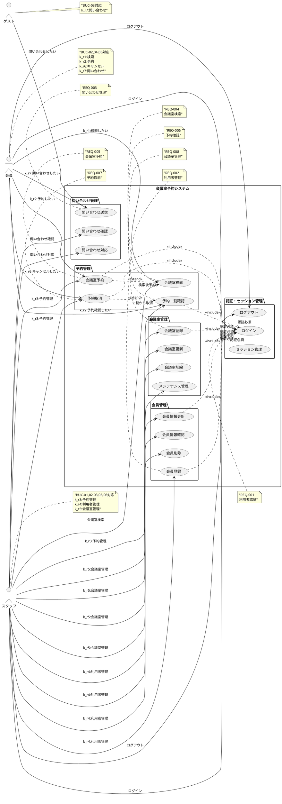
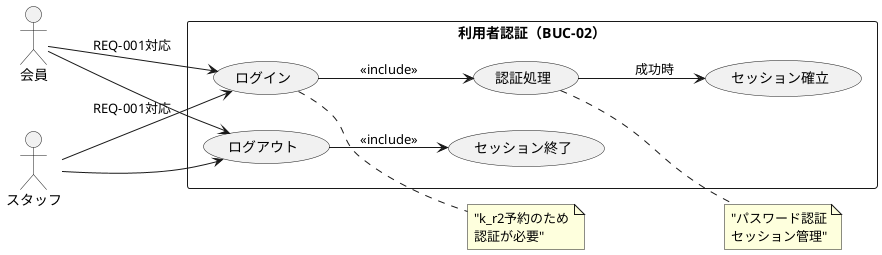
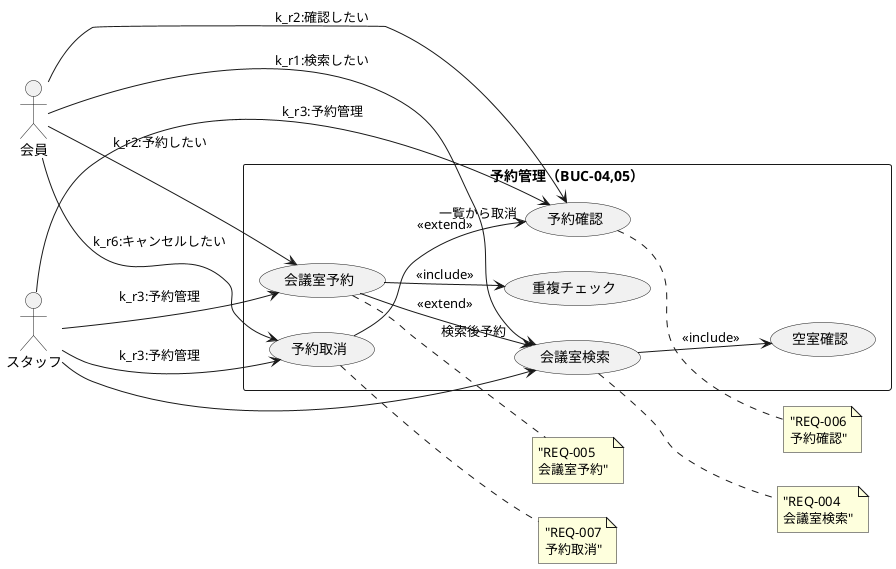
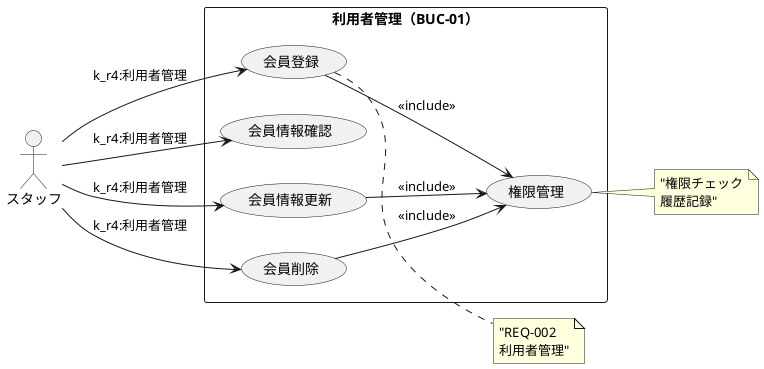
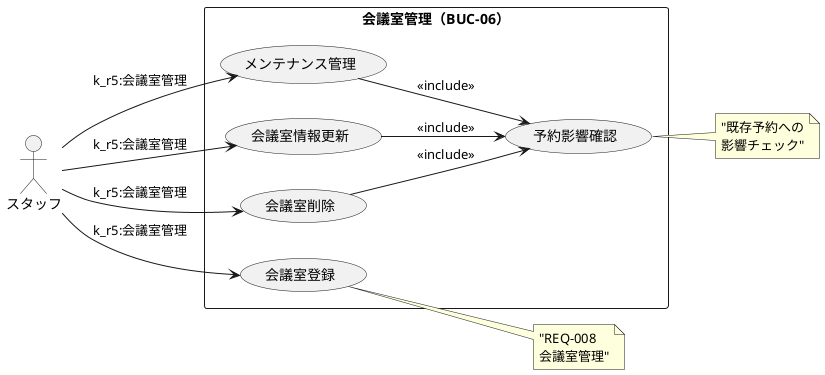
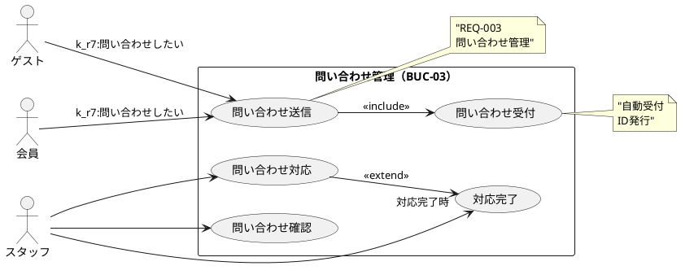
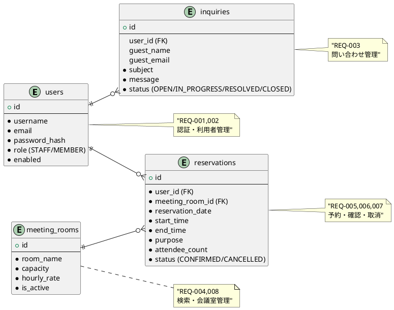

# 会議室予約システム - 要件定義書

## プロジェクト概要

### ビジネス課題

**現状の問題：**
- 会員が会議室の空き状況をリアルタイムで確認できない
- 予約は窓口への電話・来訪が必要で不便
- スタッフが予約管理に時間を取られ、他の業務に集中できない
- 会議室の稼働率が見えず、運営最適化ができない

**解決すべき根本問題：**
「会議室利用に関する全ての作業が手動で、利用者・運営者双方に非効率な負荷をかけている」

### ビジネス価値

**プライマリーゴール：** 会議室利用の完全セルフサービス化

**期待する成果：**
- 窓口への予約関連問い合わせ 80% 削減
- 会議室稼働率 20% 向上  
- 新規会員登録 50% 増加
- スタッフの単純作業時間 70% 削減

## ステークホルダー分析

### 会員（有料利用者）
- **現在の課題：** 空き状況確認と予約に手間がかかる
- **求める価値：** いつでも自分で会議室利用を完結したい
- **成功指標：** 予約完了までの所要時間 90% 短縮

### スタッフ（窓口担当）
- **現在の課題：** 予約管理業務に追われている
- **求める価値：** ルーチンワークを削減し、付加価値業務に集中したい  
- **成功指標：** 予約関連問い合わせ対応時間 80% 削減

### ゲスト（潜在顧客）
- **現在の課題：** サービス内容・料金が不明確
- **求める価値：** サービス詳細を知り、利用を検討したい
- **成功指標：** Web 経由での問い合わせ 100% 増加

### 施設運営者（経営判断者）
- **現在の課題：** 稼働率や収益が見えない
- **求める価値：** データに基づく運営最適化
- **成功指標：** 会議室稼働率・収益の可視化

## システム全体ユースケース図

## MVP（最小限の価値提供）機能

### フェーズ1：セルフ予約の中核機能

#### 会員向けコア機能
- **REQ-004：会議室検索**（k_r1対応）- 日時、定員で空室検索
- **REQ-005：予約作成**（k_r2対応）- 重複チェック付きでワンクリック予約
- **REQ-006：予約一覧**（k_r2対応）- 自分の予約をわかりやすく表示
- **REQ-007：予約キャンセル**（k_r6対応）- 事前キャンセルをワンクリックで実行

#### スタッフ向け最小機能  
- **REQ-008：会議室登録**（k_r5対応）- 名前・定員・時間単価の基本情報登録
- **REQ-005,006,007：予約管理**（k_r3対応）- 全予約の確認と必要時の強制キャンセル
- **REQ-002：会員登録**（k_r4対応）- 会員の基本情報を手動登録

#### ゲスト向け最小機能
- **REQ-003：問い合わせフォーム**（k_r7対応）- 基本的な連絡手段

#### システム基盤機能
- **REQ-001：認証** - 会員・スタッフのログイン/ログアウト

## 機能要件（EARS記法）

### 1. 会員管理ドメイン

#### REQ-001: 利用者認証（BUC-02）
**トレーサビリティ:** k_r2（予約要求）→ BUC-02（利用者認証）

**WHEN** 会員またはスタッフがシステムにアクセスする  
**GIVEN** 有効なユーザー名とパスワードを入力した場合  
**THEN** システムは認証を実行する  
**AND** 成功時はログイン状態を確立し、権限に応じたメニューを表示する  

**WHILE** 利用者がログイン状態にある間  
**THE SYSTEM SHALL** セッションを維持する  
**AND** 2時間の非アクティブでセッションを自動終了する  

#### REQ-002: 利用者管理（BUC-01）
**トレーサビリティ:** k_r4（利用者を管理したい）→ BUC-01（利用者の管理）

**WHEN** スタッフが会員情報を管理する必要がある場合  
**GIVEN** 適切な権限を持つスタッフアカウントでログインしている  
**THEN** システムは会員の登録、更新、確認、削除機能を提供する  
**AND** 変更履歴を自動記録する  

#### REQ-003: 問い合わせ管理（BUC-03）
**トレーサビリティ:** k_r7（問い合わせをしたい）→ BUC-03（問い合わせ管理）

**WHEN** ゲストまたは会員が問い合わせを送信する  
**GIVEN** 氏名、メール、件名、内容が入力されている  
**THEN** システムは問い合わせを受け付け、一意のIDを発行する  
**AND** スタッフに通知する  

**WHILE** スタッフが問い合わせ対応を実施している間  
**THE SYSTEM SHALL** 対応状況を管理する  
**AND** 対応履歴を記録する  

### 2. 予約管理ドメイン

#### REQ-004: 会議室検索（BUC-04）
**トレーサビリティ:** k_r1（会議室を検索したい）→ BUC-04（会議室の検索）

**WHEN** 会員またはスタッフが空き会議室を探す必要がある  
**GIVEN** 利用希望日時、時間、人数を指定した場合  
**THEN** システムは条件に合致する利用可能な会議室を検索する  
**AND** 3秒以内に結果を一覧表示する  

**WHERE** 検索条件が指定された場合  
**THE SYSTEM SHALL** 現在時刻以降の日時のみを検索対象とする  
**AND** 過去の日時は検索対象から除外する  

#### REQ-005: 会議室予約（BUC-05）
**トレーサビリティ:** k_r2（会議室を予約したい）→ BUC-05（会議室の予約）

**WHEN** 会員またはスタッフが会議室を予約する  
**GIVEN** 利用可能な会議室を選択し、予約詳細を入力した場合  
**THEN** システムは重複チェックを実行する  
**AND** 問題がなければ予約を確定し、一意の予約IDを発行する  

**WHILE** 予約処理を実行している間  
**THE SYSTEM SHALL** 同一会議室・同一時間帯の重複を禁止する  
**AND** 1会員あたり最大3件の同時予約制限を適用する  

**WHERE** 利用開始時刻まで2時間を切っている場合  
**THE SYSTEM SHALL** 新規予約を拒否する  

#### REQ-006: 予約確認
**トレーサビリティ:** k_r2（予約管理の一環）→ BUC-05（会議室の予約）

**WHEN** 会員が自分の予約状況を確認したい  
**GIVEN** ログイン済みの会員である  
**THEN** システムは該当会員の予約一覧を表示する  
**AND** 予約詳細（日時、会議室、料金、ステータス）を含む  

#### REQ-007: 予約取消（BUC-05）
**トレーサビリティ:** k_r6（予約をキャンセルしたい）→ BUC-05（会議室の予約）

**WHEN** 会員が予約をキャンセルする必要がある  
**GIVEN** 自分の有効な予約を選択した場合  
**THEN** システムはキャンセル実行を確認する  
**AND** 確認後にキャンセルを処理し、会議室を再利用可能にする  

**WHERE** 利用開始時刻まで2時間を切っている場合  
**THE SYSTEM SHALL** キャンセルを拒否する  

#### REQ-008: 会議室管理（BUC-06）
**トレーサビリティ:** k_r5（会議室を管理したい）→ BUC-06（会議室の登録）

**WHEN** スタッフが会議室情報を管理する必要がある  
**GIVEN** 適切な権限を持つスタッフアカウントでログインしている  
**THEN** システムは会議室の登録、更新、削除機能を提供する  
**AND** 会議室の基本情報（名前、定員、時間単価、設備）を管理できる  

**WHILE** 会議室にメンテナンスが必要な期間  
**THE SYSTEM SHALL** 該当会議室を予約対象から除外する  
**AND** 既存予約に影響しないよう制御する

## ビジネスユースケース詳細図

### BUC-02: 利用者認証

### BUC-04,05: 予約管理

### BUC-01: 利用者管理

### BUC-06: 会議室管理

### BUC-03: 問い合わせ管理

## 非機能要件

### 性能要件
| 項目 | 目標値 | 測定条件 |
|------|--------|----------|
| 画面表示時間 | 3秒以内 | 通常時の画面読み込み |
| 予約処理時間 | 5秒以内 | 重複チェック含む予約確定 |
| 検索処理時間 | 2秒以内 | 会議室検索結果表示 |
| 同時利用者数 | 30名 | 小規模施設想定 |

### 可用性要件
| 項目 | 目標値 |
|------|--------|
| 稼働率 | 平日9:00-18:00で99% |
| 復旧時間 | 営業時間内2時間以内 |
| メンテナンス時間 | 月1回、深夜時間帯2時間以内 |

### セキュリティ要件
| 項目 | 仕様 |
|------|------|
| 認証方式 | パスワード認証＋セッション管理 |
| パスワード | BCryptハッシュ化、8文字以上 |
| 通信暗号化 | HTTPS必須（TLS1.2以上） |
| アクセス制御 | ロール基準（会員・スタッフ） |
| セッション | 2時間でタイムアウト |

### ユーザビリティ要件
| 項目 | 基準 |
|------|------|
| 操作性 | 説明なしで予約完了が可能 |
| エラーメッセージ | わかりやすい日本語表記 |
| 対応ブラウザ | Chrome・Firefox・Safari・Edge最新版 |
| 画面サイズ | PC・タブレット対応（スマホは対象外） |

### 運用要件
| 項目 | 基準 |
|------|------|
| データ保持期間 | 予約データ3年間 |
| バックアップ | 日次、差分バックアップ |
| ログ保持 | 操作ログ6ヶ月間保持 |
| 監視 | 死活監視・エラー監視 |

## データモデル（概要）

### エンティティ関係図

### 主要制約

| エンティティ | 主な制約 | 対応要件 |
|-------------|----------|----------|
| **users** | username/email一意制約 | REQ-001,002 |
| **meeting_rooms** | capacity > 0, hourly_rate >= 0 | REQ-004,008 |
| **reservations** | 重複予約防止、営業時間内(9:00-22:00)、最大6時間 | REQ-005,006,007 |
| **inquiries** | ゲスト(user_id=null)または会員識別 | REQ-003 |

### ビジネスルール
- 同一会議室・同一時間帯の重複予約禁止
- 1会員あたり同時予約3件まで
- 利用開始2時間前以降のキャンセル禁止
- 営業時間外（22:00-9:00）の予約禁止

## リスクと制約事項

### 技術リスク
- **同時予約の競合**：楽観的ロックで対応
- **性能劣化**：データベースインデックス最適化
- **セキュリティ**：最小限の認証実装

### 運用リスク  
- **データ消失**：定期バックアップ
- **障害対応**：シンプルな構成で運用負荷軽減

### ビジネスリスク
- **利用者の操作ミス**：直感的UI設計
- **スタッフの運用変更**：段階的導入・研修

## 成功の測定

### KPI（Key Performance Indicators）
| 指標 | 現状（仮定） | 目標 | 測定時期 |
|------|-------------|------|----------|
| 窓口問い合わせ件数 | 100件/月 | 20件/月 | リリース3ヶ月後 |
| 会議室稼働率 | 60% | 80% | リリース6ヶ月後 |
| 新規会員登録数 | 10名/月 | 15名/月 | リリース3ヶ月後 |
| 予約完了までの時間 | 30分 | 3分 | リリース直後 |

### 成功条件
1. **利用者満足度**：「使いやすい」評価80%以上
2. **運用効率化**：スタッフの予約関連業務時間70%削減  
3. **システム安定性**：稼働率99%達成
4. **ROI**：開発費用を12ヶ月で回収

## 技術要件

### 1. システムアーキテクチャ

| 項目 | 仕様 | バージョン | 理由・備考 |
|------|------|------------|------------|
| **アーキテクチャパターン** | ヘキサゴナルアーキテクチャ + Clean Architecture | - | ポートとアダプターによる疎結合設計、ドメイン駆動設計 |
| **API設計** | RESTful API | OpenAPI 3.0 | 標準準拠、自動ドキュメント生成 |
| **レイヤー構成** | 4層（Presentation, Application, Domain, Infrastructure） | - | 依存関係逆転の原則 |

### 2. バックエンド技術スタック

| カテゴリ | 技術・ツール | バージョン | 用途・理由 |
|----------|--------------|------------|------------|
| **言語** | Java | 21 LTS | 長期サポート、最新機能活用 |
| **フレームワーク** | Spring Boot | 3.3.2 | エンタープライズ標準、豊富な機能 |
| **Web** | Spring Web MVC | 6.1+ | REST API、MVC パターン |
| **セキュリティ** | Spring Security | 6.1+ | 認証・認可、セキュリティフレームワーク |
| **データアクセス** | MyBatis | 3.5.13+ | SQL マッパーフレームワーク、柔軟なクエリ制御 |
| **認証** | JWT (jjwt) | 0.12.5 | ステートレス認証、トークンベース |
| **バリデーション** | Bean Validation | 3.0 | リクエストデータ検証 |
| **監視** | Spring Boot Actuator | 3.1+ | アプリケーション監視、メトリクス |
| **ビルドツール** | Gradle | 8.3+ | 依存関係管理、ビルド自動化 |

### 3. データベース・永続化

| 項目 | 技術・仕様 | バージョン | 用途・設定 |
|------|------------|------------|------------|
| **本番データベース** | PostgreSQL | 16+ | 主データストア、ACID準拠 |
| **テストデータベース** | H2 Database | 2.2+ | インメモリ、高速テスト |
| **マイグレーション** | Flyway | 9.22+ | スキーマバージョン管理 |
| **接続プール** | HikariCP | 5.0+ | 高性能コネクションプール |

### 4. フロントエンド技術スタック

| カテゴリ | 技術・ツール | バージョン | 用途・理由 |
|----------|--------------|------------|------------|
| **言語** | TypeScript | 5.0+ | 型安全性、開発効率向上 |
| **フレームワーク** | React | 18.2+ | コンポーネントベース UI |
| **ビルドツール** | Vite | 4.4+ | 高速ビルド、HMR |
| **状態管理** | Redux Toolkit | 1.9+ | 予測可能な状態管理 |
| **API通信** | Axios | 1.5+ | HTTP クライアント |
| **データフェッチング** | React Query (TanStack Query) | 4.32+ | サーバー状態管理、キャッシング |
| **ルーティング** | React Router | 6.15+ | SPA ルーティング |
| **UIライブラリ** | Material-UI (MUI) | 5.14+ | デザインシステム、コンポーネント |
| **フォーム** | React Hook Form | 7.45+ | フォームバリデーション |

### 5. テスト技術スタック

| テストレベル | 技術・ツール | バージョン | 用途・カバレッジ |
|--------------|--------------|------------|------------------|
| **ユニットテスト** | JUnit 5 | 5.10+ | 単体テスト (70%) |
| **モック** | Mockito | 5.5+ | オブジェクトモック |
| **統合テスト** | TestContainers | 1.19+ | 実データベーステスト (25%) |
| **E2E テスト** | Cypress | 12.17+ | エンドツーエンドテスト (5%) |
| **フロントエンドテスト** | Vitest + React Testing Library | 1.6+ / 13.4+ | UI コンポーネントテスト |
| **カバレッジ** | JaCoCo | 0.8.10 | コードカバレッジ測定 |

### 6. セキュリティ技術

| カテゴリ | 技術・設定 | 詳細 |
|----------|------------|------|
| **認証方式** | JWT + Spring Security | Bearer Token、RS256署名 |
| **パスワード暗号化** | BCrypt | コスト係数 12 |
| **HTTPS** | TLS 1.3 | 通信暗号化必須 |
| **CORS** | Spring Security CORS | オリジン制限設定 |
| **セキュリティヘッダー** | HSTS, CSP, X-Frame-Options | ブラウザセキュリティ強化 |
| **監査ログ** | Spring AOP + Database | 全操作記録 |

### 7. 開発・運用環境

| 環境種別 | 技術・ツール | バージョン | 用途・設定 |
|----------|--------------|------------|------------|
| **コンテナ** | Docker | 24+ | アプリケーションコンテナ化 |
| **オーケストレーション** | Docker Compose | 2.20+ | 開発環境構築 |
| **API ドキュメント** | Swagger UI + OpenAPI | 3.0 | 自動API仕様生成 |
| **開発サーバー** | Embedded Tomcat | 10.1+ | 組み込みWebサーバー |

### 8. 品質管理・CI/CD

| カテゴリ | 技術・ツール | バージョン | 用途・設定 |
|----------|--------------|------------|------------|
| **CI/CD** | GitHub Actions | - | 継続的インテグレーション |
| **静的解析** | PMD | 7.0+ | コード品質チェック |
| **コードスタイル** | Checkstyle | 10.12+ | コーディング規約チェック |
| **バグ検出** | SpotBugs | 4.8+ | 潜在的バグ検出 |
| **セキュリティ** | OWASP Dependency Check | 8.4+ | 脆弱性スキャン |

### 9. パフォーマンス設定

| 項目 | 設定値 | 用途・理由 |
|------|--------|------------|
| **JVM ヒープサイズ** | 512MB (開発), 1GB (本番) | メモリ使用量最適化 |
| **データベース接続プール** | 最大20、最小5 | 接続リソース管理 |
| **HTTP/2** | 有効 | 通信効率向上 |
| **Gzip圧縮** | 有効 | レスポンスサイズ削減 |

### 10. 運用・監視

| 監視項目 | ツール | 閾値・設定 |
|----------|--------|------------|
| **APM** | Spring Boot Actuator + Micrometer | メトリクス収集 |
| **ヘルスチェック** | /actuator/health | 30秒間隔 |
| **レスポンス時間** | 監視ツール | 95%ile > 3秒でアラート |
| **エラー率** | 監視ツール | 5% でアラート |
| **ログレベル** | Logback | INFO (本番), DEBUG (開発) |

## 今回対象外（WONT）

- 決済機能（現金決済継続）
- 複雑な権限管理（管理者・一般のみ）
- 多言語対応
- スマートフォン最適化
- AI・機械学習機能
- 外部システム連携
- リアルタイム通知
- 詳細な分析・レポート機能

## 段階的リリース計画

### フェーズ1：MVP（リリース目標：3ヶ月）
- 会員ログイン・予約・キャンセル
- スタッフ管理機能
- 基本的な問い合わせフォーム

### フェーズ2：機能拡張（MVP+3ヶ月）  
- 予約変更機能
- 問い合わせ管理画面
- 利用履歴表示

### フェーズ3：最適化（MVP+6ヶ月）
- 稼働率レポート
- 決済機能検討
- スマホ対応検討

## トレーサビリティマトリクス

### ユーザー要求 → ビジネスユースケース → システム要件

| ユーザー要求ID | 要求内容 | ビジネスユースケース | システム要件 |
|---------------|----------|---------------------|-------------|
| k_r1 | 利用可能な会議室があるかをWebで検索したい | BUC-04（会議室の検索） | REQ-004 |
| k_r2 | 利用可能な会議室をWebで予約したい | BUC-05（会議室の予約） BUC-02（利用者認証） | REQ-005, REQ-006 REQ-001 |
| k_r6 | 予約をWebでキャンセルしたい | BUC-05（会議室の予約） | REQ-007 |
| k_r7 | サービス内容の問い合わせをしたい | BUC-03（問い合わせ管理） | REQ-003 |
| k_r3 | 会員の予約を管理したい | BUC-05（会議室の予約） | REQ-005, REQ-006, REQ-007 |
| k_r4 | 利用者を管理したい | BUC-01（利用者の管理） | REQ-002 |
| k_r5 | 会議室を管理したい | BUC-06（会議室の登録） | REQ-008 |

### ビジネスユースケース詳細

| BUC ID | ビジネスユースケース名 | 主要アクター | 関連システム要件 |
|--------|----------------------|--------------|------------------|
| BUC-01 | 利用者の管理 | スタッフ | REQ-002 |
| BUC-02 | 利用者の認証 | 会員、スタッフ | REQ-001 |
| BUC-03 | 問い合わせ管理 | 会員、ゲスト、スタッフ | REQ-003 |
| BUC-04 | 会議室の検索 | 会員、スタッフ | REQ-004 |
| BUC-05 | 会議室の予約 | 会員、スタッフ | REQ-005, REQ-006, REQ-007 |
| BUC-06 | 会議室の登録 | スタッフ | REQ-008 |

### システム要件カバレッジ

| システム要件ID | 要件名 | 優先度 | ユーザー要求の根拠 | テストケース |
|---------------|-------|--------|-------------------|--------------|
| REQ-001 | 利用者認証 | MUST | k_r2（予約には認証が必要） | TC-001 |
| REQ-002 | 利用者管理 | MUST | k_r4（スタッフの管理業務） | TC-002 |
| REQ-003 | 問い合わせ管理 | SHOULD | k_r7（サービス問い合わせ） | TC-003 |
| REQ-004 | 会議室検索 | MUST | k_r1（空室検索） | TC-004 |
| REQ-005 | 会議室予約 | MUST | k_r2（予約作成） | TC-005 |
| REQ-006 | 予約確認 | MUST | k_r2（予約管理の一環） | TC-006 |
| REQ-007 | 予約取消 | MUST | k_r6（キャンセル機能） | TC-007 |
| REQ-008 | 会議室管理 | MUST | k_r5（会議室情報管理） | TC-008 |

### 網羅性確認

**すべてのユーザー要求が対応済み：**
- ✅ k_r1: 会議室検索 → REQ-004
- ✅ k_r2: 会議室予約 → REQ-001, REQ-005, REQ-006  
- ✅ k_r6: 予約キャンセル → REQ-007
- ✅ k_r7: 問い合わせ → REQ-003
- ✅ k_r3: 予約管理 → REQ-005, REQ-006, REQ-007
- ✅ k_r4: 利用者管理 → REQ-002
- ✅ k_r5: 会議室管理 → REQ-008

**すべてのビジネスユースケースが対応済み：**
- ✅ BUC-01: 利用者の管理 → REQ-002
- ✅ BUC-02: 利用者の認証 → REQ-001
- ✅ BUC-03: 問い合わせ管理 → REQ-003
- ✅ BUC-04: 会議室の検索 → REQ-004
- ✅ BUC-05: 会議室の予約 → REQ-005, REQ-006, REQ-007
- ✅ BUC-06: 会議室の登録 → REQ-008

---

**この要件定義書は、既存のビジネスユースケース分析との完全なトレーサビリティを確保し、EARS記法により明確で検証可能な要件として定義されています。**