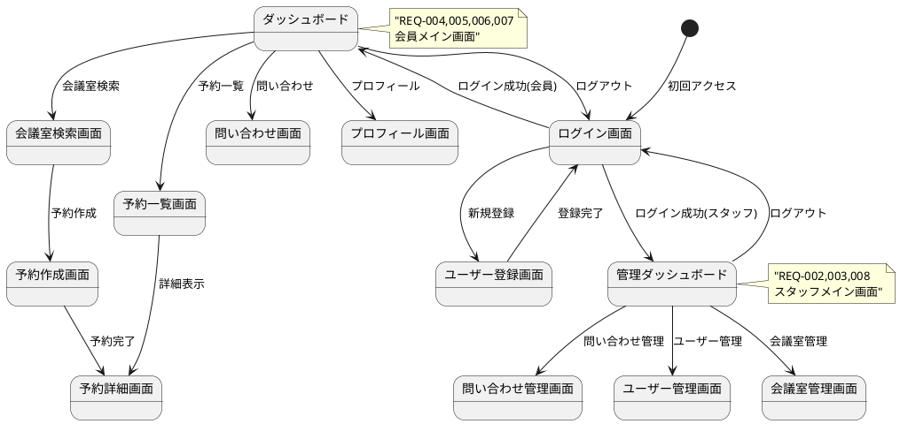
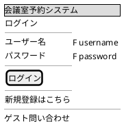
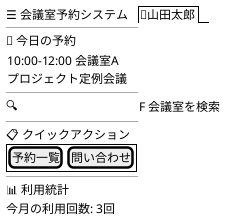
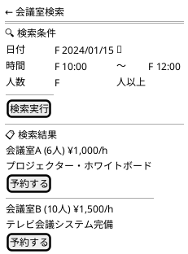
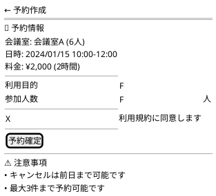
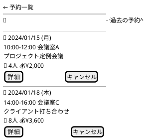
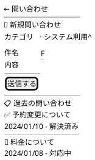
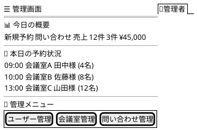

# 会議室予約システム - UI/UX設計書

## UI/UX設計概要

### デザイン原則
- **ユーザーファースト**: 直感的で分かりやすいインターフェース
- **レスポンシブデザイン**: モバイル・タブレット・デスクトップ対応
- **アクセシビリティ**: WCAG 2.1 AA準拠
- **一貫性**: 統一されたデザインシステム

### 技術仕様
- **フレームワーク**: React 18.2+ with TypeScript
- **UIライブラリ**: Material-UI (MUI) 5.14+
- **状態管理**: Redux Toolkit + React Query
- **ルーティング**: React Router 6.15+
- **レスポンシブ**: Mobile First アプローチ

## ユーザージャーニー分析

### 主要ユーザーペルソナ

#### 1. 一般会員（田中さん - 30代会社員）
- **目標**: 効率的に会議室を予約したい
- **課題**: 時間がない、操作に迷いたくない
- **行動**: モバイルからの利用が多い

#### 2. 企業管理者（佐藤さん - 40代部長）
- **目標**: チーム全体の予約を管理したい
- **課題**: 複数の予約を効率的に処理したい
- **行動**: デスクトップからの利用が多い

#### 3. システム管理者（山田さん - 50代スタッフ）
- **目標**: システム全体の運用管理
- **課題**: 問い合わせ対応、データ分析
- **行動**: 管理画面での作業が中心

## 画面設計

### 画面一覧・遷移図



## ワイヤーフレーム設計

### 1. ログイン画面（REQ-001）



**UI要素詳細**:
- Material-UI Textfield (outlined)
- Password visibility toggle
- Remember me checkbox
- Guest inquiry link
- Responsive design (Mobile: full width, Desktop: center card)

### 2. ダッシュボード（会員用）



**機能要素**:
- Navigation drawer (mobile) / App bar (desktop)
- Today's reservations card
- Quick search bar
- Action buttons grid
- Usage statistics widgets

### 3. 会議室検索画面（REQ-004）



**インタラクション**:
- Date picker with calendar
- Time range selector
- Real-time availability check
- Filter and sort options
- Room detail modal

### 4. 予約作成画面（REQ-005）



**バリデーション**:
- Required field validation
- Business hours check
- Capacity validation
- Terms agreement required

### 5. 予約一覧画面（REQ-006）



**表示機能**:
- Tab navigation (upcoming/past)
- Group by date
- Status indicators
- Quick action buttons
- Pull-to-refresh (mobile)

### 6. 問い合わせ画面（REQ-003）



### 7. 管理ダッシュボード（スタッフ用）



## デザインシステム

### カラーパレット

```css
:root {
  /* Primary Colors */
  --primary-main: #1976d2;     /* メインブルー */
  --primary-light: #42a5f5;    /* ライトブルー */
  --primary-dark: #1565c0;     /* ダークブルー */
  
  /* Secondary Colors */
  --secondary-main: #dc004e;    /* アクセントピンク */
  --secondary-light: #ff5983;   /* ライトピンク */
  --secondary-dark: #9a0036;    /* ダークピンク */
  
  /* Status Colors */
  --success: #2e7d32;          /* 成功・確定 */
  --warning: #ed6c02;          /* 注意・保留 */
  --error: #d32f2f;            /* エラー・キャンセル */
  --info: #0288d1;             /* 情報 */
  
  /* Neutral Colors */
  --grey-50: #fafafa;
  --grey-100: #f5f5f5;
  --grey-300: #e0e0e0;
  --grey-500: #9e9e9e;
  --grey-700: #616161;
  --grey-900: #212121;
}
```

### タイポグラフィ

```css
/* 日本語フォントスタック */
.typography {
  font-family: 
    "Noto Sans JP", 
    "Hiragino Sans", 
    "Yu Gothic UI", 
    "Meiryo UI", 
    sans-serif;
}

/* 見出し */
.h1 { font-size: 2.125rem; font-weight: 500; } /* 34px */
.h2 { font-size: 1.5rem; font-weight: 500; }   /* 24px */
.h3 { font-size: 1.25rem; font-weight: 500; }  /* 20px */
.h4 { font-size: 1.125rem; font-weight: 500; } /* 18px */

/* 本文 */
.body1 { font-size: 1rem; font-weight: 400; }     /* 16px */
.body2 { font-size: 0.875rem; font-weight: 400; } /* 14px */

/* キャプション */
.caption { font-size: 0.75rem; font-weight: 400; } /* 12px */
```

### コンポーネントライブラリ

#### 1. Buttons
```typescript
// Primary Button
<Button variant="contained" color="primary">
  予約する
</Button>

// Secondary Button  
<Button variant="outlined" color="secondary">
  キャンセル
</Button>

// Text Button
<Button variant="text">
  詳細を見る
</Button>
```

#### 2. Form Components
```typescript
// Text Input
<TextField
  label="ユーザー名"
  variant="outlined"
  fullWidth
  required
  error={hasError}
  helperText={errorMessage}
/>

// Select
<FormControl fullWidth>
  <InputLabel>カテゴリ</InputLabel>
  <Select value={category} onChange={handleChange}>
    <MenuItem value="RESERVATION">予約関連</MenuItem>
    <MenuItem value="SYSTEM">システム利用</MenuItem>
  </Select>
</FormControl>

// Date Picker
<DatePicker
  label="予約日"
  value={selectedDate}
  onChange={handleDateChange}
  renderInput={(params) => <TextField {...params} />}
/>
```

#### 3. Data Display
```typescript
// Card Component
<Card elevation={2}>
  <CardHeader
    title="会議室A"
    subheader="収容人数: 6名"
    action={<IconButton><MoreVert /></IconButton>}
  />
  <CardContent>
    <Typography variant="body2">
      プロジェクター・ホワイトボード完備
    </Typography>
  </CardContent>
  <CardActions>
    <Button size="small">詳細</Button>
    <Button size="small">予約</Button>
  </CardActions>
</Card>

// List Component
<List>
  <ListItem divider>
    <ListItemText
      primary="2024/01/15 10:00-12:00"
      secondary="会議室A - プロジェクト会議"
    />
    <ListItemSecondaryAction>
      <Chip label="確定" color="success" size="small" />
    </ListItemSecondaryAction>
  </ListItem>
</List>
```

## レスポンシブデザイン

### ブレークポイント
```css
/* Mobile First */
.container {
  padding: 16px;
}

/* Tablet (768px+) */
@media (min-width: 768px) {
  .container {
    padding: 24px;
    max-width: 800px;
    margin: 0 auto;
  }
}

/* Desktop (1024px+) */
@media (min-width: 1024px) {
  .container {
    padding: 32px;
    max-width: 1200px;
  }
  
  .grid {
    display: grid;
    grid-template-columns: 1fr 2fr;
    gap: 24px;
  }
}
```

### モバイル最適化
- Touch target: 最小44px
- Thumb zone: 下部1/3にメインアクション
- Swipe gestures: 予約リストでの削除
- Pull-to-refresh: リスト画面での更新

## アクセシビリティ対応

### WCAG 2.1 AA準拠

#### 1. キーボードナビゲーション
```typescript
// Focus management
const handleKeyDown = (event: KeyboardEvent) => {
  if (event.key === 'Enter' || event.key === ' ') {
    handleSubmit();
  }
};

// Skip links
<SkipLink href="#main-content">
  メインコンテンツへスキップ
</SkipLink>
```

#### 2. スクリーンリーダー対応
```typescript
// Semantic HTML
<main role="main" aria-labelledby="page-title">
  <h1 id="page-title">会議室検索</h1>
  <section aria-labelledby="search-form">
    <h2 id="search-form">検索条件</h2>
    {/* form content */}
  </section>
</main>

// ARIA labels
<Button aria-label="会議室Aの詳細を表示">
  詳細
</Button>

<TextField
  label="参加人数"
  aria-describedby="attendee-help"
/>
<FormHelperText id="attendee-help">
  会議室の収容人数以下で入力してください
</FormHelperText>
```

#### 3. カラーコントラスト
- テキスト: 4.5:1 以上
- 大きいテキスト: 3:1 以上
- UI要素: 3:1 以上

### エラーハンドリング・フィードバック

```typescript
// Success message
<Alert severity="success" role="alert">
  予約が完了しました
</Alert>

// Error message
<Alert severity="error" role="alert">
  <AlertTitle>予約エラー</AlertTitle>
  選択された時間帯は既に予約されています
</Alert>

// Loading state
<Button disabled startIcon={<CircularProgress size={20} />}>
  処理中...
</Button>
```

## パフォーマンス最適化

### 1. 画像最適化
- WebP format with fallback
- Responsive images with srcset
- Lazy loading for below-the-fold content

### 2. バンドル最適化
```typescript
// Code splitting
const AdminDashboard = lazy(() => import('./pages/AdminDashboard'));
const UserManagement = lazy(() => import('./pages/UserManagement'));

// Tree shaking
import { Button } from '@mui/material/Button';
import { TextField } from '@mui/material/TextField';
```

### 3. API最適化
- React Query for caching
- Pagination for lists
- Optimistic updates

---

**この UI/UX 設計書は、要件定義書 REQ-001〜REQ-008 を満たし、ユーザビリティ・アクセシビリティ・保守性を考慮した実装可能な設計です。**