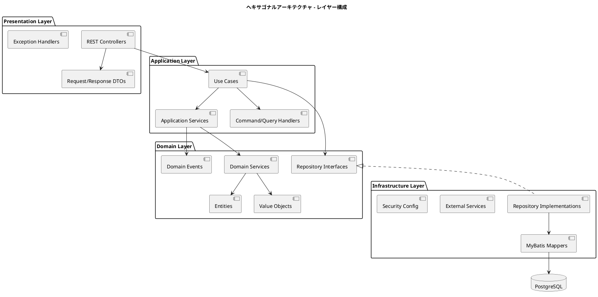
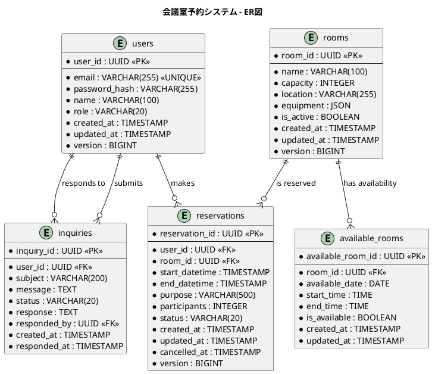
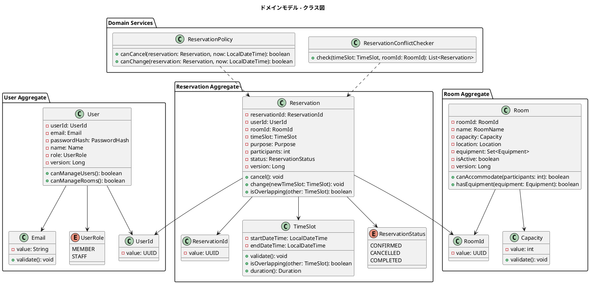
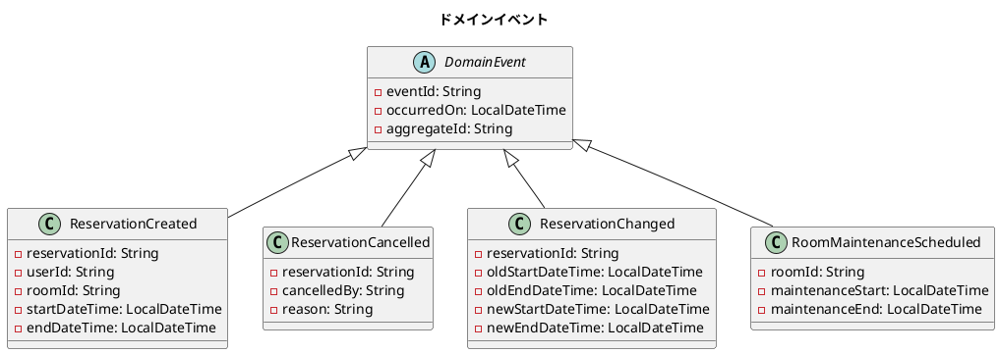
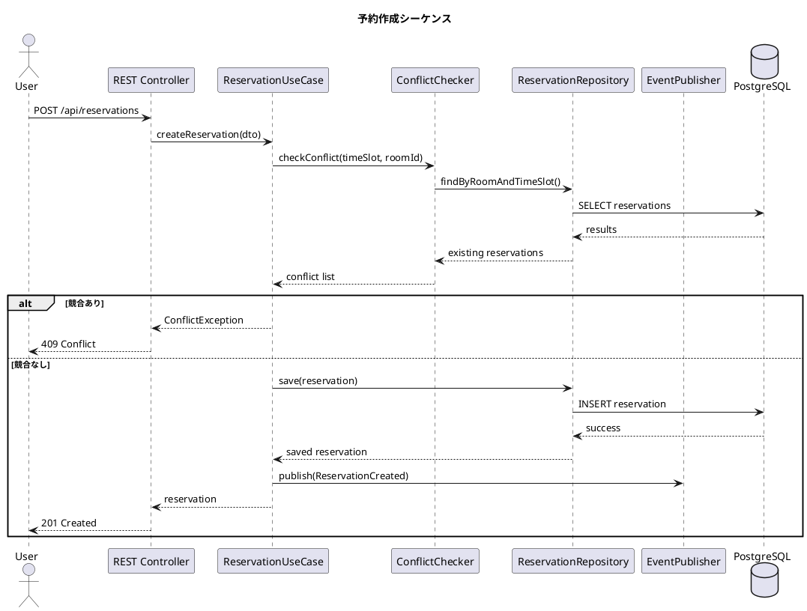
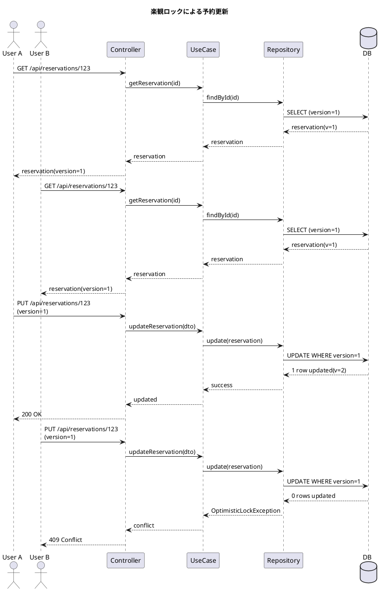
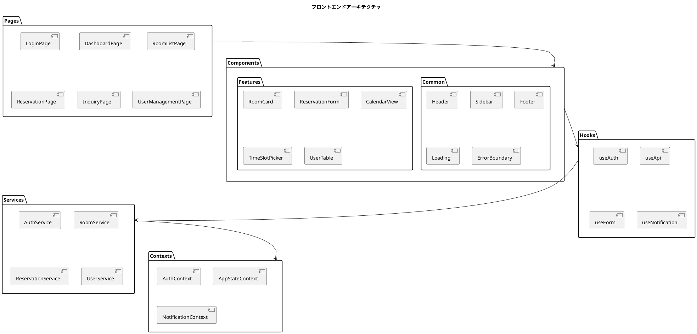
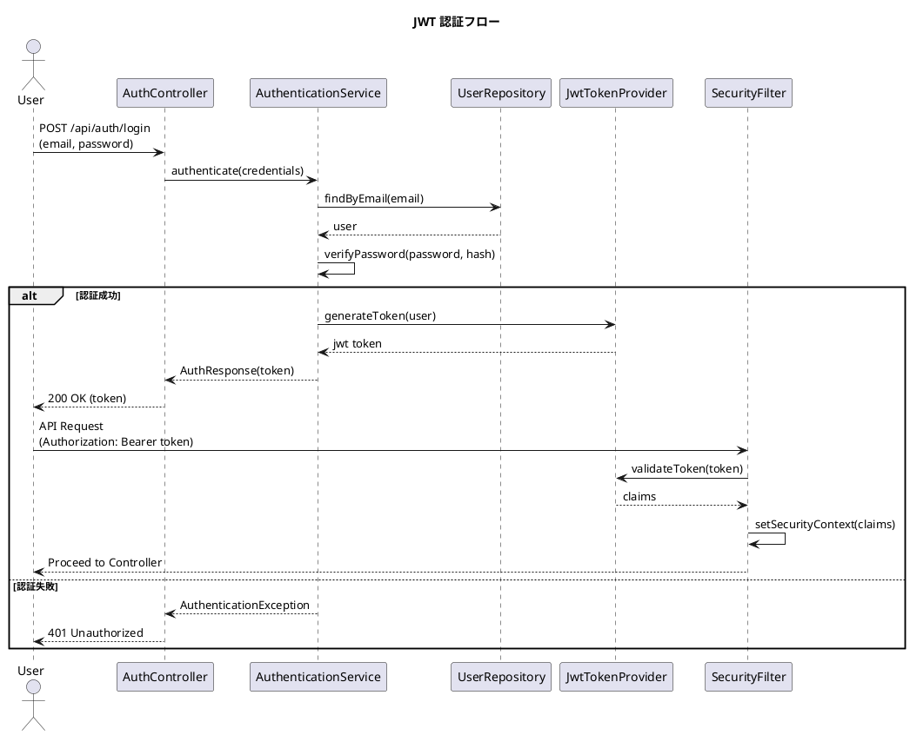

# 会議室予約システム - 設計書

## 1. システムアーキテクチャ

### 1.1 全体アーキテクチャ



### 1.2 プロジェクト構造

```
ai-programing-exercise/
├── app/
│   ├── backend/                         # バックエンド (Spring Boot)
│   │   ├── src/
│   │   │   ├── main/
│   │   │   │   ├── java/
│   │   │   │   │   └── com/example/mrs/
│   │   │   │   │       ├── domain/                    # ドメイン層
│   │   │   │   │       │   ├── model/
│   │   │   │   │       │   │   ├── user/              # 利用者集約
│   │   │   │   │       │   │   ├── room/              # 会議室集約
│   │   │   │   │       │   │   ├── reservation/       # 予約集約
│   │   │   │   │       │   │   └── inquiry/           # 問い合わせ集約
│   │   │   │   │       │   ├── repository/            # リポジトリインターフェース
│   │   │   │   │       │   └── service/               # ドメインサービス
│   │   │   │   │       ├── application/               # アプリケーション層
│   │   │   │   │       │   ├── usecase/              # ユースケース
│   │   │   │   │       │   ├── service/              # アプリケーションサービス
│   │   │   │   │       │   └── dto/                  # アプリケーション用DTO
│   │   │   │   │       ├── infrastructure/           # インフラ層
│   │   │   │   │       │   ├── persistence/          # 永続化実装
│   │   │   │   │       │   │   ├── mybatis/         # MyBatis設定
│   │   │   │   │       │   │   └── repository/      # リポジトリ実装
│   │   │   │   │       │   ├── security/            # セキュリティ設定
│   │   │   │   │       │   └── external/            # 外部サービス連携
│   │   │   │   │       └── presentation/            # プレゼンテーション層
│   │   │   │   │           ├── rest/               # REST API
│   │   │   │   │           ├── dto/                # Request/Response DTO
│   │   │   │   │           └── handler/            # 例外ハンドラー
│   │   │   │   └── resources/
│   │   │   │       ├── application.yml        # アプリケーション設定
│   │   │   │       ├── mybatis/              # MyBatis マッパー XML
│   │   │   │       └── db/migration/         # Flyway マイグレーション
│   │   │   └── test/
│   │   ├── build.gradle.kts                  # Gradle ビルド設定
│   │   └── settings.gradle.kts
│   │
│   └── frontend/                        # フロントエンド (React + TypeScript)
│       ├── src/
│       │   ├── components/              # React コンポーネント
│       │   │   ├── common/              # 共通コンポーネント
│       │   │   ├── auth/                # 認証関連
│       │   │   ├── room/                # 会議室関連
│       │   │   ├── reservation/         # 予約関連
│       │   │   └── inquiry/             # 問い合わせ関連
│       │   ├── pages/                   # ページコンポーネント
│       │   ├── hooks/                   # カスタムフック
│       │   ├── services/                # API クライアント
│       │   ├── contexts/                # React Context
│       │   ├── utils/                   # ユーティリティ
│       │   ├── types/                   # TypeScript 型定義
│       │   ├── styles/                  # グローバルスタイル
│       │   ├── App.tsx                  # ルートコンポーネント
│       │   └── main.tsx                 # エントリーポイント
│       ├── public/                      # 静的ファイル
│       ├── package.json                 # npm 設定
│       ├── tsconfig.json                # TypeScript 設定
│       ├── vite.config.ts               # Vite 設定
│       └── .eslintrc.js                # ESLint 設定
│
├── docs/                                # ドキュメント
│   ├── requirements/                    # 要件定義
│   └── design/                         # 設計書
├── docker/                              # Docker 設定
│   ├── backend/
│   ├── frontend/
│   └── postgres/
└── docker-compose.yml                  # Docker Compose 設定
```

## 2. データモデル設計

### 2.1 ER図



### 2.2 テーブル定義

#### users テーブル
| カラム名 | データ型 | 制約 | 説明 |
|---------|---------|------|------|
| user_id | UUID | PK | 利用者ID |
| email | VARCHAR(255) | UNIQUE, NOT NULL | メールアドレス |
| password_hash | VARCHAR(255) | NOT NULL | パスワードハッシュ |
| name | VARCHAR(100) | NOT NULL | 氏名 |
| role | VARCHAR(20) | NOT NULL | 権限（MEMBER/STAFF） |
| created_at | TIMESTAMP | NOT NULL | 作成日時 |
| updated_at | TIMESTAMP | NOT NULL | 更新日時 |
| version | BIGINT | NOT NULL | 楽観ロックバージョン |

#### rooms テーブル
| カラム名 | データ型 | 制約 | 説明 |
|---------|---------|------|------|
| room_id | UUID | PK | 会議室ID |
| name | VARCHAR(100) | NOT NULL | 会議室名 |
| capacity | INTEGER | NOT NULL | 収容人数 |
| location | VARCHAR(255) | NOT NULL | 所在地 |
| equipment | JSON | | 設備情報 |
| is_active | BOOLEAN | NOT NULL | 有効フラグ |
| created_at | TIMESTAMP | NOT NULL | 作成日時 |
| updated_at | TIMESTAMP | NOT NULL | 更新日時 |
| version | BIGINT | NOT NULL | 楽観ロックバージョン |

#### reservations テーブル
| カラム名 | データ型 | 制約 | 説明 |
|---------|---------|------|------|
| reservation_id | UUID | PK | 予約ID |
| user_id | UUID | FK | 利用者ID |
| room_id | UUID | FK | 会議室ID |
| start_datetime | TIMESTAMP | NOT NULL | 開始日時 |
| end_datetime | TIMESTAMP | NOT NULL | 終了日時 |
| purpose | VARCHAR(500) | | 利用目的 |
| participants | INTEGER | | 参加人数 |
| status | VARCHAR(20) | NOT NULL | ステータス |
| created_at | TIMESTAMP | NOT NULL | 作成日時 |
| updated_at | TIMESTAMP | NOT NULL | 更新日時 |
| cancelled_at | TIMESTAMP | | キャンセル日時 |
| version | BIGINT | NOT NULL | 楽観ロックバージョン |

### 2.3 インデックス設計

```sql
-- 予約検索用インデックス
CREATE INDEX idx_reservations_room_datetime 
  ON reservations(room_id, start_datetime, end_datetime) 
  WHERE status != 'CANCELLED';

CREATE INDEX idx_reservations_user_datetime 
  ON reservations(user_id, start_datetime DESC);

-- 空室検索用インデックス
CREATE INDEX idx_available_rooms_date_room 
  ON available_rooms(available_date, room_id, is_available);

-- ログイン用インデックス
CREATE UNIQUE INDEX idx_users_email 
  ON users(email);
```

## 3. API設計

### 3.1 エンドポイント一覧

| メソッド | パス | 説明 | 認証 |
|---------|------|------|------|
| **認証** |
| POST | /api/auth/login | ログイン | 不要 |
| POST | /api/auth/logout | ログアウト | 必要 |
| POST | /api/auth/refresh | トークン更新 | 必要 |
| **利用者管理** |
| GET | /api/users | 利用者一覧取得 | STAFF |
| GET | /api/users/{userId} | 利用者詳細取得 | STAFF |
| POST | /api/users | 利用者登録 | STAFF |
| PUT | /api/users/{userId} | 利用者更新 | STAFF |
| DELETE | /api/users/{userId} | 利用者削除 | STAFF |
| **会議室管理** |
| GET | /api/rooms | 会議室一覧取得 | 必要 |
| GET | /api/rooms/{roomId} | 会議室詳細取得 | 必要 |
| POST | /api/rooms | 会議室登録 | STAFF |
| PUT | /api/rooms/{roomId} | 会議室更新 | STAFF |
| GET | /api/rooms/available | 空室検索 | 必要 |
| **予約管理** |
| GET | /api/reservations | 予約一覧取得 | 必要 |
| GET | /api/reservations/{id} | 予約詳細取得 | 必要 |
| POST | /api/reservations | 予約作成 | 必要 |
| PUT | /api/reservations/{id} | 予約変更 | 必要 |
| DELETE | /api/reservations/{id} | 予約キャンセル | 必要 |
| **問い合わせ** |
| GET | /api/inquiries | 問い合わせ一覧 | STAFF |
| POST | /api/inquiries | 問い合わせ投稿 | 不要 |
| PUT | /api/inquiries/{id}/response | 問い合わせ回答 | STAFF |

### 3.2 リクエスト/レスポンス例

#### 予約作成リクエスト
```json
POST /api/reservations
Content-Type: application/json
Authorization: Bearer {jwt_token}

{
  "roomId": "550e8400-e29b-41d4-a716-446655440000",
  "startDateTime": "2024-12-20T10:00:00+09:00",
  "endDateTime": "2024-12-20T12:00:00+09:00",
  "purpose": "プロジェクト定例会議",
  "participants": 10
}
```

#### 予約作成レスポンス
```json
201 Created
Location: /api/reservations/660e8400-e29b-41d4-a716-446655440001

{
  "reservationId": "660e8400-e29b-41d4-a716-446655440001",
  "roomId": "550e8400-e29b-41d4-a716-446655440000",
  "roomName": "会議室A",
  "userId": "770e8400-e29b-41d4-a716-446655440002",
  "userName": "田中太郎",
  "startDateTime": "2024-12-20T10:00:00+09:00",
  "endDateTime": "2024-12-20T12:00:00+09:00",
  "purpose": "プロジェクト定例会議",
  "participants": 10,
  "status": "CONFIRMED",
  "createdAt": "2024-12-10T09:00:00+09:00"
}
```

#### エラーレスポンス（RFC 7807）
```json
409 Conflict
Content-Type: application/problem+json

{
  "type": "https://example.com/errors/reservation-conflict",
  "title": "Reservation Conflict",
  "status": 409,
  "detail": "指定された時間帯は既に予約が入っています",
  "instance": "/api/reservations",
  "conflictingReservations": [
    {
      "reservationId": "880e8400-e29b-41d4-a716-446655440003",
      "startDateTime": "2024-12-20T09:00:00+09:00",
      "endDateTime": "2024-12-20T11:00:00+09:00"
    }
  ]
}
```

## 4. ドメインモデル設計

### 4.1 ドメインクラス図



### 4.2 ドメインイベント



## 5. シーケンス図

### 5.1 予約作成フロー



### 5.2 楽観ロックによる同時実行制御



## 6. フロントエンドアーキテクチャ

### 6.1 コンポーネント構成



### 6.2 状態管理設計（React Context）

```typescript
// 認証コンテキスト
interface AuthState {
  user: User | null;
  token: string | null;
  isAuthenticated: boolean;
  loading: boolean;
}

type AuthAction = 
  | { type: 'LOGIN_START' }
  | { type: 'LOGIN_SUCCESS'; payload: { user: User; token: string } }
  | { type: 'LOGIN_FAILURE'; payload: string }
  | { type: 'LOGOUT' };

const AuthContext = createContext<{
  state: AuthState;
  dispatch: Dispatch<AuthAction>;
} | null>(null);

// アプリケーション状態コンテキスト
interface AppState {
  rooms: {
    items: Room[];
    selectedRoom: Room | null;
    filters: RoomFilters;
    loading: boolean;
    error: string | null;
  };
  
  reservations: {
    items: Reservation[];
    myReservations: Reservation[];
    selectedDate: string;
    loading: boolean;
    error: string | null;
  };
  
  ui: {
    sidebar: { isOpen: boolean };
    notification: {
      message: string;
      type: 'success' | 'error' | 'info';
      isOpen: boolean;
    };
  };
}

type AppAction =
  | { type: 'SET_ROOMS'; payload: Room[] }
  | { type: 'SELECT_ROOM'; payload: Room | null }
  | { type: 'SET_RESERVATIONS'; payload: Reservation[] }
  | { type: 'TOGGLE_SIDEBAR' }
  | { type: 'SHOW_NOTIFICATION'; payload: { message: string; type: 'success' | 'error' | 'info' } }
  | { type: 'HIDE_NOTIFICATION' };

// コンテキストプロバイダー構成
const AppProvider: React.FC<{ children: React.ReactNode }> = ({ children }) => {
  return (
    <AuthProvider>
      <AppStateProvider>
        <NotificationProvider>
          {children}
        </NotificationProvider>
      </AppStateProvider>
    </AuthProvider>
  );
};
```

### 6.3 ルーティング構成

```typescript
// React Router 設定
const routes = [
  {
    path: '/',
    element: <Layout />,
    children: [
      { path: '/', element: <DashboardPage /> },
      { path: '/login', element: <LoginPage /> },
      { path: '/rooms', element: <RoomListPage /> },
      { path: '/rooms/:roomId', element: <RoomDetailPage /> },
      { path: '/reservations', element: <ReservationListPage /> },
      { path: '/reservations/new', element: <ReservationFormPage /> },
      { path: '/reservations/:id', element: <ReservationDetailPage /> },
      { path: '/inquiries', element: <InquiryPage /> },
      { 
        path: '/admin',
        element: <AdminLayout />,
        children: [
          { path: 'users', element: <UserManagementPage /> },
          { path: 'rooms', element: <RoomManagementPage /> },
          { path: 'reports', element: <ReportsPage /> },
        ]
      }
    ]
  }
];
```

### 6.4 API 通信層

```typescript
// Axios インターセプター設定
class ApiClient {
  private axios: AxiosInstance;
  
  constructor() {
    this.axios = axios.create({
      baseURL: process.env.VITE_API_BASE_URL,
      timeout: 10000,
      headers: {
        'Content-Type': 'application/json',
      }
    });
    
    // リクエストインターセプター
    this.axios.interceptors.request.use(
      (config) => {
        const token = localStorage.getItem('jwt_token');
        if (token) {
          config.headers.Authorization = `Bearer ${token}`;
        }
        return config;
      }
    );
    
    // レスポンスインターセプター
    this.axios.interceptors.response.use(
      (response) => response,
      async (error) => {
        if (error.response?.status === 401) {
          // トークン更新またはログイン画面へリダイレクト
          await this.refreshToken();
        }
        return Promise.reject(error);
      }
    );
  }
}
```

## 7. セキュリティ設計

### 7.1 認証・認可フロー



### 7.2 権限マトリックス

| リソース | 操作 | GUEST | MEMBER | STAFF |
|---------|------|-------|--------|-------|
| 認証 | ログイン | ✓ | ✓ | ✓ |
| 会議室 | 検索・閲覧 | ✓ | ✓ | ✓ |
| 会議室 | 登録・更新 | - | - | ✓ |
| 予約 | 自分の予約閲覧 | - | ✓ | ✓ |
| 予約 | 全予約閲覧 | - | - | ✓ |
| 予約 | 作成 | - | ✓ | ✓ |
| 予約 | 自分の予約変更 | - | ✓ | ✓ |
| 予約 | 他人の予約変更 | - | - | ✓ |
| 利用者 | 管理 | - | - | ✓ |
| 問い合わせ | 投稿 | ✓ | ✓ | ✓ |
| 問い合わせ | 回答 | - | - | ✓ |

---

*この design.md は requirements.md の要件を基に、ヘキサゴナルアーキテクチャと DDD の原則に従って設計された詳細設計書です。*