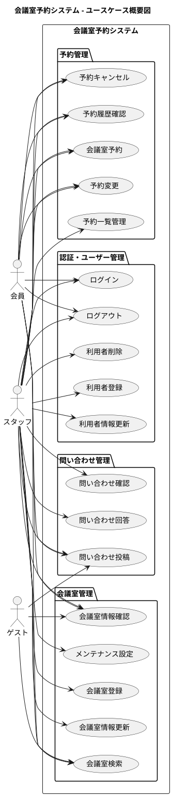

# 会議室予約システム - 要件定義書

## プロジェクト概要

**システム名**: 会議室予約システム  
**目的**: 利用者が Web サイト上で会議室の予約をして、一覧で確認できるシステム  
**対象ユーザー**: 会員、スタッフ、ゲスト  

### システム概要図



## 機能要件 (EARS 記法による構造化要件)

### FR1. ユーザー認証機能

**FR1.1 ログイン認証**
```
WHEN 利用者がログイン画面でメールアドレスとパスワードを入力する際
GIVEN 正しい認証情報が入力された場合
THEN システムは利用者を認証する
AND 認証成功時はメインダッシュボードにリダイレクトする
```

**FR1.2 認証エラーハンドリング**
```
WHEN 利用者がログインを試行する際
GIVEN 無効な認証情報が入力された場合
THEN システムは「認証に失敗しました」エラーメッセージを表示する
AND 3 回連続失敗時はアカウントを一時的にロックする
```

**FR1.3 セッション管理**
```
WHILE 利用者がシステムを使用している間
THE SYSTEM SHALL アクティブなセッションを維持する
AND 30 分間非アクティブな場合は自動的にログアウトする
```

### FR2. 利用者管理機能

**FR2.1 利用者登録**
```
WHEN スタッフが新規利用者を登録する際
GIVEN 必要な利用者情報（氏名、メールアドレス、所属）が入力された場合
THEN システムは利用者アカウントを作成する
AND 一意の利用者 ID を発行する
```

**FR2.2 利用者情報更新**
```
WHEN スタッフが利用者情報を更新する際
GIVEN 変更対象の利用者が存在し、有効な変更内容が入力された場合
THEN システムは利用者情報を更新する
AND 更新履歴を記録する
```

**FR2.3 利用者削除**
```
WHEN スタッフが利用者を削除する際
GIVEN 削除対象の利用者に進行中の予約がない場合
THEN システムは利用者アカウントを論理削除する
AND 関連する履歌データは保持する
```

### FR3. 会議室検索機能

**FR3.1 空室検索**
```
WHEN 認証済み利用者が会議室を検索する際
GIVEN 希望日時と人数が指定された場合
THEN システムは利用可能な会議室一覧を表示する
AND 各会議室の基本情報（名前、収容人数、設備）を含める
```

**FR3.2 詳細フィルタ**
```
WHEN 利用者が検索条件を詳細指定する際
GIVEN プロジェクター、WiFi 等の設備条件が選択された場合
THEN システムは条件に合致する会議室のみを表示する
AND 検索結果がない場合は代替候補を提案する
```

### FR4. 会議室予約機能

**FR4.1 新規予約**
```
WHEN 認証済み利用者が会議室を予約する際
GIVEN 利用可能な会議室と有効な時間帯が選択された場合
THEN システムは予約を確定する
AND 一意の予約 ID を発行し、予約確認メールを送信する
```

**FR4.2 予約競合チェック**
```
WHEN 利用者が予約を試行する際
GIVEN 指定時間帯に既に他の予約が存在する場合
THEN システムは「指定時間は予約済みです」エラーを表示する
AND 代替の時間帯候補を提案する
```

**FR4.3 予約変更**
```
WHEN 利用者が既存予約を変更する際
GIVEN 変更先の時間帯が利用可能で、予約開始 24 時間前以降でない場合
THEN システムは予約を変更する
AND 変更通知メールを送信する
```

**FR4.4 予約キャンセル**
```
WHEN 利用者が予約をキャンセルする際
GIVEN キャンセル対象の予約が存在し、利用者本人または管理者による操作の場合
THEN システムは予約をキャンセル状態に更新する
AND 会議室を再び利用可能状態にする
```

### FR5. 会議室管理機能

**FR5.1 会議室登録**
```
WHEN スタッフが新しい会議室を登録する際
GIVEN 会議室情報（名前、収容人数、所在地、設備）が入力された場合
THEN システムは会議室を登録する
AND 即座に予約可能状態にする
```

**FR5.2 会議室情報更新**
```
WHEN スタッフが会議室情報を更新する際
GIVEN 変更内容が有効で、進行中の予約に影響しない場合
THEN システムは会議室情報を更新する
AND 次回検索から新しい情報を反映する
```

**FR5.3 会議室メンテナンス**
```
WHEN スタッフが会議室をメンテナンス状態にする際
GIVEN メンテナンス期間が指定された場合
THEN システムは該当期間の会議室を予約不可状態にする
AND 既存予約がある場合は利用者に通知する
```

### FR6. 問い合わせ管理機能

**FR6.1 問い合わせ投稿**
```
WHEN ゲストまたは会員が問い合わせを投稿する際
GIVEN 問い合わせ内容と連絡先が入力された場合
THEN システムは問い合わせを記録する
AND 問い合わせ受付完了の自動返信を送信する
```

**FR6.2 問い合わせ対応**
```
WHEN スタッフが問い合わせに対応する際
GIVEN 問い合わせ内容を確認し、回答内容が入力された場合
THEN システムは回答を記録する
AND 問い合わせ者に回答メールを送信する
```

## 非機能要件

### NFR1. パフォーマンス要件

**NFR1.1 応答時間**
```
WHILE システムが正常稼働している間
THE SYSTEM SHALL 検索リクエストに対して3秒以内に応答する
AND 予約処理に対して5秒以内に応答する
```

**NFR1.2 同時利用者数**
```
WHEN システムに同時アクセスが発生する際
THE SYSTEM SHALL 最大100名の同時利用者をサポートする
AND 応答時間の劣化なしに処理する
```

### NFR2. セキュリティ要件

**NFR2.1 データ保護**
```
WHILE システムが利用者データを扱っている間
THE SYSTEM SHALL すべての個人情報を暗号化して保存する
AND アクセスログを記録・監視する
```

**NFR2.2 認証セキュリティ**
```
WHEN 認証処理を実行する際
THE SYSTEM SHALL パスワードをハッシュ化して保存する
AND セッショントークンを暗号化する
```

### NFR3. 可用性要件

**NFR3.1 システム稼働率**
```
DURING 営業時間（平日9:00-18:00）において
THE SYSTEM SHALL 99.5%以上の稼働率を維持する
AND 計画メンテナンス以外のダウンタイムは月間4時間以下とする
```

**NFR3.2 障害復旧**
```
WHEN システム障害が発生する際
THE SYSTEM SHALL 30分以内に自動復旧を試行する
AND 復旧不可能な場合は1時間以内に手動復旧する
```

### NFR4. ユーザビリティ要件

**NFR4.1 操作性**
```
WHEN 新規利用者がシステムを使用する際
THE SYSTEM SHALL 15分以内で基本操作（検索・予約）を完了できる設計とする
AND ヘルプドキュメントなしで直感的に操作できる
```

**NFR4.2 アクセシビリティ**
```
WHILE システムが提供されている間
THE SYSTEM SHALL WCAG 2.1 AA準拠のアクセシビリティを提供する
AND スクリーンリーダー対応を含める
```

## 技術要件

### TR1. プラットフォーム・基盤技術

| 項目 | 技術・バージョン | 要件・設定 |
|------|------------------|------------|
| **実行環境** | Java 21 以上 | LTS バージョンの採用 |
| **フレームワーク** | Spring Boot 3.3.2 以上 | Spring Framework 6.x ベース |
| **ビルドツール** | Gradle 8.x | Kotlin DSL 推奨 |
| **依存関係管理** | Maven Central Repository | 公式リポジトリのみ使用 |

### TR2. データベース・データアクセス

| 項目 | 技術・バージョン | 要件・設定 |
|------|------------------|------------|
| **本番データベース** | PostgreSQL 14 以上 | ACID トランザクション対応 |
| **開発・テスト用** | H2 Database 2.x | インメモリ・ファイルベース対応 |
| **ORM** | MyBatis 3.x | タイプセーフな SQL マッピング |
| **トランザクション** | Spring Transaction Management | 宣言的トランザクション管理 |
| **コネクションプール** | HikariCP | 最大 20 接続、最小 5 接続 |
| **マイグレーション** | Flyway 9.x | バージョン管理されたスキーマ変更 |

### TR3. セキュリティ

| 項目 | 技術・バージョン | 要件・設定 |
|------|------------------|------------|
| **セキュリティフレームワーク** | Spring Security 6.x | OAuth2、JWT 対応 |
| **認証方式** | JWT (JSON Web Token) | ステートレス認証 |
| **パスワードハッシュ** | BCrypt | ソルト付きハッシュ化 |
| **通信暗号化** | HTTPS (TLS 1.3) | 強制リダイレクト |
| **セキュリティヘッダー** | HSTS, CSP, X-Frame-Options | セキュリティ強化 |

### TR4. テスト・品質管理

| 項目 | 技術・バージョン | 要件・設定 |
|------|------------------|------------|
| **単体テスト** | JUnit 5 + Mockito | @ExtendWith(MockitoExtension.class) |
| **統合テスト** | Spring Boot Test + Testcontainers | 実データベース使用 |
| **E2E テスト** | Cucumber + Selenium WebDriver | BDD スタイル |
| **テストカバレッジ** | JaCoCo | 最低 80% カバレッジ |
| **コード品質** | Checkstyle + PMD + SpotBugs | Google Java Style 準拠 |
| **アーキテクチャテスト** | ArchUnit | レイヤー間依存関係検証 |

### TR5. 運用・監視

| 項目 | 技術・バージョン | 要件・設定 |
|------|------------------|------------|
| **ログ管理** | SLF4J + Logback | JSON 構造化ログ |
| **ヘルスチェック** | Spring Boot Actuator | `/actuator/health` エンドポイント |
| **メトリクス** | Micrometer | Prometheus 形式対応 |
| **APM** | Spring Boot Admin (オプション) | 管理画面提供 |

### TR6. パフォーマンス・スケーラビリティ

| 項目 | 技術・バージョン | 要件・設定 |
|------|------------------|------------|
| **キャッシュ** | Spring Cache Abstraction + Redis | セッション・データキャッシュ |
| **非同期処理** | Spring Async + CompletableFuture | @Async アノテーション |
| **データベース最適化** | インデックス戦略 | 検索性能向上 |
| **同時実行制御** | 楽観的ロック | 予約競合回避・パフォーマンス重視 |

### TR7. API・通信

| 項目 | 技術・バージョン | 要件・設定 |
|------|------------------|------------|
| **API 設計** | RESTful API | HTTP メソッド適切使用 |
| **API ドキュメント** | OpenAPI 3.0 + Swagger UI | 自動生成ドキュメント |
| **レスポンス形式** | JSON | Content-Type: application/json |
| **エラーハンドリング** | RFC 7807 (Problem Details) | 標準エラー形式 |

### TR8. アーキテクチャ

| 項目 | 採用パターン | 要件・設定 |
|------|-------------|------------|
| **アーキテクチャ** | ヘキサゴナルアーキテクチャ | ポート&アダプターパターン |
| **レイヤー構成** | ドメイン / アプリケーション / インフラ | 依存関係逆転 |
| **DDD 適用** | エンティティ、バリューオブジェクト、ドメインサービス | 軽量 DDD |
| **CQRS** | コマンド・クエリ分離 | 読み書き処理の最適化 |

### TR9. フロントエンド技術

| 項目 | 技術・バージョン | 要件・設定 |
|------|------------------|------------|
| **フレームワーク** | React 18.x | 関数コンポーネント + Hooks |
| **言語** | TypeScript 5.x | 厳密な型チェック |
| **状態管理** | React Context + useReducer | 軽量グローバル状態管理 |
| **UIライブラリ** | Material-UI (MUI) 5.x | Material Design 準拠 |
| **スタイリング** | Emotion または styled-components | CSS-in-JS |
| **ルーティング** | React Router 6.x | SPA ルーティング |
| **フォーム管理** | React Hook Form | バリデーション統合 |
| **HTTP クライアント** | Axios または Fetch API | インターセプター対応 |
| **日付処理** | Day.js または date-fns | 軽量日付ライブラリ |
| **国際化** | react-i18next | 多言語対応 |

### TR10. フロントエンド開発環境

| 項目 | 技術・バージョン | 要件・設定 |
|------|------------------|------------|
| **ビルドツール** | Vite 5.x | 高速ビルド・HMR |
| **パッケージマネージャー** | npm 10.x または pnpm | 依存関係管理 |
| **Linter** | ESLint 8.x | Airbnb Style Guide |
| **フォーマッター** | Prettier 3.x | コード整形 |
| **テストフレームワーク** | Vitest + React Testing Library | 高速テスト実行・Vite 統合 |
| **E2E テスト** | Playwright または Cypress | ブラウザ自動テスト |
| **Storybook** | Storybook 7.x | コンポーネントカタログ |

### TR11. フロントエンド品質・パフォーマンス

| 項目 | 技術・要件 | 目標値 |
|------|-----------|---------|
| **バンドルサイズ** | Code Splitting + Lazy Loading | 初期ロード < 300KB |
| **Lighthouse スコア** | Performance, Accessibility, SEO | 各 90 点以上 |
| **レスポンシブ対応** | Mobile First Design | ブレークポイント対応 |
| **ブラウザ対応** | Chrome, Firefox, Safari, Edge | 最新 2 バージョン |
| **PWA 対応** | Service Worker + Manifest | オフライン対応 |
| **アクセシビリティ** | ARIA 属性 | WCAG 2.1 AA 準拠 |

## ビジネスルール

### BR1. 予約ルール

**BR1.1 予約時間制限**
- 1回の予約は最大4時間まで
- 1日あたり1人3回まで予約可能
- 予約は最大30日先まで可能

**BR1.2 キャンセルルール**
- 予約開始24時間前までキャンセル可能
- 当日キャンセルは管理者承認が必要
- No-showは3回で一時利用停止

### BR2. 利用者権限

**BR2.1 会員権限**
- 会議室検索・予約・キャンセル
- 自分の予約履歴確認
- 問い合わせ投稿

**BR2.2 スタッフ権限**
- 全ての会員機能
- 利用者管理（登録・更新・削除）
- 会議室管理（登録・更新・メンテナンス設定）
- 予約管理（代行予約・強制キャンセル）
- 問い合わせ対応

## 受入基準

### AC1. 基本機能検証

**AC1.1 認証フロー**
- [ ] 正常なメールアドレス・パスワードでログインできる
- [ ] 無効な認証情報ではログインが拒否される
- [ ] 3回失敗後にアカウントがロックされる
- [ ] セッションタイムアウト後に自動ログアウトされる

**AC1.2 予約フロー**
- [ ] 利用可能な会議室を検索できる
- [ ] 選択した会議室を予約できる
- [ ] 予約確認メールが送信される
- [ ] 既存予約との競合が検出される
- [ ] 予約をキャンセルできる

**AC1.3 管理機能**
- [ ] スタッフが利用者を登録できる
- [ ] スタッフが会議室を管理できる
- [ ] 問い合わせの投稿・対応ができる

### AC2. 非機能要件検証

**AC2.1 パフォーマンス**
- [ ] 検索処理が3秒以内に完了する
- [ ] 予約処理が5秒以内に完了する
- [ ] 100名同時アクセス時も正常動作する

**AC2.2 セキュリティ**
- [ ] パスワードがハッシュ化されて保存される
- [ ] セッショントークンが暗号化される
- [ ] アクセスログが記録される

**AC2.3 ユーザビリティ**
- [ ] 新規利用者が15分以内で予約完了できる
- [ ] WCAG 2.1 AA準拠である
- [ ] モバイルデバイスで正常表示される

## 制約条件と前提条件

### 制約条件
- 開発期間：3ヶ月以内
- 予算制限：既存インフラ活用前提
- 技術制約：Java 21 + Spring Boot 3.3.2 + PostgreSQL

### 前提条件
- 利用者は事前に登録済みであること
- 営業時間は平日9:00-18:00のみ
- 会議室は事前にシステムに登録済み
- メール送信機能は外部SMTP利用

## リスク評価

### 高リスク
- **同時予約競合**: 複数利用者が同時に同じ会議室を予約しようとする場合
- **セキュリティ**: 個人情報漏洩リスク
- **可用性**: システムダウンによる業務影響

### 中リスク  
- **パフォーマンス**: アクセス集中時のレスポンス劣化
- **ユーザビリティ**: 操作性が悪く利用率が低下
- **データ整合性**: 予約データの不整合

### 対策
- 楽観的ロック機構による競合制御
- HTTPS通信とデータ暗号化
- 冗長化による高可用性確保
- 負荷分散とキャッシュ機構
- ユーザビリティテストの実施
- トランザクション管理とデータ検証

## トレーサビリティ

### 要求分析との対応関係

本要件定義書の機能要件は、[要求分析書](docs/requirements/requirement_analysis.md)のビジネスユースケースと以下の通り対応します：

| ビジネスユースケース（BUC） | 機能要件（FR） | 関連する受入基準（AC） |
|---------------------------|---------------|----------------------|
| **利用者の認証** | FR1. ユーザー認証機能 | AC1.1 認証フロー |
| - 会員がシステムにログインする | FR1.1 ログイン認証 | - 正常認証でのログイン |
| - セッション管理による継続認証 | FR1.2 認証エラーハンドリング | - 無効認証での拒否 |
| - ログアウト機能 | FR1.3 セッション管理 | - セッションタイムアウト |
| **利用者の管理** | FR2. 利用者管理機能 | AC1.3 管理機能 |
| - 窓口スタッフが利用者を登録する | FR2.1 利用者登録 | - スタッフによる利用者登録 |
| - 利用者情報の更新 | FR2.2 利用者情報更新 | - 利用者情報の管理 |
| - 利用者の削除・退会処理 | FR2.3 利用者削除 | - 利用者削除機能 |
| **会議室の検索** | FR3. 会議室検索機能 | AC1.2 予約フロー |
| - 会員が利用可能な会議室を検索する | FR3.1 空室検索 | - 利用可能な会議室の検索 |
| - 日時、定員、設備による絞り込み | FR3.2 詳細フィルタ | - 条件による絞り込み |
| **会議室の予約** | FR4. 会議室予約機能 | AC1.2 予約フロー |
| - 会員が会議室を予約する | FR4.1 新規予約 | - 選択した会議室の予約 |
| - 予約競合の防止・チェック | FR4.2 予約競合チェック | - 既存予約との競合検出 |
| - 既存予約の変更 | FR4.3 予約変更 | - 予約変更機能 |
| - 予約のキャンセル | FR4.4 予約キャンセル | - 予約キャンセル機能 |
| **会議室の登録** | FR5. 会議室管理機能 | AC1.3 管理機能 |
| - 窓口スタッフが会議室情報を登録する | FR5.1 会議室登録 | - スタッフによる会議室管理 |
| - 会議室情報の更新・編集 | FR5.2 会議室情報更新 | - 会議室情報の更新 |
| - メンテナンス状態の設定 | FR5.3 会議室メンテナンス | - メンテナンス設定 |
| **問い合わせ管理** | FR6. 問い合わせ管理機能 | AC1.3 管理機能 |
| - ゲストが問い合わせを投稿する | FR6.1 問い合わせ投稿 | - 問い合わせの投稿・対応 |
| - 会員が問い合わせを投稿する | FR6.2 問い合わせ対応 | - 問い合わせ管理機能 |
| - スタッフが問い合わせに対応する | | |

### 非機能要件のトレーサビリティ

| 要求分析の観点 | 非機能要件（NFR） | リスク対策 |
|---------------|-----------------|----------|
| 登録した利用者だけが利用できる | NFR2. セキュリティ要件 | HTTPS通信とデータ暗号化 |
| Webサイト上での快適な操作 | NFR1. パフォーマンス要件 | 負荷分散とキャッシュ機構 |
| 安定したシステム稼働 | NFR3. 可用性要件 | 冗長化による高可用性確保 |
| 一覧で確認できるUI | NFR4. ユーザビリティ要件 | ユーザビリティテストの実施 |

### 技術要件への影響

要求分析で識別された以下の特徴が技術要件に反映されています：

- **マルチユーザー対応** → TR3（セキュリティ）、TR6（パフォーマンス）
- **リアルタイム予約競合チェック** → TR2（データベース）、TR8（アーキテクチャ）
- **Web ベースシステム** → TR9-TR11（フロントエンド技術）
- **スタッフ管理機能** → TR3（認証・認可）

### 完全性確認

✅ **ビジネスユースケース**: 6個 → **機能要件**: 6個（FR1-FR6）  
✅ **システム価値**: セキュリティ・可用性・操作性 → **非機能要件**: 4個（NFR1-NFR4）  
✅ **技術的制約**: 現代的Webアプリケーション → **技術要件**: 11個（TR1-TR11）

---

*このrequirements.mdは、既存の要求分析(requirement_analysis.md)をベースに、Kiro式のEARS記法を使用して構造化した要件定義書です。完全なトレーサビリティマトリックスは [traceability_matrix.md](traceability_matrix.md) を参照してください。*