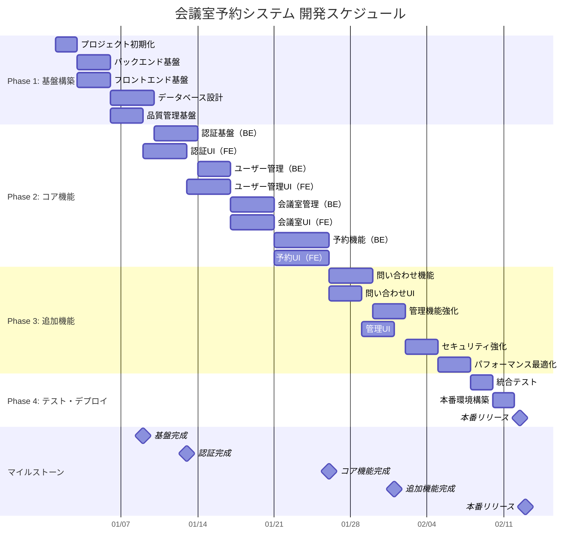

# 会議室予約システム - 実装タスク

## プロジェクト概要

**開発期間**: 3ヶ月（12週間）  
**開発体制**: フルスタック開発  
**アーキテクチャ**: ヘキサゴナル + React Context  
**技術スタック**: Java 21 + Spring Boot 3.3.2 + React 18 + TypeScript  

### プロジェクト全体スケジュール



### フェーズ別概要

| フェーズ | 期間 | 主要成果物 | 完了基準 |
|---------|------|-----------|----------|
| **Phase 1** | Week 1-2 | 開発環境、DB設計、CI/CD基盤 | プロジェクト構造完成、自動テスト実行可能 |
| **Phase 2** | Week 3-8 | 認証、ユーザー管理、会議室管理、予約機能 | 基本業務フロー完全動作 |
| **Phase 3** | Week 9-11 | 問い合わせ、管理機能、セキュリティ強化 | 運用に必要な全機能完成 |
| **Phase 4** | Week 12 | 統合テスト、本番デプロイ | 本番環境での安定稼働確認 |

## Phase 1: プロジェクト基盤構築（Week 1-2）

### Week 1: 開発環境セットアップ

#### タスク 1.1: プロジェクト初期化
- [ ] **T1.1.1** プロジェクトディレクトリ構造作成 (0.5d)
  ```
  ai-programing-exercise/
  ├── app/backend/
  ├── app/frontend/
  ├── docker/
  └── docs/
  ```
- [ ] **T1.1.2** Git リポジトリ初期化と .gitignore 設定 (0.5d)
- [ ] **T1.1.3** README.md とライセンスファイル作成 (0.5d)
- [ ] **T1.1.4** 開発ガイドライン文書作成 (0.5d)

#### タスク 1.2: バックエンド基盤
- [ ] **T1.2.1** Spring Boot プロジェクト初期化 (0.5d)
  - Gradle 8.x (Kotlin DSL)
  - Java 21
  - Spring Boot 3.3.2
- [ ] **T1.2.2** 基本依存関係追加 (1d)
  - Spring Web, Security, Data JPA
  - MyBatis, HikariCP, Flyway
  - JUnit 5, Mockito, Testcontainers
  - Checkstyle, PMD, SpotBugs, JaCoCo
- [ ] **T1.2.3** パッケージ構造作成 (0.5d)
  - domain, application, infrastructure, presentation
- [ ] **T1.2.4** 基本設定ファイル作成 (1d)
  - application.yml (dev, test, prod)
  - logback-spring.xml
  - Gradle ビルドスクリプト

#### タスク 1.3: フロントエンド基盤
- [ ] **T1.3.1** React + TypeScript プロジェクト初期化 (0.5d)
  - Vite 5.x
  - React 18.x + TypeScript 5.x
- [ ] **T1.3.2** 基本依存関係追加 (1d)
  - Material-UI 5.x, Emotion
  - React Router 6.x, React Hook Form
  - Axios, Day.js, react-i18next
- [ ] **T1.3.3** 開発ツール設定 (1d)
  - ESLint (Airbnb), Prettier
  - Vitest + React Testing Library
  - Storybook 7.x
- [ ] **T1.3.4** プロジェクト構造作成 (0.5d)
  - components, pages, hooks, contexts, services

### Week 2: データベース設計・環境構築

#### タスク 2.1: データベース設計
- [ ] **T2.1.1** PostgreSQL Docker 環境構築 (0.5d)
- [ ] **T2.1.2** データベーススキーマ設計 (1d)
  - users, rooms, reservations, available_rooms, inquiries
- [ ] **T2.1.3** Flyway マイグレーションスクリプト作成 (1d)
- [ ] **T2.1.4** 初期データ投入スクリプト作成 (1d)
- [ ] **T2.1.5** インデックス設計・最適化 (1d)

#### タスク 2.2: 品質管理基盤
- [ ] **T2.2.1** コード品質チェック設定 (1d)
  - Checkstyle, PMD, SpotBugs
  - ESLint, Prettier
- [ ] **T2.2.2** テストカバレッジ設定 (0.5d)
  - JaCoCo (バックエンド 80%+)
  - Vitest Coverage (フロントエンド 80%+)
- [ ] **T2.2.3** ArchUnit アーキテクチャテスト設定 (1d)
- [ ] **T2.2.4** CI/CD パイプライン基盤構築 (1d)

## Phase 2: コア機能実装（Week 3-8）

### Week 3-4: 認証・ユーザー管理

#### タスク 3.1: 認証基盤（バックエンド）
- [ ] **T3.1.1** User ドメインモデル実装 (1d)
  - User エンティティ、UserId、Email バリューオブジェクト
  - UserRole 列挙型
- [ ] **T3.1.2** User リポジトリ実装 (1d)
  - UserRepository インターフェース
  - MyBatis UserMapper 実装
- [ ] **T3.1.3** 認証サービス実装 (2d)
  - JWT トークン生成・検証
  - BCrypt パスワードハッシュ化
  - Spring Security 設定
- [ ] **T3.1.4** 認証 API 実装 (1d)
  - POST /api/auth/login
  - POST /api/auth/logout
  - POST /api/auth/refresh

#### タスク 3.2: 認証 UI（フロントエンド）
- [ ] **T3.2.1** AuthContext 実装 (1d)
  - 認証状態管理
  - useAuth カスタムフック
- [ ] **T3.2.2** ログイン画面実装 (2d)
  - LoginPage コンポーネント
  - React Hook Form 統合
  - バリデーション・エラーハンドリング
- [ ] **T3.2.3** 認証プライベートルート実装 (1d)
  - ProtectedRoute コンポーネント
  - 認証チェック・リダイレクト
- [ ] **T3.2.4** API クライアント実装 (1d)
  - Axios インターセプター
  - JWT トークン自動付与

#### タスク 4.1: ユーザー管理（バックエンド）
- [ ] **T4.1.1** ユーザー管理 API 実装 (2d)
  - GET/POST/PUT/DELETE /api/users
  - 権限チェック（STAFF のみ）
- [ ] **T4.1.2** ユーザー管理サービス実装 (1d)
  - UserManagementService
  - ビジネスルール検証
- [ ] **T4.1.3** ユーザー管理テスト実装 (1d)
  - 単体・統合テスト

#### タスク 4.2: ユーザー管理 UI（フロントエンド）
- [ ] **T4.2.1** ユーザー管理画面実装 (2d)
  - UserManagementPage
  - ユーザー一覧・詳細表示
- [ ] **T4.2.2** ユーザー登録・編集フォーム実装 (2d)
  - UserForm コンポーネント
  - バリデーション・送信処理

### Week 5-6: 会議室管理

#### タスク 5.1: 会議室管理（バックエンド）
- [ ] **T5.1.1** Room ドメインモデル実装 (1d)
  - Room エンティティ、RoomId、Capacity バリューオブジェクト
  - 設備情報の JSON 管理
- [ ] **T5.1.2** Room リポジトリ実装 (1d)
  - RoomRepository インターフェース・実装
  - 検索条件対応（設備、収容人数）
- [ ] **T5.1.3** 会議室管理 API 実装 (2d)
  - CRUD API + 検索機能
  - メンテナンス設定機能
- [ ] **T5.1.4** 会議室検索サービス実装 (1d)
  - 詳細フィルタ機能
  - 空室状況判定

#### タスク 5.2: 会議室 UI（フロントエンド）
- [ ] **T5.2.1** 会議室一覧画面実装 (2d)
  - RoomListPage
  - フィルタ・検索機能
- [ ] **T5.2.2** 会議室カードコンポーネント実装 (1d)
  - RoomCard
  - 設備アイコン表示
- [ ] **T5.2.3** 会議室詳細画面実装 (1d)
  - RoomDetailPage
  - 予約状況表示
- [ ] **T5.2.4** 会議室管理画面実装（STAFF 用） (2d)
  - RoomManagementPage
  - 登録・編集・メンテナンス設定

### Week 7-8: 予約機能

#### タスク 6.1: 予約機能（バックエンド）
- [ ] **T6.1.1** Reservation ドメインモデル実装 (2d)
  - Reservation エンティティ
  - TimeSlot バリューオブジェクト
  - 予約ステータス管理
- [ ] **T6.1.2** 予約競合チェックサービス実装 (1d)
  - ReservationConflictChecker
  - 楽観的ロック制御
- [ ] **T6.1.3** 予約ポリシーサービス実装 (1d)
  - ReservationPolicy
  - ビジネスルール検証（24時間前制限等）
- [ ] **T6.1.4** 予約 API 実装 (2d)
  - CRUD API + 競合チェック
  - 予約変更・キャンセル機能
- [ ] **T6.1.5** ドメインイベント実装 (1d)
  - ReservationCreated, ReservationCancelled
  - イベント公開・処理

#### タスク 6.2: 予約 UI（フロントエンド）
- [ ] **T6.2.1** 予約フォーム実装 (2d)
  - ReservationForm
  - 日時選択・バリデーション
- [ ] **T6.2.2** カレンダービュー実装 (2d)
  - CalendarView コンポーネント
  - 月間・週間表示
- [ ] **T6.2.3** タイムスロット選択実装 (1d)
  - TimeSlotPicker
  - 空き時間表示
- [ ] **T6.2.4** 予約一覧画面実装 (2d)
  - ReservationListPage
  - 自分の予約・全予約表示
- [ ] **T6.2.5** 予約詳細・編集画面実装 (1d)
  - ReservationDetailPage
  - 変更・キャンセル機能

## Phase 3: 追加機能・統合（Week 9-11）

### Week 9: 問い合わせ・通知機能

#### タスク 7.1: 問い合わせ機能（バックエンド）
- [ ] **T7.1.1** Inquiry ドメインモデル実装 (1d)
  - Inquiry エンティティ
  - 問い合わせステータス管理
- [ ] **T7.1.2** 問い合わせ API 実装 (1d)
  - 投稿・回答・一覧取得
- [ ] **T7.1.3** メール通知サービス実装 (2d)
  - SMTP 連携
  - テンプレートメール送信

#### タスク 7.2: 問い合わせ UI（フロントエンド）
- [ ] **T7.2.1** 問い合わせフォーム実装 (2d)
  - InquiryForm コンポーネント
  - ゲスト・会員対応
- [ ] **T7.2.2** 問い合わせ管理画面実装（STAFF 用） (1d)
  - InquiryManagementPage
  - 回答機能
- [ ] **T7.2.3** 通知コンポーネント実装 (1d)
  - NotificationContext
  - Snackbar 通知

### Week 10: 管理機能・レポート

#### タスク 8.1: 管理機能強化
- [ ] **T8.1.1** ダッシュボード API 実装 (1d)
  - 統計情報・集計データ
- [ ] **T8.1.2** 利用状況レポート機能 (2d)
  - 会議室利用率
  - 予約傾向分析
- [ ] **T8.1.3** システム監視機能 (1d)
  - Spring Boot Actuator
  - ヘルスチェックエンドポイント

#### タスク 8.2: 管理 UI
- [ ] **T8.2.1** ダッシュボード画面実装 (2d)
  - DashboardPage
  - グラフ・統計表示
- [ ] **T8.2.2** レポート画面実装 (1d)
  - ReportsPage
  - CSV エクスポート機能

### Week 11: セキュリティ・パフォーマンス強化

#### タスク 9.1: セキュリティ強化
- [ ] **T9.1.1** セキュリティヘッダー設定 (0.5d)
  - HSTS, CSP, X-Frame-Options
- [ ] **T9.1.2** 入力値検証・サニタイゼーション強化 (1d)
- [ ] **T9.1.3** セキュリティテスト実装 (1d)
  - 認可テスト・脆弱性テスト
- [ ] **T9.1.4** アクセスログ・監査ログ実装 (1d)

#### タスク 9.2: パフォーマンス最適化
- [ ] **T9.2.1** データベースクエリ最適化 (1d)
  - スロークエリ分析・改善
- [ ] **T9.2.2** Redis キャッシュ実装 (1d)
  - セッション・データキャッシュ
- [ ] **T9.2.3** フロントエンド最適化 (1d)
  - Code Splitting, Lazy Loading
  - バンドルサイズ最適化

## Phase 4: テスト・デプロイ・本番リリース（Week 12）

### Week 12: 統合テスト・本番デプロイ

#### タスク 10.1: 統合テスト
- [ ] **T10.1.1** E2E テストシナリオ作成 (1d)
  - Cucumber シナリオ
  - Playwright テスト
- [ ] **T10.1.2** パフォーマンステスト実行 (1d)
  - 負荷テスト・ストレステスト
- [ ] **T10.1.3** セキュリティテスト実行 (0.5d)
  - 脆弱性スキャン
- [ ] **T10.1.4** ユーザビリティテスト実行 (0.5d)
  - 実ユーザーでの受け入れテスト

#### タスク 10.2: 本番環境構築・デプロイ
- [ ] **T10.2.1** Docker 本番環境構築 (1d)
  - マルチステージビルド
  - セキュリティ設定
- [ ] **T10.2.2** CI/CD パイプライン完成 (1d)
  - 自動テスト・デプロイ
  - 品質ゲート設定
- [ ] **T10.2.3** 本番デプロイ・動作確認 (1d)
  - Blue-Green デプロイ
  - ヘルスチェック・監視設定

## 継続的な品質管理

### 開発中の継続タスク
- [ ] **日次**: コードレビュー・ペアプログラミング
- [ ] **日次**: 自動テスト実行・カバレッジ確認
- [ ] **週次**: アーキテクチャレビュー・技術的負債チェック
- [ ] **週次**: セキュリティ・パフォーマンス監視
- [ ] **隔週**: ユーザーフィードバック収集・改善

### 品質指標・完了基準
- **テストカバレッジ**: バックエンド 80%+, フロントエンド 80%+
- **パフォーマンス**: 検索 3秒以内、予約処理 5秒以内
- **セキュリティ**: 脆弱性スキャン クリア
- **アクセシビリティ**: WCAG 2.1 AA 準拠
- **コード品質**: SonarQube A ランク

## リスク管理・対策

### 高リスクタスクと対策
1. **予約競合制御（T6.1.2）**
   - 対策: 楽観ロック + 詳細テストシナリオ作成
   - バッファ: 追加 1-2日

2. **パフォーマンス要件（T9.2.x）**
   - 対策: 早期プロトタイプでの性能検証
   - バッファ: 追加 2-3日

3. **セキュリティ要件（T9.1.x）**
   - 対策: セキュリティエキスパートレビュー
   - バッファ: 追加 1-2日

### 依存関係・クリティカルパス
1. **認証基盤（T3.1.x）** → 全ての保護された機能
2. **データベース設計（T2.1.x）** → 全てのデータ操作機能
3. **API 基盤（T3.1.4）** → フロントエンド開発

## トレーサビリティ

### 機能要件との対応関係

各実装タスクは、[requirements.md](requirements.md)の機能要件（FR）と以下の通り対応します：

#### FR1. ユーザー認証機能 → Phase 2: 認証基盤実装

| 機能要件 | 実装タスク | タスク詳細 |
|----------|-----------|-----------|
| **FR1.1 ログイン認証** | T3.1.3, T3.1.4 | 認証サービス・API実装 |
| **FR1.2 認証エラーハンドリング** | T3.2.1, T3.2.2 | AuthContext・ログイン画面 |
| **FR1.3 セッション管理** | T3.2.3, T3.2.4 | プライベートルート・API クライアント |

#### FR2. 利用者管理機能 → Phase 2: ユーザー管理実装

| 機能要件 | 実装タスク | タスク詳細 |
|----------|-----------|-----------|
| **FR2.1 利用者登録** | T3.1.1, T4.1.1, T4.2.2 | User ドメイン・API・登録フォーム |
| **FR2.2 利用者情報更新** | T3.1.2, T4.1.2, T4.2.1 | User リポジトリ・サービス・管理画面 |
| **FR2.3 利用者削除** | T4.1.3, T4.2.1 | テスト・管理画面 |

#### FR3. 会議室検索機能 → Phase 2: 会議室管理実装

| 機能要件 | 実装タスク | タスク詳細 |
|----------|-----------|-----------|
| **FR3.1 空室検索** | T5.1.1, T5.1.4, T5.2.1 | Room ドメイン・検索サービス・一覧画面 |
| **FR3.2 詳細フィルタ** | T5.1.2, T5.2.2 | Room リポジトリ・カードコンポーネント |

#### FR4. 会議室予約機能 → Phase 2: 予約機能実装

| 機能要件 | 実装タスク | タスク詳細 |
|----------|-----------|-----------|
| **FR4.1 新規予約** | T6.1.1, T6.1.4, T6.2.1 | Reservation ドメイン・API・予約フォーム |
| **FR4.2 予約競合チェック** | T6.1.2, T6.1.3 | 競合チェック・ポリシーサービス |
| **FR4.3 予約変更** | T6.2.5, T6.2.2 | 予約編集画面・カレンダービュー |
| **FR4.4 予約キャンセル** | T6.1.5, T6.2.4 | ドメインイベント・予約一覧画面 |

#### FR5. 会議室管理機能 → Phase 2: 会議室管理実装

| 機能要件 | 実装タスク | タスク詳細 |
|----------|-----------|-----------|
| **FR5.1 会議室登録** | T5.1.3, T5.2.4 | 会議室管理 API・STAFF 用画面 |
| **FR5.2 会議室情報更新** | T5.2.3, T5.2.4 | 会議室詳細・管理画面 |
| **FR5.3 会議室メンテナンス** | T5.2.4 | 会議室管理画面（STAFF 用） |

#### FR6. 問い合わせ管理機能 → Phase 3: 問い合わせ機能実装

| 機能要件 | 実装タスク | タスク詳細 |
|----------|-----------|-----------|
| **FR6.1 問い合わせ投稿** | T7.1.1, T7.2.1 | Inquiry ドメイン・問い合わせフォーム |
| **FR6.2 問い合わせ対応** | T7.1.2, T7.1.3, T7.2.2 | API・メール通知・管理画面 |

### 非機能要件との対応関係

| 非機能要件 | 実装タスク | Phase |
|-----------|-----------|-------|
| **NFR1 パフォーマンス要件** | T9.2.1-3（クエリ最適化・キャッシュ・FE最適化） | Phase 3 |
| **NFR2 セキュリティ要件** | T9.1.1-4（ヘッダー・検証・テスト・ログ） | Phase 3 |
| **NFR3 可用性要件** | T2.1.1, T2.2.4, T10.2.1（DB・CI/CD・本番環境） | Phase 1, 4 |
| **NFR4 ユーザビリティ要件** | T6.2.2, T6.2.4, T7.2.3（カレンダー・一覧・通知） | Phase 2, 3 |

### Phase別の要件カバレッジ

#### Phase 1: プロジェクト基盤構築（Week 1-2）
- **対象**: 技術要件（TR1-TR8）の基盤部分
- **成果物**: 開発環境、データベース、品質管理基盤

#### Phase 2: コア機能実装（Week 3-8）
- **対象**: FR1-FR5（認証・ユーザー管理・会議室・予約）
- **成果物**: 基本業務フローの完全動作

#### Phase 3: 追加機能・統合（Week 9-11）
- **対象**: FR6（問い合わせ）+ NFR1-NFR2（パフォーマンス・セキュリティ）
- **成果物**: 運用に必要な全機能完成

#### Phase 4: テスト・デプロイ（Week 12）
- **対象**: NFR3（可用性）+ 受入基準（AC1-AC2）
- **成果物**: 本番環境での安定稼働確認

### リスク対応の実装タスク

| リスク項目 | 対応タスク | 実装時期 |
|-----------|-----------|----------|
| **同時予約競合** | T6.1.2（予約競合チェックサービス） | Week 6 |
| **セキュリティ** | T9.1.1-4（セキュリティ強化） | Week 9-10 |
| **可用性** | T10.2.1（本番環境構築） | Week 12 |
| **パフォーマンス** | T9.2.1-3（パフォーマンス最適化） | Week 10 |
| **ユーザビリティ** | T10.1.4（ユーザビリティテスト） | Week 12 |

### 完全性確認

✅ **機能要件**: 6個（FR1-FR6） → **実装フェーズ**: 4個（Phase 1-4）  
✅ **非機能要件**: 4個（NFR1-NFR4） → **対応タスク**: 15個  
✅ **高リスク項目**: 3個 → **専用タスク**: 5個  
✅ **受入基準**: 6個 → **検証タスク**: Phase 4

### 実装優先度

1. **最優先（Phase 1-2）**: FR1-FR4（認証・ユーザー・会議室・予約）
2. **高優先（Phase 3）**: FR5-FR6（管理・問い合わせ）+ セキュリティ
3. **中優先（Phase 3）**: パフォーマンス最適化
4. **最終（Phase 4）**: 統合テスト・本番デプロイ

---

*この tasks.md は requirements.md と design.md に基づいて作成された詳細実装計画です。TDD 原則に従い、テストファーストで開発を進めます。完全なトレーサビリティマトリックスは [traceability_matrix.md](traceability_matrix.md) を参照してください。*