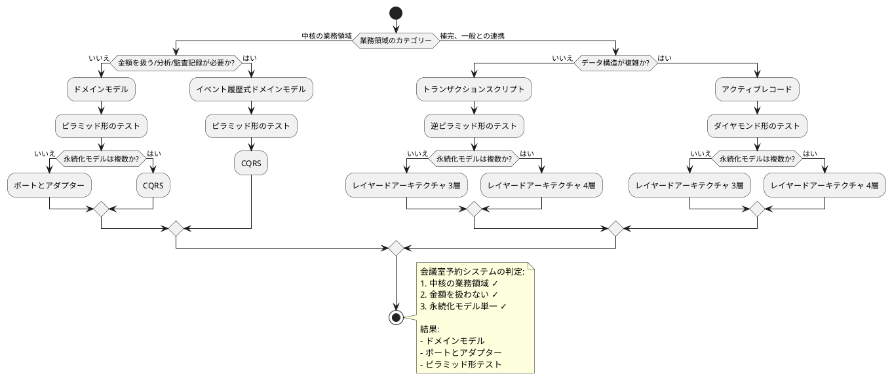
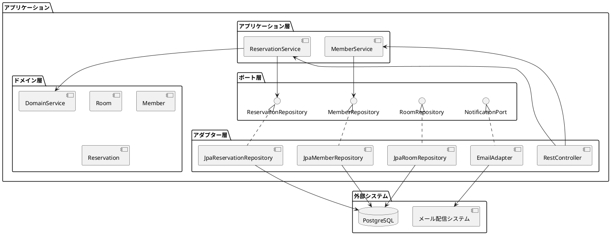

# アーキテクチャ設計推奨 - 会議室予約システム

## 概要

開発ガイドに基づく体系的なアーキテクチャパターン選定を実施し、
会議室予約システムに最適なアーキテクチャを推奨します。

## アーキテクチャ決定プロセス

### 決定フローチャート適用



### 1. 業務領域カテゴリー判定

**判定**: 中核の業務領域 ✓

**判定根拠**:
- 会議室予約は施設運営の中核業務
- ビジネス価値創出の主要機能
- 複雑なビジネスルールを含有
- 利害関係者への直接的影響が大きい

### 2. 金額・監査記録要件判定

**判定**: 金額を扱わない & 監査記録不要 ✓

**判定根拠**:
- 料金計算機能は要件に含まれない
- 無料利用を前提とした予約システム
- 一般的な操作履歴で十分
- 厳格な監査要件は存在しない

### 3. 永続化モデル数判定

**判定**: 永続化モデル単一 ✓

**判定根拠**:
- PostgreSQL 単一データベース
- 外部システム連携は限定的（メール配信のみ）
- データソースの複雑性は低い

## 推奨アーキテクチャ

### アーキテクチャパターン: ドメインモデル

**選定理由**:
- 中核業務領域に適合
- 複雑なビジネスロジックを効果的に表現
- ビジネス要件の変化に柔軟に対応

**特徴**:
- リッチなドメインオブジェクト
- ビジネスロジックの分散配置
- オブジェクト指向設計の活用
- 高い表現力とメンテナンス性

### アーキテクチャスタイル: ポートとアダプター（ヘキサゴナル）

**選定理由**:
- ドメインモデル + 単一永続化の最適解
- 外部依存からの完全分離
- 高いテスト容易性
- 技術的詳細からの独立性

**構造**:


### テスト戦略: ピラミッド形テスト

**テスト構成**:
- **ユニットテスト（70%）**: ドメインロジック詳細検証
- **統合テスト（20%）**: コンポーネント間連携検証
- **E2Eテスト（10%）**: ユーザーシナリオ検証

**実装技術**:
- **ユニットテスト**: JUnit 5 + Mockito
- **統合テスト**: Spring Boot Test + Testcontainers
- **E2Eテスト**: Selenium WebDriver + TestNG

## 実装ガイドライン

### ドメイン層設計

#### エンティティ設計
```java
// Rich Domain Model の例
@Entity
public class Reservation {
    private ReservationId id;
    private MemberId memberId;
    private RoomId roomId;
    private ReservationPeriod period;
    private ReservationStatus status;
    
    // ビジネスロジックを含むメソッド
    public void cancel(LocalDateTime now) {
        if (!canCancel(now)) {
            throw new CancellationNotAllowedException(
                "予約は利用開始2時間前までキャンセル可能です");
        }
        this.status = ReservationStatus.CANCELLED;
    }
    
    private boolean canCancel(LocalDateTime now) {
        return this.period.getStartTime().minusHours(2).isAfter(now);
    }
}
```

#### ドメインサービス設計
```java
@Service
public class ReservationDomainService {
    
    public boolean isAvailable(Room room, ReservationPeriod period, 
                              List<Reservation> existingReservations) {
        // 複雑な空室判定ロジック
        return existingReservations.stream()
            .noneMatch(existing -> existing.overlapsWith(period));
    }
}
```

### アプリケーション層設計

#### アプリケーションサービス
```java
@Service
@Transactional
public class ReservationApplicationService {
    
    private final ReservationRepository reservationRepository;
    private final RoomRepository roomRepository;
    private final MemberRepository memberRepository;
    private final NotificationPort notificationPort;
    
    public ReservationId createReservation(CreateReservationCommand command) {
        // 1. ドメインオブジェクト取得
        Room room = roomRepository.findById(command.getRoomId())
            .orElseThrow(() -> new RoomNotFoundException());
        Member member = memberRepository.findById(command.getMemberId())
            .orElseThrow(() -> new MemberNotFoundException());
            
        // 2. ビジネスルール検証（ドメインサービス活用）
        List<Reservation> existingReservations = 
            reservationRepository.findByRoomAndPeriod(room.getId(), command.getPeriod());
            
        // 3. ドメインオブジェクト生成
        Reservation reservation = Reservation.create(
            member.getId(), room.getId(), command.getPeriod());
            
        // 4. 永続化
        reservationRepository.save(reservation);
        
        // 5. 外部連携（ポート経由）
        notificationPort.sendReservationConfirmation(member.getEmail(), reservation);
        
        return reservation.getId();
    }
}
```

### インフラストラクチャ層設計

#### Repository 実装
```java
@Repository
public class JpaReservationRepository implements ReservationRepository {
    
    private final ReservationJpaRepository jpaRepository;
    
    @Override
    public Optional<Reservation> findById(ReservationId id) {
        return jpaRepository.findById(id.getValue())
            .map(this::toDomain);
    }
    
    @Override
    public void save(Reservation reservation) {
        ReservationEntity entity = toEntity(reservation);
        jpaRepository.save(entity);
    }
    
    // エンティティ ↔ ドメインオブジェクト変換
    private Reservation toDomain(ReservationEntity entity) {
        // 変換ロジック
    }
}
```

### テスト実装例

#### ドメインユニットテスト
```java
class ReservationTest {
    
    @Test
    void 予約は利用開始2時間前までキャンセル可能() {
        // Given
        LocalDateTime now = LocalDateTime.of(2025, 9, 10, 10, 0);
        LocalDateTime startTime = LocalDateTime.of(2025, 9, 10, 13, 0);
        ReservationPeriod period = new ReservationPeriod(startTime, startTime.plusHours(2));
        Reservation reservation = Reservation.create(memberId, roomId, period);
        
        // When & Then
        assertDoesNotThrow(() -> reservation.cancel(now));
        assertEquals(ReservationStatus.CANCELLED, reservation.getStatus());
    }
}
```

#### 統合テスト
```java
@SpringBootTest
@Testcontainers
class ReservationApplicationServiceTest {
    
    @Container
    static PostgreSQLContainer<?> postgres = new PostgreSQLContainer<>("postgres:15")
            .withDatabaseName("test")
            .withUsername("test")
            .withPassword("test");
    
    @Test
    @Transactional
    void 予約作成が正常に完了する() {
        // テストデータ準備
        // アプリケーションサービス実行
        // 結果検証
    }
}
```

## 利点と考慮事項

### 利点
- **ビジネスロジックの明確化**: ドメインオブジェクトにロジックを集約
- **高いテスタビリティ**: 外部依存を分離し単体テストが容易
- **柔軟性**: 要件変更に対する適応力が高い
- **保守性**: 責務分離により理解・修正が容易

### 考慮事項
- **初期学習コスト**: ドメイン駆動設計の理解が必要
- **実装の複雑性**: シンプルな機能でも一定の構造化が必要
- **パフォーマンス**: レイヤー分離によるオーバーヘッド
- **チーム習熟度**: 設計パターンへの理解が必要

## 次のステップ

1. **詳細設計**: ドメインモデルの詳細設計
2. **プロジェクト構成**: Spring Boot プロジェクト構成
3. **基盤実装**: 共通基盤コンポーネントの実装
4. **TDD 実践**: テスト駆動開発による機能実装

---

## 最終更新
- **作成日**: 2025-09-10
- **作成者**: AI Assistant
- **バージョン**: 1.0.0