# データベースER図 - 会議室予約システム

## 概要

会議室予約システムのデータベース構造をEntity-Relationship図で可視化します。PostgreSQL 15の物理データモデルに基づく詳細なER図です。

## 詳細ER図

```plantuml
@startuml

!define primary_key(x) <b><color:#b8860b><&key></color> x</b>
!define foreign_key(x) <color:#aaaaaa><&key></color> x
!define column(x) <color:#ffffcc><&media-record></color> x
!define table(x) entity x << (T, white) >>

skinparam BackgroundColor #f8f9fa
skinparam EntityBackgroundColor white
skinparam EntityBorderColor #dee2e6

title 会議室予約システム データベースER図

' ユーザー管理エンティティ群
table("users") {
  primary_key(user_id) : UUID
  --
  column(full_name) : VARCHAR(100) NOT NULL
  column(email) : VARCHAR(255) NOT NULL UNIQUE
  column(phone_number) : VARCHAR(20)
  column(organization) : VARCHAR(100)
  column(role) : user_role NOT NULL DEFAULT 'MEMBER'
  column(status) : user_status NOT NULL DEFAULT 'ACTIVE'
  column(preferences) : JSONB DEFAULT '{}'
  column(created_at) : TIMESTAMP WITH TIME ZONE NOT NULL
  column(updated_at) : TIMESTAMP WITH TIME ZONE NOT NULL
  column(version) : INTEGER NOT NULL DEFAULT 1
}

table("login_info") {
  primary_key(login_id) : UUID
  --
  foreign_key(user_id) : UUID NOT NULL
  column(password_hash) : VARCHAR(255) NOT NULL
  column(salt) : VARCHAR(32) NOT NULL
  column(last_login_at) : TIMESTAMP WITH TIME ZONE
  column(password_updated_at) : TIMESTAMP WITH TIME ZONE NOT NULL
  column(failed_attempts) : INTEGER NOT NULL DEFAULT 0
  column(locked_until) : TIMESTAMP WITH TIME ZONE
  column(created_at) : TIMESTAMP WITH TIME ZONE NOT NULL
  column(updated_at) : TIMESTAMP WITH TIME ZONE NOT NULL
}

table("usage_history") {
  primary_key(history_id) : UUID
  primary_key(executed_at) : TIMESTAMP WITH TIME ZONE
  --
  foreign_key(user_id) : UUID NOT NULL
  foreign_key(reservation_id) : UUID
  column(action) : usage_action NOT NULL
  column(details) : JSONB DEFAULT '{}'
  column(ip_address) : INET
  column(user_agent) : TEXT
}

' 会議室管理エンティティ群
table("rooms") {
  primary_key(room_id) : UUID
  --
  column(room_name) : VARCHAR(100) NOT NULL UNIQUE
  column(capacity) : INTEGER NOT NULL
  column(location) : VARCHAR(100) NOT NULL
  column(description) : TEXT
  column(status) : room_status NOT NULL DEFAULT 'AVAILABLE'
  column(floor_number) : INTEGER
  column(attributes) : JSONB DEFAULT '{}'
  column(created_at) : TIMESTAMP WITH TIME ZONE NOT NULL
  column(updated_at) : TIMESTAMP WITH TIME ZONE NOT NULL
  column(version) : INTEGER NOT NULL DEFAULT 1
}

table("equipment") {
  primary_key(equipment_id) : UUID
  --
  column(equipment_name) : VARCHAR(50) NOT NULL
  column(category) : VARCHAR(30) NOT NULL
  column(description) : TEXT
  column(status) : equipment_status NOT NULL DEFAULT 'AVAILABLE'
  column(specifications) : JSONB DEFAULT '{}'
  column(created_at) : TIMESTAMP WITH TIME ZONE NOT NULL
  column(updated_at) : TIMESTAMP WITH TIME ZONE NOT NULL
}

table("room_equipment") {
  primary_key(room_id) : UUID
  primary_key(equipment_id) : UUID
  --
  column(quantity) : INTEGER NOT NULL DEFAULT 1
  column(notes) : VARCHAR(255)
  column(installed_at) : TIMESTAMP WITH TIME ZONE NOT NULL
}

table("maintenance") {
  primary_key(maintenance_id) : UUID
  --
  foreign_key(room_id) : UUID NOT NULL
  column(title) : VARCHAR(200) NOT NULL
  column(content) : TEXT
  column(start_datetime) : TIMESTAMP WITH TIME ZONE NOT NULL
  column(end_datetime) : TIMESTAMP WITH TIME ZONE NOT NULL
  column(status) : maintenance_status NOT NULL DEFAULT 'SCHEDULED'
  column(assigned_to) : VARCHAR(100)
  column(cost) : DECIMAL(10,2)
  column(notes) : TEXT
  column(created_at) : TIMESTAMP WITH TIME ZONE NOT NULL
  column(updated_at) : TIMESTAMP WITH TIME ZONE NOT NULL
}

' 予約管理エンティティ群
table("reservations") {
  primary_key(reservation_id) : UUID
  primary_key(start_datetime) : TIMESTAMP WITH TIME ZONE
  --
  foreign_key(user_id) : UUID NOT NULL
  foreign_key(room_id) : UUID NOT NULL
  column(end_datetime) : TIMESTAMP WITH TIME ZONE NOT NULL
  column(participant_count) : INTEGER NOT NULL
  column(purpose) : TEXT
  column(notes) : TEXT
  column(status) : reservation_status NOT NULL DEFAULT 'CONFIRMED'
  column(metadata) : JSONB DEFAULT '{}'
  column(created_at) : TIMESTAMP WITH TIME ZONE NOT NULL
  column(updated_at) : TIMESTAMP WITH TIME ZONE NOT NULL
  column(version) : INTEGER NOT NULL DEFAULT 1
}
note right of reservations
  パーティション対応テーブル
  月次パーティショニング
  大量データ対応
end note

table("cancellation_info") {
  primary_key(cancellation_id) : UUID
  --
  foreign_key(reservation_id) : UUID NOT NULL
  foreign_key(cancelled_by) : UUID NOT NULL
  column(reason) : TEXT
  column(cancellation_type) : VARCHAR(20) NOT NULL DEFAULT 'USER'
  column(cancelled_at) : TIMESTAMP WITH TIME ZONE NOT NULL
  column(metadata) : JSONB DEFAULT '{}'
}

' 問い合わせ管理エンティティ群
table("inquiries") {
  primary_key(inquiry_id) : UUID
  --
  column(inquirer_name) : VARCHAR(100) NOT NULL
  column(inquirer_email) : VARCHAR(255) NOT NULL
  column(subject) : VARCHAR(200) NOT NULL
  column(content) : TEXT NOT NULL
  column(category) : VARCHAR(50)
  column(priority) : inquiry_priority NOT NULL DEFAULT 'MEDIUM'
  column(status) : inquiry_status NOT NULL DEFAULT 'RECEIVED'
  foreign_key(assigned_to) : UUID
  column(metadata) : JSONB DEFAULT '{}'
  column(received_at) : TIMESTAMP WITH TIME ZONE NOT NULL
  column(updated_at) : TIMESTAMP WITH TIME ZONE NOT NULL
}

table("inquiry_responses") {
  primary_key(response_id) : UUID
  --
  foreign_key(inquiry_id) : UUID NOT NULL
  foreign_key(responder_id) : UUID NOT NULL
  column(response_content) : TEXT NOT NULL
  column(action_type) : response_action NOT NULL
  column(is_internal) : BOOLEAN NOT NULL DEFAULT FALSE
  column(attachments) : JSONB DEFAULT '{}'
  column(responded_at) : TIMESTAMP WITH TIME ZONE NOT NULL
}

' システム管理エンティティ群
table("audit_logs") {
  primary_key(log_id) : UUID
  primary_key(executed_at) : TIMESTAMP WITH TIME ZONE
  --
  column(table_name) : VARCHAR(50) NOT NULL
  column(operation) : VARCHAR(10) NOT NULL
  column(old_data) : JSONB
  column(new_data) : JSONB
  foreign_key(user_id) : UUID
}
note right of audit_logs
  パーティション対応テーブル
  月次パーティショニング
  監査証跡管理
end note

' 関連の定義
users ||--o{ login_info : "1:1"
users ||--o{ usage_history : "1:多"
users ||--o{ reservations : "1:多"
users ||--o{ cancellation_info : "キャンセル実行者"
users ||--o{ inquiry_responses : "対応者"
users ||--o{ inquiries : "担当者"
users ||--o{ audit_logs : "操作者"

rooms ||--o{ room_equipment : "1:多"
equipment ||--o{ room_equipment : "1:多"
rooms ||--o{ maintenance : "1:多"
rooms ||--o{ reservations : "1:多"

reservations ||--o{ usage_history : "1:多"
reservations ||--|| cancellation_info : "1:0..1"

inquiries ||--o{ inquiry_responses : "1:多"

' レジェンド
legend right
  |= 記号 |= 意味 |
  | <&key> | 主キー |
  | <&key> | 外部キー |
  | <&media-record> | 通常カラム |
  | || | 一対一 |
  | ||--o{ | 一対多 |
  | }o--|| | 多対一 |
  | }o--o{ | 多対多 |
end legend

@enduml
```



## インデックス設計図

```plantuml
@startuml

title データベースインデックス設計

package "パフォーマンス最適化インデックス" {
  
  package "users テーブル" {
    [idx_users_email] --> [email (UNIQUE)]
    [idx_users_role_status] --> [role, status]
    [idx_users_created_at] --> [created_at DESC]
    [idx_users_preferences_gin] --> [preferences (GIN)]
  }
  
  package "reservations テーブル" {
    [idx_reservations_user_start_desc] --> [user_id, start_datetime DESC, status]
    [idx_reservations_room_start] --> [room_id, start_datetime, end_datetime, status]
    [idx_reservations_room_time_overlap] --> [room_id, start_datetime, end_datetime (UNIQUE)]
    [idx_reservations_active] --> [room_id, start_datetime (partial)]
  }
  
  package "rooms テーブル" {
    [idx_rooms_room_name] --> [room_name (UNIQUE)]
    [idx_rooms_status_capacity] --> [status, capacity (partial)]
    [idx_rooms_location] --> [location]
  }
  
  package "全文検索" {
    [idx_inquiries_content_fts] --> [to_tsvector('japanese', subject || content)]
  }
}

package "パーティショニング戦略" {
  
  rectangle "reservations (月次分割)" {
    [reservations_2025_09] --> [2025-09-01 ～ 2025-10-01]
    [reservations_2025_10] --> [2025-10-01 ～ 2025-11-01]
    [reservations_2025_11] --> [2025-11-01 ～ 2025-12-01]
    [reservations_2025_12] --> [2025-12-01 ～ 2026-01-01]
  }
  
  rectangle "usage_history (月次分割)" {
    [usage_history_2025_09] --> [2025-09-01 ～ 2025-10-01]
    [usage_history_2025_10] --> [2025-10-01 ～ 2025-11-01]
  }
  
  rectangle "audit_logs (月次分割)" {
    [audit_logs_2025_09] --> [2025-09-01 ～ 2025-10-01]
    [audit_logs_2025_10] --> [2025-10-01 ～ 2025-11-01]
  }
}

@enduml
```



## データ型と制約の詳細

### ENUM型定義

```sql
-- ユーザー関連
CREATE TYPE user_role AS ENUM ('MEMBER', 'STAFF', 'ADMIN');
CREATE TYPE user_status AS ENUM ('ACTIVE', 'INACTIVE', 'SUSPENDED');

-- 会議室・設備関連  
CREATE TYPE room_status AS ENUM ('AVAILABLE', 'MAINTENANCE', 'DISABLED');
CREATE TYPE equipment_status AS ENUM ('AVAILABLE', 'DISABLED');
CREATE TYPE maintenance_status AS ENUM ('SCHEDULED', 'IN_PROGRESS', 'COMPLETED', 'CANCELLED');

-- 予約関連
CREATE TYPE reservation_status AS ENUM ('CONFIRMED', 'CANCELLED', 'FORCE_CANCELLED', 'COMPLETED');
CREATE TYPE usage_action AS ENUM ('CREATE', 'UPDATE', 'CANCEL', 'FORCE_CANCEL', 'COMPLETE');

-- 問い合わせ関連
CREATE TYPE inquiry_priority AS ENUM ('LOW', 'MEDIUM', 'HIGH', 'URGENT');
CREATE TYPE inquiry_status AS ENUM ('RECEIVED', 'IN_PROGRESS', 'RESOLVED', 'CLOSED');
CREATE TYPE response_action AS ENUM ('ACKNOWLEDGED', 'REPLIED', 'INVESTIGATED', 'COMPLETED', 'ESCALATED');
```

### 主要制約条件

| テーブル | 制約名 | 内容 |
|----------|--------|------|
| users | chk_users_email_format | メールアドレス形式チェック |
| rooms | chk_rooms_capacity | 定員1-100名制限 |
| rooms | chk_rooms_floor_number | フロア1-20階制限 |
| reservations | chk_reservations_time_order | 終了時間 > 開始時間 |
| reservations | idx_reservations_room_time_overlap | 同時間帯重複予約禁止 |
| login_info | chk_login_info_failed_attempts | 失敗回数0-10回制限 |
| maintenance | chk_maintenance_time_order | メンテナンス時間整合性 |

## パフォーマンス最適化設定

### パーティション戦略

**reservations テーブル**:
- 月次 RANGE パーティション
- `start_datetime` を基準とした分割
- 自動パーティション作成機能

**usage_history テーブル**:
- 月次 RANGE パーティション
- `executed_at` を基準とした分割
- 長期保存データ対応

**audit_logs テーブル**:
- 月次 RANGE パーティション
- `executed_at` を基準とした分割
- 監査要件対応

### インデックス最適化

```sql
-- 複合インデックス（クエリパターン最適化）
CREATE INDEX idx_reservations_user_start_desc 
ON reservations (user_id, start_datetime DESC, status);

-- 部分インデックス（アクティブデータのみ）
CREATE INDEX idx_reservations_active 
ON reservations (room_id, start_datetime)
WHERE status IN ('CONFIRMED') AND start_datetime > CURRENT_TIMESTAMP;

-- GINインデックス（JSONB検索最適化）
CREATE INDEX idx_users_preferences_gin 
ON users USING GIN (preferences);
```

## セキュリティ設計

### アクセス制御

```sql
-- アプリケーションユーザー
CREATE USER app_user WITH PASSWORD 'secure_password';
GRANT SELECT, INSERT, UPDATE, DELETE ON ALL TABLES TO app_user;

-- 読み取り専用ユーザー（レポート用）
CREATE USER readonly_user WITH PASSWORD 'readonly_password';
GRANT SELECT ON ALL TABLES TO readonly_user;
```

### 監査機能

- **audit_logs テーブル**: 全テーブルの変更履歴
- **トリガー機能**: 自動監査ログ記録
- **変更追跡**: old_data/new_data による差分保存

## 運用管理

### 自動化機能

```sql
-- パーティション自動作成
SELECT cron.schedule('create_partitions', '0 0 1 * *', 
                    'SELECT create_monthly_partitions();');

-- 統計情報自動更新
ALTER TABLE reservations SET (autovacuum_analyze_scale_factor = 0.02);
```

### 監視ビュー

```sql
-- パフォーマンス監視
CREATE VIEW slow_queries AS
SELECT query, mean_time, calls FROM pg_stat_statements 
WHERE mean_time > 100 ORDER BY mean_time DESC;

-- インデックス効率監視
CREATE VIEW index_usage AS
SELECT schemaname, tablename, indexname, idx_scan
FROM pg_stat_user_indexes ORDER BY idx_scan DESC;
```

---

## データモデル設計の特徴

### 1. 拡張性
- **JSONB活用**: metadata, preferences, specifications
- **ENUM型**: 値の制限とパフォーマンス両立
- **UUID**: 分散環境対応とセキュリティ

### 2. パフォーマンス
- **パーティショニング**: 大量データ対応
- **戦略的インデックス**: クエリパターン最適化
- **部分インデックス**: ストレージ効率化

### 3. 運用性  
- **監査機能**: 完全な変更履歴
- **自動化**: パーティション・統計情報管理
- **監視**: パフォーマンス可視化

### 4. 整合性
- **制約条件**: ビジネスルール強制
- **参照整合性**: 適切な CASCADE/RESTRICT
- **トランザクション**: ACID特性保証

---

## 最終更新
- **作成日**: 2025-09-10  
- **作成者**: AI Assistant
- **バージョン**: 1.0.0