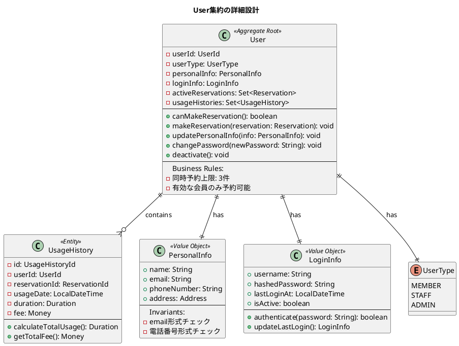
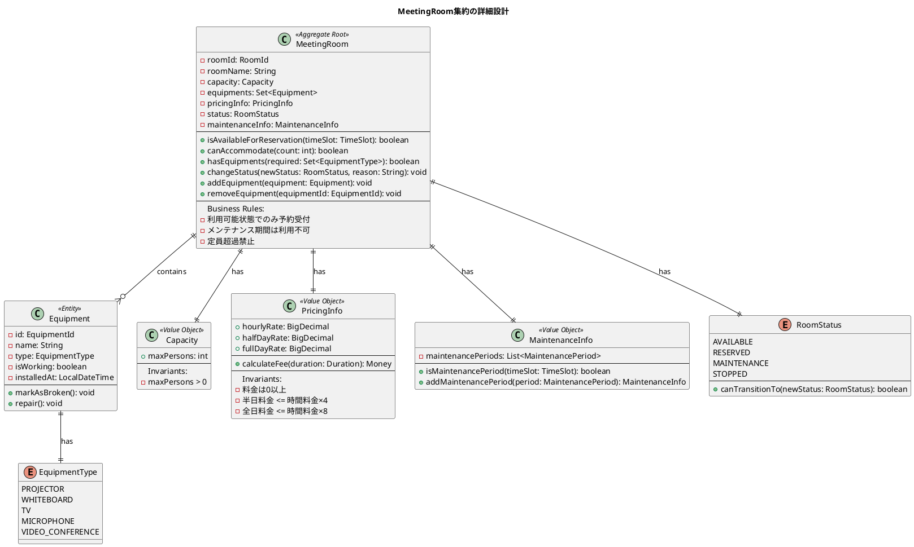
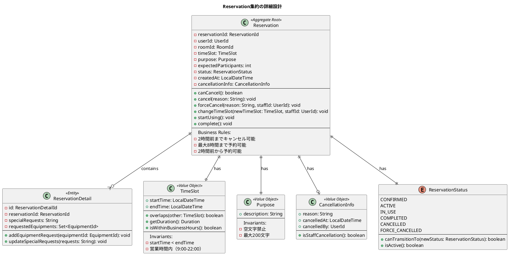
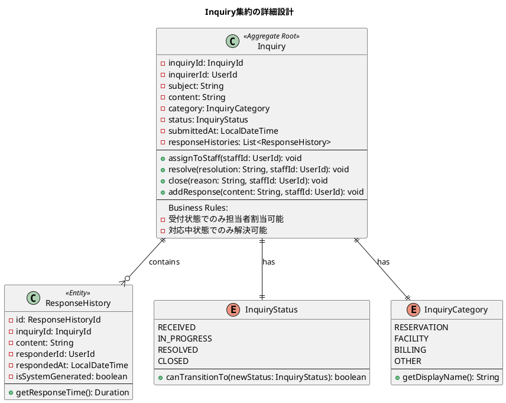
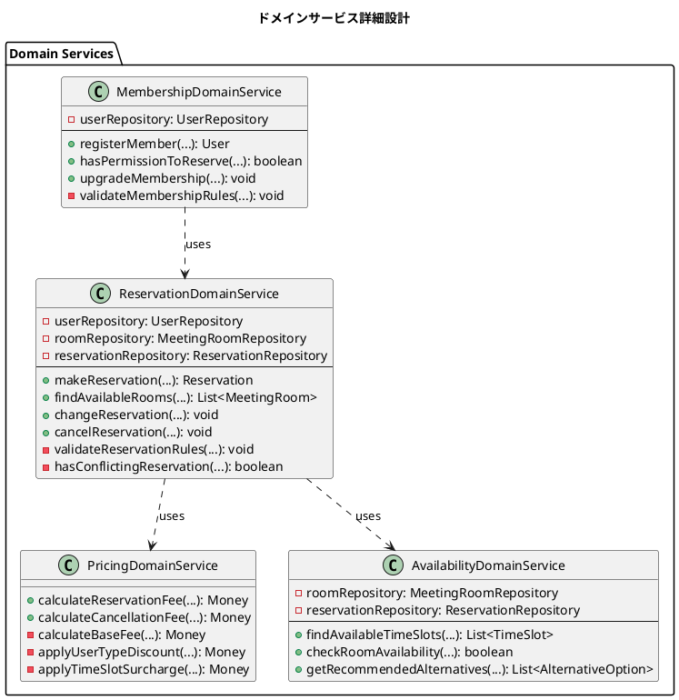

# ドメインモデル設計 - 会議室予約システム

## ドメインモデル概要図

```plantuml
@startuml
!define AGGREGATE_ROOT_COLOR #FFE6CC
!define ENTITY_COLOR #E6F3FF
!define VALUE_OBJECT_COLOR #E6FFE6
!define DOMAIN_SERVICE_COLOR #FFE6E6

title 会議室予約システム ドメインモデル概要図

package "User Aggregate" as UserAgg {
    class User <<Aggregate Root>> AGGREGATE_ROOT_COLOR {
        - userId: UserId
        - userType: UserType
        - personalInfo: PersonalInfo
        - loginInfo: LoginInfo
        - activeReservations: Set<Reservation>
        + canMakeReservation(): boolean
        + makeReservation(reservation: Reservation): void
    }
    
    class UsageHistory <<Entity>> ENTITY_COLOR {
        - id: UsageHistoryId
        - userId: UserId
        - reservationId: ReservationId
        - usageDate: LocalDateTime
        - duration: Duration
        - fee: Money
    }
    
    class PersonalInfo <<Value Object>> VALUE_OBJECT_COLOR {
        + name: String
        + email: String
        + phoneNumber: String
        + address: Address
    }
    
    class LoginInfo <<Value Object>> VALUE_OBJECT_COLOR {
        + username: String
        + hashedPassword: String
        + lastLoginAt: LocalDateTime
        + isActive: boolean
    }
}

package "MeetingRoom Aggregate" as RoomAgg {
    class MeetingRoom <<Aggregate Root>> AGGREGATE_ROOT_COLOR {
        - roomId: RoomId
        - roomName: String
        - capacity: Capacity
        - equipments: Set<Equipment>
        - pricingInfo: PricingInfo
        - status: RoomStatus
        - maintenanceInfo: MaintenanceInfo
        + isAvailableForReservation(timeSlot: TimeSlot): boolean
        + canAccommodate(count: int): boolean
        + hasEquipments(required: Set<EquipmentType>): boolean
    }
    
    class Equipment <<Entity>> ENTITY_COLOR {
        - id: EquipmentId
        - name: String
        - type: EquipmentType
        - isWorking: boolean
    }
    
    class Capacity <<Value Object>> VALUE_OBJECT_COLOR {
        + maxPersons: int
    }
    
    class PricingInfo <<Value Object>> VALUE_OBJECT_COLOR {
        + hourlyRate: BigDecimal
        + halfDayRate: BigDecimal
        + fullDayRate: BigDecimal
    }
    
    class MaintenanceInfo <<Value Object>> VALUE_OBJECT_COLOR {
        - maintenancePeriods: List<MaintenancePeriod>
        + isMaintenancePeriod(timeSlot: TimeSlot): boolean
    }
}

package "Reservation Aggregate" as ReservationAgg {
    class Reservation <<Aggregate Root>> AGGREGATE_ROOT_COLOR {
        - reservationId: ReservationId
        - userId: UserId
        - roomId: RoomId
        - timeSlot: TimeSlot
        - purpose: Purpose
        - expectedParticipants: int
        - status: ReservationStatus
        - createdAt: LocalDateTime
        - cancellationInfo: CancellationInfo
        + canCancel(): boolean
        + cancel(reason: String): void
        + forceCancel(reason: String, staffId: UserId): void
    }
    
    class ReservationDetail <<Entity>> ENTITY_COLOR {
        - id: ReservationDetailId
        - reservationId: ReservationId
        - specialRequests: String
        - requestedEquipments: Set<EquipmentId>
    }
    
    class TimeSlot <<Value Object>> VALUE_OBJECT_COLOR {
        + startTime: LocalDateTime
        + endTime: LocalDateTime
        + overlaps(other: TimeSlot): boolean
        + getDuration(): Duration
    }
    
    class Purpose <<Value Object>> VALUE_OBJECT_COLOR {
        + description: String
    }
    
    class CancellationInfo <<Value Object>> VALUE_OBJECT_COLOR {
        + reason: String
        + cancelledAt: LocalDateTime
        + cancelledBy: UserId
    }
}

package "Inquiry Aggregate" as InquiryAgg {
    class Inquiry <<Aggregate Root>> AGGREGATE_ROOT_COLOR {
        - inquiryId: InquiryId
        - inquirerId: UserId
        - subject: String
        - content: String
        - category: InquiryCategory
        - status: InquiryStatus
        - submittedAt: LocalDateTime
        - responseHistories: List<ResponseHistory>
        + assignToStaff(staffId: UserId): void
        + resolve(resolution: String, staffId: UserId): void
    }
    
    class ResponseHistory <<Entity>> ENTITY_COLOR {
        - id: ResponseHistoryId
        - inquiryId: InquiryId
        - content: String
        - responderId: UserId
        - respondedAt: LocalDateTime
    }
}

package "Domain Services" as Services {
    class ReservationDomainService <<Domain Service>> DOMAIN_SERVICE_COLOR {
        + makeReservation(...): Reservation
        + findAvailableRooms(...): List<MeetingRoom>
        + changeReservation(...): void
    }
    
    class PricingDomainService <<Domain Service>> DOMAIN_SERVICE_COLOR {
        + calculateReservationFee(...): Money
    }
    
    class MembershipDomainService <<Domain Service>> DOMAIN_SERVICE_COLOR {
        + registerMember(...): User
        + hasPermissionToReserve(...): boolean
    }
}

' 集約間の関係（IDによる参照）
User ||--o{ UsageHistory : contains
MeetingRoom ||--o{ Equipment : contains
Reservation ||--o{ ReservationDetail : contains
Inquiry ||--o{ ResponseHistory : contains

' 値オブジェクトとの関係
User ||--|| PersonalInfo : has
User ||--|| LoginInfo : has
MeetingRoom ||--|| Capacity : has
MeetingRoom ||--|| PricingInfo : has
MeetingRoom ||--|| MaintenanceInfo : has
Reservation ||--|| TimeSlot : has
Reservation ||--|| Purpose : has
Reservation ||--o| CancellationInfo : has

' ドメインサービスとの関係
ReservationDomainService ..> User : uses
ReservationDomainService ..> MeetingRoom : uses
ReservationDomainService ..> Reservation : creates
PricingDomainService ..> MeetingRoom : uses
MembershipDomainService ..> User : creates

@enduml
```



## 集約別詳細図

### User集約



### MeetingRoom集約



### Reservation集約



### Inquiry集約



## ドメインサービス詳細図



## ビジネス不変条件マトリックス

```plantuml
@startuml
title ビジネス不変条件とその実装場所

|= 不変条件 |= 実装場所 |= 検証タイミング |= 例外 |
| 同時予約上限3件 | User.canMakeReservation() | 予約作成時 | BusinessRuleException |
| 2時間前予約制限 | Reservation.validateAdvanceBooking() | 予約作成時 | BusinessRuleException |
| 2時間前キャンセル制限 | Reservation.canCancel() | キャンセル時 | BusinessRuleException |
| 最大8時間予約制限 | Reservation.validateReservationDuration() | 予約作成時 | BusinessRuleException |
| 営業時間制約 | TimeSlot.isWithinBusinessHours() | 予約作成時 | BusinessRuleException |
| 定員超過禁止 | MeetingRoom.canAccommodate() | 予約作成時 | BusinessRuleException |
| 重複予約禁止 | ReservationDomainService.hasConflictingReservation() | 予約作成時 | ReservationConflictException |
| メンテナンス期間利用禁止 | MeetingRoom.isAvailableForReservation() | 予約作成時 | BusinessRuleException |
| 無効ユーザー予約禁止 | User.ensureActiveUser() | 予約作成時 | InactiveUserException |
| 状態遷移ルール | Status.canTransitionTo() | 状態変更時 | InvalidStateTransitionException |

@enduml
```
