# 論理データモデル - 会議室予約システム

## 概要

会議室予約システムの論理データモデルを定義します。要件定義・ユースケース・ユーザーストーリーから抽出したエンティティを正規化し、業務ルールを反映した論理構造を構築します。

## エンティティ関連図

```plantuml
@startuml

title 論理データモデル - 会議室予約システム

' ユーザー管理エンティティ群
entity "Users" as users {
  * user_id : UUID <<PK>>
  --
  * full_name : VARCHAR(100)
  * email : VARCHAR(255) <<UK>>
  phone_number : VARCHAR(20)
  organization : VARCHAR(100)
  * role : ENUM('MEMBER', 'STAFF', 'ADMIN')
  * status : ENUM('ACTIVE', 'INACTIVE')
  * created_at : TIMESTAMP
  * updated_at : TIMESTAMP
}

entity "LoginInfo" as login_info {
  * login_id : UUID <<PK>>
  --
  * user_id : UUID <<FK>>
  * password_hash : VARCHAR(255)
  last_login_at : TIMESTAMP
  password_updated_at : TIMESTAMP
  failed_attempts : INTEGER
  locked_until : TIMESTAMP
}

entity "UsageHistory" as usage_history {
  * history_id : UUID <<PK>>
  --
  * user_id : UUID <<FK>>
  reservation_id : UUID <<FK>>
  * action : ENUM('CREATE', 'UPDATE', 'CANCEL', 'FORCE_CANCEL')
  * executed_at : TIMESTAMP
  details : TEXT
}

' 会議室管理エンティティ群
entity "Rooms" as rooms {
  * room_id : UUID <<PK>>
  --
  * room_name : VARCHAR(100) <<UK>>
  * capacity : INTEGER
  * location : VARCHAR(100)
  description : TEXT
  * status : ENUM('AVAILABLE', 'MAINTENANCE', 'DISABLED')
  * created_at : TIMESTAMP
  * updated_at : TIMESTAMP
}

entity "Equipment" as equipment {
  * equipment_id : UUID <<PK>>
  --
  * equipment_name : VARCHAR(50)
  description : TEXT
  * status : ENUM('AVAILABLE', 'DISABLED')
}

entity "RoomEquipment" as room_equipment {
  * room_id : UUID <<PK,FK>>
  * equipment_id : UUID <<PK,FK>>
  --
  quantity : INTEGER
  notes : VARCHAR(255)
}

entity "Pricing" as pricing {
  * pricing_id : UUID <<PK>>
  --
  * room_id : UUID <<FK>>
  * pricing_type : ENUM('HOURLY', 'DAILY', 'FIXED')
  * base_price : DECIMAL(10,2)
  hour_price : DECIMAL(10,2)
  * effective_from : DATE
  effective_to : DATE
}

entity "Maintenance" as maintenance {
  * maintenance_id : UUID <<PK>>
  --
  * room_id : UUID <<FK>>
  * start_datetime : TIMESTAMP
  * end_datetime : TIMESTAMP
  * content : TEXT
  * status : ENUM('SCHEDULED', 'IN_PROGRESS', 'COMPLETED')
  * created_at : TIMESTAMP
}

' 予約管理エンティティ群
entity "Reservations" as reservations {
  * reservation_id : UUID <<PK>>
  --
  * user_id : UUID <<FK>>
  * room_id : UUID <<FK>>
  * start_datetime : TIMESTAMP
  * end_datetime : TIMESTAMP
  * participant_count : INTEGER
  purpose : TEXT
  notes : TEXT
  * status : ENUM('CONFIRMED', 'CANCELLED', 'FORCE_CANCELLED')
  * created_at : TIMESTAMP
  * updated_at : TIMESTAMP
}

entity "CancellationInfo" as cancellation_info {
  * cancellation_id : UUID <<PK>>
  --
  * reservation_id : UUID <<FK>>
  * cancelled_by : UUID <<FK>>
  reason : TEXT
  * cancelled_at : TIMESTAMP
}

' 問い合わせ管理エンティティ群
entity "Inquiries" as inquiries {
  * inquiry_id : UUID <<PK>>
  --
  * inquirer_name : VARCHAR(100)
  * inquirer_email : VARCHAR(255)
  * subject : VARCHAR(200)
  * content : TEXT
  * priority : ENUM('LOW', 'MEDIUM', 'HIGH', 'URGENT')
  * status : ENUM('RECEIVED', 'IN_PROGRESS', 'RESOLVED', 'CLOSED')
  * received_at : TIMESTAMP
  * updated_at : TIMESTAMP
}

entity "InquiryResponses" as inquiry_responses {
  * response_id : UUID <<PK>>
  --
  * inquiry_id : UUID <<FK>>
  * responder_id : UUID <<FK>>
  * response_content : TEXT
  * action_type : ENUM('ACKNOWLEDGED', 'REPLIED', 'INVESTIGATED', 'COMPLETED')
  * responded_at : TIMESTAMP
}

' 関連の定義
users ||--o{ login_info : "1対1"
users ||--o{ usage_history : "1対多"
users ||--o{ reservations : "1対多"
users ||--o{ cancellation_info : "キャンセル実行者"
users ||--o{ inquiry_responses : "対応者"

rooms ||--o{ room_equipment : "1対多"
equipment ||--o{ room_equipment : "1対多"
rooms ||--o{ pricing : "1対多"
rooms ||--o{ maintenance : "1対多"
rooms ||--o{ reservations : "1対多"

reservations ||--o{ usage_history : "1対多"
reservations ||--o{ cancellation_info : "1対1"

inquiries ||--o{ inquiry_responses : "1対多"

@enduml
```



## エンティティ詳細仕様

### 1. Users（ユーザー情報）

**目的**: システム利用者の基本情報管理

| 属性名 | データ型 | 制約 | 説明 |
|--------|----------|------|------|
| user_id | UUID | PK, NOT NULL | ユーザー識別子 |
| full_name | VARCHAR(100) | NOT NULL | 氏名 |
| email | VARCHAR(255) | UK, NOT NULL | メールアドレス |
| phone_number | VARCHAR(20) | | 電話番号 |
| organization | VARCHAR(100) | | 所属組織 |
| role | ENUM | NOT NULL | 役割：MEMBER/STAFF/ADMIN |
| status | ENUM | NOT NULL | 状態：ACTIVE/INACTIVE |
| created_at | TIMESTAMP | NOT NULL | 作成日時 |
| updated_at | TIMESTAMP | NOT NULL | 更新日時 |

**業務ルール**:
- メールアドレスはユニーク制約
- 会員の同時予約上限は3件
- ステータスがINACTIVEの場合、新規予約不可

### 2. LoginInfo（ログイン情報）

**目的**: ユーザー認証情報の管理

| 属性名 | データ型 | 制約 | 説明 |
|--------|----------|------|------|
| login_id | UUID | PK, NOT NULL | ログイン情報識別子 |
| user_id | UUID | FK, NOT NULL | ユーザーID |
| password_hash | VARCHAR(255) | NOT NULL | ハッシュ化パスワード |
| last_login_at | TIMESTAMP | | 最終ログイン日時 |
| password_updated_at | TIMESTAMP | | パスワード更新日時 |
| failed_attempts | INTEGER | DEFAULT 0 | 連続失敗回数 |
| locked_until | TIMESTAMP | | ロック解除日時 |

**業務ルール**:
- パスワードはBCryptでハッシュ化
- 連続失敗5回でアカウントロック（30分）

### 3. Rooms（会議室情報）

**目的**: 会議室の基本情報管理

| 属性名 | データ型 | 制約 | 説明 |
|--------|----------|------|------|
| room_id | UUID | PK, NOT NULL | 会議室識別子 |
| room_name | VARCHAR(100) | UK, NOT NULL | 会議室名 |
| capacity | INTEGER | NOT NULL | 定員 |
| location | VARCHAR(100) | NOT NULL | 場所 |
| description | TEXT | | 説明 |
| status | ENUM | NOT NULL | 状態：AVAILABLE/MAINTENANCE/DISABLED |
| created_at | TIMESTAMP | NOT NULL | 作成日時 |
| updated_at | TIMESTAMP | NOT NULL | 更新日時 |

**業務ルール**:
- 会議室名はユニーク制約
- MAINTENANCE/DISABLEDステータス時は予約不可

### 4. Reservations（予約情報）

**目的**: 会議室予約の管理

| 属性名 | データ型 | 制約 | 説明 |
|--------|----------|------|------|
| reservation_id | UUID | PK, NOT NULL | 予約識別子 |
| user_id | UUID | FK, NOT NULL | 予約者ID |
| room_id | UUID | FK, NOT NULL | 会議室ID |
| start_datetime | TIMESTAMP | NOT NULL | 利用開始日時 |
| end_datetime | TIMESTAMP | NOT NULL | 利用終了日時 |
| participant_count | INTEGER | NOT NULL | 参加人数 |
| purpose | TEXT | | 利用目的 |
| notes | TEXT | | 備考 |
| status | ENUM | NOT NULL | 状態：CONFIRMED/CANCELLED/FORCE_CANCELLED |
| created_at | TIMESTAMP | NOT NULL | 作成日時 |
| updated_at | TIMESTAMP | NOT NULL | 更新日時 |

**業務ルール**:
- 同一時間帯の重複予約禁止
- 利用開始2時間前までの予約・キャンセル制限
- 終了時間は開始時間より後である必要
- 参加人数は会議室定員以下

## 制約条件

### 時間制約
```sql
-- 予約時間の整合性チェック
ALTER TABLE reservations 
ADD CONSTRAINT chk_reservation_time 
CHECK (end_datetime > start_datetime);

-- 2時間前ルールチェック（アプリケーションレベル）
-- 現在時刻 + 2時間 < start_datetime
```

### 重複予約防止
```sql
-- 同一会議室・時間帯の重複防止
CREATE UNIQUE INDEX idx_room_time_overlap
ON reservations (room_id, start_datetime, end_datetime)
WHERE status = 'CONFIRMED';
```

### 同時予約件数制限
```sql
-- 1ユーザーの同時予約数制限（アプリケーションレベル）
-- COUNT(*) FROM reservations 
-- WHERE user_id = ? AND status = 'CONFIRMED' <= 3
```

## インデックス設計

### パフォーマンス最適化
```sql
-- 予約検索最適化
CREATE INDEX idx_reservations_room_date 
ON reservations (room_id, start_datetime, status);

-- ユーザー予約一覧最適化
CREATE INDEX idx_reservations_user_date 
ON reservations (user_id, start_datetime DESC, status);

-- 会議室検索最適化
CREATE INDEX idx_rooms_status_capacity 
ON rooms (status, capacity);
```

## 正規化レベル

**第3正規形（3NF）**を採用：
- 第1正規形：各属性が原子値
- 第2正規形：非キー属性が主キーに完全関数従属
- 第3正規形：非キー属性間の推移的関数従属を排除

**非正規化の検討箇所**：
- UsageHistory: パフォーマンス向上のため、ユーザー名・会議室名を非正規化
- Reservations: 頻繁アクセスのため、会議室名をキャッシュ

## データ整合性制御

### 参照整合性
- CASCADE: Users削除時のUsageHistory削除
- RESTRICT: 予約中のRooms削除制限
- SET NULL: キャンセル実行者削除時の対応

### トランザクション境界
1. **予約作成**: Reservations + UsageHistory
2. **キャンセル**: Reservations更新 + CancellationInfo作成 + UsageHistory
3. **会員削除**: Users更新 + LoginInfo削除

---

## 次のステップ

1. **物理データモデル**: PostgreSQL固有の機能を活用
2. **パフォーマンスチューニング**: インデックス・パーティション設計
3. **セキュリティ**: 暗号化・アクセス制御
4. **監査**: 変更履歴・ログ設計

---

## 最終更新
- **作成日**: 2025-09-10
- **作成者**: AI Assistant  
- **バージョン**: 1.0.0