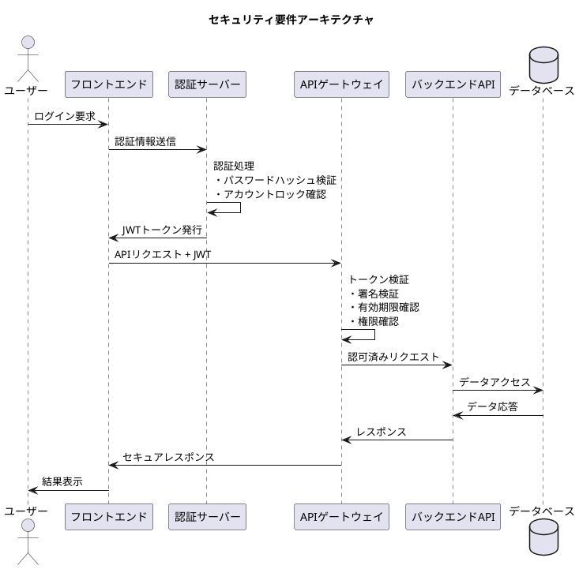
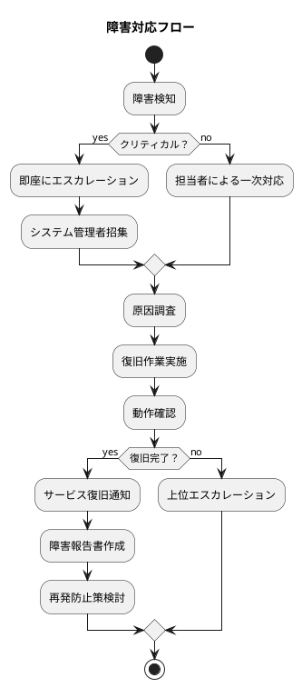

# 非機能要件仕様書 - 会議室予約システム

## システム概要

**システム名**: 会議室予約システム  
**対象システム**: Web アプリケーション（React フロントエンド + Spring Boot バックエンド）  
**想定ユーザー数**: 最大 500 名（同時アクセス 100 名）  
**運用時間**: 24時間365日  

## 品質属性一覧

### 1. パフォーマンス要件

#### 1.1 レスポンス時間要件

| 機能分類 | 目標値 | 最大許容値 | 測定条件 |
|----------|--------|------------|----------|
| 会議室検索 | 0.5秒 | 1.0秒 | 検索条件入力から結果表示まで |
| 予約確定 | 1.0秒 | 2.0秒 | 予約ボタン押下から完了画面表示まで |
| ログイン認証 | 0.3秒 | 0.5秒 | ログインボタン押下からダッシュボード表示まで |
| 予約一覧表示 | 0.5秒 | 1.0秒 | 画面アクセスから一覧表示完了まで |
| 管理画面操作 | 1.0秒 | 2.0秒 | CRUD操作実行から結果表示まで |

#### 1.2 スループット要件

| 指標 | 目標値 | 測定条件 |
|------|--------|----------|
| 同時ユーザー数 | 100名 | 正常レスポンス維持 |
| 最大同時ユーザー数 | 200名 | 性能劣化許容範囲内 |
| 予約処理能力 | 50件/分 | ピーク時の予約処理数 |
| 検索処理能力 | 500件/分 | 検索クエリ実行数 |

#### 1.3 リソース使用量

| リソース | 目標値 | 最大許容値 |
|----------|--------|------------|
| CPU使用率 | 60%以下 | 80%以下 |
| メモリ使用率 | 70%以下 | 85%以下 |
| ディスク使用率 | 80%以下 | 90%以下 |
| ネットワーク帯域 | 100Mbps | 1Gbps |

### 2. 可用性要件

#### 2.1 稼働率要件

| 指標 | 目標値 | 測定期間 | 許容ダウンタイム |
|------|--------|----------|------------------|
| システム稼働率 | 99.9% | 月次 | 43分/月 |
| 年間稼働率 | 99.5% | 年次 | 1.8日/年 |
| 計画メンテナンス | 月1回 | - | 2時間/回 |

#### 2.2 復旧時間要件

| 障害レベル | 目標復旧時間 | 最大許容時間 |
|------------|--------------|--------------|
| クリティカル障害 | 1時間 | 2時間 |
| 重要障害 | 4時間 | 8時間 |
| 軽微な障害 | 24時間 | 48時間 |
| 計画メンテナンス | - | 2時間 |

#### 2.3 災害復旧要件

| 項目 | 要件 |
|------|------|
| バックアップ頻度 | 日次（フル）、1時間毎（差分） |
| バックアップ保持期間 | フル: 30日、差分: 7日 |
| RTO（目標復旧時間） | 4時間 |
| RPO（目標復旧ポイント） | 1時間 |

### 3. セキュリティ要件

#### 3.1 認証・認可要件



| 項目 | 要件 |
|------|------|
| 認証方式 | JWT（JSON Web Token） |
| パスワード強度 | 8文字以上、英数字記号混在 |
| パスワードハッシュ | BCrypt（コスト係数12） |
| セッションタイムアウト | 30分（無操作時） |
| アカウントロック | 5回失敗で30分ロック |
| 多要素認証 | スタッフ・管理者は必須 |

#### 3.2 データ保護要件

| データ分類 | 暗号化レベル | アクセス制御 |
|------------|--------------|--------------|
| 個人情報 | AES-256 | ロールベース |
| パスワード | BCrypt | ハッシュ化 |
| 通信データ | TLS 1.3 | 全通信暗号化 |
| バックアップ | AES-256 | アクセス制限 |

#### 3.3 監査・ログ要件

| ログ種別 | 記録内容 | 保持期間 |
|----------|----------|----------|
| アクセスログ | ユーザー、時刻、操作、結果 | 1年 |
| セキュリティログ | 認証、認可、不正アクセス | 2年 |
| エラーログ | システムエラー、例外 | 6か月 |
| 監査ログ | データ変更、設定変更 | 3年 |

### 4. ユーザビリティ要件

#### 4.1 操作性要件

| 項目 | 要件 |
|------|------|
| 主要機能アクセス | 3クリック以内 |
| 予約完了時間 | 従来比90%短縮 |
| エラーメッセージ | 分かりやすい日本語表記 |
| ヘルプ機能 | 各画面にコンテキスト依存ヘルプ |

#### 4.2 アクセシビリティ要件

| 項目 | 要件 |
|------|------|
| 準拠基準 | WCAG 2.1 AA レベル |
| キーボード操作 | マウス無しでも全機能利用可能 |
| スクリーンリーダー | NVDA、JAWS対応 |
| 色彩設計 | 色覚特性に配慮（コントラスト比4.5:1以上） |

#### 4.3 レスポンシブデザイン要件

| デバイス | 画面サイズ | 対応要件 |
|----------|------------|----------|
| デスクトップ | 1920×1080以上 | フル機能 |
| タブレット | 768×1024 | 主要機能 |
| モバイル | 375×667以上 | 検索・予約・確認 |

### 5. 拡張性・保守性要件

#### 5.1 拡張性要件

| 項目 | 現在 | 将来対応 |
|------|------|----------|
| ユーザー数 | 500名 | 2,000名 |
| 会議室数 | 50室 | 200室 |
| 同時接続数 | 100名 | 400名 |
| データ量 | 100GB | 1TB |

#### 5.2 保守性要件

| 項目 | 要件 |
|------|------|
| コードカバレッジ | 80%以上 |
| 技術文書 | 常に最新状態維持 |
| API仕様 | OpenAPI形式で管理 |
| バージョン管理 | セマンティックバージョニング |

### 6. 互換性要件

#### 6.1 ブラウザ対応要件

| ブラウザ | 対応バージョン |
|----------|----------------|
| Google Chrome | 最新版 + 2世代前まで |
| Mozilla Firefox | 最新版 + 2世代前まで |
| Microsoft Edge | 最新版 + 2世代前まで |
| Safari | 最新版 + 1世代前まで |

#### 6.2 外部システム連携要件

| システム | 連携方式 | データ形式 |
|----------|----------|------------|
| 既存業務システム | REST API | JSON |
| メール配信システム | SMTP | RFC2822準拠 |
| 認証システム | SAML/OAuth | 標準準拠 |

### 7. 制約要件

#### 7.1 技術制約

| 項目 | 制約内容 |
|------|----------|
| 開発言語 | Java 21、TypeScript 5.0+ |
| フレームワーク | Spring Boot 3.3+、React 18+ |
| データベース | PostgreSQL 15+ |
| クラウド | オンプレミス運用 |

#### 7.2 運用制約

| 項目 | 制約内容 |
|------|----------|
| メンテナンス窓 | 毎月第3日曜 2:00-4:00 |
| バックアップ窓 | 毎日 1:00-2:00 |
| 監視体制 | 平日 9:00-18:00 有人監視 |
| サポート体制 | 営業時間内（平日 9:00-17:00） |

## 品質メトリクス

### パフォーマンス測定

```javascript
// パフォーマンス測定実装例
class PerformanceMonitor {
  measureResponseTime(operation, threshold) {
    const startTime = performance.now();
    return operation().then(result => {
      const endTime = performance.now();
      const responseTime = endTime - startTime;
      
      if (responseTime > threshold) {
        this.alertSlowResponse(operation.name, responseTime);
      }
      
      this.recordMetric('response_time', operation.name, responseTime);
      return result;
    });
  }
  
  measureConcurrentUsers() {
    // 同時アクセス数監視
  }
}
```

### 可用性測定

```java
// 可用性監視実装例
@Component
public class AvailabilityMonitor {
    
    @Scheduled(fixedRate = 60000) // 1分毎
    public void healthCheck() {
        long startTime = System.currentTimeMillis();
        try {
            // データベース接続確認
            databaseHealthCheck();
            // 外部システム接続確認
            externalSystemHealthCheck();
            
            long responseTime = System.currentTimeMillis() - startTime;
            recordUptime(responseTime);
        } catch (Exception e) {
            recordDowntime(e);
            alertDowntime(e);
        }
    }
}
```

## 監視・アラート設定

### システム監視項目

| 監視項目 | 閾値 | アクション |
|----------|------|------------|
| CPU使用率 | 80%超過 | 警告アラート |
| メモリ使用率 | 85%超過 | 警告アラート |
| レスポンス時間 | 2秒超過 | 障害アラート |
| エラー率 | 1%超過 | 警告アラート |
| 同時接続数 | 150超過 | 警告アラート |

### ビジネス監視項目

| 監視項目 | 閾値 | アクション |
|----------|------|------------|
| 予約成功率 | 95%以下 | 警告アラート |
| ログイン失敗率 | 5%超過 | セキュリティアラート |
| 問い合わせ増加率 | 前週比200% | 業務アラート |

## テスト要件

### 非機能テスト項目

| テスト種類 | テスト内容 | 実施タイミング |
|------------|------------|----------------|
| 性能テスト | 負荷テスト、ストレステスト | リリース前 |
| セキュリティテスト | 脆弱性診断、侵入テスト | リリース前・定期 |
| 可用性テスト | 障害復旧テスト、冗長化確認 | リリース前 |
| ユーザビリティテスト | ユーザー受け入れテスト | 各リリース |

### テスト自動化

```yaml
# CI/CD パフォーマンステスト例
performance_test:
  stage: test
  script:
    - artillery quick --count 100 --num 10 $TARGET_URL
    - k6 run --vus 50 --duration 30s load-test.js
  artifacts:
    reports:
      performance: performance-report.xml
```

## 運用手順書

### 障害対応フロー



### 定期メンテナンス手順

1. **事前準備**（メンテナンス1週間前）
   - ユーザー通知
   - バックアップ確認
   - ロールバック手順確認

2. **メンテナンス実施**
   - サービス停止告知
   - システム停止
   - メンテナンス作業
   - 動作確認

3. **事後確認**
   - サービス復旧通知
   - 監視状況確認
   - 作業報告書作成

## まとめ

この非機能要件仕様書は、会議室予約システムが安全で高性能、かつ利用しやすいシステムとして運用されるための基準を定めています。

### 重要な品質目標

1. **パフォーマンス**: 1秒以内レスポンス、100同時ユーザー対応
2. **可用性**: 99.9%稼働率、24時間365日運用
3. **セキュリティ**: 個人情報保護、不正アクセス防止
4. **ユーザビリティ**: 直感的操作、アクセシビリティ対応

これらの要件を満たすことで、会議室利用の完全セルフサービス化と、窓口問い合わせ80%削減、会議室稼働率20%向上の目標を達成できます。