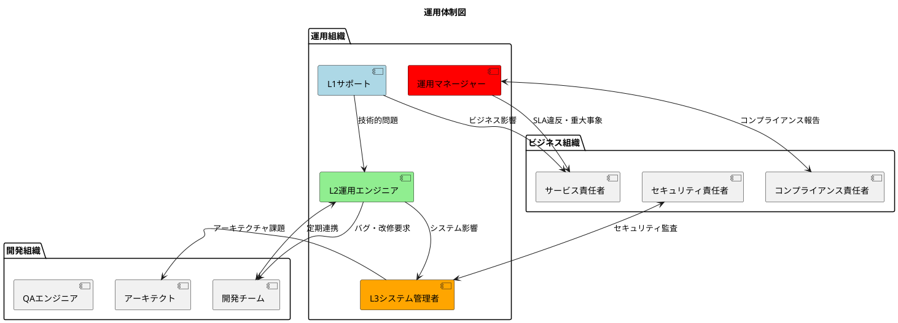
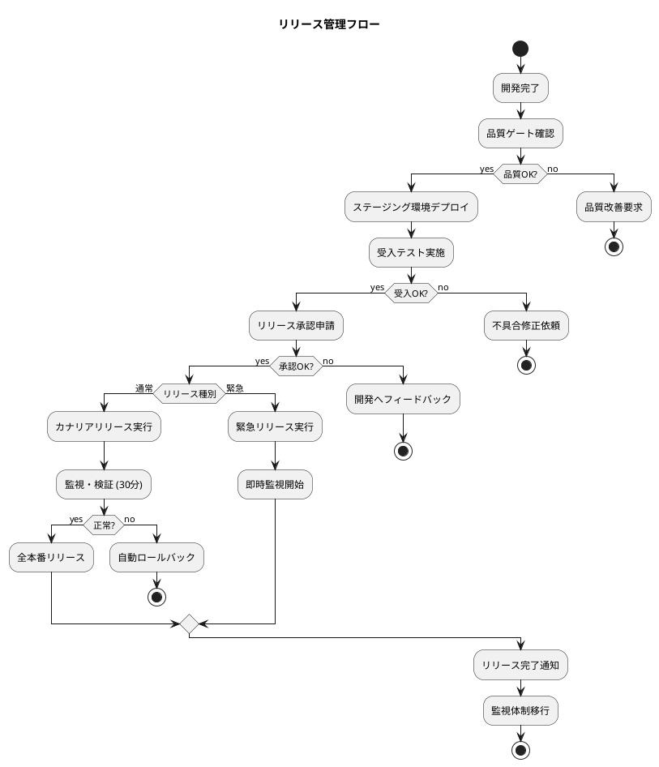
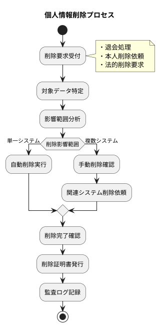
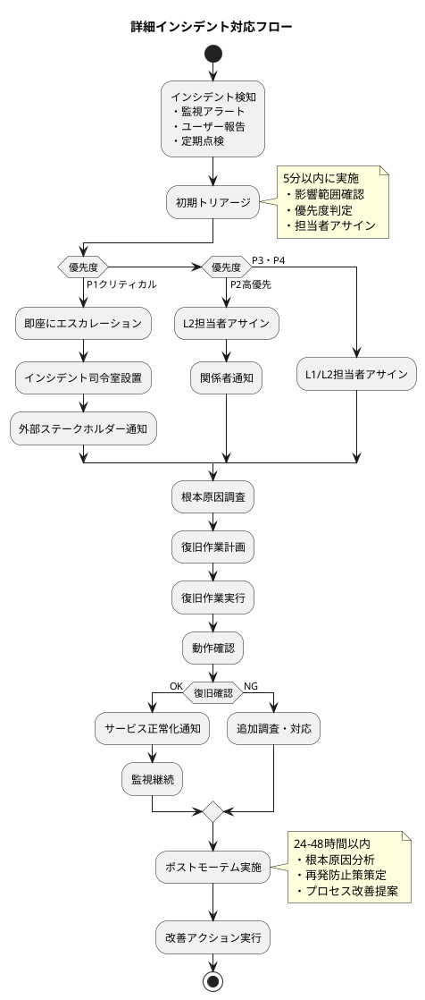
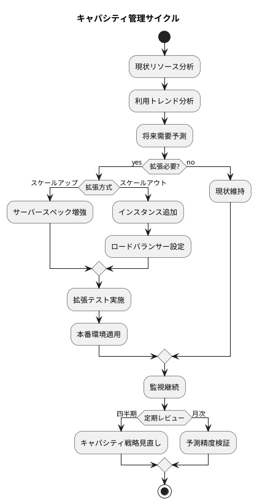
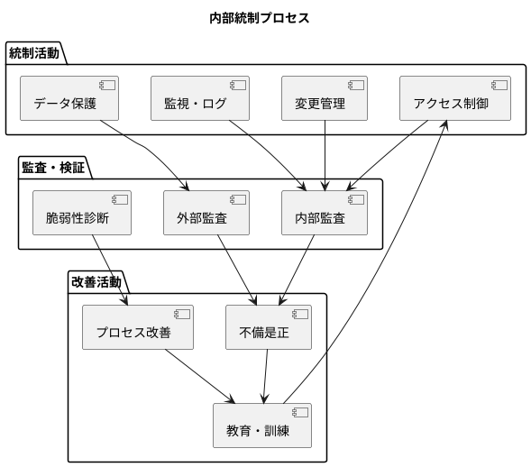
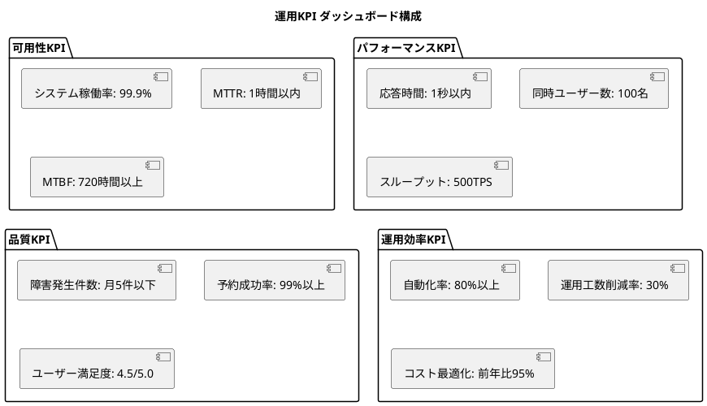
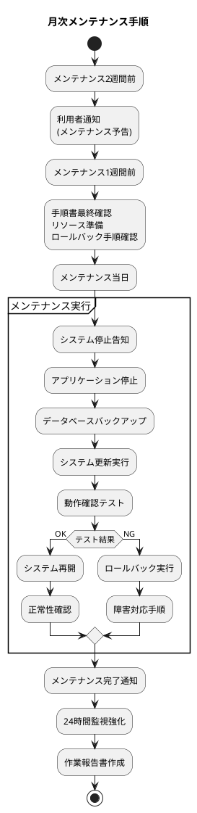

# 運用要件仕様書 - 会議室予約システム

## 概要

本文書は、会議室予約システムの**運用フェーズ**における要件を定義します。  
[非機能要件仕様書](non_functional_requirements.md) と連携し、実際の運用における組織・プロセス・手順を規定します。

## 運用体制要件

### 運用組織構造



### 役割・責任定義

#### L1サポート（ヘルプデスク）
**役割**: ユーザーからの問い合わせ対応  
**責任範囲**:
- ユーザーサポート（操作方法・FAQ）
- インシデント受付・初期トリアージ
- 営業時間: 平日 9:00-18:00  
**要求スキル**: システム基本操作、顧客対応  

#### L2運用エンジニア
**役割**: システム運用・監視・軽微な障害対応  
**責任範囲**:
- システム監視・アラート対応
- 定期メンテナンス実施
- 軽微な設定変更・データ修正
- 24時間オンコール対応（ローテーション）  
**要求スキル**: Java、Spring Boot、PostgreSQL、Linux  

#### L3システム管理者
**役割**: 重大障害対応・システム設計変更  
**責任範囲**:
- クリティカル障害の復旧対応
- アーキテクチャ変更・大規模メンテナンス
- セキュリティ脆弱性対応
- キャパシティ計画・性能チューニング  
**要求スキル**: システム設計、セキュリティ、データベース最適化  

#### 運用マネージャー
**役割**: 運用全体の統括・改善推進  
**責任範囲**:
- SLA管理・KPI監視
- 運用プロセス改善
- ベンダー管理・コスト最適化
- 事業継続計画（BCP）策定  

### オンコール体制

| レベル | 対応時間 | 連絡方法 | エスカレーション時間 |
|--------|----------|----------|---------------------|
| L1 | 平日 9:00-18:00 | 電話・チャット | 1時間 |
| L2 | 24時間365日 | PagerDuty・電話 | 30分 |
| L3 | 24時間365日 | 緊急時のみ | 15分 |

## システムライフサイクル管理

### リリース管理プロセス



### デプロイ戦略

#### 通常リリース（カナリアリリース）
- **実行タイミング**: 毎週火曜日 10:00-12:00
- **トラフィック配分**: 5% → 25% → 50% → 100%
- **検証時間**: 各段階 30分間
- **ロールバック判定**: エラー率1%超過または応答時間2秒超過

#### 緊急リリース（ホットフィックス）
- **実行タイミング**: 24時間対応
- **承認者**: L3システム管理者 + サービス責任者
- **事後レビュー**: 24時間以内に根本原因分析

### バージョン管理・ブランチ戦略

```
main (本番)
├── release/v1.2.0 (リリース準備)
├── develop (開発統合) 
│   ├── feature/US001-meeting-room-search
│   └── feature/US002-reservation-booking
└── hotfix/critical-security-patch (緊急修正)
```

## データライフサイクル管理

### データ保持・削除ポリシー

| データ種別 | 保持期間 | アーカイブ先 | 削除条件 |
|------------|----------|--------------|----------|
| **予約データ** | 3年 | 冷凍ストレージ | 利用完了から3年経過 |
| **利用履歴** | 7年 | アーカイブDB | 法定保存期間経過 |
| **監査ログ** | 7年 | 外部ストレージ | コンプライアンス要件 |
| **セキュリティログ** | 2年 | 暗号化ストレージ | セキュリティポリシー |
| **個人情報** | 退会時削除 | - | 法的要求・本人削除依頼 |
| **システムログ** | 6か月 | ログ管理基盤 | 容量・性能制限 |

### データ削除プロセス



## インシデント管理プロセス

### SLA定義

| サービスレベル | 目標値 | 測定方法 | ペナルティ |
|----------------|--------|----------|------------|
| **システム稼働率** | 99.9% | 月次監視 | サービスクレジット |
| **インシデント対応時間** | 1時間以内 | 受付から初回対応まで | SLA違反報告 |
| **重要機能復旧時間** | 4時間以内 | 障害発生から復旧まで | エスカレーション |
| **問い合わせ対応時間** | 24時間以内 | L1受付から回答まで | 顧客満足度調査 |

### インシデント分類

```plantuml
@startuml
title インシデント優先度マトリックス

|ビジネス影響|
|#lightcoral|高|#orange|中|#lightgreen|低|
|技術的緊急度|

|高|P1 クリティカル\n・全システム停止\n・データ損失\n・セキュリティ侵害|P2 高優先\n・主要機能停止\n・性能大幅劣化|P3 中優先\n・一部機能停止\n・軽微な性能劣化|

|中|P2 高優先\n・予約機能停止\n・データ不整合|P3 中優先\n・管理機能停止\n・レポート機能停止|P4 低優先\n・UI不具合\n・軽微な機能問題|

|低|P3 中優先\n・ヘルプ機能停止\n・通知機能停止|P4 低優先\n・表示不具合\n・操作性問題|P4 低優先\n・文書更新\n・軽微な改善要求|

@enduml
```

### インシデント対応フロー詳細



## キャパシティ管理

### リソース監視・予測

#### 予測指標と対応基準

| リソース | 監視指標 | 警告閾値 | 拡張判断基準 |
|----------|----------|----------|--------------|
| **CPU** | 使用率（月平均） | 60% | 3か月連続で60%超過 |
| **メモリ** | 使用率（ピーク時） | 70% | 週次ピークで70%超過 |
| **ストレージ** | 使用量（増加率） | 80% | 月次増加率10%以上 |
| **ネットワーク** | 帯域使用率 | 70% | 日次ピークで70%超過 |
| **DB接続数** | 同時接続数 | 70% | ピーク時接続数上昇傾向 |

#### キャパシティ計画



## 運用自動化要件

### 自動化対象・目標

| カテゴリ | 自動化対象 | 現状手動率 | 目標自動化率 |
|----------|------------|------------|-------------|
| **デプロイ** | アプリケーション・DB・設定 | 20% | 90% |
| **監視・アラート** | 閾値監視・通知・初期対応 | 60% | 95% |
| **バックアップ** | データ・設定・ログ | 80% | 99% |
| **セキュリティ** | 脆弱性スキャン・パッチ適用 | 40% | 80% |
| **レポート** | SLA・KPI・稼働状況 | 30% | 85% |

### RunBook自動化

```yaml
# 運用自動化例: 障害対応RunBook
automated_recovery:
  database_connection_failure:
    trigger: "DB接続エラー率 > 50%"
    actions:
      - restart_connection_pool
      - check_database_status  
      - escalate_if_not_recovered
    max_retry: 3
    escalation_time: "10分"
    
  high_memory_usage:
    trigger: "メモリ使用率 > 90%"
    actions:
      - garbage_collection_force
      - restart_application_graceful
      - scale_out_if_pattern_continues
    cooldown: "30分"
```

## コンプライアンス・統制要件

### 法的要求事項への対応

#### 個人情報保護法対応

| 要求事項 | 対応策 | 監査頻度 |
|----------|--------|----------|
| **利用目的明示** | プライバシーポリシー表示 | 年次 |
| **同意取得** | 登録時明示的同意チェック | 四半期 |
| **安全管理措置** | 暗号化・アクセス制御 | 月次 |
| **委託先監督** | ベンダー契約・監査 | 年次 |
| **漏えい時報告** | インシデント対応手順 | 随時 |

#### 内部統制対応



### 運用ガバナンス

#### 変更管理委員会（CAB: Change Advisory Board）

**構成メンバー**:
- サービス責任者（委員長）
- 運用マネージャー
- セキュリティ責任者
- 開発リーダー
- L3システム管理者

**承認基準**:

| 変更種別 | リスクレベル | 承認者 | 承認期間 |
|----------|-------------|--------|----------|
| **緊急変更** | 高 | サービス責任者 | 口頭承認OK |
| **標準変更** | 中 | 運用マネージャー | 24時間 |  
| **軽微変更** | 低 | 担当エンジニア | 事前承認不要 |
| **大規模変更** | 高 | CAB全体 | 1週間 |

## 運用KPI・レポーティング

### 主要KPI定義

#### サービスレベルKPI



#### 運用改善KPI

| KPI | 現状値 | 目標値 | 測定頻度 |
|-----|--------|--------|----------|
| **インシデント削減率** | - | 前年比20%減 | 月次 |
| **自動復旧率** | 30% | 60% | 月次 |
| **予防保守実施率** | 60% | 85% | 四半期 |
| **SLA達成率** | 98% | 99.5% | 月次 |
| **キャパシティ予測精度** | 70% | 85% | 四半期 |

### レポーティング体系

#### 日次レポート（自動生成）
- システム稼働状況
- 主要メトリクス
- アラート・インシデント一覧
- リソース使用状況

#### 週次レポート
- SLA達成状況
- インシデント分析
- キャパシティ状況
- セキュリティ状況

#### 月次レポート（経営層向け）
- サービスレベル評価
- コスト分析
- 改善実績・計画
- リスク評価

## 運用手順書・RunBook

### 定型運用手順

#### 日次運用チェックリスト

```yaml
daily_operations:
  morning_check:
    - システム稼働状況確認
    - 夜間バッチ処理結果確認  
    - アラート・ログ確認
    - リソース使用量確認
    - セキュリティ状況確認
    time_limit: "30分"
    
  evening_check:
    - 日次利用状況確認
    - バックアップ実行確認
    - 翌日メンテナンス準備
    - インシデント状況確認
    time_limit: "20分"
```

#### 月次定期メンテナンス



## 運用コスト最適化

### コスト監視・最適化

#### リソースコスト分析

| リソース種別 | 月額コスト | 最適化目標 | 最適化手法 |
|-------------|------------|------------|------------|
| **サーバー** | ¥200,000 | -15% | 右サイジング・予約インスタンス |
| **データベース** | ¥150,000 | -10% | ストレージ最適化・アーカイブ |
| **ネットワーク** | ¥50,000 | -5% | CDN活用・帯域最適化 |
| **監視ツール** | ¥30,000 | -20% | オープンソース活用 |
| **外部サービス** | ¥100,000 | -25% | 契約見直し・内製化検討 |

#### 自動コスト最適化

```yaml
# コスト最適化自動化
cost_optimization:
  resource_scheduling:
    dev_environment:
      weekdays: "9:00-18:00 運用"
      weekend: "停止"
      holiday: "停止"
    
  auto_scaling:
    scale_down_trigger: "CPU < 30% for 30min"
    scale_up_trigger: "CPU > 70% for 5min"
    min_instances: 2
    max_instances: 10
    
  storage_optimization:
    log_archiving: "90日後に冷凍ストレージ"
    backup_retention: "30日後に低頻度ストレージ"
```

## まとめ

### 運用要件の重要ポイント

1. **24時間365日の安定運用**
   - 3層サポート体制による確実なエスカレーション
   - SLA 99.9% を実現する監視・自動復旧機能

2. **アジャイル開発との両立**
   - 週次リリースサイクルに対応した変更管理
   - 継続的改善による運用品質向上

3. **コンプライアンス確実性**
   - 個人情報保護・内部統制への確実な対応
   - 監査対応の自動化・効率化

4. **運用効率化・コスト最適化**
   - 80%以上の自動化率達成
   - 前年比5%のコスト削減

これらの運用要件により、会議室予約システムの**安定運用**と**継続的価値提供**を実現します。