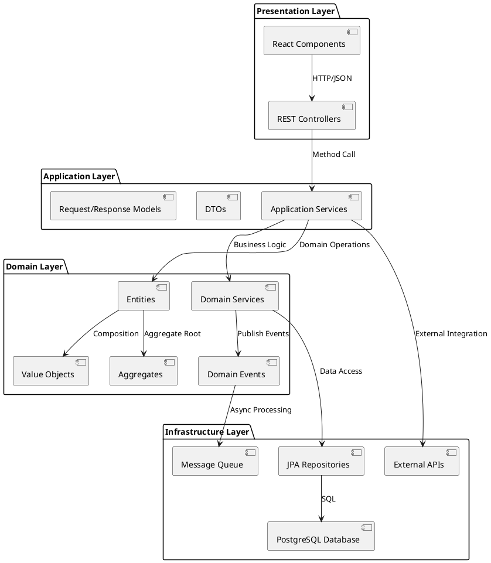
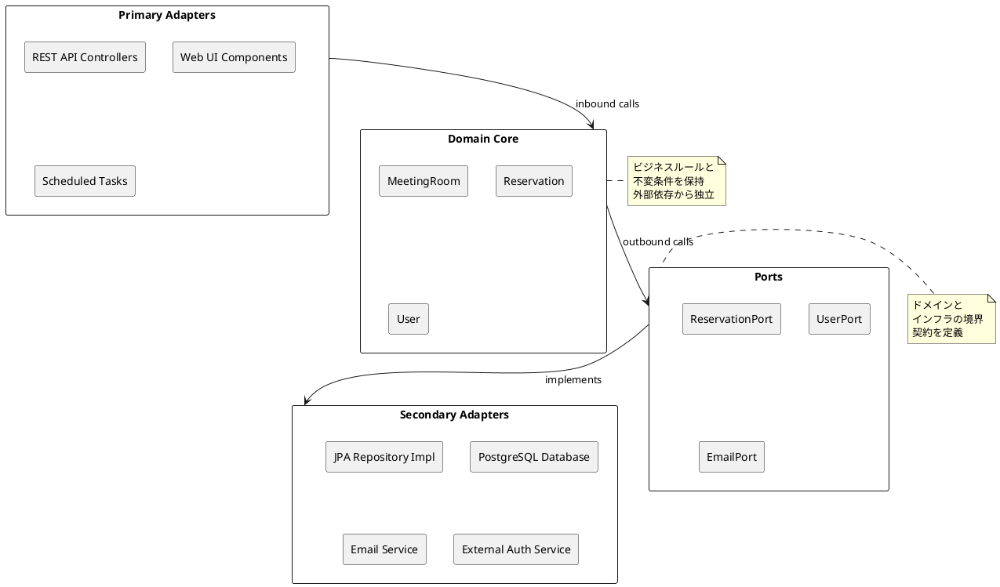
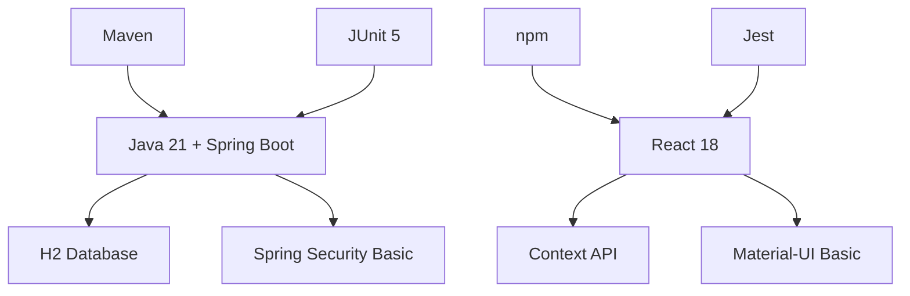
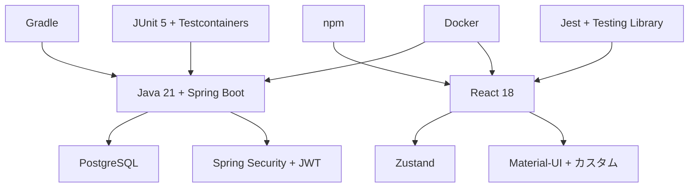
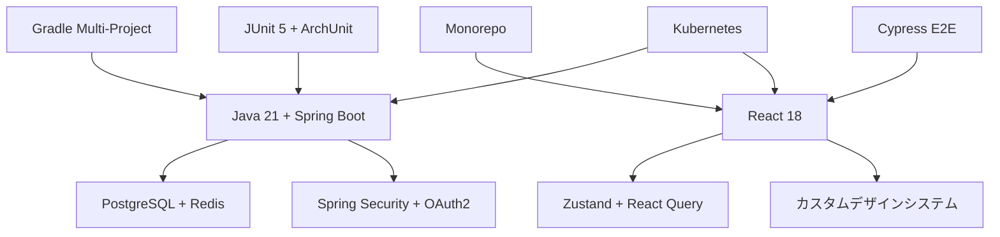

# 技術スタック選定書 - 会議室予約システム

## 概要

本書は会議室予約システムにおける技術スタック選定の分析結果と推奨事項をまとめたものです。
ドメインモデルパターン + ヘキサゴナルアーキテクチャの採用方針に基づき、最適な技術選択を行います。

## プロジェクト情報

- **プロジェクト名**: ai-programing-exercise (会議室予約システム)
- **アーキテクチャパターン**: ドメインモデルパターン
- **アーキテクチャスタイル**: ポートとアダプター（ヘキサゴナル）
- **テスト戦略**: ピラミッド形テスト
- **開発手法**: アジャイル開発（XP）+ TDD

## 現在の技術スタック

### Backend技術スタック

| カテゴリ | 技術 | バージョン | 用途 | 理由 |
|----------|------|------------|------|------|
| **Runtime** | Java | 21 (LTS) | 実行環境 | 長期サポート、安定性、エコシステム |
| **Framework** | Spring Boot | 3.x | アプリケーション基盤 | DI、AOP、豊富な機能 |
| **Security** | Spring Security | 3.x | 認証・認可 | JWT対応、セキュア実装 |
| **Data Access** | Spring Data JPA | 3.x | データアクセス | Repository パターン |
| **Web** | Spring Web | 3.x | REST API | RESTful設計、JSON対応 |
| **Database (Prod)** | PostgreSQL | 15+ | 本番データベース | 性能、信頼性、JSON対応 |
| **Database (Test)** | H2 Database | 2.x | テストデータベース | インメモリ、高速テスト |
| **Build** | Maven | 3.9+ | ビルド管理 | 依存性管理、標準化 |
| **Unit Test** | JUnit | 5 | 単体テスト | アノテーション、アサーション |
| **Mock** | Mockito | 5.x | モックテスト | オブジェクトモッキング |
| **Integration Test** | Testcontainers | 1.19+ | 統合テスト | 実環境に近いテスト |
| **BDD** | Cucumber | 7.x | 振る舞いテスト | 自然言語テスト記述 |
| **Code Style** | Checkstyle | 10.x | コードスタイル | 一貫性確保 |
| **Static Analysis** | PMD | 6.x | 静的解析 | コード品質向上 |
| **Bug Detection** | SpotBugs | 4.x | バグ検出 | 潜在的バグ発見 |
| **Coverage** | JaCoCo | 0.8.x | カバレッジ | テストカバレッジ測定 |

### Frontend技術スタック

| カテゴリ | 技術 | バージョン | 用途 | 理由 |
|----------|------|------------|------|------|
| **Runtime** | Node.js | 20+ (LTS) | JavaScript実行環境 | 長期サポート、パッケージエコシステム |
| **Framework** | React | 18 | UIライブラリ | コンポーネント指向、仮想DOM |
| **Language** | TypeScript | 5+ | 型安全言語 | コンパイル時エラー検出 |
| **UI Components** | Material-UI (MUI) | 5+ | UIコンポーネント | デザインシステム、アクセシビリティ |
| **Routing** | React Router | 6 | SPA ルーティング | 宣言的ルーティング |
| **State (Local)** | React Context API | - | ローカル状態管理 | React標準、軽量 |
| **State (Hooks)** | useReducer Hook | - | 複雑状態管理 | Redux様のパターン |
| **State (Server)** | React Query | 3.x | サーバー状態管理 | キャッシュ、同期 |
| **HTTP Client** | Axios | 1.x | HTTP通信 | インターセプター、型安全 |
| **Build Tool** | Vite | 5.x | 開発・ビルド | 高速開発サーバー |
| **Package Manager** | npm | 10+ | パッケージ管理 | Node.js標準 |
| **Unit Test** | Jest | 29.x | 単体テスト | スナップショット、モック |
| **Component Test** | React Testing Library | 14.x | コンポーネントテスト | ユーザー中心テスト |
| **E2E Test** | Selenium | 4.x | E2Eテスト | ブラウザ自動化 |
| **Linter** | ESLint | 8.x | コードスタイル | 静的解析、品質向上 |
| **Formatter** | Prettier | 3.x | コードフォーマット | 一貫したフォーマット |
| **Type Check** | TypeScript Compiler | 5+ | 型チェック | 型安全性保証 |

### Infrastructure & DevOps

| カテゴリ | 技術 | バージョン | 用途 | 理由 |
|----------|------|------------|------|------|
| **Container** | Docker | 24+ | アプリケーション仮想化 | 環境統一、ポータビリティ |
| **Orchestration** | Docker Compose | 2.x | 複数コンテナ管理 | 開発環境構築 |
| **CI/CD** | GitHub Actions | - | 継続的インテグレーション | GitHub統合、YAML設定 |
| **Registry** | GitHub Container Registry | - | コンテナイメージ保存 | GitHub統合、プライベート |
| **Documentation** | MkDocs | 1.5+ | ドキュメント生成 | Markdown、自動生成 |
| **Diagrams** | PlantUML | 1.x | 図表作成 | UML、アーキテクチャ図 |
| **Markup** | Markdown | - | 文書記述 | 軽量、Git管理 |
| **IDE** | IntelliJ IDEA | 2024.x | 統合開発環境 | Java/React対応、豊富な機能 |
| **VCS** | Git | 2.4+ | バージョン管理 | 分散型、ブランチ管理 |
| **Task Runner** | Gulp | 4.x | タスク自動化 | ドキュメント生成、ビルド |

## 技術選択の評価と妥当性

### ✅ 適切な選択

#### 1. Java 21 + Spring Boot 3.x

**選択理由**:
- エンタープライズ級システムの実績と安定性
- ヘキサゴナルアーキテクチャとの相性
- DDD実装のためのリッチドメインモデル構築に最適
- 豊富なエコシステムとコミュニティサポート

**メリット**:
- 長期サポート（LTS）による安定性
- Spring Security による堅牢な認証・認可機能
- Spring Data JPA によるRepository パターンの自然な実装
- 豊富なテスティング機能

#### 2. React 18 + TypeScript

**選択理由**:
- モダンSPAの事実上の標準
- 型安全性による保守性とバグ削減
- 豊富なUIコンポーネントライブラリ
- 活発なコミュニティと頻繁な更新

**メリット**:
- コンポーネントベース開発による再利用性
- Virtual DOMによる高いパフォーマンス
- TypeScriptによるコンパイル時エラー検出
- 豊富な開発ツールとデバッグ機能

#### 3. PostgreSQL

**選択理由**:
- 会議室予約システムの複雑なクエリ要件に対応
- ACID特性による強力なトランザクション整合性
- JSON型サポートによる柔軟なデータモデリング
- オープンソースでありながら商用レベルの信頼性

**メリット**:
- 複雑な検索クエリの高速実行
- 外部キー制約による参照整合性保証
- 拡張機能による機能追加
- バックアップ・レプリケーション機能

### 🔄 改善検討事項

#### 1. ビルドツール: Maven → Gradle

**現在の課題**:
- XML設定の冗長性
- マルチプロジェクト構成の複雑さ
- ビルドパフォーマンスの限界

**Gradle移行のメリット**:
```gradle
// より簡潔な設定
plugins {
    id 'org.springframework.boot' version '3.3.2'
    id 'io.spring.dependency-management' version '1.1.5'
    id 'java'
}

java {
    sourceCompatibility = JavaVersion.VERSION_21
    targetCompatibility = JavaVersion.VERSION_21
}

dependencies {
    implementation 'org.springframework.boot:spring-boot-starter-web'
    implementation 'org.springframework.boot:spring-boot-starter-data-jpa'
    implementation 'org.springframework.boot:spring-boot-starter-security'
    runtimeOnly 'org.postgresql:postgresql'
    testImplementation 'org.springframework.boot:spring-boot-starter-test'
    testImplementation 'org.testcontainers:postgresql'
}
```

**推奨理由**:
- より柔軟で読みやすいビルドスクリプト
- 高速なインクリメンタルビルド
- マルチプロジェクト構成への優れた対応
- Kotlin DSLによる型安全な設定

#### 2. 状態管理: Context API → Zustand

**現在の課題**:
- 複雑な状態管理における冗長性
- プロバイダー地獄の発生リスク
- パフォーマンス最適化の難しさ

**Zustand採用のメリット**:
```typescript
import { create } from 'zustand'

interface AuthState {
  user: User | null
  isAuthenticated: boolean
  login: (credentials: LoginCredentials) => Promise<void>
  logout: () => void
}

export const useAuthStore = create<AuthState>((set, get) => ({
  user: null,
  isAuthenticated: false,
  
  login: async (credentials) => {
    const user = await authService.login(credentials)
    set({ user, isAuthenticated: true })
  },
  
  logout: () => {
    authService.logout()
    set({ user: null, isAuthenticated: false })
  }
}))
```

**推奨理由**:
- 最小限のボイラープレート
- 優れたTypeScript統合
- 軽量で高パフォーマンス
- シンプルなAPI設計

#### 3. ORM選択: JPA vs MyBatis検討

**JPA (現在の選択)**:
```java
@Repository
public interface ReservationRepository extends JpaRepository<Reservation, ReservationId> {
    @Query("SELECT r FROM Reservation r WHERE r.meetingRoom.id = :roomId AND r.period.startTime <= :endTime AND r.period.endTime >= :startTime")
    List<Reservation> findOverlappingReservations(
        @Param("roomId") MeetingRoomId roomId,
        @Param("startTime") LocalDateTime startTime,
        @Param("endTime") LocalDateTime endTime
    );
}
```

**MyBatis (代替案)**:
```java
@Mapper
public interface ReservationMapper {
    @Select("""
        SELECT r.*, mr.name as room_name, u.name as user_name
        FROM reservations r
        JOIN meeting_rooms mr ON r.meeting_room_id = mr.id
        JOIN users u ON r.user_id = u.id
        WHERE r.meeting_room_id = #{roomId}
          AND r.start_time <= #{endTime}
          AND r.end_time >= #{startTime}
        ORDER BY r.start_time
    """)
    List<ReservationDto> findOverlappingReservationsWithDetails(
        @Param("roomId") String roomId,
        @Param("startTime") LocalDateTime startTime,
        @Param("endTime") LocalDateTime endTime
    );
}
```

**比較評価**:

| 項目 | JPA/Hibernate | MyBatis | 推奨 |
|------|---------------|---------|------|
| 開発速度 | 高（自動生成） | 中（SQL手書き） | JPA |
| パフォーマンス | 中（抽象化コスト） | 高（最適化SQL） | MyBatis |
| SQLの透明性 | 低（自動生成） | 高（手書き） | MyBatis |
| 保守性 | 高（オブジェクト指向） | 中（SQL管理） | JPA |

**推奨方針**: 
- プロトタイプ・初期開発: **JPA** (開発速度重視)
- パフォーマンスチューニング段階: **MyBatis** 部分採用検討

## アーキテクチャ適合性分析

### ドメインモデルパターン適合性



### ヘキサゴナルアーキテクチャ適合性



## パフォーマンス要件への対応

### 要件定義からの性能目標

1. **レスポンス時間**: 1秒以内
2. **時間短縮**: 従来比90%短縮
3. **同時アクセス**: 100ユーザー対応

### 技術スタックによる対応策

#### Backend最適化

```java
// 1. データベースクエリ最適化
@Entity
@Table(name = "reservations", indexes = {
    @Index(name = "idx_room_period", columnList = "meeting_room_id, start_time, end_time"),
    @Index(name = "idx_user_status", columnList = "user_id, status")
})
public class Reservation {
    // エンティティ実装
}

// 2. キャッシュ戦略
@Service
@Transactional
public class ReservationService {
    
    @Cacheable(value = "meeting-rooms", key = "#date")
    public List<MeetingRoom> getAvailableRooms(LocalDate date) {
        // 利用可能会議室の取得
    }
}

// 3. 非同期処理
@Async
public CompletableFuture<Void> sendReservationConfirmation(Reservation reservation) {
    emailService.send(reservation.getConfirmationEmail());
    return CompletableFuture.completedFuture(null);
}
```

#### Frontend最適化

```typescript
// 1. コンポーネント最適化
const ReservationList = memo(({ reservations }: Props) => {
  return (
    <VirtualizedList
      items={reservations}
      renderItem={ReservationItem}
      itemHeight={80}
    />
  )
})

// 2. データフェッチング最適化
const useReservations = (filters: ReservationFilters) => {
  return useQuery({
    queryKey: ['reservations', filters],
    queryFn: () => api.getReservations(filters),
    staleTime: 5 * 60 * 1000, // 5分キャッシュ
    cacheTime: 10 * 60 * 1000, // 10分保持
  })
}

// 3. レイジーローディング
const ReservationDetailModal = lazy(() => import('./ReservationDetailModal'))
```

## 実装段階別技術選択

### Phase 1: MVP実装



**選択理由**: 
- 高速プロトタイピング
- 最小限の設定
- 学習コストの最小化

### Phase 2: 本格実装



**選択理由**:
- 本番環境対応
- パフォーマンス最適化
- 拡張性の確保

### Phase 3: 最適化・拡張



**選択理由**:
- エンタープライズ対応
- 高可用性
- マイクロサービス準備

## 技術スタック決定マトリックス

| 項目 | 現在 | 代替案1 | 代替案2 | 評価 | 推奨 |
|------|------|---------|---------|------|------|
| **Backend言語** | Java 21 | Kotlin | C# | Java: 安定性◎ | ✅ Java |
| **Webフレームワーク** | Spring Boot | Quarkus | Micronaut | Spring: エコシステム◎ | ✅ Spring Boot |
| **ビルドツール** | Maven | Gradle | SBT | Gradle: 柔軟性◎ | 🔄 Gradle |
| **ORM** | JPA | MyBatis | JOOQ | JPA: 開発速度◎ | ✅ JPA → 🔄 MyBatis |
| **DB** | PostgreSQL | MySQL | MongoDB | PostgreSQL: 機能性◎ | ✅ PostgreSQL |
| **フロントエンド** | React | Vue.js | Angular | React: エコシステム◎ | ✅ React |
| **状態管理** | Context | Zustand | Redux | Zustand: シンプル◎ | 🔄 Zustand |
| **UI** | Material-UI | Ant Design | Chakra UI | MUI: 実績◎ | ✅ Material-UI |
| **認証** | JWT | OAuth2 | Session | JWT: 拡張性◎ | ✅ JWT |

**凡例**: ✅ 現在の選択維持 / 🔄 改善推奨

## リスク分析と対策

### 技術的リスク

#### 1. パフォーマンスリスク

**リスク**: レスポンス時間1秒以内の未達成

**対策**:
```java
// データベースインデックス最適化
@Query(value = """
    SELECT r FROM Reservation r 
    WHERE r.meetingRoom.id = :roomId 
    AND r.status = 'CONFIRMED'
    AND r.period.startTime <= :endTime 
    AND r.period.endTime >= :startTime
    """)
List<Reservation> findOverlappingReservations(/* parameters */);

// キャッシュ戦略
@Cacheable("room-availability")
public boolean isRoomAvailable(MeetingRoomId roomId, ReservationPeriod period) {
    return !hasOverlappingReservations(roomId, period);
}
```

#### 2. 複雑性リスク

**リスク**: アーキテクチャの過度な複雑化

**対策**:
- YAGNI原則の適用
- 段階的な複雑化
- ドキュメント化の徹底

```java
// シンプルな開始
public class ReservationService {
    public Reservation createReservation(CreateReservationRequest request) {
        // 最小限の実装
    }
}

// 必要に応じて拡張
public class ReservationDomainService {
    public void validateReservationRules(Reservation reservation) {
        // ビジネスルール検証
    }
}
```

### 運用リスク

#### 1. 学習曲線リスク

**リスク**: チームメンバーの技術習得コスト

**対策**:
- 段階的な技術導入
- ペアプログラミングの実践
- 技術共有セッションの実施

#### 2. 保守性リスク

**リスク**: 長期的な保守困難化

**対策**:
- コード品質ツールの活用
- 定期的なリファクタリング
- テストカバレッジの維持

## 実装開始のための推奨アクション

### 1. 開発環境セットアップ

```bash
# 1. Javaプロジェクト初期化
mkdir -p app/backend
cd app/backend
spring init --boot-version=3.3.2 --java-version=21 --packaging=jar --name=meeting-room-reservation --group-id=com.example --artifact-id=mrs-backend --package-name=com.example.mrs .

# 2. Reactプロジェクト初期化  
mkdir -p app/frontend
cd app/frontend
npm create react-app . --template typescript
npm install @mui/material @emotion/react @emotion/styled
npm install axios react-router-dom
npm install @types/react @types/react-dom
```

### 2. 基盤コンポーネント実装

```java
// ドメインエンティティベース
@Entity
public class MeetingRoom {
    @Id
    private MeetingRoomId id;
    
    @Embedded
    private RoomName name;
    
    @Embedded
    private Capacity capacity;
    
    // ビジネスロジック実装
}
```

```typescript
// React基盤コンポーネント
interface MeetingRoom {
  id: string
  name: string
  capacity: number
  equipment: Equipment[]
}

const MeetingRoomCard: FC<{ room: MeetingRoom }> = ({ room }) => {
  return (
    <Card>
      <CardContent>
        <Typography variant="h6">{room.name}</Typography>
        <Typography variant="body2">定員: {room.capacity}名</Typography>
      </CardContent>
    </Card>
  )
}
```

### 3. CI/CDパイプライン構築

```yaml
# .github/workflows/ci.yml
name: CI/CD Pipeline

on:
  push:
    branches: [ main, develop ]
  pull_request:
    branches: [ main ]

jobs:
  backend-test:
    runs-on: ubuntu-latest
    steps:
      - uses: actions/checkout@v4
      - uses: actions/setup-java@v4
        with:
          java-version: '21'
      - name: Run Backend Tests
        run: |
          cd app/backend
          ./mvnw clean test

  frontend-test:
    runs-on: ubuntu-latest
    steps:
      - uses: actions/checkout@v4
      - uses: actions/setup-node@v4
        with:
          node-version: '20'
      - name: Run Frontend Tests
        run: |
          cd app/frontend
          npm ci
          npm test
```

## まとめ

### 技術スタック最終推奨構成

| 領域 | カテゴリ | 現在 | 推奨 | 変更理由 | 優先度 |
|------|----------|------|------|----------|--------|
| **Backend** | Runtime | Java 21 | ✅ Java 21 | LTS、エコシステム | - |
| | Framework | Spring Boot 3.x | ✅ Spring Boot 3.x | DDD適合性 | - |
| | Build Tool | Maven 3.9+ | 🔄 Gradle 8+ | 柔軟性、性能 | 中 |
| | Database | PostgreSQL 15+ | ✅ PostgreSQL 15+ | 性能、JSON対応 | - |
| | ORM | JPA/Hibernate | 🔄 JPA → MyBatis | SQL透明性、性能 | 低 |
| | Security | Spring Security | ✅ Spring Security | JWT、豊富な機能 | - |
| | Testing | JUnit 5 | ✅ JUnit 5 | 標準、機能豊富 | - |
| **Frontend** | Framework | React 18 | ✅ React 18 | エコシステム | - |
| | Language | TypeScript 5+ | ✅ TypeScript 5+ | 型安全性 | - |
| | State Management | Context API | 🔄 Zustand | シンプル、性能 | 高 |
| | UI Library | Material-UI 5+ | ✅ Material-UI 5+ | デザインシステム | - |
| | Build Tool | Vite 5+ | ✅ Vite 5+ | 高速ビルド | - |
| | HTTP Client | Axios 1.x | ✅ Axios 1.x | インターセプター | - |
| | Testing | Jest + RTL | ✅ Jest + RTL | コンポーネントテスト | - |
| **Infrastructure** | Container | Docker | ✅ Docker | 環境統一 | - |
| | CI/CD | GitHub Actions | ✅ GitHub Actions | GitHub統合 | - |
| | Documentation | MkDocs | ✅ MkDocs | Markdown統合 | - |
| | IDE | IntelliJ IDEA | ✅ IntelliJ IDEA | Java/React対応 | - |

**凡例**: ✅ 維持推奨 / 🔄 改善推奨

### 改善優先度別アクション

| 優先度 | 改善項目 | 期待効果 | 実装時期 |
|--------|----------|----------|----------|
| **高** | Context API → Zustand | 状態管理の簡素化、パフォーマンス向上 | Phase 2 |
| **中** | Maven → Gradle | ビルド時間短縮、柔軟な設定 | Phase 2 |
| **低** | JPA → MyBatis (部分) | SQL最適化、パフォーマンスチューニング | Phase 3 |

### 重要な成功要因

1. **段階的な実装**: MVP → 本格実装 → 最適化の順序遵守
2. **品質第一**: テストファースト開発とコード品質ツールの活用
3. **チーム学習**: 新技術導入時の適切な学習サポート
4. **継続的改善**: 定期的な技術選択の見直しと最適化

### 次のステップ

1. **技術検証**: Gradle・Zustandの小規模プロトタイプ実装
2. **開発環境構築**: Docker Compose環境の準備
3. **チーム合意**: 技術選択に関するチーム内コンセンサス形成
4. **実装開始**: ドメイン層からのTDD実装着手

この技術スタック選定により、要件定義で設定された性能目標（1秒レスポンス、90%時間短縮、100ユーザー同時アクセス）の実現と、長期的な保守性・拡張性の確保が期待できます。