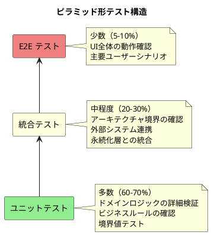

# テスト戦略 - 会議室予約システム

## システム概要

**システム名**: 会議室予約システム  
**アーキテクチャパターン**: ドメインモデルパターン  
**アーキテクチャスタイル**: ポートとアダプター（ヘキサゴナル）アーキテクチャ  
**テスト戦略**: ピラミッド形テスト  

## テスト戦略の概要

ドメインモデルパターンに最適化された **ピラミッド形テスト** を採用します。



## 1. ユニットテスト戦略（60-70%）

### 1.1 テスト対象とアプローチ

#### ドメイン層のテスト
**重点**: ビジネスロジックの完全な検証

```java
// Example: 予約エンティティのビジネスルール
@Test
void 予約は2時間前までしかキャンセルできない() {
    // Given
    LocalDateTime now = LocalDateTime.now();
    LocalDateTime 利用開始時刻 = now.plusHours(1); // 1時間後
    予約 予約 = 予約.作成(会議室, 会員, 利用開始時刻, 利用終了時刻);
    
    // When & Then
    assertThatThrownBy(() -> 予約.キャンセル(now))
        .isInstanceOf(予約キャンセル制約違反Exception.class)
        .hasMessage("利用開始2時間前までしかキャンセルできません");
}

@Test
void 会員は同時に3件まで予約可能() {
    // ビジネスルールの詳細テスト
}
```

#### アプリケーションサービス層のテスト
**重点**: ユースケースの流れと制御

```java
@Test
void 会議室予約_成功ケース() {
    // Given
    会議室検索条件 条件 = new 会議室検索条件(日時, 定員, 設備);
    会議室予約コマンド コマンド = new 会議室予約コマンド(条件, 会員ID, 利用目的);
    
    // When
    会議室予約結果 結果 = 会議室予約サービス.予約実行(コマンド);
    
    // Then
    assertThat(結果.予約番号()).isNotNull();
    assertThat(結果.予約状態()).isEqualTo(予約状態.確定);
}
```

### 1.2 テスト技法

- **境界値分析**: 定員、時間制約、予約件数制限
- **等価分割**: 会議室タイプ、利用者権限
- **状態遷移テスト**: 予約状態、会議室状態
- **ビジネスルールテスト**: 全ビジネス制約の検証

### 1.3 テストダブル戦略

```java
// リポジトリのモック化
@Mock private 会議室リポジトリ 会議室リポジトリ;
@Mock private 予約リポジトリ 予約リポジトリ;
@Mock private 会員リポジトリ 会員リポジトリ;

// ドメインサービスのテスト分離
@InjectMocks private 会議室予約サービス 対象サービス;
```

## 2. 統合テスト戦略（20-30%）

### 2.1 アーキテクチャ境界のテスト

#### ポート-アダプター統合テスト
**重点**: ヘキサゴナルアーキテクチャの境界確認

```java
@SpringBootTest
@Testcontainers
class 会議室予約統合テスト {
    
    @Container
    static PostgreSQLContainer<?> postgres = new PostgreSQLContainer<>("postgres:15")
            .withDatabaseName("test_db")
            .withUsername("test")
            .withPassword("test");
    
    @Test
    void 会議室予約から通知送信までの統合フロー() {
        // アプリケーション → ドメイン → インフラストラクチャ
        // の全体フローを統合テスト
    }
}
```

#### RESTコントローラー統合テスト
**重点**: HTTP境界での入出力検証

```java
@WebMvcTest(会議室コントローラー.class)
class 会議室コントローラー統合テスト {
    
    @Test
    void 会議室検索API_正常系() throws Exception {
        mockMvc.perform(get("/api/rooms/search")
                .param("date", "2024-12-01")
                .param("capacity", "10"))
            .andExpect(status().isOk())
            .andExpect(jsonPath("$.rooms").isArray())
            .andExpect(jsonPath("$.rooms[0].name").isString());
    }
}
```

### 2.2 永続化統合テスト

```java
@DataJpaTest
class 会議室リポジトリ統合テスト {
    
    @Test
    void 利用可能会議室検索_複雑な条件での検索() {
        // 複雑なJPQLクエリの動作確認
        // データベース制約の確認
    }
}
```

### 2.3 外部システム統合テスト

```java
// メール配信システムとの統合
@Test
void メール配信システム連携テスト() {
    // WireMockを使用した外部API連携テスト
}
```

## 3. E2Eテスト戦略（5-10%）

### 3.1 主要ユーザーシナリオ

**重点**: ビジネス価値の確認

#### シナリオ1: 会員の基本予約フロー
```gherkin
Feature: 会員による会議室予約
  Scenario: 急な会議のための即時予約
    Given 会員としてログインしている
    When 利用可能な会議室を検索する
    And 希望する会議室を選択して予約する
    Then 予約が確定される
    And 確認メールが送信される
```

#### シナリオ2: スタッフの管理業務フロー
```gherkin
Feature: スタッフによる会員・会議室管理
  Scenario: 新規会員登録から予約管理まで
    Given スタッフとしてログインしている
    When 新規会員を登録する
    And 会議室情報を更新する
    Then 会員が予約可能になる
    And 更新された会議室情報が反映される
```

### 3.2 E2Eテスト技術

```java
@SpringBootTest(webEnvironment = RANDOM_PORT)
@Testcontainers
class 会議室予約E2Eテスト {
    
    @Container
    static PostgreSQLContainer<?> postgres = 
        new PostgreSQLContainer<>("postgres:15");
    
    @Autowired
    private TestRestTemplate restTemplate;
    
    @Test
    void 会員登録から予約完了までの全フロー() {
        // 1. 会員登録
        // 2. ログイン
        // 3. 会議室検索
        // 4. 予約実行
        // 5. 予約確認
        // すべてがHTTP APIで実行される
    }
}
```

## 4. 非機能テスト戦略

### 4.1 パフォーマンステスト

```java
@Test
void 会議室検索のレスポンス時間は1秒以内() {
    // Given
    long startTime = System.currentTimeMillis();
    
    // When
    会議室検索結果 結果 = 会議室検索サービス.検索(検索条件);
    
    // Then
    long elapsedTime = System.currentTimeMillis() - startTime;
    assertThat(elapsedTime).isLessThan(1000); // 1秒以内
}
```

### 4.2 同時実行テスト

```java
@Test
void 同じ会議室への同時予約は1件のみ成功する() {
    // CompletableFutureを使った同時実行テスト
}
```

### 4.3 セキュリティテスト

```java
@Test
void 認証なしでのAPIアクセスは401を返す() {
    // セキュリティ境界のテスト
}
```

## 5. テスト実行戦略

### 5.1 CI/CD パイプライン

```yaml
# GitHub Actions example
- name: ユニットテスト実行
  run: ./mvnw test -Dtest.profile=unit

- name: 統合テスト実行  
  run: ./mvnw test -Dtest.profile=integration

- name: E2Eテスト実行
  run: ./mvnw test -Dtest.profile=e2e
```

### 5.2 テスト分類と実行戦略

| テスト種別 | 実行タイミング | 実行時間目安 |
|------------|----------------|--------------|
| ユニットテスト | 毎回のコミット | < 30秒 |
| 統合テスト | プルリクエスト | < 5分 |
| E2Eテスト | デプロイ前 | < 15分 |

### 5.3 テストデータ戦略

```java
// テストデータビルダーパターン
public class 会議室テストデータ {
    public static 会議室 標準会議室() {
        return new 会議室("会議室A", 10, "1階", 標準設備());
    }
    
    public static 会議室 大会議室() {
        return new 会議室("大会議室", 50, "2階", 豪華設備());
    }
}
```

## 6. テストメトリクス

### 6.1 カバレッジ目標

| 層 | 目標カバレッジ |
|----|----------------|
| ドメイン層 | 95%以上 |
| アプリケーション層 | 85%以上 |
| インフラストラクチャ層 | 70%以上 |
| 全体 | 80%以上 |

### 6.2 品質メトリクス

```java
// 品質確保のための静的解析
@Test
void アーキテクチャルールの確認() {
    classes()
        .that().resideInAPackage("..domain..")
        .should().onlyDependOnClassesThat()
        .resideInAnyPackage("..domain..", "java..", "org.junit..");
}
```

## 7. テスト環境戦略

### 7.1 環境構成

| 環境 | 用途 | データ |
|------|------|--------|
| 開発環境 | 開発者個人テスト | テストデータ |
| 統合環境 | CI/CD統合テスト | 最小限データ |
| ステージング環境 | E2E・受け入れテスト | 本番類似データ |

### 7.2 テストコンテナ戦略

```java
// 統合テスト用のテストコンテナ設定
@Testcontainers
public class 統合テストベース {
    
    @Container
    static PostgreSQLContainer<?> postgres = 
        new PostgreSQLContainer<>("postgres:15")
            .withInitScript("test-data.sql");
            
    @Container  
    static GenericContainer<?> mailhog =
        new GenericContainer<>("mailhog/mailhog:latest")
            .withExposedPorts(8025, 1025);
}
```

## 8. まとめ

### 8.1 戦略の利点

1. **高品質なドメインロジック**: ユニットテスト中心でビジネスルールを完全検証
2. **アーキテクチャ整合性**: 統合テストでヘキサゴナル境界を確認
3. **ユーザー価値検証**: E2Eテストで実際のビジネス価値を確認
4. **効率的な実行**: ピラミッド構造で高速なフィードバックループ

### 8.2 推奨実践事項

- **TDD（テスト駆動開発）**: 特にドメイン層では必須
- **リファクタリング**: テストがセーフティネットとして機能
- **継続的改善**: メトリクスに基づくテスト戦略の見直し
- **チーム習慣**: テストファーストなマインドセットの構築

この戦略により、会議室予約システムの品質と保守性を長期的に維持できます。