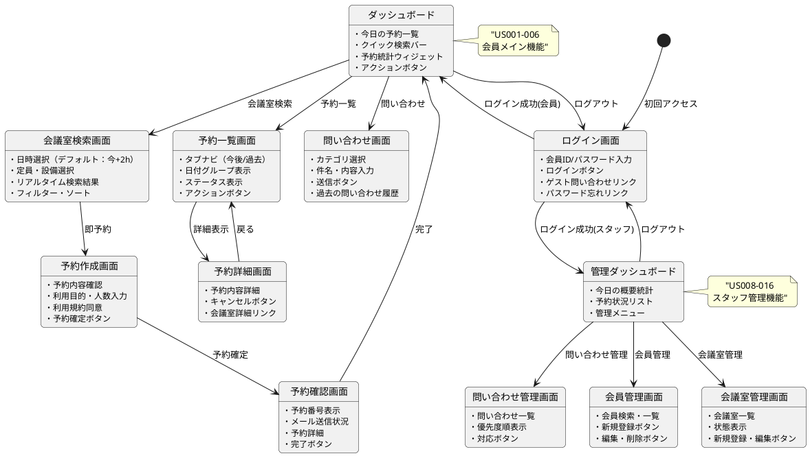
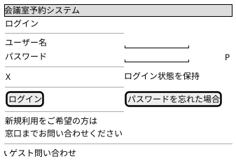
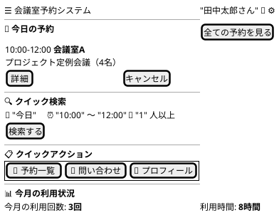
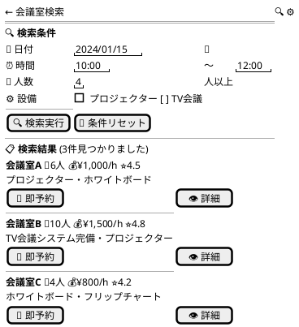
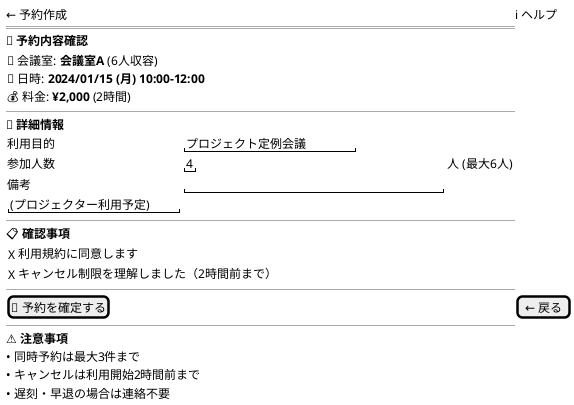
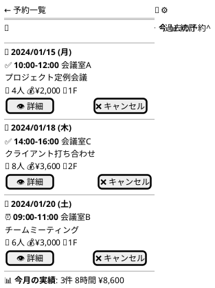
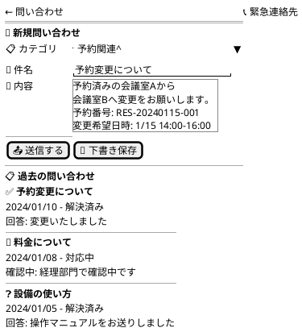
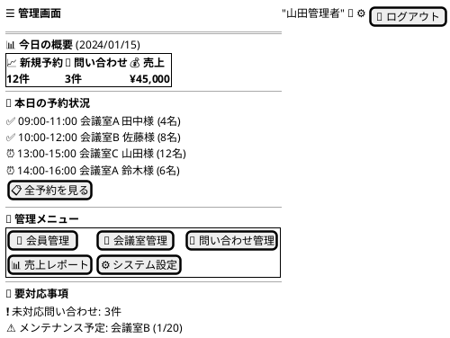

# 会議室予約システム - UI/UX設計書

## UI/UX設計概要

### デザイン原則
- **ユーザーファースト**: 直感的で分かりやすいインターフェース
- **レスポンシブデザイン**: モバイル・タブレット・デスクトップ対応
- **アクセシビリティ**: WCAG 2.1 AA準拠
- **一貫性**: 統一されたデザインシステム

### 技術仕様
- **フレームワーク**: React 18.2+ with TypeScript
- **UIライブラリ**: Material-UI (MUI) 5.14+
- **状態管理**: Redux Toolkit + React Query
- **ルーティング**: React Router 6.15+
- **レスポンシブ**: Mobile First アプローチ

### 設計目標（要件定義から）
- **予約完了まで90%時間短縮**（US019）
- **3クリック以内での主要機能アクセス**（US017）
- **直感的で説明不要なUI**（US017）
- **24時間セルフサービス対応**（US018）

## ユーザージャーニー分析

### 主要ユーザーペルソナ

#### 1. 一般会員（田中さん - 30代会社員）
- **目標**: 効率的に会議室を予約したい
- **課題**: 時間がない、操作に迷いたくない
- **行動**: モバイルからの利用が多い
- **関連ユーザーストーリー**: US001-006, US017-019

#### 2. 企業管理者（佐藤さん - 40代部長）
- **目標**: チーム全体の予約を管理したい
- **課題**: 複数の予約を効率的に処理したい
- **行動**: デスクトップからの利用が多い
- **関連ユーザーストーリー**: US003, US004, US007

#### 3. システム管理者（山田さん - 50代スタッフ）
- **目標**: システム全体の運用管理
- **課題**: 問い合わせ対応、データ分析
- **行動**: 管理画面での作業が中心
- **関連ユーザーストーリー**: US008-016

## 画面設計

### 画面一覧・遷移図



## ワイヤーフレーム設計

### 1. ログイン画面（BUC006対応）



**UI要素詳細**:
- Material-UI TextField (outlined variant)
- Password visibility toggle
- Remember me checkbox  
- Responsive design (Mobile: full width, Desktop: center card)
- Guest inquiry access without login

### 2. ダッシュボード（会員用）- US018対応



**機能要素**（US017準拠）:
- Navigation drawer (mobile) / App bar (desktop)
- Today's reservations card with quick actions
- Quick search bar with smart defaults（+2時間後）
- Action buttons grid（3クリック以内）
- Usage statistics widgets

### 3. 会議室検索画面（US001対応）



**インタラクション**（US019対応）:
- Date picker with calendar widget
- Time range selector with 30min intervals
- Real-time availability check（1秒以内レスポンス）
- Filter and sort options
- Room detail modal
- Quick reserve button（3クリック目標）

### 4. 予約作成画面（US002対応）



**バリデーション**（ビジネスルール対応）:
- Required field validation
- Business hours check
- Capacity validation (expectedParticipants <= room.capacity)
- Concurrent reservation limit (3件まで)
- 2-hour advance booking rule
- Terms agreement required

### 5. 予約一覧画面（US005対応）



**表示機能**:
- Tab navigation (upcoming/past/statistics)
- Group by date with clear headers
- Status indicators (confirmed/active/completed)
- Quick action buttons
- Pull-to-refresh (mobile)
- Usage statistics summary

### 6. 問い合わせ画面（US014対応）



### 7. 管理ダッシュボード（スタッフ用）- US015, US016対応



## デザインシステム

### カラーパレット

```css
:root {
  /* Primary Colors - 会議室予約に適したビジネスライクなブルー */
  --primary-main: #1976d2;     /* メインブルー */
  --primary-light: #42a5f5;    /* ライトブルー */
  --primary-dark: #1565c0;     /* ダークブルー */
  
  /* Secondary Colors - アクセントカラー */
  --secondary-main: #dc004e;    /* アクセントピンク */
  --secondary-light: #ff5983;   /* ライトピンク */
  --secondary-dark: #9a0036;    /* ダークピンク */
  
  /* Status Colors - 予約状態表現 */
  --success: #2e7d32;          /* 成功・確定予約 */
  --warning: #ed6c02;          /* 注意・保留中 */
  --error: #d32f2f;            /* エラー・キャンセル */
  --info: #0288d1;             /* 情報・進行中 */
  
  /* Neutral Colors - 背景・テキスト */
  --grey-50: #fafafa;
  --grey-100: #f5f5f5;
  --grey-300: #e0e0e0;
  --grey-500: #9e9e9e;
  --grey-700: #616161;
  --grey-900: #212121;
  
  /* Semantic Colors - 会議室予約特有 */
  --available: #4caf50;        /* 利用可能 */
  --reserved: #ff9800;         /* 予約中 */
  --maintenance: #9e9e9e;      /* メンテナンス中 */
  --cancelled: #f44336;        /* キャンセル済み */
}
```

### タイポグラフィ

```css
/* 日本語フォントスタック */
.typography {
  font-family: 
    "Noto Sans JP", 
    "Hiragino Kaku Gothic ProN", 
    "Yu Gothic UI", 
    "Meiryo UI", 
    sans-serif;
  
  /* より読みやすい行間設定 */
  line-height: 1.6;
}

/* 見出し - セマンティックHTML対応 */
.h1 { font-size: 2.125rem; font-weight: 500; letter-spacing: -0.01562em; } /* 34px */
.h2 { font-size: 1.5rem; font-weight: 500; letter-spacing: -0.00833em; }   /* 24px */
.h3 { font-size: 1.25rem; font-weight: 500; letter-spacing: 0em; }          /* 20px */
.h4 { font-size: 1.125rem; font-weight: 500; letter-spacing: 0.00735em; }   /* 18px */

/* 本文 - 可読性重視 */
.body1 { font-size: 1rem; font-weight: 400; letter-spacing: 0.00938em; }     /* 16px */
.body2 { font-size: 0.875rem; font-weight: 400; letter-spacing: 0.01071em; } /* 14px */

/* キャプション・補助テキスト */
.caption { font-size: 0.75rem; font-weight: 400; letter-spacing: 0.03333em; } /* 12px */

/* ボタンテキスト */
.button { 
  font-size: 0.875rem; 
  font-weight: 500; 
  letter-spacing: 0.02857em;
  text-transform: none; /* 日本語では大文字変換しない */
}
```

### コンポーネントライブラリ

#### 1. Buttons（アクション明確化）

```typescript
// Primary Button - メインアクション
<Button variant="contained" color="primary" size="large">
  会議室を予約する
</Button>

// Secondary Button - サブアクション
<Button variant="outlined" color="primary">
  詳細を確認
</Button>

// Danger Button - 注意が必要なアクション
<Button variant="contained" color="error">
  予約をキャンセル
</Button>

// Text Button - 軽微なアクション
<Button variant="text" color="primary">
  戻る
</Button>

// FAB - モバイルでのメインアクション
<Fab color="primary" aria-label="新規予約">
  <Add />
</Fab>
```

#### 2. Form Components（バリデーション強化）

```typescript
// Text Input with comprehensive validation
<TextField
  label="利用目的"
  variant="outlined"
  fullWidth
  required
  value={purpose}
  onChange={handlePurposeChange}
  error={purposeError.hasError}
  helperText={purposeError.message}
  inputProps={{
    maxLength: 200,
    'aria-describedby': 'purpose-help'
  }}
/>
<FormHelperText id="purpose-help">
  会議の目的を入力してください（200文字以内）
</FormHelperText>

// Date/Time Picker - 日本のロケール対応
<LocalizationProvider dateAdapter={AdapterDateFns} locale={ja}>
  <DateTimePicker
    label="利用開始日時"
    value={startDateTime}
    onChange={handleDateTimeChange}
    minDateTime={getTwoHoursLater()} // 2時間前ルール
    renderInput={(params) => 
      <TextField {...params} fullWidth required />
    }
  />
</LocalizationProvider>

// Select with search capability
<Autocomplete
  options={rooms}
  getOptionLabel={(room) => `${room.name} (${room.capacity}人)`}
  renderOption={(props, room) => (
    <Box component="li" {...props}>
      <RoomIcon sx={{ mr: 2 }} />
      {room.name}
      <Chip 
        label={`${room.capacity}人`} 
        size="small" 
        sx={{ ml: 1 }} 
      />
    </Box>
  )}
  renderInput={(params) => (
    <TextField {...params} label="会議室" required />
  )}
/>
```

#### 3. Data Display（情報階層明確化）

```typescript
// Enhanced Card Component for Room Display
<Card elevation={2} sx={{ height: '100%' }}>
  <CardHeader
    avatar={
      <Avatar sx={{ bgcolor: 'primary.main' }}>
        <MeetingRoom />
      </Avatar>
    }
    title={
      <Typography variant="h6" component="h3">
        {room.name}
      </Typography>
    }
    subheader={
      <Box display="flex" alignItems="center" gap={1}>
        <Chip 
          icon={<People />} 
          label={`${room.capacity}人`} 
          size="small" 
          color="primary"
          variant="outlined"
        />
        <Chip 
          icon={<AttachMoney />} 
          label={`¥${room.hourlyRate}/h`} 
          size="small"
          color="secondary"
          variant="outlined"
        />
      </Box>
    }
    action={
      <IconButton aria-label={`${room.name}の設定`}>
        <MoreVert />
      </IconButton>
    }
  />
  <CardContent>
    <Typography variant="body2" color="text.secondary" gutterBottom>
      {room.description}
    </Typography>
    <Box display="flex" flexWrap="wrap" gap={0.5} mt={1}>
      {room.equipment.map((eq) => (
        <Chip 
          key={eq}
          icon={getEquipmentIcon(eq)}
          label={eq}
          size="small"
          variant="outlined"
        />
      ))}
    </Box>
  </CardContent>
  <CardActions>
    <Button size="small" startIcon={<Visibility />}>
      詳細
    </Button>
    <Button 
      size="small" 
      variant="contained"
      startIcon={<BookOnline />}
      disabled={!room.isAvailable}
    >
      予約
    </Button>
  </CardActions>
</Card>

// Reservation List with Status Management
<List>
  {reservations.map((reservation) => (
    <ListItem key={reservation.id} divider>
      <ListItemAvatar>
        <Avatar sx={{ bgcolor: getStatusColor(reservation.status) }}>
          {getStatusIcon(reservation.status)}
        </Avatar>
      </ListItemAvatar>
      <ListItemText
        primary={
          <Box display="flex" alignItems="center" gap={1}>
            <Typography variant="subtitle1" fontWeight="medium">
              {formatDateTime(reservation.startTime)} - {formatTime(reservation.endTime)}
            </Typography>
            <Chip 
              label={reservation.room.name} 
              size="small"
              variant="outlined"
            />
          </Box>
        }
        secondary={
          <Box>
            <Typography variant="body2" color="text.secondary">
              {reservation.purpose} ({reservation.attendeeCount}名)
            </Typography>
            <Typography variant="caption" color="text.secondary">
              予約番号: {reservation.id}
            </Typography>
          </Box>
        }
      />
      <ListItemSecondaryAction>
        <ButtonGroup size="small" variant="outlined">
          <Button startIcon={<Visibility />}>
            詳細
          </Button>
          {reservation.canCancel && (
            <Button 
              startIcon={<Cancel />}
              color="error"
              onClick={() => handleCancel(reservation.id)}
            >
              キャンセル
            </Button>
          )}
        </ButtonGroup>
      </ListItemSecondaryAction>
    </ListItem>
  ))}
</List>
```

## レスポンシブデザイン

### ブレークポイント（Material-UI準拠）

```css
/* Mobile First Approach */
.container {
  padding: 16px;
  margin: 0 auto;
}

/* Small devices (landscape phones, 576px and up) */
@media (min-width: 576px) {
  .container {
    max-width: 540px;
  }
}

/* Medium devices (tablets, 768px and up) */
@media (min-width: 768px) {
  .container {
    padding: 24px;
    max-width: 720px;
  }
  
  .search-grid {
    display: grid;
    grid-template-columns: 1fr 2fr;
    gap: 24px;
  }
}

/* Large devices (desktops, 992px and up) */
@media (min-width: 992px) {
  .container {
    max-width: 960px;
  }
}

/* Extra large devices (large desktops, 1200px and up) */
@media (min-width: 1200px) {
  .container {
    padding: 32px;
    max-width: 1140px;
  }
  
  .dashboard-grid {
    display: grid;
    grid-template-columns: 1fr 1fr 1fr;
    gap: 24px;
  }
}
```

### モバイル最適化（タッチファースト）

```typescript
// Touch target optimization
const TouchOptimizedButton = styled(Button)(({ theme }) => ({
  minHeight: '44px', // iOS HIG準拠
  minWidth: '44px',
  padding: theme.spacing(1.5, 3),
  
  // タッチフィードバック
  '&:active': {
    transform: 'scale(0.98)',
    transition: 'transform 0.1s ease-in-out',
  },
}));

// Swipe gestures for reservation list
const useSwipeActions = () => {
  const handleSwipe = useCallback((direction: 'left' | 'right', itemId: string) => {
    if (direction === 'left') {
      // Cancel reservation
      handleCancelReservation(itemId);
    } else if (direction === 'right') {
      // View details
      handleViewDetails(itemId);
    }
  }, []);

  return handleSwipe;
};

// Pull-to-refresh implementation
const PullToRefresh: React.FC = ({ children, onRefresh }) => {
  const [refreshing, setRefreshing] = useState(false);
  
  const handleRefresh = useCallback(async () => {
    setRefreshing(true);
    await onRefresh();
    setRefreshing(false);
  }, [onRefresh]);

  return (
    <Box
      sx={{
        overflowY: 'auto',
        WebkitOverflowScrolling: 'touch', // iOS smooth scrolling
      }}
    >
      {refreshing && <LinearProgress />}
      {children}
    </Box>
  );
};
```

## アクセシビリティ対応

### WCAG 2.1 AA準拠実装

#### 1. キーボードナビゲーション

```typescript
// Focus management for search form
const SearchForm: React.FC = () => {
  const dateRef = useRef<HTMLInputElement>(null);
  const timeRef = useRef<HTMLInputElement>(null);
  const submitRef = useRef<HTMLButtonElement>(null);

  const handleKeyDown = (event: KeyboardEvent) => {
    if (event.key === 'Enter' && event.target === dateRef.current) {
      timeRef.current?.focus();
    }
  };

  return (
    <form onSubmit={handleSubmit}>
      <TextField
        ref={dateRef}
        label="利用日"
        type="date"
        onKeyDown={handleKeyDown}
        inputProps={{
          'aria-describedby': 'date-help',
        }}
      />
      <FormHelperText id="date-help">
        本日から30日先まで選択可能です
      </FormHelperText>
      
      <TextField
        ref={timeRef}
        label="利用時間"
        type="time"
        inputProps={{
          'aria-label': '利用開始時間',
        }}
      />
      
      <Button
        ref={submitRef}
        type="submit"
        variant="contained"
        aria-describedby="search-help"
      >
        検索する
      </Button>
      <FormHelperText id="search-help">
        Enterキーでも検索できます
      </FormHelperText>
    </form>
  );
};

// Skip links for screen readers
const SkipLinks: React.FC = () => (
  <Box
    component="nav"
    aria-label="スキップリンク"
    sx={{
      position: 'absolute',
      top: '-100px',
      left: 0,
      '&:focus-within': {
        top: 0,
        zIndex: 9999,
      },
    }}
  >
    <Button
      href="#main-content"
      sx={{
        bgcolor: 'primary.main',
        color: 'primary.contrastText',
        '&:focus': { top: 0 },
      }}
    >
      メインコンテンツへスキップ
    </Button>
  </Box>
);
```

#### 2. スクリーンリーダー対応

```typescript
// Semantic HTML with ARIA
const ReservationCard: React.FC<{ reservation: Reservation }> = ({ reservation }) => (
  <Card
    component="article"
    aria-labelledby={`reservation-${reservation.id}-title`}
    aria-describedby={`reservation-${reservation.id}-details`}
  >
    <CardHeader
      title={
        <Typography 
          id={`reservation-${reservation.id}-title`}
          variant="h6" 
          component="h3"
        >
          {reservation.room.name}での予約
        </Typography>
      }
      subheader={
        <Typography 
          variant="subtitle2"
          color="text.secondary"
          component="time"
          dateTime={reservation.startTime.toISOString()}
        >
          {formatDateTime(reservation.startTime)}
        </Typography>
      }
    />
    <CardContent>
      <Box id={`reservation-${reservation.id}-details`}>
        <Typography variant="body2">
          <span aria-label="利用目的">目的: {reservation.purpose}</span>
        </Typography>
        <Typography variant="body2">
          <span aria-label="参加人数">{reservation.attendeeCount}名が参加予定</span>
        </Typography>
        <Typography variant="body2">
          <span aria-label="料金">料金: {formatCurrency(reservation.totalFee)}</span>
        </Typography>
      </Box>
    </CardContent>
    <CardActions>
      <Button
        size="small"
        aria-label={`予約番号${reservation.id}の詳細を表示`}
      >
        詳細を見る
      </Button>
      {reservation.canCancel && (
        <Button
          size="small"
          color="error"
          aria-label={`予約番号${reservation.id}をキャンセル`}
        >
          キャンセル
        </Button>
      )}
    </CardActions>
  </Card>
);

// Live regions for dynamic content
const SearchResults: React.FC = ({ results, loading }) => (
  <Box>
    <Box
      aria-live="polite"
      aria-atomic="true"
      sx={{ sr: { position: 'absolute', left: '-10000px' } }}
    >
      {loading ? 
        '検索中です...' : 
        `${results.length}件の会議室が見つかりました`
      }
    </Box>
    
    <Typography variant="h2" gutterBottom>
      検索結果
    </Typography>
    
    {loading ? (
      <Box display="flex" justifyContent="center" p={3}>
        <CircularProgress aria-label="検索中" />
      </Box>
    ) : (
      <Grid container spacing={2}>
        {results.map((room) => (
          <Grid item xs={12} sm={6} md={4} key={room.id}>
            <RoomCard room={room} />
          </Grid>
        ))}
      </Grid>
    )}
  </Box>
);
```

#### 3. カラーコントラスト確保

```typescript
// High contrast theme support
const createAccessibleTheme = (mode: 'light' | 'dark' | 'high-contrast') => {
  const baseTheme = createTheme({
    palette: {
      mode: mode === 'high-contrast' ? 'dark' : mode,
      ...(mode === 'high-contrast' && {
        primary: {
          main: '#ffffff',
          contrastText: '#000000',
        },
        secondary: {
          main: '#ffff00',
          contrastText: '#000000',
        },
        background: {
          default: '#000000',
          paper: '#1a1a1a',
        },
        text: {
          primary: '#ffffff',
          secondary: '#cccccc',
        },
      }),
    },
    typography: {
      ...(mode === 'high-contrast' && {
        fontWeight: 600, // Bolder fonts for high contrast
      }),
    },
  });

  return baseTheme;
};

// Color contrast validation utility
const validateContrast = (foreground: string, background: string): boolean => {
  const ratio = calculateContrastRatio(foreground, background);
  return ratio >= 4.5; // WCAG AA standard
};
```

## エラーハンドリング・フィードバック

### ユーザーフレンドリーなエラー表示

```typescript
// Error Boundary with user-friendly messages
class ReservationErrorBoundary extends Component<Props, State> {
  constructor(props: Props) {
    super(props);
    this.state = { hasError: false, error: null };
  }

  static getDerivedStateFromError(error: Error): State {
    return { hasError: true, error };
  }

  componentDidCatch(error: Error, errorInfo: ErrorInfo) {
    // Log error to monitoring service
    logger.error('Reservation UI Error:', { error, errorInfo });
  }

  render() {
    if (this.state.hasError) {
      return (
        <Container maxWidth="sm" sx={{ py: 4 }}>
          <Alert 
            severity="error" 
            sx={{ mb: 2 }}
            action={
              <Button 
                color="inherit" 
                size="small"
                onClick={() => window.location.reload()}
              >
                再読み込み
              </Button>
            }
          >
            <AlertTitle>一時的なエラーが発生しました</AlertTitle>
            申し訳ありませんが、システムで問題が発生しています。
            ページを再読み込みしてお試しください。
          </Alert>
          
          <Paper elevation={1} sx={{ p: 3 }}>
            <Typography variant="h6" gutterBottom>
              お困りですか？
            </Typography>
            <Typography variant="body2" color="text.secondary" paragraph>
              問題が続く場合は、以下の方法でお問い合わせください：
            </Typography>
            <Box display="flex" gap={2}>
              <Button variant="outlined" startIcon={<Phone />}>
                電話: 03-1234-5678
              </Button>
              <Button variant="outlined" startIcon={<Email />}>
                メールで問い合わせ
              </Button>
            </Box>
          </Paper>
        </Container>
      );
    }

    return this.props.children;
  }
}

// Toast notifications for user actions
const useNotification = () => {
  const { enqueueSnackbar } = useSnackbar();

  const showSuccess = useCallback((message: string) => {
    enqueueSnackbar(message, {
      variant: 'success',
      autoHideDuration: 3000,
      action: (key) => (
        <IconButton size="small" onClick={() => closeSnackbar(key)}>
          <Close fontSize="small" />
        </IconButton>
      ),
    });
  }, [enqueueSnackbar]);

  const showError = useCallback((message: string) => {
    enqueueSnackbar(message, {
      variant: 'error',
      autoHideDuration: 5000,
      persist: true, // Keep error messages visible
    });
  }, [enqueueSnackbar]);

  const showWarning = useCallback((message: string) => {
    enqueueSnackbar(message, {
      variant: 'warning',
      autoHideDuration: 4000,
    });
  }, [enqueueSnackbar]);

  return { showSuccess, showError, showWarning };
};

// Form validation with real-time feedback
const useFormValidation = (validationSchema: yup.Schema) => {
  const [errors, setErrors] = useState<Record<string, string>>({});
  
  const validateField = useCallback(async (field: string, value: any) => {
    try {
      await validationSchema.validateAt(field, { [field]: value });
      setErrors(prev => ({ ...prev, [field]: '' }));
      return true;
    } catch (error) {
      if (error instanceof yup.ValidationError) {
        setErrors(prev => ({ ...prev, [field]: error.message }));
      }
      return false;
    }
  }, [validationSchema]);

  return { errors, validateField };
};
```

## パフォーマンス最適化

### React最適化戦略

```typescript
// Memoization for expensive calculations
const RoomList: React.FC<{ rooms: Room[]; filters: FilterState }> = ({ rooms, filters }) => {
  const filteredRooms = useMemo(() => {
    return rooms.filter(room => {
      if (filters.capacity && room.capacity < filters.capacity) return false;
      if (filters.equipment.length > 0 && 
          !filters.equipment.every(eq => room.equipment.includes(eq))) return false;
      if (filters.priceRange && 
          (room.hourlyRate < filters.priceRange.min || 
           room.hourlyRate > filters.priceRange.max)) return false;
      return true;
    }).sort((a, b) => {
      switch (filters.sortBy) {
        case 'price': return a.hourlyRate - b.hourlyRate;
        case 'capacity': return b.capacity - a.capacity;
        case 'rating': return b.rating - a.rating;
        default: return a.name.localeCompare(b.name);
      }
    });
  }, [rooms, filters]);

  return (
    <Grid container spacing={2}>
      {filteredRooms.map((room) => (
        <Grid item xs={12} sm={6} md={4} key={room.id}>
          <MemoizedRoomCard room={room} />
        </Grid>
      ))}
    </Grid>
  );
};

// Optimized room card component
const MemoizedRoomCard = React.memo<{ room: Room }>(({ room }) => (
  <RoomCard room={room} />
), (prevProps, nextProps) => {
  // Custom comparison for deep equality
  return (
    prevProps.room.id === nextProps.room.id &&
    prevProps.room.isAvailable === nextProps.room.isAvailable &&
    prevProps.room.updatedAt === nextProps.room.updatedAt
  );
});

// Virtual scrolling for large datasets
const VirtualReservationList: React.FC<{ reservations: Reservation[] }> = ({ reservations }) => {
  const parentRef = useRef<HTMLDivElement>(null);
  
  const rowVirtualizer = useVirtualizer({
    count: reservations.length,
    getScrollElement: () => parentRef.current,
    estimateSize: () => 120, // Estimated height of each reservation item
    overscan: 5, // Render 5 items outside of visible area
  });

  return (
    <Box
      ref={parentRef}
      sx={{
        height: '400px',
        overflow: 'auto',
      }}
    >
      <Box
        sx={{
          height: `${rowVirtualizer.getTotalSize()}px`,
          width: '100%',
          position: 'relative',
        }}
      >
        {rowVirtualizer.getVirtualItems().map((virtualItem) => (
          <Box
            key={virtualItem.key}
            sx={{
              position: 'absolute',
              top: 0,
              left: 0,
              width: '100%',
              height: `${virtualItem.size}px`,
              transform: `translateY(${virtualItem.start}px)`,
            }}
          >
            <ReservationCard reservation={reservations[virtualItem.index]} />
          </Box>
        ))}
      </Box>
    </Box>
  );
};
```

### Bundle最適化

```typescript
// Lazy loading for admin pages
const AdminDashboard = lazy(() => 
  import('./pages/admin/AdminDashboard').then(module => ({
    default: module.AdminDashboard
  }))
);

const UserManagement = lazy(() => 
  import('./pages/admin/UserManagement')
);

const RoomManagement = lazy(() => 
  import('./pages/admin/RoomManagement')
);

// Code splitting with loading fallback
const LazyAdminRoute: React.FC<{ component: React.ComponentType }> = ({ component: Component }) => (
  <Suspense 
    fallback={
      <Box display="flex" justifyContent="center" alignItems="center" minHeight="60vh">
        <CircularProgress size={40} />
        <Typography variant="body1" sx={{ ml: 2 }}>
          画面を読み込み中...
        </Typography>
      </Box>
    }
  >
    <Component />
  </Suspense>
);

// Tree shaking optimization
import {
  Button,
  TextField,
  Card,
  Grid,
  Typography,
  Box,
  Alert,
  Chip
} from '@mui/material';

// Avoid importing entire icon library
import SearchIcon from '@mui/icons-material/Search';
import BookOnlineIcon from '@mui/icons-material/BookOnline';
import EventIcon from '@mui/icons-material/Event';
```

### API最適化・状態管理

```typescript
// React Query for efficient data fetching
const useRooms = (searchCriteria: SearchCriteria) => {
  return useQuery(
    ['rooms', searchCriteria],
    () => roomsApi.search(searchCriteria),
    {
      staleTime: 5 * 60 * 1000, // 5 minutes cache
      cacheTime: 10 * 60 * 1000, // 10 minutes in memory
      refetchOnWindowFocus: false,
      refetchOnReconnect: 'always',
      retry: 3,
      retryDelay: attemptIndex => Math.min(1000 * 2 ** attemptIndex, 30000),
    }
  );
};

const useReservations = () => {
  return useQuery(
    ['reservations'],
    reservationsApi.getMyReservations,
    {
      staleTime: 2 * 60 * 1000, // 2 minutes for real-time data
      refetchInterval: 5 * 60 * 1000, // Background refresh every 5 minutes
    }
  );
};

// Optimistic updates for better UX
const useCreateReservation = () => {
  const queryClient = useQueryClient();
  
  return useMutation(reservationsApi.create, {
    onMutate: async (newReservation) => {
      // Cancel any outgoing refetches
      await queryClient.cancelQueries(['reservations']);
      
      // Snapshot the previous value
      const previousReservations = queryClient.getQueryData(['reservations']);
      
      // Optimistically update to the new value
      queryClient.setQueryData(['reservations'], (old: Reservation[] = []) => [
        ...old,
        { ...newReservation, id: `temp-${Date.now()}`, status: 'pending' }
      ]);
      
      // Return a context object with the snapshotted value
      return { previousReservations };
    },
    onError: (err, newReservation, context) => {
      // If the mutation fails, use the context returned from onMutate to roll back
      queryClient.setQueryData(['reservations'], context?.previousReservations);
    },
    onSettled: () => {
      // Always refetch after error or success
      queryClient.invalidateQueries(['reservations']);
    },
  });
};

// Pagination with infinite scroll
const useInfiniteReservations = () => {
  return useInfiniteQuery(
    ['reservations', 'infinite'],
    ({ pageParam = 0 }) => reservationsApi.getPage(pageParam, 20),
    {
      getNextPageParam: (lastPage, pages) => {
        return lastPage.hasMore ? pages.length : undefined;
      },
      staleTime: 5 * 60 * 1000,
    }
  );
};
```

---

**この UI/UX 設計書は、会議室予約システムの要件定義（BUC001-007, UC001-012, US001-028）を満たし、ユーザビリティ・アクセシビリティ・パフォーマンスを考慮した実装可能な詳細設計です。Material-UI を基盤とした一貫性のあるデザインシステムにより、保守性の高いUIコンポーネントライブラリを構築できます。**