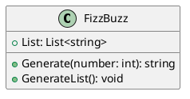
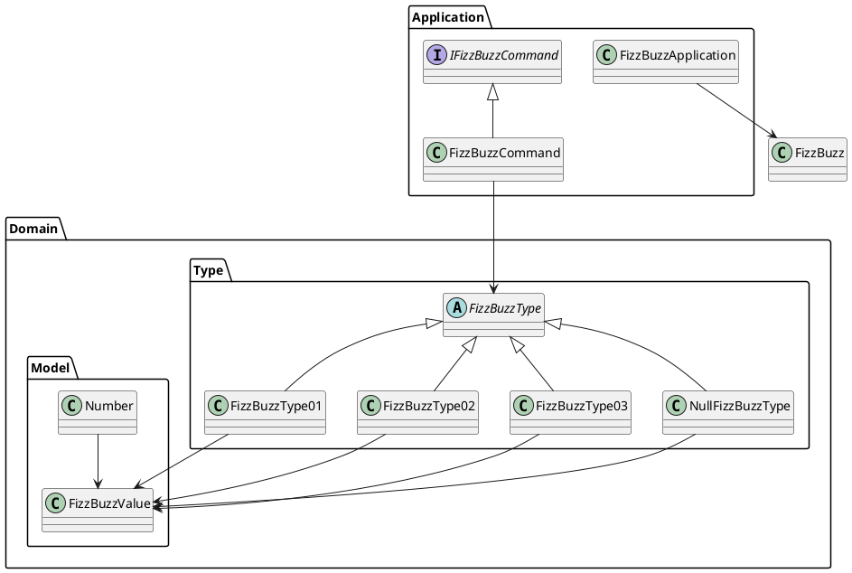

# エピソード3

## 初めに

この記事は、**テスト駆動開発（TDD）** を通じて **C#言語** と **オブジェクト指向プログラミング** の基礎から応用までを学習する実践的なチュートリアルです。

### 概要

本記事では、**オブジェクト指向プログラム** から **オブジェクト指向設計** そして **モジュール分割** を **テスト駆動開発** を通じて実践していきます。

#### オブジェクト指向プログラム

FizzBuzzプログラムの追加仕様を **テスト駆動開発** で実装します。次に **手続き型コード** との比較から **オブジェクト指向プログラム** を構成する **カプセル化** **ポリモーフィズム** **継承** という概念をコードベースの **リファクタリング** を通じて解説します。

具体的には **フィールドのカプセル化** から **setterの削除** を適用することにより **カプセル化** を実現します。続いて、**ポリモーフィズムによる条件記述の置き換え** から **Strategy/Stateパターンによるタイプコードの置き換え** を適用することにより **ポリモーフィズム** の効果を体験します。そして、**base classの抽出** から **メソッド名の変更** **メソッドの移動** の適用を通して **継承** の使い方を体験します。さらに **値オブジェクト** と **ファーストクラスコレクション** というオブジェクト指向プログラミングに必要なツールの使い方も学習します。

#### オブジェクト指向設計

次に設計の観点から **単一責任の原則** に違反している `FizzBuzz` クラスを **デザインパターン** の1つである **Commandパターン** を使ったリファクタリングである **メソッドオブジェクトによるメソッドの置き換え** を適用してクラスの責務を分割します。オブジェクト指向設計の **デザインパターン** として **Commandパターン** 以外に **Value Objectパターン** **Factory Methodパターン** **Strategyパターン** を **リファクタリング** を適用する過程ですでに実現していたことを説明します。そして、**オープン・クローズドの原則** を満たすコードに **リファクタリング** されたことで既存のコードを変更することなく振る舞いを変更できるようになることを解説します。

加えて、正常系の設計を改善した後 **アサーションの導入** **例外によるエラーコードの置き換え** といった例外系の **リファクタリング** を適用します。最後に **ポリモーフィズム** の応用として **特殊ケースの導入** の適用による **Null Objectパターン** を使った **オープン・クローズドの原則** に従った安全なコードの追加方法を解説します。

#### モジュールの分割

仕上げは、**モノリシック** なファイルから個別のクラスモジュールへの分割を **ドメインオブジェクト** の抽出を通して **ドメインモデル** へと整理することにより **モジュール分割** を実現することを体験してもらいます。最後に **良いコード** と **良い設計** について考えます。

##### Before



##### After



### 前提条件

- .NET 9.0 SDK
- Visual Studio Code または Visual Studio
- C#と.NETの基本的な知識
- テスト駆動開発の基本概念

### セットアップ

```bash
# プロジェクトディレクトリの作成
mkdir FizzBuzzCSharp
cd FizzBuzzCSharp

# ソリューションの作成
dotnet new sln

# メインプロジェクトの作成
dotnet new classlib -o FizzBuzz
dotnet sln add FizzBuzz

# テストプロジェクトの作成
dotnet new xunit -o FizzBuzzTest
dotnet sln add FizzBuzzTest

# テストプロジェクトから本体プロジェクトへの参照を追加
dotnet add FizzBuzzTest reference FizzBuzz
```

## オブジェクト指向から始めるテスト駆動開発

### テスト駆動開発

FizzBuzzプログラムに以下の仕様を追加します。

**仕様**

    1 から 100 までの数をプリントするプログラムを書け。
    ただし 3 の倍数のときは数の代わりに｢Fizz｣と、5 の倍数のときは｢Buzz｣とプリントし、
    3 と 5 両方の倍数の場合には｢FizzBuzz｣とプリントすること。

    ただし、プログラムの仕様には以下の追加仕様がある：

    タイプ1： 通常のFizzBuzzゲーム（3の倍数でFizz、5の倍数でBuzz、15の倍数でFizzBuzz）
    タイプ2： すべての数字をそのまま返す
    タイプ3： 15の倍数のときのみFizzBuzzを返し、それ以外は数字をそのまま返す
    
    また、無効なタイプが指定された場合は適切に処理すること。

この追加仕様を **テスト駆動開発** で実装していきます。

#### TODOリスト作成

まず、実装すべきタスクを **TODOリスト** として整理します：

**TODO**
- [ ] タイプ1の実装（通常のFizzBuzz）
  - [ ] 1を渡したら文字列"1"を返す
  - [ ] 2を渡したら文字列"2"を返す
  - [ ] 3を渡したら文字列"Fizz"を返す
  - [ ] 5を渡したら文字列"Buzz"を返す
  - [ ] 15を渡したら文字列"FizzBuzz"を返す
  - [ ] 1から100までのFizzBuzz配列を返す
- [ ] タイプ2の実装（すべて数字）
- [ ] タイプ3の実装（15の倍数のみFizzBuzz）
- [ ] 例外処理（無効なタイプ）
- [ ] オブジェクト指向リファクタリング

#### タイプ1の場合

まず最初のテストから始めます。**Red-Green-Refactor** サイクルを実践します。

**Red** まず失敗するテストを書きます：

```csharp
using Xunit;

namespace FizzBuzzTest;

public class FizzBuzzTest
{
    public class 数を文字列にして返す
    {
        public class タイプ1の場合
        {
            private readonly FizzBuzz.FizzBuzz _fizzbuzz;

            public タイプ1の場合()
            {
                _fizzbuzz = new FizzBuzz.FizzBuzz(1);
            }

            [Fact]
            public void Test_1を渡したら文字列1を返す()
            {
                Assert.Equal("1", _fizzbuzz.Generate(1));
            }
        }
    }
}
```

**Green** テストを通すための最小限の実装：

```csharp
namespace FizzBuzz;

public class FizzBuzz
{
    private int _type;

    public FizzBuzz(int type)
    {
        _type = type;
    }

    public string Generate(int number)
    {
        return "1";
    }
}
```

**Refactor** より一般的な実装に改善：

```csharp
public string Generate(int number)
{
    return number.ToString();
}
```

続いてFizzの実装を追加します：

**Red** 新しいテストケース：

```csharp
[Fact]
public void Test_3を渡したら文字列Fizzを返す()
{
    Assert.Equal("Fizz", _fizzbuzz.Generate(3));
}
```

**Green** テストを通すための実装：

```csharp
public string Generate(int number)
{
    if (number % 3 == 0)
    {
        return "Fizz";
    }
    return number.ToString();
}
```

同様にBuzzとFizzBuzzの実装を追加していきます：

```csharp
public string Generate(int number)
{
    if (number % 3 == 0 && number % 5 == 0)
    {
        return "FizzBuzz";
    }
    if (number % 3 == 0)
    {
        return "Fizz";
    }
    if (number % 5 == 0)
    {
        return "Buzz";
    }
    return number.ToString();
}
```

#### タイプ2の場合

タイプ2では、すべての数字をそのまま返します：

```csharp
public class タイプ2の場合
{
    private readonly FizzBuzz.FizzBuzz _fizzbuzz;

    public タイプ2の場合()
    {
        _fizzbuzz = new FizzBuzz.FizzBuzz(2);
    }

    [Fact]
    public void Test_1を渡したら文字列1を返す()
    {
        Assert.Equal("1", _fizzbuzz.Generate(1));
    }

    [Fact]
    public void Test_3を渡したら文字列3を返す()
    {
        Assert.Equal("3", _fizzbuzz.Generate(3));
    }

    [Fact]
    public void Test_5を渡したら文字列5を返す()
    {
        Assert.Equal("5", _fizzbuzz.Generate(5));
    }

    [Fact]
    public void Test_15を渡したら文字列15を返す()
    {
        Assert.Equal("15", _fizzbuzz.Generate(15));
    }
}
```

実装を拡張してタイプに応じた処理を分岐：

```csharp
public string Generate(int number)
{
    if (_type == 2)
    {
        return number.ToString();
    }
    
    // タイプ1の処理
    if (number % 3 == 0 && number % 5 == 0)
    {
        return "FizzBuzz";
    }
    if (number % 3 == 0)
    {
        return "Fizz";
    }
    if (number % 5 == 0)
    {
        return "Buzz";
    }
    return number.ToString();
}
```

#### タイプ3の場合

タイプ3では15の倍数のときのみFizzBuzzを返します：

```csharp
public class タイプ3の場合
{
    private readonly FizzBuzz.FizzBuzz _fizzbuzz;

    public タイプ3の場合()
    {
        _fizzbuzz = new FizzBuzz.FizzBuzz(3);
    }

    [Fact]
    public void Test_1を渡したら文字列1を返す()
    {
        Assert.Equal("1", _fizzbuzz.Generate(1));
    }

    [Fact]
    public void Test_3を渡したら文字列3を返す()
    {
        Assert.Equal("3", _fizzbuzz.Generate(3));
    }

    [Fact]
    public void Test_5を渡したら文字列5を返す()
    {
        Assert.Equal("5", _fizzbuzz.Generate(5));
    }

    [Fact]
    public void Test_15を渡したら文字列FizzBuzzを返す()
    {
        Assert.Equal("FizzBuzz", _fizzbuzz.Generate(15));
    }
}
```

#### それ以外のタイプの場合

無効なタイプの処理を追加：

```csharp
public class それ以外のタイプの場合
{
    [Fact]
    public void Test_空文字を返す()
    {
        var fizzbuzz = new FizzBuzz.FizzBuzz(4);
        Assert.Equal("", fizzbuzz.Generate(1));
    }
}
```

最終的なGenerate方法の実装：

```csharp
public string Generate(int number)
{
    switch (_type)
    {
        case 1:
            if (number % 3 == 0 && number % 5 == 0)
            {
                return "FizzBuzz";
            }
            if (number % 3 == 0)
            {
                return "Fizz";
            }
            if (number % 5 == 0)
            {
                return "Buzz";
            }
            return number.ToString();
        case 2:
            return number.ToString();
        case 3:
            if (number % 3 == 0 && number % 5 == 0)
            {
                return "FizzBuzz";
            }
            return number.ToString();
        default:
            return "";
    }
}
```

#### リスト生成機能の追加

1から100までのリストを生成する機能を追加：

```csharp
private List<string> _list = new List<string>();

public List<string> List
{
    get { return _list; }
}

public void GenerateList()
{
    _list = new List<string>();
    for (int i = 1; i <= 100; i++)
    {
        _list.Add(Generate(i));
    }
}
```

### オブジェクト指向

ここまでで基本的な機能は実装できましたが、コードは **手続き型プログラム** の特徴を持っています。

#### 手続き型プログラム

現在のコードの問題点：

1. **大きなswitch文** - 新しいタイプを追加するたびにswitch文を修正する必要がある
2. **単一のクラスに多くの責任** - FizzBuzzクラスが全ての処理を担当している
3. **拡張性の欠如** - 新しい仕様の追加が困難

#### オブジェクト指向プログラム

**オブジェクト指向プログラミング** では以下の原則に従ってコードを改善していきます：

1. **カプセル化（Encapsulation）** - データと操作をまとめて隠蔽する
2. **ポリモーフィズム（Polymorphism）** - 同じインターフェースで異なる動作を実現する
3. **継承（Inheritance）** - 既存のクラスを拡張して新しいクラスを作る

次のセクションでは、これらの原則を適用したリファクタリングを実践していきます。

## カプセル化

### フィールドのカプセル化

現在のフィールドを **private** にして外部からの直接アクセスを防ぎます：

```csharp
public class FizzBuzz
{
    private List<string> _list = new List<string>();
    private int _type;

    public FizzBuzz(int type)
    {
        _type = type;
    }

    public List<string> List
    {
        get { return _list; }
    }

    // ...existing code...
}
```

**カプセル化** により：
- フィールドの直接操作を防止
- データの整合性を保証
- 将来の変更の影響を局所化

### setterの削除

読み取り専用プロパティを使用してデータの変更を制限：

```csharp
public List<string> List
{
    get { return _list; }
    // setterを削除してread-onlyにする
}
```

これにより：
- **不変性（Immutability）** の原則を部分的に適用
- 予期しないデータ変更を防止
- より安全なAPI設計

### メソッドのカプセル化

メソッドをプライベートにして外部からの呼び出しを制限：

```csharp
public class FizzBuzz
{
    // ...existing code...

    private string GenerateFizzBuzz(int number)
    {
        if (number % 3 == 0 && number % 5 == 0)
        {
            return "FizzBuzz";
        }
        if (number % 3 == 0)
        {
            return "Fizz";
        }
        if (number % 5 == 0)
        {
            return "Buzz";
        }
        return number.ToString();
    }
}
```

この変更により：
- **実装の隠蔽** - 内部ロジックを外部から隠す
- **インターフェースの単純化** - 公開するメソッドを減らしシンプルに保つ
- **変更の影響範囲の縮小** - 内部実装を変更しても外部に影響を与えにくくなる

## ポリモーフィズム

### ポリモーフィズムによる条件記述の置き換え

現在のswitch文を **ポリモーフィズム** を使って置き換えていきます。

#### ステップ1: 抽象基底クラスの作成

まず、共通の動作を定義する抽象クラスを作成します：

```csharp
namespace FizzBuzz;

public abstract class FizzBuzzType
{
    public abstract string Generate(int number);

    protected bool IsFizz(int number)
    {
        return number % 3 == 0;
    }

    protected bool IsBuzz(int number)
    {
        return number % 5 == 0;
    }
}
```

#### ステップ2: 具体的な実装クラスの作成

各タイプに対応する具体的なクラスを作成：

```csharp
public class FizzBuzzType01 : FizzBuzzType
{
    public override string Generate(int number)
    {
        if (IsFizz(number) && IsBuzz(number))
        {
            return "FizzBuzz";
        }
        if (IsFizz(number))
        {
            return "Fizz";
        }
        if (IsBuzz(number))
        {
            return "Buzz";
        }
        return number.ToString();
    }
}

public class FizzBuzzType02 : FizzBuzzType
{
    public override string Generate(int number)
    {
        return number.ToString();
    }
}

public class FizzBuzzType03 : FizzBuzzType
{
    public override string Generate(int number)
    {
        if (IsFizz(number) && IsBuzz(number))
        {
            return "FizzBuzz";
        }
        return number.ToString();
    }
}
```

#### ステップ3: Factory Methodパターンの適用

タイプに応じたインスタンスを生成するファクトリメソッドを追加：

```csharp
public class FizzBuzz
{
    private List<string> _list = new List<string>();
    private FizzBuzzType _type;

    public FizzBuzz(int type)
    {
        _type = Create(type);
    }

    public static FizzBuzzType Create(int type)
    {
        switch (type)
        {
            case 1:
                return new FizzBuzzType01();
            case 2:
                return new FizzBuzzType02();
            case 3:
                return new FizzBuzzType03();
            default:
                return new NullFizzBuzzType();
        }
    }

    public string Generate(int number)
    {
        return _type.Generate(number);
    }

    // ...existing code...
}
```

#### ステップ4: Null Objectパターンの適用

例外処理の代わりにNull Objectパターンを使用：

```csharp
public class NullFizzBuzzType : FizzBuzzType
{
    public override string Generate(int number)
    {
        return "";
    }
}
```

### State/Strategyによるタイプコードの置き換え

これで **Strategy パターン** が実装されました：

- **Strategy**: `FizzBuzzType` 抽象クラス
- **ConcreteStrategy**: `FizzBuzzType01`, `FizzBuzzType02`, `FizzBuzzType03`
- **Context**: `FizzBuzz` クラス

**利点**:
- 新しいタイプの追加が容易（**Open/Closed Principle**）
- 各タイプの実装が分離されている（**Single Responsibility Principle**）
- switch文の除去により可読性が向上

## 継承

### 基底クラス（Base Class）の抽出

C#では **abstract class** または **interface** を使用して継承階層を構築できます。

#### abstract classの特徴

```csharp
public abstract class FizzBuzzType
{
    // 抽象メソッド - 派生クラスで必ず実装する必要がある
    public abstract string Generate(int number);

    // 具象メソッド - 派生クラスで共通利用できる
    protected bool IsFizz(int number)
    {
        return number % 3 == 0;
    }

    protected bool IsBuzz(int number)
    {
        return number % 5 == 0;
    }
}
```

#### メソッドの移動

共通ロジックを基底クラスに移動：

```csharp
public abstract class FizzBuzzType
{
    public abstract string Generate(int number);

    protected bool IsFizz(int number)
    {
        return number % 3 == 0;
    }

    protected bool IsBuzz(int number)
    {
        return number % 5 == 0;
    }

    protected bool IsFizzBuzz(int number)
    {
        return IsFizz(number) && IsBuzz(number);
    }
}
```

#### virtual/overrideキーワード

C#では **virtual** と **override** キーワードを使って柔軟な継承を実現：

```csharp
public abstract class FizzBuzzType
{
    public abstract string Generate(int number);

    // virtualメソッド - 派生クラスでオーバーライド可能
    protected virtual string GetFizzBuzzString(int number)
    {
        if (IsFizzBuzz(number))
        {
            return "FizzBuzz";
        }
        if (IsFizz(number))
        {
            return "Fizz";
        }
        if (IsBuzz(number))
        {
            return "Buzz";
        }
        return number.ToString();
    }

    // ...existing code...
}
```

## 値オブジェクト

### オブジェクトによるプリミティブの置き換え

プリミティブ型（int, string等）をオブジェクトで置き換えて **型安全性** を向上させます。

#### Numberクラスの作成

```csharp
namespace FizzBuzz;

public class Number
{
    private readonly int _value;

    public Number(int value)
    {
        _value = value;
    }

    public int Value => _value;

    public bool IsFizz()
    {
        return _value % 3 == 0;
    }

    public bool IsBuzz()
    {
        return _value % 5 == 0;
    }

    public bool IsFizzBuzz()
    {
        return IsFizz() && IsBuzz();
    }

    public override string ToString()
    {
        return _value.ToString();
    }

    public override bool Equals(object obj)
    {
        if (obj is Number other)
        {
            return _value == other._value;
        }
        return false;
    }

    public override int GetHashCode()
    {
        return _value.GetHashCode();
    }
}
```

#### FizzBuzzValueクラスの作成

FizzBuzzの結果を表現する値オブジェクト：

```csharp
namespace FizzBuzz;

public class FizzBuzzValue
{
    private readonly string _value;

    private FizzBuzzValue(string value)
    {
        _value = value;
    }

    // ファクトリメソッドパターン
    public static FizzBuzzValue Fizz() => new FizzBuzzValue("Fizz");
    public static FizzBuzzValue Buzz() => new FizzBuzzValue("Buzz");
    public static FizzBuzzValue FizzBuzz() => new FizzBuzzValue("FizzBuzz");
    public static FizzBuzzValue Number(int number) => new FizzBuzzValue(number.ToString());
    public static FizzBuzzValue Empty() => new FizzBuzzValue("");

    public override string ToString()
    {
        return _value;
    }

    public override bool Equals(object obj)
    {
        if (obj is FizzBuzzValue other)
        {
            return _value == other._value;
        }
        return false;
    }

    public override int GetHashCode()
    {
        return _value.GetHashCode();
    }
}
```

#### 型システムの活用

FizzBuzzTypeを値オブジェクトを使用するように更新：

```csharp
public abstract class FizzBuzzType
{
    public abstract FizzBuzzValue Generate(Number number);

    protected bool IsFizz(Number number)
    {
        return number.IsFizz();
    }

    protected bool IsBuzz(Number number)
    {
        return number.IsBuzz();
    }

    protected bool IsFizzBuzz(Number number)
    {
        return number.IsFizzBuzz();
    }
}

public class FizzBuzzType01 : FizzBuzzType
{
    public override FizzBuzzValue Generate(Number number)
    {
        if (IsFizzBuzz(number))
        {
            return FizzBuzzValue.FizzBuzz();
        }
        if (IsFizz(number))
        {
            return FizzBuzzValue.Fizz();
        }
        if (IsBuzz(number))
        {
            return FizzBuzzValue.Buzz();
        }
        return FizzBuzzValue.Number(number.Value);
    }
}
```

### 値オブジェクトの利点

1. **型安全性** - コンパイル時のエラー検出
2. **表現力** - ドメインの概念を正確に表現
3. **不変性** - 値の変更を防止
4. **再利用性** - 他の場所でも使用可能

## ファーストクラスコレクション

### コレクションのカプセル化

List&lt;string&gt;をカプセル化してドメイン固有の操作を提供：

```csharp
namespace FizzBuzz;

public class FizzBuzzList
{
    private readonly List<string> _values;

    public FizzBuzzList()
    {
        _values = new List<string>();
    }

    public void Add(string value)
    {
        _values.Add(value);
    }

    public string this[int index]
    {
        get { return _values[index]; }
    }

    public int Count => _values.Count;

    public IEnumerable<string> Values => _values.AsReadOnly();

    // ドメイン固有の操作
    public int CountFizz()
    {
        return _values.Count(v => v == "Fizz");
    }

    public int CountBuzz()
    {
        return _values.Count(v => v == "Buzz");
    }

    public int CountFizzBuzz()
    {
        return _values.Count(v => v == "FizzBuzz");
    }
}
```

#### LINQ活用

C#のLINQを活用してコレクション操作を簡潔に：

```csharp
public class FizzBuzzList
{
    // ...existing code...

    public IEnumerable<string> GetFizzBuzzOnly()
    {
        return _values.Where(v => v == "FizzBuzz");
    }

    public IEnumerable<int> GetNumbers()
    {
        return _values
            .Where(v => int.TryParse(v, out _))
            .Select(int.Parse);
    }

    public bool ContainsFizzBuzz()
    {
        return _values.Any(v => v == "FizzBuzz");
    }
}
```

## オブジェクト指向設計

### メソッドオブジェクトによるメソッドの置き換え

**単一責任の原則（Single Responsibility Principle）** に従い、FizzBuzzクラスの責任を分割します。

#### Commandパターンの適用

FizzBuzz生成のロジックを **Command** として分離：

```csharp
namespace FizzBuzz;

public interface IFizzBuzzCommand
{
    FizzBuzzValue Execute(Number number);
}

public class FizzBuzzCommand : IFizzBuzzCommand
{
    private readonly FizzBuzzType _type;

    public FizzBuzzCommand(FizzBuzzType type)
    {
        _type = type;
    }

    public FizzBuzzValue Execute(Number number)
    {
        return _type.Generate(number);
    }
}
```

#### アプリケーション層の分離

アプリケーションレベルの処理を分離：

```csharp
namespace FizzBuzz;

public class FizzBuzzApplication
{
    private readonly FizzBuzz _fizzBuzz;

    public FizzBuzzApplication(int type)
    {
        _fizzBuzz = new FizzBuzz(type);
    }

    public void Run()
    {
        Console.WriteLine("FizzBuzzアプリケーション実行:");
        
        _fizzBuzz.GenerateList();
        var results = _fizzBuzz.List;
        
        for (int i = 0; i < results.Count; i++)
        {
            Console.WriteLine($"{i + 1}: {results[i]}");
        }
    }

    public string GetSingleResult(int number)
    {
        return _fizzBuzz.Generate(number);
    }
}
```

### デザインパターン

これまでの実装で適用されたデザインパターン：

#### 1. Strategy パターン
- **Context**: `FizzBuzz`
- **Strategy**: `FizzBuzzType`
- **ConcreteStrategy**: `FizzBuzzType01`, `FizzBuzzType02`, `FizzBuzzType03`

#### 2. Factory Method パターン
- **Creator**: `FizzBuzz.Create()` メソッド
- **Product**: `FizzBuzzType` 階層

#### 3. Value Object パターン
- **Value Objects**: `Number`, `FizzBuzzValue`
- 不変性と等価性を保証

#### 4. Command パターン
- **Command**: `IFizzBuzzCommand`
- **ConcreteCommand**: `FizzBuzzCommand`
- **Receiver**: `FizzBuzzType`

#### 5. Null Object パターン
- **NullObject**: `NullFizzBuzzType`
- 例外処理の代替

### SOLID原則の適用

#### Single Responsibility Principle (SRP)
各クラスが単一の責任を持つ：
- `FizzBuzzType01`: タイプ1のロジックのみ
- `Number`: 数値の表現のみ
- `FizzBuzzApplication`: アプリケーションレベルの制御のみ

#### Open/Closed Principle (OCP)
拡張に開いて修正に閉じている：
- 新しいタイプを追加する際、既存のコードを変更する必要がない
- `FizzBuzzType`を継承して新しい動作を追加可能

#### Liskov Substitution Principle (LSP)
基底クラスの代わりに派生クラスを使用可能：
- すべての`FizzBuzzType`派生クラスは交換可能

#### Interface Segregation Principle (ISP)
小さく焦点を絞ったインターフェース：
- `IFizzBuzzCommand`は単一のメソッドのみ定義

#### Dependency Inversion Principle (DIP)
抽象に依存し、具象に依存しない：
- `FizzBuzz`は`FizzBuzzType`抽象クラスに依存

## 例外処理

### アサーションの導入

C#では `System.Diagnostics.Debug.Assert` を使用：

```csharp
using System.Diagnostics;

public class Number
{
    private readonly int _value;

    public Number(int value)
    {
        Debug.Assert(value > 0, "数値は正の値である必要があります");
        _value = value;
    }

    // ...existing code...
}
```

### 例外によるエラーコードの置き換え

適切な例外処理の実装：

```csharp
public class Number
{
    private readonly int _value;

    public Number(int value)
    {
        if (value <= 0)
        {
            throw new ArgumentException("数値は正の値である必要があります", nameof(value));
        }
        _value = value;
    }

    // ...existing code...
}
```

#### カスタム例外の定義

ドメイン固有の例外を定義：

```csharp
namespace FizzBuzz;

public class InvalidFizzBuzzTypeException : Exception
{
    public InvalidFizzBuzzTypeException(int type) 
        : base($"無効なFizzBuzzタイプです: {type}")
    {
        Type = type;
    }

    public int Type { get; }
}
```

### 特殊ケースの導入（Null Objectパターン）

例外の代わりにNull Objectパターンを使用：

```csharp
public static FizzBuzzType Create(int type)
{
    switch (type)
    {
        case 1:
            return new FizzBuzzType01();
        case 2:
            return new FizzBuzzType02();
        case 3:
            return new FizzBuzzType03();
        default:
            // 例外を投げる代わりにNull Objectを返す
            return new NullFizzBuzzType();
    }
}
```

この設計により：
- **Open/Closed Principle** を維持
- 例外処理のオーバーヘッドを回避
- より安全で予測可能なAPI

## モジュール分割

### namespace設計

C#では **namespace** を使用してモジュールを分割：

```csharp
// Domain layer
namespace FizzBuzz.Domain.Models
{
    public class Number { ... }
    public class FizzBuzzValue { ... }
}

namespace FizzBuzz.Domain.Types
{
    public abstract class FizzBuzzType { ... }
    public class FizzBuzzType01 : FizzBuzzType { ... }
    // ...
}

// Application layer
namespace FizzBuzz.Application.Commands
{
    public interface IFizzBuzzCommand { ... }
    public class FizzBuzzCommand : IFizzBuzzCommand { ... }
}

namespace FizzBuzz.Application.Services
{
    public class FizzBuzzApplication { ... }
}
```

### ドメインモデル

#### レイヤードアーキテクチャ

```
┌─────────────────────────────────┐
│        Presentation Layer       │  ← Program.cs
├─────────────────────────────────┤
│        Application Layer        │  ← FizzBuzzApplication, Commands
├─────────────────────────────────┤
│          Domain Layer           │  ← Models, Types, Business Logic
├─────────────────────────────────┤
│      Infrastructure Layer      │  ← Data Access, External Services
└─────────────────────────────────┘
```

#### ファイル構成

```
FizzBuzz/
├── Domain/
│   ├── Models/
│   │   ├── Number.cs
│   │   └── FizzBuzzValue.cs
│   └── Types/
│       ├── FizzBuzzType.cs
│       ├── FizzBuzzType01.cs
│       ├── FizzBuzzType02.cs
│       ├── FizzBuzzType03.cs
│       └── NullFizzBuzzType.cs
├── Application/
│   ├── Commands/
│   │   ├── IFizzBuzzCommand.cs
│   │   └── FizzBuzzCommand.cs
│   └── Services/
│       └── FizzBuzzApplication.cs
├── Infrastructure/
│   └── (External dependencies)
└── Program.cs
```

### 依存関係の方向

```
Presentation ───→ Application ───→ Domain
     ↑                              ↑
     └─────────── Infrastructure ────┘
```

### プロジェクト分割

大規模なアプリケーションでは複数のプロジェクトに分割：

```bash
# ドメインプロジェクト
dotnet new classlib -o FizzBuzz.Domain

# アプリケーションプロジェクト
dotnet new classlib -o FizzBuzz.Application
dotnet add FizzBuzz.Application reference FizzBuzz.Domain

# インフラストラクチャプロジェクト
dotnet new classlib -o FizzBuzz.Infrastructure
dotnet add FizzBuzz.Infrastructure reference FizzBuzz.Domain

# プレゼンテーションプロジェクト
dotnet new console -o FizzBuzz.Console
dotnet add FizzBuzz.Console reference FizzBuzz.Application
dotnet add FizzBuzz.Console reference FizzBuzz.Infrastructure
```

### 依存性注入

C#の **Dependency Injection** コンテナを活用：

```csharp
using Microsoft.Extensions.DependencyInjection;
using Microsoft.Extensions.Hosting;

public class Program
{
    public static void Main(string[] args)
    {
        var host = Host.CreateDefaultBuilder(args)
            .ConfigureServices((context, services) =>
            {
                services.AddSingleton<IFizzBuzzCommand, FizzBuzzCommand>();
                services.AddTransient<FizzBuzzApplication>();
            })
            .Build();

        var app = host.Services.GetRequiredService<FizzBuzzApplication>();
        app.Run();
    }
}
```

## まとめ

### 良いコード・良い設計

このチュートリアルを通じて、以下の重要な概念を学習しました：

#### テスト駆動開発（TDD）
- **Red-Green-Refactor** サイクル
- テストファーストの設計
- 継続的なリファクタリング

#### オブジェクト指向プログラミング
- **カプセル化**: データと操作の隠蔽
- **ポリモーフィズム**: 同じインターフェースで異なる動作
- **継承**: コードの再利用と拡張

#### オブジェクト指向設計
- **SOLID原則** の適用
- **デザインパターン** の活用
- **Clean Architecture** の実現

#### C#言語固有の利点
- **強い型システム**: コンパイル時エラー検出
- **プロパティ**: get/setアクセサの簡潔な記述
- **LINQ**: 関数型プログラミングの要素
- **namespace**: モジュール分割の支援
- **Dependency Injection**: 疎結合な設計

### 品質指標

最終的なコードの品質を測定：

```bash
# テスト実行
dotnet test

# コードカバレッジ
dotnet test --collect:"XPlat Code Coverage"
reportgenerator -reports:"TestResults/*/coverage.cobertura.xml" -targetdir:"coverage"
```

### 継続的改善

良い設計は継続的な改善により達成されます：

> 設計の良し悪しは、ソフトウェアを変更するときにはっきりします。
> 
> 構造が入り組んだわかりづらいプログラムは内容の理解に時間がかかります。重複したコードをあちこちで修正する作業が増え、変更の副作用に悩まされます。
> 
> 一方、うまく設計されたプログラムは変更が楽で安全です。変更すべき箇所がかんたんにわかり、変更するコード量が少なく、変更の影響を狭い範囲に限定できます。
> 
> —  現場で役立つシステム設計の原則

#### 次のステップ

1. **更なるデザインパターンの学習**
   - Observer, Decorator, Adapter等
2. **アーキテクチャパターンの適用**
   - MVC, MVP, MVVM
3. **ドメイン駆動設計（DDD）**
   - 複雑なビジネスロジックの管理
4. **マイクロサービスアーキテクチャ**
   - 分散システムの設計

> TDDは分析技法であり、設計技法であり、実際には開発のすべてのアクティビティを構造化する技法なのだ。
>
> —  テスト駆動開発

## 参考資料

### 書籍
- Clean Code: アジャイルソフトウェア達人の技 - Robert C. Martin
- リファクタリング（第2版）: 既存のコードを安全に改善する - Martin Fowler
- テスト駆動開発 - Kent Beck
- 現場で役立つシステム設計の原則 - 増田亨
- C# 10 in a Nutshell - Joseph Albahari

### C#固有のリソース
- [.NET Documentation](https://docs.microsoft.com/dotnet/)
- [C# Programming Guide](https://docs.microsoft.com/dotnet/csharp/)
- [xUnit Testing Framework](https://xunit.net/)
- [.NET CLI](https://docs.microsoft.com/dotnet/core/tools/)

### デザインパターン
- Gang of Four Design Patterns
- [Refactoring.Guru - Design Patterns](https://refactoring.guru/design-patterns)

この記事が、C#を通じたオブジェクト指向プログラミングとテスト駆動開発の理解に役立つことを願います。
