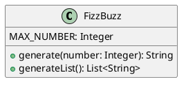
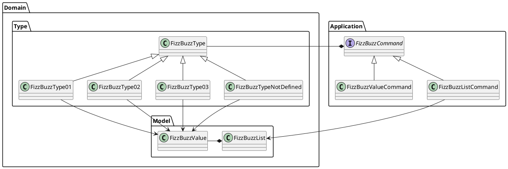
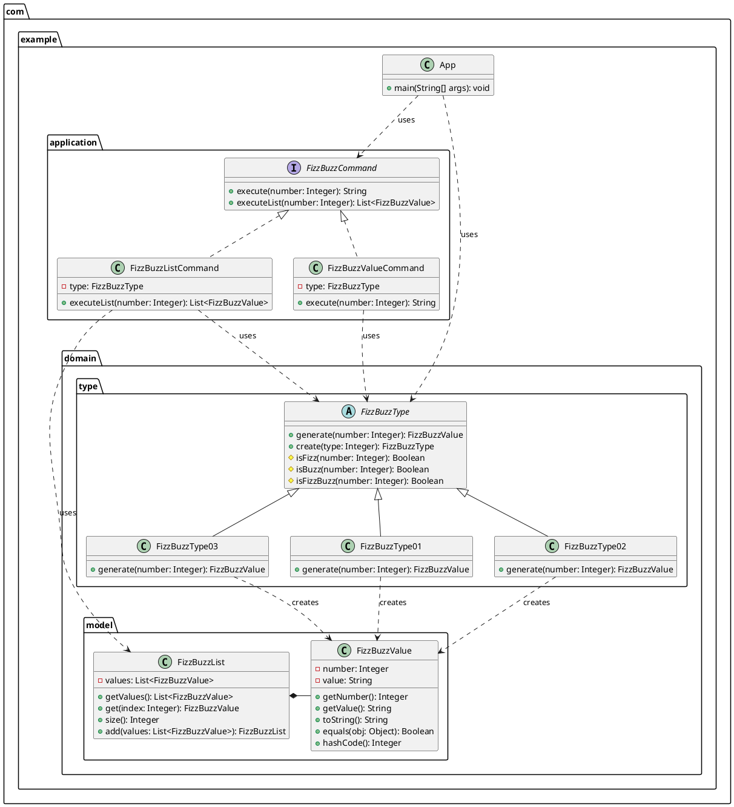

# エピソード3

## 初めに

この記事は [テスト駆動開発から始めるJava入門 ~2時間でTDDとリファクタリングのエッセンスを体験する~](/ja/記事/テスト駆動開発から始めるJava入門1) の続編です。

前提として エピソード１を完了して、[テスト駆動開発から始めるJava入門 ~ソフトウェア開発の三種の神器を準備する~](/ja/記事/テスト駆動開発から始めるJava入門2) で開発環境を構築したところから始まります。 

### 概要

本記事では、 **オブジェクト指向プログラム** から **オブジェクト指向設計** そして **モジュール分割** を **テスト駆動開発** を通じて実践していきます。

#### オブジェクト指向プログラム

エピソード1で作成したプログラムの追加仕様を **テスト駆動開発** で実装します。 次に **手続き型コード** との比較から **オブジェクト指向プログラム** を構成する **カプセル化** **ポリモフィズム** **継承** という概念をコードベースの **リファクタリング** を通じて解説します。

具体的には **フィールドのカプセル化** から **setterの削除** を適用することにより **カプセル化** を実現します。続いて、 **ポリモーフィズムによる条件記述の置き換え** から **State/Strategyによるタイプコードの置き換え** を適用することにより **ポリモーフィズム** の効果を体験します。そして、 **スーパークラスの抽出** から **メソッド名の変更** **メソッドの移動** の適用を通して **継承** の使い方を体験します。さらに **値オブジェクト** と **ファーストクラスコレクション** というオブジェクト指向プログラミングに必要なツールの使い方も学習します。

#### オブジェクト指向設計

次に設計の観点から **単一責任の原則** に違反している `FizzBuzz` クラスを **デザインパターン** の1つである **Commandパターン** を使ったリファクタリングである **メソッドオブジェクトによるメソッドの置き換え** を適用してクラスの責務を分割します。オブジェクト指向設計のイデオムである **デザインパターン** として **Commandパターン** 以外に **Value Objectパターン** **Factory Methodパターン** **Strategyパターン** を **リファクタリング** を適用する過程ですでに実現していたことを説明します。そして、**オープン・クローズドの原則** を満たすコードに **リファクタリング** されたことで既存のコードを変更することなく振る舞いを変更できるようになることを解説します。

加えて、正常系の設計を改善した後 **アサーションの導入** **例外によるエラーコードの置き換え** といった例外系の **リファクタリング** を適用します。最後に **ポリモーフィズム** の応用として **特殊ケースの導入** の適用による **Null Objectパターン** を使った **オープン・クローズドの原則** に従った安全なコードの追加方法を解説します。

#### モジュールの分割

仕上げは、**モノリシック** なファイルから個別のクラスファイルへの分割を **ドメインオブジェクト** の抽出を通して **ドメインモデル** へと整理することにより **モジュール分割** を実現することを体験してもらいます。最後に **良いコード** と **良い設計** について考えます。

##### Before



##### After



## オブジェクト指向から始めるテスト駆動開発

### テスト駆動開発

エピソード1で作成したプログラムに以下の仕様を追加します。

仕様

    1 から 100 までの数をプリントするプログラムを書け。
    ただし 3 の倍数のときは数の代わりに｢Fizz｣と、5 の倍数のときは｢Buzz｣とプリントし、
    3 と 5 両方の倍数の場合には｢FizzBuzz｣とプリントすること。

#### タイプ1：一般的なFizzBuzz

まず、タイプ1（通常のFizzBuzz）のテストを追加します。JUnit 5の `@Nested` アノテーションを使って、テストを階層的に整理します。

```java
@Nested
class タイプ1の場合 {

  @Nested
  class 三と五の倍数の場合 {
    @Test
    void test_15を渡したら文字列FizzBuzzを返す() {
      FizzBuzz fizzbuzz = new FizzBuzz(1);
      assertEquals("FizzBuzz", fizzbuzz.generate(15, 1));
    }
  }

  @Nested
  class 三の倍数の場合 {
    @Test
    void test_3を渡したら文字列Fizzを返す() {
      FizzBuzz fizzbuzz = new FizzBuzz(1);
      assertEquals("Fizz", fizzbuzz.generate(3, 1));
    }
  }

  @Nested
  class 五の倍数の場合 {
    @Test
    void test_5を渡したら文字列Buzzを返す() {
      FizzBuzz fizzbuzz = new FizzBuzz(1);
      assertEquals("Buzz", fizzbuzz.generate(5, 1));
    }
  }

  @Nested
  class その他の場合 {
    @Test
    void test_1を渡したら文字列1を返す() {
      FizzBuzz fizzbuzz = new FizzBuzz(1);
      assertEquals("1", fizzbuzz.generate(1, 1));
    }

    @Test
    void test_2を渡したら文字列2を返す() {
      FizzBuzz fizzbuzz = new FizzBuzz(1);
      assertEquals("2", fizzbuzz.generate(2, 1));
    }
  }
}
```

この段階では、`FizzBuzz` クラスに型パラメータを追加する必要があります。

```java
public class FizzBuzz {
  public static final int MAX_NUMBER = 100;
  private int type;

  public FizzBuzz(int type) {
    this.type = type;
  }

  public String generate(int number, int type) {
    if (type == 1) {
      if (number % 15 == 0) return "FizzBuzz";
      if (number % 3 == 0) return "Fizz";
      if (number % 5 == 0) return "Buzz";
    }
    return String.valueOf(number);
  }

  public static String generate(int number) {
    FizzBuzz fizzbuzz = new FizzBuzz(1);
    return fizzbuzz.generate(number, 1);
  }
}
```

テストを実行します：

```bash
$ ./gradlew test

BUILD SUCCESSFUL in 2s
4 actionable tasks: 2 executed, 2 up-to-date
```

#### タイプ2：数字のみ返すFizzBuzz

続いて、タイプ2（数字のみを返す）のテストを追加します。

```java
@Nested
class タイプ2の場合 {

  @Nested
  class 三の倍数の場合 {
    @Test
    void test_3を渡したら文字列3を返す() {
      FizzBuzz fizzbuzz = new FizzBuzz(2);
      assertEquals("3", fizzbuzz.generate(3, 2));
    }
  }

  @Nested
  class 五の倍数の場合 {
    @Test
    void test_5を渡したら文字列5を返す() {
      FizzBuzz fizzbuzz = new FizzBuzz(2);
      assertEquals("5", fizzbuzz.generate(5, 2));
    }
  }

  @Nested
  class 三と五の倍数の場合 {
    @Test
    void test_15を渡したら文字列15を返す() {
      FizzBuzz fizzbuzz = new FizzBuzz(2);
      assertEquals("15", fizzbuzz.generate(15, 2));
    }
  }

  @Nested
  class その他の場合 {
    @Test
    void test_1を渡したら文字列1を返す() {
      FizzBuzz fizzbuzz = new FizzBuzz(2);
      assertEquals("1", fizzbuzz.generate(1, 2));
    }
  }
}
```

テスト実行のためにコードを修正します：

```java
public String generate(int number, int type) {
  if (type == 1) {
    if (number % 15 == 0) return "FizzBuzz";
    if (number % 3 == 0) return "Fizz";
    if (number % 5 == 0) return "Buzz";
  }
  return String.valueOf(number);
}
```

#### タイプ3：3と5の倍数のみFizzBuzzを返す

最後に、タイプ3のテストを追加します。

```java
@Nested
class タイプ3の場合 {

  @Nested
  class 三の倍数の場合 {
    @Test
    void test_3を渡したら文字列3を返す() {
      FizzBuzz fizzbuzz = new FizzBuzz(3);
      assertEquals("3", fizzbuzz.generate(3, 3));
    }
  }

  @Nested
  class 五の倍数の場合 {
    @Test
    void test_5を渡したら文字列5を返す() {
      FizzBuzz fizzbuzz = new FizzBuzz(3);
      assertEquals("5", fizzbuzz.generate(5, 3));
    }
  }

  @Nested
  class 三と五の倍数の場合 {
    @Test
    void test_15を渡したら文字列FizzBuzzを返す() {
      FizzBuzz fizzbuzz = new FizzBuzz(3);
      assertEquals("FizzBuzz", fizzbuzz.generate(15, 3));
    }
  }

  @Nested
  class その他の場合 {
    @Test
    void test_1を渡したら文字列1を返す() {
      FizzBuzz fizzbuzz = new FizzBuzz(3);
      assertEquals("1", fizzbuzz.generate(1, 3));
    }
  }
}
```

コードを更新します：

```java
public String generate(int number, int type) {
  if (type == 1) {
    if (number % 15 == 0) return "FizzBuzz";
    if (number % 3 == 0) return "Fizz";
    if (number % 5 == 0) return "Buzz";
  } else if (type == 3) {
    if (number % 15 == 0) return "FizzBuzz";
  }
  return String.valueOf(number);
}
```

#### 例外処理のテスト

存在しないタイプの処理もテストします：

```java
@Nested
class それ以外のタイプの場合 {
  @Test
  void test_4を渡したら例外が発生する() {
    assertThrows(IllegalArgumentException.class, () -> {
      new FizzBuzz(4);
    });
  }
}
```

コミットしておきます：

```bash
$ git add .
$ git commit -m "test: タイプ別FizzBuzzテストの追加"
```

### オブジェクト指向

#### 手続き型プログラム

**オブジェクト指向** の解説の前に以下のコードを御覧ください。いわゆる **手続き型** で書かれたコードですが、これも追加仕様を満たしています。

```java
public class ProceduralFizzBuzz {
  public static void main(String[] args) {
    int MAX_NUMBER = 100;
    int type = 1;
    List<String> list = new ArrayList<>();
    
    for (int number = 1; number <= MAX_NUMBER; number++) {
      String result;
      if (type == 1) {
        if (number % 15 == 0) {
          result = "FizzBuzz";
        } else if (number % 3 == 0) {
          result = "Fizz";
        } else if (number % 5 == 0) {
          result = "Buzz";
        } else {
          result = String.valueOf(number);
        }
      } else if (type == 3) {
        if (number % 15 == 0) {
          result = "FizzBuzz";
        } else {
          result = String.valueOf(number);
        }
      } else {
        result = String.valueOf(number);
      }
      list.add(result);
    }
    
    for (String item : list) {
      System.out.println(item);
    }
  }
}
```

このコードは動作しますが、以下の問題があります：

- **データと処理が分離** されている
- **再利用性が低い**
- **テストが困難**
- **保守性が低い**

> プロシージャ型コードの問題は、プロシージャがデータを持たないことです。振る舞いと状態が分離しているため、ほかのコードが簡単にデータを直接いじくることができます。その結果、責任の所在があいまいになり、バグを埋め込みやすいコードになってしまいます。
> 
> —  現場で役立つシステム設計の原則

**オブジェクト指向プログラミング** では、データ（状態）と処理（振る舞い）を1つの **オブジェクト** にまとめることで、これらの問題を解決します。

### カプセル化

現在の `FizzBuzz` クラスは、外部からフィールドに直接アクセスできてしまいます。**カプセル化** を適用して、オブジェクトの内部状態を保護しましょう。

> カプセル化とは、オブジェクトの実装詳細を隠蔽し、外部からの不正なアクセスを防ぐ仕組みです。
> 
> —  オブジェクト指向でなぜつくるのか

#### フィールドのカプセル化

まず、フィールドを `private` にして外部からの直接アクセスを禁止します。

```java
public class FizzBuzz {
  public static final int MAX_NUMBER = 100;
  private List<String> list;
  private int type;

  public FizzBuzz(int type) {
    this.type = type;
  }

  public List<String> getList() {
    return list;
  }

  public int getType() {
    return type;
  }

  // ...その他のメソッド
}
```

#### setterの削除

**setter メソッド** は、オブジェクトの状態を外部から変更できてしまうため、**カプセル化** を破る要因となります。

> setterを使うと、オブジェクトの生成後にもデータを自由に変更できてしまいます。つまり、何かの処理の拍子に、想定外のデータに書き換えられてしまう危険性があります。
> 
> —  現場で役立つシステム設計の原則

setterメソッドを削除し、コンストラクタでのみオブジェクトの状態を設定するようにします。

```java
public class FizzBuzz {
  public static final int MAX_NUMBER = 100;
  private List<String> list;
  private final int type; // finalで不変にする

  public FizzBuzz(int type) {
    if (type < 1 || type > 3) {
      throw new IllegalArgumentException("該当するタイプは存在しません");
    }
    this.type = type;
  }

  public List<String> getList() {
    return list;
  }

  public int getType() {
    return type;
  }

  // setterメソッドは削除
}
```

この変更により、`FizzBuzz` オブジェクトは生成後に内部状態が変更されることがなくなります。

コミットしておきます：

```bash
$ git add .
$ git commit -m "refactor: カプセル化の適用"
```

### ポリモーフィズム

現在のコードでは、`generate` メソッド内で `type` による条件分岐を行っています。これを **ポリモーフィズム** を使って改善しましょう。

> ポリモーフィズムは継承と組み合わせて、プログラムをより柔軟で再利用可能にするために使用します。
> 
> —  オブジェクト指向でなぜつくるのか

#### ポリモーフィズムによる条件記述の置き換え

まず、FizzBuzzのタイプごとの振る舞いを定義するインターフェイスを作成します。

```java
public interface FizzBuzzType {
  String generate(int number);
}
```

各タイプの実装クラスを作成します：

```java
public class FizzBuzzType01 implements FizzBuzzType {
  @Override
  public String generate(int number) {
    if (number % 15 == 0) return "FizzBuzz";
    if (number % 3 == 0) return "Fizz";
    if (number % 5 == 0) return "Buzz";
    return String.valueOf(number);
  }
}

public class FizzBuzzType02 implements FizzBuzzType {
  @Override
  public String generate(int number) {
    return String.valueOf(number);
  }
}

public class FizzBuzzType03 implements FizzBuzzType {
  @Override
  public String generate(int number) {
    if (number % 15 == 0) return "FizzBuzz";
    return String.valueOf(number);
  }
}
```

#### Factory Methodパターンの適用

タイプコードからインスタンスを生成する **Factory Method** を実装します。

```java
public class FizzBuzz {
  public static final int MAX_NUMBER = 100;
  private List<String> list;
  private FizzBuzzType type;

  public FizzBuzz(int type) {
    this.type = createFizzBuzzType(type);
  }

  private static FizzBuzzType createFizzBuzzType(int type) {
    switch (type) {
      case 1:
        return new FizzBuzzType01();
      case 2:
        return new FizzBuzzType02();
      case 3:
        return new FizzBuzzType03();
      default:
        throw new IllegalArgumentException("該当するタイプは存在しません");
    }
  }

  public String generate(int number, int typeCode) {
    return type.generate(number);
  }

  // ...その他のメソッド
}
```

この変更により、新しいタイプを追加する際に既存のコードを変更する必要がなくなりました。これは **オープン・クローズドの原則** と呼ばれる設計原則を満たしています。

> ソフトウェアエンティティ（クラス、モジュール、関数など）は拡張に対しては開いていて、修正に対しては閉じていなければならない。
> 
> —  アジャイルソフトウェア開発の奥義

コミットしておきます：

```bash
$ git add .
$ git commit -m "refactor: ポリモーフィズムによる条件記述の置き換え"
```

### 継承

現在の実装では、各 `FizzBuzzType` クラスが共通の処理（3の倍数、5の倍数の判定）を重複して持っています。**継承** を使って共通処理を抽象クラスに移動しましょう。

> 継承は、既存のクラスの機能を引き継いで新しいクラスを作成する仕組みです。
> 
> —  オブジェクト指向でなぜつくるのか

#### スーパークラスの抽出

```java
public abstract class FizzBuzzType {
  public abstract String generate(int number);

  protected boolean isFizz(int number) {
    return number % 3 == 0;
  }

  protected boolean isBuzz(int number) {
    return number % 5 == 0;
  }

  protected boolean isFizzBuzz(int number) {
    return isFizz(number) && isBuzz(number);
  }
}
```

各実装クラスを更新します：

```java
public class FizzBuzzType01 extends FizzBuzzType {
  @Override
  public String generate(int number) {
    if (isFizzBuzz(number)) return "FizzBuzz";
    if (isFizz(number)) return "Fizz";
    if (isBuzz(number)) return "Buzz";
    return String.valueOf(number);
  }
}

public class FizzBuzzType02 extends FizzBuzzType {
  @Override
  public String generate(int number) {
    return String.valueOf(number);
  }
}

public class FizzBuzzType03 extends FizzBuzzType {
  @Override
  public String generate(int number) {
    if (isFizzBuzz(number)) return "FizzBuzz";
    return String.valueOf(number);
  }
}
```

Factory Methodも更新します：

```java
public static FizzBuzzType createFizzBuzzType(int type) {
  switch (type) {
    case 1:
      return new FizzBuzzType01();
    case 2:
      return new FizzBuzzType02();
    case 3:
      return new FizzBuzzType03();
    default:
      throw new IllegalArgumentException("該当するタイプは存在しません");
  }
}
```

この変更により、コードの重複が除去され、保守性が向上しました。

コミットしておきます：

```bash
$ git add .
$ git commit -m "refactor: 継承による共通処理の抽出"
```

### 値オブジェクト

現在のコードでは、FizzBuzzの結果を文字列として返していますが、これは **基本データ型への執着** というコードの臭いです。

> 基本データ型への執着とは、小さなオブジェクトを使うべき場面で基本データ型を使ってしまうことです。
> 
> —  リファクタリング(第2版)

**値オブジェクト（Value Object）** を作成して、FizzBuzzの結果をより意味のあるオブジェクトとして表現しましょう。

> 値の種類ごとに専用の型を用意するとコードが安定し、コードの意図が明確になります。このように、値を扱うための専用クラスを作るやり方を値オブジェクト（ValueObject）と呼びます。
> 
> —  現場で役立つシステム設計の原則

```java
public class FizzBuzzValue {
  private final int number;
  private final String value;

  public FizzBuzzValue(int number, String value) {
    this.number = number;
    this.value = value;
  }

  public int getNumber() {
    return number;
  }

  public String getValue() {
    return value;
  }

  @Override
  public String toString() {
    return number + ":" + value;
  }

  @Override
  public boolean equals(Object obj) {
    if (this == obj) return true;
    if (obj == null || getClass() != obj.getClass()) return false;
    FizzBuzzValue that = (FizzBuzzValue) obj;
    return number == that.number && Objects.equals(value, that.value);
  }

  @Override
  public int hashCode() {
    return Objects.hash(number, value);
  }
}
```

各タイプクラスを更新して `FizzBuzzValue` を返すようにします：

```java
public abstract class FizzBuzzType {
  public abstract FizzBuzzValue generate(int number);

  protected boolean isFizz(int number) {
    return number % 3 == 0;
  }

  protected boolean isBuzz(int number) {
    return number % 5 == 0;
  }

  protected boolean isFizzBuzz(int number) {
    return isFizz(number) && isBuzz(number);
  }
}

public class FizzBuzzType01 extends FizzBuzzType {
  @Override
  public FizzBuzzValue generate(int number) {
    if (isFizzBuzz(number)) return new FizzBuzzValue(number, "FizzBuzz");
    if (isFizz(number)) return new FizzBuzzValue(number, "Fizz");
    if (isBuzz(number)) return new FizzBuzzValue(number, "Buzz");
    return new FizzBuzzValue(number, String.valueOf(number));
  }
}
```

コミットしておきます：

```bash
$ git add .
$ git commit -m "refactor: 値オブジェクトの導入"
```

### ファーストクラスコレクション

現在のコードでは、FizzBuzzの結果のリストを `List<String>` で管理していますが、これも **基本データ型への執着** の一種です。

**ファーストクラスコレクション（First-Class Collection）** を作成して、コレクションに関連する振る舞いをカプセル化しましょう。

> ファーストクラスコレクションは、コレクションをラップし、そのコレクションに関連する振る舞いを一箇所にまとめる技法です。
> 
> —  現場で役立つシステム設計の原則

```java
public class FizzBuzzList {
  private final List<FizzBuzzValue> values;

  public FizzBuzzList(List<FizzBuzzValue> values) {
    this.values = new ArrayList<>(values);
  }

  public List<FizzBuzzValue> getValues() {
    return new ArrayList<>(values);
  }

  public FizzBuzzValue get(int index) {
    return values.get(index);
  }

  public int size() {
    return values.size();
  }

  public FizzBuzzList add(List<FizzBuzzValue> newValues) {
    List<FizzBuzzValue> newList = new ArrayList<>(values);
    newList.addAll(newValues);
    return new FizzBuzzList(newList);
  }

  @Override
  public String toString() {
    return values.toString();
  }

  @Override
  public boolean equals(Object obj) {
    if (this == obj) return true;
    if (obj == null || getClass() != obj.getClass()) return false;
    FizzBuzzList that = (FizzBuzzList) obj;
    return Objects.equals(values, that.values);
  }

  @Override
  public int hashCode() {
    return Objects.hash(values);
  }
}
```

`FizzBuzz` クラスを更新して `FizzBuzzList` を使用するようにします：

```java
public class FizzBuzz {
  public static final int MAX_NUMBER = 100;
  private FizzBuzzList list;
  private final FizzBuzzType type;

  public FizzBuzz(int type) {
    this.type = createFizzBuzzType(type);
    this.list = new FizzBuzzList(new ArrayList<>());
  }

  public List<String> getList() {
    return list.getValues().stream()
               .map(FizzBuzzValue::getValue)
               .collect(Collectors.toList());
  }

  public FizzBuzzType getType() {
    return type;
  }

  public String generate(int number, int typeCode) {
    return type.generate(number).getValue();
  }

  public static String generate(int number) {
    FizzBuzz fizzbuzz = new FizzBuzz(1);
    return fizzbuzz.generate(number, 1);
  }

  public void generateList() {
    List<FizzBuzzValue> values = IntStream.rangeClosed(1, MAX_NUMBER)
                                          .mapToObj(type::generate)
                                          .collect(Collectors.toList());
    list = list.add(values);
  }

  private static FizzBuzzType createFizzBuzzType(int type) {
    switch (type) {
      case 1:
        return new FizzBuzzType01();
      case 2:
        return new FizzBuzzType02();
      case 3:
        return new FizzBuzzType03();
      default:
        throw new IllegalArgumentException("該当するタイプは存在しません");
    }
  }
}
```

> 変更可能なデータはしばしば予期せぬ結果や、厄介なバグを引き起こします。そのため、ソフトウェア開発の一つの潮流である関数型プログラミングは、データは不変であるべきで、更新時は常に元データ構造のコピーを返すようにし、元データには手を触れないという思想に基づいています。
> 
> —  リファクタリング(第2版)

コミットしておきます：

```bash
$ git add .
$ git commit -m "refactor: ファーストクラスコレクションの導入"
```

### オブジェクト指向設計

現在の `FizzBuzz` クラスは、複数の責任を持っています：

1. FizzBuzz値の生成
2. FizzBuzzリストの管理
3. ファクトリメソッドの提供

これは **単一責任の原則** に違反しています。

> クラスを変更する理由は、ひとつより多くあってはならない。
> 
> —  アジャイルソフトウェア開発の奥義

**Commandパターン** を使って責務を分割しましょう。

> Commandパターン
> 
> リクエストをオブジェクトとしてカプセル化し、それによってクライアントを異なるリクエスト、キュー、そしてログリクエストでパラメータ化し、取り消し可能な操作をサポートします。
> 
> —  デザインパターン

#### メソッドオブジェクトによるメソッドの置き換え

まず、FizzBuzzValueを生成する責務を持つCommandオブジェクトを作成します：

```java
public interface FizzBuzzCommand {
  default String execute(int number) { return null; }
  default List<FizzBuzzValue> executeList(int number) { return null; }
}

public class FizzBuzzValueCommand implements FizzBuzzCommand {
  private final FizzBuzzType type;

  public FizzBuzzValueCommand(FizzBuzzType type) {
    this.type = type;
  }

  @Override
  public String execute(int number) {
    return type.generate(number).getValue();
  }
}

public class FizzBuzzListCommand implements FizzBuzzCommand {
  private final FizzBuzzType type;

  public FizzBuzzListCommand(FizzBuzzType type) {
    this.type = type;
  }

  @Override
  public List<FizzBuzzValue> executeList(int number) {
    return IntStream.rangeClosed(1, number)
                   .mapToObj(type::generate)
                   .collect(Collectors.toList());
  }
}
```

テストコードを更新してCommandオブジェクトを使用するようにします：

```java
@Nested
class タイプ1の場合 {

  @Nested
  class 三と五の倍数の場合 {
    @Test
    void test_15を渡したら文字列FizzBuzzを返す() {
      FizzBuzzValueCommand fizzbuzz = new FizzBuzzValueCommand(new FizzBuzzType01());
      assertEquals("FizzBuzz", fizzbuzz.execute(15));
    }
  }

  // ...その他のテスト

  @Nested
  class 配列や繰り返し処理を理解する {
    @Test
    void test_1から100まで数えて返す() {
      FizzBuzzListCommand fizzbuzz = new FizzBuzzListCommand(new FizzBuzzType01());
      List<FizzBuzzValue> result = fizzbuzz.executeList(100);
      assertEquals("1", result.get(0).getValue());
      assertEquals("2", result.get(1).getValue());
      assertEquals("Fizz", result.get(2).getValue());
      // ...その他のアサーション
    }
  }
}
```

これで **メソッドオブジェクトによるメソッドの置き換え** リファクタリングの結果として **Commandパターン** という **デザインパターン** を適用しました。

実はこれまでにも以下のデザインパターンを適用していました：

- **オブジェクトによるプリミティブの置き換え** → **Value Objectパターン**
- **ポリモーフィズムによる条件記述の置き換え** → **Factory Methodパターン**
- **委譲の隠蔽** による **State/Strategyによるタイプコードの置き換え** → **Strategyパターン**

コミットしておきます：

```bash
$ git add .
$ git commit -m "refactor: Commandパターンの適用"
```

### 例外

現在のコードでは、不正なタイプが渡された場合の例外処理が不十分です。また、想定外の引数に対する防御的プログラミングも必要です。

#### アサーションの導入

メソッドの事前条件をチェックするアサーションを追加します：

```java
public class FizzBuzzValue {
  private final int number;
  private final String value;

  public FizzBuzzValue(int number, String value) {
    assert number > 0 : "number must be positive";
    assert value != null : "value must not be null";
    
    this.number = number;
    this.value = value;
  }

  // ...その他のメソッド
}
```

#### 例外によるエラーコードの置き換え

不正な入力に対して適切な例外を投げるようにします：

```java
public abstract class FizzBuzzType {
  public abstract FizzBuzzValue generate(int number);

  public static FizzBuzzType create(int type) {
    switch (type) {
      case 1:
        return new FizzBuzzType01();
      case 2:
        return new FizzBuzzType02();
      case 3:
        return new FizzBuzzType03();
      default:
        throw new IllegalArgumentException("該当するタイプは存在しません");
    }
  }

  // ...その他のメソッド
}
```

#### Null Objectパターン

未定義のタイプに対して例外を投げる代わりに、**Null Objectパターン** を適用することもできます：

```java
public class FizzBuzzTypeNotDefined extends FizzBuzzType {
  @Override
  public FizzBuzzValue generate(int number) {
    return new FizzBuzzValue(number, String.valueOf(number));
  }
}

public static FizzBuzzType create(int type) {
  switch (type) {
    case 1:
      return new FizzBuzzType01();
    case 2:
      return new FizzBuzzType02();
    case 3:
      return new FizzBuzzType03();
    default:
      return new FizzBuzzTypeNotDefined();
  }
}
```

> Null Objectパターンは、nullの代わりに使用できるオブジェクトを提供します。これにより、nullチェックの必要性を減らし、コードをより安全にします。
> 
> —  リファクタリング(第2版)

### モジュール分割

**ドメインオブジェクト** の抽出を通して **ドメインモデル** へと整理し、適切なパッケージ構造に分割しました。現在のプロジェクトは以下のパッケージ構造になっています：

> モジュール分割は、関連するクラスをグループ化し、システムの構造を明確にするために重要です。
> 
> —  クリーンアーキテクチャ

#### 現在のパッケージ構造

実際の実装では以下のパッケージ構造に分割されています：

```
com.example
├── App.java                               # メインエントリーポイント
├── domain
│   ├── type
│   │   ├── FizzBuzzType.java             # FizzBuzzタイプの抽象クラス
│   │   ├── FizzBuzzType01.java           # タイプ1の実装（基本的なFizzBuzz）
│   │   ├── FizzBuzzType02.java           # タイプ2の実装（カスタムパターン）
│   │   └── FizzBuzzType03.java           # タイプ3の実装（拡張パターン）
│   └── model
│       ├── FizzBuzzValue.java            # FizzBuzzの値オブジェクト
│       └── FizzBuzzList.java             # FizzBuzzのコレクション
└── application
    ├── FizzBuzzCommand.java              # Commandパターンのインターフェース
    ├── FizzBuzzValueCommand.java         # 単一値生成コマンド
    └── FizzBuzzListCommand.java          # リスト生成コマンド
```

この構造により、以下の分離が実現されています：

- **Domain/Type パッケージ**: FizzBuzzの各タイプの実装ロジック
- **Domain/Model パッケージ**: ドメインの値オブジェクトとコレクション  
- **Application パッケージ**: アプリケーション層のコマンド実装

#### Domain/Type パッケージの実装

FizzBuzzのタイプに関するクラスを `com.example.domain.type` パッケージに配置しています：

```java
package com.example.domain.type;

import com.example.domain.model.FizzBuzzValue;

public abstract class FizzBuzzType {
  public abstract FizzBuzzValue generate(int number);

  protected boolean isFizz(int number) {
    return number % 3 == 0;
  }

  protected boolean isBuzz(int number) {
    return number % 5 == 0;
  }

  protected boolean isFizzBuzz(int number) {
    return isFizz(number) && isBuzz(number);
  }

  public static FizzBuzzType create(int type) {
    switch (type) {
      case 1:
        return new FizzBuzzType01();
      case 2:
        return new FizzBuzzType02();
      case 3:
        return new FizzBuzzType03();
      default:
        throw new IllegalArgumentException("該当するタイプは存在しません");
    }
  }
}
```

#### Domain/Model パッケージの実装

値オブジェクトとコレクションを `com.example.domain.model` パッケージに配置しています：

```java
package com.example.domain.model;

import java.util.Objects;

public class FizzBuzzValue {
  private final int number;
  private final String value;

  public FizzBuzzValue(int number, String value) {
    this.number = number;
    this.value = value;
  }

  public int getNumber() {
    return number;
  }

  public String getValue() {
    return value;
  }

  @Override
  public String toString() {
    return number + ":" + value;
  }

  @Override
  public boolean equals(Object obj) {
    if (this == obj) return true;
    if (obj == null || getClass() != obj.getClass()) return false;
    FizzBuzzValue that = (FizzBuzzValue) obj;
    return number == that.number && Objects.equals(value, that.value);
  }

  @Override
  public int hashCode() {
    return Objects.hash(number, value);
  }
}
```

#### Application パッケージの実装

アプリケーション層のコマンドを `com.example.application` パッケージに配置しています：

```java
package com.example.application;

import com.example.domain.type.FizzBuzzType;
import com.example.domain.model.FizzBuzzValue;
import java.util.List;

public interface FizzBuzzCommand {
  default String execute(int number) { return null; }
  default List<FizzBuzzValue> executeList(int number) { return null; }
}
```

#### メインクラスの構成

現在の実装では、メインのエントリーポイントとして `App.java` があり、新しいパッケージ構造を活用しています：

```java
package com.example;

import com.example.domain.type.FizzBuzzType;
import com.example.domain.model.FizzBuzzList;
import com.example.domain.model.FizzBuzzValue;
import com.example.application.FizzBuzzValueCommand;
import com.example.application.FizzBuzzListCommand;

public class App {
  public static void main(String[] args) {
    // 各種コマンドとタイプを使用したFizzBuzzの実行
    // ...
  }
}
```

このモジュール分割により、以下の **設計原則** が実現されています：

- **単一責任の原則**: 各パッケージが明確な責任を持つ
- **依存性逆転の原則**: アプリケーション層がドメイン層の抽象に依存
- **開放閉鎖の原則**: 新しいタイプやコマンドの追加が既存コードの変更なしに可能

最終的なクラス図は以下のようになります：



コミットしておきます：

```bash
$ git add .
$ git commit -m "refactor: モジュール分割の完了"
```

### ふりかえり

このエピソードを通じて、単純なFizzBuzzプログラムから始めて、以下のオブジェクト指向の概念とデザインパターンを学習しました：

#### オブジェクト指向プログラムの三大要素

1. **カプセル化**
   - フィールドのカプセル化
   - setterの削除
   - 不変オブジェクトの作成

2. **ポリモーフィズム**
   - インターフェイスの活用
   - 条件分岐の置き換え
   - Strategy パターン

3. **継承**
   - 抽象クラスの抽出
   - 共通処理の移動
   - protected メソッドの活用

#### デザインパターン

- **Value Object パターン**: `FizzBuzzValue`
- **First-Class Collection パターン**: `FizzBuzzList`
- **Strategy パターン**: `FizzBuzzType` の各実装
- **Factory Method パターン**: `FizzBuzzType.create()`
- **Command パターン**: `FizzBuzzCommand` の各実装
- **Null Object パターン**: `FizzBuzzTypeNotDefined`

#### 設計原則

- **単一責任の原則**: 各クラスが一つの責任のみを持つ
- **オープン・クローズドの原則**: 拡張に対して開いて、修正に対して閉じている
- **依存性逆転の原則**: 抽象に依存し、具象に依存しない

#### 良いコードと良い設計

> 良いコードとは、読みやすく、理解しやすく、変更しやすいコードです。
> 
> —  リーダブルコード

> 良い設計とは、変更に対して柔軟で、拡張しやすく、テストしやすい設計です。
> 
> —  クリーンアーキテクチャ

今回のリファクタリングにより、以下が実現されました：

1. **読みやすさ**: 各クラスの責任が明確で、コードの意図が分かりやすい
2. **変更しやすさ**: 新しいタイプの追加が既存コードの変更なしに可能
3. **テストしやすさ**: 各クラスが独立してテスト可能
4. **再利用性**: 各コンポーネントが独立して再利用可能

#### Java開発のベストプラクティス

- **適切なパッケージ構造**: ドメインとアプリケーションの分離
- **イミュータブルオブジェクト**: 不変オブジェクトによる安全性の確保
- **Stream API の活用**: 関数型プログラミングの要素を取り入れた処理
- **JUnit 5 の活用**: `@Nested` による階層的なテスト構造
- **適切な例外処理**: `IllegalArgumentException` による適切なエラーハンドリング

## 参考図書

- [オブジェクト指向でなぜつくるのか](https://www.amazon.co.jp/dp/4822284654)
- [現場で役立つシステム設計の原則](https://www.amazon.co.jp/dp/477419087X)
- [リファクタリング(第2版)](https://www.amazon.co.jp/dp/4274224546)
- [テスト駆動開発](https://www.amazon.co.jp/dp/4274217884)
- [アジャイルソフトウェア開発の奥義](https://www.amazon.co.jp/dp/4797347783)
- [デザインパターン](https://www.amazon.co.jp/dp/4797311126)
- [クリーンアーキテクチャ](https://www.amazon.co.jp/dp/4048930656)
- [リーダブルコード](https://www.amazon.co.jp/dp/4873115655)
- [Effective Java 第3版](https://www.amazon.co.jp/dp/4621303252)
- [Java言語で学ぶデザインパターン入門](https://www.amazon.co.jp/dp/4797327030)
