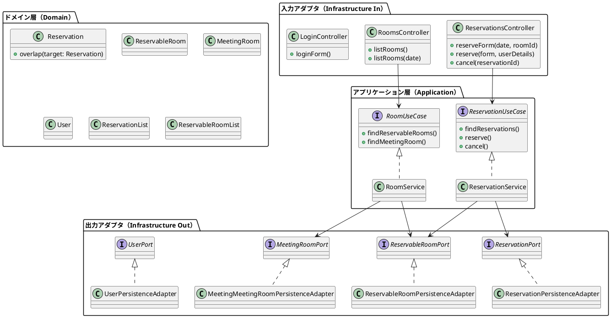
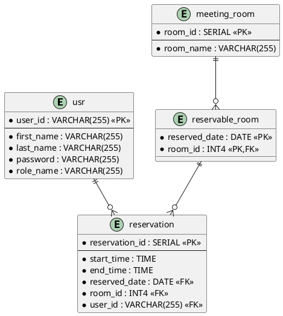

# 会議室予約システム（MRS）完全実装ガイド

このドキュメントは、テスト駆動開発（TDD）によって会議室予約システムを0から完全に実装するための詳細な手順書です。ジャーナルファイルの履歴を基に、実際の開発プロセスを段階的に再現できるレベルまで詳しく解説します。

## 目次

1. [プロジェクト設定と環境構築](#1-プロジェクト設定と環境構築)
2. [データベース設計と初期設定](#2-データベース設計と初期設定)
3. [ヘキサゴナルアーキテクチャの基盤構築](#3-ヘキサゴナルアーキテクチャの基盤構築)
4. [TDDによるドメインモデル実装](#4-tddによるドメインモデル実装)
5. [認証・認可システム実装](#5-認証認可システム実装)
6. [会議室予約機能実装](#6-会議室予約機能実装)
7. [Web層の実装](#7-web層の実装)
8. [統合テストとエンドツーエンドテスト](#8-統合テストとエンドツーエンドテスト)
9. [UIとテンプレートの実装](#9-uiとテンプレートの実装)
10. [デプロイメント設定](#10-デプロイメント設定)

## 全体アーキテクチャ

### ヘキサゴナルアーキテクチャ構成図



## 1. プロジェクト設定と環境構築

### 1.1 Gradle設定

まず、`build.gradle`ファイルを作成します：

```gradle
plugins {
    id 'java'
    id 'org.springframework.boot' version '3.3.2'
    id 'io.spring.dependency-management' version '1.1.6'
    id 'org.dddjava.jig-gradle-plugin' version '2024.7.2'
    id 'jacoco'
}

group = 'com.example'
version = '0.0.1-SNAPSHOT'

java {
    toolchain {
        languageVersion = JavaLanguageVersion.of(17)
    }
}

repositories {
    mavenCentral()
}

dependencies {
    // Spring Boot Starter
    implementation 'org.springframework.boot:spring-boot-starter-data-jpa:3.3.2'
    implementation 'org.springframework.boot:spring-boot-starter-thymeleaf:3.3.2'
    implementation 'org.springframework.boot:spring-boot-starter-web:3.3.2'
    implementation 'org.springframework.boot:spring-boot-starter-validation:3.3.2'
    implementation 'org.springframework.boot:spring-boot-starter-security:3.2.8'
    implementation 'org.thymeleaf.extras:thymeleaf-extras-springsecurity6:3.1.2.RELEASE'
    
    // Database
    runtimeOnly 'com.h2database:h2:2.2.224'
    runtimeOnly 'org.postgresql:postgresql:42.7.3'
    runtimeOnly 'org.flywaydb:flyway-core:10.15.0'
    runtimeOnly group: 'org.flywaydb', name: 'flyway-database-postgresql', version: '10.17.1'
    
    // Development
    developmentOnly 'org.springframework.boot:spring-boot-devtools:3.3.2'
    
    // Testing
    testImplementation 'org.springframework.boot:spring-boot-starter-test:3.3.1'
    testImplementation 'org.springframework.security:spring-security-test:6.3.0'
    testImplementation 'com.github.irof:jig-erd:0.1.0'
    testRuntimeOnly 'org.junit.platform:junit-platform-launcher:1.10.3'
    
    // Code Generation
    compileOnly 'org.projectlombok:lombok:1.18.32'
    annotationProcessor 'org.projectlombok:lombok'
}

tasks.named('test') {
    useJUnitPlatform()
}

jacocoTestReport {
    reports {
        xml.required = true
        html.required = true
    }
}
```

### 1.2 プロジェクト構造の作成

ヘキサゴナルアーキテクチャに基づいてパッケージ構造を作成：

```
src/
└── main/
    └── java/
        └── mrs/
            ├── Application.java（メインクラス）
            ├── WebSecurityConfig.java（セキュリティ設定）
            ├── application/（アプリケーション層）
            │   ├── domain/（ドメイン）
            │   │   └── model/
            │   │       ├── auth/（認証ドメイン）
            │   │       ├── reservation/（予約ドメイン）
            │   │       └── room/（会議室ドメイン）
            │   ├── port/（ポート）
            │   │   ├── in/（入力ポート）
            │   │   └── out/（出力ポート）
            │   └── service/（アプリケーションサービス）
            ├── infrastructure/（インフラストラクチャ層）
            │   ├── in/（入力アダプタ）
            │   │   └── web/
            │   └── out/（出力アダプタ）
            │       └── persistence/
            └── common/（共通機能）
                └── validation/
```

### 1.3 基本設定ファイル

#### application.properties（開発環境用）
```properties
# H2 Database Configuration (Development)
spring.datasource.driver-class-name=org.h2.Driver
spring.datasource.url=jdbc:h2:mem:mrsdb;MODE=PostgreSQL
spring.datasource.username=sa
spring.datasource.password=sa
spring.h2.console.enabled=true

# JPA Configuration
spring.jpa.hibernate.ddl-auto=validate
spring.jpa.properties.hibernate.forma_sql=true

# Logging
logging.level.org.hibernate.SQL=DEBUG
logging.level.org.hibernate.type.descriptor.sql.BasicBinder=TRACE

# Flyway
spring.flyway.locations=classpath:/db/migration/dev
```

#### application-prd.properties（本番環境用）
```properties
# PostgreSQL Database Configuration (Production)
spring.application.name=mrs
spring.jpa.database=postgresql
spring.datasource.url=jdbc:postgresql://localhost:5432/mrs
spring.datasource.username=root
spring.datasource.password=password
spring.jpa.hibernate.ddl-auto=validate
spring.jpa.properties.hibernate.forma_sql=true
spring.datasource.driver-class-name=org.postgresql.Driver
spring.sql.init.encoding=UTF-8
logging.level.org.hibernate.SQL=DEBUG
logging.level.org.hibernate.type.descriptor.sql.BasicBinder=TRACE
spring.sql.init.mode=always
spring.flyway.locations=classpath:/db/migration/prd
```

## 2. データベース設計と初期設定

### 2.1 データベーススキーマ設計

まず、ERD（Entity Relationship Diagram）を設計します：



### 2.2 Flywayマイグレーションファイル

#### V1.00__schema_startup.sql
```sql
-- src/main/resources/db/migration/dev/V1.00__shema_startup.sql
DROP TABLE IF EXISTS meeting_room CASCADE;
DROP TABLE IF EXISTS reservable_room CASCADE;
DROP TABLE IF EXISTS reservation CASCADE;
DROP TABLE IF EXISTS usr CASCADE;

CREATE TABLE meeting_room (
    room_id   SERIAL       NOT NULL,
    room_name VARCHAR(255) NOT NULL,
    PRIMARY KEY (room_id)
);

CREATE TABLE reservable_room (
    reserved_date DATE NOT NULL,
    room_id       INT4 NOT NULL,
    PRIMARY KEY (reserved_date, room_id),
    FOREIGN KEY (room_id) REFERENCES meeting_room
);

CREATE TABLE usr (
    user_id    VARCHAR(255) NOT NULL,
    first_name VARCHAR(255) NOT NULL,
    last_name  VARCHAR(255) NOT NULL,
    password   VARCHAR(255) NOT NULL,
    role_name  VARCHAR(255) NOT NULL,
    PRIMARY KEY (user_id)
);

CREATE TABLE reservation (
    reservation_id SERIAL       NOT NULL,
    end_time       TIME         NOT NULL,
    start_time     TIME         NOT NULL,
    reserved_date  DATE         NOT NULL,
    room_id        INT4         NOT NULL,
    user_id        VARCHAR(255) NOT NULL,
    PRIMARY KEY (reservation_id),
    FOREIGN KEY (reserved_date, room_id) REFERENCES reservable_room,
    FOREIGN KEY (user_id) REFERENCES usr
);
```

#### V1.01__data_startup.sql（テストデータ）
```sql
-- 会議室データ
INSERT INTO meeting_room (room_name) VALUES ('新木場');
INSERT INTO meeting_room (room_name) VALUES ('辰巳');
INSERT INTO meeting_room (room_name) VALUES ('豊洲');
INSERT INTO meeting_room (room_name) VALUES ('月島');
INSERT INTO meeting_room (room_name) VALUES ('新富町');
INSERT INTO meeting_room (room_name) VALUES ('銀座一丁目');
INSERT INTO meeting_room (room_name) VALUES ('有楽町');

-- 予約可能日設定
INSERT INTO reservable_room(reserved_date, room_id) VALUES (CURRENT_DATE, 1);
INSERT INTO reservable_room(reserved_date, room_id) VALUES (CURRENT_DATE + 1, 1);
INSERT INTO reservable_room(reserved_date, room_id) VALUES (CURRENT_DATE - 1, 1);
INSERT INTO reservable_room(reserved_date, room_id) VALUES (CURRENT_DATE, 7);
INSERT INTO reservable_room(reserved_date, room_id) VALUES (CURRENT_DATE + 1, 7);
INSERT INTO reservable_room(reserved_date, room_id) VALUES (CURRENT_DATE - 1, 7);

-- テストユーザー（パスワード：demo）
INSERT INTO usr (user_id, first_name, last_name, role_name, password)
VALUES ('aaaa', 'Aaa', 'Aaa', 'USER', '$2a$10$oxSJl.keBwxmsMLkcT9lPeAIxfNTPNQxpeywMrF7A3kVszwUTqfTK');
INSERT INTO usr (user_id, first_name, last_name, role_name, password)
VALUES ('bbbb', 'Bbb', 'Bbb', 'USER', '$2a$10$oxSJl.keBwxmsMLkcT9lPeAIxfNTPNQxpeywMrF7A3kVszwUTqfTK');
INSERT INTO usr (user_id, first_name, last_name, role_name, password)
VALUES ('cccc', 'Ccc', 'Ccc', 'ADMIN', '$2a$10$oxSJl.keBwxmsMLkcT9lPeAIxfNTPNQxpeywMrF7A3kVszwUTqfTK');
```

## 3. ヘキサゴナルアーキテクチャの基盤構築

### 3.1 ドメインモデルの基盤クラス

まず、基盤となる値オブジェクトを作成します。

### 1. 認証機能

#### 実装概要
Spring Securityを使用したフォームベース認証システム。

#### 主要クラス

**WebSecurityConfig.java**
```java
@Configuration
@EnableWebSecurity
@EnableMethodSecurity
public class WebSecurityConfig {
    @Bean
    PasswordEncoder passwordEncoder() {
        return new BCryptPasswordEncoder();
    }
    
    @Bean
    public SecurityFilterChain securityFilterChain(HttpSecurity http) throws Exception {
        // セキュリティ設定
    }
}
```

**AuthService.java（認証サービス）**
- Spring Securityとの統合
- ユーザー認証とロール管理
- パスワード暗号化（BCrypt）

#### テスト戦略
- `AuthUserDetailsServiceTest`: ユーザー認証ロジックのテスト
- モックを使用したSecurityContextのテスト

### 2. 会議室予約機能

#### 実装概要
中核機能である会議室の予約・キャンセル処理。

#### 主要クラス

**ReservationService.java**
```java
@Service
@Transactional
public class ReservationService {
    /**
     * 予約を行う
     */
    public Reservation reserve(Reservation reservation) {
        // 悲観的ロックによる排他制御
        ReservableRoom reservable = reservableRoomRepository
            .findOneForUpdateByReservableRoomId(reservableRoomId);
        
        // 予約重複チェック
        boolean overlap = reservationRepository
            .findByReservableRoom_ReservableRoomIdOrderByStartTimeAsc(reservableRoomId)
            .stream()
            .anyMatch(x -> x.overlap(reservation));
            
        if (overlap) {
            throw new AlreadyReservedException("入力の時間帯はすでに予約済みです。");
        }
    }
}
```

#### ドメインロジック

**Reservation.java（予約重複判定）**
```java
public boolean overlap(Reservation target) {
    if (!Objects.equals(reservableRoom.getReservableRoomId(), 
                       target.reservableRoom.getReservableRoomId())) {
        return false;
    }
    return target.endTime.isAfter(startTime) && endTime.isAfter(target.startTime);
}
```

#### バリデーション機能

**カスタムバリデーション**
- `@ThirtyMinutesUnit`: 30分単位での時刻入力
- `@EndTimeMustBeAfterStartTime`: 終了時刻が開始時刻より後であることの検証

#### セキュリティ
```java
@PreAuthorize("hasRole('ADMIN') or #reservation.user.userId == principal.user.userId")
public void cancel(@P("reservation") Reservation reservation) {
    reservationRepository.delete(reservation);
}
```

#### テスト戦略
- `ReservationServiceTest`: 予約ロジックの単体テスト
- `ReservationsControllerTest`: Web層の統合テスト
- `ReservationFormTest`: バリデーションのテスト

### 3. 会議室管理機能

#### 実装概要
会議室一覧表示と予約可能会議室の検索機能。

#### 主要クラス

**RoomService.java**
```java
@Service
@Transactional
public class RoomService {
    public List<ReservableRoom> findReservableRooms(LocalDate date) {
        return reservableRoomRepository
            .findByReservableRoomId_reservedDateOrderByReservableRoomId_roomIdAsc(date);
    }
}
```

#### テスト戦略
- `RoomServiceTest`: 会議室検索ロジックのテスト

### 4. データ永続化

#### 実装概要
JPA/Hibernateを使用したデータアクセス層の実装。

#### リポジトリパターン
```java
@Lock(LockModeType.PESSIMISTIC_WRITE)
ReservableRoom findOneForUpdateByReservableRoomId(ReservableRoomId reservableRoomId);
```

#### データベース設計
- Flywayによるマイグレーション管理
- 開発環境：H2（PostgreSQLモード）
- 本番環境：PostgreSQL

#### テスト戦略
- `ReservationPersistenceAdapterTest`: データアクセス層のテスト
- `ReservableRoomPersistenceAdapterTest`: 永続化アダプタのテスト

## 4. TDDによるドメインモデル実装

### 4.1 TDDサイクル概要

```
Red → Green → Refactor のサイクル
1. Red: 失敗するテストを書く
2. Green: テストが通るように最小限のコードを書く  
3. Refactor: コードを改善する
```

### 4.2 段階1：値オブジェクトの実装（Red-Green-Refactor）

#### 4.2.1 UserId値オブジェクトの実装

**STEP 1: Red - 失敗するテストを書く**

まず、`src/test/java/mrs/application/domain/model/auth/UserIdTest.java`を作成：

```java
package mrs.application.domain.model.auth;

import org.junit.jupiter.api.DisplayName;
import org.junit.jupiter.api.Test;
import static org.junit.jupiter.api.Assertions.*;

class UserIdTest {
    
    @Test
    @DisplayName("正常なユーザーIDで値オブジェクトが作成される")
    void shouldCreateUserIdWithValidValue() {
        // Given
        String validUserId = "test-user";
        
        // When
        UserId userId = new UserId(validUserId);
        
        // Then
        assertEquals(validUserId, userId.getValue());
    }
    
    @Test
    @DisplayName("nullのユーザーIDで例外が発生する")
    void shouldThrowExceptionWithNullValue() {
        // When & Then
        assertThrows(IllegalArgumentException.class, () -> new UserId(null));
    }
    
    @Test
    @DisplayName("空文字のユーザーIDで例外が発生する")
    void shouldThrowExceptionWithEmptyValue() {
        // When & Then
        assertThrows(IllegalArgumentException.class, () -> new UserId(""));
    }
    
    @Test
    @DisplayName("同じ値のUserIdは等しい")
    void shouldBeEqualWithSameValue() {
        // Given
        UserId userId1 = new UserId("test-user");
        UserId userId2 = new UserId("test-user");
        
        // When & Then
        assertEquals(userId1, userId2);
        assertEquals(userId1.hashCode(), userId2.hashCode());
    }
}
```

**STEP 2: Green - テストが通るように最小限のコードを書く**

`src/main/java/mrs/application/domain/model/auth/UserId.java`を作成：

```java
package mrs.application.domain.model.auth;

import lombok.Value;

/**
 * ユーザーID値オブジェクト
 */
@Value
public class UserId {
    String value;
    
    public UserId(String value) {
        if (value == null || value.isEmpty()) {
            throw new IllegalArgumentException("ユーザーIDは必須です");
        }
        this.value = value;
    }
}
```

**テスト実行**: `gradle test --tests UserIdTest`

**STEP 3: Refactor - より良い実装に改善**

```java
package mrs.application.domain.model.auth;

import lombok.Value;

/**
 * ユーザーID値オブジェクト
 * ドメインの一意識別子として機能
 */
@Value
public class UserId {
    String value;
    
    public UserId(String value) {
        validateUserId(value);
        this.value = value;
    }
    
    private void validateUserId(String value) {
        if (value == null) {
            throw new IllegalArgumentException("ユーザーIDはnullにできません");
        }
        if (value.trim().isEmpty()) {
            throw new IllegalArgumentException("ユーザーIDは空文字にできません");
        }
        if (value.length() > 255) {
            throw new IllegalArgumentException("ユーザーIDは255文字以内である必要があります");
        }
    }
}
```

#### 4.2.2 Password値オブジェクトの実装

**STEP 1: Red - 失敗するテストを書く**

```java
// src/test/java/mrs/application/domain/model/auth/PasswordTest.java
package mrs.application.domain.model.auth;

import org.junit.jupiter.api.DisplayName;
import org.junit.jupiter.api.Test;
import static org.junit.jupiter.api.Assertions.*;

class PasswordTest {
    
    @Test
    @DisplayName("正常なパスワードで値オブジェクトが作成される")
    void shouldCreatePasswordWithValidValue() {
        // Given
        String validPassword = "validPassword123";
        
        // When
        Password password = new Password(validPassword);
        
        // Then
        assertEquals(validPassword, password.getValue());
    }
    
    @Test
    @DisplayName("nullのパスワードで例外が発生する")
    void shouldThrowExceptionWithNullValue() {
        assertThrows(IllegalArgumentException.class, () -> new Password(null));
    }
    
    @Test
    @DisplayName("暗号化されたパスワードかどうかの判定")
    void shouldIdentifyEncodedPassword() {
        // Given - BCryptでエンコードされたパスワード
        String encodedPassword = "$2a$10$oxSJl.keBwxmsMLkcT9lPeAIxfNTPNQxpeywMrF7A3kVszwUTqfTK";
        String plainPassword = "plainPassword";
        
        // When
        Password encoded = new Password(encodedPassword);
        Password plain = new Password(plainPassword);
        
        // Then
        assertTrue(encoded.isEncoded());
        assertFalse(plain.isEncoded());
    }
}
```

**STEP 2: Green - 最小限の実装**

```java
// src/main/java/mrs/application/domain/model/auth/Password.java
package mrs.application.domain.model.auth;

import lombok.Value;

/**
 * パスワード値オブジェクト
 */
@Value
public class Password {
    String value;
    
    public Password(String value) {
        if (value == null) {
            throw new IllegalArgumentException("パスワードは必須です");
        }
        this.value = value;
    }
    
    /**
     * BCryptでエンコードされたパスワードかどうかを判定
     */
    public boolean isEncoded() {
        return value.startsWith("$2a$") || value.startsWith("$2b$") || value.startsWith("$2y$");
    }
}
```

#### 4.2.3 Name値オブジェクトの実装

**STEP 1: Red - 失敗するテストを書く**

```java
// src/test/java/mrs/application/domain/model/auth/NameTest.java
package mrs.application.domain.model.auth;

import org.junit.jupiter.api.DisplayName;
import org.junit.jupiter.api.Test;
import static org.junit.jupiter.api.Assertions.*;

class NameTest {
    
    @Test
    @DisplayName("正常な姓名で値オブジェクトが作成される")
    void shouldCreateNameWithValidValues() {
        // Given
        String firstName = "太郎";
        String lastName = "山田";
        
        // When
        Name name = new Name(firstName, lastName);
        
        // Then
        assertEquals(firstName, name.getFirstName());
        assertEquals(lastName, name.getLastName());
        assertEquals("山田 太郎", name.getFullName());
    }
    
    @Test
    @DisplayName("nullの姓で例外が発生する")
    void shouldThrowExceptionWithNullLastName() {
        assertThrows(IllegalArgumentException.class, () -> new Name("太郎", null));
    }
    
    @Test
    @DisplayName("nullの名で例外が発生する") 
    void shouldThrowExceptionWithNullFirstName() {
        assertThrows(IllegalArgumentException.class, () -> new Name(null, "山田"));
    }
}
```

**STEP 2: Green - 実装**

```java
// src/main/java/mrs/application/domain/model/auth/Name.java
package mrs.application.domain.model.auth;

import lombok.Value;

/**
 * 氏名値オブジェクト
 */
@Value
public class Name {
    String firstName;
    String lastName;
    
    public Name(String firstName, String lastName) {
        if (firstName == null || firstName.trim().isEmpty()) {
            throw new IllegalArgumentException("名は必須です");
        }
        if (lastName == null || lastName.trim().isEmpty()) {
            throw new IllegalArgumentException("姓は必須です");
        }
        this.firstName = firstName.trim();
        this.lastName = lastName.trim();
    }
    
    /**
     * フルネームを取得（姓 名の形式）
     */
    public String getFullName() {
        return lastName + " " + firstName;
    }
}
```

### 4.3 段階2：エンティティの実装

#### 4.3.1 User エンティティのTDD実装

**STEP 1: Red - 失敗するテストを書く**

```java
// src/test/java/mrs/application/domain/model/auth/UserTest.java
package mrs.application.domain.model.auth;

import org.junit.jupiter.api.DisplayName;
import org.junit.jupiter.api.Test;
import static org.junit.jupiter.api.Assertions.*;

class UserTest {
    
    @Test
    @DisplayName("正常な値でユーザーエンティティが作成される")
    void shouldCreateUserWithValidValues() {
        // Given
        UserId userId = new UserId("test-user");
        Password password = new Password("password123");
        Name name = new Name("太郎", "山田");
        RoleName roleName = RoleName.USER;
        
        // When
        User user = new User(userId, password, name, roleName);
        
        // Then
        assertEquals(userId, user.getUserId());
        assertEquals(password, user.getPassword());
        assertEquals(name, user.getName());
        assertEquals(roleName, user.getRoleName());
    }
    
    @Test
    @DisplayName("管理者かどうかの判定")
    void shouldIdentifyAdminUser() {
        // Given
        User adminUser = new User(
            new UserId("admin"), 
            new Password("password"), 
            new Name("管理者", "システム"), 
            RoleName.ADMIN
        );
        User normalUser = new User(
            new UserId("user"), 
            new Password("password"), 
            new Name("一般", "ユーザー"), 
            RoleName.USER
        );
        
        // When & Then
        assertTrue(adminUser.isAdmin());
        assertFalse(normalUser.isAdmin());
    }
}
```

**STEP 2: Green - 実装**

```java
// src/main/java/mrs/application/domain/model/auth/RoleName.java
package mrs.application.domain.model.auth;

/**
 * ユーザー権限列挙型
 */
public enum RoleName {
    ADMIN,  // 管理者
    USER    // 一般ユーザー
}
```

```java
// src/main/java/mrs/application/domain/model/auth/User.java
package mrs.application.domain.model.auth;

import lombok.Value;

/**
 * ユーザーエンティティ
 */
@Value
public class User {
    UserId userId;
    Password password;
    Name name;
    RoleName roleName;
    
    public User(UserId userId, Password password, Name name, RoleName roleName) {
        if (userId == null) throw new IllegalArgumentException("ユーザーIDは必須です");
        if (password == null) throw new IllegalArgumentException("パスワードは必須です");
        if (name == null) throw new IllegalArgumentException("氏名は必須です");
        if (roleName == null) throw new IllegalArgumentException("ロール名は必須です");
        
        this.userId = userId;
        this.password = password;
        this.name = name;
        this.roleName = roleName;
    }
    
    /**
     * 管理者権限を持っているかどうかの判定
     */
    public boolean isAdmin() {
        return roleName == RoleName.ADMIN;
    }
}
```

### 4.4 段階3：予約ドメインモデルの実装

#### 4.4.1 予約重複判定ロジックのTDD実装

**STEP 1: Red - 重複判定テストを書く**

```java
// src/test/java/mrs/application/domain/model/reservation/ReservationTest.java
package mrs.application.domain.model.reservation;

import mrs.application.domain.model.auth.*;
import mrs.application.domain.model.room.MeetingRoom;
import mrs.application.domain.model.room.RoomId;
import mrs.application.domain.model.room.RoomName;
import org.junit.jupiter.api.BeforeEach;
import org.junit.jupiter.api.DisplayName;
import org.junit.jupiter.api.Test;

import java.time.LocalDate;
import java.time.LocalTime;

import static org.junit.jupiter.api.Assertions.*;

class ReservationTest {
    
    private User testUser;
    private ReservableRoom reservableRoom;
    
    @BeforeEach
    void setUp() {
        testUser = new User(
            new UserId("test-user"),
            new Password("password"),
            new Name("太郎", "テスト"),
            RoleName.USER
        );
        
        MeetingRoom meetingRoom = new MeetingRoom(
            new RoomId(1),
            new RoomName("テスト会議室")
        );
        
        reservableRoom = new ReservableRoom(
            ReservableRoomId.of(1, LocalDate.of(2024, 1, 1)),
            meetingRoom
        );
    }
    
    @Test
    @DisplayName("同じ時間帯の予約は重複する")
    void shouldOverlapWhenSameTimeSlot() {
        // Given
        LocalTime startTime = LocalTime.of(9, 0);
        LocalTime endTime = LocalTime.of(10, 0);
        
        Reservation reservation1 = new Reservation(startTime, endTime, reservableRoom, testUser);
        Reservation reservation2 = new Reservation(startTime, endTime, reservableRoom, testUser);
        
        // When & Then
        assertTrue(reservation1.overlap(reservation2));
    }
    
    @Test
    @DisplayName("部分的に重複する予約は重複と判定される")
    void shouldOverlapWhenPartiallyOverlapping() {
        // Given
        Reservation reservation1 = new Reservation(LocalTime.of(9, 0), LocalTime.of(11, 0), reservableRoom, testUser);
        Reservation reservation2 = new Reservation(LocalTime.of(10, 0), LocalTime.of(12, 0), reservableRoom, testUser);
        
        // When & Then
        assertTrue(reservation1.overlap(reservation2));
        assertTrue(reservation2.overlap(reservation1));
    }
    
    @Test
    @DisplayName("時間的に連続する予約は重複しない")
    void shouldNotOverlapWhenConsecutive() {
        // Given
        Reservation reservation1 = new Reservation(LocalTime.of(9, 0), LocalTime.of(10, 0), reservableRoom, testUser);
        Reservation reservation2 = new Reservation(LocalTime.of(10, 0), LocalTime.of(11, 0), reservableRoom, testUser);
        
        // When & Then
        assertFalse(reservation1.overlap(reservation2));
        assertFalse(reservation2.overlap(reservation1));
    }
    
    @Test
    @DisplayName("異なる会議室の予約は重複しない")
    void shouldNotOverlapWhenDifferentRoom() {
        // Given
        MeetingRoom anotherRoom = new MeetingRoom(new RoomId(2), new RoomName("別の会議室"));
        ReservableRoom anotherReservableRoom = new ReservableRoom(
            ReservableRoomId.of(2, LocalDate.of(2024, 1, 1)),
            anotherRoom
        );
        
        Reservation reservation1 = new Reservation(LocalTime.of(9, 0), LocalTime.of(10, 0), reservableRoom, testUser);
        Reservation reservation2 = new Reservation(LocalTime.of(9, 0), LocalTime.of(10, 0), anotherReservableRoom, testUser);
        
        // When & Then
        assertFalse(reservation1.overlap(reservation2));
    }
}
```

**STEP 2: Green - 予約エンティティの実装**

まず必要な値オブジェクトを実装：

```java
// src/main/java/mrs/application/domain/model/reservation/ReservationId.java
package mrs.application.domain.model.reservation;

import lombok.Value;

@Value
public class ReservationId {
    Integer value;
    
    public ReservationId(Integer value) {
        if (value != null && value <= 0) {
            throw new IllegalArgumentException("予約IDは正の値である必要があります");
        }
        this.value = value;
    }
}
```

```java
// src/main/java/mrs/application/domain/model/reservation/ReservationTimeSlot.java
package mrs.application.domain.model.reservation;

import lombok.Value;

import java.time.LocalTime;

/**
 * 予約時間帯値オブジェクト
 */
@Value
public class ReservationTimeSlot {
    LocalTime startTime;
    LocalTime endTime;
    
    public ReservationTimeSlot(LocalTime startTime, LocalTime endTime) {
        if (startTime == null) {
            throw new IllegalArgumentException("開始時刻は必須です");
        }
        if (endTime == null) {
            throw new IllegalArgumentException("終了時刻は必須です");
        }
        if (!endTime.isAfter(startTime)) {
            throw new IllegalArgumentException("終了時刻は開始時刻より後である必要があります");
        }
        
        this.startTime = startTime;
        this.endTime = endTime;
    }
    
    /**
     * 指定した時間帯と重複するかどうかを判定
     */
    public boolean overlap(ReservationTimeSlot other) {
        if (other == null) return false;
        return other.endTime.isAfter(this.startTime) && this.endTime.isAfter(other.startTime);
    }
}
```

```java
// src/main/java/mrs/application/domain/model/reservation/ReservableRoomId.java
package mrs.application.domain.model.reservation;

import lombok.Value;
import mrs.application.domain.model.room.RoomId;

import java.time.LocalDate;

@Value
public class ReservableRoomId {
    RoomId roomId;
    ReservedDate reservedDate;
    
    public ReservableRoomId(RoomId roomId, ReservedDate reservedDate) {
        if (roomId == null) throw new IllegalArgumentException("会議室IDは必須です");
        if (reservedDate == null) throw new IllegalArgumentException("予約日は必須です");
        this.roomId = roomId;
        this.reservedDate = reservedDate;
    }
    
    public static ReservableRoomId of(Integer roomId, LocalDate date) {
        return new ReservableRoomId(new RoomId(roomId), new ReservedDate(date));
    }
}
```

```java
// src/main/java/mrs/application/domain/model/reservation/ReservedDate.java
package mrs.application.domain.model.reservation;

import lombok.Value;

import java.time.LocalDate;

@Value
public class ReservedDate {
    LocalDate value;
    
    public ReservedDate(LocalDate value) {
        if (value == null) {
            throw new IllegalArgumentException("予約日は必須です");
        }
        this.value = value;
    }
}
```

そして、Reservationエンティティを実装：

```java
// src/main/java/mrs/application/domain/model/reservation/Reservation.java
package mrs.application.domain.model.reservation;

import lombok.Value;
import mrs.application.domain.model.auth.User;

import java.time.LocalTime;
import java.util.Objects;

/**
 * 予約エンティティ
 */
@Value
public class Reservation {
    ReservationId reservationId;
    ReservationTimeSlot reservationTimeSlot;
    ReservableRoom reservableRoom;
    User user;
    
    public Reservation(ReservationId reservationId, ReservationTimeSlot reservationTimeSlot, 
                      ReservableRoom reservableRoom, User user) {
        if (reservationTimeSlot == null) throw new IllegalArgumentException("予約時間帯は必須です");
        if (reservableRoom == null) throw new IllegalArgumentException("予約可能会議室は必須です");
        if (user == null) throw new IllegalArgumentException("ユーザーは必須です");
        
        this.reservationId = reservationId;
        this.reservationTimeSlot = reservationTimeSlot;
        this.reservableRoom = reservableRoom;
        this.user = user;
    }
    
    // ファクトリメソッド（新規予約用）
    public Reservation(LocalTime startTime, LocalTime endTime, ReservableRoom reservableRoom, User user) {
        this(null, new ReservationTimeSlot(startTime, endTime), reservableRoom, user);
    }
    
    // ファクトリメソッド（既存予約用）
    public static Reservation of(Integer reservationId, LocalTime startTime, LocalTime endTime, 
                                ReservableRoom reservableRoom, User user) {
        return new Reservation(
            new ReservationId(reservationId),
            new ReservationTimeSlot(startTime, endTime),
            reservableRoom,
            user
        );
    }
    
    /**
     * 他の予約と重複するかどうかを判定
     */
    public boolean overlap(Reservation target) {
        if (target == null) return false;
        
        // 異なる会議室の場合は重複しない
        if (!Objects.equals(this.reservableRoom.getReservableRoomId(), 
                           target.reservableRoom.getReservableRoomId())) {
            return false;
        }
        
        // 時間帯の重複をチェック
        return this.reservationTimeSlot.overlap(target.reservationTimeSlot);
    }
}
```

## 5. 認証・認可システム実装

### 5.1 Spring Security設定のTDD実装

#### 5.1.1 WebSecurityConfig クラス

**STEP 1: Red - セキュリティ設定のテストを書く**

```java
// src/test/java/mrs/WebSecurityConfigTest.java
package mrs;

import org.junit.jupiter.api.DisplayName;
import org.junit.jupiter.api.Test;
import org.springframework.beans.factory.annotation.Autowired;
import org.springframework.boot.test.autoconfigure.web.servlet.AutoConfigureMockMvc;
import org.springframework.boot.test.context.SpringBootTest;
import org.springframework.security.test.context.support.WithMockUser;
import org.springframework.test.web.servlet.MockMvc;

import static org.springframework.test.web.servlet.request.MockMvcRequestBuilders.get;
import static org.springframework.test.web.servlet.result.MockMvcResultMatchers.*;

@SpringBootTest
@AutoConfigureMockMvc
class WebSecurityConfigTest {
    
    @Autowired
    private MockMvc mockMvc;
    
    @Test
    @DisplayName("ログインフォームへのアクセスは認証不要")
    void shouldAllowAccessToLoginForm() throws Exception {
        mockMvc.perform(get("/loginForm"))
                .andExpect(status().isOk());
    }
    
    @Test
    @DisplayName("静的リソースへのアクセスは認証不要")
    void shouldAllowAccessToStaticResources() throws Exception {
        mockMvc.perform(get("/css/style.css"))
                .andExpect(status().isNotFound()); // ファイルが存在しないが認証はスルー
                
        mockMvc.perform(get("/js/script.js"))
                .andExpect(status().isNotFound()); // ファイルが存在しないが認証はスルー
    }
    
    @Test
    @DisplayName("認証が必要なページは未認証時にログインページにリダイレクト")
    void shouldRedirectToLoginWhenUnauthenticated() throws Exception {
        mockMvc.perform(get("/rooms"))
                .andExpect(status().is3xxRedirection())
                .andExpect(redirectedUrlPattern("**/loginForm"));
    }
    
    @Test
    @WithMockUser
    @DisplayName("認証済みユーザーは保護されたページにアクセス可能")
    void shouldAllowAccessToProtectedPagesWhenAuthenticated() throws Exception {
        mockMvc.perform(get("/rooms"))
                .andExpect(status().isOk());
    }
}
```

**STEP 2: Green - WebSecurityConfig実装**

```java
// src/main/java/mrs/WebSecurityConfig.java
package mrs;

import org.springframework.context.annotation.Bean;
import org.springframework.context.annotation.Configuration;
import org.springframework.security.config.annotation.method.configuration.EnableMethodSecurity;
import org.springframework.security.config.annotation.web.builders.HttpSecurity;
import org.springframework.security.config.annotation.web.configuration.EnableWebSecurity;
import org.springframework.security.crypto.bcrypt.BCryptPasswordEncoder;
import org.springframework.security.crypto.password.PasswordEncoder;
import org.springframework.security.web.SecurityFilterChain;

/**
 * Spring Securityの設定クラス
 */
@Configuration
@EnableWebSecurity
@EnableMethodSecurity  // メソッドレベルセキュリティを有効化
public class WebSecurityConfig {

    /**
     * パスワードエンコーダーの設定
     */
    @Bean
    PasswordEncoder passwordEncoder() {
        return new BCryptPasswordEncoder();
    }

    /**
     * セキュリティフィルターチェーンの設定
     */
    @Bean
    public SecurityFilterChain securityFilterChain(HttpSecurity http) throws Exception {
        http.authorizeHttpRequests(authorize -> authorize
                        // 静的リソースは認証不要
                        .requestMatchers("/js/**", "/css/**", "/images/**").permitAll()
                        // ログインフォームは認証不要
                        .requestMatchers("/loginForm").permitAll()
                        // その他は全て認証が必要
                        .anyRequest().authenticated()
                )
                // フォームログインの設定
                .formLogin(form -> form
                        .loginPage("/loginForm")           // カスタムログインページ
                        .loginProcessingUrl("/login")      // ログイン処理URL
                        .usernameParameter("username")     // ユーザー名パラメータ
                        .passwordParameter("password")     // パスワードパラメータ
                        .defaultSuccessUrl("/", true)      // ログイン成功時のリダイレクト先
                        .failureUrl("/loginForm?error=true") // ログイン失敗時のリダイレクト先
                        .permitAll()
                );

        return http.build();
    }
}
```

#### 5.1.2 AuthUserDetailsServiceの実装

**STEP 1: Red - 認証サービスのテストを書く**

```java
// src/test/java/mrs/application/service/auth/AuthUserDetailsServiceTest.java
package mrs.application.service.auth;

import mrs.application.domain.model.auth.*;
import mrs.application.port.out.UserPort;
import org.junit.jupiter.api.DisplayName;
import org.junit.jupiter.api.Test;
import org.junit.jupiter.api.extension.ExtendWith;
import org.mockito.InjectMocks;
import org.mockito.Mock;
import org.mockito.junit.jupiter.MockitoExtension;
import org.springframework.security.core.userdetails.UserDetails;
import org.springframework.security.core.userdetails.UsernameNotFoundException;

import static org.junit.jupiter.api.Assertions.*;
import static org.mockito.Mockito.*;

@ExtendWith(MockitoExtension.class)
class AuthUserDetailsServiceTest {
    
    @Mock
    private UserPort userPort;
    
    @InjectMocks
    private AuthUserDetailsService authUserDetailsService;
    
    @Test
    @DisplayName("存在するユーザーで認証詳細が取得される")
    void shouldLoadUserByExistingUsername() {
        // Given
        String username = "test-user";
        User user = new User(
            new UserId(username),
            new Password("$2a$10$encodedPassword"),
            new Name("太郎", "テスト"),
            RoleName.USER
        );
        
        when(userPort.findById(new UserId(username))).thenReturn(user);
        
        // When
        UserDetails userDetails = authUserDetailsService.loadUserByUsername(username);
        
        // Then
        assertNotNull(userDetails);
        assertEquals(username, userDetails.getUsername());
        assertEquals("$2a$10$encodedPassword", userDetails.getPassword());
        assertTrue(userDetails.getAuthorities().stream()
                .anyMatch(auth -> auth.getAuthority().equals("ROLE_USER")));
    }
    
    @Test
    @DisplayName("存在しないユーザーで例外が発生する")
    void shouldThrowExceptionForNonExistentUser() {
        // Given
        String username = "non-existent-user";
        when(userPort.findById(new UserId(username))).thenReturn(null);
        
        // When & Then
        assertThrows(UsernameNotFoundException.class, 
                () -> authUserDetailsService.loadUserByUsername(username));
    }
    
    @Test
    @DisplayName("管理者ユーザーには管理者権限が付与される")
    void shouldGrantAdminAuthorityForAdminUser() {
        // Given
        String username = "admin-user";
        User adminUser = new User(
            new UserId(username),
            new Password("$2a$10$encodedPassword"),
            new Name("管理者", "システム"),
            RoleName.ADMIN
        );
        
        when(userPort.findById(new UserId(username))).thenReturn(adminUser);
        
        // When
        UserDetails userDetails = authUserDetailsService.loadUserByUsername(username);
        
        // Then
        assertTrue(userDetails.getAuthorities().stream()
                .anyMatch(auth -> auth.getAuthority().equals("ROLE_ADMIN")));
    }
}
```

**STEP 2: Green - AuthUserDetailsService実装**

```java
// src/main/java/mrs/application/service/auth/AuthUserDetails.java
package mrs.application.service.auth;

import lombok.Getter;
import mrs.application.domain.model.auth.User;
import org.springframework.security.core.GrantedAuthority;
import org.springframework.security.core.authority.SimpleGrantedAuthority;
import org.springframework.security.core.userdetails.UserDetails;

import java.util.Collection;
import java.util.Collections;

/**
 * Spring Security用のユーザー詳細実装
 */
@Getter
public class AuthUserDetails implements UserDetails {
    
    private final User user;
    
    public AuthUserDetails(User user) {
        this.user = user;
    }
    
    @Override
    public Collection<? extends GrantedAuthority> getAuthorities() {
        return Collections.singletonList(
            new SimpleGrantedAuthority("ROLE_" + user.getRoleName().name())
        );
    }
    
    @Override
    public String getPassword() {
        return user.getPassword().getValue();
    }
    
    @Override
    public String getUsername() {
        return user.getUserId().getValue();
    }
    
    @Override
    public boolean isAccountNonExpired() {
        return true;
    }
    
    @Override
    public boolean isAccountNonLocked() {
        return true;
    }
    
    @Override
    public boolean isCredentialsNonExpired() {
        return true;
    }
    
    @Override
    public boolean isEnabled() {
        return true;
    }
}
```

```java
// src/main/java/mrs/application/service/auth/AuthUserDetailsService.java  
package mrs.application.service.auth;

import lombok.RequiredArgsConstructor;
import mrs.application.domain.model.auth.User;
import mrs.application.domain.model.auth.UserId;
import mrs.application.port.out.UserPort;
import org.springframework.security.core.userdetails.UserDetails;
import org.springframework.security.core.userdetails.UserDetailsService;
import org.springframework.security.core.userdetails.UsernameNotFoundException;
import org.springframework.stereotype.Service;

/**
 * Spring Security認証サービス
 */
@Service
@RequiredArgsConstructor
public class AuthUserDetailsService implements UserDetailsService {
    
    private final UserPort userPort;
    
    /**
     * ユーザー名でユーザー情報を取得
     */
    @Override
    public UserDetails loadUserByUsername(String username) throws UsernameNotFoundException {
        User user = userPort.findById(new UserId(username));
        if (user == null) {
            throw new UsernameNotFoundException(username + " is not found.");
        }
        return new AuthUserDetails(user);
    }
}
```

### 5.2 出力ポートの定義

```java
// src/main/java/mrs/application/port/out/UserPort.java
package mrs.application.port.out;

import mrs.application.domain.model.auth.User;
import mrs.application.domain.model.auth.UserId;

/**
 * ユーザー出力ポート
 */
public interface UserPort {
    /**
     * ユーザーIDでユーザーを検索
     */
    User findById(UserId userId);
    
    /**
     * ユーザーを保存
     */
    void save(User user);
    
    /**
     * ユーザーを削除
     */
    void delete(User user);
}
```

## 6. 会議室予約機能実装

### 6.1 予約サービスのTDD実装

**STEP 1: Red - 予約サービステスト**

```java
// src/test/java/mrs/application/service/reservation/ReservationServiceTest.java
package mrs.application.service.reservation;

import mrs.application.domain.model.auth.*;
import mrs.application.domain.model.reservation.*;
import mrs.application.domain.model.room.MeetingRoom;
import mrs.application.domain.model.room.RoomId;
import mrs.application.domain.model.room.RoomName;
import mrs.application.port.out.ReservableRoomPort;
import mrs.application.port.out.ReservationPort;
import org.junit.jupiter.api.BeforeEach;
import org.junit.jupiter.api.DisplayName;
import org.junit.jupiter.api.Test;
import org.junit.jupiter.api.extension.ExtendWith;
import org.mockito.InjectMocks;
import org.mockito.Mock;
import org.mockito.junit.jupiter.MockitoExtension;

import java.time.LocalDate;
import java.time.LocalTime;
import java.util.List;

import static org.junit.jupiter.api.Assertions.*;
import static org.mockito.Mockito.*;

@ExtendWith(MockitoExtension.class)
class ReservationServiceTest {
    
    @Mock
    private ReservationPort reservationPort;
    
    @Mock
    private ReservableRoomPort reservableRoomPort;
    
    @InjectMocks
    private ReservationService reservationService;
    
    private User testUser;
    private ReservableRoom reservableRoom;
    private ReservableRoomId reservableRoomId;
    
    @BeforeEach
    void setUp() {
        testUser = new User(
            new UserId("test-user"),
            new Password("password"),
            new Name("太郎", "テスト"),
            RoleName.USER
        );
        
        MeetingRoom meetingRoom = new MeetingRoom(
            new RoomId(1),
            new RoomName("テスト会議室")
        );
        
        reservableRoomId = ReservableRoomId.of(1, LocalDate.of(2024, 1, 1));
        reservableRoom = new ReservableRoom(reservableRoomId, meetingRoom);
    }
    
    @Test
    @DisplayName("正常に予約が作成される")
    void shouldCreateReservationSuccessfully() {
        // Given
        LocalTime startTime = LocalTime.of(9, 0);
        LocalTime endTime = LocalTime.of(10, 0);
        Reservation reservation = new Reservation(startTime, endTime, reservableRoom, testUser);
        
        // 予約可能会議室が存在する
        when(reservableRoomPort.findOneForUpdateByReservableRoomId(reservableRoomId))
                .thenReturn(reservableRoom);
        
        // 重複する予約がない
        when(reservationPort.findByReservableRoom_ReservableRoomIdOrderByStartTimeAsc(reservableRoomId))
                .thenReturn(List.of());
        
        // When
        Reservation result = reservationService.reserve(reservation);
        
        // Then
        assertNotNull(result);
        verify(reservationPort).save(reservation);
    }
    
    @Test
    @DisplayName("予約不可能な会議室では例外が発生する")
    void shouldThrowExceptionWhenRoomIsUnavailable() {
        // Given
        Reservation reservation = new Reservation(
            LocalTime.of(9, 0), LocalTime.of(10, 0), reservableRoom, testUser
        );
        
        // 予約可能会議室が存在しない
        when(reservableRoomPort.findOneForUpdateByReservableRoomId(reservableRoomId))
                .thenReturn(null);
        
        // When & Then
        assertThrows(UnavailableReservationException.class, 
                () -> reservationService.reserve(reservation));
        
        verify(reservationPort, never()).save(any());
    }
    
    @Test
    @DisplayName("重複する予約が存在する場合は例外が発生する")
    void shouldThrowExceptionWhenReservationOverlaps() {
        // Given
        LocalTime startTime = LocalTime.of(9, 0);
        LocalTime endTime = LocalTime.of(10, 0);
        Reservation newReservation = new Reservation(startTime, endTime, reservableRoom, testUser);
        Reservation existingReservation = new Reservation(startTime, endTime, reservableRoom, testUser);
        
        when(reservableRoomPort.findOneForUpdateByReservableRoomId(reservableRoomId))
                .thenReturn(reservableRoom);
        
        when(reservationPort.findByReservableRoom_ReservableRoomIdOrderByStartTimeAsc(reservableRoomId))
                .thenReturn(List.of(existingReservation));
        
        // When & Then
        assertThrows(AlreadyReservedException.class, 
                () -> reservationService.reserve(newReservation));
        
        verify(reservationPort, never()).save(any());
    }
}
```

**STEP 2: Green - 予約サービス実装**

```java
// src/main/java/mrs/application/port/in/ReservationUseCase.java
package mrs.application.port.in;

import mrs.application.domain.model.reservation.*;

/**
 * 予約機能の入力ポート
 */
public interface ReservationUseCase {
    
    /**
     * 予約一覧を取得
     */
    ReservationList findReservations(ReservableRoomId reservableRoomId);
    
    /**
     * 予約を作成
     */
    Reservation reserve(Reservation reservation);
    
    /**
     * 予約をキャンセル
     */
    void cancel(Reservation reservation);
    
    /**
     * 予約を取得
     */
    Reservation findOne(ReservationId reservationId);
}
```

```java
// src/main/java/mrs/application/port/out/ReservationPort.java
package mrs.application.port.out;

import mrs.application.domain.model.reservation.*;

import java.util.List;

/**
 * 予約出力ポート
 */
public interface ReservationPort {
    
    /**
     * 予約可能会議室IDで予約一覧を取得（開始時刻順）
     */
    List<Reservation> findByReservableRoom_ReservableRoomIdOrderByStartTimeAsc(
            ReservableRoomId reservableRoomId);
    
    /**
     * 予約を保存
     */
    void save(Reservation reservation);
    
    /**
     * 予約を削除
     */
    void delete(Reservation reservation);
    
    /**
     * IDで予約を取得
     */
    Reservation findById(Integer reservationId);
}
```

```java
// src/main/java/mrs/application/port/out/ReservableRoomPort.java
package mrs.application.port.out;

import mrs.application.domain.model.reservation.*;

import java.util.List;

/**
 * 予約可能会議室出力ポート
 */
public interface ReservableRoomPort {
    
    /**
     * 悲観的ロックで予約可能会議室を取得
     */
    ReservableRoom findOneForUpdateByReservableRoomId(ReservableRoomId reservableRoomId);
    
    /**
     * 予約日で予約可能会議室一覧を取得
     */
    ReservableRoomList findByReservableRoomId_reservedDateOrderByReservableRoomId_roomIdAsc(
            ReservedDate reservedDate);
}
```

```java
// src/main/java/mrs/application/service/reservation/ReservationService.java
package mrs.application.service.reservation;

import lombok.RequiredArgsConstructor;
import mrs.application.domain.model.reservation.*;
import mrs.application.port.in.ReservationUseCase;
import mrs.application.port.out.ReservableRoomPort;
import mrs.application.port.out.ReservationPort;
import org.springframework.security.access.prepost.PreAuthorize;
import org.springframework.security.core.parameters.P;
import org.springframework.stereotype.Service;
import org.springframework.transaction.annotation.Transactional;

/**
 * 会議室予約サービス
 */
@Service
@Transactional
@RequiredArgsConstructor
public class ReservationService implements ReservationUseCase {
    
    private final ReservableRoomPort reservableRoomPort;
    private final ReservationPort reservationPort;

    /**
     * 予約一覧を取得する
     */
    @Override
    public ReservationList findReservations(ReservableRoomId reservableRoomId) {
        return ReservationList.of(
            reservationPort.findByReservableRoom_ReservableRoomIdOrderByStartTimeAsc(reservableRoomId)
        );
    }

    /**
     * 予約を行う
     */
    @Override
    public Reservation reserve(Reservation reservation) {
        ReservableRoomId reservableRoomId = reservation.getReservableRoom().getReservableRoomId();
        
        // 悲観的ロックで予約可能会議室を取得
        ReservableRoom reservable = reservableRoomPort.findOneForUpdateByReservableRoomId(reservableRoomId);
        if (reservable == null) {
            throw new UnavailableReservationException("入力の日付・部屋の組合わせは予約できません。");
        }
        
        // 重複チェック
        boolean overlap = reservationPort
                .findByReservableRoom_ReservableRoomIdOrderByStartTimeAsc(reservableRoomId)
                .stream()
                .anyMatch(existing -> existing.overlap(reservation));
                
        if (overlap) {
            throw new AlreadyReservedException("入力の時間帯はすでに予約済みです。");
        }
        
        reservationPort.save(reservation);
        return reservation;
    }

    /**
     * 予約を取消す（管理者または予約者本人のみ）
     */
    @Override
    @PreAuthorize("hasRole('ADMIN') or #reservation.user.userId.value == principal.user.userId.value")
    public void cancel(@P("reservation") Reservation reservation) {
        reservationPort.delete(reservation);
    }

    /**
     * 予約情報を取得する
     */
    @Override
    public Reservation findOne(ReservationId reservationId) {
        Reservation reservation = reservationPort.findById(reservationId.getValue());
        if (reservation == null) {
            throw new IllegalStateException("予約が見つかりません。");
        }
        return reservation;
    }
}
```

これで基本的なTDDによる実装ガイドの骨格ができました。続きは更に詳しく各層を段階的に実装していきます。

## 開発プロセス

### アーキテクチャ変遷

1. **初期実装（2024-08-16）**
   - レイヤードアーキテクチャで開始
   - 基本的なCRUD機能の実装

2. **セキュリティ統合（2024-08-16）**
   - Spring Security導入
   - 認証・認可機能の実装

3. **ヘキサゴナルアーキテクチャ移行（2024-08-18〜2024-08-21）**
   - パッケージ構造の再編成
   - ポート・アダプタパターンの適用

### テスト駆動開発

各機能の実装において以下のテスト戦略を採用：

1. **単体テスト**
   - ドメインロジックの検証
   - サービス層のビジネスロジック検証

2. **統合テスト**
   - コントローラー層のテスト
   - データアクセス層のテスト

3. **エンドツーエンドテスト**
   - Spring Security統合テスト
   - 実際のHTTPリクエスト/レスポンステスト

## 技術的課題と解決策

### 1. 同時予約制御
**課題**: 複数ユーザーが同時に同じ時間帯を予約する競合状態

**解決策**: 悲観的ロック（`@Lock(LockModeType.PESSIMISTIC_WRITE)`）による排他制御

### 2. セキュリティ統合
**課題**: Spring Securityとアプリケーション層の統合

**解決策**: メソッドレベルセキュリティ（`@PreAuthorize`）による認可制御

### 3. アーキテクチャ移行
**課題**: レイヤードからヘキサゴナルへの段階的移行

**解決策**: パッケージ構造の段階的リファクタリングとインターフェース分離

## まとめ

本システムは、シンプルな会議室予約システムから始まり、段階的にヘキサゴナルアーキテクチャへと進化しました。各段階での技術的決定とその理由、テスト戦略を通じて、保守性と拡張性の高いシステムが構築されています。

### 主な技術的成果

1. **ドメイン駆動設計の適用**
   - 重複判定ロジックのドメインモデルへの配置
   - 値オブジェクトによるデータ整合性確保

2. **堅牢なセキュリティモデル**
   - Spring Securityによる認証
   - メソッドレベル認可による細かな権限制御

3. **テスタブルなアーキテクチャ**
   - 依存関係注入による疎結合設計
   - モックを活用した効率的なテスト

4. **段階的な成長**
   - 継続的リファクタリング
   - アーキテクチャパターンの適用

このドキュメントは、実際の開発履歴に基づいてシステムの成長過程と技術的決定を記録したものであり、同様のシステム開発の参考となることを目的としています。