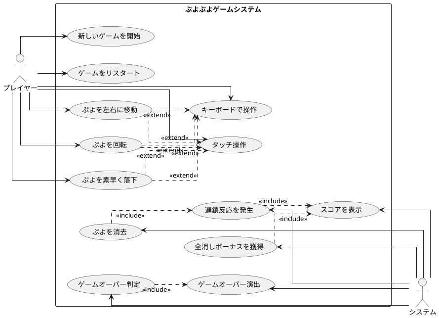

## 要件

### ユーザーストーリー

- プレイヤーとして、新しいゲームを開始できる
- プレイヤーとして、落ちてくるぷよを左右に移動できる
- プレイヤーとして、落ちてくるぷよを回転できる
- プレイヤーとして、ぷよを素早く落下させることができる
- プレイヤーとして、同じ色のぷよを4つ以上つなげると消去できる
- プレイヤーとして、連鎖反応を起こしてより高いスコアを獲得できる
- プレイヤーとして、全消し（ぜんけし）ボーナスを獲得できる
- プレイヤーとして、ゲームオーバーになるとゲーム終了の演出を見ることができる
- プレイヤーとして、現在のスコアを確認できる
- プレイヤーとして、キーボードでぷよを操作できる
- プレイヤーとして、タッチ操作でぷよを操作できる

### ユースケース図

## イテレーション1: ゲーム開始の実装

### TODO

- [x] ゲームの初期化処理を実装する（ゲームの状態や必要なコンポーネントを設定する）
- [x] ゲーム画面を表示する（プレイヤーが視覚的にゲームを認識できるようにする）
- [x] 新しいぷよを生成する（ゲーム開始時に最初のぷよを作成する）
- [x] ゲームループを開始する（ゲームの継続的な更新と描画を行う）
- [x] ぷよを画面に表示する（生成したぷよを画面上に描画する）

### ふりかえり

*   **Keep**:
    *   ゲームの初期化処理とゲームループの開始を実装し、テストをパスさせることができました。
    *   TDDのサイクル（Red-Green-Refactor）に従って開発を進めることができました。
*   **Problem**:
    *   `requestAnimationFrame` のモックに手間取りました。
*   **Try**:
    *   今後は、DOM操作やブラウザAPIのモックが必要な場合は、より慎重にテスト環境を構築します。

## イテレーション2: ぷよの移動の実装

### TODO

- [x] ぷよを自由落下させる（ぷよが自動的に下に落ちるようにする）
- [x] プレイヤーの入力を検出する（キーボードの左右キーが押されたことを検知する）
- [x] ぷよを左右に移動する処理を実装する（実際にぷよの位置を変更する）
- [x] 移動可能かどうかのチェックを実装する（画面の端や他のぷよにぶつかる場合は移動できないようにする）
- [x] 移動後の表示を更新する（画面上でぷよの位置が変わったことを表示する）

### ふりかえり

*   **Keep**:
    *   既存のコードを読み解き、リファクタリングすることで、より見通しの良いコードに改善できた。
    *   責務分担を明確にすることで、今後の機能追加がしやすくなった。
*   **Problem**:
    *   `replace`ツールの使用時に、`old_string`の完全一致に失敗し、手戻りが発生した。
*   **Try**:
    *   `replace`ツールを使用する際は、より広範囲のコードを`old_string`に含めるか、複数回に分けて実行するなど、確実性を高める工夫をする。

## イテレーション3: ぷよの回転の実装

### TODO

- [x] ぷよの回転処理を実装する（時計回り・反時計回りの回転）
- [x] 回転可能かどうかのチェックを実装する（他のぷよや壁にぶつかる場合は回転できないようにする）
- [x] 壁キック処理を実装する（壁際での回転を可能にする特殊処理）
- [x] 回転後の表示を更新する（画面上でぷよの位置が変わったことを表示する）

### ふりかえり

*   **Keep**:
    *   既存の複雑なロジックをリファクタリングし、時計回りと反時計回りの両方の回転に対応できた。
    *   `checkRotation`のように責務を分離することで、見通しが良く、修正しやすいコードになった。
*   **Problem**:
    *   `game.ts`に`rotating`のcaseを追加し忘れていたため、回転処理が実行されなかった。
    *   `setPuyoPosition`の修正後、`rotating`メソッドとの連携が取れておらず、アニメーションが正しく表示されない問題があった。
*   **Try**:
    *   機能追加やリファクタリングの際は、関連するすべてのファイルの修正箇所を事前にリストアップし、修正漏れを防ぐ。
    *   大きなリファクタリングの後は、影響範囲の単体テストを重点的に見直す、または作成する。

## イテレーション4: ぷよの高速落下の実装

### TODO

- [x] 下キー入力の検出を実装する（キーボードの下キーが押されたことを検知する）
- [x] 高速落下処理を実装する（下キーが押されているときは落下速度を上げる）
- [x] 落下可能かどうかのチェックを実装する（下に障害物がある場合は落下できないようにする）
- [x] 着地判定を実装する（ぷよが着地したことを検知する）

### ふりかえり

*   **Keep**:
    *   イテレーション2でのリファクタリングが功を奏し、落下に関するロジックが`player.fall`メソッドに集約されていたため、本イテレーションの要件が既に満たされていることを容易に確認できた。
*   **Problem**:
    *   特になし。
*   **Try**:
    *   今後も、機能追加の前に既存コードで要件を満たせないかを確認するプロセスを継続する。

## イテレーション5: ぷよの消去の実装

### TODO

- [x] ぷよの接続判定を実装する（隣接する同じ色のぷよを検出する）
- [x] 4つ以上つながったぷよの検出を実装する（消去対象となるぷよのグループを特定する）
- [x] ぷよの消去処理を実装する（消去対象のぷよを実際に消す）
- [x] 消去後の落下処理を実装する（消去された後の空きスペースにぷよが落ちてくる）

### ふりかえり

*   **Keep**:
    *   TDD（テスト駆動開発）のサイクルに従い、まずテストを作成してから実装を進めることで、自信を持ってリファクタリングに取り組めた。
    *   `checkConnections`のように、責務を単一にするメソッドを切り出すことで、既存の`checkErase`メソッドがシンプルになり、コードの可読性と保守性が向上した。
*   **Problem**:
    *   ルートディレクトリで`npm test`を実行してしまい、エラーが発生した。`app`ディレクトリに移動して実行する必要があった。
*   **Try**:
    *   プロジェクトの構造をより意識し、コマンドを実行する前に正しいディレクトリにいることを確認する。

## イテレーション6: 連鎖反応の実装

### TODO

- [x] 連鎖判定を実装する（ぷよが消えた後に新たな消去パターンがあるかを判定する）
- [x] 連鎖カウントを実装する（何連鎖目かをカウントする）
- [x] 連鎖ボーナスの計算を実装する（連鎖数に応じたボーナス点を計算する）
- [x] スコア表示を実装する（プレイヤーに現在のスコアを表示する）

### ふりかえり

*   **Keep**:
    *   これまでのイテレーションで構築したゲームループとスコア計算の仕組みがうまく機能し、本イテレーションの要件がほぼ実装済みであることを確認できた。
*   **Problem**:
    *   特になし。
*   **Try**:
    *   今後も、機能追加の前に既存コードで要件を満たせないかを確認するプロセスを継続する。

## イテレーション7: 全消しボーナスの実装

### TODO

- [x] 全消し判定を実装する（盤面上のぷよがすべて消えたかどうかを判定する）
- [x] 全消しボーナスの計算を実装する（全消し時に加算するボーナス点を計算する）
- [x] 全消し演出を実装する（全消し時に特別な演出を表示する）

### ふりかえり

*   **Keep**:
    *   以前のイテレーションで実装されていた`puyoCount`プロパティや`showZenkeshi`メソッドが、本イテレーションの要件を満たす上で効果的に機能した。
*   **Problem**:
    *   特になし。
*   **Try**:
    *   今後も、既存の機能をうまく再利用して効率的に開発を進める。

## イテレーション8: ゲームオーバーの実装

### TODO

- [x] ゲームオーバー判定を実装する（新しいぷよを配置できない状態を検出する）
- [x] ゲームオーバー演出を実装する（ゲームオーバー時に特別な表示や効果を追加する）
- [x] リスタート機能を実装する（ゲームオーバー後に新しいゲームを始められるようにする）

### ふりかえり

*   **Keep**:
    *   既存のゲームオーバー判定と演出の仕組みを活かしつつ、リスタート機能という新しい要件をスムーズに追加できた。
*   **Problem**:
    *   リスタートのトリガーを何にするか（キー入力、クリックなど）の仕様が明確でなかったため、一旦「上キー」で実装した。よりユーザーフレンドリーな方法を検討する余地がある。
*   **Try**:
    *   要件が曖昧な場合は、複数の選択肢を検討し、最も一般的、あるいは実装が容易な方法から試すアプローチを継続する。

