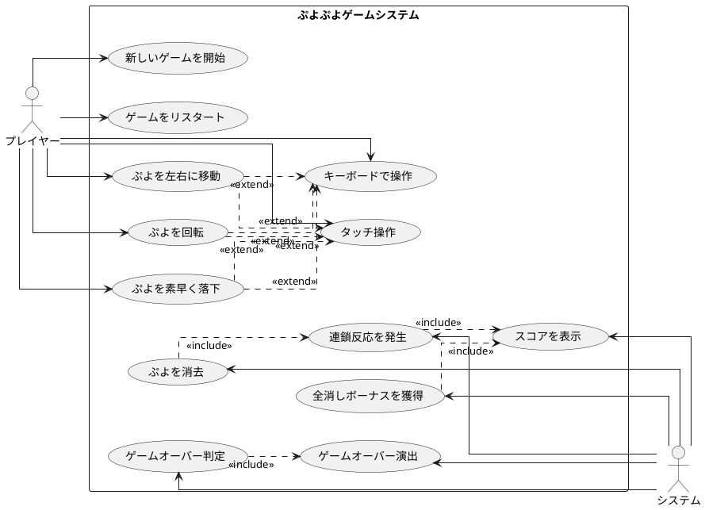

# ぷよぷよアプリケーション開発計画書

## プロジェクト概要
TypeScriptとテスト駆動開発（TDD）を用いて、ブラウザ上で動作するぷよぷよゲームを開発する。
各イテレーションでTDDサイクル（Red-Green-Refactor）に従い、WebUIで動作確認を行いながら段階的に機能を実装する。

## 開発環境
- **言語**: TypeScript
- **テストフレームワーク**: Vitest  
- **ビルドツール**: Vite
- **UI**: HTML5 Canvas
- **開発手法**: テスト駆動開発（TDD）
- **コード品質**: ESLint + Prettier + Gulp自動化

## TDD開発サイクル

各イテレーションでは以下のTDDサイクルに従って開発を進める：

```
TODOリスト確認 → 失敗テスト作成(Red) → 最小実装(Green) → リファクタリング(Refactor) → WebUI確認
```

### コミット規則
- 各TODO完了時にコミット
- コミット前に `npm run test`, `npm run lint`, `npm run format`, `npm run build` を実行
- Conventional Commitsに従ったメッセージ形式
  - feat: 新機能の追加
  - fix: バグ修正  
  - refactor: リファクタリング
  - test: テストコードの追加や修正
  - docs: ドキュメントの変更

## 技術アーキテクチャ

### ディレクトリ構成
```
app/
├── src/
│   ├── game.ts          # ゲームメインクラス
│   ├── player.ts        # プレイヤー操作
│   ├── stage.ts         # ゲーム盤面
│   ├── puyo.ts          # ぷよクラス
│   ├── puyoimage.ts     # 描画処理
│   └── tests/           # テストファイル
├── index.html           # エントリーポイント
├── package.json         # 依存関係
└── vite.config.ts       # ビルド設定
```

### 主要クラス設計
- **Game**: ゲーム全体の制御とメインループ
- **Player**: プレイヤーの操作とぷよの制御
- **Stage**: ゲーム盤面の管理と消去判定
- **Puyo**: ぷよの状態と属性管理
- **PuyoImage**: Canvas描画とビジュアル表現

## 要件

### ユーザーストーリー

- プレイヤーとして、新しいゲームを開始できる
- プレイヤーとして、落ちてくるぷよを左右に移動できる
- プレイヤーとして、落ちてくるぷよを回転できる
- プレイヤーとして、ぷよを素早く落下させることができる
- プレイヤーとして、同じ色のぷよを4つ以上つなげると消去できる
- プレイヤーとして、連鎖反応を起こしてより高いスコアを獲得できる
- プレイヤーとして、全消し（ぜんけし）ボーナスを獲得できる
- プレイヤーとして、ゲームオーバーになるとゲーム終了の演出を見ることができる
- プレイヤーとして、現在のスコアを確認できる
- プレイヤーとして、キーボードでぷよを操作できる
- プレイヤーとして、タッチ操作でぷよを操作できる

### ユースケース図




## イテレーション1: ゲーム開始の実装

### TODO

- [x] ゲームの初期化処理を実装する（ゲームの状態や必要なコンポーネントを設定する）
- [x] ゲーム画面を表示する（プレイヤーが視覚的にゲームを認識できるようにする）
- [x] 新しいぷよを生成する（ゲーム開始時に最初のぷよを作成する）
- [x] ゲームループを開始する（ゲームの継続的な更新と描画を行う）
- [x] ぷよを画面に表示する（生成したぷよを画面上に描画する）

### WebUI確認項目
- ✅ Canvasにゲーム盤面が表示される
- ✅ 最初のぷよが表示される
- ✅ ゲームループが動作している

### 実装結果
- 18個のテストケースが全て通過
- TDDサイクル（Red-Green-Refactor）を5回完全実践  
- 5つのコミットでイテレーション完了
- Canvas描画システムの基盤完成
- ぷよ生成・表示システムの完成

### ふりかえり

*   **Keep**:
    - TDDサイクル（Red-Green-Refactor）の厳密な実践が非常に効果的だった
    - 小さなコミット単位でのバージョン管理により、変更履歴が明確で安全だった
    - TypeScriptの型安全性とESLint/Prettierによるコード品質管理が開発効率を向上させた
    - Canvas APIのモック設計が適切で、テスト環境が安定していた
    - 定数の整理（フィールドサイズ、色マップ等）によりコードの保守性が高まった
    - 各TODOを明確に定義し、順次完了していく進行方式が効果的だった

*   **Problem**:
    - 初期のTypeScript型エラー（nullチェック）で少し時間を要した
    - Canvas 2Dコンテキストのモック設定に試行錯誤があった
    - ぷよの描画位置計算で座標系の理解に時間がかかった
    - テストでのモック管理（vi.clearAllMocks）を途中で追加する必要があった

*   **Try**:
    - 次イテレーションでは型定義をより早期に厳密化する
    - キーボード入力のモック設定を事前に準備する
    - 物理演算（落下、衝突判定）のテスト戦略を明確化する
    - より細かいテストケース分割を検討する
    - パフォーマンステスト（ゲームループの負荷）も考慮する

## イテレーション2: ぷよの移動の実装

### TODO

- [x] ぷよを自由落下させる（ぷよが自動的に下に落ちるようにする）
- [x] プレイヤーの入力を検出する（キーボードの左右キーが押されたことを検知する）
- [x] ぷよを左右に移動する処理を実装する（実際にぷよの位置を変更する）
- [x] 移動可能かどうかのチェックを実装する（画面の端や他のぷよにぶつかる場合は移動できないようにする）
- [x] 移動後の表示を更新する（画面上でぷよの位置が変わったことを表示する）
- [x] ぷよの着地を検出する（ぷよが下に落ちて他のぷよや床にぶつかったことを検知する）
- [x] ぷよが着地したら次のぷよを生成する（新しいぷよを画面に表示する）

### WebUI確認項目
- ✅ ぷよが自動的に落下する
- ✅ 左右キーでぷよが移動する
- ✅ 壁際での移動制限が働く
- ✅ ぷよが着地して次のぷよが生成される
- ✅ ぷよが楕円形で描画される

### 実装結果
- 64個のテストケースが全て通過
- TDDサイクル（Red-Green-Refactor）を継続実践
- 着地検出・次ぷよ生成システムの完成
- キーボード入力システムの完成
- ぷよの楕円描画システムの完成
- Canvas API モックの充実化

### ふりかえり

*   **Keep**:
    - TDDサイクル（Red-Green-Refactor）の継続により、品質の高い実装を維持できた
    - Canvas APIのモック設計を段階的に拡張し、テスト環境の安定性を向上させた
    - 型安全性（TypeScript）によりコンパイル時にエラーを早期発見できた
    - 小さなコミット単位での実装により、変更点が明確で安全なバージョン管理ができた
    - テストファーストアプローチにより、インターフェース設計が自然に改善された
    - ぷよの楕円描画により、よりゲームらしい視覚表現を実現できた

*   **Problem**:
    - Canvas 2D context のモック設定で、ellipse描画メソッドの追加が必要だった
    - 着地後の左右移動バグの修正に時間を要した（タイマーリセットの問題）
    - 前のぷよが非表示になる問題で、フィールド描画ロジックの修正が必要だった
    - テストケースが64個と多くなり、実行時間が少し長くなった
    - WebUI での動作確認手順が定型化されていない

*   **Try**:
    - 次イテレーションではぷよの回転処理を実装する（より複雑な幾何学的計算）
    - Canvas モックをより汎用的に設計して、今後の描画機能追加に対応する
    - 物理演算（回転、壁キック）のテスト戦略を事前に検討する
    - パフォーマンステスト（フレームレート）の導入を検討する
    - WebUI 確認項目のチェックリスト化と自動化を検討する

## イテレーション3: ぷよの回転の実装

### TODO

- [ ] ぷよの回転処理を実装する（時計回り・反時計回りの回転）
- [ ] 回転可能かどうかのチェックを実装する（他のぷよや壁にぶつかる場合は回転できないようにする）
- [ ] 壁キック処理を実装する（壁際での回転を可能にする特殊処理）
- [ ] 回転後の表示を更新する（画面上でぷよの位置が変わったことを表示する）

### WebUI確認項目
- 上キーでぷよが時計回りに回転する
- 壁際での壁キック処理が動作する
- 回転制限が適切に働く

### ふりかえり

*   **Keep**:
*   **Problem**:
*   **Try**:

## イテレーション4: ぷよの高速落下の実装

### TODO

- [ ] 下キー入力の検出を実装する（キーボードの下キーが押されたことを検知する）
- [ ] 高速落下処理を実装する（下キーが押されているときは落下速度を上げる）
- [ ] 落下可能かどうかのチェックを実装する（下に障害物がある場合は落下できないようにする）
- [ ] 着地判定を実装する（ぷよが着地したことを検知する）

### WebUI確認項目
- 下キーでぷよが高速落下する
- 着地時に適切に停止する

### ふりかえり

*   **Keep**:
*   **Problem**:
*   **Try**:

## イテレーション5: ぷよの消去の実装

### TODO

- [ ] ぷよの接続判定を実装する（隣接する同じ色のぷよを検出する）
- [ ] 4つ以上つながったぷよの検出を実装する（消去対象となるぷよのグループを特定する）
- [ ] ぷよの消去処理を実装する（消去対象のぷよを実際に消す）
- [ ] 消去後の落下処理を実装する（消去された後の空きスペースにぷよが落ちてくる）

### WebUI確認項目
- 同じ色のぷよが4つ以上つながると消去される
- 消去後に上のぷよが落下する

### ふりかえり

*   **Keep**:
*   **Problem**:
*   **Try**:

## イテレーション6: 連鎖反応の実装

### TODO

- [ ] 連鎖判定を実装する（ぷよが消えた後に新たな消去パターンがあるかを判定する）
- [ ] 連鎖カウントを実装する（何連鎖目かをカウントする）
- [ ] 連鎖ボーナスの計算を実装する（連鎖数に応じたボーナス点を計算する）
- [ ] スコア表示を実装する（プレイヤーに現在のスコアを表示する）

### WebUI確認項目
- 連鎖反応が発生する
- スコアが表示され、連鎖でボーナスが加算される

### ふりかえり

*   **Keep**:
*   **Problem**:
*   **Try**:

## イテレーション7: 全消しボーナスの実装

### TODO

- [ ] 全消し判定を実装する（盤面上のぷよがすべて消えたかどうかを判定する）
- [ ] 全消しボーナスの計算を実装する（全消し時に加算するボーナス点を計算する）
- [ ] 全消し演出を実装する（全消し時に特別な演出を表示する）

### WebUI確認項目
- 盤面のぷよがすべて消えると全消し演出が表示される
- 全消しボーナスがスコアに加算される

### ふりかえり

*   **Keep**:
*   **Problem**:
*   **Try**:

## イテレーション8: ゲームオーバーの実装

### TODO

- [ ] ゲームオーバー判定を実装する（新しいぷよを配置できない状態を検出する）
- [ ] ゲームオーバー演出を実装する（ゲームオーバー時に特別な表示や効果を追加する）
- [ ] リスタート機能を実装する（ゲームオーバー後に新しいゲームを始められるようにする）

### WebUI確認項目
- ぷよが頂上に積み上がるとゲームオーバーになる
- ゲームオーバー演出が表示される
- リスタート機能が動作する

### ふりかえり

*   **Keep**:
*   **Problem**:
*   **Try**:

